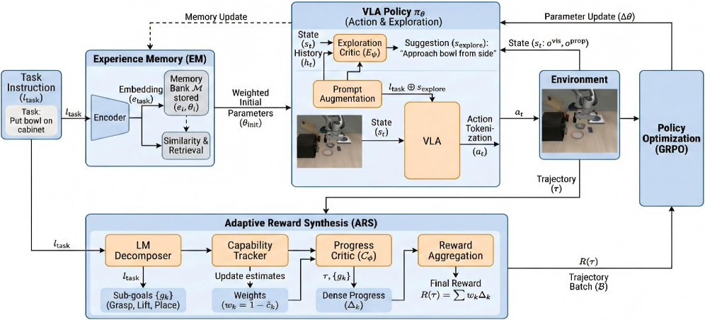
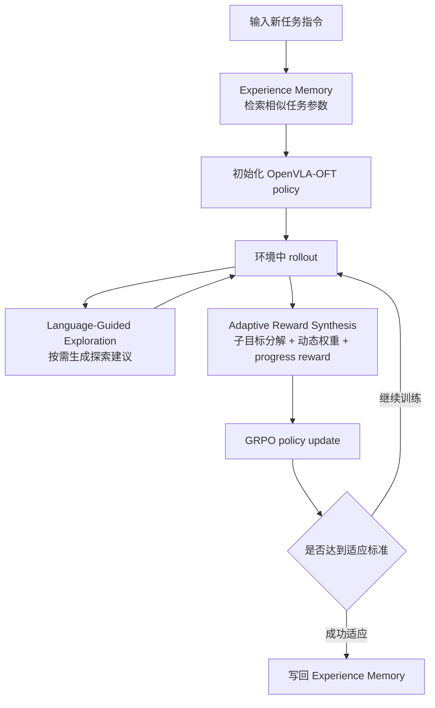
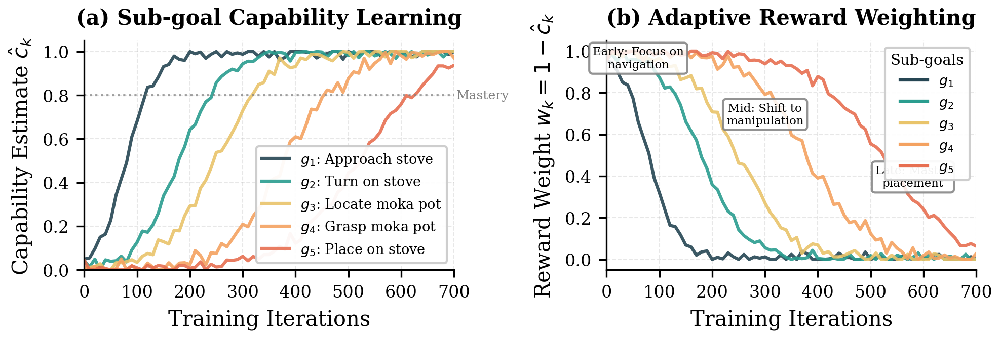
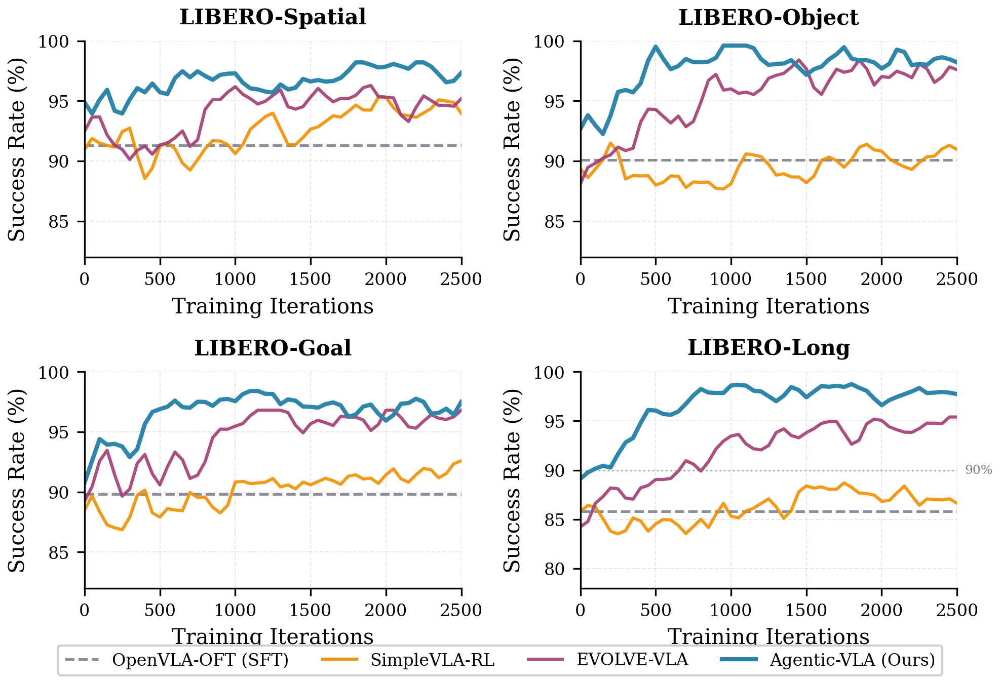
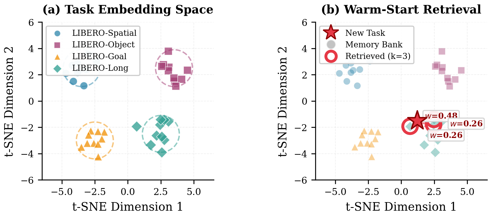

# Agentic-VLA: Enabling VLA to adapt online to tasks

> Introduction to this paper: **Agentic-VLA: Efficient Online Adaptation for Vision-Language-Action Models**. The arXiv paper ID is `2605.22896v1`, submitted on May 21, 2026. The authors are Ruofan Jin and Zaixi Zhang.

## 1. What Problem Online Adaptation Solves

Agentic-VLA is neither a world model nor a new robot simulation tool. It addresses a core issue after the deployment of VLA: if an existing VLA performs poorly in new tasks or scenarios, can it no longer rely entirely on manual retraining, but instead adapt more quickly through online interaction, language feedback, dynamic rewards, and experience memory.

Its key term is **online adaptation**. The traditional VLA training process is usually:

```text
Expert demonstrations -> SFT / BC -> offline evaluation -> deployment
```

Agentic-VLA wants to change the second half to:

```text
OpenVLA-OFT base policy
    -> encounter a new task
    -> retrieve similar task weights from Experience Memory
    -> collect online rollouts
    -> receive exploration guidance
    -> synthesize stage-aware rewards
    -> update the policy with GRPO
    -> write the adapted policy back to memory
```

It is related to LWD, PRTS, and RAW-Dream through their shared goal of improving policies beyond offline behavior cloning, but each takes a different route:

- LWD explains how to use deployment data to perform offline-to-online RL for real robot clusters.
- PRTS discusses how to enable VLA's awareness of target accessibility during the pre-training phase.
- RAW-Dream covers how to implement imagined RL within a task-irrelevant world model.
- Agentic-VLA explains how to integrate reward synthesis, exploration critic, and task memory into a agentic online adaptation loop.

One-sentence summary:

> The core of Agentic-VLA is not about replacing the VLA base, but adding an online adaptation outer loop to OpenVLA-OFT that designs rewards, guides exploration, and reuses the old task weights.

## 2. Paper, Code, and Reproduction Entry

| Entry | Link | Current Status |
| :--- | :--- | :--- |
| Paper | [arXiv:2605.22896](https://arxiv.org/abs/2605.22896) / [HTML](https://arxiv.org/html/2605.22896v1) / [PDF](https://arxiv.org/pdf/2605.22896) | Submitted on 2026-05-21 |
| Project Page | No official independent project page found yet | The main public entry is arXiv |
| Code | No official GitHub repository found | Experiments can be reproduced using the paper’s method, but not suitable for a one-click reproduction guide |
| Basic Policy | OpenVLA-OFT | The paper experiments apply Agentic-VLA to OpenVLA-OFT and use discrete action tokens to adapt for RL |
| Main Benchmarks | LIBERO, RoboTwin 2.0 | Both are existing public benchmarks; not new benchmarks created by the authors alone |

As of the time this article was compiled, no official code repository for Agentic-VLA was found on the author’s public platform. Therefore, the tutorial only covers the methods, modules, experimental results, and reproduction design boundaries, without providing commands that pretend to directly reproduce the results presented in the paper. To truly reproduce the system, one needs to set up OpenVLA-OFT, LIBERO / RoboTwin 2.0, GRPO, progress critic, VLM exploration critic, and experience memory by oneself.

## 3. Overview Diagram: Three Types of Agents Form the Online Adaptation Outer Loop



**Figure 1: Overview of the Agentic-VLA framework.** The entire system is not a single VLA model, but an online adaptation closed loop built around the VLA policy: Experience Memory handles the warm start, Language-Guided Exploration handles structured exploration, and Adaptive Reward Synthesis converts task progress into optimizable rewards.
Source: [arXiv HTML: Agentic-VLA](https://arxiv.org/html/2605.22896v1).

This image can be read from right to left.

On the right side is **Experience Memory**. It stores the task weights and task semantic embeddings that have been adapted. When encountering a new task, the system first retrieves similar tasks based on the task instructions, then combines the policy parameters of these similar tasks with weighting to serve as the initialization for the new task. This approach solves the problem of "slow cold start for each task from the same base model".

The middle part is **VLA policy + online rollout**. The base policy is OpenVLA-OFT, with inputs still being visual observation, proprioception, and language tasks, and outputs being discrete action token sequences. Agentic-VLA does not replace VLA with an agent; instead, several agents responsible for scheduling the training process are added during the VLA interaction.

The bottom left shows **Language-Guided Exploration**. Ordinary RL is very inefficient for random exploration in high-dimensional robot action spaces. Agentic-VLA uses VLM to analyze the current RGB image, task instructions, and recent trajectory, and generates a short manipulation suggestion, such as “approach from the left”, “grasp the point closer to the center”, or “reduce the action amplitude”. This suggestion is only concatenated into the task prompt during the exploration phase, making it more likely for the policy to sample better actions.

Top left is **Adaptive Reward Synthesis**. In real deployment, there is usually no perfect oracle reward; using only a binary reward of success/failure is too sparse. ARS first breaks down long-term tasks into sub-targets, and then adjusts the reward weights based on whether each sub-target has already learned. If the model gets stuck in a specific sub-target, the weight of that sub-target is increased; if it has mastered it at a certain stage, the training weight for that sub-target is reduced, shifting the learning focus to the subsequent bottleneck.

Finally, the policy is updated using **GRPO**. The group size, max rollout horizon, and batch size provided in the paper appendix are `8`, `500`, and `32`, respectively. After successful adaptation, the policy parameters are written back into the memory bank for warm start of similar tasks in the future.

## 4. Disassembly of three core modules

### 4.1 Adaptive Reward Synthesis: Rewards are not fixed in stone

The most difficult aspect of online adaptation for VLA is the rewards. Real robot tasks often do not involve "clear numerical rewards at each step," but it is only at the end that we know whether the task was successful. For example, with the task “turn on the stove and place the moka pot on the stove,” if we only consider the final success, the intermediate stages such as getting close to the stove, turning the knob, finding the moka pot, grasping the moka pot, and placing the moka pot all lack training signals.

ARS did three things.

First, **task decomposition**. It breaks down long instructions into sub-targets using a language model:

```text
turn on the stove and put the moka pot on it
    -> locate and approach the stove
    -> turn on the stove
    -> locate the moka pot
    -> grasp the moka pot
    -> place the pot on the stove
```

Second, **capability estimation**. The system maintains an exponential moving average of the recent success rate for each sub-target. This estimation is not for final evaluation, but to determine where the current training phase is stuck.

Third, **dynamic reward weight**. For sub-targets that have been mastered, the reward weight decreases; for sub-targets that have not been mastered, the reward weight remains high. This naturally forms a curriculum: first learn to approach and grasp the basics, then gradually shift the learning pressure to subsequent combined actions.

The results on task decomposition quality in the paper are highly representative: without decomposition, the success rate of LIBERO-Long is `91.3%`; a fixed three-step template yields `93.8%`; the language model generation subgoal is `98.1%`; and the artificial oracle subgoal is `98.4%`. This indicates that its LM decomposition is not just a few arbitrary explanations, but a training structure very close to an artificial milestone.

### 4.2 Language-Guided Exploration: Exploration is not random jittering

The action space of VLA is very complex. Models like OpenVLA-OFT generate action token chunks via autoregressive generation, relying solely on random sampling to explore possibilities. Many rollouts are wasted in obviously unreasonable directions: incorrect angles, edge positions for grasping, failure to bypass obstacles, or continuing to increase the action despite overshooting in the previous round.

LGE's approach is to treat VLM as an exploration critic. It does not directly output robot actions, but rather provides a short natural language suggestion. The prompt provided in the paper appendix instructs VLM to act as a robotics expert, observing the current image and task instructions, considering gripper pose, approach angle, collision, grasp point, and stability, and then offering a specific suggestion.

This suggestion will be concatenated into the VLA task prompt:

```text
原任务：pick up the bowl and place it on the plate
探索建议：approach from the side to avoid collision
增强 prompt：pick up the bowl and place it on the plate. approach from the side to avoid collision
```

Pay attention to the two boundaries.

First, LGE is used only during the exploration phase. During evaluation, the policy still executes based on the original task instructions, without relying on additional suggestions.

Second, the recommendation frequency will decrease as the training progresses. At the beginning when the policy is weak, the recommendation is more frequent; when the recent rewards increase, the recommendation frequency decreases so that the policy can act on its own. This can reduce over-reliance on the VLM prompt.

This is different from the routed visual evidence in VisualThink-VLA. VisualThink-VLA focuses on the visual evidence used at each step of reasoning; the LGE in Agentic-VLA is more like an exploration coach during training, transforming the exploration direction from "blind sampling" to "structured trial and error" using language.

### 4.3 Experience Memory: Similar tasks don't need a cold start every time

Experience Memory stores three types of information:

| Field | Meaning |
| :--- | :--- |
| task embedding | Obtained by the frozen language encoder from the task instruction |
| adapted policy parameters | Policy parameters after adaptation for this task |
| metadata | Success rate, number of training iterations, task complexity, etc. |

When encountering a new task, the system first calculates the new task embedding, retrieves several most similar memory entries, and then obtains the initialization parameters using similarity weighting. The paper uses memory capacity `100`, retrieval top-k as `3`, and temperature as `0.1`.

The most confusing concept here is "weight averaging". Generally, averaging the weights of two independently trained neural networks is dangerous, as they may lie in different loss basins. The Agentic-VLA paper specifically explains why this is relatively feasible:

- All policies start from the same OpenVLA-OFT initialization.
- The online adaptation of each task is a local update, not fully independent training.
- The retrieval is precise, selecting only a few tasks that are semantically relevant.
- The weighted results serve only as a warm start, and further online adaptation corrections will be applied later.

So this is not a general model merge, but a warm-start heuristic for several task-local adapter / policy parameters on the same base VLA.

## 5. Training closed loop: How it actually works

The training loop for Agentic-VLA can be written as the following process:



The most crucial aspect of this process is the **agentic training process**, not the **agentic execution policy**. In other words, when VLA executes actions, it still operates as an action policy; the agentic component is mainly responsible for designing rewards for the training process, guiding exploration, and reusing experiences.

If it is interpreted as simply "VLA becoming a general robot agent that can plan, call tools, and reflect on long-term issues by itself," it would be an overstatement. A more accurate description of its value is: automating part of the three most difficult aspects of online RL for engineering implementation.

## 6. Result Chart: Where Are the Key Improvements on LIBERO



**Figure 2: Main experimental results of Agentic-VLA.** The figure shows the success rates, low data settings, cross-task transfer, and training efficiency for each suite in LIBERO. The key conclusion is that improvement does not come solely from more RL iterations, but from the combination of reward decomposition, language exploration, and experience memory.
Source: [ arXiv HTML: Agentic-VLA](https://arxiv.org/html/2605.22896v1).

In the main paper table, Agentic-VLA outperforms OpenVLA-OFT and EVOLVE-VLA in all four suites of LIBERO:

| Method | Spatial | Object | Goal | Long | Avg |
| :--- | ---: | ---: | ---: | ---: | ---: |
| OpenVLA-OFT | 91.3 | 90.1 | 89.8 | 85.8 | 89.2 |
| EVOLVE-VLA | 95.4 | 97.4 | 95.8 | 94.4 | 95.8 |
| Agentic-VLA | 97.2 | 98.6 | 97.4 | 98.1 | 97.8 |

The most worth watching is Long. OpenVLA-OFT on LIBERO-Long is `85.8%`, Agentic-VLA is `98.1%`, and `+12.3` is improved. This aligns with the method design: long-term tasks rely more on sub-goal rewards, structured exploration, and task memory.

The low data setting is also quite persuasive. In 1-shot learning, OpenVLA-OFT has an average `43.6%`, EVOLVE-VLA has `61.3%`, and Agentic-VLA has `70.5%`. This indicates that it is not just a bonus in a sufficient setup with 50 demos, but can also compensate for data deficiency through online adaptation under limited training conditions.

The cross-task transfer experiment starts from LIBERO-Long training and does not provide task-specific demonstrations on LIBERO-Object. SFT direct transfer is `0.0%`, EVOLVE-VLA is `20.8%`, and Agentic-VLA is `31.2%`. This value is still far from full supervision, but the meaning from 0 to 31.2 is that online adaptation + memory + guided exploration can at least enable the model to find some feasible strategies without target task demonstrations.

In terms of training efficiency, Agentic-VLA achieves a success rate of 90% on LIBERO-Long with `700` iterations / `22.4k` rollouts; EVOLVE-VLA requires `1680` iterations / `53.8k` rollouts; SimpleVLA-RL needs `2450` iterations / `78.4k` rollouts. The paper states that it converges approximately `2.4x` faster, and this advantage mainly comes from memory warm start, reduced ineffective exploration due to LGE, and more intensive learning signals provided by ARS.

## 7. Ablation diagram: None of the three modules are mere decorations



**Figure 3 Analysis of Agentic-VLA components.** A ablation experiment shows that from binary rewards to progress rewards, and then to ARS, LGE, and EM, each module increases the success rate and reduces the number of iterations; performance also declines when a fixed curriculum, RND/ICM, or random retrieval is used instead.
Source: [arXiv HTML: Agentic-VLA](https://arxiv.org/html/2605.22896v1).

The ablation results on LIBERO-Long are clear:

| Configuration | Success Rate | Progress | Iters |
| :--- | ---: | ---: | ---: |
| OpenVLA-OFT SFT only | 85.8 | - | - |
| Vanilla RL binary reward | 87.7 | 0.04 | 2100 |
| Progress reward | 91.3 | 0.20 | 1850 |
| + ARS | 94.6 | 0.31 | 1200 |
| + LGE | 96.2 | 0.38 | 880 |
| + EM | 98.1 | 0.42 | 700 |

This table indicates three things.

First, simply adding vanilla RL is not enough. The binary rewards are too sparse; only the success rate is increased from `85.8` to `87.7`, and the progress is limited.

Second, the progress reward is fundamental, but not everything. It can increase the success rate to `91.3`, indicating that dense progress estimation is indeed more useful than binary rewards. However, without dynamic sub-target weights, fixed reward structures can still limit long tasks.

Thirdly, ARS, LGE, and EM are additive benefits. ARS helps it determine which sub-targets to learn; LGE enables it to explore more effectively; EM allows it to start quickly with similar tasks. Removing any one of them will reduce the effectiveness.

The paper also conducts a controlled comparison: fixed three steps, uniform weight, and learning-progress sampling are all inferior to ARS; intrinsic rewards exploration methods such as RND and ICM are less effective than LGE; random retrieval is inferior to task-similarity-based EM. This is important because it avoids the doubt that "any arbitrary curriculum, exploration bonus, or warm start can improve performance."

## 8. Experience Memory Diagram: It acts like a task-level policy cache



**Figure 4 Experience Memory Analysis.** The memory library links task semantic embeddings with adapted policy parameters, and new tasks obtain a warm start through retrieval from similar tasks; this is more akin to a task-level policy cache rather than a general long-term memory system.
Source: [arXiv HTML: Agentic-VLA](https://arxiv.org/html/2605.22896v1).

The role of Experience Memory can be understood as a policy cache system. It does not store natural language diaries, nor does it store video clips for VLA to watch again. Instead, it stores “which policy parameters are effective after certain tasks are adapted to them”.

For example, what has been learned:

```text
open the drawer and put the bowl inside
put the moka pot on the stove
pick up the bowl and place it on the plate
```

When a new task also follows the structure of "opening containers, picking up objects, and placing them in the target area," memory retrieval will have the policy start near similar tasks, rather than from the base OpenVLA-OFT origin. This approach is particularly valuable in small-sample scenarios and cross-task migration.

But it also has boundaries. One of the failures listed in the paper appendix is **memory interference**: tasks that are semantically similar but have different manipulation requirements may lead to negative transfer. For example, both instructions mention drawer / bowl, but one requires opening the drawer first, while the other needs to bypass obstacles. A wrong warm start can cause the policy to adopt an inappropriate behavior pattern.

Therefore, if you want to reproduce or improve Agentic-VLA later, memory retrieval cannot be based solely on text similarity. A more reliable approach might involve considering both factors simultaneously:

- Task language embedding;
- Initial scene visual embedding;
- Manipulation primitive type;
- End effector and object topology relationship;
- Whether historical adaptation truly improves such tasks.

## 9. Qualitative Diagram: Behavioral Changes Due to Online Adaptation


**Figure 5: Qualitative behavior after online adaptation.** The paper presents error recovery, adaptation to changes in object state, lateral grasping policy discovery, and sub-task ordering suggestions provided by the exploration critic.
Source: [arXiv HTML: Agentic-VLA](https://arxiv.org/html/2605.22896v1).

This set of images is more suitable for understanding "what exactly does online adaptation change".

The first category is **Error Recovery**. A common issue with standard SFT policies is that once the action deviates from the taught trajectory, it continues along the incorrect path until failure occurs. In the milk-to-basket task, Agentic-VLA can adjust the gripper to correct a grasping slip. This behavior is not explicitly planned by the language agent; rather, it arises from repeated failures and recovery states during online exploration, reflecting the closed loop correction ability learned by the policy itself.

The second category is **Adaptive Object Handling**. When the stove knob is accidentally misaligned, SFT often continues to move toward its original position; Agentic-VLA can adjust the trajectory based on the new state. This indicates that online rollout data covers the disturbance conditions beyond the teaching process.

The third category is **Novel Strategy Discovery**. After the LGE critic provides the suggestion of “approaching from the side”, the policy identifies lateral grasping that does not occur during teaching, preventing collisions with surrounding objects. This is the value of language-guided exploration: it does not generate action codes for VLA, but instead directs the exploration toward semantically reasonable areas.

The fourth category is **Exploration Suggestions**. In drawer-and-bowl tasks, the critic suggests opening the drawer first before picking up the bowl, which helps the policy discover the correct sub-task order. In long-term tasks, order errors are a common cause of failure; if only random exploration is used, finding the correct order requires a large number of rollouts.

## 10. Baseline and Experiment Boundaries

The main experiments for Agentic-VLA are not author-built closed-source benchmarks, but existing public benchmarks:

| Baseline | Function | Settings |
| :--- | :--- | :--- |
| LIBERO-Spatial | Spatial relationship generalization | 50 expert demos per task, 50 trials/task, 5 seeds |
| LIBERO-Object | Object generalization | Same as above |
| LIBERO-Goal | Goal combination generalization | Same as above |
| LIBERO-Long | Long-term combined tasks | Agentic-VLA shows the most improvement |
| RoboTwin 2.0 | Dual-arm Aloha AgileX manipulation | 50 clean demos/task, 100 rollouts/task, with Easy / Hard domain randomization |

The results of RoboTwin 2.0 indicate that it is not only effective on the LIBERO single-arm short task. In the average results of the representative subset, Agentic-VLA achieves `62.5%` under Easy and `34.7%` under Hard; compared to RDT, it is `34.5% / 13.7%`, and another baseline is `46.4% / 16.3%`. With randomization applied to clutter, lighting, texture, and table height in the Hard setting, the advantage of Agentic-VLA becomes more evident.

But the boundaries also need to be clearly defined.

First, the paper experiments are still primarily based on simulation. It does not demonstrate a complete online adaptation closed loop on a real robot. The appendix also acknowledges that real deployment will be more complex, requiring the stable integration of perception, VLM language feedback, online policy update, progress reward estimation, and memory retrieval under real observations and safety constraints.

Second, reward hacking still exists. The appendix of the paper mentions that approximately `12%` of failures are related to the fact that the progress estimator is given a high score but the environment assessment fails. This indicates that ARS can alleviate the sparse reward problem, but it cannot guarantee that the learned rewards are exactly consistent with the real success criteria.

Third, there are many system components. OpenVLA-OFT, GRPO, VLAC / progress critic, Llama-3-8B task decomposition, Qwen3-VL-8B-Instruct / exploration critic, and experience memory all need to operate smoothly. For learners, this is not the most suitable paper for "one-click reproduction" with no prior knowledge.

Fourth, the computing power is not small. The paper states that `4 NVIDIA A100 80GB GPUs` was used in the experiment. Training Agentic-VLA with a single LIBERO suite takes approximately `8` hours, EVOLVE-VLA takes about `19` hours, and SimpleVLA-RL takes around `32` hours.

## 11. How to replicate if it is open-sourced later

There is no official code repository currently, so it is not recommended to include specific commands in the tutorial. A more reasonable way to reproduce the scenario is through a layered design.

The first layer is the **LIBERO + OpenVLA-OFT basic policy**. First, ensure that the basic VLA can be rolled out in LIBERO, capable of recording observation, instruction, action tokens, success, progress, and episode metadata.

The second layer is the **progress reward baseline**. Without implementing ARS / LGE / EM, first implement a progress critic or use an available VLAC reward model to run the GRPO update successfully. This baseline is used to prove that the online RL mechanism works.

The third layer is **ARS**. First, perform task decomposition and sub-target progress evaluation, then apply capability-aware reward weights. The most common issues here are whether the sub-targets can be identified and whether the progress signals match the environmental success criteria.

The fourth layer is **LGE**. Generate short exploration suggestions using Qwen3-VL or other local VLM, and only concatenate the prompt during the rollout exploration phase. Track whether the suggestion actually changes behavior to avoid merely increasing inference overhead.

The fifth layer is **EM**. Write the parameters after each task adaptation, task embeddings, success rate, and number of training iterations into the memory bank. First, validate whether the warm start method accelerates performance with a small number of tasks, and then scale it up to more tasks.

The sixth layer is **RoboTwin 2.0 or real robot migration**. This step should not be started directly. It is necessary to address issues such as action space, dual-arm synchronization, safe stopping, domain randomization, and reward definition first. For real robots, it is especially important to perform shadow mode or offline replay verification before allowing online updates of the policy to control hardware without sufficient validation.

## 12. Relationship with recent VLA post-training studies

| Method | Core Issue | Main Mechanism | Difference from Agentic-VLA |
| :--- | :--- | :--- | :--- |
| DiT4DiT | Using a diffusion transformer for action policy | DiT policy + LIBERO training and evaluation | Focus on policy architecture and reproduction |
| RAW-Dream | Does it strengthen VLA within the world model without accepting downstream rollout? | task-agnostic world model + VLM reward + GRPO | Focus on imagined RL and world model |
| PRTS | How to gain awareness of goal accessibility during pre-training of VLA | reward-label-free contrastive RL | Focus on pre-trained representations |
| LWD | How to use real robot deployment data to train shared VLA in reverse | fleet-scale offline-to-online RL + DIVL + QAM | Focus on real robot fleet data wheel |
| VisualThink-VLA | How to think with low latency using visual evidence during reasoning | routed visual evidence + frozen VLA | Low-latency visual intermediate reasoning |
| Agentic-VLA | How to efficiently adapt online for new tasks | ARS + LGE + EM + GRPO | Focus on agentic orchestration during training |

These articles can be read on the same learning thread: VLA cannot rely solely on behavior cloning. The post-training phase becomes increasingly important, and the difference lies in where each article places the “extra information”:

- RAW-Dream places additional information in the imagined world model rollout.
- LWD places additional information in the real deployment data wheel.
- VisualThink-VLA places additional information in the visual evidence reasoning interface.
- Agentic-VLA places additional information during the training process: rewards, exploration, and experience reuse are dynamically scheduled by the agent.

## 13. Recommended Team Learning Topics

The arrangement can be done as follows in Task04:

> Compare LWD, RAW-Dream, VisualThink-VLA, and Agentic-VLA: All four attempt to break through the boundaries of the static SFT VLA, but they use real robot deployment data, world model imagination rollout, visual evidence reasoning, and agentic online adaptation respectively. Please explain where the training signals for each method come from, whether real downstream interactions are required, whether they are suitable for reproduction with a single click, and the main failure risks.

The delivery can be done without running experiments, but you must answer:

- Why isn't Agentic-VLA a new VLA foundation?
- Why is ARS more suitable for long-term tasks than fixed rewards or fixed curricula?
- What is the difference between exploration methods such as LGE and RND / ICM?
- Why isn't Experience Memory just a regular model fusion?
- Which public benchmarks are used in the paper, and which results cannot be generalized to real robots?
- What should be included in the minimal module for a simplified reproduction?

## 14. Source of Information

The images in this article are from [arXiv HTML: Agentic-VLA](https://arxiv.org/html/2605.22896v1). To ensure stable access for the tutorial, it has been saved locally `assets/`. The text content is referenced from [arXiv:2605.22896](https://arxiv.org/abs/2605.22896), [arXiv HTML](https://arxiv.org/html/2605.22896v1), and [PDF](https://arxiv.org/pdf/2605.22896). At the time of this article's compilation, no official independent project page or official GitHub repository was found.
