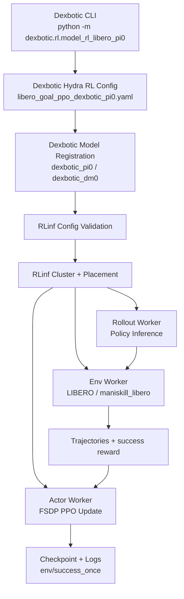

<!-- Generated by the offline translation workflow.
Source: 06-策略抓取或抓取VLA/大模型控制、VLA、VLM/17-Dexbotic-RLinf工程化VLA后训练导读/README.md
Source SHA-256: 794a121b95326adbd7a5ee548827991f7fddd159567821283ac74060094b76c9
Model: tencent/Hy-MT2-1.8B-GGUF:Q4_K_M
Review machine-translated technical claims before relying on them.
-->
# Dexbotic-RLinf: Training with the VLA engineering framework integrated into distributed RL

> Project: Dexbotic + RLinf
> Topic: Using RLinf as the distributed reinforcement learning backend for Dexbotic, performing LIBERO online PPO fine-tuning on VLA policies such as Dexbotic π0 / DM0
> Dexbotic Repository: https://github.com/dexmal/dexbotic
> Dexbotic Documentation: https://dexbotic.com/docs/
> Dexbotic + RLinf Backend Documentation: https://github.com/dexmal/dexbotic/blob/main/docs/RLinfAsRLBackend.md
> RLinf Repository: https://github.com/RLinf/RLinf
> RLinf Dexbotic Example: https://rlinf.readthedocs.io/en/latest/rst_source/examples/embodied/dexbotic.html
> Dexbotic Technical Report: https://arxiv.org/abs/2510.23511

This introduction is suitable to be placed in the VLA section. It is neither a new world model nor introduces a new VLA architecture separately, but rather a typical **VLA engineering-based training combination**: Dexbotic handles the model, data, experimental configuration, and user interface, while RLinf manages distributed rollout, environment workers, actor training, FSDP, logs, and checkpoints. It addresses a practical issue: if existing VLA toolkits want to perform online RL fine-tuning, how can they integrate the model side with the RL infrastructure side, instead of manually moving adapters, checkpoint paths, and task configurations between two repositories each time?

One-sentence summary:

> The value of Dexbotic-RLinf lies not in "inventing another VLA," but in integrating the VLA model development interface with a high-throughput RL backend, enabling Dexbotic π0 / DM0 to undergo configurable and scalable online post-training using PPO on LIBERO.

## 1. Why this combination is needed

VLA reproduction and VLA post-training often get stuck in two opposite issues.

One side is the model repository. The repository is usually familiar with its data format, tokenizer, action head, checkpoint naming, and inference interface, but may not have a mature distributed RL training backend. To add online RL to the model, one must write the rollout worker, environment concurrency, actor update, weight synchronization, logs, checkpoints, and multi-GPU arrangement.

On the other side is the RL infrastructure. RL systems are good at scheduling workers, parallel sampling, optimizing actors, managing logs and checkpoints, but they may not know exactly how a VLA model reads images, proprioception, language prompts, action chunks are generated, how flow matching / flow-SDE parameters are configured, or how the LIBERO evaluator is connected.

The design of Dexbotic-RLinf is to separate these two sides:

- **Dexbotic** continues to serve as the VLA user entrance, retaining model definitions, policy adapter, Dexdata/data processing, Hydra configuration, checkpoint lineage, and evaluation scripts.
- **RLinf** acts as the backend, providing cluster launch, worker placement, rollout collection, environment workers, FSDP actor training, checkpointing, logging, and embodied RL orchestration.

This is cleaner than "copying the Dexbotic model code into RLinf" and more realistic than "having Dexbotic rewrite a RL system by itself".

## 2. What is Dexbotic itself?


**Figure 1 Overview of the Dexbotic toolbox.** Dexbotic organizes robot data, VLM/Action Expert model layer, experimental layer, cloud/local training infrastructure, and simulation/real robot testing interfaces into a VLA development toolbox.
Source: [dexmal/dexbotic official repository resources/intro.png](https://github.com/dexmal/dexbotic).

Dexbotic is the open-source VLA toolbox developed by Dexmal. The official README and technical reports emphasize that it is a one-stop VLA development toolbox, aiming to enable users to reproduction, fine-tune, infer, and evaluate multiple mainstream VLA methods in the same environment.

As shown in Figure 1, the core of Dexbotic consists of three layers:

1. **Data Layer**: Standardizes the robot data format, officially known as Dexdata. It describes each episode using video files and jsonl files, where jsonl files record multi-view images, robot status, text prompts, and other information.
2. **Model / Modular Framework Layer**: Breaks down VLA into VLM and Action Expert. The VLM component includes a vision encoder, projector, and LLM; Action Expert can be continuous/discrete action generation modules such as diffusion, flow matching, or autoregression.
3. **Experiment Layer**: Organizes the training pipeline, inference pipeline, and evaluation around an experiment-centric approach. Users modify the Exp script or Hydra configuration rather than manually assembling processes from numerous scattered scripts.

The directions currently supported by Dexbotic include π0, OpenVLA-OFT, CogACT, MemVLA, GR00TN1, NaVILA, etc. It also provides several pre-trained or fine-tuned checkpoints of Dexbotic versions for comparison on benchmarks such as LIBERO, CALVIN, SimplerEnv, ManiSkill2, and RoboTwin2.0.

## 3. What RLinf Does Here

RLinf is a reinforcement learning infrastructure project, aimed at providing Reinforcement Learning Infrastructure for Embodied and Agentic AI. For the Dexbotic chain, RLinf is not a model repository, but rather the online RL execution backend.

The official Dexbotic example for RLinf clearly states: RLinf uses Dexbotic π0 and DM0 as LIBERO action-generation models, and then performs online fine-tuning with PPO. The example covers:

| Item | Description |
| :--- | :--- |
| Environment | LIBERO |
| Algorithm | PPO |
| Task | LIBERO Spatial, Object, Goal, 10 |
| Models | Dexbotic π0, DM0 |
| Hardware | The official example specifies 1 node, 8 GPUs |
| Key Monitoring Metrics | `env/success_once` |

This indicates that Dexbotic-RLinf is not just a theoretical concept, but an actual engineering combination with public documentation, a public repository, and executable configurations. Its goal is to enable users to start from the Dexbotic checkpoint and enter the embodied PPO training loop of RLinf.

## 4. Two startup methods: RLinf as frontend, or RLinf as backend

This is the most confusing part. There are now two valid paths officially.

The first item is **RLinf as a frontend**. Users start the application from the RLinf repository:

```bash
git clone https://github.com/RLinf/RLinf.git
cd RLinf
bash examples/embodiment/run_embodiment.sh libero_spatial_ppo_dexbotic_pi0
```

This path is suitable for those who are already working in the RLinf ecosystem. It is configured under `examples/embodiment/config/`(https://github.com/RLinf/RLinf), for example:

- `libero_spatial_ppo_dexbotic_pi0.yaml`
- `libero_spatial_ppo_dexbotic_dm0.yaml`
- `libero_object_ppo_dexbotic_pi0.yaml`
- `libero_goal_ppo_dexbotic_pi0.yaml`
- `libero_10_ppo_dexbotic_pi0.yaml`

The second point is **RLinf as the Dexbotic backend**. Users start it from the Dexbotic repository:

```bash
cd /path/to/dexbotic
python -m dexbotic.rl.model_rl_libero_pi0 --suite=libero_goal
```

This path is the new process emphasized in the official Dexbotic documentation. It allows Dexbotic to act as the user entrance, while RLinf is responsible for the distributed RL backend internally. If the following appears in the startup log:

```text
[Dexbotic RL] Launching from Dexbotic entrypoint with RLinf as backend.
```

This indicates that this training was initiated from the Dexbotic side, and RLinf is used as a backend call, rather than having RLinf act as the top-level frontend.

The training semantics of the two paths should be consistent: under the same model, algorithm, and effective configuration, the underlying components are still RLinf's cluster, placement, actor, rollout, env worker, and EmbodiedRunner. The main differences lie in the entry points and user experience.

## 5. Disassembly of Architecture Links



This diagram can be read as a data flow.

First, the DEXBOTIC side entrance `dexbotic.rl.model_rl_libero_pi0` selects a local RL config, such as `libero_goal_ppo_dexbotic_pi0.yaml`. This configuration combines the environment, model, and training backend. The model type is usually `dexbotic_pi0` or `dexbotic_dm0`, and the training backend can include FSDP and PPO settings.

Then, `dexbotic.rl.rlinf_registry` registers the Dexbotic model in the RLinf model registry. The key mechanism described in the official documentation is:

```python
from rlinf.models import register_model

register_model("dexbotic_pi0", build_dexbotic_pi0, category="embodied", force=True)
```

In distributed workers, Dexbotic will use `RLINF_EXT_MODULE=dexbotic.rl.rlinf_registry` so that each worker can import this registry and call `register()`. In this way, RLinf does not need to embed the Dexbotic model code, and can instantiate the Dexbotic policy through `model_type` just like loading a built-in model.

Finally, `dexbotic.rl._embodied_cli` creates a thin adapter: it validates the configuration, creates the RLinf cluster and placement strategy, starts the actor, rollout, and environment worker groups, and then hands over to `EmbodiedRunner` to run PPO.

The key to this design is not complexity, but clear boundaries: Dexbotic tube model, RLinf tube training system.

## 6. Input/Output and Reward Signals

The observation/action/reward relationship of Dexbotic-RLinf on LIBERO can be summarized in the following table.

| Field | Content | Responsible Person |
| :--- | :--- | :--- |
| Observation | LIBERO camera streams and proprioception | LIBERO / maniskill_libero env worker packaging, Dexbotic processor adaptation |
| Prompt | LIBERO natural language task instructions | Environment and task configuration provided, consumed by Dexbotic policy processor |
| Action | Chunked continuous actions output by Dexbotic π0 / DM0 | Generated by Dexbotic policy backend, called by RLinf rollout worker |
| Reward | LIBERO success signal or simulator reward | Returned by the environment, used by RLinf PPO |
| Log metric | `env/success_once` and other training metrics | Recorded by RLinf logger / TensorBoard |

Also, distinguish the action chunks. In the RLinf Dexbotic example, π0 uses `num_action_chunks: 5`, and DM0 uses `num_action_chunks: 10`. During evaluation, `--action_chunk` should be adjusted accordingly; otherwise, the action horizon and model output will not match.

## 7. How should it be replicated based on public documents?

Here is a guide on what the reader should do, but this tutorial does not run 8 GPUs for online RL locally, nor packages it as a reproduction of experimental results.

### 7.1 Prepare the RLinf Environment

The official recommendation is Docker, as embodied RL is complex. The Docker tag given in the RLinf Dexbotic example is:

```bash
docker run -it --rm --gpus all \
  --shm-size 20g \
  --network host \
  --name rlinf \
  -v .:/workspace/RLinf \
  rlinf/rlinf:agentic-rlinf0.3-maniskill_libero

source switch_env dexbotic
```

If Docker is not used, you can install the embodied bundle from the RLinf repository:

```bash
git clone https://github.com/RLinf/RLinf.git
cd RLinf
bash requirements/install.sh embodied --model dexbotic --env maniskill_libero
source .venv/bin/activate
```

Under domestic networks, you can use mirrors or set `HF_ENDPOINT=https://hf-mirror.com` as recommended by the official guidelines. However, do not include personal tokens or private mirror addresses in public scripts.

### 7.2 Download Dexbotic checkpoint

The RLinf document lists two Hugging Face checkpoints:

```bash
git lfs install
git clone https://huggingface.co/Dexmal/libero-db-pi0
git clone https://huggingface.co/Dexmal/DM0-libero
```

You can also use `huggingface-cli`:

```bash
pip install huggingface-hub
huggingface-cli download Dexmal/libero-db-pi0 --local-dir libero-db-pi0
huggingface-cli download Dexmal/DM0-libero --local-dir DM0-libero
```

After downloading, the same checkpoint path should be provided for both the rollout model and the actor model:

```yaml
rollout:
  model:
    model_path: /path/to/downloaded-checkpoint
actor:
  model:
    model_path: /path/to/downloaded-checkpoint
```

Don’t just change the actor here. In online RL, the rollout worker samples using the old policy, and the actor worker performs PPO updates. If the initialization paths of the two models are different, it will make it difficult to interpret the training behavior.

### 7.3 Start from RLinf side

If it is started from the RLinf repository, you can directly run the example configuration:

```bash
cd /path/to/RLinf
bash examples/embodiment/run_embodiment.sh libero_spatial_ppo_dexbotic_pi0
```

This command will do three things:

1. Load `examples/embodiment/config/libero_spatial_ppo_dexbotic_pi0.yaml`.
2. Create LIBERO actor, rollout, and env workers using `cluster.component_placement`.
3. Run PPO and write logs and checkpoints to `runner.logger.log_path`.

### 7.4 Starting from the Dexbotic side

If you are more interested in the Dexbotic model development experience, you can start from the Dexbotic repository:

```bash
git clone https://github.com/dexmal/dexbotic.git
cd dexbotic
python -m dexbotic.rl.model_rl_libero_pi0 --suite=libero_goal
```

You can also overwrite the config and checkpoint in a Hydra manner:

```bash
python -m dexbotic.rl.model_rl_libero_pi0 \
  --config-name=libero_10_ppo_dexbotic_pi0 \
  actor.model.model_path=/path/to/dexbotic-pi0-checkpoint \
  rollout.model.model_path=/path/to/dexbotic-pi0-checkpoint
```

The official documentation states that the suites supported include:

- `libero_10`
- `libero_90`
- `libero_goal`
- `libero_object`
- `libero_spatial`

### 7.5 Training Monitoring and Independent Evaluation

The most direct metric during training is `env/success_once`. It can be viewed using TensorBoard:

```bash
tensorboard --logdir ./logs --port 6006
```

After training, you can use Dexbotic's LIBERO evaluator for standalone evaluation:

```bash
python toolkits/standalone_eval_scripts/dexbotic/libero_eval.py \
  --config_name db_pi0_libero \
  --pretrained_path /path/to/checkpoint \
  --task_suite_name libero_spatial \
  --num_trials_per_task 50 \
  --action_chunk 5 \
  --num_steps 10
```

DM0 needs to switch configuration and action chunk:

```bash
python toolkits/standalone_eval_scripts/dexbotic/libero_eval.py \
  --config_name dm0_libero \
  --pretrained_path /path/to/checkpoint \
  --task_suite_name libero_spatial \
  --num_trials_per_task 50 \
  --action_chunk 10 \
  --num_steps 10
```

## 8. Its differences from Agentic-VLA, LWD, and PRTS

Dexbotic-RLinf can easily be confused with recent VLA post-training tasks. It is necessary to distinguish between them:

| Task | Focus | Relationship between Dexbotic-RLinf |
| :--- | :--- | :--- |
| Agentic-VLA | Automatic reward synthesis, language-guided exploration, experience memory, enhancing online adaptation efficiency | More like the outer loop beyond the algorithm layer; Dexbotic-RLinf acts as the engineering backend and entry point |
| LWD | Real robot fleet deployment data wheel, offline-to-online RL, QAM / DIVL | LWD emphasizes continuous learning for real robots; current public examples of Dexbotic-RLinf are mainly LIBERO online PPO |
| PRTS | Introducing reward-label-free contrastive RL during VLA pre-training | PRTS is a model training paradigm; Dexbotic-RLinf continues RL fine-tuning using the existing Dexbotic policy |
| Robots That Know What to Ask | Under-specification reward features in human teaching and active questioning | It addresses reward alignment; Dexbotic-RLinf defaults to using environment success/reward for PPO |
| RAW-Dream / GE-Sim | Imagined rollout within the world model or learned simulator | Dexbotic-RLinf does not generate the world; it is not a world model; it connects workers in real/simulation environments and the RL backend |

In a nutshell: This is more like a **VLA post-training engineering framework**, rather than a claim of a single algorithm SOTA.

## 9. What tasks can it be used for in a tutorial?

In team-based learning, Dexbotic-RLinf is suitable for Task04 advanced review, rather than Task02 introductory task. The reason is straightforward:

- It involves Dexbotic, RLinf, LIBERO, ManiSkill-LIBERO, checkpoint, PPO, FSDP, and multi-worker configurations.
- The official examples recommend 1 node with 8 GPUs; ordinary students may not have the computing power to complete the full training.
- What is truly valuable for learning is understanding the engineering boundaries: how the model framework is registered with the RL backend, and how the RL backend connects to actor/rollout/env workers.

Recommended delivery method:

1. Clearly outline the responsibilities of Dexbotic and RLinf.
2. Explain why `dexbotic_pi0` / `dexbotic_dm0` requires a registry bridge.
3. Compare the differences between starting from RLinf side and starting from Dexbotic side.
4. Describe how the checkpoint, action chunk, LIBERO suite, and evaluation scripts for π0 / DM0 correspond to each other.
5. Determine whether training was actually run; if not, only submit the method and engineering chain analysis, and do not fabricate results.

## 10. Reproduction Boundary

This pipeline is open source, and the public access is quite complete: the Dexbotic repository, RLinf repository, Dexbotic technical reports, Dexbotic + RLinf backend documentation, and RLinf Dexbotic examples are all available. However, it still cannot be reproduction at the lightweight notebook level.

Main boundaries include:

- A heavier embodied RL environment is required, and Docker is recommended by the official guidelines;
- Full PPO fine-tuning is recommended with multiple GPUs, while a single GPU is more suitable for configuration reading or short smoke tests;
- The LIBERO environment, ManiSkill-LIBERO dependencies, and rendering backend may introduce additional issues;
- Checkpoint download relies on Hugging Face and Git LFS;
- When starting from the Dexbotic side, the Python environment must include the RLinf embodied runtime;
- The effective configs from different entry points should be consistent, otherwise results cannot be directly compared.

If it is just for learning, it is not recommended to run the full training from the beginning. A more reliable approach is to first read `docs/RLinfAsRLBackend.md`, confirm the roles of registry, entrypoint, config, and worker; then use the RLinf Dexbotic example to perform a short training smoke test; finally, consider the full LIBERO suite evaluation.

## Reference Links

- Dexbotic GitHub: https://github.com/dexmal/dexbotic
- Dexbotic Chinese/English Documentation: https://dexbotic.com/docs/
- Dexbotic + RLinf Backend Documentation: https://github.com/dexmal/dexbotic/blob/main/docs/RLinfAsRLBackend.md
- RLinf GitHub: https://github.com/RLinf/RLinf
- RLinf Dexbotic Examples: https://rlinf.readthedocs.io/en/latest/rst_source/examples/embodied/dexbotic.html
- Dexbotic Technical Report: https://arxiv.org/abs/2510.23511
- Dexmal/libero-db-pi0: https://huggingface.co/Dexmal/libero-db-pi0
- Dexmal/DM0-libero: https://huggingface.co/Dexmal/DM0-libero
