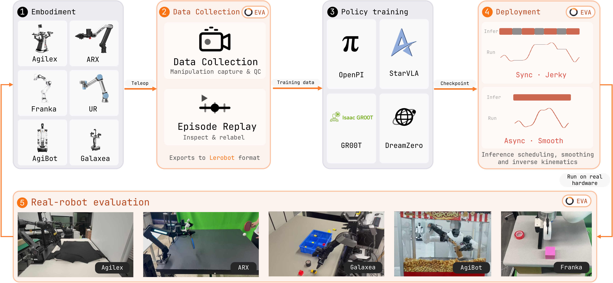
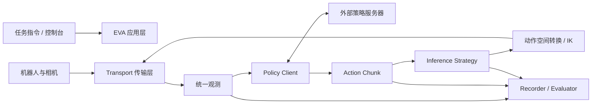

<!-- Generated by the offline translation workflow.
Source: 06-策略抓取或抓取VLA/大模型控制、VLA、VLM/19-EVA-Client真机部署与评测工程导航/README.md
Source SHA-256: 133a22b3ad9a7faf8f876a320279a2949cb4084904a471401cbab03b089c453d
Model: tencent/Hy-MT2-1.8B-GGUF:Q4_K_M
Review machine-translated technical claims before relying on them.
-->
# EVA-Client: From VLA weights to real robot deployment and auditable testing

> Section purpose: Supplementary materials for VLA engineering deployment. EVA-Client is not responsible for the training policy, nor is it a new VLA architecture; what it complements is the engineering process of “how to collect data after training is completed, connect to the policy server, execute the action blocks smoothly, and keep records for review and evaluation”.

## 1. Project Overview

| Item | Information |
| :--- | :--- |
| Project Homepage | [EVA-Client Project Page](https://colalab.net/projects/eva-client) |
| Code Repository | [Noietch/EVA-CLIENT](https://github.com/Noietch/EVA-CLIENT) |
| Technical Report | [EVA-Client Technical Report](https://colalab.net/projects/eva-client/paper/EVA_Client_Report.pdf) / [arXiv:2607.02646](https://arxiv.org/abs/2607.02646) |
| Open Source License | Apache-2.0 |
| Version Checked in This Section | Official repository commit `ff36587`, 2026-08-19 |
| Python Version | `>=3.10,<3.12`, recommend Python 3.10 |

EVA-Client is not aimed at "retraining a model," but at the following high-frequency issues:

1. How can the camera, joint state, and task instructions be sent to the policy in a consistent format?
2. The policy returns an action chunk at a time. How can the robot execute it continuously without frequent pauses?
3. When replacing the robot, changing the communication method, or updating the policy backend, which components can be reused?
4. How is the success rate of the real robot calculated? How can we review the failure process? Can the logs continue to be used for training?

It breaks down these issues into the transport layer, robot description, policy client, action scheduling policy, and console and recorder, so that "model inference" and "robot execution" do not have to be written in the same script.

## 2. Official Overview Diagram: How a single evaluation integrates into the closed loop

<p align="center">
  
</p>

**Figure 1: EVA-Client official workflow.** Image source: [ EVA-Client official repository ](https://github.com/Noietch/EVA-CLIENT/blob/main/assets/workflow.png).

This diagram should be understood as five sections of links from left to right:

### 2.1 Embodiment: First, incorporate the entity differences into a unified description

The leftmost side displays various robot bodies. The different robots differ significantly in the number of joints, dual arm configurations, grippers, cameras, initial poses, and communication protocols. EVA-Client does not attempt to make all robots share the same drive; instead, it writes the body structure, joint groups, cameras, and action space into the robot description, and then the transport layer applies the actual drive.

Therefore, when replacing the robot, the main additions are the robot definition, hardware node, and config, rather than rewriting the data collection, policy request, action scheduling, and evaluation interfaces.

### 2.2 Data Collection: Collection, Replay, and LeRobot Export

The second paragraph treats remote manipulation observations and action records as episodes, and provides playback and quality inspection capabilities. The data can be exported in the LeRobot v2.1 directory structure, allowing it to be integrated after the SmolVLA and LeRobot data processing and training content already included in this tutorial.

The key here is not “being able to record videos,” but aligning images, robot status, actions, timestamps, task text, and episode metadata. For the real robot VLA, incorrect timestamps, frame drops, changes in camera naming, or inconsistent action dimensions often cause training and deployment failures earlier than the model structure itself.

### 2.3 Policy Training: Training is still carried out by an external framework

OpenPI, StarVLA, GR00T, and DreamZero in the center of the figure represent compatible policies or training ecosystems, but do not indicate that EVA-Client has these training algorithms built-in. The policy clients that can be directly seen in the current code include:

- `openpi`: Connect to the OpenPI inference service;
- `openpi_rtc`: Compatible with Real-Time Chunking;
- `starvla`: Connect to the StarVLA inference endpoint;
- `gr00t`: Connect to the GR00T inference endpoint;
- `mock`: Verify communication and interface when no real model is available;
- `replay`: Perform playback tests using recorded actions.

After training, the checkpoint is launched by the corresponding framework into a policy service. EVA-Client is responsible for organizing observations, executing requests, and performing the returned action blocks.

### 2.4 Deployment: Action block scheduling determines whether it "works" or "runs smoothly"

Synchronous execution in the diagram causes a pause while waiting for the next inference; asynchronous execution allows inference and robot control to overlap, enabling seamless transition between old and new action blocks. The lag, action jumps, and accumulated delay issues on the real robot usually occur at this layer.

### 2.5 Evaluation: Leave data for re-training during evaluation

The far right side not only displays the success rate but also highlights the video, robot status, action curves, and episode logs. A single evaluation can serve as:

- Measurement of the success rate of checkpoint;
- Visual diagnosis of failed cases;
- Records of manual intervention or recovery actions;
- Input for the next round of data cleaning, imitation learning, or online adaptation.

## 3. System Architecture: Decoupling Policy, Scheduling, and Hardware



### 3.1 Transport: Only solves "how to send and receive"

The transport layer is responsible for receiving the camera and robot status from the execution backend and sending control commands. The current project provides an offline loading interface for ROS1, ROS2, ZMQ, and LeRobot dataset.

Separating transmission and policy has two direct benefits: the same policy can be switched to a ROS/ZMQ backend; the same robot can also switch between real hardware, offline data, or mock environments for layered troubleshooting.

### 3.2 Robot Definition: Define ontology contracts

The robot description must clearly include at least:

- Joint names, order, dimensions, and left/right arm groups;
- Camera names, image size, and viewing angle;
- Initial pose, limits, and control frequency;
- Whether the policy uses `JointState` or `EEFPose`;
- URDF and IK configurations for converting end pose to joint angles.

The end pose of EVA-Client can be organized into 8 dimensions per arm `xyz(3) + quaternion(4) + gripper(1)`. If the robot receives joint positions at the underlying level and the policy outputs the end pose, inverse kinematics conversion can be performed using PyRoki.

### 3.3 Policy Client: Adapting the Inference Service Protocol

The Policy Client is responsible for three tasks: converting unified observations into model inputs; initiating requests to remote or local inference services; and restoring the response into a unified action chunk. The model's tokenizer, checkpoint loading, and GPU inference can remain in the original training framework.

This also explains why EVA-Client is suitable as a lightweight real robot client: the robot control machine does not need to handle the large model training environment simultaneously, and the policy service can be deployed on another GPU server, via port forwarding or local network connection.

### 3.4 Inference Strategy: Handle the time axis, rather than changing the model

| Policy | Working Mechanism | Applicable Scenarios | Main Risks |
| :--- | :--- | :--- | :--- |
| `sync` | Blocks during execution or request waiting for the next action block | Easy-to-understand initial debugging | Robot pauses during reasoning |
| `async` | Predicts the next block in the background and performs linear overlap between old and new actions | Default continuous real robot execution | Requires correct setting of overlap length and buffer |
| `naive` | Asynchronous request; directly replaces the old buffer when a new block arrives | Quick throughput verification | Boundary actions may jump |
| `act` | Integrates multiple overlapping predictions based on time weight | ACT type policy | Requires maintenance of multiple predictions and their time positions |
| `rtc` | Realizes real-time alignment of new predictions with already committed actions | Low-latency links such as OpenPI RTC | Service and client protocols must match |

If the action chunk length is $H$, the control frequency is $f_c$, and the single inference delay is $t_i$, synchronous execution will easily stop when $t_i$ approaches or exceeds the remaining buffer. The essence of the asynchronous policy is to complete the next inference in advance while the robot performs the current action chunk, and to ensure the timing alignment between the two actions.

### 3.5 Recorder and Evaluator: Turning "success rate" into a evidence chain

The recorder preserves the observations, model predictions, actual execution commands, and evaluation metadata. The actual execution actions are not necessarily equal to the original predictions: they may be cropped, IK-adjusted, smoothed, intervened by humans, or filtered for safety. By recording these different quantities separately, it is possible to determine where the failure originates—whether from the model, communication, scheduling, or the controller.

## 4. What work does the seven manipulation pages correspond to

The EVA-Client console divides common processes into seven tabs:

| Tab | Purpose |
| :--- | :--- |
| `MANUAL` | Manual inspection of joints, cameras, commands, and basic control |
| `COLLECT` | Recording remote manipulation or manual teaching episodes |
| `REPLAY` | Playing back data to check synchronization, perspective, and action quality |
| `DEBUG` | Segmented execution of model actions to identify policy or interface issues |
| `RL` | Manual intervention during rollout, and observation of critic/value signals |
| `EVAL` | Organizing real robot evaluations based on tasks, checkpoints, and number of trials |
| `RESULT` | Summarizing success rates, milestones, videos, and logs |

It is recommended to enter the real robot closed loop in the order `MANUAL -> COLLECT/REPLAY -> DEBUG -> EVAL`. Do not run the policy continuously without verifying the camera, joint sequence, and emergency stop first.

## 5. Data and Logs: Why It Can Be Connected Behind LeRobot

A single collection or rollout can form a structure similar to the following LeRobot v2.1 structure:

```text
<log_dir>/<task>/
├── data/chunk-000/episode_000000.parquet
├── videos/chunk-000/<camera>/episode_000000.mp4
└── meta/
    ├── info.json
    ├── episodes.jsonl
    ├── episodes_stats.jsonl
    ├── tasks.jsonl
    └── stats.json
```

In addition to the standard fields required for training, the evaluation should also retain long reports or sidecar for audit purposes: use `absolute_step` to align the original state, model action blocks, final execution actions, inference latency, manual intervention, and failure markers. Quality checks in the project will focus on issues such as too short episodes, non-monotonic timestamps, and missing cameras.

This link is suitable for forming a closed loop as follows:

```text
真机示教 -> LeRobot 数据 -> 外部 VLA 训练 -> EVA 部署评测
        ^                                  |
        |------- 失败片段 / 人工介入 -------|
```

## 6. Current Support Scope

As of this version check, the supported versions listed in the official Robot Zoo include:

| Robot Arm | Form |
| :--- | :--- |
| AgileX Piper | Dual 6-DoF robotic arm + gripper |
| ARX R5 | Dual 6-DoF robotic arm + gripper |
| Dual Franka Panda | Dual 7-DoF robotic arm + gripper |
| Galaxea R1 Lite | Two arms + torso |
| UR5e | Single 6-DoF robotic arm + gripper |
| AgiBot G2 | Two-armed humanoid robot, 24-DoF body |

The repository also lists some robots as under development or pending addition. The support list will update as the project evolves. Before deployment, it is necessary for all three locations in the official repository—`README.md`, `configs/`, and `examples/hardware/`—to exist simultaneously, rather than relying solely on the project promotional images.

### Can SO-101 be used directly now?

It cannot be written as "supported". In Issue #94, the author stated on 2026-07-09 that it would be supported later; however, as of the official submission `ff36587`, no robot description, hardware nodes, or operating configurations for SO-101 have been found in the repository.

If the community wants to add SO-101, the minimum task is:

1. Add a new SO-101 robot definition, specifying the names, order, ranges, initial pose, and camera names of the Feetech joints;
2. Implement hardware execution nodes using the LeRobot/Feetech interface, and expose observations and actions through existing ZMQ or a suitable transport;
3. Clarify whether policy inputs and outputs are joint positions, increments, or other action representations, and verify dimensions and units;
4. Add configuration files for data collection, deployment, and evaluation;
5. Configure joint limits, speed restrictions, emergency stop functions, and single-action block debugging;
6. Conduct integration tests using a fake policy and recorded data before integrating with the real VLA service.

This is a viable adaptation path, but it is not the official built-in capability.

## 7. Minimal Experience Without Real Robot

The project provides an open-loop configuration based on the example data in the repository. It is suitable for verifying installation, pages, data reading, and visualization first, without requiring ROS, a real robot, or VLA checkpoint.

```bash
git clone https://github.com/Noietch/EVA-CLIENT.git
cd EVA-CLIENT

curl -LsSf https://astral.sh/uv/install.sh | sh
uv venv --python 3.10 .venv
source .venv/bin/activate
uv pip install -e ".[dev]"

eva --config configs/00_openloop/dual_agilex_piper_openloop.py
```

After starting, open the console according to the terminal prompt. The default is usually `http://127.0.0.1:8080`. Focus on checking during this stage:

- Whether the page can display the episode;
- Whether each camera matches the configured name;
- Whether the joint curves and 3D scenes change over time;
- Whether playback, pause, and episode switching are normal.

It can only prove that the client and sample data link are functioning properly, but it cannot prove that a specific checkpoint can control the real robot.

## 8. Two-Process Mode for Real Robot Deployment

A real deployment usually includes at least two independent processes:

```text
进程 A：硬件执行节点
  读取相机/关节 -> 发布统一观测
  接收动作命令 -> 经过限位后驱动机器人

进程 B：EVA-Client
  读取 config -> 连接 transport -> 请求策略服务
  调度 action chunk -> 记录与评测
```

The official repository provides hardware startup examples for different robots, for example:

```bash
# 下面只展示入口形式，运行前仍需安装对应厂商 SDK/ROS 环境
bash examples/hardware/agilex_piper/run_agilex_ros.sh
bash examples/hardware/arx/run_hardware.sh
bash examples/hardware/franka/run_hardware.sh
bash examples/hardware/ur5e/run_hardware.sh

# 另一个终端启动 EVA 配置
eva --config configs/01_deploy/dual_agilex_piper/openpi_qpos.py
```

The policy server can run on the same machine or a remote GPU server. When establishing a remote connection, explicitly check the address, port, timeout, action frequency, and network jitter; do not expose the control channel directly to the public network.

## 9. What should the configuration file read?

When facing a new configuration, do not just change the IP address. It is recommended to check in the following order:

| Configuration Block | Required Information |
| :--- | :--- |
| Robot | Body type, joint set, camera, initial pose, URDF |
| Transport | ROS1/ROS2/ZMQ/dataset, address, topic or channel |
| Policy | backend, service address, task command, input image key |
| Action | `JointState`/`EEFPose`, dimension, unit, gripper convention |
| Strategy | sync/async/act/rtc, chunk length, overlap and control frequency |
| Safety | joint/speed/work space limits, timeout, emergency stop |
| Logging | output directory, camera video, status and evaluation fields |

If "the interface shows images but the robot does not move", prioritize checking the action space, joint order, and execution nodes; if "the robot stops every once in a while", prioritize checking inference latency, chunk consumption speed, and scheduling policy; if "the actions change suddenly", prioritize comparing the original model actions, the boundary between old and new chunks, and the actual actions sent.

## 10. Recommended reproduction path

This tutorial does not provide reproduction by button-by-button on real robot, but it is recommended to proceed from low to high risk:

1. Run the open-loop example using the dataset provided by the repository successfully;
2. Verify the policy client and action chunk shapes using `mock` or `replay`;
3. Start the hardware node to only read the status and images, without sending any actions;
4. Execute a single short action block in `DEBUG` to confirm direction, unit, and limits;
5. First establish an interpretable baseline using `sync`, then compare `async`/`act`/`rtc`;
6. Run a small number of real episodes and review the video, status, prediction, and actual actions item by item;
7. Finally conduct formal evaluations with multiple checkpoints, multiple tasks, and repeated experiments.

When reporting the success rate of a policy, it is also necessary to specify the robot, task text, scene initialization, number of executions per task, success criteria, checkpoint, action scheduling policy, and manual intervention rules. Otherwise, the numbers for different policies cannot be directly compared.

## 11. How to integrate with existing content of every-embodied

EVA-Client is most suitable at the end of the following learning chains:

1. First, study the sections related to [RDK-X5 connecting the LeRobot robotic arm for remote manipulation](../../../03-robot-hardware-lerobot-and-rdk-x5/03-rdk-x5-connects-to-the-lerobot-robotic-arm-for-remote-manipulation.md) or data collection within the warehouse, and understand episode and multi-modal time alignment;
2. Then, complete the training and reasoning of [SmolVLA](../01SmolVLA-LIBERO/01SmolVLA-libero.md), [OpenVLA](../02-openvla-reproduction/02-openvla-reproduction.md) or [OpenPI / π0](../../../../06-策略抓取或抓取VLA/大模型控制、VLA、VLM/04mujoco复现ACT、Pi0、SmolVLA);
3. Use EVA-Client to connect to the real ontology, handling policy services, action block scheduling, logs, and evaluation;
4. Send failed rollouts and manual intervention data back to the LeRobot/training chain to form a closed loop.

It complements the deployment infrastructure, rather than replacing the above model tutorials.

## 12. Using Boundary and Security Tips

- EVA-Client standardizes the interfaces, but it does not automatically ensure the safety of policy actions; real robots still require hardware emergency stop, software limit control, and on-site monitoring.
- The ZMQ control channel can trigger actions on the real robot. By default, access should be limited to a trusted local network or the local machine via an authenticated tunnel, and should not be exposed to the public network.
- The evaluation console and logs enhance auditability, but success criteria still need to be defined at the task level, and cannot be inferred automatically based solely on models or interfaces.
- “Supports a certain policy” usually indicates the presence of a client protocol, but it does not mean that the repository includes the training weights, licenses, or complete training environment for that policy.
- “Supports a certain robot” should be confirmed by both the robot definition, hardware example, and config.

## References

1. [EVA-Client Official Project Page](https://colalab.net/projects/eva-client)
2. [EVA-Client GitHub Repository](https://github.com/Noietch/EVA-CLIENT)
3. [EVA-Client Technical Report](https://colalab.net/projects/eva-client/paper/EVA_Client_Report.pdf)
4. [arXiv:2607.02646](https://arxiv.org/abs/2607.02646)
5. [every-embodied Issue #94: EVA-Client Recommendation](https://github.com/datawhalechina/every-embodied/issues/94)
