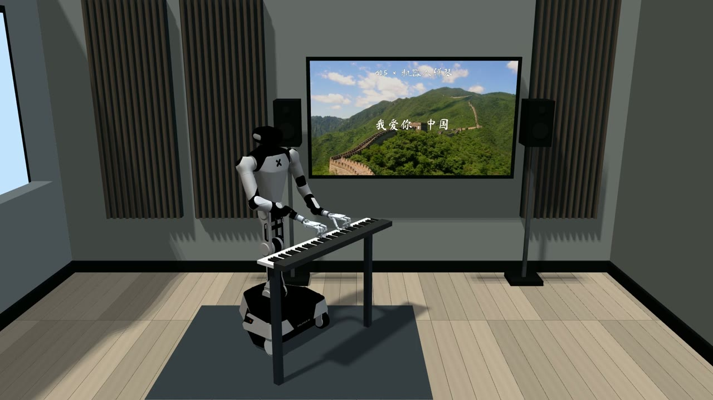
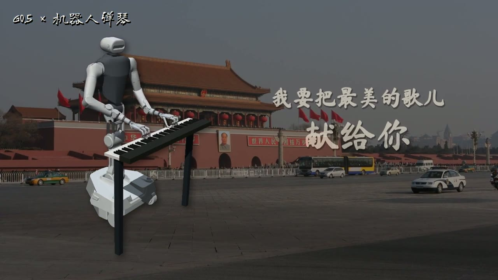

<!-- Generated by the offline translation workflow.
Source: 06-策略抓取或抓取VLA/大模型控制、VLA、VLM/20-GPT6-Astra机器人弹琴与上下文工程/README.md
Source SHA-256: 2c52240314491a3c70ab5ba43d25defc8835551875ca6bcc5015ad93d4247cd3
Model: tencent/Hy-MT2-1.8B-GGUF:Q4_K_M
Review machine-translated technical claims before relying on them.
-->
# G0.5 × Two-handed piano: Repositioning and continuation after key position changes

Have the robot play a piece of music, then gently move the piano away: The robot raises its hand, updates its observation, refinds the pose for playing through G0.5 and the inverse kinematics controller, and then continues to play.

This section contains the code for the simulation of this Demo, model invocation, instrument continuation playing, and result checking. The robot uses **Galaxea R1 Pro + dual Shadow Hand**, and operates in MuJoCo / RoboPianist simulation. First, run the accompanying exercises to ensure they work properly, then switch to musical scores you have permission to use.

## Performance video

| Music room version: "I Love China" | Continued performance after piano relocation |
| --- | --- |
| [](assets/piano-xiaohongshu.mp4) | [](assets/piano-relocation-performance.mp4) |
| Xiaohongshu video, 34.6 seconds, 1080p | Piano relocation acceleration video, 36 seconds, 1080p |

Click on the cover to watch the audio video.[ Material attribution and compression record ](VIDEO_CREDITS.md)


[ Watch public practice: Playing after moving the instrument ](../../../../06-策略抓取或抓取VLA/大模型控制、VLA、VLM/20-GPT6-Astra机器人弹琴与上下文工程/assets/public-relocation-demo.mp4) · [ Watch the process of positioning at 6 cm ](../../../../06-策略抓取或抓取VLA/大模型控制、VLA、VLM/20-GPT6-Astra机器人弹琴与上下文工程/assets/relocation-recovery.mp4) · [ G0.5 connection tutorial ](G05.md) · [ Execution records ](REPRODUCTION.md) · [ Resources and licenses ](SOURCES.md)

## What does G0.5 bring here

**Connect the multimodal action model to a skillful manipulation with a clear objective.** G0.5 receives images from the head and dual wrist cameras, the current joint states, and task instructions, and outputs motion proposals for both arms. The piano controller implements these proposals into new playing positions and executes finger techniques and rhythms.

- **Reorganize actions after trajectory change**: After moving the piano, the current observation is input again, rather than continuing to send the arm trajectory before moving the piano.
- **Unified integration of language, vision, and proprioceptive states**: The same model interface can be used for performance preparation and repositioning recovery, facilitating further expansion of different task commands.
- **Division of labor between general models and specialized skills**: The model handles dual-arm action proposals, IK ensures geometric alignment, and the finger controller retains chord and key timing.
- **Reuse pre-trained models**: This process uses existing G0.5 checkpoint inference without training a complete piano policy separately.

In the recorded continuous experiment, the piano moved **4 centimeters** along the world Y axis. G0.5 performed **4 new observation inferences** during the recovery phase, and IK jointly aligned the double wrists back to the playing position to complete the subsequent performance. What is shown here is the adaptation process of this combined system; the target position of the piano is provided by the simulation geometry.

## Overall Process

```text
曲谱 / 指法计划 ──→ 双手演奏控制器 ──→ 实际琴键接触 ──→ 钢琴音频
                         ↑
演奏 → 抬手 → 钢琴移位 → 新观测 → G0.5 双臂提案 + IK 对齐 → 落手 → 续弹
```

| Component | Function | Code Entry |
| --- | --- | --- |
| G0.5 | Proposes dual-arm movements based on new observations | g05_piano_worker.py |
| Positioning and Handover | Limits movement range, aligns both wrists, switches between playing phases | g05_recovery.py / g05_relocation_session.py |
| Dual-Hand Playing | Finger techniques, pressing and releasing, chords, contact feedback | polyphonic_piano.py |
| Audio and Review | Generates events from actual key states, synthesizes timbre | audit_polyphonic_contacts.py |
| Astra (optional) | Organizes task context, generates and checks structured plans | piano_context.py |

## 1. Windows: First, watch the whole system playback

Just need Python 3.10 and MuJoCo. No model environment is required. Open PowerShell in the chapter directory:

```powershell
py -3.10 -m venv .venv-replay
.\.venv-replay\Scripts\python.exe -m pip install mujoco==3.1.6 numpy==1.26.4
Expand-Archive -LiteralPath .\assets\galaxea-replay.zip -DestinationPath .\runs\galaxea-replay
.\.venv-replay\Scripts\python.exe replay_windows.py --run .\runs\galaxea-replay --viewer
```

This is the attached playback of the “Little Star” introductory executor trajectory, with no sound in the window; the control sequence is re-executed through physical simulation, and `native_replay_report.json` is generated after execution. For the new observation model reasoning, please proceed to the next section.

## 2. Ubuntu: Prepare the simulation environment

It is recommended to run the simulation and G0.5 on a Linux workstation, and view the results on Windows. Install both Python environments separately to avoid the model dependencies overriding the simulation version.

```bash
git clone https://github.com/datawhalechina/every-embodied.git
cd "every-embodied/06-策略抓取或抓取VLA/大模型控制、VLA、VLM/20-GPT6-Astra机器人弹琴与上下文工程"
export PIANO_ROOT="$PWD"

sudo apt-get update
sudo apt-get install -y ffmpeg libfluidsynth3 libegl1 libgl1
python3.10 -m venv "$HOME/.venvs/piano-sim"
export SIM_PY="$HOME/.venvs/piano-sim/bin/python"
"$SIM_PY" -m pip install -r requirements-sim.txt

export MUJOCO_GL=egl
export PYOPENGL_PLATFORM=egl
export OMP_NUM_THREADS=2
export OPENBLAS_NUM_THREADS=2
```

The RoboPianist sound and runtime resources are obtained during the installation process. If `libEGL`/NVIDIA driver errors occur, first fix the EGL rendering environment of the workstation; machines with a local desktop can also use GLFW rendering.

### Obtain robot model

```bash
git clone https://github.com/OpenGalaxea/GalaxeaManipSim.git "$HOME/GalaxeaManipSim"
git -C "$HOME/GalaxeaManipSim" checkout abe7f5161eeaa150e6eaffdf443af5df7f23f356
"$SIM_PY" prepare_galaxea.py --repo "$HOME/GalaxeaManipSim" --out runs/r1pro-model
```

The conversion program retains the robot resource license and generates `runs/r1pro-model/r1_pro.xml`. In the simulation, this chapter installs dual Shadow Hands and fixes the chassis, with ideal gravity compensation applied.

### Generate hand exercise

The attached [relocation-exercise.json](../../../../06-策略抓取或抓取VLA/大模型控制、VLA、VLM/20-GPT6-Astra机器人弹琴与上下文工程/relocation-exercise.json) contains two phrases, a left-hand three-note chord, a right-hand melody, and the pause between phrases used for instrument relocation. It is a distributionable debugging exercise and does not rely on the song's MIDI file.

```bash
"$SIM_PY" polyphonic_piano.py \
  --model runs/r1pro-model --plan relocation-exercise.json \
  --out runs/public-physical --song-mode --fixed-torso --contact-surface \
  --little-abduction-limit 0.34 --hover-z 0.950 --pressed-z 0.912 \
  --song-staged-motion --song-active-priority --ik-max-step 0.08 \
  --max-hand-span 0.18 --video --video-fps 25
```

The output is located in `runs/public-physical/`: `demo.mp4`, `measured.wav`, `trajectory.npz`, `source.plan.json`, `report.json`. The audio comes from the actual pressed keys.

The program retains a strict note check: if `Polyphonic performance failed` is output, first check `report.json`. This public practice was successfully run completely, but there were missed notes and misalignment during the onset of notes, thus the strict music check failed; the generated complete trajectory can still be used for the next piano movement verification process. When no trajectory is generated due to environment loading or premature termination, the corresponding error should be fixed first. [ specific results ](REPRODUCTION.md)

## 3. Connect to G0.5 to continue playing after the piano position changes

Prepare the model environment and four path variables according to [G05.md](G05.md), and then run:

```bash
"$SIM_PY" g05_relocation_session.py \
  --reference runs/public-physical --out runs/public-relocation \
  --boundary 4.5 --piano-shift 0 -0.02 0 --model-weight 0.1 \
  --g05-python "$G05_PY" --g05-repo "$G05_REPO" \
  --g05-models "$G05_MODELS" --g05-checkpoint "$G05_CHECKPOINT" \
  --g05-config-mode checkpoint
```

This command inserts "raise hand → move the piano 2 cm → re-examine and adjust → lower hand → continue playing" at the pause point. The movement of the piano is applied by the scene controller, and the action proposals are derived from G0.5 new reasoning. The execution control loop does not rewrite joint states frame by frame.

The public practice showed a complete execution time of 13.51 seconds. There were 4 new inferences during the recovery phase, and the maximum wrist position error was approximately 0.062 mm; the handoff duration was automatically adjusted to 1.19 seconds. [ This report is ](../../../../06-策略抓取或抓取VLA/大模型控制、VLA、VLM/20-GPT6-Astra机器人弹琴与上下文工程/assets/public-relocation-report.json)

Run again using the new output directory. The script will not overwrite the old experiment. First check `demo.mp4`, then review `model_calls_during_session`, `recovery_final_error`, `playback_completed` in the report, and the note check results.

## 4. Replace with your own track

1. Prepare MIDI or structured notes that can be used, maintaining the correct melody and rhythm.
2. Assign fingerings for both hands; prioritize keeping the main melody and key chords, and adjust the accompaniment within the reachable range.
3. Generate a complete performance at fixed piano positions, then place `--boundary` at the rests where no continuous key press is made.
4. Enable continuous playing after moving the piano, and check the key contact and musical continuity after restoration.

`midi_score.py`, `bimanual_fingering.py`, and `melody_review.py` provide related processing; you can first check the entry using `--help` of each script. This repository offers processes and exercises, but does not include the musical scores or recordings used in promotional videos.

## Further Reading

- [ Installation, model invocation, and control integration of G0.5 ](G05.md)
- [ Astra context and plan generation ](ASTRA.md)
- [ Experiment records and result fields ](REPRODUCTION.md)
- [ Resource sources, licenses, and directory descriptions ](SOURCES.md)

The `pianomime_runner.py` / `pianomime_galaxea.py` of PianoMime is retained as the entry for adapting subsequent policies, using an independent `requirements-pianomime.txt` environment; the finger control and instrument movement main process on this page do not rely on its weight.
