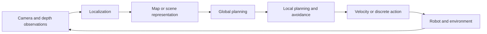

# Foundations of Embodied Navigation

This chapter introduces the navigation loop used throughout the later Habitat exercises: sensing, localization, scene representation, global planning, local obstacle avoidance, and motion control.

## Navigation Loop

Localization estimates where the robot is. Mapping describes the environment. Planning selects a route, and control converts that route into the next executable action. End-to-end policies may combine these stages, but evaluation should still expose where a trajectory failed.

## Common Task Definitions

| Task | Goal input | Typical output | Main challenge |
| --- | --- | --- | --- |
| Point-goal navigation | Relative or global coordinates | Forward, turn, stop | Localization error and obstacles |
| Object-goal navigation | Object category or image | Motion actions and stop | Search and semantic generalization |
| Image-goal navigation | Reference image | Motion actions and stop | Viewpoint change and place matching |
| Vision-language navigation | Route instruction | Discrete or continuous actions | Instruction grounding and memory |
| Active exploration | Coverage or information gain | Observation locations | Unknown-space modeling |

## Maps and Planning

A two-dimensional occupancy grid separates traversable, occupied, and unknown cells. A* and Dijkstra search these grids, while a navigation mesh represents traversable surfaces in a three-dimensional simulator. Global planning chooses an overall route; local planning handles recent observations, dynamic obstacles, and control constraints.

## Sensors and State

RGB cameras provide appearance and semantics, depth cameras provide surface distance, LiDAR provides geometric scans, and odometry plus inertial measurements estimate short-term motion. Simulation may expose a ground-truth pose, but a benchmark must explicitly state whether the policy is allowed to use it.

## Evaluation

- **Success rate:** fraction of episodes that reach the target and satisfy the stop condition.
- **Success weighted by path length:** rewards success while penalizing unnecessary travel.
- **Distance to goal:** shows how close unsuccessful trajectories came to the target.
- **Collision statistics:** measure contacts, collision duration, or safety margin according to the benchmark protocol.

Before continuing, verify the goal representation, available state, action space, stop rule, episode count, and scene split. Then proceed to the [Habitat-Sim environment and dataset guide](../02-basics-of-simulation-environment/habitat-navigation-environment/habitat-sim-environment-setup-and-dataset-introduction.md).
