<!-- Generated by the offline translation workflow.
Source: 08-具身导航及VLN/03前沿VLN复现/03-主动感知NBS导读/README.md
Source SHA-256: 5c47c73e4ceac345f1f1166e5f67800746e97972e0db3a92053e2d01a1ec8d55
Model: tencent/Hy-MT2-1.8B-GGUF:Q4_K_M
Review machine-translated technical claims before relying on them.
-->
# NBS Active Perception: Using Node-Level Beam Search for Mobile Robot Information Path Planning

> Introduction to the paper: **An Efficient Beam Search Algorithm for Active Perception in Mobile Robotics**. This work has been published in *The International Journal of Robotics Research* OnlineFirst, and its arXiv version is `2604.23327`. It is not a VLA nor a world model, but rather a systematic method paper focusing on navigation planning, active perception, and information path planning.

## 1. One-sentence conclusion

The problem this paper addresses is: **When a robot does not know the entire environment, where it should go and which direction to look to obtain the most useful information within a limited time or energy budget.**

Traditional navigation often asks, “How to get from point A to point B the fastest.” Active perception asks something else: **Point B may not be known yet, and the map is not complete. The robot needs to explore, perform mapping, and decide on the next optimal trajectory while moving forward.**

The core contributions of the paper can be divided into three modules:

| Module | Solves what problem | Key concept |
| :--- | :--- | :--- |
| Node-wise Beam Search, NBS | Finds highly informative paths on the graph without using expensive TSP or being restricted by the shortest path tree | Instead of keeping only top-B candidates at each layer, each terminal node retains top-B candidate paths |
| Expected Gain | How to balance known high-value points and unknown region boundaries | Incorporate future potential benefits of the frontier into path scoring to avoid solely focusing on known gains |
| RRAG | Real active perception involves a dynamic graph, requiring online graph construction | Use Rapidly-exploring Random Annulus Graph for incremental sampling of traversable viewpoints and maintain multiple orientations |

From the perspective of the tutorial location, it is most suitable to be placed under `08-具身导航及VLN/03前沿VLN复现`. Although the directory name contains VLN, this article is not a language navigation guide, but rather a more basic **active perception path planning**: it can be reused by tasks such as VLN, drone exploration, mobile robot mapping, and scene scanning.

## 2. Paper and Project Entrance

| Entry | Link | Current Status |
| :--- | :--- | :--- |
| IJRR Paper Page | [SAGE: An efficient beam search algorithm for active perception in mobile robotics](https://journals.sagepub.com/doi/10.1177/02783649261455911) | Already OnlineFirst |
| arXiv | [arXiv:2604.23327](https://arxiv.org/abs/2604.23327) / [HTML version](https://arxiv.org/html/2604.23327v1) | Full text and image access available |
| Project Page | [efficient-beam-search.github.io](https://efficient-beam-search.github.io/) | Paper project homepage |
| OpenApero | [openapero.github.io](https://openapero.github.io/) | Active perception library homepage, marked as Summer 2026 release |
| GitHub | [OpenApero/openapero](https://github.com/OpenApero/openapero) | Currently a placeholder; code, documentation, and examples are not yet available |

As of July 18, 2026, the README in the OpenApero repository clearly states **The code is not public yet**, and the release target is **Summer 2026**. Therefore, this tutorial is temporarily positioned as a "method introduction + reproduction path guide", not a step-by-step operation tutorial.

## 3. What is it actually doing

Active perception can be understood as the following closed loop:


In this closed loop, the paper is most concerned with the middle two steps:

1. **How to select candidate viewpoints on the mapping**: Where the robot can stand, which direction to look, and which viewpoints are connected.
2. **How to choose a path on the map**: With a limited budget, which sequence of nodes should be traversed to obtain the most information.

It is not about learning a visual large model, nor about training a world model capable of generating future videos. It still follows the classic robot planning approach: with diagrams, edges, costs, benefits, budgets, collision detection, and online replanning.

## 4. How to read the overview diagram

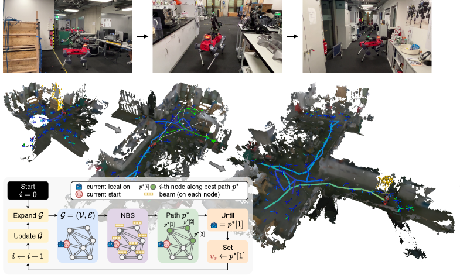

Figure 1 shows the surface reconstruction in the hardware experiment. It can be read as four layers:

1. **Robot trajectory**: The trajectory that has been traversed in the image is represented by colors ranging from deep blue to bright yellow, indicating time progression; the current planned path is indicated by light green arrows.
2. **Camera view cone**: The robot is not a omniscient god-like perspective; it can only see areas within the camera’s field of view, so “orientation” directly affects the amount of information available.
3. **frontier**: Yellow voxels represent surface frontiers, which are unknown regions near known surfaces that have not been fully observed. The key to active perception is to fill in these gaps.
4. **Planning closed loop**: The small diagram in the lower left corner shows the main cycle: NBS finds the current optimal path, the robot moves to the next node, updates the map and new information, and then plans again.

This diagram is ideal as the first one in a tutorial, as it clarifies the core intuition of the paper: **robots do not plan a complete route at once, but they observe something, move a little, update, and then plan again.**

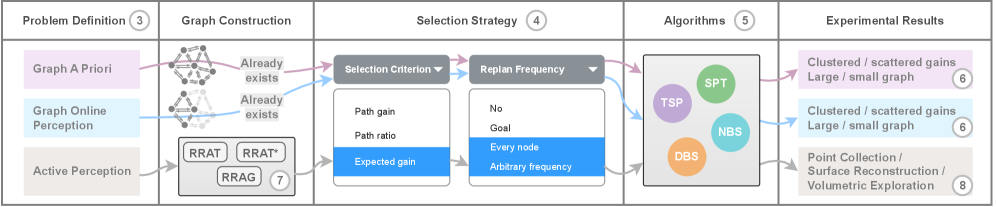

Figure 2 is the paper structure diagram. It divides the problem into three layers, from abstract to concrete:

| Level | Scenario | Key Points |
| :--- | :--- | :--- |
| A priori Graph | Both the graph and nodes' gains are known | First, verify which graph search algorithm is more effective. |
| Online Perception of Graph | The graph is observed gradually | Verify whether replanning, frontier, and expected gain are effective. |
| Active Perception | No existing graph; it must be constructed online from free space | Introduce RRAG to apply graph search to real robot tasks. |

This organizational approach is worth learning from. The paper doesn’t start by stacking results in Habitat or real robots right away, but first clarifies the contributions of “search algorithms” and “selection metrics” on the abstract diagram, and then transfers the best combinations to real active perception tasks. This writing logic is very clear: **first prove that the planner is effective, then prove that the graph construction can be connected to real robots.**

## 5. Problem definition: It is not a shortest path, but an information path planning

Normal path planning can be written as:

> Given a start and end point, find the path with the minimum cost.

Information path planning is more like:

> Given a starting point and budget, find a path that allows the robot to obtain the most information along the way.

Several variables here are crucial:

| Concept | Meaning |
| :--- | :--- |
| node | A candidate robot state, usually including position and orientation |
| edge | A feasible motion connection between two candidate states |
| cost | The distance, time, or energy required to traverse this edge |
| gain | The new information acquired after reaching a certain viewpoint |
| budget | The total motion budget, such as the maximum path length or maximum execution time |
| path | A sequence of nodes such that the total cost does not exceed the budget |

There are two difficulties in this type of problem:

1. **Node selection and path ordering coupling**: It is not about selecting a bunch of good nodes and then randomly connecting them, as the connection cost will alter the optimal choice.
2. **Benefits are not simply additive**: After a region has been examined, there may be no new benefits when connecting to nearby nodes; the potential benefits of unknown regions are also difficult to calculate directly.

The paper expands the problem into three forms step by step:

| Form | Knows complete mapping? | Knows complete gain? | Typical meaning |
| :--- | :--- | :--- | :--- |
| A priori mapping | Yes | Yes | Pure test path search algorithm |
| Online perception mapping | Partially | Updated as observed | Testing replanning and frontier |
| Active perception | No, built online | Estimated as perception and mapping occur | Near-real robot behavior |

## 6. Why TSP and SPT Are Not Good Enough

The paper mainly compares two classic approaches.

**TSP approach**: First, sample or select a group of high-information nodes, and then use the Traveling Salesman Problem to find a visiting route.

The problem with this method is:

- Node selection and path sorting are split into two steps, making it easy to achieve local optimization.
- Solving TSP itself becomes costly as the number of nodes increases.
- In online exploration, the environment and frontier change continuously; repeatedly solving large TSP is not lightweight enough.

**SPT approach**: Use a shortest path tree to limit the search space, and only select paths within the shortest path tree.

The problem with this method is:

- Soon, but the candidate path is too narrow.
- A node usually retains only the shortest path; the path that "goes around a bit but allows for more observation" may be omitted.
- In active perception tasks, repeating certain locations, choosing different orientations, and detouring to observe unknown areas can be valuable.

The positioning of this paper is in the middle: **More scalable than TSP, and more unrestricted than SPT.**

## 7. NBS: Node-level Beam Search

Regular beam search is common in sequence tasks: only the top-B most promising sequences are retained at each layer. The paper refers to this as depth-wise beam search, or DBS.

The problem with DBS is that it tends to concentrate all the beams in a high-score area. For example, in step 1, several high-gain nodes are found on the right side, and all beams expand to the right. Although the score on the left side is low in the short term, it may lead to a larger unknown area in the long run, so it is cut off prematurely.

The modification for NBS is very straightforward:

> Instead of keeping top-B globally by depth, each terminating node retains top-B candidate paths.

In other words, NBS does not maintain:

```text
depth d: top-B paths globally
```

Instead:

```text
node v1: top-B paths ending at v1
node v2: top-B paths ending at v2
node v3: top-B paths ending at v3
...
```

Simplified pseudocode is as follows:

```text
frontier[start] = {empty path}

repeat search_depth times:
    next_frontier = {}

    for each end_node in frontier:
        for each path ending at end_node:
            for each neighbor of end_node:
                candidate = path + neighbor
                if candidate cost > budget:
                    continue
                insert candidate into next_frontier[neighbor]
                keep only top-B candidates for this neighbor

    frontier = merge(frontier, next_frontier)

return best path among all stored feasible candidates
```

The key benefit of this design is **preserving path diversity**. Even if a region is temporarily not in the global top-B, as long as it is good enough at its own termination node, it will not be displaced by high-score paths from other regions.

It can be understood as follows:

| Search Method | Preserved Elements | Advantages | Risks |
| :--- | :--- | :--- | :--- |
| Greedy | The best choice at the current step | Fast | Short-sighted |
| SPT | Shortest path to each node | Fast, simple structure | Only considers paths in the shortest tree |
| DBS | Global top-B paths at each depth | More exploration than greedy | Beams may overlap in the same region |
| NBS | Top-B paths at each node | Better diversity, stable with low beam width | Saves more states than DBS |
| TSP | Order of visits after selecting points | Utilizes mature TSP solvers | Two-phase, high cost, not lightweight online |

A interesting point in the paper results is that NBS maintains stable performance at lower beam widths. This is important for robots, as real robot planning cannot expand the beam infinitely; usually, the next executable path needs to be provided within a few hundred milliseconds to a few seconds.

## 8. Path scoring: Path Gain, Path Ratio, Expected Gain

NBS is just a search framework; a scoring function is also needed to determine which path is worth preserving. The paper focuses on comparing three selection metrics.

| Metric | Intuition | Suitable Scenarios | Main Issues |
| :--- | :--- | :--- | :--- |
| Path Gain | Directly see how much gain can be collected along this path | Known information is well distributed | May be overly focused on known benefits and reluctant to explore unknown frontiers |
| Path Ratio | Measure cost-effectiveness using gain / cost | When budget is tight or short paths are prioritized | Tendency to favor small nearby benefits and lacks long-term exploration |
| Expected Gain | Known gain + frontier estimate of future gain | Online exploration, active mapping | Depends on frontier definition and visibility estimation |

<table>
  <tr>
    <td width="33%">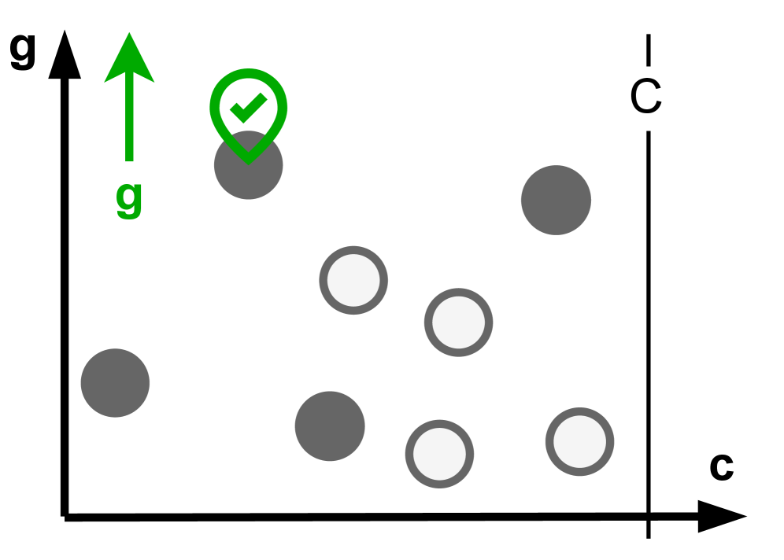</td>
    <td width="33%">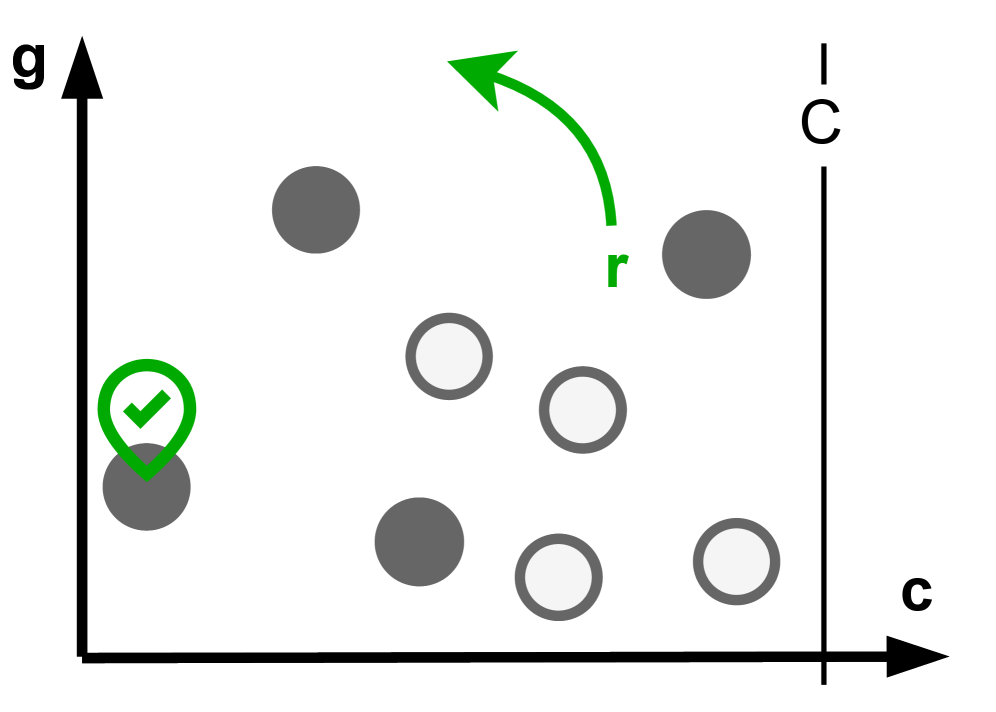</td>
    <td width="33%">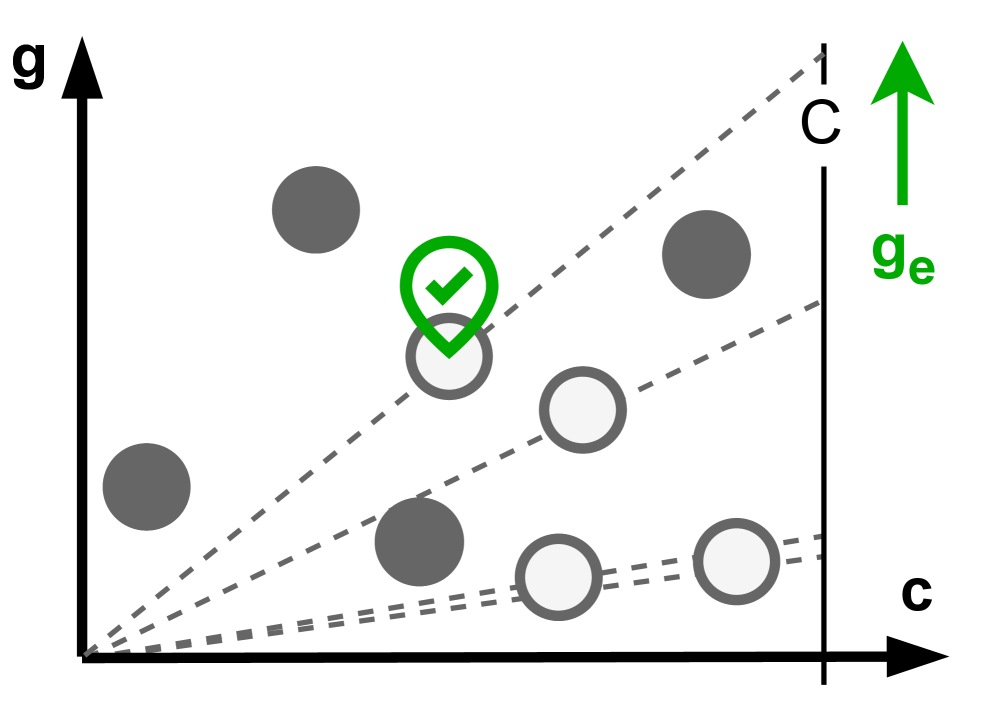</td>
  </tr>
  <tr>
    <td align="center">Path Gain: Focus on cumulative known benefits</td>
    <td align="center">Path Ratio: Focus on benefit per unit cost</td>
    <td align="center">Expected Gain: Incorporate potential frontier benefits into scoring</td>
  </tr>
</table>

Expected Gain is a crucial second contribution of this paper. It addresses the classic exploration-exploitation balance in active perception:

- **exploitation**: To access perspectives that are already known to be valuable.
- **exploration**: To reach the boundaries of unknown areas, as new spaces, surfaces, and targets may emerge there.

If only the known gain is considered, the robot will circle around near the known areas; if only the frontier is considered, the robot may ignore high-value targets that have already been exposed. The Expected Gain approach introduces frontier information into the path scoring, allowing the robot to estimate "how much new information might be discovered further along this path."

For learners, the most important thing in this section is not the formula, but the concept:

> Active perception should not only optimize the benefits in the current map, but also assign a reasonable expected value to the "boundary areas that can yield more new observations."

## 9. RRAG: Integrating Image Search with Real-time Active Perception

If only running NBS on the given map, it is just an algorithm problem. Real robots do not have a pre-defined map; they sample candidate viewpoints while moving. The paper proposes RRAG, which stands for **Rapidly-exploring Random Annulus Graph**.

The name RRAG contains three key words:

| Keyword | Meaning |
| :--- | :--- |
| Rapidly-exploring | Like RRT/RRG, quickly covers traversable spaces through random sampling |
| Random | Candidate states come from random sampling, suitable for unknown environments and complex geometry |
| Annulus Graph | Controls node density and edge radius using an annulus distance rule to avoid overly sparse or dense graphs |

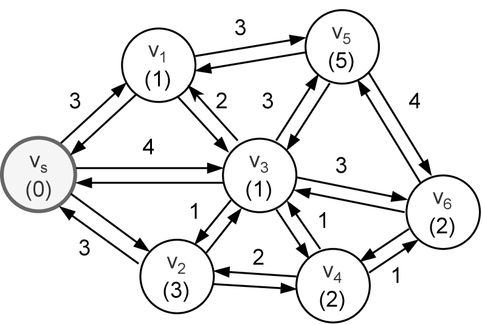

Each node in these diagrams is not just a two-dimensional position, but the robot's state. For camera robots, **orientation is crucial**: standing at the same position, looking left and looking right yield completely different information.

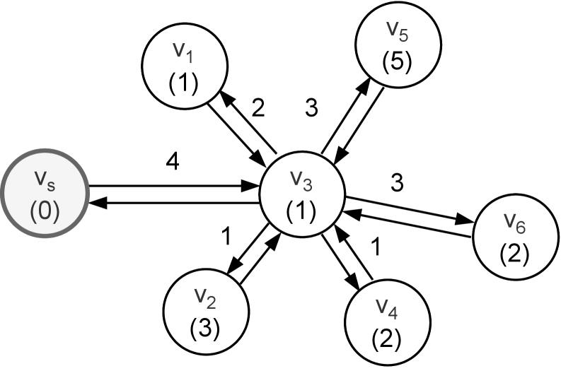

The paper emphasizes that RRAG should maintain complete direction sampling, meaning multiple yaw candidates can exist near the same position. In this way, during the search process, NBS can not only choose "where to go," but also "which direction to look after reaching that place."

RRAG has another advantage over the tree structure: the graph allows a node to be reached by multiple paths, and local paths can be reused. In contrast, the tree structure usually has only one parent node per node, making it easy to cut out paths that are not the shortest but contain high information.

## 10. Narrow channel and fallback local planner

In real spaces, there are often narrow doors, gaps between tables and chairs, and corners in corridors. Connecting two sampling nodes with straight lines can easily cause the graph to break due to failed collision detection.

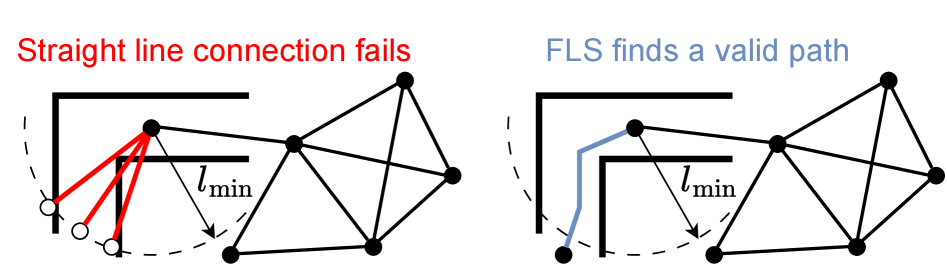

The figure illustrates the meaning of the fallback local sampling-based planner: when a simple straight line cannot connect two nodes, the local sampling planner attempts to find a feasible curve or detour path to reconnect the broken parts.

This is crucial for active perception. Because if the graph breaks at narrow channels, no matter how strong NBS is, it can only search on the wrong graph; the planner will assume that certain areas are unreachable, thus missing subsequent information benefits. RRAG's fallback is not a bonus, but an important engineering module that enables "online构图" to be effective in cluttered environments.

## 11. Three Types of Active Perception Tasks

The paper conducted simulation experiments on 8 indoor scenes from the Habitat Synthetic Scenes Dataset, covering three tasks: point collection, surface reconstruction, and volumetric exploration.

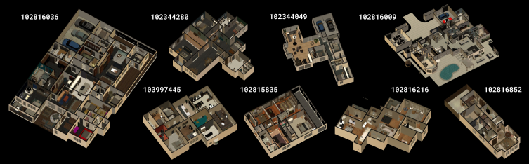

### 11.1 Point Collection

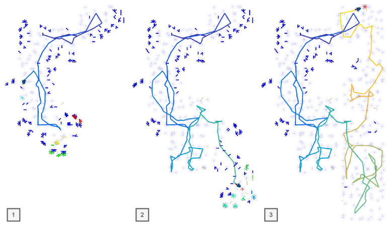

Point Collection can be understood as an ObjectNav type task without semantic tags:

- There are some dot-like targets in the environment.
- The robot initially has no idea where all the dots are located.
- The dots are only discovered when the view covers the relevant area.
- The robot needs to collect as many high-value dots as possible within the budget.

This task is suitable for verifying the balance between exploration and exploitation. When a robot sees a nearby point, should it immediately pick it up, or continue exploring the unknown area that may contain more points? The Expected Gain deals with this trade-off.

### 11.2 Surface Reconstruction

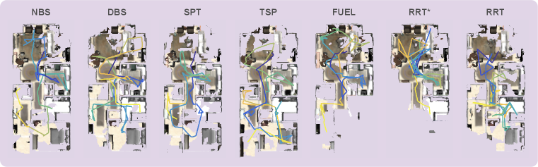

The goal of Surface Reconstruction is to scan the indoor surfaces as completely as possible. The real objective is "how much volume/surface area is finally reconstructed," but the robot does not know the complete environment during exploration, so it cannot directly optimize the final metric.

The paper uses surface frontier to estimate gain:

- It is known that there are unknown voxels near the occupied surface, indicating that the surface may not have been fully scanned.
- If a viewpoint can see many surface frontiers, it is worth exploring.
- After replanning, the robot will continuously fill in gaps, gradually making the reconstruction more complete from sparse to full.

These tasks are very similar to real-world factory inspections, indoor scanning, and mapping in disaster sites.

### 11.3 Volumetric Exploration

Volumetric Exploration focuses more on uncovering the unknown volumes in the environment, with the goal of "maximizing the observable free space/occupied space". The difference between it and surface reconstruction is:

- Surface reconstruction focuses more on whether the surface is fully scanned.
- Volumetric exploration focuses more on whether the space is thoroughly explored.

In engineering, their gain functions are different, but the planner framework can be reused: both update the map, calculate the frontier, build RRAG, and use NBS to find the next path.

## 12. How to understand the experimental conclusions

The paper conclusions can be viewed in three levels.

At the first layer, on the abstract diagram, NBS is more stable than TSP, SPT, and DBS. Especially when the beam width is small, NBS can still retain good paths, which indicates that "per-node retained candidates" is more suitable for information path planning than "per-depth global retained candidates".

In the second layer, within the online perception settings, Expected Gain is more suitable for active exploration than just Path Gain or Path Ratio. The reason isn't some magical effect, but rather it explicitly treats the frontier as potential future benefits, encouraging the robot to move towards areas that can open up new maps.

In the third layer, for real active perception tasks, the combination of NBS and RRAG performs best in three tasks: point collection, surface reconstruction, and volumetric exploration. As stated in the paper abstract, it improves by at least 20% relative to existing SOTA solutions in one or more tasks.

This indicates that its contribution is not a single trick, but a complete set of combinations:

```text
NBS 搜索算法
  + Expected Gain 路径选择指标
  + RRAG 在线图构建
  + 高频重规划
  + frontier-based gain estimation
= 可落地的主动感知规划器
```

## 13. Real Robot Experiment Boundary

The paper has also been verified on real robots. The hardware platform is the ANYmal quadruped robot, the front-end sensor uses ZED X Mini, the camera depth is processed by NVIDIA Jetson Orin, and the mapping and planning modules run on an Intel Core i7 CPU.

Real robot experiments include:

- Surface reconstruction in the laboratory.
- Surface reconstruction in outdoor spaces and engine museum.
- Volumetric exploration in the cafeteria and another laboratory environment.

Note: The real robot section focuses more on qualitative validation, which means proving that the entire pipeline can run on the board and perform mapping and planning online in complex environments. However, it is not a large-scale real robot benchmark, so it should not be interpreted as “all active perception problems for mobile robots have been solved”.

## 14. Relationship with VLA and world model

This can easily be placed in the wrong place, as recently, topics related to embodied AI such as world model, VLA, and interactive simulation have become very popular. However, its relationship with these areas should be understood this way:

| Direction | Whether it is the core of this paper | Relationship |
| :--- | :--- | :--- |
| VLA | No | No vision-language-action model training, and no robotic arm action tokens output |
| World model | No | No prediction of future videos or latent dynamics |
| Traditional navigation | Partially relevant | It is not the shortest path to the target point, but a path that maximizes information benefits |
| Active perception | Yes | The robot actively selects the next observation position and orientation |
| Mapping exploration | Yes | Uses frontier, ESDF, online map updates, and replanning |

If it is placed within the system framework, it should be located in this chain:

```text
感知建图模块给出 free / occupied / unknown
        ↓
主动感知规划器选择下一批高价值视点
        ↓
底层运动控制执行路径
        ↓
新观测反过来更新地图
```

In the future, it can be integrated with VLA. For example, when VLA assigns high-level tasks such as "inspect this area" or "find a certain object," NBS is responsible for low-level active viewpoint planning. However, this paper does not address language understanding and semantic goal grounding.

## 15. How to reproduce now

Currently, it is not possible to reproduction the experiment directly from the official repository, as the OpenApero code has not been made public yet. A more practical learning sequence is:

1. First, read the arXiv HTML version and focus on Figure 1, Figure 2, Section 4, Section 5, Section 7, and Section 8.
2. After the code is released in the OpenApero repository, start with the minimal graph benchmark. Do not immediately run Habitat or a real robot.
3. First, reproduction the a priori graph: construct a small graph with gain and edge cost, and compare SPT, DBS, and NBS.
4. Then, reproduction the online perception graph: expose only local nodes and the frontier each time, and observe whether the expected gain encourages more exploration of the path.
5. Finally, integrate with Habitat: load the HSSD scene, RGB-D observations, Voxblox/ESDF map, RRAG graph construction, and NBS replanning.

If you want to create a simplified version before the code is made public, it is recommended to implement only the following minimal experiment:

```text
输入：
  一个 NetworkX 图
  每个节点有 gain
  每条边有 cost
  一个起点 start
  一个预算 budget

实现：
  SPT baseline
  depth-wise beam search
  node-wise beam search
  path_gain / path_ratio 两种评分

输出：
  每种方法找到的路径
  总 gain
  总 cost
  搜索耗时
```

This minimal experiment does not require Habitat or robot simulation, but it helps you fully understand the core algorithm concept of the paper.

## 16. What to focus on when reading this

It is recommended to read according to the following questions, rather than trying to understand the formulas from scratch:

1. **Why cannot information path planning directly use the shortest path?**
2. **Why is TSP-based active perception expensive? Why does the two-stage point selection and connection do lose solution quality?**
3. **Why does DBS have its beam absorbed by the locally high-score region?**
4. **What diversity does per-node top-B in NBS actually preserve?**
5. **How does Expected Gain introduce the future value of the frontier into the path score?**
6. **Why does RRAG retain multiple orientations?**
7. **Which real engineering problem in online graph construction does fallback local planner solve?**
8. **What are the differences among the gain functions for the three types of tasks?**
9. **What have the simulation and real robot conclusions proven, and what have they not proven?**

Being able to answer these questions essentially captures the main theme of this paper.

## 17. The Value and Limitations of This Paper

Its value lies in: integrating the three issues of “search algorithm, path scoring, and online map construction” that have long existed in active perception into a complete pipeline, and verifying it step by step at three levels: abstract graph, Habitat, and real robot. For those involved in navigation, exploration, inspection, and 3D reconstruction, it is closer to traditional robot systems than just VLA hotspots.

Its limitations are also clear:

- It is a approximate search, not a precise optimal IPP solver.
- It relies on gain and frontier estimates; if the map or visibility estimates are poor, the planning will also be affected.
- Quantitative experiments are mainly based on HSSD indoor scenarios, and the scale of validation in real environments is limited.
- The current OpenApero code has not been officially released yet, so the tutorial cannot provide a complete reproduction command for now.
- It does not handle language semantic objectives, nor does it ensure the robustness of the underlying controller.

A more reasonable judgment is: this is a solid **active perception planning paper** that is suitable for filling in the gap regarding “how robots actively choose observation positions”, rather than being treated as a new VLA or world model framework.

## 18. Recommended Tasks

In team-based learning, it can be used as a review question for advanced navigation planning in Task04:

> Comparison of Habitat / ETPNav / NBS active perception: What are ordinary navigation, language navigation, and active perception respectively optimizing? What are the inputs and outputs? What are the failure boundaries?

Recommended delivery:

- Draw a closed loop diagram for NBS active sensing.
- Explain Figure 1 and Figure 2 in your own words.
- Compare the beam retention methods of DBS and NBS.
- Explain why expected gain is more suitable for exploration than mere path gain.
- Clearly state that the current OpenApero code is not yet publicly available, and reproduction should await an official release.

## 19. Citations and Image Sources

The images in this article are from the arXiv HTML version of the paper: [`An Efficient Beam Search Algorithm for Active Perception in Mobile Robotics`](https://arxiv.org/html/2604.23327v1). The copyright and usage rules shall follow those of the original paper and the arXiv page. For the status of the project and code, refer to [, OpenApero GitHub](https://github.com/OpenApero/openapero), and [ OpenApero project pages](https://openapero.github.io/).
