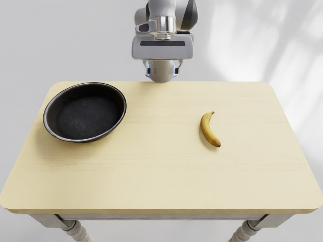

<!-- Generated by the offline translation workflow.
Source: 09-具身智能数据及评估基准benchmark/04-EBench.md
Source SHA-256: 397a1753a72f428184b5a8c273c1cf72d0e489d9ae0bebbfc2c64c63396a241c
Model: tencent/Hy-MT2-1.8B-GGUF:Q4_K_M
Review machine-translated technical claims before relying on them.
-->
# EBench / GenManip Reproduction Record: From Environment Configuration to Minimum Video Rendering

## 1 Overview

EBench is a evaluation benchmark for embodied manipulation tasks. In this reproduction, we do not aim to achieve full benchmark scores, but rather verify a minimal workflow: install the Isaac Sim 4.1 runtime environment, start the `Minimal_Banana` task of GenManip, complete planning, trajectory generation, and RGB rendering, and export a playable video.

This chapter records a simulation-level reproduction at the smoke test level. It proves that the simulation, planning, and rendering chain is functional, but it does not indicate that the complete EBench evaluation is completed.

## 2 This verification environment

The remote machine uses Ubuntu 22.04, and the GPU is RTX 4090. The environment is actually installed on a data disk to avoid writing large Python packages and Isaac cache to the shared disk.

| Item | Used This Time |
| --- | --- |
| Python | 3.10 |
| Isaac Sim | 4.1.0.0 |
| NumPy | 1.26.4 |
| PyTorch | 2.4.0+cu121 |
| cuRobo | v0.7.8 |
| Task Entry | `GenManip/configs/tasks/minimal.yml` |
| Output Task | `Minimal_Banana` |

The key conclusion is: For a simple EBench/GenManip smoke test, a card with 24GB of VRAM is sufficient. Complete data generation, batch testing, or large model policy deployment will consume additional VRAM and storage, requiring re-evaluation based on the task scale.

## 3 Key Points of Environment Configuration

The working directory is as follows:

```bash
/root/gpufree-share/ebench_repro/GenManip
```

The Python environment is placed on the data disk:

```bash
/root/gpufree-data/ebench_repro/venv_ebench
```

After the basic dependencies are installed, you need to explicitly accept the Omniverse EULA; otherwise, the first launch of Isaac Sim will get stuck with an interaction prompt:

```bash
export OMNI_KIT_ACCEPT_EULA=YES
export HF_HOME=/root/gpufree-data/hf_home
export TMPDIR=/root/gpufree-data/tmp
```

The PyPI package for Isaac Sim 4.1.1 requires Python 3.10. If Python 3.11 is used, there will be a version mismatch similar to the following:

```text
isaacsim 4.1.0.0 Requires-Python ==3.10.*
```

cuRobo needs to be fixed to the old API. GenManip code will be imported:

```python
from curobo.geom.sdf.world import CollisionCheckerType
```

The current main branch of cuRobo has adjusted the package structure, so it is fixed as follows:

```bash
cd saved/envs/curobo
git checkout v0.7.8
pip install -e . --no-build-isolation
```

## 4 Run the minimum task

Enter the GenManip root directory and activate the environment:

```bash
cd /root/gpufree-share/ebench_repro/GenManip
source /root/gpufree-data/ebench_repro/venv_ebench/bin/activate
export OMNI_KIT_ACCEPT_EULA=YES
export HF_HOME=/root/gpufree-data/hf_home
export TMPDIR=/root/gpufree-data/tmp
```

Run the minimum planning task first:

```bash
python demogen.py \
  --config configs/tasks/minimal.yml \
  --record minimal_planning
```

This time, 10 `Minimal_Banana` trajectories were generated. Each trajectory directory contains files such as `lmdb/data.mdb`, `info.json`, and `meta_info.pkl`.

## 5 Render Video

The default camera configuration enables depth, semantic segmentation, 2D/3D bbox, and motion vector. This configuration caused CUDA/Hydra rendering errors in the Isaac Sim 4.1 + dual 4090 environment:

```text
CUDA error 700: an illegal memory access was encountered
HydraEngine::render failed
Rendering failed
```

To complete the smoke test, we used a RGB-only rendering configuration and explicitly turned off Isaac multi-GPU:

```python
simulation_app = SimulationApp(
    {
        "headless": True,
        "active_gpu": 0,
        "physics_gpu": 0,
        "multi_gpu": False,
        "max_gpu_count": 1,
    }
)
```

Disable non-RGB annotator in camera configuration:

```yaml
with_distance: false
with_semantic: false
with_bbox2d: false
with_bbox3d: false
with_motion_vector: false
```

Complete rendering command:

```bash
python render_single_gpu.py \
  --config configs/tasks/minimal_rgb_only.yml \
  --without_depth \
  --record rgb_only_single_gpu_full
```

The rendering result is 316 frames in RGB format, which are then decoded from LMDB into MP4. The three-camera video is as follows.

<video controls muted preload="metadata" width="100%">
  <source src="../../09-具身智能数据及评估基准benchmark/assets/ebench/ebench_minimal_banana_obs_camera.mp4" type="video/mp4">
</video>

<video controls muted preload="metadata" width="100%">
  <source src="../../09-具身智能数据及评估基准benchmark/assets/ebench/ebench_minimal_banana_obs_camera_2.mp4" type="video/mp4">
</video>

<video controls muted preload="metadata" width="100%">
  <source src="../../09-具身智能数据及评估基准benchmark/assets/ebench/ebench_minimal_banana_realsense.mp4" type="video/mp4">
</video>

A top-down view was saved synchronously during rendering:

<p align="center">
  
  <br>
  <b> Figure 1: Top view of Minimal_Banana rendering </b>
</p>

## 6 Verified Results

The current smoke test has completed the following checks:

- Isaac Sim 4.1 can be launched in a remote environment.
- The GenManip `Minimal_Banana` task can complete cuRobo planning.
- Trajectory data has been successfully written to LMDB.
- RGB-only rendering can generate 316 frames of images.
- The three-camera video has been exported as MP4, with a resolution of 640×480 and a frame rate of 30 FPS.

## 7 Common Questions

### 7.1 EULA Input Stuck

Set environment variables:

```bash
export OMNI_KIT_ACCEPT_EULA=YES
```

### 7.2 Unable to find `curobo.geom`

Use cuRobo `v0.7.8`, and do not use the current main branch directly.

### 7.3 CUDA/Hydra errors occur during default rendering

First, turn off multiple GPUs and configure the camera as RGB-only. For the smoke test, ensure that the video link works properly. If you want to export semantic segmentation, bbox, and depth data completely, then separately check the Isaac version, drivers, Vulkan/CUDA interop, and Replicator configuration.

### 7.4 The complete video cannot be rendered after only running `--without_planning`

`--without_planning` is only suitable for verifying the loading and saving of minimal trajectory information. `render.py` requires planning results, so to generate an action video, one should first run `demogen.py` without `--without_planning`.

## 8 Summary

This reproduction has established a closed loop for EBench/GenManip: environment installation, minimal task planning, RGB rendering, and video export. If a formal benchmark is to be conducted in the future, it is necessary to complete all EBench assets, select a baseline policy, and run the evaluation in batches using the official task set.
