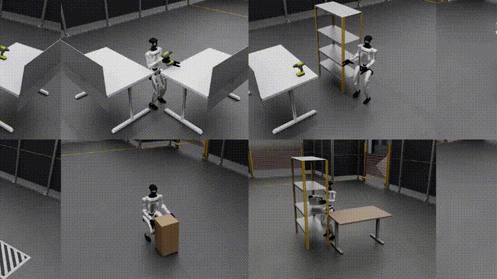
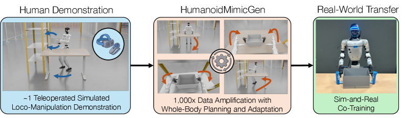
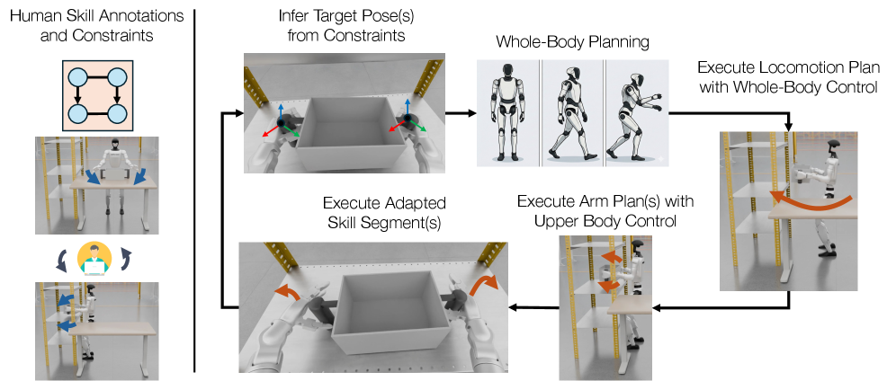
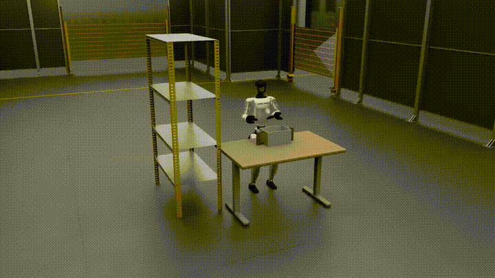
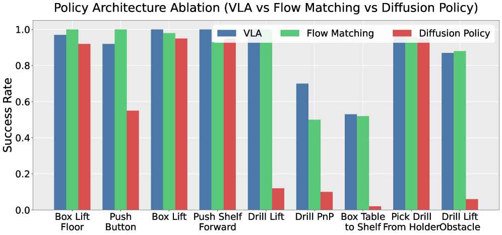
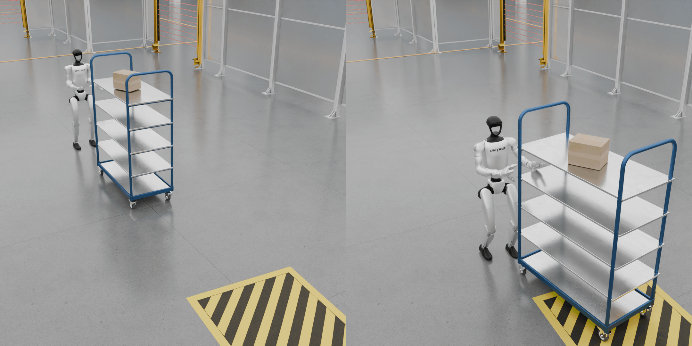
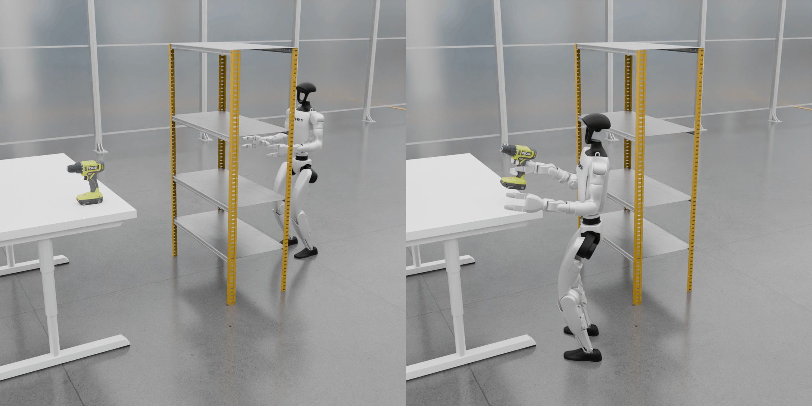

<!-- Generated by the offline translation workflow.
Source: 10-具身智能其他仿真工具及仿真前沿/12HumanoidMimicGen全身规划数据生成导读/README.md
Source SHA-256: ac9a8757c2925fc3d9d02fbcff627837b035a964c7072f5f840bb5eb54cbd84f
Model: tencent/Hy-MT2-1.8B-GGUF:Q4_K_M
Review machine-translated technical claims before relying on them.
-->
# HumanoidMimicGen: Using full-body planning to expand a small amount of humanoid teaching into large-scale manipulation data

This introduction corresponds to the paper **HumanoidMimicGen: Data Generation for Loco-Manipulation via Whole-Body Planning** by authors such as NVIDIA and UT Austin. It is suitable for inclusion in the `10-具身智能其他仿真工具及仿真前沿` section of this repository, following SIM1, InternDataEngine, UniLab + MotrixSim, serving as a supplementary approach to "simulation data generation + humanoid robot whole-body manipulation" at the cutting edge.

One-sentence summary:

> HumanoidMimicGen is not a new VLA base, nor a pure visual world model, but a data generation system for humanoid robot loco-manipulation: starting from a small number of even single remote manipulation teachings, it breaks down these teachings into constrained skill segments, and then uses full-body IK, motion planning, leg motion controllers, and skill replay to extend the same task to multiple positions of different objects, the robot’s initial pose, and scene layouts.

Its key value lies in solving the problem of “when humanoid robots need to walk and manipulate, the teaching data is too expensive”. The data augmentation method for fixed robotic arms can be applied to the end effector alone. However, humanoid robots have multiple legs, a torso, balance, gait, and long-term navigation; it cannot simply translate the arm trajectory and reuse it. The core contribution of HumanoidMimicGen is to upgrade “teaching reuse” into a combined system of “teaching skills + whole-body planning + motion control”.

## 1. Paper, project page, and open-source status

| Item | Information |
| :--- | :--- |
| Item Page | [humanoidmimicgen.github.io](https://humanoidmimicgen.github.io/) |
| Paper | [arXiv:2605.27724](https://arxiv.org/abs/2605.27724), submitted on 2026-05-26 |
| arXiv HTML | [HumanoidMimicGen HTML](https://arxiv.org/html/2605.27724v1) |
| Institutions | NVIDIA, The University of Texas at Austin |
| Robot | The main experiments use a humanoid robot with Unitree G1 morphology |
| Simulation Stack | The benchmark described in the paper is based on MuJoCo and robosuite; for motion planning, cuRobo is used for GPU-accelerated collision detection and batch IK |
| Policy Learning | In the simulation policy experiment, GR00T N1.6 VLA is fine-tuned; in the real robot experiment, a flow matching policy is used for sim-and-real co-training |
| Code | As of 2026-07-18, no GitHub/Code link is provided on the official project page |
| Related Open Source Entries | [NVlabs/mimicgen](https://github.com/NVlabs/mimicgen) is the official repository of the original MimicGen, which can help understand the "few demonstrations augmentation" family of methods |

It should be noted specifically: if users want to fully reproduce the results of the HumanoidMimicGen paper now, the ideal approach is to wait until the official code, benchmark environment, and data generation scripts are released. The current tutorial focuses on introducing the methods and outlining the reproduction steps, rather than being a engineering tutorial where everything can run automatically with one click. Readers can first learn about the relevant interfaces of MimicGen / DexMimicGen / robosuite / MuJoCo / cuRobo, and then follow the running steps after the official repository is available.

## 2. Official Effect Preview

<p align="center">
  
</p>

**Figure 1: The official teaser video of HumanoidMimicGen converted into a GIF.** The key feature displayed on the project page is that, starting from a small amount of remote manipulation teachings, a large number of humanoid robots are automatically generated to perform tasks such as handling objects, pushing cabinets, picking up drills, and retrieving items around obstacles under various layouts.

Source: [ HumanoidMimicGen project page ](https://humanoidmimicgen.github.io/).

This dynamic graph shows the difference from ordinary “robotic arm data augmentation”:

- The robot is not fixed in front of the table, but must first move its pose before entering the manipulation area.
- Manipulation relies not only on the arms, but also considers the trunk posture, foot support, root node position of the robot, and long-time trajectory phases.
- The same source teaching is migrated to a new object pose, robot initial pose, and obstacle layout, generating new executable trajectories.

## 3. Why it is more difficult to generate data for human-like loco-manipulation

Traditional MimicGen addresses teaching augmentation in scenarios with a fixed base or stable robotic arm. For example, when a robotic arm picks up a cup from a table, the trajectory of the end point relative to the cup in the source teaching can be transferred to the position of the new cup: simply transform the SE(3) trajectory of “hand relative to object,” and then let the robotic arm controller follow it.

Humanoid robots are different. Their tasks typically include both locomotion and manipulation:

```text
走到物体附近 -> 调整脚步和身体姿态 -> 伸手抓取 -> 搬运或推动 -> 再移动到目标区域 -> 放置或完成交互
```

There are at least four types of coupling here:

| Challenges | Specific meanings | What would happen if a robotic arm MimicGen is used directly? |
| :--- | :--- | :--- |
| Leg and hand coupling | Whether the hand can grasp an object depends on where the feet stand, how the torso rotates, and whether the robot maintains balance | The arm trajectory seems correct, but the body position is wrong, so the end effectors are completely unreachable |
| Dynamic stability | The control rules during walking and static manipulation stages are different | Trajectory interpolation of the robotic arm cannot ensure stable movement for a bipedal robot |
| Long-time domain phase | Pushing cabinets, moving boxes, and navigating around obstacles to retrieve drills are not short grasping actions | Single-segment trajectory migration is prone to failure during the middle stage |
| Rich contact | Holding a box with both hands, pushing a shelf, and removing a drill from a holder all involve continuous contact | Only migrating the end pose may result in collisions, misalignment, or loss of contact relationships |

So what this paper really aims to solve is: **how to break down a human-like teaching into transferable local skills, while using whole-body planning to ensure that each skill remains accessible, stable, and collision-free in new scenarios.**

## 4. Overview Diagram: From a single teaching to thousands of data expansions

<p align="center">
  
</p>

**Figure 2 Overview of HumanoidMimicGen.** On the left is remote manipulation of a small amount of source teaching by humans; in the middle, data augmentation at 1000x levels is performed through whole-body planning and adaptation; on the right, the policy is trained using these simulation data, followed by sim-and-real co-training.

Source: [HumanoidMimicGen arXiv HTML](https://arxiv.org/html/2605.27724v1).

This image can be divided into three sections:

1. **Human Demonstration**: Humans perform a complete task demonstration using a VR controller. In the paper experiments, only one source demonstration is collected for each simulation task; real robot experiments also emphasize a small amount of real data.
2. **Data Amplification**: The system does not randomly perturb the entire trajectory, but first understands the goal and constraints of each skill segment, and then replan an executable path for new scenarios.
3. **Policy Learning**: The generated trajectory is not the final controller, but the training data for imitation learning. In the simulation, post-training training is performed using GR00T N1.6 VLA, while on the real G1, the training policy is trained using a mixture of generated and real data.

This process is important for open-source tutorials: it is neither an interactive simulator that allows “playing in the world model using the keyboard,” nor a world model that “predicts the next frame of video.” It is more like a synthetic data engine, aiming to generate state-observation-action demonstrations that can be used to train policy.

## 5. Method Diagram: Skill Annotation, Constraints, Full Body Planning, Skill Adaptation

<p align="center">
  
</p>

**Figure 3: Pose of the HumanoidMimicGen method.** On the left is the source teaching with skill annotations and constraints; on the right, the system infers the end pose of the target based on the constraints, and then performs whole-body planning, leg movement, arm planning, and skill segment adaptation in sequence.

Source: [HumanoidMimicGen arXiv HTML](https://arxiv.org/html/2605.27724v1).

This architecture diagram is recommended to be understood in four layers: "input, planning, execution, and output".

### 5.1 Input: source demonstration + per-arm skill annotations

Source teaching is not a string of unstructured trajectory, but a trajectory with skill segmentation. A task will be divided into multiple object-centric skills, for example:

| Task | Possible skill segments |
| :--- | :--- |
| Box Table To Shelf | Left hand approach to the box, right hand approach to the box, lifting the box with both hands, walking to the shelf, placing the box with both hands |
| Drill PnP | Walk to the first table, grasping the drill bit, picking up the drill bit, walk to the second table, placing the drill bit |
| Push Shelf Forward | Walk to the shelf, contact the shelf with both hands, continuously push, stop at the target area |

Each skill segment is typically bound to an end effector and the reference object coordinate system. For example, “right hand grasping the drill bit” does not merely record the position of the right hand in world coordinates, but records the trajectory of the right hand relative to the drill bit coordinate system. Thus, when the drill bit moves, the trajectory can be transformed and migrated according to the object coordinates.

### 5.2 Constraints: precedence and coordination

The humanoid two-armed task is often not strictly single-threaded. The paper uses two types of constraints to express the skill relationships:

- **precedence constraint**: Which skill must occur before which other skill. For example, first grab the box, then place it on the shelf.
- **coordination constraint**: Which skills need to be executed simultaneously. For example, lift the box with both hands at the same time, or push the shelf with both hands at the same time.

These constraints are compiled into a skill execution order diagram. Simple tasks can be linear, while two-handed tasks may involve parallel skill groups. The system selects a set of skills to execute at a time, and then calculates the target pose and full-body configuration for these skills.

### 5.3 Target Inference: Deriving from Constraints to end-effector target poses

In the new scene, the position of objects changes, and the robot's initial position may also change. HumanoidMimicGen needs to infer the new end goal based on the relative relationships in the source teaching:

```text
源示教中：末端相对物体的目标位姿
新场景中：物体的新世界位姿
推断出：末端在新世界中的目标位姿
```

This step preserves the relative relationships in the task semantics. For example, "the hand approaches from the side of the drill handle" is more transferable than "the hand reaches a fixed point in world coordinates".

### 5.4 Full Body IK: First, check if the robot can achieve it

After inferring the end goal, the system seeks a full-body configuration for a humanoid robot to enable the active end effector to achieve the target, while maintaining a reasonable body structure as much as possible. The paper uses whole-body inverse kinematics, and the appendix explains the use of cuRobo for GPU-accelerated batch IK and collision detection.

The difference between this and robotic arm IK is that humanoid robots have many degrees of freedom that can move. When the hand cannot reach, it isn't just about moving the shoulders, elbows, and wrists; the torso can also be rotated, the leg positions adjusted, and even the robot’s root pose can be changed. Therefore, IK is not simply about optimizing arm joints, but finding a solution within the whole-body configuration space that is reachable, stable, and minimizes unnecessary movements.

### 5.5 Decomposition Planning: Separate Dynamic Walking and Static Manipulation

The paper adopts the engineering approach of decoupled planning, breaking down the stages into:

```text
当前配置
  -> locomotion plan：腿部和底盘位置移动到 switch configuration
  -> manipulation plan：站稳后用上半身接近目标配置
  -> adapted skill segment：重放并适配源示教里的接触技能
```

The reason for this approach is practical: the walking phase of bipedal robots involves dynamic stability issues, while the fine manipulation of the arms is closer to static stability problems. Attempting to plan all degrees of freedom simultaneously within a single controller would result in high difficulty and failure rates. HumanoidMimicGen breaks it down as follows: during leg movement, the learned locomotion policy is used to execute pelvis velocity commands, and during manipulation, upper-body joint-space control is applied.

### 5.6 Skill Adaptation: It's not just reaching the target, but also replaying contact segments

After reaching near the target, the system will also execute local skills from the source teaching, such as grasping, lifting, pushing, and placing. Skill adaptation will recalculate the end trajectory based on the pose of the object in the new scene, and full-body IK will track these adapted end-effector target poses. Details such as finger joints will be replayed according to the source teaching in the paper description.

This step is the core of the MimicGen lineage: instead of relearning all movements, the local contact experience of "relative objects" from the source teaching is reused. The improvement in HumanoidMimicGen is to add full-body accessibility, gait movement, and collision constraints to these skills before and after on humanoid robots.

## 6. Method Video: How Planning and Skill Adaptation Are Executed Alternately

<p align="center">
  
</p>

**Figure 4: Official method video converted to GIF.** This video demonstrates how the system alternates between locomotion planning, manipulation planning, and skill adaptation.

Source: [HumanoidMimicGen project page](https://humanoidmimicgen.github.io/).

When watching this video, don't just focus on the fact that the robot "moves smoothly". What's more important is to see what problem each stage solves:

- **Locomotion Planning** addresses “where a humanoid robot should stand and how to walk there”.
- **Manipulation Planning** addresses “after standing firmly, how the upper body and arms reach the starting pose for the skill”.
- **Skill Adaptation** addresses “how local contact actions from source teaching are transferred to the current object pose”.

These three functions operate alternately, so that a source teaching can be successfully rolled out in the new layout.

## 7. Motion Randomization: Why Generating a bunch of perfect trajectories is Not Enough

The paper emphasizes particularly the motion noise and initialization randomization. This is because the imitation policy cannot merely learn from the expert trajectory under ideal conditions. During real or simulation closed loop execution, the robot will deviate from the expert trajectory. If the training data does not cover these off-nominal states, any deviation in the policy will become more severe over time.

The approach of HumanoidMimicGen can be understood as:

```text
执行时：给动作加入噪声，让机器人经历轻微偏差
存标签时：仍然保存原本专家动作作为监督信号
训练时：策略看到偏差状态，也学习如何回到专家轨迹
```

This is somewhat similar to DAgger’s approach: the training data should cover all possible poses that the policy might reach, rather than just the states on the expert ideal trajectory. The paper experiments also show that after removing motion noise, the average success rate drops from 0.89 to 0.49; when the initial pose is fixed and initialization randomization is not performed, the average success rate drops from 0.89 to 0.51.

## 8. G1 Loco-Manipulation Benchmark

<p align="center">
  
</p>

**Figure 5 G1 Loco-Manipulation Benchmark.** The paper proposes 9 simulation human loco-manipulation tasks, each showing a random initial scenario and a completed state.

Source: [HumanoidMimicGen arXiv HTML](https://arxiv.org/html/2605.27724v1).

These 9 tasks cover changes from short-range proximity to long-time-domain movement, from single-arm manipulation to dual-arm collaboration, and from desktop objects to shelf/obstacle layouts:

| Task | Requirement |
| :--- | :--- |
| Box Lift Floor | Pick up boxes from the ground and lift them to the target height |
| Push Button | Walk to the industrial panel and press the button |
| Box Lift | Walk to the table, pick up a box, and lift it |
| Push Shelf Forward | Push the shelf cart to the target area |
| Drill Lift | Walk to the table, pick up the drill bit |
| Drill PnP | Take the drill bit from one table and place it on another table |
| Box Table To Shelf | Transfer the box on the table to the shelf |
| Pick Drill From Holder | Take out the drill bit from the holder and lift it |
| Drill Lift Obstacle | Pick up the drill bit after bypassing the blocking shelf |

The value of this benchmark lies not only in having 9 tasks, but also in the fact that the task design addresses the most challenging aspects of humanoid robot navigation: a slight misalignment in foot placement makes it impossible for the hands to reach; slight instability in body posture causes failure when hands touch; and navigation errors in long-term tasks early on affect the feasibility of subsequent operations.

<p align="center">
  
  
</p>

**Figure 6: Screenshots of the Push Shelf Forward and Obstacle-Aware Pick Drill tasks on the item page.** The left figure emphasizes continuous hand contact and long-term shelf pushing, while the right figure highlights the combination of obstacle navigation, positioning, and single-arm grasping.

Source: [HumanoidMimicGen project page](https://humanoidmimicgen.github.io/).

## 9. How to read the experimental results

The paper compared 4 types of data sources on simulation benchmarks:

| Data Source | Average Success Rate |
| :--- | :--- |
| 1 Human Demo | 0.26 |
| 100 Human Demos | 0.48 |
| DexMimicGen+ | 0.33 |
| HumanoidMimicGen | 0.89 |

The focus of this result is not simply that “it is stronger than 100 human demonstrations,” but rather it indicates that for humanoid loco-manipulation, the number of demonstrations is not the only bottleneck. Whether the data covers appropriate positions, object disturbances, skill capabilities, and long-time-domain stages are also crucial. If the scenario coverage for 100 human demonstrations is insufficient, the policy still tends to learn from a narrow distribution; HumanoidMimicGen, through generating 1,000 trajectories via planning and randomization, can cover more possible states.

The paper also provides several representative long-time-domain examples:

- PushShelfForward lasts approximately 1230 steps. HumanoidMimicGen reaches 1.00 PSR, DexMimicGen+ is 0.35, and a single source demonstration is 0.70.
- BoxLiftFloor has approximately 900 steps. HumanoidMimicGen reaches 0.97 PSR, DexMimicGen+ is 0.87, and a single source demonstration is 0.14.

This indicates that it is particularly effective for the combined task of "long-time domain + whole-body movement + contact manipulation".

## 10. Policy Model: Why VLA is Also Mentioned in the Paper

HumanoidMimicGen generates teaching data, and ultimately requires training a policy. The paper uses the GR00T N1.6 base model for VLA after ablation of the simulation policy architecture, and compares it with Flow Matching and Diffusion Policy:

| Policy Architecture | Average Success Rate |
| :--- | :--- |
| VLA | 0.89 |
| Flow Matching | 0.86 |
| Diffusion Policy | 0.51 |

Two points need attention here:

- HumanoidMimicGen is not the VLA itself, but rather a data source for the VLA.
- The paper results indicate that on this benchmark, fine-tuning the VLA with data generated by HumanoidMimicGen is effective; however, the value of the data generator is not bound to a specific policy architecture, and Flow Matching also performs close to that of the VLA.

For tutorial readers, this section can be connected to chapters such as GR00T, OpenVLA, pi0, and SmolVLA. The maximum capabilities of VLA depend not only on the model structure but also heavily on whether sufficient robot data is available. HumanoidMimicGen addresses this gap from the data side.

## 11. Real robot results: sim-and-real co-training

The paper also performed four tasks on the real G1:

| Task | Real Only | Co-training |
| :--- | :--- | :--- |
| ThrowBottle | 0.60 | 0.75 |
| BoxToCart | 0.35 | 0.60 |
| PickCanister | 0.50 | 0.75 |
| PickCanisterWithObstruction | 0.60 | 0.75 |
| Average | 0.51 | 0.71 |

The conclusion is clear: training the simulation data generated by HumanoidMimicGen together with a small amount of real robot data is better than using only real data, with an average improvement of 20 percentage points. This result is very attractive because it addresses what current humanoid robots currently lack: real full-body manipulation data is expensive, but more coverage can be generated using a planner in simulation.

However, it is also necessary to clearly define the boundaries: the number of real experimental tasks is limited, and it still relies on manually constructed simulation environments, initial state distributions, and success conditions. It proves that "this data supplementation approach is effective," but it does not indicate that simply relying on simulation to generate data can solve the challenges of open-world humanoid robots manipulation.

## 12. Differences from MimicGen / DexMimicGen+ / RoboDream

| Method | Main Object | What is Generated | Key Assumptions | Differences from HumanoidMimicGen |
| :--- | :--- | :--- | :--- | :--- |
| MimicGen | Fixed or relatively stable robotic arm | Massive robotic arm manipulation | End-effector control is relatively independent and stable | Humanoid robots require overall coordination of legs, torso, and arms |
| DexMimicGen | Two hands/dexterous manipulation | Bilateral arms or dexterous hand manipulation | Focus is on hand and upper limb contact | HumanoidMimicGen explicitly handles locomotion, posture, and full-body accessibility |
| DexMimicGen+ baseline | Expanding DexMimicGen to humanoid | Simplified humanoid expansion trajectory | Linear paths and weak planning | Lacks complete skill reasoning, motion planning, and collision checking |
| RoboDream | Robot video data synthesis | Synthetic teaching video/trajectory data | Utilizes robot-only trajectory, scene prior, and object prior | Focuses on generative data synthesis; HumanoidMimicGen focuses more on planning and control-driven data generation |
| HumanoidMimicGen | Bipedal humanoid loco-manipulation | State-observation-action teaching trajectory | Contains some skill annotations, task environment, and success conditions | Integrates teaching skills, full-body IK, motion planning, leg control, and randomization into a data generation system |

If it is to be included in a curriculum system, it can be understood as follows:

- **MimicGen** is the classic starting point for “minimal demonstration augmentation”.
- **RoboDream** represents “synthesizing robot data using a generative world model/priors”.
- **HumanoidMimicGen** is a representative approach for “demonstrating and augmenting the entire humanoid robot body through planning and control”.

## 13. Recommendations for Reproduction Route

Currently, it is not recommended to write this up as a step-by-step reproduction experiment, because the official HumanoidMimicGen code and the benchmark environment entry have not been made public on the project page. A more appropriate approach is to first remove all dependencies, and then wait for the official code:

1. **Read the project page and paper figures**: First, understand Figures 1, 2, and 3 to clarify their inputs, outputs, and intermediate modules.
2. **Study the original MimicGen**: Read [NVlabs/mimicgen](https://github.com/NVlabs/mimicgen) to grasp object-centric skills, a small number of teaching augmentations, and the robosuite data generation process.
3. **Understand robosuite / MuJoCo**: The G1 benchmark in this paper is based on the MuJoCo and robosuite systems, and the official code will likely be organized around these interfaces.
4. **Improve cuRobo / IK / collision checking**: The appendix mentions using cuRobo to accelerate whole-body IK and motion planning via GPU, which may be a challenge for reproduction.
5. **Track the official code sources**: After the project page adds GitHub/Code links, prioritize running single tasks, individual teaching augmentations, and basic rollout visualizations, before considering training GR00T or other policies.
6. **Don’t rush to reproduce all metrics**: In paper simulation training, 1000 demonstrations per task are used, 25K steps are trained after VLA, and evaluation is performed on 8 H100 machines. For ordinary learners, it is more realistic to first reproduce data generation visualization and a small task.

If the reader only wants to complete a course assignment, they can submit a method review without running training. Focus on answering these questions:

- Which information in the source teaching requires manual annotation?
- How are skill segments transferred from the source object pose to the new object pose?
- Why is leg locomotion processed separately from upper body manipulation?
- What generalization issues are motion noise and initialization randomization designed to address?
- How do the data generated by this method ultimately serve VLA or flow matching policies?

## 14. Limitations and Future Research Directions

The paper also acknowledges several boundaries:

- Manual labeling of skill segments, as well as precedence / coordination constraints between skills, is required.
- The simulation environment, initial state distribution, and success conditions are still manually designed.
- Currently, the task assumes a fixed set of skills and a fixed skill ordering structure, resulting in limited generalization to open tasks that require new skill sequences or higher-level planning.
- It mainly relies on coordinate transformation of rigid bodies and is not effective for handling objects with significant geometric differences within a class or ambiguous contact affordances.

These limitations actually provide a clear direction for subsequent research:

- Automatically perform skill segmentation and constraint labeling using VLM/LLM.
- Automatically construct planable simulation environments by combining 3D scene reconstruction.
- Integrate the data generated by HumanoidMimicGen into more comprehensive humanoid VLA systems such as GR00T / OpenHLM / WholeBodyVLA.
- Study which data randomization is most effective in sim2real, and which merely appears useful during simulation.

## 15. Recommended Reading Order

If you learned from this repository, you can establish the context in the following order:

1. [MuJoCo reproduction of ACT, Pi0, SmolVLA](../../06-manipulation-and-vla/large-model-control-vla-vlm/04-mujoco-reproduction-act-pi0-smolvla/README.md): First, understand the simulation manipulation tasks and policy training.
2. [Deployment guidance for Isaac Sim, Isaac Lab, and GR00T](../01-isaac-deployment-and-gr00t-practices/00-isaac-deployment-navigation.md): Understand humanoid policy and GR00T engineering approaches.
3. [SIM1 soft body simulation and data generation](../09-sim1-soft-body-simulation-and-data-generation/01-sim1-environment-configuration-and-operation.md): Understand simulation data generation and trajectory filtering.
4. [RoboDream composite world model data synthesis guide](../../17-world-models/robodream-compositional-world-model-data-synthesis-guide/README.md): Compare generative data synthesis approaches.
5. This paper: Understand why full-body planning is necessary for generating trainable data in humanoid loco-manipulation scenarios.

## 16. Reference Links

- [HumanoidMimicGen Project Page](https://humanoidmimicgen.github.io/)
- [HumanoidMimicGen arXiv](https://arxiv.org/abs/2605.27724)
- [HumanoidMimicGen arXiv HTML](https://arxiv.org/html/2605.27724v1)
- [NVIDIA Research Publication](https://research.nvidia.com/publication/2026-06_humanoidmimicgen-data-generation-loco-manipulation-whole-body-planning)
- [NVlabs/mimicgen](https://github.com/NVlabs/mimicgen)
