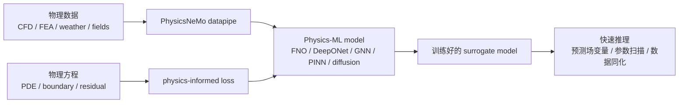

# PhysicsNeMo: NVIDIA Physical AI Solver Introduction

> Official homepage: https://developer.nvidia.com/physicsnemo
> GitHub: https://github.com/NVIDIA/physicsnemo
> Documentation: https://docs.nvidia.com/physicsnemo/latest/
> Example directory: https://docs.nvidia.com/physicsnemo/latest/examples_catalog.html
> Installation documentation: https://docs.nvidia.com/physicsnemo/latest/getting-started/installation.html
> Open source license: Apache-2.0

PhysicsNeMo is a open-source deep learning framework developed by NVIDIA for physics AI / AI4Science / engineering simulation. Its primary goal is not to train VLA or enable robot simulation interactions, but rather to build, train, fine-tune, and reason over physical machine learning models, such as neural operators, graph neural networks, diffusion models, PINN, weather/climate models, CFD surrogates, structural mechanics, and electromagnetic field surrogate models.

This article is placed in `10-具身智能其他仿真工具及仿真前沿` and is most suitable as supplementary reading. It is related to embodied AI, but the relationship is quite distant: while embodied robots certainly focus on contact, fluids, materials, soft bodies, and multi-physical fields, mainstream embodied learning tutorials more often use interactive simulators such as MuJoCo, Isaac Sim, ManiSkill, Genesis, and Habitat. PhysicsNeMo is more like a “fast surrogate solver for learning physical PDE/engineering simulations using neural networks”—it is not an environment designed for robots directly `env.step(action)`.


Figure 1: The role of PhysicsNeMo in the tutorial. Here, a local SVG is used to illustrate its core flow: physical data and PDE constraints enter the Physics-ML model, and a surrogate model capable of rapid inference is trained. Most of the diagrams on the official developer page are client case studies rather than clear architecture diagrams. Therefore, this chapter uses self-drawn diagrams to explain the concepts.

## 1. Let's get to the point first: It has little to do with us, but it's worth knowing.

If the goal is to reproduction OpenVLA, SmolVLA, ACT, robot grasping, navigation, world model, or real robot control, PhysicsNeMo is not a high-priority tool. It will not replace:

- Robot dynamics simulation for MuJoCo / Isaac Sim / ManiSkill;
- Navigation environment for Habitat / VLN-CE;
- Robot policy training for LeRobot / OpenPI / OpenVLA;
- Action condition world models such as RAW-Dream / GE-Sim / BWM;
- Platforms more directly focused on robots or physical simulation, such as Genesis / SIM1.

It is more suitable for these types of problems:

- Use FNO / DeepONet / Graph Neural Network to learn PDE solvers;
- Train simulation results from CFD, structural mechanics, electromagnetism, and weather into surrogate models;
- Incorporate PDE residuals, boundary conditions, or conservation constraints into existing physical data;
- Perform large-scale Physics-ML training using PyTorch + NVIDIA GPU;
- Research PINN, neural operators, mesh / point-cloud datapipe, and distributed training.

Therefore, it is not recommended to use PhysicsNeMo as the main reproduction task in the tutorial. It is suitable as “readings on physical AI solvers”: just understand what it is, what it can solve, and how it differs from robot simulators.

## 2. Name change: Modulus to PhysicsNeMo

PhysicsNeMo is not a completely new project that emerged out of thin air. It has a deep connection to NVIDIA's past Modulus project. Now, both the official GitHub and documentation use PhysicsNeMo as the main name. The repository README also mentions that PhysicsNeMo is undergoing a v2.0 update, and provides a migration guide.

It can be simply understood as:

```text
NVIDIA Modulus / Modulus Sym
    -> PhysicsNeMo / PhysicsNeMo Sym / PhysicsNeMo CFD / PhysicsNeMo Curator
```

Therefore, in many old tutorials, blogs, issues, or mirrors, you will still see the name `modulus`. When looking up information, pay attention to the version and package names. Do not directly apply old Modulus commands to the new PhysicsNeMo environment.

## 3. Is it really a "Physical AI Solver"?

It can be said so, but it is necessary to clarify the meaning of "solver".

Traditional physics solvers are typically numerical methods: finite difference, finite element, finite volume, spectral methods, particle methods, and rigid/soft dynamics solvers. They directly discretize physical equations and compute step by step on meshes/grid/particles.

The "solver" of PhysicsNeMo is more like a neural agent solver:



During the training phase, it may require a large amount of simulation data, observation data, or PDE residuals. During the inference phase, it can produce approximate solutions more quickly than traditional simulation—for example, given boundary conditions, geometric parameters, or initial fields, it can predict future field variables, pressures, velocities, temperatures, stresses, or meteorological variables.

The core value of these models is to accelerate parameter scanning, design optimization, data assimilation, and interactive engineering exploration, rather than replacing all high-fidelity simulations.

## 4. Core Components

According to the NVIDIA official README, PhysicsNeMo is modularly organized, and the key components are as follows:

| Component | Function |
| :--- | :--- |
| `physicsnemo.models` | Model architecture library, including neural operators, GNN, diffusion, transformer, PINN, etc. |
| `physicsnemo.datapipes` | Data pipeline for engineering/science data, such as point clouds, meshes, fields. |
| `physicsnemo.distributed` | Distributed training tool based on `torch.distributed`. |
| `physicsnemo.curator` | Sub-module for engineering data processing and accelerated data curation. |
| `physicsnemo.sym` | Symbolic PDE residual, geometric/domain sampling, physics-informed loss, etc. |
| `physicsnemo-cfd` | Domain sub-module for CFD workflow and pre-trained model inference. |

The ones that are most closely related to the "Physical AI Solver" are `models`, `datapipes`, and `sym`. If you only want to run a neural network model, you can use just `core`; if you need to explicitly include PDE residuals, boundary conditions, and geometric sampling in the training, you will encounter `physicsnemo-sym`.

## 5. Which model architectures are supported

Representative models mentioned on the PhysicsNeMo official model architecture page and README include:

- **Fourier Neural Operator (FNO)**: Learns the mapping from one function space to another, commonly used in PDE surrogate models.
- **DeepONet**: Also belongs to the neural operator approach, using branch/trunk networks to learn operators.
- **DoMINO**: A model developed by NVIDIA for geometric/engineering field prediction.
- **Graph Neural Networks**: Suitable for mesh, particle, graph structures, or irregular geometry.
- **MeshGraphNet**: Common in Lagrangian or mesh-based physical systems.
- **XAeroNet**: Focused on aerodynamics surrogate modeling.
- **Diffusion models / correction diffusion / DDPM**: Used for probabilistic prediction, correction, and generative physics modeling.
- **GraphCast / weather models**: Designed for weather and Earth system modeling.
- **Transformers / Transsolver / RNN / SwinVRNN**: Used for spatio-temporal sequence and field prediction.
- **PINNs**: Incorporate physical constraints into the loss using PDE residuals and automatic differentiation.

For robot tutorials, the most important types are FNO, GNN, and PINN. FNO is typical for field prediction on regular grids, GNN is more natural for mesh/graph/particle, and PINN emphasizes using equation residuals to constrain the model when there is no large amount of labeled data.

## 6. Differences from the robot simulator

This must be made clear, otherwise it is easy to misunderstand.

| Problem | MuJoCo / Isaac Sim / ManiSkill | PhysicsNeMo |
| :--- | :--- | :--- |
| Can be directly `step(action)`? | Yes, typical robot RL environments can execute actions step by step | Usually not, it trains/infers physics-ML models |
| Main inputs | Robot state, control inputs, scene assets, contact parameters | Physical data, field variables, PDE, boundary conditions, geometry, grid |
| Main outputs | Next state, observations, rewards, collision/contact results | Predicted fields, agent simulation results, PDE surrogate outputs |
| Typical tasks | grasping, navigation, walking, manipulation, simulation sampling | CFD, weather, structure, electromagnetism, PDE solution computation, data assimilation |
| Training objectives | reinforcement learning, imitation learning, policy learning | surrogate modeling, Physics-ML, PINN/neural operator |

So it is not a "more advanced Isaac Sim". If you want to train a robotic arm to grasp a cup, PhysicsNeMo is not the first choice; but if you need a quick approximation model for flexible materials, fluid fields, aerodynamic loads, or thermal fields, it is more relevant.

## 7. Installation Methods

The official documentation states that PhysicsNeMo supports two types of installation paths: pip/uv installation, and NVIDIA container image.

The simplest way is to try `pip` first:

```bash
pip install nvidia-physicsnemo
```

If you need the symbols PDE, domain, geometric sampling, and physics-informed loss, you can install the extension with `sym`:

```bash
pip install "nvidia-physicsnemo[sym]"
```

If you want to avoid common dependency issues, especially when running official examples, using NVIDIA containers is more stable. Containers are suitable for training, running sample environments, and ensuring consistency. The specific image tag should follow the official installation page; it is not recommended to hardcode a long-term valid tag in the tutorial.

After installation, a minimal import check can be performed:

```python
import torch
from physicsnemo.models.mlp.fully_connected import FullyConnected

model = FullyConnected(in_features=32, out_features=64)
x = torch.randn(128, 32)
y = model(x)

print(y.shape)
```

This check only indicates that the `physicsnemo` package can be imported and the model module can be instantiated, but it does not prove that CUDA, distributed training, PDE residual, or official examples are available.

## 8. Which example should be the first to look at?

There are many tasks in the official examples catalog. For beginners, it is recommended to start with Darcy Flow + FNO first.

Darcy Flow is a classic PDE surrogate task in the neural operator tutorial. It typically takes a permeability field and boundary conditions as inputs, and outputs a pressure field or related solutions. The advantage of this task is:

- lighter than CFD 3D models;
- easier to understand than weather models or large-scale mesh GNNs;
- allows for clear visibility of the "input field -> FNO -> output field" neural operator structure;
- can be extended to physics-informed losses or PINO.

Recommended reading order:

1. `2D Darcy Flow using Fourier Neural Operators`
2. `2D Darcy Flow using Fourier Neural Operators and Physics Losses`
3. The FNO / neural operator section in the PhysicsNeMo model architectures documentation
4. The content regarding PDE residual and geometry/domain in `physicsnemo-sym`

It is not recommended to start with complex engineering cases in GraphCast, climate, and CFD. These tasks are closer to real applications, but they have significantly higher installation, data, and computing requirements.

## 9. An example of a minimal understanding: What is FNO doing

FNO can be roughly understood as: the model learning a mapping from "input function" to "output function". Ordinary neural networks learn vector to vector:

```text
x ∈ R^d -> y ∈ R^k
```

Neural operator theory deals with functions to functions:

```text
a(x, y) -> u(x, y)
```

In Darcy Flow, `a(x, y)` can be the material/permeability parameter with spatial variation, and `u(x, y)` is the pressure field derived from the PDE solution. After training, when a new permeability field is provided, FNO can directly predict the entire pressure field without re-calling the traditional PDE solver.

This is the core value of PhysicsNeMo: it does not strictly solve the PDE during each inference, but instead trains a model that can quickly approximate the PDE solution operator.

## 10. Areas Where Embodied AI May Intersect

Although it is not the main tool, there are still several potential intersections.

### 10.1 Soft body, fluid, and material proxy models

Clothing folding, soft robotics, liquid manipulation, particulate manipulation, and kitchen tasks all involve complex physics. Mainstream robot simulators often face a dilemma between accuracy and speed when dealing with these issues. In the future, PhysicsNeMo can be used to train surrogate models for field variables or material responses, and the results can then be integrated into robot policies or task evaluations.

### 10.2 Prediction of Continuous Fields Other Than Contact Events

VLA and world model typically predict images, actions, or low-dimensional states, but in real physics, there are also pressure fields, temperature fields, flow velocity fields, and deformation fields. PhysicsNeMo is better at modeling these continuous field proxies.

### 10.3 Engineering Design and Simulation Acceleration

The design of the robot body, end effector design, drone shape design, and heat dissipation structure design may all require CFD/FEA. PhysicsNeMo can serve as a tool for “generating data via high-fidelity simulation first, then training a proxy model for rapid parameter scanning”.

### 10.4 Data assimilation and Observation Completion

If the robot is observed only by sparse sensors, such as a few forces/temperatures/flow rates/deformation points, the Physics-ML model can combine the observations with physical equations to complete the full field. However, this is more of a research-oriented approach and not suitable as the main content of an introductory tutorial.

## 11. Why is it considered a bit "old"?

"The 'old'" mainly refers to the method references, not that the project has stopped maintenance.

There are many approaches such as PINN, FNO, DeepONet, MeshGraphNet, and GraphCast that have been developed for many years; NVIDIA Modulus is not a new project either, but it has been renamed and integrated into the PhysicsNeMo system. Among the cutting-edge developments in embodied AI, the most recent trends include VLA, world model, real robot RL, data generation, 3D vision, and robot foundation policies; PhysicsNeMo is not part of this primary track.

However, from the perspectives of engineering and AI4Science, it remains an active project. The GitHub README indicates that the project is in a 'active' state, and the official documentation is maintaining new installations, examples, and a v2.0 migration guide. Therefore, a more accurate description is: its approach is relatively mature, but it has less connection to the main line of our robot tutorials, yet it is not a abandoned project.

## 12. Reproduction Boundary

This chapter does not recommend writing it as “step-by-step reproduction of the complete PhysicsNeMo benchmark”. There are several reasons:

- The official examples cover a wide range of CFD, weather, PDE, GNN, and diffusion;
- Many tasks require specialized dataset, and meaningful results cannot be obtained simply by using `pip install`;
- Large-scale Physics-ML training relies more on NVIDIA GPU and container environments;
- For those studying embodied AI, full reproduction is less beneficial than first learning MuJoCo / Isaac / ManiSkill / Genesis;
- The version naming of PhysicsNeMo and its Modulus migration easily render old tutorials obsolete.

It is recommended to reduce the reproduction targets to three levels:

| Level | Goal | Suitable for |
| :--- | :--- | :--- |
| L1 | Run the installation package and pass `FullyConnected` import smoke test | Just want to check if the tool works |
| L2 | Run the Darcy Flow FNO example | Want to understand neural operator |
| L3 | Modify PDE / data / network architecture, train one's own surrogate | AI4Science / engineering simulation direction |

For embodied AI courses, L1 or L2 is sufficient. L3 is for specialized research and not suitable for inclusion in general team learning tasks.

## 13. Recommended Reading and Usage Order

1. First, read the NVIDIA developer page to understand the official role of PhysicsNeMo.
2. Then, read the GitHub README to confirm the core modules: models, datapipes, distributed, curator, and sym.
3. Next, read the installation documentation and choose pip / uv / container.
4. After that, review the examples catalog, starting with Darcy Flow FNO.
5. Finally, examine the model architectures to gain background knowledge on FNO, DeepONet, GNN, and PINN.

If you are only working on robots, there is no need to delve into each model in detail. Being able to clearly state that "it is a physical AI surrogate framework, not a robot interaction simulator" already meets the objectives of this chapter.

## Reference Links

- NVIDIA PhysicsNeMo developer page：https://developer.nvidia.com/physicsnemo
- NVIDIA/physicsnemo GitHub：https://github.com/NVIDIA/physicsnemo
- PhysicsNeMo documentation：https://docs.nvidia.com/physicsnemo/latest/
- Installation guide：https://docs.nvidia.com/physicsnemo/latest/getting-started/installation.html
- Model architectures：https://docs.nvidia.com/physicsnemo/latest/user-guide/model_architectures.html
- Examples catalog：https://docs.nvidia.com/physicsnemo/latest/examples_catalog.html
- PhysicsNeMo Sym：https://github.com/NVIDIA/physicsnemo-sym
- PhysicsNeMo CFD：https://github.com/NVIDIA/physicsnemo-cfd
