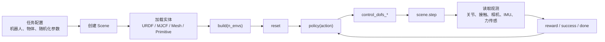

<!-- Generated by the offline translation workflow.
Source: 10-具身智能其他仿真工具及仿真前沿/Genesis仿真环境配置/03Genesis World 1.0完整体验与机器人仿真流水线.md
Source SHA-256: c7a4374c9c3bf3d3b8f3aca101ffeead4c15b886980eca656e439dd19316c38b
Model: tencent/Hy-MT2-1.8B-GGUF:Q4_K_M
Review machine-translated technical claims before relying on them.
-->
# Genesis World 1.0 Full Experience: From Simulation Base to Nyx High-Fidelity Rendering

After completing this chapter, you can finish three things:

1. Understand the position of Genesis World 1.0 in the embodied AI simulation stack: it is more like a base layer consisting of “physics + robot interface + rendering + compiler,” rather than a ready-made home robot task library.
2. Run the robot simulation, Nyx high-fidelity rendering, and Gaussian Splat examples of Genesis World locally and verify what each step validates.
3. Distinguish between “official promotional images,” “locally reproducible images,” and “asset import boundaries” to avoid mistaking high-fidelity rendering images for the fact that the open-source repository already provides a complete home scenario benchmark.

This chapter is suitable for those who have already read the first two tutorials on Genesis environment configuration to continue learning. If you have not installed Genesis yet, you can first read [01 environment configuration and testing ](01-environment-configuration-and-testing.md) and [02 visualization and rendering ](02-visualization-and-rendering.md).

---

## 1. What is Genesis World 1.0 exactly?

Genesis World 1.0 is a open-source robot simulation platform developed by Genesis AI. It is not a single renderer or physical engine, but rather a simulation infrastructure stack tailored for Physical AI / Embodied AI.

<div align="center">
  
  <br>
  <strong> Figure 1: Official cover image of Genesis World </strong>
  <br>
  <sub> This image demonstrates the high-fidelity robot simulation experience that Genesis World aims to achieve. It is the promotional image in the official README and is not equivalent to the output of a one-click reproduction script in the repository. Source: Genesis World’s official GitHub README. </sub>
</div>

From the perspective of robot learning, Genesis World mainly covers four layers:

<div align="center">
  
  <br>
  <strong> Figure 2 Genesis World official system stack</strong>
  <br>
  <sub> Everyone should focus on the four layers in the middle: Simulation Interface, Physics, Render, and Compiler. The upper layer can handle RL/VLA/data generation tasks, while the lower layer can run on different computing backends. Source: Genesis World official GitHub README.</sub>
</div>

| Level | Significance for Robot Learning |
|---|---|
| Simulation Interface | Create scenarios, load robots, read sensors, control joints, and build parallel environments using Python. |
| Physics | Supports rigid bodies, FEM, MPM, PBD/SPH, IPC, SAP, and multi-physics coupling, suitable for studying interactions such as contact, soft matter, particles, and fabrics. |
| Render | Supports common viewer and rendering methods like Pyrender/Luisa/Nyx. Nyx is used for higher fidelity visual observations. |
| Compiler | Quadrants compiles the Python kernel into CUDA/ROCm/Metal/Vulkan/x86/ARM, improving simulation throughput. |

The most important judgment here is: **The Genesis World open-source repository mainly provides a simulation foundation and example environments, but does not directly offer a large-scale home scenario robot benchmark.** If you want to perform home manipulation tasks, you will need to integrate RoboCasa, iGibson, Habitat, BEHAVIOR, Replica/HM3D, or build your own assets and collision layers.

---

## 2. Local experimental environment used in this chapter

In this chapter, the testing environment uses NVIDIA Blackwell GPU. When installing PyTorch on a Blackwell machine, pay special attention to the CUDA version. It is not recommended to copy the `cu126` examples from old tutorials.

The combinations that passed the actual test are:

| Component | Measured Result |
|---|---|
| GPU | NVIDIA RTX PRO 6000 Blackwell Workstation Edition |
| Compute Capability | 12.0 |
| PyTorch | `2.8.0+cu128` |
| CUDA Runtime | 12.8 |
| Genesis World | 1.0.0 |
| Quadrants | 0.8.0 |
| gs-nyx | 0.1.1 |
| gs-nyx-plugin | 0.1.2 |

Checkpoint 1: Confirm that PyTorch actually supports Blackwell.

```bash
python - <<'PY'
import torch
print("torch:", torch.__version__)
print("cuda runtime:", torch.version.cuda)
print("device:", torch.cuda.get_device_name(0))
print("capability:", torch.cuda.get_device_capability(0))
print("arch list:", torch.cuda.get_arch_list())
x = torch.arange(16, device="cuda", dtype=torch.float32)
print("cuda sum:", float((x * x).sum().item()))
PY
```

When successful, `sm_120` or `compute_120` should be visible, and no errors occur in CUDA tensor operations. This check is more reliable than just looking at `nvidia-smi`.

---

## 3. Clone and install Genesis World

It is recommended that you place the working directory on a disk with sufficient capacity. The following command uses `$WORKSPACE` to represent your own project root directory:

```bash
export WORKSPACE=/path/to/workspace
mkdir -p "$WORKSPACE"
cd "$WORKSPACE"

git clone https://github.com/Genesis-Embodied-AI/genesis-world.git
cd genesis-world
```

When installing, first install PyTorch that is suitable for your GPU. Taking Blackwell/CUDA 12.8 as an example, you can use the PyTorch official `cu128` wheel:

```bash
# 示例：请按自己的 Python 版本和 CUDA 版本选择官方 wheel
pip install torch --index-url https://download.pytorch.org/whl/cu128
```

Then install Genesis:

```bash
pip install -e ".[dev]"
```

Nyx high-fidelity rendering requires additional installation:

```bash
pip install gs-nyx gs-nyx-plugin
```

Checkpoint 2: Confirm that the core package can be imported.

```bash
python - <<'PY'
import genesis as gs
import quadrants
import gs_nyx
import gs_nyx_plugin

print("genesis:", getattr(gs, "__version__", "unknown"))
print("quadrants:", getattr(quadrants, "__version__", "unknown"))
print("gs_nyx:", getattr(gs_nyx, "__version__", "unknown"))
print("gs_nyx_plugin: ok")
PY
```

If `matplotlib` version parsing error is reported here, it usually means the local machine has a release candidate version. You can switch back to the stable version first:

```bash
pip install "matplotlib>=3.10,<3.11"
```

---

## 4. Minimum Robot Simulation: Franka + Plane

The minimum robotic arm simulation for Genesis is very short. In this example, the ground and Franka robotic arm are loaded, and then the simulation is advanced:

```python
import genesis as gs

gs.init(backend=gs.gpu)

scene = gs.Scene(show_viewer=True)
plane = scene.add_entity(gs.morphs.Plane())
franka = scene.add_entity(
    gs.morphs.MJCF(file="xml/franka_emika_panda/panda.xml"),
)

scene.build()

for _ in range(1000):
    scene.step()
```

This smoke test proves three things:

- Genesis can initialize the backend;
- MJCF robot resources can be parsed;
- The physical simulation cycle `scene.step()` can proceed normally.

It does not prove that the controller, training environment, or visual rendering are fully available. Next, everyone can continue to read `examples/rigid/control_franka.py`, `examples/manipulation/grasp_env.py`, and `examples/locomotion/go2_env.py`.

---

## 5. Typical Pipeline for Genesis Robot Simulation

When performing real robot tasks, the Genesis code is usually organized as the following data flow:



**Figure 3: The basic closed loop of the Genesis robot task.**
It can be understood as a robot version of a Gym/RL environment: `reset()` sets the initial state, `step(action)` drives the physics, and sensors provide observations. The task code calculates the reward and done status.

In the open-source repository, you can learn according to task types:

| Learning Objectives | Recommended Files |
|---|---|
| Franka Control | `examples/rigid/control_franka.py` |
| IK and Motion Planning Manipulation | `examples/tutorials/IK_motion_planning_grasp.py` |
| Manipulation Task Environment | `examples/manipulation/grasp_env.py` |
| quadruped robot locomotion | `examples/locomotion/go2_env.py` |
| Drone hovering training | `examples/drone/hover_env.py` |
| Performance Testing | `examples/speed_benchmark/franka.py`, `examples/speed_benchmark/anymal_c.py` |

---

## 6. Nyx: Replace the Genesis camera with a high-fidelity rendering sensor

Nyx is a GPU path tracer in the Genesis ecosystem. The official Nyx README shows a dual robotic arm desktop scenario:

<div align="center">
  
  <br>
  <strong> Figure 4: Official dual-arm desktop rendering of Nyx </strong>
  <br>
  <sub> This figure shows the target rendering quality of Nyx. Note that the current Nyx example repository does not provide the full script and scene assets for generating this landing figure. Source: Nyx for Genesis official README. </sub>
</div>

The usage of Nyx is not `scene.add_camera()`, but `scene.add_sensor(NyxCameraOptions(...))`:

```python
import genesis as gs
import gs_nyx.nyx_py_renderer as npr
import gs_nyx.nyx_py_sdk as nps
from gs_nyx_plugin.nyx_camera_options import NyxCameraOptions

gs.init(backend=gs.gpu)

scene = gs.Scene(show_viewer=False)
scene.add_entity(gs.morphs.Plane())
scene.add_entity(
    gs.morphs.Sphere(
        radius=0.4,
        pos=(0.0, 0.0, 0.4),
        fixed=True,
        collision=False,
    ),
    surface=gs.surfaces.Gold(),
)

env_map = nps.EnvironmentMapAsset()
env_map.texture = "examples/assets/kloppenheim_07_puresky_4k.hdr"
env_map.layout = nps.EEnvMapLayout.LongLat
env_map.multiplier = 2.0

cam = scene.add_sensor(
    NyxCameraOptions(
        res=(1280, 720),
        pos=(2.0, -3.0, 1.5),
        lookat=(0.0, 0.0, 0.3),
        fov=35.0,
        spp=64,
        denoise=True,
        render_mode=npr.ERenderMode.FastPathTracer,
        env_maps=(env_map,),
    )
)

scene.build(n_envs=1)
scene.step()
rgb = cam.read().rgb
```

Here, you need to pay attention to two key points:

- `spp` is the number of pixels sampled per unit; higher values result in lower noise, but at the cost of slower processing;
- `cam.read().rgb` returns an RGB tensor on the GPU, which can be directly used as the observation for the visual policy.

---

## 7. Local reproduction: Nyx minimal rendering, PBR sphere, and Gaussian splat

We have successfully implemented three checkpoints locally.

<div align="center">
  
  <br>
  <strong> Figure 5: Local Nyx primitive smoke test</strong>
  <br>
  <sub> This result indicates that Nyx path tracing can output RGB images correctly on the local GPU, but it is only a basic geometry test, and does not mean that the official dual-arm promotional image has been reproduced successfully.</sub>
</div>

<div align="center">
  
  <br>
  <strong> Figure 6: Nyx official 01_hello_nyx example local output </strong>
  <br>
  <sub> This example loads PBR_Ball.glb and HDRI environment textures, verifying glTF materials, ambient light, and the Nyx camera sensor chain. Script source: genesis-nyx/examples/01_hello_nyx.py. </sub>
</div>

<div align="center">
  
  <br>
  <strong> Figure 7: Example of Nyx Gaussian Splat local output </strong>
  <br>
  <sub> This example renders the real-captured Gaussian Splat and Genesis planar geometry in the same frame, making it suitable for learning how to combine "real scene appearance + simulation geometry". Script source: genesis-nyx/examples/05_gaussian_splat.py. </sub>
</div>

If you download the Nyx example repository from the GitHub zip file, you may encounter LFS pointer files. The symptoms are that `.glb` or `.ply` files are very small, and they start with:

```text
version https://git-lfs.github.com/spec/v1
```

At this point, `git lfs pull` is needed, or the real file can be downloaded from `media.githubusercontent.com`. We have completed it locally:

- `PBR_Ball.glb`
- `plant.ply`

---

## 8. The Pit of High-Fidelity Interior Assets: Sponza is Not for Home Scenarios

To test the support of Genesis/Nyx for high-fidelity indoor glTF, we additionally downloaded Sponza from Khronos glTF Sample Assets.

<div align="center">
  
  <br>
  <strong> Figure 8: Sponza official reference effect </strong>
  <br>
  <sub> Sponza is a classic architectural atrium/arcade lighting test scenario, not a home scenario. The lighting in the image is used for reference only and may not be part of the glTF model itself. Source: Khronos glTF Sample Assets / Sponza. </sub>
</div>

This experiment is highly educational, as it highlights a common misconception: **Being able to be displayed properly by a glTF viewer does not mean it can be directly used as a high-quality task scene by a robot simulator.**

The methods we use to import Sponza into Genesis are:

```python
scene.add_entity(
    gs.morphs.Mesh(
        file="Models/Sponza/glTF/Sponza.gltf",
        collision=False,
        fixed=True,
    )
)
```

`trimesh` can be loaded, and Genesis also works successfully `build`. However, the current link between the Genesis viewer and Nyx does not provide ideal support for its alpha mask, transparent materials, coordinate system, and lighting.

<div align="center">
  
  <br>
  <strong> Figure 9: Sponza's boundary effect in the current Nyx link </strong>
  <br>
  <sub> This figure is not the final result, but a debugging checkpoint: The alpha mask of vegetation/cloth in complex glTF files often becomes large blocks that obscure the view. When creating robot scenes, it is necessary to handle the visual mesh, collision proxy, and task objects separately. </sub>
</div>

For robot simulation, the correct approach is:

- Visual layer: high-fidelity mesh, PBR textures, HDRI, lighting;
- Collision layer: simplified box, capsule, cylinder, or low-poly collision mesh;
- Task layer: interactive objects, robots, target pose, success judgment;
- Semantic layer: object categories, graspable areas, navigation areas, constraint relationships.

Do not directly place a glTF file from a high-poly room into the simulator `collision=True`. Complex scenes will trigger expensive convex decomposition, which is slow and may not produce a collision mesh suitable for robot motion planning.

---

## 9. Does Genesis already have a large-scale household robot benchmark?

As of the time of this chapter's compilation, there is no complete large-scale household robot benchmark in the open-source Genesis World repository similar to Habitat Challenge, RoboCasa, and LIBERO.

There are three types of content in the public repository:

| Type | Is it a formal benchmark? | Description |
|---|---|---|
| speed benchmark | Partially | `examples/speed_benchmark/franka.py`, `anymal_c.py` mainly test simulation throughput. |
| mini training env | Suitable for learning, not a leaderboard | `go2_env.py`, `hover_env.py`, `grasp_env.py` encapsulate learning environments and training processes. |
| Official promotion/internal evaluation | Limited public information | The Genesis AI blog mentions household/lab/industrial workflows, but the open-source repository has not fully released these task sets. |

If the goal is a household manipulation benchmark, it is recommended to use Genesis as the physics and rendering base, combined with other task libraries:

| Task Domain | Reference Platforms |
|---|---|
| Kitchen and tabletop manipulation | RoboCasa, robosuite, ManiSkill |
| Home navigation and scene understanding | Habitat, Replica, HM3D, iGibson |
| Long-distance household tasks | BEHAVIOR / OmniGibson |
| Benchmark evaluation | LIBERO, RoboTwin, EBench, etc. |

The value of Genesis lies in the fact that it serves as a new underlying option when users require higher physical throughput, multiple physical couplings, GPU simulation, or the integration of Nyx/Gaussian Splat into training observations.

---

## 10. Recommended Learning Path

If you want to master Genesis World systematically, it is recommended to follow the following order:

1. Run the minimum Franka + Plane system, and verify `scene.add_entity`, `scene.build`, and `scene.step`.
2. Run `examples/rigid/control_franka.py` to learn joint control, control gains, and gripper force.
3. Run `examples/tutorials/IK_motion_planning_grasp.py` to learn IK, path planning, and grasping processes.
4. Read `examples/manipulation/grasp_env.py` to understand how a RL environment defines reset, step, reward, and observation.
5. Run Nyx `01_hello_nyx.py` and `05_gaussian_splat.py` to understand the integration of high-fidelity visual observations.
6. Try to import a simple GLB object, and use `collision=False` to first validate the vision, then perform a separate collision proxy.
7. If working on home tasks, do not start with pure rendering benchmark scenarios like Sponza; instead, choose dataset with robot semantics, collisions, or task definitions.

---

## 11. Common Questions

**Question 1: Why are the official images so attractive, but the local examples do not achieve the same effect?**
The official cover and Nyx landing images demonstrate the upper limit of rendering capabilities. However, the current public repository does not provide the scene scripts, robot models, lighting setups, and camera configurations corresponding to these images. The local reproduction images in this chapter verify that the Nyx workflow works, not a pixel-level reproduction of the official promotional images.

**Question 2: Why does Sponza look poor in Genesis?**
Sponza is a glTF lighting test scene that uses a large amount of transparent/alpha mask textures. The Genesis viewer and the current Nyx plugin have limited support for such materials. It is suitable for asset import stress testing, but not for robot home scenes.

**Question 3: Should collision be enabled for indoor scenes?**
It is not recommended to enable collision directly for high-poly indoor scenes. A more reliable approach is to use high-poly models as the visual layer and simplified geometry as the collision layer. For example, use large boxes for the floor, thin boxes for the walls, boxes for the tabletop, and cylinders for the columns.

**Question 4: Does Nyx support depth maps and segmentation maps?**
The current Nyx documentation indicates that RGB support is good, but the output channels for depth, segmentation, normal, and optical flow are not complete yet. When depth or segmentation is required, you can use the Genesis ordinary camera/rasterizer path, or wait until Nyx improves its capabilities.

---

## 12. Reference Materials

- Genesis World official repository: <https://github.com/Genesis-Embodied-AI/genesis-world>
- Genesis World official documentation: <https://genesis-world.readthedocs.io/>
- Genesis World 1.0 technical blog: <https://www.genesis.ai/blog/the-role-of-simulation-in-scalable-robotics-genesis-world-10-and-the-path-forward>
- Nyx for Genesis official repository: <https://github.com/Genesis-Embodied-AI/genesis-nyx>
- Nyx for Genesis official documentation: <https://genesis-embodied-ai.github.io/genesis-nyx/latest/>
- Khronos glTF Sample Assets / Sponza: <https://github.com/KhronosGroup/glTF-Sample-Assets/tree/main/Models/Sponza>
