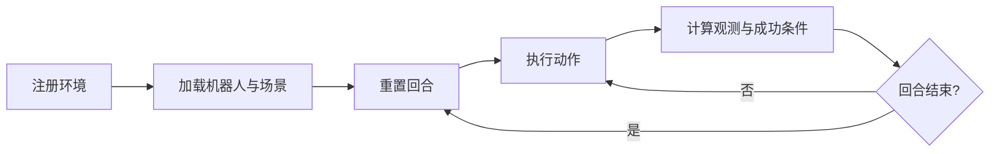

<!-- Generated by the offline translation workflow.
Source: 10-具身智能其他仿真工具及仿真前沿/Maniskill详细文档/01任务构建.md
Source SHA-256: 422b7a45f077d634385f30aea92fdaa2157b7256a6acfe1efa6d61a29b512224
Model: tencent/Hy-MT2-1.8B-GGUF:Q4_K_M
Review machine-translated technical claims before relying on them.
-->
# ManiSkill Custom Task Construction

This section breaks down the robot manipulation objective into several essential steps within the ManiSkill environment class: registering the environment, loading the scene, initializing the turn, calculating the success conditions, and implementing dense rewards and additional observations as needed. Only after mastering these interfaces is it appropriate to proceed with demonstration collection or reinforcement learning.

## Task Lifecycle



When it comes to environment-related items, the most core approach is as follows.

| Interface | Purpose |
| --- | --- |
| `@register_env` | Register environment name and default maximum steps |
| `_load_scene` | Create objects and sensors other than the ground and robot |
| `_initialize_episode` | Reset pose and sample random values for each parallel environment |
| `evaluate` | Return success conditions and task diagnostic metrics |
| `_get_obs_extra` | Add task-related information to state observations |
| `compute_dense_reward` | Provide continuous rewards for reinforcement learning (optional) |

## Minimum Task Skeleton

The following skeleton shows the structure of the custom task. It does not include the construction details of specific objects, which need to be completed using the actor builder and robot interface provided by the current ManiSkill version.

```python
import torch

from mani_skill.envs.sapien_env import BaseEnv
from mani_skill.utils.registration import register_env


@register_env("MyPickTask-v1", max_episode_steps=200)
class MyPickTaskEnv(BaseEnv):
    SUPPORTED_ROBOTS = ["panda"]

    def _load_scene(self, options: dict):
        # Build the table, target object, and goal marker here.
        raise NotImplementedError

    def _initialize_episode(self, env_idx: torch.Tensor, options: dict):
        # Reset only the parallel environments selected by env_idx.
        raise NotImplementedError

    def evaluate(self):
        # Each item is a tensor with one value per parallel environment.
        reached = self._reached_target()
        grasped = self.agent.is_grasping(self.target)
        lifted = self.target.pose.p[:, 2] > self.lift_height
        return {
            "reached": reached,
            "grasped": grasped,
            "lifted": lifted,
            "success": grasped & lifted,
        }
```

`evaluate` does not only return `success`. By separating arrival, grasping, and lifting, it is possible to determine at which stage the policy stops during evaluation, and dense rewards can also directly reuse these intermediate values.

## Scene and Round Initialization

`_load_scene` is responsible for creating objects only when the environment is established; `_initialize_episode` updates the state of existing objects every time `reset` is executed. Do not rebuild the geometry in each round, as this will damage the performance and object indexing of the parallel environment.

Two constraints should also be met during initialization:

1. All random variables use the random number generator provided by the environment, enabling the same round to be reproduced with a fixed seed.
2. `env_idx` is used to reset only the specified sub-environment, without altering the state of other parallel rounds.

## Success Conditions and Rewards

Success conditions should correspond to observable physical states, rather than simply checking whether an action is executed. For example, "pick up an object" requires at least the following verification:

- The gripper forms an effective grip on the object;
- The object's height exceeds the threshold;
- The object remains elevated for several frames.

Dense rewards can be combined in stages: "approach—contact—grasp—lift—maintain". The reward dimensions should be checked separately before parallel training to prevent the value of a certain distance term from exceeding the final success reward.

## Registration and Verification

After importing the environment module, first use an environment check to reset, perform random actions, and evaluate outputs:

```python
import gymnasium as gym
import my_pick_task  # Registers MyPickTask-v1.

env = gym.make("MyPickTask-v1", num_envs=1, obs_mode="state")
obs, info = env.reset(seed=0)
for _ in range(20):
    obs, reward, terminated, truncated, info = env.step(env.action_space.sample())
env.close()
```

**Checkpoint 1:** After the same sub-reset, the initial state of the target object and the robot should be identical.

**Checkpoint 2:** `info` should contain `reached`, `grasped`, `lifted`, and `success`, and the first dimension of the tensor should be equal to the number of parallel environments.

**Checkpoint 3:** In link checks using a random policy, focus on runtime exceptions, observation shapes, and whether success conditions are calculable. Do not treat the performance of the random policy as part of the task policy score.

## Common Questions

- **Environment name not registered:** Verify that the environment-related modules have been imported before `gym.make`.
- **Parallel environments reset interfering with each other:** Check whether `_initialize_episode` correctly uses `env_idx`.
- **Image appears normal but fails to succeed:** Output proximity, clamping, and lifting conditions respectively, and examine the thresholds, coordinate systems, and contact detection.
- **Lack of task objectives in state observation:** Provide target pose and relative object position information through `_get_obs_extra`.

## References

- [ManiSkill official custom task tutorial ](https://maniskill.readthedocs.io/en/latest/user_guide/tutorials/custom_tasks/intro.html)
- [ManiSkill official quick start ](https://maniskill.readthedocs.io/en/latest/user_guide/getting_started/quickstart.html)
