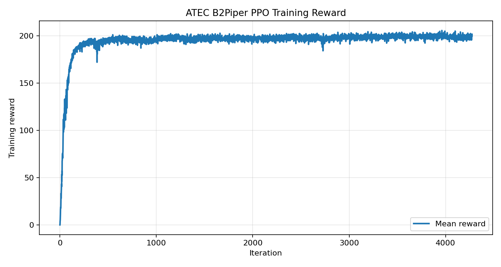
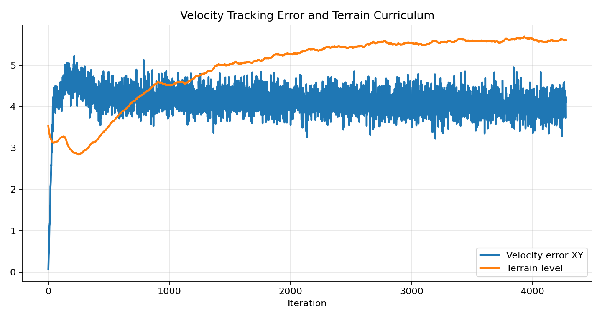
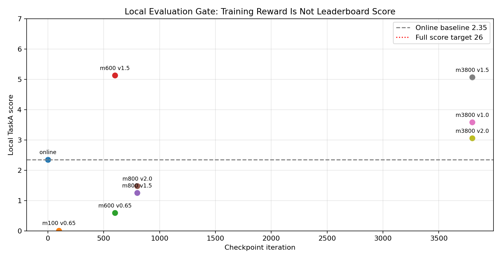

<!-- Generated by the offline translation workflow.
Source: 15-Challenge竞赛/ATEC2026/L0-机器人徒步/README.md
Source SHA-256: 74de1ba245fc1c129a203a36f5e594e56476d87bd8f08cb121a2986432f74efc
Model: tencent/Hy-MT2-1.8B-GGUF:Q4_K_M
Review machine-translated technical claims before relying on them.
-->
# ATEC2026 Online Competition·Track 1 L0 Robot Hiking Reproduction and Ranking Boosting Guide

This article is aimed at those who wish to reproduce the ATEC2026 online competition, Track 1 "Robot Locomotion". We will cover registration, downloading the official code, setting up the Isaac Sim / Isaac Lab environment, running the official baseline, and completing the online submission, and then provide a complete review of a real local ranking experiment: why the official baseline can be submitted and yield valid scores, why the checkpoint can increase the score from 2.35 to around 5 points, and why local evaluation during the process is more important than blindly training intensively.

This tutorial is not a “champion’s secret guide”. It is more like a reproduction experiment note: everyone can first run through the competition workflow smoothly, and then improve their policy based on the阶段性 score improvement experiences.

## 1. What is being tested in this competition

The theme of ATEC2026 is **AI and Robotics Real-World Extreme Challenge**. The aim is to jointly verify the long-term stability, real environment adaptability, and reproducibility of embodied AI systems through online simulation and offline real scenarios.

The Track 1 online competition is divided into L0 and L1:

| Level | Task | Core Objective |
|---|---|---|
| L0 | Robot Walking | The arm-leg robot should walk steadily along a route of about 400 m, covering flat ground, rough terrain, uphill/downhill paths, and stairs |
| L1 Task 1 | Garbage Collection & Placement | Complete target recognition, navigation, grasping, transportation, and placement in a 20 m x 20 m area |
| L1 Task 2 | Overcoming Obstacles | Cross ditches or high platforms; points can be earned by using objects like boxes to modify the environment |

This article focuses solely on L0. The reason is simple: L0 is the most suitable entry point for beginners. It does not require solving visual recognition and grasping first; as long as everyone can successfully implement locomotion control, evaluation, and submission processes, the critical half of the embodied AI competition project closed loop has been achieved.

Official competition page:

- ATEC official website: [https://www.atecup.com/competitions/100017](https://www.atecup.com/competitions/100017)
- Example track details page: [https://www.atecup.com/matchHomeDetails/100017/1000210](https://www.atecup.com/matchHomeDetails/100017/1000210)
- Official baseline repository: [https://github.com/atecup/ATEC2026_Simulation_Challenge](https://github.com/atecup/ATEC2026_Simulation_Challenge)

According to public information, the registration for ATEC2026 opened on April 1, 2026, and closed at 22:00 (UTC+8) on June 15, 2026 (there may be changes later, so please keep an eye on it); the online competition period is from 10:00 on May 1, 2026, to 22:00 (UTC+8) on June 30, 2026. If you have already passed the registration deadline when reading this article, you can still use it as a reproduction experiment for the Isaac Lab robot competition.

## 2. How to register and enter the submission page

Registration and submission are completed on the ATEC official website. The actual page may vary slightly due to official updates, but the overall process is roughly as follows:

1. Open the ATEC official website and register/log in with your account.
2. Enter the ATEC2026 competition page.
3. Click "Register" or "Join the Competition" and fill in the team information as required on the page.
4. Navigate to "Personal Profile / My Competitions / Track Details".
5. In the track details page, switch to "Resource Entry" to download demos,选手 guides, and update announcements.
6. Select a task in the "Submission Entry", such as "Robot Hiking" for L0.
7. Choose the robot configuration and upload the source code zip file or push the image.
8. Wait for the platform to build, run, and score the task, then check the results in "Historical Submissions".

In the L0 submission entry, you need to select a robotic arm model. In this experiment, we use `B2Piper`, which is the Unitree B2 quadruped chassis with a Piper robotic arm. Generally, when uploading the platform source code, it is required that the root directory contains:

```text
solution.py
policy.pt
requirements.txt
```

Among them, `solution.py` is the entry point for the competition system call; `policy.pt` can be the policy exported by TorchScript; and `requirements.txt` can be empty. The official environment already includes basic dependencies such as PyTorch. An empty requirements list does not mean “no dependencies,” but rather indicates that we do not need to install any additional pip packages.

## 3. Computing power selection: local machine or rent L40

The L0 baseline of ATEC depends on Isaac Sim 5.1 and Isaac Lab 2.3.x. It is difficult for ordinary laptops to run training smoothly. There are two options:

| Solution | Suitable Scenarios | Notes |
|---|---|---|
| Local workstation | Existing high-memory NVIDIA GPU, and capable of installing Isaac Sim / Isaac Lab | High costs associated with environment setup and driver matching |
| Rented GPU cloud instance | Want to quickly reproduce, train, and view desktop simulation visuals | It is recommended to choose an image that has been adapted for Isaac Sim |

If using cloud computing platforms such as Compute Freedom, it is recommended to choose images that include remote desktop, NVIDIA drivers, and Isaac Sim/Isaac Lab environments. L40 is a suitable starting card: its memory is sufficient for medium-scale parallel environments, and its price is more suitable for teaching experiments than A100/H100.

In the LeHome tutorial, we also used a similar approach: first explaining that "the single-card L40 can start smoothly," and then providing the batch size, logs, and GPU curves, instead of guaranteeing that it will definitely rank high. The same applies here for ATEC: L40 can help everyone quickly run the code and train, but whether high scores can be achieved depends on the reward, observations, curriculum, and submitted policy.

Recommended to check the GPU:

```bash
nvidia-smi
```

If you see NVIDIA GPUs such as L40, RTX 4090, A6000, and RTX PRO 6000, and have sufficient memory, you can continue. In our local experiments, we use NVIDIA workstations with ample memory. If using L40, it is recommended to start with a smaller number of parallel processes, such as `--num_envs 1024` or `2048`, and only proceed to `4096` after confirming that there is no out-of-memory error.

## 4. Download the official code and robot model

The official repository can be cloned directly:

```bash
export PROJECT_ROOT=$HOME/ATEC2026_Simulation_Challenge

git clone https://github.com/atecup/ATEC2026_Simulation_Challenge "$PROJECT_ROOT"
cd "$PROJECT_ROOT"
```

If the code is obtained from GitHub, it is necessary to download the robot model additionally:

```bash
curl https://static.atecup.com/atec2026/atec_robot_model.zip -o atec_robot_model.zip
unzip atec_robot_model.zip -d atec_robot_model
```

If you download `ATEC2026_Simulation_Challenge.zip` from the official "Resource Entry" page, it usually includes `atec_robot_model`, so there is no need to download it again.

It is recommended to record the official resource version:

```bash
sha256sum atec_robot_model.zip
git rev-parse HEAD
```

In the later stages of the competition, the official team may release update announcements, such as updates to the initial joint positions of robots, Action Configuration changes, log descriptions, and updates to the LiDAR scanning range. Before submitting each submission, make sure that the local code matches the official resource links; otherwise, the online score and local score may not be consistent.

## 5. Install Isaac Lab extension

Install the official extension in the Python environment where Isaac Sim / Isaac Lab has been set up:

```bash
cd "$PROJECT_ROOT/source/atec_rl_lab"
pip install -e .
```

Return to the project root directory:

```bash
cd "$PROJECT_ROOT"
```

Check the environment:

```bash
python - <<'PY'
import torch
print("torch:", torch.__version__)
print("cuda:", torch.cuda.is_available())
PY
```

If using Isaac Sim-related scripts, it is recommended to include the EULA environment variable:

```bash
export ACCEPT_EULA=Y
export OMNI_KIT_ACCEPT_EULA=YES
```

## 6. Validate the official L0 baseline

The official blog and baseline usually recommend running a rough locomotion training first:

```bash
python scripts/rsl_rl/train.py \
  --task ATEC-Isaac-Velocity-Rough-Unitree-B2-v0 \
  --headless
```

After the training is completed, the exported policy is usually:

```text
logs/rsl_rl/unitree_b2_rough/<日期>/exported/policy.pt
```

Local playback:

```bash
python scripts/rsl_rl/play.py \
  --task ATEC-Isaac-Velocity-Rough-Unitree-B2-v0
```

When submitting, place the exported `policy.pt` in `demo` or the root directory of the submission package, and ensure that `solution.py` can load it.

## 7. Our first online submission: It can yield scores, but very low

We will first submit using the official `unitree_b2_flat/policy.pt`. This weight is exactly the same as `policy.pt` in the demo. It is a Unitree B2 flat locomotion actor with a `45`-dimensional observation input and a `12`-dimensional action output.

Valid online submissions this time:

| Item | Value |
|---|---|
| Robot | `B2Piper`
| Score | `2.35`
| Simulation Time | `00:03:18.40`
| Physical Time | `00:07:25.55`
| Online Ranking Position | Mid-to-late |

This indicates that the baseline can upload source code, build, run, and score, but it is still far from achieving a full score `26`. The reason is also straightforward: the flat policy was trained on relatively simple terrain, and when applied to the complex 400 m terrain, it gets stuck after the first segment.

The best flat-policy tuning in our local environment is roughly:

```bash
ATEC_VEL_X=0.65
ATEC_VEL_Y=-0.40
ATEC_VEL_YAW=0.0
```

The best local result is approximately `2.31` points, which is close to the online value `2.35`. This indicates that the local evaluation has some reference value.

## 8. Why choose B2Piper instead of starting with the full wheel from the beginning

The L0 submission page supports multiple formats, such as `G1`, `Tron1Piper`, `Tron2ALegged`, `Tron2AWheel`, `B2Piper`, and `B2wPiper`.

Our judgment is:

| Configuration | Advantages | Risks |
|---|---|---|
| `B2Piper` | Fully aligned with the 12-dimensional leg movements of the official B2 flat actor, making it easiest to migrate | Lower maximum speed compared to wheeled legs |
| `B2wPiper` | Higher theoretical speed, suitable for pushing limits in time | Requires combined training of leg and wheel movements; no pre-trained models available |
| `Tron2AWheel` | Wheeled leg structure is suitable for high speeds | Needs to establish training configurations from scratch |
| `G1` | Flexible humanoid platform | High cost of L0 long-distance stable walking training |

So in the first round of ranking attempts, instead of directly switching to the most aggressive configuration, we should first use `B2Piper` to establish a reproducible training and evaluation closed loop. Once B2Piper can consistently achieve high scores, then consider `B2wPiper` or `Tron2AWheel` for time-based optimization.

## 9. A Real High-Speed Training Experiment

We tried a route that seemed reasonable, but later proved to be problematic:

1. Initialize the B2Piper actor using the official `unitree_b2_flat/policy.pt`.
2. Add a new high-speed rough locomotion task.
3. Expand the speed command range to `0.5 ~ 4.5 m/s`.
4. Perform long training with PPO using 4096 parallel environments.
5. Export the policy every few checkpoints and evaluate it locally in TaskA.

Training command is equivalent to:

```bash
cd "$PROJECT_ROOT"

export ACCEPT_EULA=Y
export OMNI_KIT_ACCEPT_EULA=YES
export ATEC_INIT_ACTOR_POLICY=atec_robot_model/baseline/unitree_b2_flat/policy.pt

python scripts/rsl_rl/train.py \
  --task ATEC-Isaac-Velocity-FastRough-Unitree-B2Piper-v0 \
  --headless \
  --num_envs 4096 \
  --max_iterations 5000 \
  --run_name fast_actorinit_4096x5000
```

The key here is not `4096`, but `ATEC_INIT_ACTOR_POLICY`. We added an actor initialization entry to the training script, so that the B2Piper rough policy does not start completely randomly, but is fine-tuned starting from the official B2 flat actor.

### 9.1 Training Curve

The training reward seems to be increasing continuously:



From this graph, it is easy to have the illusion that as the training reward increases, the ranking score will also increase. However, the subsequent local evaluations prove that this judgment is not reliable.

Speed error and terrain settings are as follows:



The most notable thing here is that `Velocity error XY` remains high over time. In other words, although the policy achieves higher rewards in the training environment, it fails to steadily follow the high-speed commands we provide.

### 9.2 Local checkpoint evaluation

We exported several checkpoints to TaskA for local evaluation, and the results are as follows:



Key results:

| checkpoint | Speed command | Local TaskA score | Phenomenon |
|---|---:|---:|---|
| Official flat / Online | Approximately `0.65` | `2.35` | Can achieve a score, but stuck at the early stage |
| `model_100` | `0.65` | `0.0086` | Almost stuck in place |
| `model_600` | `1.5` | `5.1265` | Clearly exceeds the baseline and reaches `x≈-52` |
| `model_800` | `1.5` | `1.2543` | Degradation, quickly failing |
| `model_3800` | `1.5` | `5.0660` | Close to model_600, but still far below the full score |

This indicates that the reward continues to increase in the later stage of training, but it does not mean that the TaskA score also increases. `model_600` is actually the best intermediate point at present.

## 10. What does this periodic score improvement indicate?

This experiment is not "invalid training": it increased the local TaskA score from `2.35` near the baseline to around `5.12`, which has already surpassed some teams on the ranking list. The real issue is that the increase in training reward has not been translated into a stable ability to complete the full route, so it is not yet a final solution that can achieve a perfect score.

### 10.1 reward taught "living", but did not teach "completing the route"

During training, the episode length approaches the full duration, and the reward also increases, indicating that the policy has learned to maintain its posture in the training terrain. However, TaskA requires continuous progress along a specified route, passing through multiple real evaluation terrain segments.

In other words, the training environment rewards and the competition progress rewards are not aligned.

### 10.2 The speed command is too aggressive, breaking the official prior

We directly extend the command range to `0.5 ~ 4.5 m/s`. This is too broad for the official flat actor, and PPO easily damages the prior that could have been handled originally. `model_600` improves briefly, while `model_800` deteriorates again—this is a typical sign.

A more reliable approach would be to increase the speed in a course-based manner, for example:

```text
0.5 ~ 1.0 m/s
1.0 ~ 1.5 m/s
1.5 ~ 2.0 m/s
```

Each level must pass the local evaluation threshold of TaskA before moving to the next level.

### 10.3 actor has no terrain height input

The current 45-dimensional actor observations mainly include:

- base angular velocity
- projected gravity
- velocity command
- joint position
- joint velocity
- previous action

The critic has a height scan, but the actor does not. TaskA includes slopes, steps, and rough surfaces, while the actor can only rely on proprioception to navigate blindly if it cannot see the terrain at all. It may be able to maintain its gait in simple terrains, but it tends to get stuck or drift laterally when facing complex combined terrains.

### 10.4 Horizontal drift is not sufficiently punished

`model_3800` runs under `vx=1.5`:

```text
x ≈ -53.68
y ≈ 10.06
termination = illegal_contact
```

This indicates that the policy does not follow the route directly, but deviates significantly. Although speed tracking is included in the training, there are insufficient route constraints and lateral deviation penalties.

## 11. The correct mid-process evaluation method

During competition training, don't run blindly to the end. We recommend adding a checkpoint gate to the training script:

1. Wait for checkpoints such as `model_100.pt`, `model_300.pt`, and `model_600.pt`.
2. Export TorchScript `policy.pt` using `scripts/rsl_rl/play.py`.
3. Temporarily replace `policy.pt` in the submission directory.
4. Run `ATEC-TaskA-B2Piper` for local evaluation.
5. Record the score, duration, termination reason, and maximum x position.
6. Restore the original submitable baseline policy.

Two pitfalls to be aware of during evaluation:

- The TaskA environment has a camera, so `--enable_cameras` is required.
- Do not evaluate multiple checkpoints concurrently, otherwise multiple processes will replace `demo/policy.pt` at the same time, leading to contamination of the results.

Example process:

```bash
export ATEC_MAX_STEPS=5000

scripts/eval_l0_checkpoint.sh \
  logs/rsl_rl/unitree_b2_piper_rough/<run>/model_600.pt \
  quick_model_600 \
  "0.65 1.5"
```

It is recommended to write the results in a table:

```text
checkpoint, vx, score, elapsed_time, max_robot_x, termination
model_600, 1.5, 5.1265, 59.98s, -52.47, unfinished
```

## 12. How should the next version be modified?

The next version should not continue to blindly extend the training, but instead change the training objectives.

The recommended priorities are as follows:

1. **Low-speed to high-speed course**
   Do not start with `4.5 m/s` immediately. First, ensure the policy stabilizes above the baseline, and then gradually increase the speed.

2. **Add route progress rewards**
    Include `x` progress that is closer to TaskA, rewards for passing key terrain sections, and rewards for reaching the threshold in the training rewards.

3. **Suppress lateral drift**
   Increase the penalty for `|y|`, or explicitly require proximity to the central path in commands and rewards.

4. **actor with terrain observation**
    Add the height scan or low-dimensional terrain encoding to the actor, rather than only providing it to the critic.

5. **Select the model based on checkpoint**
   In the current experiment, `model_600` is better than `model_3800`. In competitions, checkpoints should be selected according to local tasks, rather than choosing the last one based on the number of training iterations.

6. **Consider the second leg branch again**
   Once B2Piper can achieve stable high scores, then start the `B2wPiper` or `Tron2AWheel` branch exploration phase.

## 13. Checklist before submission

Before submitting the source code package, it is recommended to check:

```text
solution.py        必须存在
policy.pt          必须能 torch.jit.load
requirements.txt   可以为空
server.py          不要上传，使用官方版本
run.sh             不要上传，使用官方版本
```

Perform a import test locally:

```bash
python - <<'PY'
import torch
m = torch.jit.load("policy.pt", map_location="cpu")
print(m(torch.zeros(1, 45)).shape)
PY
```

If the output is:

```text
torch.Size([1, 12])
```

Note: The policy dimensions for B2Piper's leg are at least correct.

Options selected during online submission:

```text
任务：机器人徒步
机器人：B2Piper
上传方式：源码上传
```

If an unknown error occurs, first check:

- Whether the root directory of the compressed package directly contains `solution.py`
- Whether nested folders were uploaded by mistake
- Whether `policy.pt` is too large or cannot be loaded
- Whether `requirements.txt` has complex dependencies not available in the official image
- Whether `solution.py` relies on local absolute paths

## 14. Summary of this Chapter

The most valuable conclusion of this experiment is not that "we have achieved high scores," but rather:

- The official flat policy can help ensure the submission workflow works properly, but it cannot directly lead to ranking on the leaderboard.
- The RobotLab / rough locomotion configuration is suitable as a training reference, but the rewards must align with the competition tasks.
- An increase in training rewards does not mean an increase in ranking scores.
- Mid-course local evaluation is a core engineering process in reinforcement learning competitions.
- The current best intermediate policy is `model_600 + vx=1.5`, achieving approximately `5.13` points locally, but it is still not worth submitting as the final submission for ranking.

If everyone continues with this line of work, the next step should be to improve reward and observation, rather than further increasing training duration.

## 15. Post-race open-source update: The complete path we took

After the competition deadline, we have organized the reproduction, score improvement, misjudgments, and corrections process of this ATEC2026 online competition into this directory. It is not a "top-ranked code," but a real engineering record: from obtaining scores based on the official baseline, to trying RobotLab / RoboGauge / SAC / MoE, and then back to an interpretable high-level tracker and option gate.

### 15.1 Several facts we have finally confirmed

First, the official baseline is very important. It is not a high-score solution, but it can verify the submission chain, action dimensions, and platform environment. Our first effective online score is:

| Task | Robot | Score | Simulation Time | Physical Time |
|---|---|---:|---:|---:|
| Track 1 L0 Robot Walk | `B2Piper` | `2.35` | `00:03:18.40` | `00:07:25.55` |

Second, the intermediate checkpoint should not rely solely on training rewards. We have previously pushed local scores to `5.x`, and effective scores around `7.x` have also appeared online. However, the policy still fails near rough sections, peaks, or boundaries. This indicates that it is better than many baseline teams, but it has not yet learned the full ability to pass over 400 m distances.

Third, RobotLab / RoboGauge is very valuable, but it cannot be directly used as the ready-made weights of ATEC B2Piper. We have tested:

- Native evaluation of RobotLab B2 fixed-forward;
- Training with Piper load for RobotLab B2Piper;
- Long training with PPO 20K;
- SAC-RSL-RL branch;
- Native evaluation of RoboGauge Go2 MoE checkpoint;
- Quick evaluation of ATEC direct migration.

The final conclusion is: These projects are suitable as references for reward, terrain curriculum, MoE, teacher-student, and evaluation protocols. However, if they are not aligned with ATEC's `B2Piper` assets, actuators, action scale, 45D actor observation, TaskA track distribution, and submission constraints, directly migrating the checkpoint often results in low scores or no improvement at all.

Fourth, distinguish between L0 and L1. L0 is the basic task of the track itself:

| Track | L0 |
|---|---|
| Track 1 | Robot Hiking |
| Track 2 | Desk Organization |

L1 is a high-level task shared by two tracks:

```text
L1 终榜 = 垃圾拾取与投放 + 越障
```

The qualification for the offline preliminary competition is determined by `L1终榜前100名`, not the L0 ranking. In the L0 "Desktop Organization" list of Track 2, we saw `DatawhaleEAI` at position `28/70`, with a score of `15`. This indicates that L0 desktop organization has achieved good results, but it does not equate to being selected offline. The offline qualification still depends on the L1 combined final list.

### 15.2 Open Source Information Found Across Our Network

As of July 18, 2026, after searching using keywords such as `ATEC2026 机器人徒步 26 分 开源`, `ATEC2026 B2Piper policy.pt`, and `ATEC2026 Simulation Challenge locomotion open source`, we did not find any clearly published information regarding "ATEC2026 L0 robot walking 26 minutes / champion complete submission code and weights".

The main ones that can be found are:

- ATEC official baseline repository;
- Reproduction tutorials on算力自由 / Zhihu, etc.;
- ATEC press releases and competition introductions;
- General robot locomotion projects such as RobotLab, RoboGauge, MoE-Loco, and Unitree RL Lab.

Therefore, when reproducing publicly, don’t mistakenly assume that “there is already a complete subpackage that can be directly copied”. A more practical approach is to build on the structural experience of these projects and continue working:

```text
官方 baseline 保护步态
+ TaskA 本地评估
+ rough/slope/stairs 分地形诊断
+ high-level command tracker
+ MoE / option gate
+ repeat gate 选择提交包
```

### 15.3 The final open-source code skeleton we developed

This directory provides a readable and editable L0 B2Piper submission skeleton:

```text
code/l0_b2piper_option_moe/
  README.md
  solution.py
  solution_rl.py
  requirements.txt
```

This code comes from the `protected04 option-MoE rough escape progress gate` version we compiled after the competition. It does not come with the binary `policy.pt`, and readers need to insert it into the official baseline or their own TorchScript actor.

For easy reproduction, we have also uploaded the corresponding lightweight model package to Hugging Face:

- Hugging Face model repository: [https://huggingface.co/Datawhale/atec2026-b2piper-l0](https://huggingface.co/Datawhale/atec2026-b2piper-l0)

The model repository contains `policy.pt`, `solution.py`, `solution_rl.py`, and `requirements.txt`. The SHA256 of `policy.pt` is:

```text
c932411fb326d732ba4f42eb74e56406b65b8bcacfbbc0a9ccaa823cfb287c84
```

The model repository also retains additional notes on post-game cleanup, compressed project memories, and archives of remaining workspaces before liquidation:

```text
archive_notes/local_cleanup_manifest.md
archive_notes/WORKSPACE_MEMORY.md
local_archive/ATEC2026_Simulation_Challenge.tar.zst
local_archive/official_materials.tar.zst
local_archive/tools.tar.zst
local_archive/WORKSPACE_MEMORY.md
local_archive/SHA256SUMS.txt
```

Among them, `local_archive/` is the archive additionally uploaded to release local disk after the match, which covers and replaces `ATEC2026_Simulation_Challenge`, `tools`, `官方资料`, and `WORKSPACE_MEMORY.md` that remained on the local machine before cleanup. For `robot_lab`, `competition_refs`, `runs`, and `feishu_docs` that were cleaned up in the first round, no original directory was restored; especially `feishu_docs` contained Tencent Workbook cache and token index files, which may involve collaboration data permissions. For long-term reproduction, it is advisable to refer to tutorials, submit skeletons, HF model packages, and `archive_notes/WORKSPACE_MEMORY.md`.

Core idea:

```text
保持低层 actor 不变
根据 score / progress 判断当前地形阶段
rough 段使用更谨慎的速度命令
卡住时触发短脉冲 escape option
避免手动或规则控制长期大 yaw 把机器人拧到 illegal_contact
```

Example submission directory:

```text
solution.py
solution_rl.py
policy.pt
requirements.txt
```

If `policy.pt` is a TorchScript actor of `45 -> 12`, you can first run smoke:

```bash
cd code/l0_b2piper_option_moe
python - <<'PY'
import torch
m = torch.jit.load("policy.pt", map_location="cpu")
print(m(torch.zeros(1, 45)).shape)
PY
```

The output should be:

```text
torch.Size([1, 12])
```

### 15.4 Why It Gets Stuck on Rough Terrain

Through manual visualization and trajectory logs, we identified a very typical failure pattern:

```text
平滑段能走
进入沙石 / rough 后仍在路中间
没有掉边
但脚步陷入接触坏状态
大 yaw 能临时把它“摇出来”
大 yaw 持续太久又会拧身、illegal_contact
```

This indicates that the issue is not purely related to navigation, nor is it due to a mistake in the center line drawing. Instead, it is because the low-level gait lacks sufficient adaptability to rough contact. To solve this, it is not enough to simply increase the yaw angle; a more reasonable approach is to introduce a controllable escape option:

```text
普通推进 option
rough 谨慎推进 option
rough 卡住脱困 option
slope 保持推进 option
near-edge recovery option
```

This is why we later introduced option-MoE. In the first phase, it is not necessary to use multiple neural networks. We can verify the idea by using different velocity command options of the same `policy.pt`; if a particular option is indeed effective, then train the real rough expert / slope expert.

### 15.5 The Pitfalls We Encountered

1. **Do not treat training reward as a ranking score.**
   An increase in PPO reward may simply mean that the agent has learned to "survive" in the training environment, but it does not mean it can earn points along the TaskA path.

2. **Do not randomly wash out the official gait prior.**
    Initialize long training from 04. If the rewards are not aligned, it is easy to damage the gait that could be walked.

3. **Do not consider the RobotLab native gate as eligible for submission with ATEC.**
   The native B2/B2Piper rough gate and ATEC TaskA are not the same task. It is necessary to export it and then run it for local evaluation with ATEC.

4. **Do not let the manual/rules-based yaw take over permanently.**
    The yaw can help the robot escape, but it can also misalign the robot. Short pulses, direction changes, and progress checks should be implemented instead.

5. **The submission package structure must be clean.**
A common requirement for uploading the source code on the official website is to place `solution.py`, `solution_rl.py`, `policy.pt`, and `requirements.txt` directly in the root directory, without adding any additional folders.

6. **The file names should be clear during file upload.**
    We later agreed to add numbers before the version names, such as `77-...`, `78-...`, and `79-...`, so that they can be checked individually on the official website.

### 15.6 What would I do if I redo it?

If the match were to start over, I would proceed in the following order:

1. First, protect the official baseline and establish local evaluation, video recording, and package inspection processes.
2. Use `B2Piper` to obtain valid scores initially; do not rush to replace `B2wPiper` and `Tron2AWheel`.
3. Create a visual representation of the TaskA hand-drawn middle line and reward segments, and record videos for all failures.
4. Freeze the lower-level actors; focus first on the high-level command tracker.
5. Collect trajectory data in groups for rough / slope / stairs, and analyze the causes of failures separately.
6. Use RobotLab / RoboGauge as a training structure reference, rather than a direct weight source.
7. First verify terrain switching using option-MoE, then consider a true multi-expert neural network.
8. Each candidate submission should run the repeat gate at least 3 times before deciding whether to submit it online.

This route lacks the romanticism of "mystical rankings," but it is more like a method that can be truly reused in engineering competitions.

## References

- ATEC official website: [https://www.atecup.com/competitions/ATEC2026](https://www.atecup.com/competitions/ATEC2026)
- ATEC2026 Simulation Challenge GitHub: [https://github.com/atecup/ATEC2026_Simulation_Challenge](https://github.com/atecup/ATEC2026_Simulation_Challenge)
- ATEC2026 event introduction, Qbit, “Who can pass the real-world test? ATEC2026 launches embodied AI ‘Turing Test’”: [https://www.qbitai.com/2026/04/403753.html](https://www.qbitai.com/2026/04/403753.html)
- ATEC baseline reproduction tutorial from GPUFree: [https://blog.gpufree.cn/blogs/ATEC2026.html](https://blog.gpufree.cn/blogs/ATEC2026.html)
- RobotLab project: [https://github.com/fan-ziqi/robot_lab](https://github.com/fan-ziqi/robot_lab)
- RoboGauge project: [https://github.com/wty-yy/RoboGauge](https://github.com/wty-yy/RoboGauge)
- MoE-Loco project: [https://github.com/hrh6666/MoE-Loco](https://github.com/hrh6666/MoE-Loco)
- Unitree RL Lab: [https://github.com/unitreerobotics/unitree_rl_lab](https://github.com/unitreerobotics/unitree_rl_lab)
- Datawhale ATEC2026 B2Piper L0 Hugging Face model package: [https://huggingface.co/Datawhale/atec2026-b2piper-l0](https://huggingface.co/Datawhale/atec2026-b2piper-l0)
- This repository's LeHome tutorial:[../../LeHome/README.md](../../LeHome/README.md)
