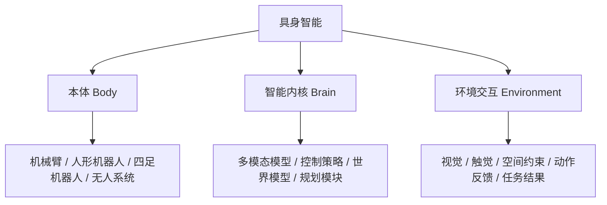

# Task 01: Theory and Trends

## 1. What do you need to understand in this section?

After completing this section, you should be able to answer at least the following three questions:

1. What is the fundamental difference between embodied AI and ordinary chat large models?
2. Why can robotic arms, humanoid robots, autonomous driving, and quadruped robots all be placed within the same discussion framework?
3. What are the most critical opportunities and the most realistic challenges in current embodied AI?

## 2. What is embodied AI

You can first use a sentence that is easy to remember to understand it:

> Embodied AI = intelligent systems that can perceive, understand, decide, and act in the physical world.

Compared to AI that only processes text, images, and speech on a screen, embodied AI has one crucial constraint: it must interact with the real world. The real world is not a pure text environment; it involves space, time, friction, occlusion, collision, delay, error, and failure costs.

This is also the core meaning of "embodied". It does not mean "looking like a human", but refers to a system that has a medium capable of real interaction with the world. This medium can be:

- robotic arm
- bipedal or wheeled humanoid robot
- quadruped robot
- unmanned vehicles, drones, and unmanned ships
- industrial equipment equipped with AI

## 3. Three Core Elements of Embodied AI

### 3.1 Ontology

The ontology determines what actions the system can perform. The robotic arm is good at grasping and manipulation, while humanoid robots are more suitable for movement in complex environments and dual-hand operations. Autonomous vehicles are better at navigation and transportation.

### 3.2 Intelligent Kernel

The intelligent kernel determines how the system “understands and makes decisions”. It may include perception models, VLA, world model, planning modules, controllers, etc.

### 3.3 Environmental Interaction

Environmental interaction determines whether the system can be truly implemented. Actions that seem simple on paper encounter issues such as lighting changes, view obstruction, grasping errors, and cumulative latency when applied in a real environment.

This is also one of the main differences between embodied AI and pure software intelligence.

## 4. Why is embodied AI being discussed now?

Over the past year, embodied AI has achieved breakthroughs in athletic performance on sports fields, and acquired learning and operational skills on training grounds, laying the foundation for real-world application. The industry as a whole exhibits development characteristics of **“integration,” “diversity,” and “prosperity.”**

1. **Focus on achieving the integration of hardware and software, knowledge and action, as well as virtual and real environments**: Promote innovation in hardware-software integration, and accelerate the collaborative evolution of embodied base models and ontology structures. Emphasize the unity of knowledge and action to create a closed loop chain that combines perception, decision-making, and action. Open up the path between virtual and real worlds to facilitate the transition and deployment from simulation to real-world practice.

2. **Develop diversified products capable of “flying, sailing, and navigating various challenges”**: Various hardware devices range from single-purpose applications to multiple functions, and from structured environments to unstructured natural environments, showing significant intelligent breakthroughs:
   - **Mobile products (solving the “where to go” issue)**: Four-legged, multi-legged, and wheeled robots; unmanned vehicles, drones, unmanned ships, etc.
   - **Manipulation products (solving the “what to do” issue)**: Collaborative robotic arms, composite wheeled arms robots, humanoid robots (two-legged/wheeled), etc.

3. **The industrial ecosystem continues to evolve**: The four sectors of industry applications, product services, technical services, and infrastructure have gradually formed a complete industrial chain. Its application prospects are broad, covering various types such as “tools,” “utensils,” “vehicles,” and “toys.” It is expected to become smart employees, life assistants, intelligent drivers, and intelligent partners.

In the past few years, large models have advanced rapidly in "understanding" and "generation". However, many truly valuable tasks do not occur within chat boxes, but in the physical world. For example:

- Sorting, assembly, and handling in factories
- Organizing, delivery, and companionship at home
- Picking, transshipment, and shelving in warehousing and logistics
- Inspection, rescue, and exploration in hazardous environments

From this perspective, the significance of embodied AI lies not only in making robots smarter, but also in bringing AI from the digital space into the real world.

## 5. What are the common forms of embodied AI?

They can be roughly divided into two categories:

### 5.1 Mobile Devices

They mainly address the "where to go" issue.

- Autonomous vehicle
- Drone
- Terripenal robot
- Wheeled robot

### 5.2 Manipulation-Based Carriers

They mainly address the question of "what to do".

- Collaborative robotic arm
- Two-armed robot
- Humanoid robot
- Wheeled arm composite robot

Many real-world systems possess both types of capabilities simultaneously, that is, "can move" plus "can manipulate".

## 6. Why is the current industry both popular and challenging?

Embodied AI is regarded as the essential path to achieving General AI (AGI). Its core value is built upon two fundamental pillars: the "intelligent enhancement cycle" and the "multi-dimensional value closed loop". Through deep and continuous interaction between "model intelligence", "embodied entities", and the "physical world", a positive feedback loop is established: the scale effect of multimodal data and high-precision physical interaction drive the model to absorb experience from real scenarios, and leveraging the Scaling Law enables a generalized leap in intelligence levels.

However, embodied AI is not a breakthrough in a single technology, but rather a global trend driven by the synergy of technology, engineering, applications, and capital. As a challenging track with steep slopes and heavy snow, there are also **three "non-conventional" challenges** behind this trend:
1. **Path selection debate**: Which is more important—data and models in achieving "perception-cognition-decision-execution"?
2. **Ontology configuration debate**: Should there be a universal ultimate form, or specialized configurations tailored to specific scenarios?
3. **Data solution debate**: How to select, process, and mix real data with simulation/synthetic data for training?

Currently, the capabilities and infrastructure of embodied AI are still in the "infant walking" stage, undergoing a critical transition from "commercial validation in limited scenarios" to "enhancement of general intelligence robot generalization." This process faces four major challenges:
- **System level**: Non-standard software and hardware, low integration, and inconsistent protocols hinder large-scale deployment.
- **Data level**: Limited volume of high-quality data, high collection costs, and a significant gap between simulation environments and real-world data (Sim2Real Gap).
- **Model level**: The technical paradigm is not yet established, and the RLHF methods for embodied large models are still under exploration.
- **Talent level**: There is a shortage of interdisciplinary experts; AI developers need to possess full-stack capabilities in algorithms, hardware, and control.

In summary, embodied AI is seen by many as an important direction toward more advanced general intelligence, but it is currently in a stage of "high interest and high difficulty".

### 6.1 Why It Has Potential

- It directly connects to real-world needs such as industry, logistics, households, healthcare, and inspection.
- It can integrate multimodal models, robot control, simulation platforms, and data systems into a complete closed loop.
- It has significant engineering and industrial value, not just academic value.

### 6.2 Why It Is Still Difficult

The current main issues lie at four levels:

- System layer: Severe fragmentation in hardware interfaces, communication protocols, and software stacks
- Data layer: High-quality real interaction data is expensive, scarce, and difficult to collect
- Model layer: Generalization, long-term scheduling, and stable control are still not mature enough
- Engineering layer: Significant `Sim2Real Gap` exists between simulation and real robot

## 7. Summary of this section

At this point, you should first make a basic judgment:

- Embodied AI is not as simple as “putting large models into robots”.
- Essentially, it is a closed loop system consisting of “body + intelligence + real-world environment feedback”.
- Its opportunities stem from real scenarios, and its challenges also arise from real scenarios.

## 8. Daily Tasks

### Task 1

Observe the most ordinary object around you, such as a cup, a tissue box, or a door handle, and think:

- If the robot sees it, what needs to be identified in the first step?
- What needs to be judged in the second step?
- What action needs to be performed in the third step?

### Task 2

Submit a lightweight output, either option is fine:

- A hand-drawn sketch
- A 150-300 word text description

Theme:

“A scenario of embodied AI in my mind”

## 9. Further Reading

- Overview of Embodied AI fundamentals:
  [01 Overview of Embodied AI](../../01-embodied-ai-overview/01-overview-of-embodied-ai.md)
- Related content on robot hardware and control:
  [ Tutorial on robot hardware, lerobot, and Gudou RDK-X5 development board control](../../03-robot-hardware-lerobot-and-rdk-x5/04-lerobot-dual-arm-heterogeneous-system-remote-manipulation.md)
