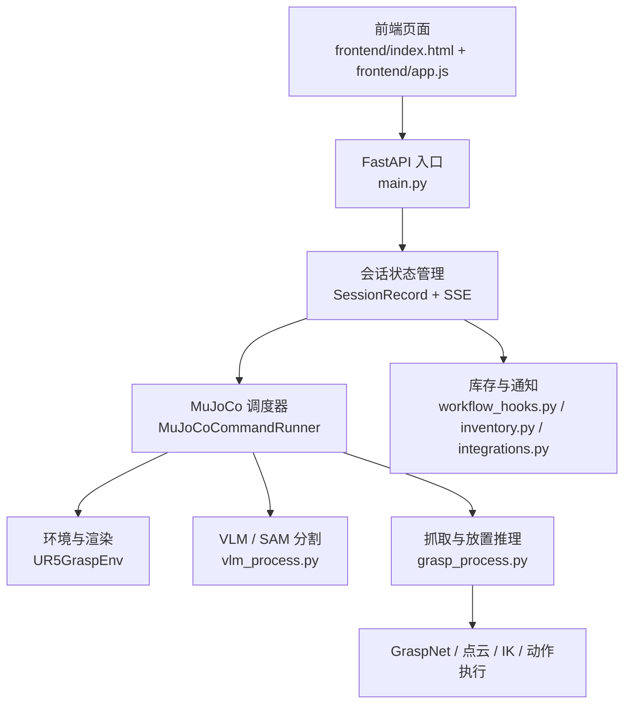

# TuntunClaw

<div align="center">
  
</div>

TuntunClaw is a home assistant designed for real family living scenarios. The project is built on the OpenClaw artificial intelligence operating system, integrating natural language interaction, visual understanding, object segmentation, grasping reasoning, MuJoCo simulation execution, and real-time web-based visualization into a single workflow. It demonstrates the complete closed loop from a Chinese command to the robotic arm completing the home supplies organization task.

## 1. Project Background and Positioning

In the fast-paced modern life, managing household supplies—such as remembering where minor items are stored and keeping an eye on the remaining quantity of daily consumables—often becomes an invisible cognitive burden for humans. While traditional smart home devices can execute specific, clear commands, they generally lack the "butler-like awareness" to take care of human concerns, as well as the ability to communicate and collaborate naturally with humans.

To liberate humans from tedious memory and record tasks, this project focuses on real family life scenarios. Leveraging the OpenClaw artificial intelligence operating system, a home assistant named “Tun Tun Pliers” has been developed. It is not only a robot system that performs physical actions, but also a living companion that understands life and can naturally communicate with humans. Through companion-like voice interaction and intelligent management of household items, it aims to take over the daily chores in the home, creating a warm, convenient, and natural future family lifestyle.

From a system perspective, Tun Tun Pliers is not merely a grasping demonstration program, but an embodied AI application prototype focused on home services. Here, OpenClaw serves as the underlying intelligent operating system and capability foundation, while Tun Tun Pliers addresses real household needs by designing experiences and arranging capabilities around practical tasks such as “finding items, organizing, returning items, replenishment reminders, and natural interaction”.

## 2. Project Highlights

### 2.1 Natural Interaction for Home Scenarios

The system supports directly entering Chinese natural language tasks, for example:

- `请把巧克力放到盘里`
- `将菜板上的苹果放置有苹果的架子上保存`
- `请把玻璃杯扔到地上` (The system supports secure interactions; OpenClaw will directly reject such commands.)

Users do not need to remember complex command formats; they only need to issue tasks in a way close to everyday expressions, and the system will automatically parse the tasks, understand the objectives, and execute the actions.

### 2.2 The Embodied Execution Chain with OpenClaw Driver

This project extends the interactive intelligent manipulation concept of OpenClaw to the home supplies management scenario, connecting in a unified system:

- Natural language command input
- VLM object understanding
- SAM object segmentation
- GraspNet grasping candidate reasoning
- Robotic arm action execution in MuJoCo
- Real-time visual feedback on the web interface

This enables the Tuantuan Pliers to not only "understand instructions" but also "actually carry out actions".

### 2.3 Frontend Optimized for Demonstration and Presentation

The web interface provides a complete task display interface, including:

- Chinese command input area
- Quick preset buttons
- Real-time scene preview
- Execution timeline
- Debugging output area

Therefore, the project is suitable for local development and debugging, as well as for competitions, presentations, demonstrations, and video recording.

### 2.4 Continuous Task Execution

The system supports a continuous task workflow. The subsequent command will continue to run based on the state of the environment after the previous command, rather than resetting the simulation environment every time.

For example:

1. First, execute `请把巧克力放到盘里`.
2. After the chocolate is placed, keep it in the plate.
3. Then, execute `将菜板上的苹果放置有苹果的架子上保存`.
4. The second task will continue based on the scenario after the first task is completed.

This ability is particularly important for "home organization" tasks, as the organization process in real homes is continuous.

## 3. System Architecture

The current system can be summarized into four layers:

1. Interaction Display Layer
2. Web Service and Session Layer
3. Perception and Understanding Layer
4. Simulation Execution Layer



This architecture enables OpenClaw capabilities to expand from low-level execution to a complete closed loop for home service interaction.

## 4. Core Capabilities

### 4.1 Chinese Task Understanding

The system can parse natural language tasks into structured execution goals, for example:

- Source object
- Target container
- Spatial relationship
- Whether to execute in batch

### 4.2 Target Segmentation and Positioning

The system combines VLM and SAM to locate target objects and placement areas in simulated camera images, and generates intermediate segmentation results for debugging and visualization.

### 4.3 grasping reasoning

The system generates grasping candidates for point clouds in the target area using GraspNet, and selects the appropriate grasping pose for the current task by combining collision filtering, geometric constraints, and scene priors.

### 4.4 Special Logic in Family Scenarios

The project is specifically adapted for common household organization tasks. For example:

- Chocolate will prioritize recognizing specific packaging targets.
- Apple will distinguish apples on the cutting board from those in the fruit basket.
- The placement location is not simply the "center of the shelf," but the effective area inside the container that aligns with daily organization principles.

### 4.5 Material Management and Reminder Chain

In addition to the execution of robotic arm movements, the system has also introduced inventory and notification capabilities, expanding its functionality for daily household material management. This enables the Hoop Hooper not only to “transport objects” but also to provide services for household logistics management.

## 5. Project Directory

```text
tuntunclaw/
├─ frontend/                       # Web 前端
├─ manipulator_grasp/             # MuJoCo 环境、机械臂与场景资源
├─ graspnet-baseline/             # GraspNet 相关代码
├─ openclaw_like/                 # 轻量策略与交互封装
├─ main.py                        # FastAPI 与统一入口
├─ grasp_process.py               # 抓取、放置、IK、动作执行
├─ vlm_process.py                 # VLM / SAM 分割逻辑
├─ inventory.py                   # 库存状态管理
├─ integrations.py                # 外部通知与 webhook
├─ workflow_hooks.py              # 成功任务后的业务副作用
└─ 项目开发流程与系统架构说明.md    # 详细架构说明
```

## 6. Quick Start

### 6.1 Environment

The current default environment is `vlm_grasp311`.

### 6.2 Large File Assets

To avoid making the Git repository too large, the following large files are placed on Hugging Face:

- `assets/fig.png`
- `manipulator_grasp/assets/target_basket_medium/materials/textures/texture.png`
- `manipulator_grasp/assets/libero_basket/texture.png`

Before the first run, execute in the root directory of the project:

```powershell
python scripts/download_large_assets.py
```

The script will download these files from [Datawhale/tuntunclaw-assets](https://huggingface.co/datasets/Datawhale/tuntunclaw-assets) and restore them to the original path. If the Hugging Face repository requires authentication, please set `HF_TOKEN` or `HUGGINGFACE_HUB_TOKEN` first.

### 6.3 Startup

```powershell
micromamba run -n vlm_grasp311 python main.py
```

Defaultly enabled after startup:

```text
http://127.0.0.1:8000/
```

### 6.4 Example Task

You can directly enter it on the web page:

```text
请把巧克力放到盘里
将菜板上的苹果放置有苹果的架子上保存
请把玻璃杯扔到地上（系统支持安全交互，OpenClaw 会直接拒绝这种指令。）
```

## 7. Typical Demonstration Process

A complete home organization demonstration can be carried out like this:

1. Enter `请把巧克力放到盘里` on the web interface
2. The system completes chocolate recognition, grasping, and placement
3. Then enter `将菜板上的苹果放置有苹果的架子上保存`
4. The system continues to organize apples in the current scenario
5. The front end synchronizes the execution process, current status, and debugging information

This process represents not just grasping a single object, but rather “continuous assistance for daily tasks”.


---

The Houtun Pliers aims to present a vision of embodied AI that is closer to everyday family life than just “a robotic arm performing an action”. It seeks to make robots true collaborators for family members, taking on the tedious, repetitive tasks that require long-term memory and repeated effort.

In this sense, the Tun Tun Pliers is a concrete implementation of OpenClaw for home scenarios, and it represents an exploration of embodied AI moving from laboratory demonstrations to real-life services.
