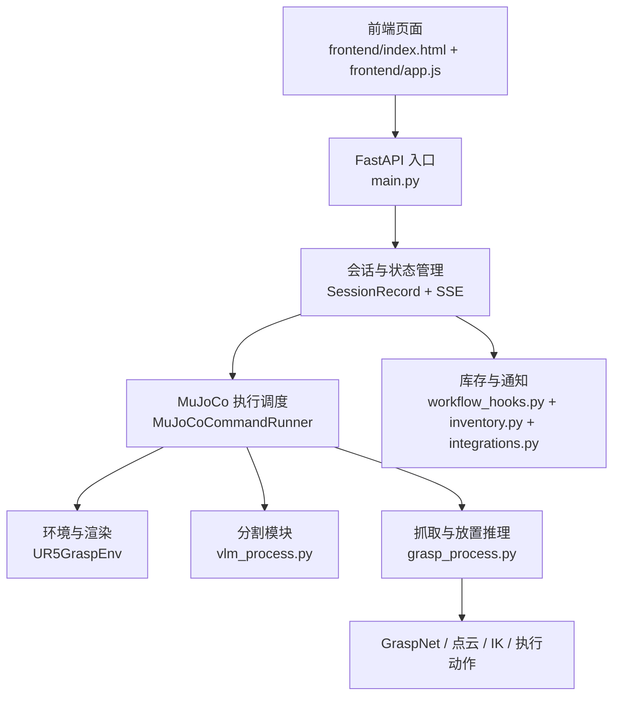

# Project Development Process and System Architecture Description

This article is aimed at project maintainers and secondary developers. It describes in detail the overall architecture of the current `VLM_Grasp_Interactive`, the front-end and back-end call chain, the MuJoCo simulation execution process, the continuous task mechanism, and the responsibilities of various key files in the current project.

After reading, the reader should be able to:

- Understand the entire process of this project, from "inputting natural language in a web page" to "grasping and placing in MuJoCo".
- Clarify the relationships between the frontend, FastAPI, VLM/SAM segmentation, GraspNet, motion execution, and inventory notifications.
- Comprehend why this project supports "continuous tasks" instead of resetting the environment for each command.
- Continue to expand new objects, new placement logic, and new business interfaces without disrupting existing grasping tasks.

## 1. Project Objectives

The goal of this project is not merely to create a robot control interface, but to build a simulation demonstration system that is “visualizable, interactive, and capable of continuous execution”. The system receives natural language tasks, displays the execution process via a web interface, and calls the visual segmentation, grasping candidate reasoning, and MuJoCo simulation execution modules at the backend. Ultimately, it performs actions such as grasping, placement, and throwing.

The current project has completed the following capabilities:

- Input of Chinese natural language instructions and quick preset settings.
- Integration of web frontend and FastAPI backend.
- MuJoCo simulation results displayed on the web interface.
- Target localization and segmentation using VLM + SAM.
- Grabbing-based reasoning for candidate objects.
- Specialized logic adaptation for target objects, such as chocolate, apple, sponge, plate, fruit basket, etc.
- Continuous task execution, meaning the second command proceeds based on the state after the first command is executed.

## 2. Launch Methods and Entry Points

Currently, the `vlm_grasp311` environment is used uniformly.

### 2.1 Integrated Frontend and Backend Entry Point

```powershell
micromamba run -n vlm_grasp311 python main.py
```

After execution, the FastAPI service will be started, and the browser will open automatically. The default address is:

```text
http://127.0.0.1:8000/
```

### 2.2 Other Historical Entries

- [main_openclaw.py](../../../../16-专题组队学习/02-OpenClaw家庭物资助手/tuntunclaw/main_openclaw.py): Early main program entry point.
- [main_vlm.py](../../../../16-专题组队学习/02-OpenClaw家庭物资助手/tuntunclaw/main_vlm.py): Experimental VLM invocation entry point.

The current actual demonstration link is based on [main.py](../../../../16-专题组队学习/02-OpenClaw家庭物资助手/tuntunclaw/main.py).

## 3. Overall Architecture

The system can be divided into five layers:

1. Front-end interaction layer
2. Web service and session management layer
3. Perception and task understanding layer
4. grasping reasoning and motion execution layer
5. extension business layer

The main call relationships of the current project are provided below.



## 4. Core Directory Instructions

### 4.1 Web Layer

- [frontend/index.html](../../../../16-专题组队学习/02-OpenClaw家庭物资助手/tuntunclaw/frontend/index.html)
  Page structure, static buttons, fallback event script, preset button template.

- [frontend/app.js](../../../../16-专题组队学习/02-OpenClaw家庭物资助手/tuntunclaw/frontend/app.js)
  Frontend state machine, session submission, SSE subscription, preview updates, text box writing of quick preset settings, and debugging information display.

- [frontend/styles.css](../../../../16-专题组队学习/02-OpenClaw家庭物资助手/tuntunclaw/frontend/styles.css)
  Page styling, panel hover glow effect, preview area layout, and overall visual theme.

### 4.2 Web Backend and Main Control Layer

- [main.py](../../../../16-专题组队学习/02-OpenClaw家庭物资助手/tuntunclaw/main.py)
  The main entry point of the current system. It is responsible for:
  - Starting FastAPI.
  - Mounting front-end static files.
  - Receiving `/api/command` commands.
  - Creating and maintaining sessions.
  - Passing tasks to the MuJoCo executor.
  - Pushing status to the frontend via `/api/session/{id}` and `/api/session/{id}/events`.
  - Outputting real-time preview frames to the frontend via `/api/session/{id}/frame`.

### 4.3 Perception and Execution Layer

- [vlm_process.py](../../../../16-专题组队学习/02-OpenClaw家庭物资助手/tuntunclaw/vlm_process.py)
  VLM and image segmentation module. Responsible for:
  - Calling multimodal models to understand user commands and images.
  - Outputting natural language descriptions of targets and image boxes.
  - Calling local or remote SAM segmentation.
  - Generating `mask_source`, `mask_destination`, and debugging overlay maps.

- [grasp_process.py](../../../../16-专题组队学习/02-OpenClaw家庭物资助手/tuntunclaw/grasp_process.py)
  Core module for grasping and placement reasoning. Responsible for:
  - Building point clouds from depth maps and masks.
  - Calling GraspNet to generate grasping candidates.
  - Estimating grasping points and placement points based on geometric information of the target object.
  - Solving IK.
  - Controlling the robotic arm to perform grasping, lifting, movement, placement, and repositioning in MuJoCo.
  - Providing object-specific logic, such as special mappings for chocolate, apple, sponge rack, and apple basket.

- `manipulator_grasp/env/ur5_grasp_env.py` (the MuJoCo environment wrapper used by the runtime; it is not part of the public subset)
  MuJoCo environment wrapper. Responsible for:
  - Loading XML scenes.
  - Initializing the robotic arm and gripper.
  - Managing off-screen rendering and passive viewer.
  - Aligning perspectives between web and simulation sides.
  - Only rebuilding the rendering backend during rendering errors, without resetting the world state.

### 4.4 Scene and View Configuration

- [scene_robocasa_layout51_style34.xml](../../../../16-专题组队学习/02-OpenClaw家庭物资助手/tuntunclaw/manipulator_grasp/assets/scenes/scene_robocasa_layout51_style34.xml)
  The main scene file currently in use.

- `scene_robocasa_layout51_style34.view.json`
   The default view configuration file for the current main scene. Both the web interface and the MuJoCo viewer read this view configuration. This file can be generated during local debugging processes and is not part of the source code that must be submitted for public tutorials.

### 4.5 Business Extension Layer

- [workflow_hooks.py](../../../../16-专题组队学习/02-OpenClaw家庭物资助手/tuntunclaw/workflow_hooks.py)
  Handling of side effects after successful tasks, such as inventory changes, low-inventory notifications, and synchronization with external systems.

- [inventory.py](../../../../16-专题组队学习/02-OpenClaw家庭物资助手/tuntunclaw/inventory.py)
  A inventory system for file persistence, which records the changes in material quantities after certain tasks are completed.

- [integrations.py](../../../../16-专题组队学习/02-OpenClaw家庭物资助手/tuntunclaw/integrations.py)
  External webhook and Xojo notification interface.

## 5. Front-end Workflow

The core responsibility of the frontend is not to execute robot actions, but to organize user commands, backend session states, and simulation views into a demonstrable and debuggable interactive interface.

### 5.1 Page Composition

The web interface consists mainly of three panels:

- Left: Instruction input area
- Middle: Scene preview area
- Right: Execution timeline and debugging output area

The left side is used for entering natural language commands, and the text box can be quickly filled in via quick preset buttons. The middle area displays the current MuJoCo real-time image or placeholder. The right side shows the progress of the current session, such as language parsing, target segmentation, grasping inference, IK solution, action execution, and final results.

### 5.2 Command Submission

The current frontend supports two submission methods:

- Click the "Execute Command" button
- Enter `Enter` in the input field

The corresponding logic is located in [frontend/app.js](../../../../16-专题组队学习/02-OpenClaw家庭物资助手/tuntunclaw/frontend/app.js). The frontend will send commands to:

```text
POST /api/command
```

After submission, the frontend enters the "running" state and begins subscribing to the SSE stream of that session.

### 5.3 Session State Update

The frontend obtains the task execution progress through the following interface:

- `GET /api/session/{session_id}`
- `GET /api/session/{session_id}/events`
- `GET /api/session/{session_id}/frame`

Among them:

- `events` is responsible for pushing structured states such as traces, logs, stage names, and results.
- `frame` is responsible for providing the latest PNG preview frames.

This means that the frontend does not directly access MuJoCo or participate in planning execution, but is entirely driven by the FastAPI session state.

## 6. Backend Session and Scheduling Process

### 6.1 Session Object

In [main.py](../../../../16-专题组队学习/02-OpenClaw家庭物资助手/tuntunclaw/main.py), each command corresponds to a `SessionRecord`. It stores the following core information:

- `session_id`
- Current command string
- Parsed task structure
- Current trace list
- Current status, such as `running`, `success`, `failure`
- Current result text
- Preview image URL
- Debugging logs
- Inventory snapshot

After each command submission by the frontend, the backend generates a new session or continues using the specified session, and then starts a background thread to execute the actual MuJoCo task.

### 6.2 Command Parsing

Command parsing is completed in [main.py](../../../../16-专题组队学习/02-OpenClaw家庭物资助手/tuntunclaw/main.py), mainly handled by the following functions:

- `_normalize_text`
- `_extract_objects`
- `_infer_relation`
- `_parse_task`

The parsing results will be standardized into structured tasks:

```python
{
    "type": "pick_place",
    "source": "apple",
    "destination": "apple_rack",
    "relation": "in",
    "all_items": False,
}
```

This step is the task entry point of the entire system, and it also serves as the basis for the subsequent dedicated logic routing.

### 6.3 General Tasks and Specialized Tasks

The current backend does not fully rely on a unified generalization logic, but adopts a "general framework + specialized object adaptation" approach.

For example:

- The chocolate task will prioritize locking the scene entities corresponding to `SNICKERS`.
- The apple task will distinguish between the apples on the cutting board and those in the fruit basket.
- The sponge task will distinguish between the sponges on the table and those in the sponge rack.
- The placement positions of the fruit basket and the sponge rack are not simply "the center of the rack," but specific, valid slots calculated accordingly.

The reason for this approach is straightforward: pure dependency on text understanding and pure segmentation are not stable in complex scenarios. It is easy to encounter errors in identifying similar objects or placing them in inappropriate positions. The current system uses object-level rules to mitigate these frequent failure points.

## 7. MuJoCo executes the main link

The actual execution entity is located in `MuJoCoCommandRunner`.

The single grasping and placement main process can be summarized as:

1. Ensure the environment is initialized.
2. Gather RGB and depth data.
3. Segment the source object.
4. Estimate the world coordinates of the grasping target.
5. Segment the target placement area or directly use a dedicated placement slot.
6. Build a point cloud and run GraspNet.
7. Solve the IK for grasping, lifting, moving, placing, and repositioning.
8. Execute the actions step by step in MuJoCo.
9. Continuously send real-time frames and stage states to the frontend.

### 7.1 RGB-D Acquisition

The collection logic is located at:

- `_capture_rgbd` in [main.py](../../../../16-专题组队学习/02-OpenClaw家庭物资助手/tuntunclaw/main.py)
- `render` in the runtime environment wrapper `manipulator_grasp/env/ur5_grasp_env.py`

What the backend receives here is:

- `img`: Current camera RGB image
- `depth`: Depth map from the same perspective

All subsequent segmentation, point cloud, and grasping inferences are based on this synchronized RGB-D data pair.

### 7.2 Source-Target Splitting

Source-target segmentation is performed using `segment_image` in [vlm_process.py](../../../../16-专题组队学习/02-OpenClaw家庭物资助手/tuntunclaw/vlm_process.py) and its related logic.

This step supports three input methods:

- Pure command text
- Text + scene bbox hints
- Text + explicit label overlay

In the current project, many stability fixes rely on this layer. For example:

- Chocolate will have the hint "Written on the packaging is SNICKERS".
- Sponge will have the hint "Prefer the sponge marked with a red circle".
- Apple rack will follow a specific target, no longer relying solely on the general term "rack".

### 7.3 Point Cloud and GraspNet

The grasping candidate reasoning is located in [grasp_process.py](../../../../16-专题组队学习/02-OpenClaw家庭物资助手/tuntunclaw/grasp_process.py).

The core processing chain is as follows:

1. Construct organized point clouds based on RGB, depth, and mask.
2. Filter out invalid points according to the depth threshold.
3. Call GraspNet to generate grasping candidates.
4. Perform collision filtering.
5. Sort by target center, grasping direction, and distance.
6. Select the final grasping pose.

If an error occurs here:

```text
No valid masked point cloud points after depth filtering
```

Generally, it is not an IK issue, but there is a problem with the input before that. Common causes include:

- The mask landed on the incorrect object.
- The depth map becomes invalid.
- Abnormalities occur during off-screen rendering.

### 7.4 IK and Action Execution

Action execution is also located in [grasp_process.py](../../../../16-专题组队学习/02-OpenClaw家庭物资助手/tuntunclaw/grasp_process.py).

Current execution order is:

- `home`
- `hub`
- `hover_pick`
- `pregrasp`
- `grasp`
- `grasp_close`
- `lift`
- `hover_place`
- `preplace`
- `place`
- `release`
- `retreat`
- `hub_return`
- `reset`

At each stage, a callback is sent back to the frontend, which then displays the current stage name and the latest image.

## 8. Continuous Task Mechanism

This is one of the most critical engineering designs for this project at present.

### 8.1 Design Goals

This project requires Task 2 to continue running based on the world state after Task 1 is completed, rather than restoring the MuJoCo scene to its initial state every time.

For example:

1. First, execute “Please place the chocolate on the plate”.
2. Place the chocolate on the plate.
3. Then, execute “Store the apple on the cutting board on the rack with apples”.
4. At this point, the chocolate should still remain in the plate during the simulation.

### 8.2 Current Implementation

Environment management is located in `MuJoCoCommandRunner` within [main.py](../../../../16-专题组队学习/02-OpenClaw家庭物资助手/tuntunclaw/main.py).

The principles are:

- `UR5GraspEnv` is used only the first time with `reset()`
- Subsequent tasks reuse the same `self._env`
- Therefore, `mj_model` and `mj_data` will retain the state after the previous task was executed

### 8.3 Repair Policy for Rendering Errors

During the continuous task process, there was a damage to the off-screen rendering backend, resulting in the following issues on the web interface:

- Preview black screen
- Depth map remains constant at a large constant value
- Subsequent point cloud construction fails

The runtime environment wrapper `manipulator_grasp/env/ur5_grasp_env.py` uses the following mechanism:

- When invalid rendering output is detected, the entire MuJoCo scene is not reset.
- Only the offscreen rendering resources are rebuilt, such as the renderer, GLFW window, and offscreen context.
- `mj_model` and `mj_data` are retained.

Therefore, the current system meets two conditions simultaneously:

- World state is continuous
- Rendering errors are recoverable

## 9. Camera View and Scene Editor

### 9.1 Unified Perspective Source

The default perspective for the web interface and the MuJoCo viewer is derived from the scene perspective file:

```text
scene_robocasa_layout51_style34.view.json
```

The reading logic is located at:

- `manipulator_grasp/env/ur5_grasp_env.py`

### 9.2 How the perspective configuration takes effect

When `scene_robocasa_layout51_style34.view.json` exists, the simulation client will read this camera view configuration. Then:

- The simulation viewer will use this perspective.
- Off-screen rendering on the web interface will also use this perspective.

This ensures that the "camera seen by the front end" is consistent with the "camera seen by the local MuJoCo debugger". The public repository retains the scenarios and reading logic required for operation, without including the local scene editing tool.

## 10. Debugging Output and Intermediate Files

The current project will write a large amount of intermediate results into `temp/`, which facilitates problem identification.

### 10.1 Image and Segmentation Results

Common output directories:

```text
temp/images/
```

These include:

- `*_mask_source.png`
- `*_mask_destination.png`
- `*_mask_source_overlay.png`
- `*_mask_destination_overlay.png`

These files can be directly used for judgment:

- Whether VLM/SAM recognizes the correct target
- Whether the bbox falls on the correct object
- Whether the layering is consistent with the real image

### 10.2 Inventory Status

Inventory status will be persisted in:

```text
temp/inventory/
```

This is the basic data directory for demonstrating the business-side logic.

## 11. Business Expansion: Inventory, Orders, and Feishu Notifications

In addition to grasping the demonstration, the current project has also integrated a lightweight business closed loop.

### 11.1 Inventory Reduction

After some successful tasks, [workflow_hooks.py](../../../../16-专题组队学习/02-OpenClaw家庭物资助手/tuntunclaw/workflow_hooks.py) is called:

```python
record_task_success_effects(...)
```

This function will:

- Update local inventory
- Determine if inventory is low
- Notify via external webhook
- Send reminders to Feishu when necessary

### 11.2 External Integration

[integrations.py](../../../../16-专题组队学习/02-OpenClaw家庭物资助手/tuntunclaw/integrations.py) is responsible for:

- Robot external webhook
- Feishu notification
- Read local configuration file

This layer does not participate in grasping control, but is responsible for synchronizing simulation success events to other systems.

## 12. Current object-level dedicated logic

In the current project, special adaptations have been made for several objects. This is an important reason for the stable operation of the system.

### 12.1 Chocolate

- Use `SNICKERS` semantic hint to lock in the correct chocolate.
- Avoid misidentifying the chocolate as other small objects in the same scene.

### 12.2 Apple

- `apple` is mapped to the apple on the cutting board by default.
- `apple_rack` is mapped to the fruit basket.
- The placement of the apple is not at the center of the entire shelf, but in a dedicated position within the fruit basket.

### 12.3 Sponge

- Supports modeling with the sponge and the sponge rack separated.
- Supports batch organization logic.
- The placement points use the dedicated slots in the sponge rack, rather than the general "rack center".

## 13. Recommended Current Development Process

If further development is to be carried out, it is recommended to follow the following order.

### 13.1 New Object Integration Process

1. Confirm the target body name in the scene XML.
2. Add Chinese command aliases in [main.py](../../../../16-专题组队学习/02-OpenClaw家庭物资助手/tuntunclaw/main.py).
3. Add the `SCENE_BODY_NAMES` mapping in [grasp_process.py](../../../../16-专题组队学习/02-OpenClaw家庭物资助手/tuntunclaw/grasp_process.py).
4. If necessary, write specialized world coordinate functions for the placement area.
5. Execute two tasks continuously via a web interface to verify that the status is correctly preserved.

### 13.2 Debugging Order

When encountering problems, it is recommended to troubleshoot in the following order:

1. Whether the web-based log shows entry into the real MuJoCo execution.
2. Whether the source mask and target mask in `temp/images` are correct.
3. Whether the web preview goes black or shows color distortion.
4. Whether the depth map is abnormal.
5. Whether the mapping between the source object and the target object in `grasp_process.py` is correct.
6. Whether the placement point uses generalization logic rather than dedicated logic.

## 14. Common Issues and Recovery Methods

### 14.1 Black Screen on Web Interface

It is more likely that the back-end for off-screen rendering has failed, rather than the front-end code itself. The current system supports automatic reconstruction of rendering resources. However, if the old process is abnormal, the most direct way to restore it is to restart [main.py](../../../../16-专题组队学习/02-OpenClaw家庭物资助手/tuntunclaw/main.py).

### 14.2 No point cloud after deep filtering

The incorrect format is usually:

```text
No valid masked point cloud points after depth filtering
```

Priority checks:

- Is the segmentation target correct?
- Is the depth normal?
- Is the target within the camera's view range from the current perspective?

### 14.3 Object Misattached or Misplaced

Priority checks:

- Whether this object already has a dedicated mapping
- Whether it is still pursuing generalized targets such as `shelf`
- Whether the target placement point is at the center of the entire container, rather than an effective landing point inside the container

## 15. Recommended Next Maintenance Directions

Based on the current code state, the following three types of tasks are recommended as priority:

### 15.1 Stability

- Integrate more high-frequency objects into the dedicated mapping.
- Establish a "valid slot inside the container" logic for more container-type targets.
- Continue to standardize rendering anomaly detection.

### 15.2 Maintainability

- Organize object aliases, scene entity names, and placement policies into a configuration file.
- Extract the object rules currently scattered in `main.py` and `grasp_process.py` into separate modules.

### 15.3 Demonstration Capability

- Expand more continuous task scripts.
- Add an environment reset button to allow both “continuous execution” and “manual return to initial state” modes to coexist.
- Display more intermediate states on the frontend, such as split layers, number of candidates grasped, and current target entity name.

## 16. Key files related to this article

- [main.py](../../../../16-专题组队学习/02-OpenClaw家庭物资助手/tuntunclaw/main.py)
- [grasp_process.py](../../../../16-专题组队学习/02-OpenClaw家庭物资助手/tuntunclaw/grasp_process.py)
- [vlm_process.py](../../../../16-专题组队学习/02-OpenClaw家庭物资助手/tuntunclaw/vlm_process.py)
- `manipulator_grasp/env/ur5_grasp_env.py` (runtime environment file)
- [workflow_hooks.py](../../../../16-专题组队学习/02-OpenClaw家庭物资助手/tuntunclaw/workflow_hooks.py)
- [inventory.py](../../../../16-专题组队学习/02-OpenClaw家庭物资助手/tuntunclaw/inventory.py)
- [integrations.py](../../../../16-专题组队学习/02-OpenClaw家庭物资助手/tuntunclaw/integrations.py)
- [frontend/index.html](../../../../16-专题组队学习/02-OpenClaw家庭物资助手/tuntunclaw/frontend/index.html)
- [frontend/app.js](../../../../16-专题组队学习/02-OpenClaw家庭物资助手/tuntunclaw/frontend/app.js)
- [frontend/styles.css](../../../../16-专题组队学习/02-OpenClaw家庭物资助手/tuntunclaw/frontend/styles.css)

Based on the usage scenario, this description can correspond to three types of reading paths:

- Operation manual for demonstration users
- System architecture description for developers
- Troubleshooting manual for debuggers
