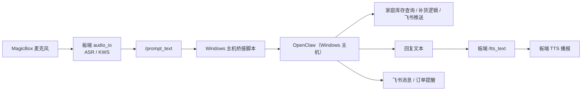

<!-- Generated by the offline translation workflow.
Source: 16-专题组队学习/03-地瓜机器人新版教程桌宠/README_10_Windows主机OpenClaw语音桥接与家庭物资助手.md
Source SHA-256: 58f2a85b0594b2b752540e292a743e37d527596cfdeb8e0b034791da503b9c51
Model: tencent/Hy-MT2-1.8B-GGUF:Q4_K_M
Review machine-translated technical claims before relying on them.
-->
# Windows Host OpenClaw Voice Bridge and Home Assistant

This document describes the actual architecture, startup method, data files, and Feishu links of this desk pet system, as well as how to present this solution in future reports.

## 1. Project Objectives

The goal of this system is not to cram all capabilities into the development board, but to implement a clear layering structure:

1. The development board is only responsible for voice input and voice announcements.
2. The Windows host is responsible for OpenClaw inference, home supplies Q&A, and Feishu order notifications.
3. Feishu is responsible for remote notifications, restock reminders, and order viewing.

The reason for doing this is straightforward:

1. The development board already has built-in ASR/TTS capabilities, making it suitable for "listening" and "speaking".
2. OpenClaw has been deployed on a Windows host, making it suitable for "understanding" and "decision-making".
3. Home supplies lists, replenishment orders, and Xiaoshu messages are naturally better managed on the host side.

## II. Current Architecture

The current system uses a bridging structure of "board-side voice front-end + host OpenClaw center".



One-sentence summary:

The development board is responsible for "turning sound into text, and then turning the reply text back into sound";
The Windows host is responsible for "real thinking".

## III. Currently Implemented Features

### 3.1 Family Remaining Supplies List

The current inventory is stored in a local CSV file, which facilitates long-term maintenance and retrieval.

The file location is as follows:

- [inventory.csv](C:\Users\kewei\Documents\2026\202603\06地瓜机器人新版教程桌宠\household_data\inventory.csv)
- [locations.csv](C:\Users\kewei\Documents\2026\202603\06地瓜机器人新版教程桌宠\household_data\locations.csv)
- [restock_orders.csv](C:\Users\kewei\Documents\2026\202603\06地瓜机器人新版教程桌宠\household_data\restock_orders.csv)
- [README.md](C:\Users\kewei\Documents\2026\202603\06地瓜机器人新版教程桌宠\household_data\README.md)

Among them, `inventory.csv` stores core inventory information. The fields include:

1. `物资名字`
2. `阈值`
3. `所在位置`
4. `剩余个数`
5. `购买链接`
6. `建议补货量`
7. `最近更新时间`

### 3.2 Family Supplies Q&A

Currently, the following three types of questions and answers are supported:

1. Query the materials closest to the threshold value.
2. Query the location of a specific item.
3. Generate a restock order for the specified material.

The local query script is as follows:

- [household_inventory_cli.py](C:\Users\kewei\Documents\2026\202603\06地瓜机器人新版教程桌宠\openclaw_magicbox\tools\household_inventory_cli.py)

Typical commands are as follows:

```bash
python C:\Users\kewei\Documents\2026\202603\06地瓜机器人新版教程桌宠\openclaw_magicbox\tools\household_inventory_cli.py top --limit 3 --format text
python C:\Users\kewei\Documents\2026\202603\06地瓜机器人新版教程桌宠\openclaw_magicbox\tools\household_inventory_cli.py locate --name 剪刀 --format text
python C:\Users\kewei\Documents\2026\202603\06地瓜机器人新版教程桌宠\openclaw_magicbox\tools\household_inventory_cli.py create-order --name 苹果 --send-feishu --format text
```

### 3.3 Feishu Replenishment Reminders and Order Notifications

Now, it is possible to directly send replenishment messages to Feishu from a Windows host, and write the order details into `restock_orders.csv`.

This means that the system already has:

1. Detect low inventory
2. Generate replenishment records
3. Send alerts to Lark

In the report, this section can be described as:

“Table Pet Frontend is responsible for listening to user requests, OpenClaw understands the requests and generates replenishment actions, and Feishu pushes the action results to users.”

## IV. Board-side Voice Bridging Design

### 4.1 Only ASR/TTS is retained at the board end

This project no longer uses the on-board `qwen_llm` as the main thinking model.

The structures currently retained at the board end are:

1. `audio_io`
2. Wake word detection
3. Speech to text
4. Text to speech

The board end no longer handles the intermediate reasoning, and the reasoning is handed over to OpenClaw on the Windows host.

### 4.2 Windows host takes charge of thinking

The Windows host side is responsible for:

1. Receive the text identified by the receiving board.
2. Call the local OpenClaw.
3. Perform inventory queries, location searches, and generate replenishment orders.
4. Send the response text back to the board via TTS.

The bridging script is as follows:

- [magicbox_voice_bridge.py](C:\Users\kewei\Documents\2026\202603\06地瓜机器人新版教程桌宠\openclaw_magicbox\tools\magicbox_voice_bridge.py)
- [start_magicbox_voice_bridge.ps1](C:\Users\kewei\Documents\2026\202603\06地瓜机器人新版教程桌宠\openclaw_magicbox\tools\start_magicbox_voice_bridge.ps1)

### 4.3 Current wake-up word

The keyword file on the current board has been expanded into a version that is more suitable for the name "Tun Tun Pliers". The core wake-up words supported include:

1. `囤囤钳`
2. `囤囤`
3. `豚豚`
4. `吞吞`
5. `屯屯`

Keep the original as is:

1. `你好地瓜`
2. `地瓜你好`
3. `地瓜地瓜`
4. `开始对话`
5. `结束对话`
6. `束对话`

### 4.4 Exit Commands

The current host bridge layer treats the following prefixes as exit/dormant signals:

1. `再见`
2. `拜拜`
3. `休眠`
4. `关闭`

When a voice like "Goodbye, Hunt Hunt" is detected, the host bridging layer will turn off the lights and stop the conversation.

## 5. Lighting Effect Design

The current light effect logic is divided into three states:

1. Not awakened: Four lights off
2. Listening: Breathing light
3. Responding: Running horse light

The board end light effect script has been expanded:

- [magicbox-hw](C:\Users\kewei\Documents\2026\202603\06地瓜机器人新版教程桌宠\openclaw_magicbox\bin\magicbox-hw)

New light effects include:

1. `led breathe`
2. `led marquee`

Therefore, it can now be executed directly at the board end:

```bash
sudo python3 /userdata/magicclaw/runtime/bin/magicbox-hw led breathe cyan 2 0.04
sudo python3 /userdata/magicclaw/runtime/bin/magicbox-hw led marquee blue 12 0.08
```

## VI. Current Launch Methods

### 6.1 Starting the OpenClaw Gateway

On a Windows host:

```powershell
openclaw gateway restart
```

### 6.2 Prepare the board-side voice front end

Execute on a Windows host:

```powershell
python C:\Users\kewei\Documents\2026\202603\06地瓜机器人新版教程桌宠\openclaw_magicbox\tools\magicbox_voice_bridge.py prepare
```

This step will do four things:

1. Synchronize wake-up word
2. Turn off on-board `qwen_llm`
3. Pull up `audio_io`: `ASR/TTS only` mode
4. Start the board-side prompt subscription auxiliary script

### 6.3 Starting the Host Bridging

Execute on a Windows host:

```powershell
powershell -ExecutionPolicy Bypass -File "C:\Users\kewei\Documents\2026\202603\06地瓜机器人新版教程桌宠\openclaw_magicbox\tools\start_magicbox_voice_bridge.ps1"
```

Or directly:

```powershell
python C:\Users\kewei\Documents\2026\202603\06地瓜机器人新版教程桌宠\openclaw_magicbox\tools\magicbox_voice_bridge.py run
```

## VII. Recommended demonstration process for current reports

The recommended demonstration order is as follows:

1. First, explain the system hierarchy.
2. Show the local inventory table.
3. Display the Feishu message push.
4. Present voice wake-up and Q&A features.

The recommended demonstration script is as follows.

### Demo 1: Inventory Alert Query

User says:

```text
你好你好，我想知道现在剩余物资最少的 3 样是哪 3 样？
```

System response example:

```text
当前最接近阈值的 3 样物资分别是：
第一，洗衣液，当前剩余 1，阈值 1，已经贴近补货线。
第二，牙膏，当前剩余 2，阈值 3，已经低于阈值。
第三，卷纸，当前剩余 5，阈值 6，也已经接近阈值。
```

### Demo 2: Generate Replenishment Orders

User says:

```text
我想把苹果补一下货，请你直接生成一下订单，推送到我的飞书上。
```

System response example:

```text
好的，已为您生成苹果的补货单，请到飞书查阅。
```

Then, a restock reminder is seen in the flyer.

### Demo Three: Location Query

User says:

```text
我想问一下我的剪刀在哪？
```

System response example:

```text
剪刀在您身后的柜子上。
```

## VIII. List of Current Key Files

### 8.1 Family Inventory and Orders

- [inventory.csv](C:\Users\kewei\Documents\2026\202603\06地瓜机器人新版教程桌宠\household_data\inventory.csv)
- [locations.csv](C:\Users\kewei\Documents\2026\202603\06地瓜机器人新版教程桌宠\household_data\locations.csv)
- [restock_orders.csv](C:\Users\kewei\Documents\2026\202603\06地瓜机器人新版教程桌宠\household_data\restock_orders.csv)

### 8.2 Host-side Logic

- [household_inventory_cli.py](C:\Users\kewei\Documents\2026\202603\06地瓜机器人新版教程桌宠\openclaw_magicbox\tools\household_inventory_cli.py)
- [magicbox_voice_bridge.py](C:\Users\kewei\Documents\2026\202603\06地瓜机器人新版教程桌宠\openclaw_magicbox\tools\magicbox_voice_bridge.py)
- [start_magicbox_voice_bridge.ps1](C:\Users\kewei\Documents\2026\202603\06地瓜机器人新版教程桌宠\openclaw_magicbox\tools\start_magicbox_voice_bridge.ps1)

### 8.3 Board Control

- [magicboxctl](C:\Users\kewei\Documents\2026\202603\06地瓜机器人新版教程桌宠\openclaw_magicbox\bin\magicboxctl)
- [magicbox-hw](C:\Users\kewei\Documents\2026\202603\06地瓜机器人新版教程桌宠\openclaw_magicbox\bin\magicbox-hw)

## 9. Current Status Explanation

The core concept of this solution is now clear, and the code has been implemented:

1. The board end is responsible only for ASR/TTS.
2. The Windows host is responsible for OpenClaw inference.
3. Home inventory is stored in local CSV format.
4. Feishu is used for replenishment messages and order viewing.
5. The wake-up word and light effect have been modified for the "Hunt Hunt Pliers" scenario.

If a general statement is needed in the report, you can directly use this sentence:

> This table pet system has been transformed from a "board-end large model integration" model into a structure of "board-end voice front end + Windows host OpenClaw center". It retains the natural voice input and output capabilities of the development board, while assigning real task understanding, home inventory analysis, and Feishu order notifications to a more flexible host-side AI agent.
