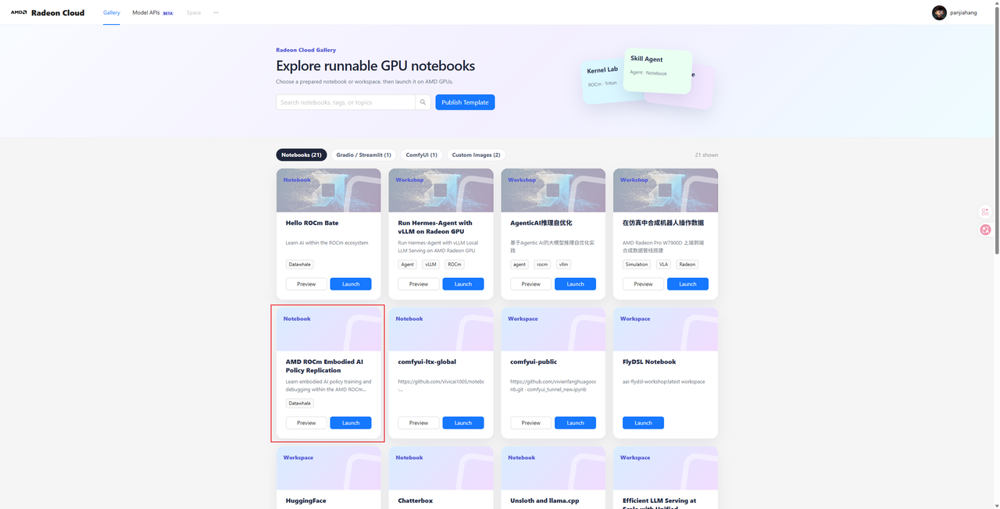
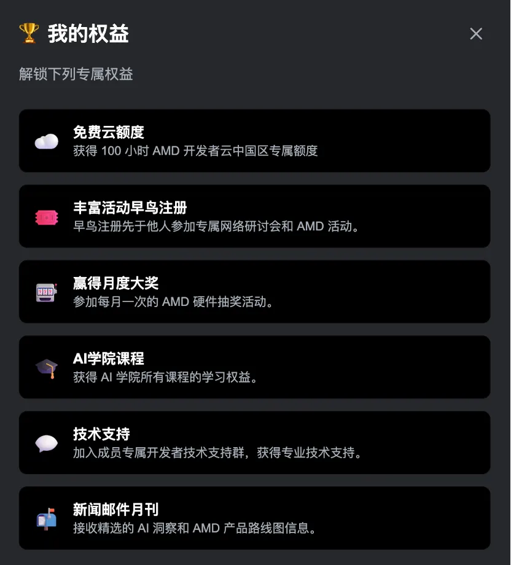
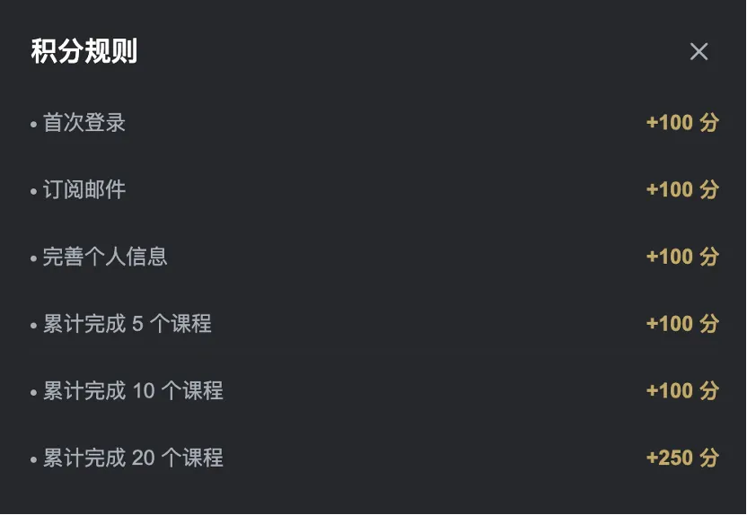
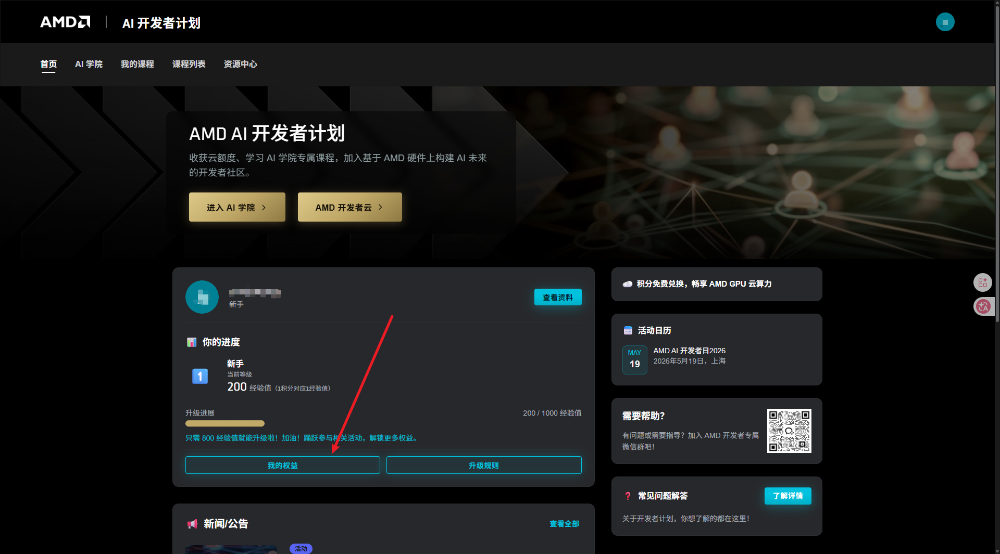
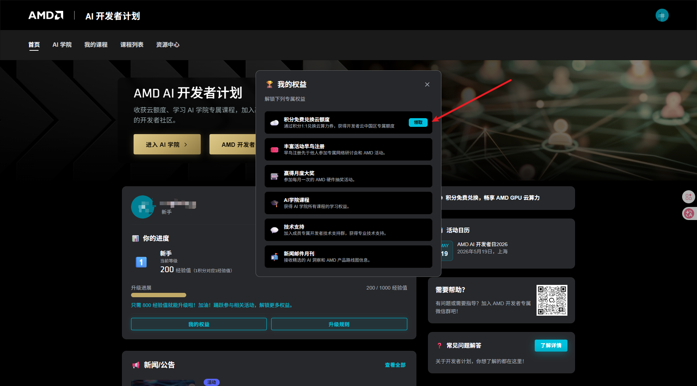
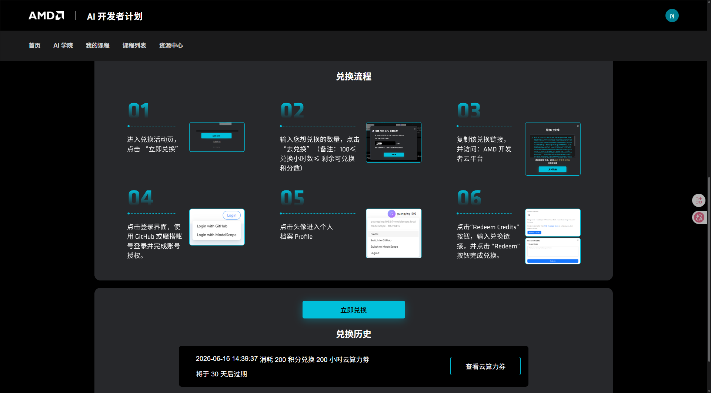

# AMD ROCm Cloud Platform Usage Guide (Prioritizing AUP Learning Cloud)

> Recommended order: Prioritize using AUP Learning Cloud to complete the code development, model preparation, training, and Notebook experiments for this topic; AMD Radeon Cloud serves as a backup option for quick verification of ROCm, PyTorch, and ready-made templates. The specific quotas, images, hardware, and licensing methods shall be based on the current page of the platform and administrator notifications.

The developer cloud section is referenced and organized from [hello-rocm's AMD Radeon Cloud usage documentation ](https://github.com/datawhalechina/hello-rocm/blob/master/docs/zh/cloud/amd-radeon-cloud.md). The images have been downloaded to this special topic repository and changed to a unified local relative path. Instructions for logging in to AUP Learning Cloud, Notebook, Code Server, and persistent directories are also organized on this page.

## 1. How to choose between the two platforms

| Item | AUP Learning Cloud (ALC, recommended) | AMD Radeon Cloud (developer cloud, fallback) |
|---|---|---|
| Entry | [tpe.aupcloud.io](https://tpe.aupcloud.io), log in using GitHub authorization | [AMD AI Developer Program Chinese site](https://developer.amd.com.cn/login?source=91kadjjnI) |
| Hardware recorded in this topic | AMD Ryzen AI MAX+ 395, approximately 64 GB unified memory | AMD Radeon PRO 7900D, approximately 48 GB graphics memory |
| Work area | JupyterHub or Code Server GPU Environment | Notebook / Workspace in Radeon Cloud Gallery |
| Model and data preparation | Use Hugging Face, GitHub, and local persistent directories via Notebook | Prepare models and data according to the current template and platform methods; prioritize ModelScope when external access is restricted. |
| Suitable tasks | Formal training in this topic, Notebook debugging, closed loop evaluation, and long task continuation | Directly start existing AMD ROCm templates for quick verification |
| Pre-use checks | GitHub authorization, GPU image, persistent directory, and quota | Quota, work area template, and ModelScope login status |

**Code, data format, and evaluation criteria on both sides can be consistent.** What really needs to be adjusted across platforms are hardware detection, model download methods, cache directories, and available GPU/unified memory capacity. Do not copy two sets of training scripts due to different platforms.

During the current course communication, AUP Learning Cloud is in the beta/testing or learning support phase. The initial quota is typically around 10 hours. Excellent learners can apply for an increase after being summarized by the course organizer. There are also arrangements for free usage during specific events. This number and the method of additional allocation are not permanent commitments; the actual usable time depends on the login page and the administrator's current notifications. It is recommended to complete the main process of this topic on AUP first, and then use the developer cloud for quick verification as needed.

No matter which platform is used, first complete a zero-training preview with the built-in success video, and then start the formal training. In this way, even if the current quota is limited, you can understand the task, output format, and strict success criteria beforehand.

This topic follows the following principles uniformly:

- Code and Notebook are stored in a repository or persistent directory;
- Dataset, model weights, and Hugging Face / ModelScope caches are kept in a well-defined persistent directory;
- If model download fails, first check the network and cache status, and do not directly modify the training code;
- After training is completed, it must be reviewed using the same MuJoCo strict rollout and physical success metrics.

## II. AUP Learning Cloud (Recommended Entry)

AUP Learning Cloud is the preferred practice entry for this topic. It is suitable for directly opening Notebooks, using the Code Server, preparing public models and data, and completing training and closed loop evaluation in the persistent directory. It is recommended to follow the following order for the first time:

1. Open [AUP Learning Cloud](https://tpe.aupcloud.io), and log in using GitHub authorization;
2. Select GPU Environment, and ensure that the course directory, project directory, and persistent storage are available;
3. Clone the repository for this topic, and verify ROCm, PyTorch, and GPU in the environment check cell of the notebook;
4. Prioritize running the zero-training success preview, then proceed with smoke, formal training, and video evaluation;
5. Save the source code, data, model weights, checkpoints, and results to the persistent directory, and keep the verification information.

For details on the complete login, JupyterHub, Code Server, persistent directory, and exit methods of AUP, please refer to the detailed sections below. Learners do not need to apply for a local account first; they can access it directly with GitHub authorization.

## III. AMD Developer Cloud (Radeon Cloud, alternate entry)

AMD Radeon Cloud is a browser cloud computing entry provided by the AMD AI Developer Program Chinese site. It is suitable for starting a ready-made template first to verify whether ROCm, PyTorch, Notebook, and the code in this topic can run.



Figure: Example of the `AMD ROCm Embodied AI Policy Replication` workspace in Radeon Cloud Gallery. The platform page, template name, and available hardware will be updated according to the current Gallery.

### 1. Log in and create a workspace

Open the [ AMD Developer Cloud login entry ](https://developer.amd.com.cn/login?source=91kadjjnI). The Chinese site usually offers login methods such as WeChat, Magicdu account, and phone number/email verification codes.




After logging in, start the workspace in the order of "Enter Radeon Cloud → Select Notebook/Workspace → Select AMD GPU → Launch". You can first search for `ROCm` or `Embodied AI`{} in the Gallery, and choose the workspace corresponding to the topic name first.


### 2. Model download methods for Developer Cloud

Developers should prioritize using ModelScope in the Developer Cloud to prepare models and data. The example command is as follows. Replace the specific model names and save directories according to the task:

```bash
pip install modelscope
modelscope download --model <model-id> --local_dir <model-dir>
```

After downloading, first check if the file is complete, and then point the model path in the training script to the local directory. Do not repeatedly download large files to the temporary workspace; if the platform provides a persistent Workspace, place the cache directory in the persistent location.

### 3. Login and Workspace Reference Diagram for Developer Cloud


During the event, there may be free computing power, points redemption, and Magicduo-related tasks. The quotas, redemption rules, and validity period will change. The tutorial only provides the manipulation ideas; do not treat the event quotas as permanent settings.

### Developer Cloud quota and MagicOS integration

If the platform account has points or activity credits, you can complete the exchange on the developer cloud page. The image below retains the manipulation order from the upstream platform tutorial, and the image path has been standardized to `assets/amd_radeon_cloud/` for this topic:




The redemption process is usually as follows: Generate the redemption link on the AMD Developer Program page, enter the Profile of Radeon Cloud, open Redeem Credits, paste the redemption link into the Coupon Link, and submit it. The redemption ratio, minimum redemption threshold, and validity period shall be subject to the current platform rules.







### The runtime entry for this topic on the developer cloud

After entering the workspace, directly open the [ AMD ROCm policy replication topic ](README.md) of this special topic. It is recommended to start from the following order:

1. Confirm the [ device and environment with ](01-amd-rocm-device-and-environment-confirmation.md);
2. Open [ MuJoCo closed-loop Notebook ](../../../16-专题组队学习/04-AMD-ROCm策略复刻专题/notebooks/11_mujoco_closed_loop_deploy.ipynb), and run a zero-training preview to ensure success;
3. [ end-to-end collection, training, and MuJoCo deployment ](07-rocm-end-to-end-collection-training-and-deployment.md);
4. Corresponding ACT, SmolVLA, or Pi0.5 Notebooks;
5. [ physical success evaluation and video review ](02-physical-success-evaluation-and-video-review.md).

No introductory courses unrelated to this topic will be redirected here; the purpose of Developer Cloud in this topic is to run ROCm embodied policy emulation code.

## IV. Detailed Instructions for AUP Learning Cloud

### Model and data preparation for AUP

In this topic, prioritize using Hugging Face, GitHub, and local persistent directories for model preparation, data, and source code on AUP. It is recommended to perform the operations in the following order:

1. Access the AUP via GitHub authorization, and open the terminal or notebook in the GPU Environment;
2. Use the official Hugging Face repository or GitHub repository to prepare models, data, and code, and point the cache directory to persistent storage;
3. When preparing files across devices, use a shared directory, SFTP, or browser upload to the persistent directory of AUP;
4. In the notebook/training script, point the model path and data path to the persistent directory;
5. Before starting training, check the file size, checksum, number of weight files, and disk space.

Do not write the Hugging Face token into public Notebooks, Markdown, screenshots, or logs. The persistent directory of the AUP only stores source code, data, models, and experimental results. Do not store a single copy in the directory that is reset after the temporary workspace ends.

Welcome to the **AUP Learning Cloud remote JupyterHub / Code Server development environment** provided by this course/lab!
This guide will help you get started quickly, from **your first login** to **daily development usage**, for remote programming and learning.

## 🌐 What is JupyterHub / Code Server?

|||
|---|---|
|**JupyterHub** is a browser-based remote development platform. You can:  <br>\- ✅ Write code directly through the browser (no need for local configuration)  <br>\- ✅ Conduct experiments and learning using Python / Jupyter Notebook  <br>\- ✅ Store code and files on the server, so there is no risk of a computer being reinstalled  <br>\- ✅ Continue learning on different computers at any time  <br>📌 **All you need is:**  <br>\- A computer with internet access  <br>\- A modern browser (Chrome / Edge / Firefox recommended) |**Code Server (VSCode Server)** is a **complete VSCode editor** running in the browser. You can think of it as:  <br>\> 🖥️ “Opening a VSCode instance in the browser that is exactly the same as on your local machine”  <br> Through Code Server, you can:  <br>\- ✅ Enjoy a full VSCode editing experience (syntax highlighting, auto-completion, debugging)  <br>\- ✅ Run programs, scripts, and training tasks in the terminal  <br>\- ✅ Install VSCode plugins (Python, Jupyter, GitLens, etc.)  <br>\- ✅ Use port forwarding to preview web applications  <br>\- ✅ Suitable for users who need IDE-level development experience|

---

## 🔐 AUP Learning Cloud Login Instructions

### 1️⃣ Use GitHub authorization for login

AUP Learning Cloud now uses the GitHub account for authorization directly, without the need for additional registration or application.

1. Open in the browser address bar: https://tpe\.aupcloud\.io

2. Click the **Use GitHub Login** button

3. Complete the GitHub authorization as prompted on the page.

4. After authorization is completed, the browser will automatically return to JupyterHub.


> For the first use, you can directly access the platform through GitHub authorization, without needing to fill out a form or wait for the admin to enable it in advance.

### 2️⃣ Interface after successful login

#### JupyterHub


Available Resource Directory

- **Course**: Course materials

    - Computer Vision Course

    - Computer Vision Course \(ROCm 7\.13\.0\)

    - Deep Learning Course

    - Deep Learning Course \(ROCm 7\.13\.0\)

    - HIP Programming Course

    - Genesis Physical Simulation Course

    - Genesis Physical Simulation Course \(ROCm 7\.13\.0\)

- **Development**: Development environment

    - Code Server CPU Environment

    - Code Server GPU Environment

- **Test**: Testing environment

    - HIP and ROCm Notebook Test

- **Tutorial**: Tutorial content

    - Introduction to HIP

- **Custom Repo**: Custom repository that provides base images

    - Basic Python Environment

    - Basic GPU Environment

> Note: Choose an appropriate image time. When the timer ends, the link will be closed, and content not placed in the user storage directory `/home/jovyan` will be reset.
>
>

## 🧑‍💻 Basic Usage Instructions for AUP

### ✨ 1. Create a new Notebook

1. Select **Python 3**

2. The browser will open a new Notebook page.

🎉 Congratulations! You can now start writing code!

### ▶️ 2\. Run the code

- Enter the code in the code cell.

- Run the current unit by pressing **Shift \+ Enter**

- The running results will be displayed below

Example:

```python
print("Hello, JupyterHub!")
```

### 💾 3. Save your work

- JupyterHub **will be automatically saved**

- It can also be saved manually:

    - `Ctrl + S`（Windows）

    - `Cmd + S`（Mac）

- Note that the default working directory for each image is `/ryzers/notebooks` The user has a 20G disk directory for use, which is `/home/jovyan` If you need to save the work content, migrate it to the image before its end. `/home/jovyan`

⚠️ Default working directory: `/ryzers/notebooks`

⚠️ User archive directory: `/home/jovyan`

```bash
# 切换bash
bash
cp <需要保存的文件> /home/jovyan
```

## 💻 AUP Code Server (VSCode Server) Usage Instructions

### 🚀 1. Start the Code Server environment

1. After logging in, select **Code Server CPU Environment** or **Code Server GPU Environment** on the startup page.

2. Select the desired hardware configuration (e.g., AMD Radeon™ 8060S GPU)


1. Set the runtime duration, then click **Launch Server**

2. After waiting a few seconds, the browser will automatically open the VSCode interface.


### 🖥️ 2\. Interface Introduction

The interface of Code Server is **exactly the same** as that of the local VSCode:

- **Left side**: File Explorer, Search, Source Control, Debugging, Extensions

- **Middle**: Code editing area

- **Below**: Integrated Terminal, Port Panel, Output Panel

### 📡 3. Port Forwarding

When you run a web service in the Code Server (such as Node\.js, Flask, Streamlit, etc.), the system will **automatically detect and forward ports**.

#### Usage:

1. Start the service in the terminal, for example:

```bash
node test.js
# 输出: Running on port: 3000
```

1. A notification will appear in the lower right corner indicating that the port has been forwarded. Click **"Open in Browser"** to access it in a new tab.


1. You can also view all forwarded ports in the **PORTS** panel at the bottom.


#### Forwarding address format:

```
https://tpe.aupcloud.io/user/<your-username>/proxy/<port>/
```

For example: `https://``tpe.aupcloud.io``/user/github%3Ausername/proxy/3000/`


#### Notes:

- Port forwarding is **automatic**, without the need for manual configuration

- Support any service that listens on ports on the server (HTTP/WebSocket)

- The forwarding address can be shared with others for access (under the same network authorization)

- If the port is not detected automatically, you can add it manually in the PORTS panel.

> 📸 **Location requiring a screenshot**: It is recommended to add a screenshot of the port forwarding window notification here.
>
>

### 🧩 4. Usage of Extensions

The Code Server supports installing VSCode plugins to enhance the development experience.

#### Pre-installed plugins:

|Plugin|Purpose|
|---|---|
|Python|Python language support, IntelliSense, debugging|
|Jupyter|Run Jupyter Notebook in VSCode|
|GitLens|Git enhancement (view blame, history, comparison)|
|Python Debugger|Python breakpoint debugging|
|Ruff|Python code formatting and linting|
|YAML|YAML file syntax support|

#### Install new plugin:

1. Click the **expand icon** (square block shape) on the left side.

2. Enter the plugin name in the search box

3. Click **Install** to install.


#### Recommended plugins to install:

- **C/C\+\+** — C/C\+\+ development support (in conjunction with HIP development)

- **ROCm HIP** — AMD GPU programming support

- **Remote \- Containers** — Container development support

- **Thunder Client** — A lightweight API testing tool

- **Markdown Preview** — Real-time Markdown preview

#### Notes:

- The plugin is installed on the server side; **it needs to be reinstalled after a mirror restart**

- It is recommended to record the list of commonly used plugins, so as to install them quickly next time.

- Some plugins may fail to install due to network issues. Try refreshing the page and try again.

### 🔧 5. Terminal Usage

The integrated terminal can be used directly in the Code Server:

- Shortcut key `Ctrl + `` to turn on/off the terminal

- Support for multiple terminal windows (click the + icon to create new ones)

- The default shell is bash

Common manipulation examples:

```bash
# 查看 GPU 状态
rocm-smi

# 安装 Python 包
pip install torch torchvision

# 运行训练脚本
python train.py

# 启动 Web 服务（会自动端口转发）
python -m http.server 8080
```

## 🚪 Correct way to exit AUP (very important)

After use, please **exit properly**:

1. Close the Notebook page

⚠️ Do not consume server resources for a long time!


---

## ❓ AUP Frequently Asked Questions (FAQ)

### Q1: What should I do if the page cannot be opened or loads slowly? 🐢

- Check if the network is functioning properly

- Try changing the browser (Chrome / Edge is recommended).

- Refresh the page or log in again

---

### Q2: If an image is already enabled, and I want to switch to another image but cannot start it?

1. Please on the selection interface, click "Stop my server" to shut down the current image.


---

### Q3: There is an error in the code. Is it a problem with the platform? 😵

**Mostly not!**

Please check first:

- Are there any spelling errors?

- Whether there are missing parentheses or colons

- Whether all units were run in order


---

### Q4: Does port forwarding in the Code Server not work?

- Confirm that the service is indeed listening on that port (`Running on port: XXXX` can be seen in the terminal)

- Check if there are any corresponding port records in the PORTS panel.

- Try to manually add ports in the PORTS panel

- If it still doesn't work, refresh the browser page.

---

### Q5: Failed to install plugins in Code Server?

- Check if the network connection is normal.

- Try refreshing the page and reinstalling.

- Some plugins may not be compatible with the Code Server (web version). Try searching for alternative plugins.

---

## 📌 Small Tips for AUP Usage

- ⭐ Save the code frequently

- ⭐ Clear file naming (do not use `test123.ipynb`)

- ⭐ Do not write "all content" in one notebook.

- ⭐ If you encounter problems, ask questions promptly; don't hold it back.

- ⭐ Remember to save important files in the `/home/jovyan` directory

- ⭐ Code Server user suggestions should include a list of commonly used plugins for easy reinstallation.
