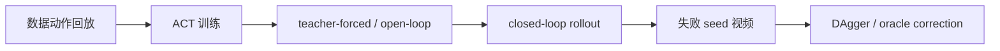

# 03 ACT Migration and DAgger Diagnosis on ROCm

This task focuses on ACT. The reduction in loss on the training set does not equate to successful closed loop deployment. Especially when replicating on ROCm devices, it is necessary to first prove that failures are not caused by the environment, data, memory, or success criteria before discussing the model structure and data policy.

Supporting practical notebook: [03_act_dagger_diagnostics.ipynb](../../../16-专题组队学习/04-AMD-ROCm策略复刻专题/notebooks/03_act_dagger_diagnostics.ipynb).

## First, look at the conclusion

When learning, remember the following three points first; there is no need to distinguish many evaluation groups:

| Model | Current Review Results | Learning Focus |
| --- | --- | --- |
| SmolVLA | `57/60` (red cup `27/30`, blue cup `30/30`) | Main case: First, watch the successful playback, then learn training and evaluation |
| Pi0 | `12/14`; Unseen positions: `9/10`, hard group: `6/8` | Advanced case: Learn large model permissions, action alignment, and failure diagnosis |
| ACT | Current protection candidate: `15/30`; Historical tutorial reference: `17/30` | Diagnosis case: Learn closed loop distribution deviation, Dagger, and strict success判定 |

The `15/30` here is the reproduction result of the protection candidate that has been completed on AMD395; the same native training recipe has been written into the Notebook, but it still needs to be actually executed from scratch in an environment with a Jupyter kernel to be considered a “Notebook-native reproduction”. Therefore, the tutorial will present both the executable recipe and the audit results separately, without mixing them up.

## ACT Diagnosis Route

It is recommended to check according to the following order:



The questions asked in each step are different:

| Step | Question Answered |
| --- | --- |
| Data Action Reproduction | Whether collecting data alone can complete the task |
| ACT Training | Whether the model can learn offline action distributions |
| Open-Loop | Whether the model can reproduce a trajectory based on the data state |
| Closed-Loop | Whether the policy remains stable when running independently |
| Failure Video | Where the failure occurs: approaching, grasping, moving, or releasing |
| DAgger | How to restore the state after a closed loop deviation |

## Common ACT Failure Types

| Failure Type | Phenomenon | Possible Causes |
| --- | --- | --- |
| No contact with cup | Gripper remains near the cup | Insufficient image conditions, initial pose OOD, closed loop offset |
| Can lift but fails to release | Cup suspended on plate or moved away | Gripper tag, too short tail section release |
| Placed at edge of plate but cup spills | Position close but pose fails | Insufficient end-stage teaching, unstable placement height |
| Open-loop succeeds, closed-loop fails | Works in data state, fails on its own | Closed loop distribution offset |

## How to collect DAgger data

A suitable DAgger process for teaching:

1. Reset the reset-start baseline for training;
2. Fix a set of seeds for a closed loop rollout;
3. Identify the failed seeds;
4. Run the current policy for several steps ahead, such as 40 control ticks;
5. Switch to the oracle or scripted policy from the near-failure state;
6. Save the correction suffix;
7. Record the source, timestamp offset, and sampling weight when merging data;
8. Retrain and evaluate with the same set of seeds.

Note: The amount of correction data is not necessarily more is better. Directly mixing the high-weight data of full-reset failure-bucket into the main training may disrupt the already learned reset-start behavior.

## What Did the Current ACT Change?

The old tutorial summary recorded `17/30`. The current repair15 protection candidate has reached `15/30` under the same strict protocol, but the historical 17/30 has not been fully restored yet. W7900 normal ACT is `0/30`, AMD395 stable61 fallback is `7/30`, and the old protected DAgger artifact is `2/30`. The original closed-loop baseline for ACT can hardly be determined by strict physical success, and subsequent diagnostics still come from a series of revisable changes.

The first step is to tighten the evaluation criteria. The old `success` only focused on environmental geometric conditions, which might misclassify pushing, squeezing, or pouring as successful actions. This special report follows a unified standard `physical_success`: the cup must be lifted and moved onto the plate, and in the final state, it should be basically upright. Without this step, subsequent training adjustments can easily be misled by the old metrics.

The second step is to separate failures into open-loop and closed-loop scenarios. We generate ACT actions using the dataset observation, and then place these actions back into MuJoCo in an open-loop manner. This diagnosis helps distinguish two issues: whether the model has learned the actions based on the data state, and whether failures occur due to state drift during the closed loop execution of the policy. The results show that under single demo or clean data conditions, ACT sometimes has near-usable arm trajectory, but the gripper release is very short, and the closed loop distribution deviation is also significant. Therefore, solving the problem cannot rely solely on adjusting the gripper or continuing training.

The third step is to redo the reset-aligned data. In the old data, many episodes do not start from the evaluation reset pose. During training, the loss appears normal, but the closed-loop does not touch the cup when starting from the reset position. The subsequent main pipeline will be changed to a reset-aligned scripted oracle: each trajectory starts from the reset state used during evaluation, ensuring that the data can be played back successfully according to the same physical standard.

Step 4 is to adjust the ACT training configuration. In the final main line, use no-VAE, `chunk_size=20`, `n_action_steps=10`, timestamp state, `obj_init` state, gripper BCE `0.5`, and per-episode early weight. Each item here corresponds to a failure phenomenon:

| Changes | Problems Solved |
| --- | --- |
| no-VAE | Reduces sampling randomness with small data, making replication more stable |
| timestamp state | Provides explicit time phase to the model, avoiding all stages from being averaged together |
| `obj_init` state | Ensures the model knows the initial geometric relationship between cups and plates in this round |
| gripper BCE `0.5` | Strengthens the opening-closing claw timing without excessively sacrificing the arm trajectory |
| per-episode early weight | Protects the early segment before reset-start of each episode, preventing correction data from overwriting the initial behavior |
| `n_action_steps=10` | Preserves the coherence of chunks while reducing closed loop drift caused by overly long execution times |

Step five is prefix40 DAgger. Have the current ACT run 40 control ticks first, then switch to the scripted oracle to take over and save the suffix. In this way, what is collected is the "state after the policy deviates", which is closer to the closed-loop failure distribution than using only a perfect reset-start teaching.

The sixth step is to add a timestamp offset for the correction episode. Prefix40 suffix is not the complete task starting from reset; if its timestamp also starts from 0, the model will mistake the "midway correction action" for the "task start action". Therefore, `timestamp offset = 2.0` is used for correction episodes to separate the time phase from the reset-start episode.

Step 7 is to weight down the correction data. We have tried different weights:

| Correction sampling weight | Strict result | Conclusion |
| --- | --- | --- |
| `0.1` | 1/15 | The correction data is too weak; the release/landing capability cannot compensate |
| `0.5` | 0/15 | The correction data is too strong; it disrupts the reset-start main distribution |
| `0.25` | 13/30 | The best compromise at that time |

Finally, use the best025 checkpoint to perform another round of prefix40 DAgger v1 on the failed seed, obtaining 3 valid correction trajectories. Then continue training by merging using timestamp offset `2.0` and sample weight `0.25`, resulting in the old protected DAgger checkpoint. Its current exact review is `2/30`. Subsequently, starting from the stable61 fallback protection weight, use the same correction data to perform a 2500-step continuation with low learning rate and no memory leakage, yielding the current repair15 protection candidate:

```text
ckpt/act_scripted_reset_oracle_plus_prefix40_dagger_best025_toffset2_downweight025_chunk20_n10_novae_gpu_5000_20260629_031208/step_5000
```

```text
AMD395 protected/act_stable61_to_dagger_nomemleak_step1500_strict15of30
physical_success = 15/30
fixed_seed_groups = 3 组，每组 10 条
model_sha256 = b9b178377995a674a06bc5d1500c8e7e7fc5d02649268855f892b3987bf5bfeb4
```

The currently auditable branches are: stable61/step2500 fallback on AMD395 is `7/30`; the old protected DAgger artifact is `2/30`; and the new repair15 protected candidate is `15/30`. `17/30` in the historical summary has not been fully restored by the current protection weight, so it is temporarily listed as a historical target. Note that there are `17/40` successful expert recovery collections in the logs; the number of successful data collection cannot be used as the policy closed loop success rate.

The Notebook口径 must be specified separately: previously, the protection weight of `15/30` came from the low-learning-rate continuation wrapper of AMD395, not the result of the Notebook execution. `notebooks/16_act_end_to_end.ipynb` now includes the same native protected recipe (data packaging, trajectory weighted sampling, no-VAE, gripper BCE, tqdm, checkpoint, and strict evaluation), but before a native execution is completed in Jupyter runtime, `15/30` is not marked as a Notebook reproduction result.

## What to Record on ROCm

ACT training usually does not require a high memory usage, but it is still necessary to record:

- batch size;
- chunk size;
- `n_action_steps`;
- whether no-VAE;
- whether there is gripper-assisted loss;
- training temperature;
- VRAM usage;
- whether kernel crash / OOM occurs.

If training fails, first use the device logs to determine whether it is a hardware or ROCm issue. If training is stable but the policy fails, prioritize returning to data and closed loop diagnosis.

## Example of the Recreation Result for This Round

In this round of ACT replication, the simple clean closed loop baseline hardly meets the strict physical success criteria. After adding timestamp offset, downweight correction, and DAgger data, the stable fallback branch becomes `7/30`, while the old protected DAgger artifact is `2/30`; the new repair15 continuation has reached `15/30`. This indicates that ACT has established a complete ROCm closed loop diagnosis case, but it still lags behind the old tutorial `17/30` by 2 items and has not fully aligned yet.


Figure 1: Variation of the physical success rate of the ACT closed loop in diagnostic steps. The improvement here comes from data and closed loop state correction, not simply by extending training time.

| Phase | Physical Success | Explanation |
| --- | --- | --- |
| Clean Closed Loop | 0/10 | The model cannot achieve stable contact and handle the cup in a closed loop state |
| Timestamp Offset | 3/15 | Action alignment improved part of the trajectory, but it remains unstable |
| Downweight DAgger | 13/30 | Correction data begins to capture states near failures |
| Stable61 Fallback | 7/30 | Old baseline |
| Protected DAgger Artifact | 2/30 | Exact result of the old protected directory |
| Repair15 Protected Candidate | 15/30 | Current best; ten samples per group of three fixed seeds, group results are `3/10 + 4/10 + 8/10` |
| Old Tutorial Best DAgger Summary | 17/30 (to be reviewed) | The current original seed-by-seed file has not been restored, so it cannot serve as the current score |


Figure 2: Physical success rollout in the ACT history DAgger record. It illustrates the grasping, handling, and release stages; the auditable result for the current best repair15 candidate is `15/30`, while the old protected artifact remains `2/30`.


Figure 3: Typical failure scenario of ACT best DAgger. Even if the environmental geometry occasionally approaches success, continue to check the lift height and final posture.

## Checkpoint

After completing this task, organize these items:

| Item | Content |
| --- | --- |
| ACT checkpoint | Represented by a variable for the path |
| Open-loop success rate | Training set or fixed seed |
| Closed-loop success rate | Using `physical_success` |
| DAgger data description | Prefix length, oracle type, sampling weights |
| Typical failure videos | At least 1 |
| Next judgment | Continue DAgger / Repair gripper / Re-teach / Adjust chunk |
