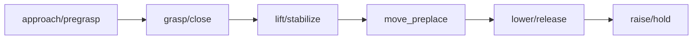
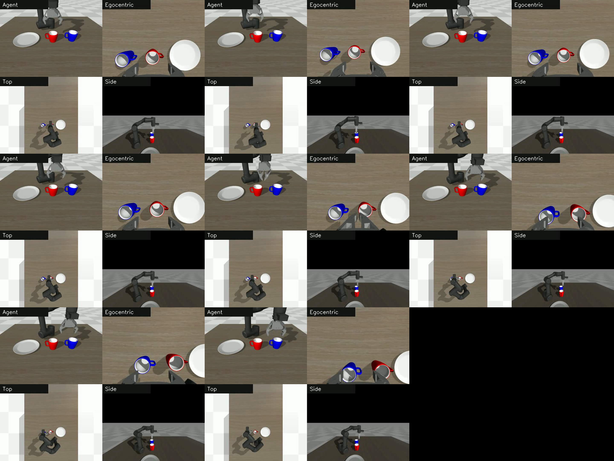
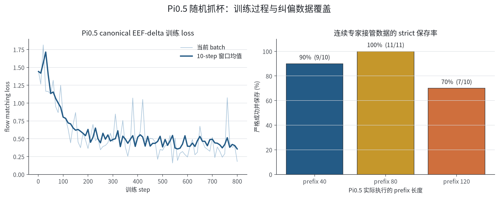
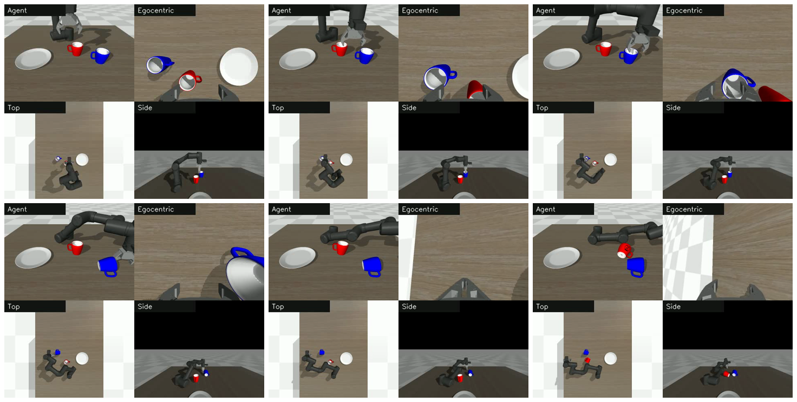

# 05 pi_0 Permissions Smoke and Training Gatekeeping

This task focuses on pi_0. The challenges in replicating pi_0 include not only the training process itself, but also gated model permissions, model weight downloading, cache management, and large model initialization. First, complete the smoke test, and then decide whether to start the long training.

Supporting practical notebook: [05_pi0_smoke_gate.ipynb](../../../16-专题组队学习/04-AMD-ROCm策略复刻专题/notebooks/05_pi0_smoke_gate.ipynb).

## Important Correction: The old 30 evaluation items are not location generalization

During the review of `mujoco_env/y_env2.py`, it was found that the old code was written as `if seed != None: np.random.seed(seed=0)`. Although the evaluation passed in `1010-1039` and indeed changed the action sampling randomness of Pi0, the initial positions of cups and plates always came from environment seed 0. The `30/30` in the old scaffold can still prove that "different policy samples can be stable under the same scenario", but it cannot prove position generalization.

The code has been changed to `if seed is not None: np.random.seed(seed=seed)`. After fixing the issue, using the actual changed environment seed `41-44` as the strict-input visual/history head gate resulted in only `1/4`; fixing the environment seed to 0 and using the same 12 policy sampling seeds for comparison are raw pi0 `0/12` and pi0 + learned head `6/12`. Therefore, the current conclusion is: self-collected complete task data and learned head significantly improve the fixed scenario, but in the next round, multi-position data must be collected again, and the old `30/30` cannot be used as the success rate of spatial generalization.

## First, check Hugging Face permissions

pi_0 depends on PaliGemma. Confirm first:

1. The Hugging Face account has accepted the gated terms of `google/paligemma-3b-pt-224`;
2. The token has read access to the public gated repository;
3. The remote machine can access Hugging Face;
4. The token is not present in the command line, Notebook output, or logs.

Recommended script format:

```bash
HF_TOKEN_STDIN=1 REQUIRE_PROXY=1 ./install_hf_token_for_pi0.sh
```

This script should read the token from hidden input or stdin, first verify `whoami`, PaliGemma, and `lerobot/pi0`, and save the token only after all are passed.

## 1-step smoke test

After the permission is approved, run 1-step smoke first:

```bash
RUN_SMOKE=1 RUN_FULL_TRAIN=0 ./run_pi0_train_eval_after_hf_ready.sh
```

This smoke test proves:

- Gated model permissions are available;
- Dataset can be loaded;
- pi_0 policy can be constructed;
- At least one forward/backward/optimizer step can run successfully;
- Checkpoint saving process is normal.

It does not prove that the policy has converged, nor does it indicate the final success rate.

## Formal Training Gate Control

Formal training will be started only after the smoke test passes:

```bash
RUN_SMOKE=1 RUN_FULL_TRAIN=1 PI0_STEPS=20000 PI0_BATCH_SIZE=4 ./run_pi0_train_eval_after_hf_ready.sh
```

It is recommended to confirm before formal training:

| Check Item | Status |
| --- | --- |
| PaliGemma Permissions | Passed |
| `lerobot/pi0` Permissions | Passed |
| 1-step Smoke | Passed |
| GPU Temperature | Acceptable |
| VRAM / Memory | Sufficient |
| Checkpoint Directory | Enough Space |
| Proxy or Network | Stable |

## Training Gate Control After Public Baseline Reconstruction

If the local checkpoint or temporary data root is lost, do not rush to continue experiments from the incomplete directory. First, return to the public teaching dataset and rebuild a clean pi_0 baseline:

```bash
git clone https://huggingface.co/datasets/Datawhale/datawhale_eai_pnp_language demo_data_language
```

This public dataset corresponds to `pi0_omy.yaml` / `smolvla_omy.yaml` in this tutorial. It contains 20 episode clips of grabbing cups and placing dishes, with 2621 frames. `observation.state` has 6 dimensions, and `action` has 7 dimensions. After reconstruction, it passes through the gatekeeper in the following order:

| Checkpoint | What should be observed | Explanation |
| --- | --- | --- |
| `steps=0` policy initialization | Ability to create pi_0 policy and load weights | Demonstrates that gated permissions, caching, and policy config are functional |
| 1-step expert-only | Ability to complete one forward/backward/optimizer step | Demonstrates that data, model, and GPU backward mechanism are functional |
| 20-step checkpoint | Ability to generate `pretrained_model` and reload it onto GPU | Demonstrates that checkpoint saving and safetensors loading mechanisms are functional |
| 500-step checkpoint | Significant reduction in loss, e.g., from around 5 to below 0.2 | Demonstrates healthy training, but does not indicate task success |
| Red/blue small panel evaluation | Running a few seeds for fixed red/blue commands | Using `physical_success` to determine whether the policy actually performs the task |

In the sample experiment, the loss of the public data 500-step expert-only checkpoint dropped from approximately `5.28` to `0.179`, indicating that the training process has been restored. However, the closed-loop strict evaluation for red seeds `0-2` and blue seeds `0-2` is all `0/3 physical_success`, and the old geometric success is also `0/3`. In terms of video behavior, the model can touch, push cups, and occasionally lift them, but it may also pour the cup, fail to lift sufficiently, or even send the cup flying.

After continuing from the 500-step checkpoint resume to 1500 steps, the final loss is approximately `0.046`. Both the intermediate and final checkpoints are saved properly, indicating that the resume, scheduler, optimizer state, and checkpoint write paths have been restored. However, for the same red/blue seeds `0-2`, the closed-loop strict small panel remains red `0/3` and blue `0/3`, and the success rate of the old geometry is also 0. The failure pattern at 1500 steps is more like no-lift: the cup is hardly lifted steadily, or there is only a very small disturbance.

The meaning of this set of results is clear: the 500-step and 1500-step checkpoint are both healthy baselines for training, not successful models. The decrease in loss does not automatically imply a successful closed-loop system; further efforts should focus on teacher-forced/open-loop error diagnosis, action representation inspection, and stage-based data design, rather than blindly increasing the BC steps or adjusting post-processing around a failed rollout.

## Post-training Physical Success Diagnosis

In the example experiments of this topic, pi_0 has completed permissions, downloading, policy construction, training, and open-loop replay diagnosis. The most important conclusion is not that "pi_0 has succeeded," but rather that the raw policy and the diagnostic hybrid scheme should be reported separately.

We first conducted a rigorous `physical_success` evaluation on a renumbered 2 blue 2 red dataset. This small dataset is used to reduce color bias, and we specifically observed whether pi_0 learned to grasp, transport, and release at the end. Subsequently, the same raw policy was applied to 20 episodes of the full `demo_data_language` to perform teacher-forced open-loop replay, in order to obtain more representative action prediction results.

| Scheme | Strict physical success | How to interpret |
| --- | --- | --- |
| pi_0 raw policy, small-set reference run | 0/4 | The raw policy can already bring the cup close to the plate, but the final state release / raise / stabilize is unstable |
| pi_0 raw policy, small-set batch rerun | 1/4 | Some boundary samples briefly or occasionally cross the threshold, indicating that the success rate with small samples is unstable; this cannot be used to report successful replication |
| pi_0 raw policy, full 20 episode open-loop | 1/20 final, 3/20 ever | More suitable as a representative conclusion for the current raw policy: the model learns some actions, but the physical success of the final state remains low |
| pi_0 raw policy, 20 seed closed-loop strict | 0/20 strict, old geometry 2/20 | Closest to the deployment criteria; the raw policy still does not indicate successful migration |
| pi_0 + scripted finisher, small-set | 4/4 | Use the dataset mean at the tail end as the script ending, and stop immediately after reaching `physical_success`; this is a diagnosis of the tail-end bottleneck, not a raw success |
| pi_0 + template-tail finisher, full 20 episode open-loop | 4/20 final, 4/20 ever | When extended to a full dataset, a fixed finisher can only rescue some samples; early contact, handling, and posture deviation still prevent the tail end from being rescued |


Figure 1: pi_0 raw policy is very close to the target in representing the episode, but the final height and release stability do not exceed the strict success threshold. The script terminator combines the same prefix state with a more stable release/raise/stabilize suffix, indicating that the main bottleneck lies at the end of the task.

The video below shows a comparison between the left and right sides of the same episode. The left side shows raw pi_0, while the right side shows the mixed diagnostic results after adding the script terminator:

<video controls muted preload="metadata" width="100%">
  <source src="../../../16-专题组队学习/04-AMD-ROCm策略复刻专题/assets/pi0_ep2_raw_vs_finisher_side_by_side.mp4" type="video/mp4">
</video>

Figure 2: pi_0 episode2 raw-vs-hybrid comparison video. This video is used to explain the failure mechanism, and it does not indicate that raw pi_0 has achieved 100% success rate.

From this diagnosis, two conclusions can be drawn:

1. The training process for pi_0 can now be executed on AMD ROCm devices, and the model has learned some actions.
2. The raw policy cannot be directly reported as a successful replication. Further optimization should focus on designing data or training objectives for the final release, elevation, and stable placement stages.

The reproduction of all 20 open-loop replays also reveals a crucial detail: successful old geometry and strict physical success are not the same. Among the 20 episodes, only 1 ended in `physical_success`, 3 briefly reached `physical_success`, and 2 showed successful old geometry orientation. In other words, pi_0 is not completely unable to approach the target, but it lacks stability in contact, release, posture stabilization, and final state maintenance. During reproduction, one should consider `final_physical_success`, `physical_success_ever`, the old `success`, and the video, rather than focusing solely on a single boolean value.

After further 20 seed closed loop strict evaluation, the strict physical success rate of raw pi_0 is `0/20`, and the old geometric aperture is `2/20`. This is closer to real deployment than open-loop, indicating that the current failures are not just due to tail-end motion errors in the dataset frame; as the closed loop image, state, and action gradually drift, the front-end contact, grasping stability, and final state retention will also amplify the errors.

Special attention should be paid to the boundaries of small data gripper manipulation tasks here. The pi_0 paper emphasizes large-scale, multi-task, cross-robot data, and carefully designed post-training recipes; it also regards data covering error states such as corrections and recovery behaviors as very important: [π0: A Vision-Language-Action Flow Model for General Robot Control](https://arxiv.org/html/2410.24164v1). However, our cup grasping data is very small; if the episode does not include a stable sequence of actions such as “opening the gripper, raising the hand, waiting for the cup to stabilize, and making corrections if necessary,” the model will not learn this sequence out of thin air.

Additionally, pi_0 uses the action chunking approach, predicting a continuous sequence of actions at a time. Physical Intelligence clearly discusses the chunk boundaries, latency, and execution issues caused by pauses during training in [Real-Time Action Chunking](https://www.pi.website/research/real_time_chunking); [Real-Time Execution of Action Chunking Flow Policies](https://arxiv.org/html/2506.07339v1) also identifies the chunk boundaries and real-time execution as key issues. In this small data collection task, the preceding movements can be averaged by the model, but the last few centimeters of release / raise / stabilize are easily broken by cumulative errors.

Therefore, the script finisher is not a "cheat code for success announcement", but a clean diagnostic tool: if a fixed tail segment is added, failure can be turned into success, indicating that the main gap in the raw policy indeed involves tail action modeling. However, the complete 20-template-tail consists only of `4/20`, which also shows that front contact, stabilization, handling, and posture control are equally important. In the future, either stage-specific data and correction data should be added, or the scripted finisher should be reported separately as a fallback measure in engineering, rather than being confused with the raw pi_0 success rate.

## How to increase the success rate of pi_0

Write down the current hard baseline clearly first:

| Caliber | Current Result | Function |
| --- | --- | --- |
| raw teacher-forced open-loop, full 20 items | `1/20 final`, `3/20 ever` | Determines whether the model predicts actions close to experts in data states |
| raw closed-loop strict, 20 seeds | `0/20` | Closest to the deployment caliber; the current raw policy has not succeeded yet |
| Small set scripted finisher | `4/4` | Proves that the tail segment’s release / raise / stabilize is one of the bottlenecks |
| Full 20-item template-tail finisher | `4/20` | Shows that a fixed tail segment can only rescue some samples; it is not a generalization solution |
| oracle prefix + 10eps finisher handoff scan | prefix `120/180/240/300`, all `0/2` | Even when the prefix is provided by oracle, the current finisher still moves the cup away from the disk; the takeover point is not the main cause |
| oracle prefix180 + phase schedule + `tcp_to_plate` finisher | strict `5/10`, legacy `6/10` | The first path that significantly improves the success rate of the later part of Pi0; it remains a diagnostic scaffold, not a successful raw policy |
| Previous line + phase-scripted gripper | strict `7/10`, legacy `7/10` | Proves that the gripper timing is one of the later-stage bottlenecks; remaining failures focus on red cup handling/landing |
| Policy sampling seeds (environment actually fixed as seed 0) 1010–1039, schedule 0..9 repeated | strict `21/30`, legacy `23/30` | Still effective after expanding the policy sampling samples, but all failures concentrate on short `move_preplace` schedule templates |
| Policy sampling seeds (environment actually fixed as seed 0) 1010–1039, forced long schedule episode 0 | strict `30/30`, legacy `30/30` | Proves that the main bottleneck is the too short handling template; this is the improved scaffold, not the raw pi_0 end-to-end |
| Previous line, replace phase-scripted gripper with phase-only learned head | strict `30/30`, legacy `30/30` | The first scaffold is replaced by a learnable module; oracle prefix and long schedule are still retained |
| Schedule 0..9 normal repetition + adaptive `move_preplace` gate + learned gripper head | strict `30/30`, legacy `30/30` | No longer forcing long episode0; whether to continue handling is determined by live TCP-to-plate progress |
| Schedule 0..9 normal repetition + learned transition head + learned gripper head | strict `30/30`, legacy `30/30` | The second scaffold is further made learnable; 29/30 are actively switched by the transition head, 1/30 use max-step safety fallback |
| Policy prefix + target-relative contact scaffold + pregrasp-geometry/contact transition heads + floor guard | strict `30/30`, legacy `30/30` | The third layer of scaffold: the early part `pregrasp/descend/close` core switch is triggered by the head, but contact scaffold, floor safety guard, and later finisher are still retained |
| Previous line + `dynamic_timed` finisher, stage-aware target/plate state + hard-reset evaluation | strict `30/30`, legacy `30/30` | The fourth layer of scaffold: no longer using `dataset_schedule` tail segment; prefix uses `tcp_to_target`, finisher uses `tcp_to_plate`; after clean hard-reset, mean `xy=0.0219 m`, max `xy=0.0450 m` |

Any subsequent new scheme must be compared with these numbers. It is not enough to only focus on loss, only on the 2 blue and 2 red small sets, or only on a single successful video. At least 20 complete open-loop cases and 20 seed closed-loop strict cases must be reported. If only the small sets are tested, it must be recorded as a diagnosis, not as a success rate.

Also note the directions that have been excluded, to avoid duplicating the burning time:

| Trajectory | Observed results | Conclusion |
| --- | --- | --- |
| Continuing to add BC steps to the same data | Loss decreases, but strict success rate does not improve | It’s not just a matter of “insufficient steps” |
| Tail-frame weighted sampling | Small set geometry improves, but raw data remains unstable; continued weighting will degrade the early part | The tail section is important, but we can’t focus only on the last few frames |
| Only changing gripper threshold, binarization, and open-until | Some teacher-forced samples are saved, but closed loop is unstable | Gripper is one symptom, not the sole cause |
| Direct mixing of suffix-only DAgger | Slight misalignment between state/action leads to severe degradation; even after correction, transportation still fails | DAgger data must be processed based on stages and statistics |
| Direct BC with full-reset scripted oracle | The data itself `20/20` is successful, but pi_0 still has difficulty achieving closed loop and overfitting | We can’t rely solely on automatically generating perfect trajectories |
| Separately modifying phase / EEF / eef_abs | Teacher-forced samples show local success, but closed loop still fails | The direction is valuable, but stage-based and on-policy data are required for cooperation |
| Only focusing on handoff takeover steps | Oracle prefix `120/180/240/300` takes over the current 10eps finisher, which is `0/2`, and most samples can be lifted, but ultimately `xy` tends toward `0.22-0.60 m` | The transportation goal of the current late-stage policy has become skewed; we cannot solve it by changing takeover steps |
| Using a fixed template-tail as the final solution | Full20 only has `4/20` | It can serve as a fallback or diagnostic tool, but cannot be considered successful as raw policy |

After these counterexamples, `tcp_to_plate` is the most valuable positive update so far. It expands the state from 19 dimensions to 22 dimensions:

```text
joint6 + timestamp + phase_index_norm + phase_onehot11 + tcp_to_plate3
```

`tcp_to_plate = tcp_link_xyz - plate_xyz`. The first TCP position in the training data comes from `prefix_end_debug.tcp_pos` in the acquisition summary, and subsequent frames use `eef_abs` as an approximate target recorded from the previous frame. During closed loop evaluation, instead of using approximations, the real `tcp_link` and `body_obj_plate_11` are directly read from MuJoCo. This step addresses the issue of “whether the later-stage policy knows where the plate is located”.

This experiment converts the original 10eps prefix120 suffix dataset into a 22D state, and initializes continued training with a 250-step checkpoint from the old 19D finisher. A common issue arises when loading the old checkpoint: in the old model, `normalize_inputs.buffer_observation_state.mean/std` has a dimension of 19, while the new data has a dimension of 22. Direct loading results in a shape mismatch. The solution is to copy a copy of the checkpoint, remove these two state normalizer buffers, and re-initialize the statistics for the new dataset; the backbone weights remain unchanged from the old model.

1. The training health status is normal: the loss from step 25 to step 250 fluctuates roughly between `0.012-0.019`, with stable memory and temperature, without OOM or kernel crashes. Then, use `oracle prefix180` to bring the cup into a manageable state, and then let the 22D finisher take over from the `move_preplace` stage schedule. The results for 10 seeds are strict `5/10`, legacy `6/10`. The successful seeds are `1000, 1001, 1004, 1005, 1006`; there are two types of failures: one is when the cup is lifted but not moved to the center of the disk, resulting in the final state `xy`, and `0.18-0.59 m`; the other is when `xy` reaches near the disk but the cup falls, indicating that the release / stabilize process is not fully stable yet.

Create another comparison with only the gripper changed, but EEF/arm unchanged: the gripper of finisher does not use Pi0 prediction, but opens and closes according to the current phase rules. As a result, it becomes strict `7/10` and legacy `7/10`. This indicates that the gripper timing is indeed one of the key bottlenecks. It turned the previously failed `1002, 1003, 1008` into a successful operation, while the remaining failures are `1001, 1007, 1009`, all concentrated in the red cups, and the final state `xy` is approximately `0.14-0.24 m`. In other words, the gripper rules can reduce "cup inversion/slippage", but further data or phase targets are still needed for the handling point of the red cups.

To confirm that this route is not only effective by chance on 10 seeds, the evaluation was expanded to policy sampling seeds (the environment is actually fixed at seed 0) `1010-1039`. First, it was used in a loop according to 10 schedule templates. The results were strict `21/30`, legacy `23/30`, red cup `12/18`, and blue cup `9/12`. This result is clearly better than the previous failed branches, but it is still not stable enough. After mapping each failed sample back to a schedule episode, the issue became clear: all failures occurred during schedule episodes `1, 7, 9`, and for these three `move_preplace` transportation stages, only `72-75` frames were used; the `move_preplace` of the long template episode `0, 2, 3, 4, 5, 6, 8` is approximately `120-123` frames. The short template causes the finisher to enter lower / release state before the cup reaches above the plate, which appears in the video as “the cup is released prematurely when it reaches in front of the plate”.

Then, only one variable is changed: the schedules for failed seeds are forced to be converted into long template episodes. `0`Without changing the checkpoint, state, or controller, all 9 failed seeds become strict successes. Then, all 30 complete policy sampling seeds (the environment is actually fixed at seed 0) are used with the long template episode. `0`, and the result is strict `30/30`、legacy `30/30`, red cup `18/18`, Blue Cup `12/12`, average final state `xy` Distance approximately `0.0281 m`, maximum `xy` About `0.0739 m`. This indicates that before `21/30` The main bottleneck is not policy sampling noise, but the inconsistent length of the transport phase in the schedule, which causes the short template to advance the release timing.

This result is very important, but the boundaries must also be clearly defined: it is neither raw pi_0 nor the end-to-end deployment success rate. It relies on the oracle prefix, manually aligning the schedule from `move_preplace`, the explicit `tcp_to_plate` status, the phase-scripted gripper, and the mandatory use of the long `move_preplace` template. A more accurate statement is: the improved Pi0 backend finisher/scaffold can now complete tasks stably across 30 policy sampling seeds in a fixed environment; this proves that the engineering approach of “relative pose at the center of the disk + correct handling duration + correct gripper window” is correct. The next step is not to return to blind addition of steps, but to make the long `move_preplace` progress, phase transition, and gripper timing into inputs or heads that can be learned by the model, and then gradually remove the oracle prefix and manual schedule.

The first scaffold that can be removed is the gripper rule. Perform two ablations first: if the scripted gripper is completely omitted, only the oracle prefix, `tcp_to_plate` finisher, and long schedule are retained. On policy sampling seeds (the environment is actually fixed at seed 0) `1010-1019`, there is only strict `5/10`; if the prefix is also changed to the current policy prefix, even with the scripted gripper and long schedule, there is only strict `3/10`. This shows that the priorities are clear: first make the gripper timing a learnable module, and the prefix policy cannot immediately replace the oracle prefix.

A very small logistic gripper head was trained here. It does not modify the EEF/arm output of Pi0, but is only responsible for predicting the 7th-dimensional gripper opening and closing. A common pitfall is: a gripper head trained with the full 22D state can achieve good performance on the training set. `100%` Accuracy, but deployed to seed `1010` Failure indicates that it has also learned the details of joint/TCP correlations; these correlations cause distribution shifts during the closed loop rollout. After changing to phase-only input, only those are used `timestamp + phase_index_norm + phase_onehot11`, same training set `100%`, but the closed loop performance is stable: smoke seed `1010` To `1/1`, policy sampling seeds (the environment is actually set to seed 0) `1010-1019` For strict `10/10`, complete `1010-1039` For strict `30/30`、legacy `30/30`, red cup `18/18`, Blue Cup `12/12`, average `xy` About `0.0272 m`, maximum `xy` About `0.0735 m`。

The significance of this step is not simply “adding another rule,” but rather replacing the handwritten gripper rule with a trainable, saveable, and reusable small head. It also provides a practical insight: in small data robot tasks, having more auxiliary heads does not necessarily mean better performance. If the short event timing head only learns the phase window, a cleaner and more stable input is preferable; if all real-time joint/TCP data are fed in, the training set metrics will be good, but the closed loop distribution deviation will be immediately apparent.

The second block to be removed is the forced long `move_preplace` template. Previously, `30/30` relied on `--tcpplate-force-schedule-episode 0`, which essentially applied all seeds to the same long transport template. The new adaptive gate does not do this; instead, it allows the schedule episodes `0..9` to repeat normally: when the schedule is about to transition from `move_preplace` to `lower_to_plate`, it first checks the live `tcp_to_plate_xy`. If TCP is still far from the center, it continues to hold the last frame `move_preplace` phase; once the live xy value becomes sufficiently small, or reaches the safe maximum number of steps, the subsequent lower / pre-release / open tail will be played.

This round passed several thresholds. `xy=0.05m,min_steps=20,max_steps=180` is the current steady state: the policy sampling seeds (the environment is actually fixed at seed 0) `1010-1019` is strict `10/10`, the complete `1010-1039` is strict `30/30`, legacy `30/30`, red cup `18/18`, blue cup `12/12`, average `xy` is approximately `0.0281 m`, and the maximum `xy` is approximately `0.0617 m`. It no longer forces the use of long episode0; instead, it can extend the transport segments of short schedule episode according to the live progress.

However, this result also needs to be clarified: the `0.05m` version still includes a conservative fallback of `max_steps=180`. Taking the short template seed `1011` as an example, in the trace, it switches from `move_preplace` to `lower_to_plate` only in the finisher step `180`. During this switch, live `tcp_to_plate_xy` is approximately `0.0574 m`. This indicates that it is a reliable adaptive hold engineering version, not yet a fully learned phase transition head.

Relaxing the threshold is not necessarily better. `0.09m` also shows `10/10` for the first 10 policy sampling seeds (the environment is actually fixed at seed 0), and seed `1011` can be actively switched to `lower_to_plate` at step `163`, which looks more like a real progress gate; however, when extended to all 30 seeds, it reverts to strict `29/30`, seed `1034` fails, and the final state `xy` jumps to `3.16 m`.`0.08m` for seed `1011/1034` is `2/2`, but among the first 9 seeds in full-run, seed `1012` has already failed strictly. This counterexample is important: the phase gate cannot rely solely on a small panel of 10 seeds, nor can it only be judged by the final state xy; if release happens earlier, posture, lifting duration, and contact stability will all change.

Take another step forward and replace this gate with a logistic transition head. In the first version of the full head, `tcp_to_plate_x/y/z`, `tcp_to_plate_xy`, `abs_z` and the number of steps within the phase were used. The accuracy on the training set was approximately `99.27%`, but the online seed `1010` failed directly: it switched to `lower_to_plate` around the finisher step `60`, and at that time, the live `tcp_to_plate_xy` and `0.35 m` levels were present. After diagnosis, it was found that both the raw `x/y` direction and `z` height can mislead the small head; close heights in the training set often indicate that it is possible to relax the constraints, but close heights in the closed loop do not mean that the core has been reached.

In the second version, only `tcp_to_plate_xy + local_step_norm` is retained. The accuracy of the training set drops to approximately `95.01%`, but the closed loop becomes more stable. It changes from failure to strict success at seed `1010`, and the switch occurs in the finisher step `136`, not at `max_steps` as a fallback; subsequently, policy samples seeds (the environment is actually fixed at seed 0) `1010-1019` to strict `10/10`, with the complete `1010-1039` being strict `30/30`, legacy `30/30`, red cup `18/18`, blue cup `12/12`, and the average final state `xy` is approximately `0.0279 m`. The maximum `xy` is approximately `0.0741 m`. Out of 30 cases, `29/30` is triggered by the transition head, with the release step occurring between `126-180`, averaging about `146.6`; only at seed `1021` does it reach `max_steps=180` safely as a fallback, yet it still achieves strict success.

This result is closer to the “learnable phase transition head” than the previous fixed threshold gate. It also demonstrates a small piece of experience: the accuracy on the training set is not the only goal; the input to the head should retain only truly stable causal clues. Here, `xy + progress` is more stable than `xy + z + raw direction + progress`, as it does not treat the height/direction correlation of closed loop drift as a release condition.

When continuing to disassemble the front segment contact primitive, we cannot directly use all phase transition events as positive samples for training based on the last few frames of each “stage”. We first trained an all-head model; the training set metrics seemed good, but the smoke seeds `1010/1011` turned into `0/2`. The `descend_to_close` in the trace triggers when TCP is still about `0.08 m` above the grasping floor, and subsequent `close_to_lift` also occur earlier, with the process ending before the cup even enters the gripper. This counterexample is ideal for inclusion in the tutorial: the “phase” label does not equal the contact safety condition. The high accuracy on the training set may simply mean that the model has learned “roughly when this demo transitions to the next stage”.

The fixed version changes the tag of `pregrasp_to_descend` to “arrival at the grasping point”, and explicitly adds `tcp_to_grasp_xy`, `abs_tcp_to_pregrasp_z`, `tcp_to_floor_z`, and `abs_tcp_to_floor_z` in the features; `descend_to_close` still uses the phase-tail tag, but `descend_floor_guard` is added during deployment. TCP cannot close when it is higher than the grasping floor. In this way, smoke `1010/1011` is restored to `2/2`, and the complete policy sampling seeds (the environment is actually fixed as seed 0) `1010-1039` are strict `30/30` and legacy `30/30`. Among the 30 samples, `pregrasp->descend`, `descend->close`, and `close->lift` are all triggered by `30/30` via the transition head, and the floor guard blocked a total of `342` high-altitude closes. The boundary samples must also be clearly written: the final state `xy` of seed `1029` is approximately `0.0996 m`, and the upright cos for seed `1018` is approximately `0.703`, both close to the strict judgment threshold.

This version lacks the handwritten geometric transition of `pregrasp/descend` compared to the previous one, but it still retains the target-relative contact scaffold, floor safety guard, and the later `tcp_to_plate` finisher. It can be described as "engineering scaffold for further learning," rather than being referred to as a raw pi_0 end-to-end success.

The fourth layer continues to process the posterior section of the schedule tail. The previous `30/30` still relies on `dataset_schedule`: even though the switch of `move_preplace -> lower_to_plate` can be determined by the head, the subsequent timestamp and phase one-hot values come from a specific dataset schedule. In the new experiment, the finisher is changed to `dynamic_timed`, and it starts from the `move_preplace` stage. The dwell time of `move_preplace/lower_to_plate/retreat` is set to `260/40/40`. Thus, the phase schedule in the dataset is no longer played later; instead, the online phase tracker generates the timestamp and phase features.

The first complete policy sampling seeds (the environment is actually set to seed 0) `1010-1039` only have strict `27/30`. The failed seeds are `1021, 1031, 1036`: `1021` was lifted but stopped outside the disk by approximately `0.35 m`, `1031` was even thrown far away, and `1036` the blue cup is positioned in front of the disk by approximately `0.22 m`. At first, it seems easy to interpret this as “fixing `move_preplace=260` is still not smart enough”, but upon reviewing the code, a more fundamental issue was revealed: `--tcpplate-prefix-target-state` originally wanted the prefix policy to use `tcp_to_target`, but when the dynamic finisher did not have `dataset_schedule`, it also took the same non-schedule state branch, resulting in the finisher receiving `tcp_to_target` instead of `tcp_to_plate` which it needed during training.

The fix involves changing the 22D state construction to be stage-aware: the prefix stage uses `tcp_link - target_mug`, and the finisher stage uses `tcp_link - plate`. Additionally, the contact primitive is restricted to the prefix stage to prevent it from leaking into later stages. After the fix, three failed seeds were tested separately, and all `1021/1031/1036` achieved strict success. When the same environment was used to run the full policy sampling seeds (the environment is actually fixed at seed 0) `1010-1039`, strict `30/30` and legacy `30/30` were also obtained, along with red cup `18/18` and blue cup `12/12`. The average final state `xy` was approximately `0.0244 m`, and the maximum value `xy` was `0.0993 m` for seed `1036`, which appears to be a boundary success sample close to the threshold.

However, when continuing to run the trace, a more subtle issue was discovered: after running multiple seeds with the same evaluator in succession, the initial object positions for some episodes took values outside the sampling range. For example, with seed `1035`, the initial cup position was approximately `[0.2679, 0.1625, 0.8441]`, while the normal position for a single `reset(seed=1035)` should be around `[0.2944, 0.1912, 0.8447]`. This isn't that the policy is broken, but rather the evaluation protocol is not clean enough: `SimpleEnv2.reset(seed)` resets the object positions, but it doesn't completely clear the velocity, control values, and free-joint dynamics left over from the underlying MuJoCo `mjData`. The motion state of the previous episode contaminates the next episode, and after 100 settle steps, the object may have been slightly misaligned.

So, two more 'clean protocol' switches were added to the evaluator later:

- `--fresh-env-per-episode`: A new MuJoCo environment is created for each seed, resulting in the cleanest output. The small panel `1036/1035/1020/1029` is corrected to `4/4`, but repeatedly creating environments in the large panel triggers an error in the asset provider, making it unsuitable as the default batch protocol.
- `--hard-reset-sim-data`: The same viewer/env is reused, but the underlying parser is reset before each `env.reset(seed)`, clearing residual values of qvel / ctrl / free-joint. This is the recommended full 30-seed evaluation protocol now.

Run the complete policy sampling seeds again using `--hard-reset-sim-data` (the environment is actually fixed to seed 0) `1010-1039`. The results are still strict `30/30`, legacy `30/30`, red cup `18/18`, and blue cup `12/12`. This time, the mean `xy=0.0219 m`, max `xy=0.0450 m`, minimum lift `0.1093 m`, and minimum upright cos `0.9504` are as follows, with an average number of steps approximately `492.6`. In other words, the stage-aware dynamic finisher still holds under the clean evaluation protocol, and seed `1036` is no longer a boundary sample; the previous `0.0993 m` is more likely to be an evaluation artifact caused by episode-wide reset.

This experience is crucial: when the same evaluator serves both the prefix policy and the finisher policy, one cannot rely solely on a global switch to determine the relative state. `tcp_to_target` is the effective clue for grasping the front end, while `tcp_to_plate` is the effective clue for handling and placement in the back end; if both are placed in the wrong stage, the model will not report an error directly, but the closed loop behavior will quickly become biased, excessive handling, or abandonment. This bug also explains why looking at training loss or 2 seed smoke alone is insufficient; only with a complete 30 seed panel can the state boundary issue be exposed.

The supporting scripts are placed in the `code/pi0/` directory of this topic:

```text
code/pi0/build_lerobot_state_phase_tcpplate.py
code/pi0/evaluate_pi0_two_stage_eef_abs.py
code/pi0/evaluate_pi0_two_stage_tcpplate.py
code/pi0/train_tcpplate_gripper_head.py
code/pi0/train_tcpplate_transition_head.py
code/pi0/train_tcptarget_contact_transition_head.py
```

The first script is responsible for converting the 19D phase-state LeRobot data into 22D `tcp_to_plate` data. The second script is a staged prefix/finisher evaluator. The third script adds live `tcp_to_plate`, schedule start point, gripper head, adaptive `move_preplace` gate, transition head, contact transition head, and stage-aware target/plate state to the evaluator. Currently, the evaluation script also supports `--fresh-env-per-episode` and `--hard-reset-sim-data` to eliminate residual dynamics across episodes; `--hard-reset-sim-data` is preferred for batch evaluation. The fourth script trains the logistic gripper head from LeRobot data, the fifth script trains the logistic transition head of `move_preplace -> lower_to_plate`, and the sixth script trains the small `pregrasp_to_descend / descend_to_close / close_to_lift / lift_to_hold` head of the target-relative contact primitive. In the notebook, only these scripts need to be called, and no long temporary debugging code should be inserted into cells.

What is even more worth continuing is the following route.

### Route 1: Redefining the end point of an episode

The task completion point for the cup grasping and placement task should be: the cup is placed on the plate, the gripper is open, and the cup remains upright and stable. It returns to the initial position, the robotic arm retracts, and a reset is awaited. If not required by the task, do not include this action in the “success teaching” category.

This step aims to address two issues:

1. Where exactly does the model need to learn;
2. Where does the evaluation script start to determine the final state.

If the end segment aims for the model to learn, record “opening the gripper, raising the arm, and waiting for the cup to stabilize” in an episode, and ensure that samples exist for these actions at different positions, colors, and slight deviations. If these actions are merely part of the simulation reset, remove them from the data to prevent the model from treating the reset action as a task policy.

### Route 2: Provide correction data for "deviation status"

The paper emphasizes the correction and recovery behavior of pi_0, which is particularly important in small-data grasping. A dataset containing only perfect trajectories does not cover states reached when the policy shifts the cup, places it near the plate edge, closes the gripper early, or releases too soon.

The next batch of data should not only use the trajectory of “perfectly successful from reset,” but also specifically cover these states:

| State to be corrected | Correction action |
| --- | --- |
| The cup has been lifted, but it is slightly off the center of the plate | Move slowly toward the center of the plate, then lower it |
| The cup is at the edge of the plate; it is pouring quickly but can still be fixed | Raise, realign, and place it again |
| The gripper closes prematurely, causing an incorrect posture of the cup | Maintain or fine-tune TCP, and wait until the cup stabilizes before handling |
| The cup is already on the plate, but the gripper hasn't been released completely | Open the gripper, slightly lift it, and wait for stability |
| The model reaches preplace position, but the TCP target is far away | Make small EEF corrections instead of direct large movements |

These data are best obtained from the on-policy state: first, let the current pi_0 or current best prefix reach a intermediate state that is prone to failure, and then let the scripted oracle or manual intervention correct it. In this way, what is collected is not the ideal state, but the state that the model actually encounters.

### Route 3: Implement phased policies, rather than a single pi_0 managing the entire process

Current evidence indicates that learning approach, grasp, transport, release, raise, and stabilize simultaneously with a single pi_0 BC is very difficult. A more stable approach is to break the task into stages:



Each stage has its own judgment:

| Stage | Judgment Signal | Most Common Mistakes |
| --- | --- | --- |
| approach/pregrasp | TCP moves to the side of the cup, while the gripper remains open | Closing the gripper too early, missing the cup |
| grasp/close | Contact is established, and the cup begins to be held | Holding too early or too late |
| lift/stabilize | The cup is lifted and stands upright | The cup is thrown away or tips over after lifting |
| move_preplace | The cup moves above the plate along with the gripper | The cup tilts during handling |
| lower/release | The cup lowers to the table surface and the gripper closes | Not releasing or releasing too early |
| raise/hold | The gripper moves away, and the cup stands upright and stable | Raising the hand knocks over the cup |

There are two implementation approaches here:

1. **Phase tag as input**: Add phase one-hot / phase index to the state, so the model knows which segment it is currently in;
2. **Phase head or small policy**: Use pi_0 for the early stage, and train a separate finisher sub-policy for the later stage, especially for release / raise / stabilize.

Previously, both phase-state, phase+EEF, and eef_abs showed some local improvements, but no closed loop succeeded. This indicates that "providing phase information" is a necessary clue, but it is not enough. The latest oracle-prefix handoff scan also supports this conclusion: both prefix `120/180/240/300` and suffix-only finishers fail, and the cup is often lifted and kept upright, but moved away from the plate. In other words, the issue is not just "when to hand over to the finisher," but that the stage goal, transportation direction, and release conditions of the finisher itself are not well learned.

The first dense action-target trace is more direct: after seeding `1000` and using the oracle prefix `180`, the phase span of the first 80 control ticks before the finisher is `move_pregrasp 28步 -> move_grasp 35步 -> close_gripper 17步`. In other words, after the cup is lifted by the oracle, the finisher starts from the phase of “approaching the cup and grasping again”. The corresponding TCP target to the disk center is average `0.481 m`, while to the cup it is average `0.147 m`; the y deviation of the target relative to the disk center is always positive, ranging from `+0.295 m` to `+0.554 m`. The disk center is near `y=-0.25`, but the predicted target by the finisher remains near `y=0.20-0.29`, basically still on the side of the cup. The controller mostly moves in small steps toward negative y, but the predicted target does not actually fall above the disk, so the cup will not be steadily brought to the disk center.

Then, a fast-phase diagnosis was performed: the `move_pregrasp/move_grasp/lift` dwell of the finisher was quickly advanced to step 1, allowing it to enter the later stage earlier. The prefix `180`, seeds `1000/1001` remain as `0/2 physical_success`, and the final state `xy` is approximately `0.534/0.494 m`. This indicates that phase restart is one of the bottlenecks, but simply manually advancing the phase is not enough; it is also necessary to provide the plate-relative state, TCP-to-plate vector, or clear phase objectives to the model. The next step is to make the phase transition and target conditions reliable: when to move from pregrasp to close, when to move from move_preplace to lower, and what the current TCP-to-plate relative vector is—this cannot be inferred implicitly from the image by the model alone.

To further break down the details, we conducted a schedule-shift diagnosis: without changing the model weights, we simply started playing the finisher’s `dataset_schedule` from the starting point of `move_preplace` or `lower_to_plate`. Starting at `move_preplace`, `0/2 physical_success` continued to play, but the end state `xy` for seed `1000` was reduced from half a meter to `0.140 m`; seed `1001` still ended up at `0.410 m`, and the gripper was almost fully open. Starting at `lower_to_plate`, the performance was worse, with both seeds around `0.44-0.45 m`, indicating that the transition to the lowering/release stage occurred too late—the model hadn’t yet moved the cup above the plate. After adding `phase-scripted gripper`, it remained `0/2`, but seed `1001` changed from `0.410 m` to `0.171 m`. This set of values is very useful: both the phase start point and the gripper timing indeed affect the result, but they only shorten the trajectory; they cannot solve the issue of target offset during handling independently. In the next version, we should not only adjust the dwell time or rule out the gripper behavior, but also explicitly incorporate conditions such as the plate center pose, the TCP-to-plate vector, and progress within each phase into the later-stage policy.

### Route 4: Use EEF/TCP for action representation; no more using joint delta

Joint-delta reduces the error in joint values, but after several hundred steps, it still causes TCP deviation. For this cup grasping task, the EEF/TCP objectives are closer to physical movements: approaching the cup, lifting, moving onto the plate, lowering, and leaving.

In the current experiments, `eef_abs` is the one showing the most learning signs: the teacher-forced small set reached `1/2`, but the closed-loop still failed. It can be retained as an active action in subsequent analyses, along with stage labels and on-policy correction data. Do not treat "replacing with EEF action" as a standalone successful approach; it must be used together with staged data.

<a id="pi05-eef-delta"></a>

#### Pi0.5 Random Position Experiment: Why `eef_abs` Still Goes in the Wrong Direction

Fixing 4 trajectories only indicates that the training link is available, but it cannot verify visual positioning. Thus, in the next round, after fixing the environment seed, 53 fully successful blue cup trajectories with strict physical accuracy were selected from 80 random position candidates, and 11 continuous expert recovery trajectories after Pi0.5 deviation were added. Finally, a dataset of 64 episodes, 26,014 frames, and 20 Hz was obtained. All trajectories retain dual-camera images, language, 6D robot proprio information, and 7D EEF/gripper actions, without adding cup coordinates, plate coordinates, or GT phase.

The training results for this dataset are highly representative. After performing weighted continuous training on the restored trajectory, the offline gripper MAE decreased from `0.25659` to `0.08261`, but the xyz MAE changed from `0.10312` to `0.10612`; the strict fair-VLA using new random seeds `2120-2123` remains `0/4`, and none of the four configurations resulted in effective lifting. The video and final state coordinates show that TCP continuously moves toward the negative Y side where the plate is located, while the blue cup is positioned on the positive Y side.

At this point, we cannot just say “the vision has not been learned”, but we also need to examine the structure of the labels themselves over time. After conducting a direction audit on 64 trajectories, the following results were obtained:

| Audit Item | Result |
| --- | --- |
| Target Blue Cup at positive Y in episode | `100%` |
| Plate at negative Y in episode | `100%` |
| Net Y displacement toward cup in the first 80 frames | `100%` |
| Absolute action Y mean in the first 80 frames | `+0.1498 m` |
| Action Y mean at 60%-80% progress | `-0.0937 m` |
| Action Y mean at 80%-100% progress | `-0.1823 m` |
| Negative Y ratio for the first frame probe at checkpoint | `6/6` |
| Average Y deviation of relative labels for the first frame prediction | `-0.1086 m` |

Table 4: The world coordinate labels `eef_abs` reverse direction during task phases. In the early stage, cups should be oriented in positive Y; in the later stage, plates should be oriented in negative Y. However, the model outputs the subsequent direction directly in the first frame.

The absolute EEF target is not an error indication, but it strongly couples the task phase and world coordinates. An action chunk near the phase mainly contains positive Y targets, while during the handling phase, it mainly contains negative Y targets. When the small data model cannot reliably identify the current phase, the most common issue is not random jitter, but a direct collapse into another high-frequency phase of the data. Continuing to increase the gripper weight only makes the opening and closing claws more accurate, but it does not correct this spatial direction error.

#### Precise conversion to local EEF delta using MuJoCo FK

This trajectory does not need to be collected again. Each frame stores the 6D joint states before the action execution `q_t`, and the first three dimensions of the original action are the next TCP absolute target. Therefore, the current TCP can be restored using MuJoCo positive kinematics, and then a local increment can be calculated:

```text
tcp_t = FK(q_t)
delta_xyz_t = eef_abs_target_xyz_t - tcp_t
```

Cannot directly replace with `action[t] - action[t-1]`. The target of the previous frame is not necessarily equal to the real TCP of the next frame. Contact, control errors, and physical steps all cause differences; using the current joint state for FK aligns with the actual executed commands. During conversion, images, language, 6D proprioception, gripper labels, episode boundaries, and task text remain unchanged. Only the first three dimensions of the action are replaced, and the LeRobot quantile stats are recalculated.

The integrity check for this conversion is as follows:

| Check Item | Result |
| --- | --- |
| episodes / frames | `64 / 26014` |
| First frame delta xyz | Approximately `[+0.004,+0.004,-0.004] m` |
| Maximum single-axis delta for all data | `0.00407564 m` |
| Maximum error in reverse reconstruction of `tcp + delta` | `2.33e-10 m` |
| Parquet sampling hash of source | Unchanged before and after conversion |
| New quantile stats | Recalculated |

Table 5: The EEF-delta conversion does not redraw images or rewrite original data. It simply accurately transforms the world coordinate target into the local action in the current state.

#### After aggregation, not only the `index` set should be checked, but also the physical row order must be verified.

After completing the training of 64 data points for the first round of EEF-delta, we conducted execution horizon comparisons at new random positions. Under the same checkpoint and strict fair-VLA protocol, horizon 10 achieved `0/4` with seed `2130-2133`, horizon 5 remained `0/4`, and horizon 1 also failed with seed `2133`. The progressive trajectory shows that the model does not always forget to close its claws: it closes at incorrect spatial positions or incorrect heights; it may reopen instead when it is actually near the cup. Frequent re-examination of the image without a repair phase order or chunk timing was observed.



Figure 3: seed `2133`, four-view time series for horizon 5. The robotic arm moves above and around the cup, but it does not reach a stable grasping height or create an uplift. Keyframe images should be viewed together with the progressive TCP/gripper logs; success of grasping cannot be determined merely based on the presence of the gripper moving.

<video controls muted preload="metadata" width="100%">
  <source src="../../../16-专题组队学习/04-AMD-ROCm策略复刻专题/assets/pi05_eefdelta_h5_seed2133.mp4" type="video/mp4">
</video>

Video 2: A full 25-second four-view rollout of Horizon 5 with the same seed `2133`. The video retains the failure process to observe the proximity height, claw closing timing, and action sequence. It should not be cut into segments that only appear "close".

Then, continue to collect the coherent recovery. Pi0.5 performs 40, 80, and 120 steps of real prefix respectively. The expert continuously takes over from the current state to strict success, and only the complete successful trajectory is saved:

| prefix | Number of candidates | strict success and saved | frames |
| --- | ---: | ---: | ---: |
| 40 | 10 | 9 | 3076 |
| 80 | 11 (including 1 smoke) | 11 | 3859 |
| 120 | 10 | 7 | 2335 |
| Total | 31 | 27 | 9270 |

Table 6: The longer the prefix, the deeper the deviation state of the policy execution. This table stores the complete successful trajectory of “policy actual execution prefix + expert actual continuous execution suffix”, rather than combining unexecuted counterfactual oracle labels into a single chunk. The model input still consists only of images, language, and 6D proprio data.

After combining the original 64 episodes and the new 27 episodes into 91 episodes with 35,284 frames, routine checks show that the number of episodes is correct. After sorting, `index` also matches `0..35283`. However, when checking `LeRobotDataset(..., delta_timestamps=...)`, it was found that some positions of `action_chunk[0]` do not equal the action in the current row. The root cause is not a change in the action value, but rather the **physical row order** of Parquet does not match the global `index`.

The original aggregated data contains `4909/35284` rows in `physical_position != index`. The first error occurs at the physical position `21105`, and the `index` stored in this row is `21510`. LeRobot first uses the physical position `idx` to obtain the current observation, and then `idx + delta` to obtain the future action. Therefore, simply checking whether "all indices are complete" will miss this issue, and the action chunk may still span to an incorrect frame. Previously, there were also disorder in the later files for 64 data entries, so the first 800-step checkpoint cannot be used as a clean training result for further fine-tuning.

Do not rename or manually modify metadata in place during fixing. Use a separate output directory, write each episode as a parquet file, sort them by `frame_index`, and reconstruct the global `index`, episode boundaries, file mappings, and numerical statistics:

```bash
export AGGREGATED_ROOT=/path/to/pi05_eef_delta_aggregated_v30
export CANONICAL_ROOT=/path/to/pi05_eef_delta_canonical_v30
export AGGREGATED_REPO_ID=datawhale_eai_pnp_pi05_eef_delta_aggregated_v30
export CANONICAL_REPO_ID=datawhale_eai_pnp_pi05_eef_delta_canonical_v30

python "$TOPIC_ROOT/code/pi0/pi05_canonicalize_lerobot_v3.py" \
  --source-root "$AGGREGATED_ROOT" \
  --source-repo-id "$AGGREGATED_REPO_ID" \
  --output-root "$CANONICAL_ROOT" \
  --output-repo-id "$CANONICAL_REPO_ID"

HF_HUB_OFFLINE=1 PYTHONPATH="/path/to/lerobot/src:${PYTHONPATH:-}" \
python "$TOPIC_ROOT/code/pi0/pi05_validate_chunk_alignment.py" \
  --root "$CANONICAL_ROOT" \
  --repo-id "$CANONICAL_REPO_ID" \
  --horizons 10 50 \
  --uniform-samples 512 \
  --summary ./chunk_alignment_summary.json
```

The normalized copy still consists of 91 episodes and 35,284 frames. All non-`index` Arrow elements were written back episode by episode for a complete equivalence comparison. The real query verification by LeRobot covered the beginning, middle, end, and the first 1/2/5/9/10/49 frames at the end of each episode, as well as global uniform sampling: 1,318 positions were checked in the horizon 10 and 50, resulting in a total of 553,560 action scalars and 28,240 padding steps. The maximum absolute error is all `0`. This is the data threshold that allows the next round of training to start.

First, define the path in the root directory of the MuJoCo PnP project, and then run the auditing and conversion. `DELTA_ROOT` must be a new directory that does not exist, and the script will not overwrite the original data:

```bash
export PROJECT_ROOT=/path/to/04mujoco复现ACT、Pi0、SmolVLA
export TOPIC_ROOT=/path/to/every-embodied/16-专题组队学习/04-AMD-ROCm策略复刻专题
export ABS_ROOT=/path/to/lerobot_eef_abs_v30
export DELTA_ROOT=/path/to/lerobot_eef_delta_v30

cd "$PROJECT_ROOT"

python "$TOPIC_ROOT/code/pi0/pi05_dataset_direction_audit.py" \
  --dataset-root "$ABS_ROOT" \
  --target-object blue \
  --early-frames 80 \
  --output ./notebook_runs/pi05_direction_audit.json

DISPLAY="${DISPLAY:-:0}" PYTHONPATH="$PROJECT_ROOT:${PYTHONPATH:-}" \
python "$TOPIC_ROOT/code/pi0/pi05_convert_eef_abs_to_delta.py" \
  --source-root "$ABS_ROOT" \
  --output-root "$DELTA_ROOT" \
  --repo-id datawhale_eai_pnp_pi05_eef_delta_v30 \
  --scene "$PROJECT_ROOT/asset/example_scene_y2.xml" \
  --position-profile pnp_generalization_v1
```

When the conversion is successful, the terminal will print episodes, frames, the first delta, the maximum spatial increment, the reconstruction error, and the new action stats. If `max_spatial_abs` significantly exceeds the EEF step limit configured by the collector, do not train immediately; prioritize checking whether `observation.state` truly represents the state before action execution, whether the robot joint order is consistent, and whether the scene/XML are the same as those during collection.

Note also the model initialization here. The value ranges and semantics of `eef_abs` and `eef_delta` are completely different, and the already fine-tuned `eef_abs` action head cannot be directly used. The new delta branch should retrain the action expert from the official Pi0.5 base, and first check whether the first-frame delta-Y changes from negative to positive, before entering the closed-loop. If only the loss decreases, but there is no inspection of the elevation, cup-and-pot position, and video on the new seed, it still cannot be determined whether the action representation is truly effective.

Below is the corresponding ROCm fine-tuning template. In this example, PaliGemma VLM is frozen, and only the Pi0.5 action expert is updated; `action-loss-weights` does not supervise the posture placeholder dimension that remains at 0, and gives the gripper double weight. Episode-start, recovery episode, and gripper transition are all weighted by the sampler, but they are not used as model inputs, so they still belong to raw-compatible training involving image + language + proprio:

The LeRobot source code tested in this topic was submitted as `00b5f657`. In this version of the Pi0.5 loader, when reading weights with `safetensors.torch.load_file()`, the tied-weight metadata is not restored. After a strict load failure, a random model without loaded weights may be returned. A minimal fail-fast patch verified for validation against this submission is retained in the repository; run `--check` in your own LeRobot source code repository first, and it will be applied only if the patch matches the current version:

```bash
export LEROBOT_SRC=/path/to/lerobot

cd "$LEROBOT_SRC"
git apply --check \
  "$TOPIC_ROOT/code/pi0/patches/lerobot_pi05_strict_safetensors_load.patch"
git apply \
  "$TOPIC_ROOT/code/pi0/patches/lerobot_pi05_strict_safetensors_load.patch"
```

If `git apply --check` fails, do not forcefully add `--reject`. First, check whether the current LeRobot has fixed the strict safetensors loading in the new version. If the code structure is different, recheck according to the current upstream implementation. After the patch takes effect, the model loading log should include `Resolved tied weight alias: ...` and `All keys loaded successfully!`. Any `Returning model without loading pretrained weights` should immediately terminate training.

```bash
export PI05_BASE=/path/to/lerobot_pi05_base
export DELTA_ROOT=/path/to/pi05_eef_delta_canonical_v30
export DELTA_REPO_ID=datawhale_eai_pnp_pi05_eef_delta_canonical_v30
export OUTPUT_ROOT=/path/to/outputs
export STAGE1_DIR="$OUTPUT_ROOT/pi05_eef_delta_s800/pretrained_model"
export STAGE2_DIR="$OUTPUT_ROOT/pi05_eef_delta_s2400/pretrained_model"

PYTHONPATH="/path/to/lerobot/src:$PROJECT_ROOT:${PYTHONPATH:-}" \
python "$TOPIC_ROOT/code/pi0/pi05_rocm_finetune.py" \
  --model-dir "$PI05_BASE" \
  --dataset-root "$DELTA_ROOT" \
  --repo-id "$DELTA_REPO_ID" \
  --output-dir "$STAGE1_DIR" \
  --steps 800 \
  --batch-size 4 \
  --chunk-size 10 \
  --learning-rate 1e-5 \
  --warmup-steps 50 \
  --action-loss-weights 1,1,1,0,0,0,2 \
  --open-frame-sample-weight 1.4 \
  --episode-start-frame-sample-weight 4 \
  --episode-start-window 60 \
  --tail-episode-frame-sample-weight 2.5 \
  --tail-episode-count 27 \
  --transition-frame-sample-weight 4 \
  --transition-radius 10 \
  --eval-samples 24 \
  --eval-start-samples 8
```

After completing the 800-step gate, continue training with a lower learning rate from this weight branch. Changing the sampler seed can prevent the complete replay of the weighted sampling sequence of the first segment:

```bash
PYTHONPATH="/path/to/lerobot/src:$PROJECT_ROOT:${PYTHONPATH:-}" \
python "$TOPIC_ROOT/code/pi0/pi05_rocm_finetune.py" \
  --model-dir "$STAGE1_DIR" \
  --dataset-root "$DELTA_ROOT" \
  --repo-id "$DELTA_REPO_ID" \
  --output-dir "$STAGE2_DIR" \
  --steps 1600 \
  --batch-size 4 \
  --chunk-size 10 \
  --learning-rate 5e-6 \
  --warmup-steps 50 \
  --seed 1 \
  --action-loss-weights 1,1,1,0,0,0,2 \
  --open-frame-sample-weight 1.4 \
  --episode-start-frame-sample-weight 4 \
  --episode-start-window 60 \
  --tail-episode-frame-sample-weight 2.5 \
  --tail-episode-count 27 \
  --transition-frame-sample-weight 4 \
  --transition-radius 10 \
  --eval-samples 32 \
  --eval-start-samples 16
```

The current trainer only writes the model weights, not the AdamW and scheduler state. Therefore, the second paragraph re-establishes the optimizer from the 800-step weights, which is not strictly equivalent to uninterrupted 2400-step training. The merged curve should mark the restart boundary at step 800, so the loss recovery in the early stage of continued training is not misjudged as a sudden degradation of the model.

`tail-episode-count=27` is only applicable to the data layout where “the last 27 episodes are indeed in a coherent recovery phase”. When using your own data, it should be adjusted according to the manifest or set to 0; do not copy the numbers directly. `chunk-size=10` is an experimental variable related to the execution length of the short closed loop for this round, and is not a general optimal value for Pi0.5. The training script will first check the physical line position, global `index`, episode boundaries, `frame_index`, and `chunk[0]`; old disordered data will fail directly before loading the large model. The training log must also contain `All keys loaded successfully!`; at the end, `trainable_head_max_delta > 0` and `frozen_vlm_max_delta = 0` should be checked to ensure that the action expert is actually updated, and the frozen visual language backbone is not mismodified.

####  canonical91's 800-step gate: Improving offline does not mean the closed loop has learned

After 800 steps of retraining from the official Pi0.5 base, the structural gate remains `91 episodes / 35284 frames / 0 misaligned rows`, and the maximum `chunk[0]` error across 273 episode-boundary probes is 0. Peak training memory is approximately `11.14 GiB`; the action-expert parameters change while the frozen VLM sampling parameters remain unchanged.

| Metric | Pre-training | After 800 steps |
| --- | ---: | ---: |
| flow loss | 1.86613 | 0.72765 |
| action MAE | 0.07255 | 0.04588 |
| xyz MAE | 0.003005 | 0.002332 |
| gripper MAE | 0.49882 | 0.31419 |

Table 7: These metrics indicate that loading, backpropagation, and optimization are normal, but they are only offline results in terms of data status.

Strictly use a closed-loop with full training instructions, `eef_delta`, an execution horizon of 10, a fresh environment, a hard reset, and the same physical success criteria. The results are as follows:

| Evaluation Panel | seeds | strict physical success | legacy success |
| --- | --- | ---: | ---: |
| Internal training position | `1000-1003` | `0/4` | `0/4` |
| New random position | `2180-2183` | `0/4` | `0/4` |

Table 8: Both the training position and the new position failed. Therefore, it is currently classified as overall underfitting/phase-timeout failure, and cannot be simply described as "insufficient generalization".



Figure 4: The left figure shows that the 800-step flow loss has decreased, while the right figure displays the data retention rate under different policy prefixes during continuous expert takeover. The retention rate for prefix 120 drops to 70%, indicating that longer prefixes indeed cover deeper policy deviation states.

The training coverage must be calculated correctly here. With 800 steps and a batch size of 4, only `3200` current observations are extracted, which is approximately `9.1%` of the full data `35284` frames. The weighted sampler will also repeatedly extract the beginning of the episode, the end of the recovery phase, and the gripper transition window. Although one observation monitors 10 future actions, it cannot be considered as 10 independent visual states. Therefore, 800 steps is a meaningful gate, not a sufficient number of training iterations.

The official configuration can also help calibrate the scale, but it should not be copied mechanically. [ The custom data example provided in the LeRobot Pi0.5 documentation ](https://github.com/huggingface/lerobot/blob/main/docs/source/pi05.mdx) is `3000 steps × batch 32`. LIBERO also uses an additional 6000 steps for comparison; [ The official training configuration of OpenPI ](https://github.com/Physical-Intelligence/openpi/blob/main/src/openpi/training/config.py) includes many fine-tuning tasks with tens of thousands of steps. Their data size, freezing strategy, and batch size are different from those in this experiment, so it is not possible to state “how many steps must be trained”. However, it is confirmed that `800 × 4` is more suitable as a link and direction gate, rather than a convergence evidence.

The step-by-step log further narrowed down the problem scope. Among the four new seeds, the plane distance of TCP when closest to the cup is approximately `5.4-6.7 cm`, but it is still about `10.4-13.8 cm` higher than the center of the cup. The gripper is already close to closing; subsequently, TCP continues to move beyond the cup before finally descending outside it. In other words, the model does not completely fail to recognize the blue cup, but the three stages of “continuing to approach, descending, and closing” are arranged incorrectly.

The logs also reveal the issue of control amplitude limitations: among the 432 recorded action rows, 123 have at least one XYZ component exceeding `4 mm`, with the maximum single-axis increment reaching `9.56 mm`. In contrast, the maximum single-axis increment in expert data is approximately `4.08 mm`. Therefore, a fixed `--eef-delta-max-step 0.004` control reference is added subsequently. It only indicates the upper limit of the controller’s physical step size and does not read the dataset’s min/max values, cup/plate coordinates, or phase; however, it indeed affects the executed action, so it must be labeled as an actuator-bound protocol, and the results cannot be mixed with the fully amplitude-free raw rollout.



Figure 5: The seed `1003` comes from the position covered by the training data. The policy closes above/sideward near the blue cup, then pushes the cup over the target. The maximum instantaneous lift of the cup is approximately `1.63 cm`, and it does not meet the strict lifting condition of 3 consecutive steps, at least `3 cm`.

<video controls muted preload="metadata" width="100%">
  <source src="../../../16-专题组队学习/04-AMD-ROCm策略复刻专题/assets/pi05_canonical_s800_seed1003.mp4" type="video/mp4">
</video>

Video 3: Complete raw Pi0.5 failure rollout of canonical91 and 800-step checkpoint on seed1003 during training. It did not use target/plate coordinates, oracle prefix, external head, or scripted finisher.

#### s2400 Review: Gripper is more accurate, but closed loop direction still not mastered well

Rebuild the AdamW and cosine scheduler from the s800 weight, then train for 1600 steps. Although it is called a total of s2400, the second phase does not restore the optimizer state. In the second phase, it remains `batch=4`, action-expert-only, and actually adds `1600 × 4 = 6400` current observations. The total for both phases is `9600`, which is approximately `27.2%` of all 35284 frames in canonical91.

| Metric | s800 Phase End Point | s2400 Phase End Point |
| --- | ---: | ---: |
| Flow Loss | `0.72765` | `0.76586` |
| Action MAE | `0.04588` | `0.01265` |
| xyz MAE | `0.002332` | `0.002616` |
| Gripper MAE | `0.31419` | `0.08073` |

Table 9: The continuous training mainly improves the accuracy of the gripper values, but the XYZ directions do not improve synchronously. The flow loss at different stages is affected by random noise and validation samples; therefore, it is not appropriate to compare only the last decimal place.

This time, only 4 runs will be performed. Both s800 and s2400 use 10 training environments and the same set of 10 new environments. For s2400, a fixed `4 mm` step control limit is also applied for comparison:

| checkpoint / protocol | 10 seed during training | New `2180-2189` | strict | legacy |
| --- | --- | --- | ---: | ---: |
| s800 raw | `1000,1001,1002,1003,1006,1007,1009,1010,1011,1012` | - | `0/10` | `0/10` |
| s800 raw | - | Yes | `0/10` | `0/10` |
| s2400 raw | Same as above | - | `0/10` | `0/10` |
| s2400 raw | - | Yes | `0/10` | `0/10` |
| s2400 + `4 mm` actuator bound | - | Yes | `0/10` | `0/10` |

Table 10: Training, new positions, and execution limits all failed. The limiter changes the execution action; it must be listed as an actuator-bound protocol separately. It did not help the task here either.

This result takes the issue one step further from “whether it only lacks unseen generalization” to closed loop: the model fails to complete the closed loop even for the reset state of the training distribution. The first action direction probe also shows that for all probes, the simultaneous accuracy of the XYZ three-axis values of s2400 is approximately `21.9%`, and the average direction cosine is approximately `0.15`; further action-expert-only learning mainly leads to gripper values that resemble labels, without establishing stable visual positioning and phase direction.

#### First, perform GT delta playback: the training limit is not defaulted to 100%.

Instead of immediately adding training steps, a more fundamental question was asked: Can the dataset action be returned to the environment as is, following the current strict protocol? This negative control must restore all the state semantics from the collection period.

1. Use the environment seed and `pnp_generalization_v1` saved for each trajectory;
2. Fully clean MuJoCo `qpos/qvel/ctrl/free-joint` before each episode;
3. Use the object poses that naturally settle after a reset, without forcing the Z values from logical spawn `obj_init` back into the simulation;
4. In the recovery episode, first apply the Pi0 prefix saved at that time, then apply the expert suffix;
5. Replay in batches using the same environment and perform a hard reset to avoid repeatedly creating asset providers and file handles.

One of these items is missing, and the numbers will be misleading: when `obj_init` is forcibly written back to the reset state, only `6/10` appears in the first 10 items; when using settled pose but missing the position random profile, only `2/10` appears; after both profile and settled pose are aligned, the first 10 items become `9/10`. When extended to all 91 items, the results are as follows:

| GT Replay Protocol | strict | legacy | Explanation |
| --- | ---: | ---: | --- |
| Do not restore the Pi0 prefix saved in recovery | `57/91` | `59/91` | Play the suffix directly from reset; takeover state is not established |
| Restore the real prefix + original seed/profile + settled pose | `82/91` | `84/91` | Consistent with the collection state chain |
| 38 recoveries in the previous line | `38/38` | `38/38` | All coherent suffixes can be strictly replayed |
| 53 bases in the previous line | `44/53` | `46/53` | The 9 original bases are fragile |

Table 11: `GT delta` refers to the expert EEF-delta/gripper action stored in the current frame data. It is not model prediction, nor is it "target coordinates for the model"; it serves as a negative control to check data, reset, and ensure the consistency of the bridge.

The strictly failed base episode is `1,13,17,20,22,25,37,45,47`, corresponding to environment seeds `1001,1020,1026,1030,1033,1039,1057,1067,1070`. These are not recoveries, and cannot be explained by a recovery prefix. Continuing to use these trajectories as positive samples for BC will treat the action sequences that cannot be stably reproduced in simulation as the upper limit of supervision.

#### replayable82: Filter only 9 vulnerable bases, and keep all recoveries

The new training copy removes the above 9 base episodes with strict GT playback failures from canonical91, while retaining 44 complete tasks and all 38 coherent recoveries, totaling `82 episodes / 31592 frames`. Filtering is not simply deleting parquet:episode/index; the episode/index numbers need to be renumbered, global/episode stats need to be recalculated, and all non-index content needs to be compared column by column. Finally, a real LeRobot chunk query is performed.

| Check | Result |
| --- | ---: |
| Separate parquet for each episode | Yes |
| `physical_position != index` | Line `0` |
| horizon 10 | `1235` positions, `86450` action values, maximum error `0` |
| horizon 50 | `1235` positions, `432250` action values, maximum error `0` |
| Padding at the end of the episode | horizon 10 check: `2318` steps; horizon 50 check: `23253` steps |

Table 12: The `82/82` for replayable82 indicates that these GT trajectories meet the strict playback criteria, not the success rate of the Pi0.5 model.

Write the source episode id for the passed GT playback as a JSON array, and then let the canonicalizer perform filtering and renumbering:

```bash
python "$TOPIC_ROOT/code/pi0/pi05_canonicalize_lerobot_v3.py" \
  --source-root "$CANONICAL91_ROOT" \
  --source-repo-id "$CANONICAL91_REPO_ID" \
  --output-root "$REPLAYABLE82_ROOT" \
  --output-repo-id "$REPLAYABLE82_REPO_ID" \
  --include-episodes-json ./replayable_source_episodes.json
```

`replayable_source_episodes.json` contains content from the GT playback results. Do not select manually based on episode length, loss, or final viewing experience. The script will record the mapping from the source episode to the new episode in the summary, allowing you to revert to the original number when tracing a specific training trajectory later.

After filtering, a easily overlooked sampler deviation was also corrected. Among the 82 items, only the first 44 start from task reset, and the next 38 have a takeover suffix. The old method would multiply the "episode start" weight to all 60 frames of the 82 items, causing the recovery takeover state to be misidentified as reset start. Now with `--episode-start-episode-count 44`, the actual starting window is reduced from `4920` frames to `2640` frames; recovery is then weighted separately at `--tail-episode-count 38` frames. The model input no longer includes episode id, prefix length, or phase—it only involves adjusting the training sampling probability.

#### `expert_vision`: Engage visual positioning in learning, but continue to freeze the language tower

The action expert of s2400 has 430 million trainable parameters, and both the visual and language backbone are frozen. When a single Blue Cup instruction is fixed, the benefits of unfreezing the language model are limited; however, visual localization remains a significant gap. Therefore, the trainer has added three new modes:

| Mode | Update Parameters | Purpose |
| --- | --- | --- |
| `expert_only` | action expert / action projection | Low VRAM smoke and old baseline |
| `expert_vision` | action expert + vision tower + multimodal projector | Current main line, language model frozen |
| `full` | Full model except for the unused expert LM head | High-risk control, not the default configuration for 64 GiB devices |

`expert_vision` remains a raw-compatible VLA: the input contains only dual-camera images, language, and robot proprioception, without target or plate coordinates, an oracle prefix, an external gripper head, or scripted finisher information. The official LeRobot Pi0.5 example provides the full tuning settings for `freeze_vision_encoder=false`, `train_expert_only=false`, and `batch_size=32`. This experiment uses a memory-bounded subset of those unfreezing settings, beginning with the most relevant visual paths: [LeRobot Pi0.5 documentation](https://github.com/huggingface/lerobot/blob/main/docs/source/pi05.mdx).

It is not enough to only look at `requires_grad=True`. The trainer has a parameter probe for each of FP32 vision patch embedding, action head, and language layer: the first two must undergo non-zero changes, while the language layer must remain at 0. If the BF16 parameters are updated by only approximately `1e-6`, the comparison may be quantized to 0. Therefore, the visual probe used is FP32 patch embedding.

| smoke | gradient checkpointing | peak memory usage | results |
| --- | --- | ---: | --- |
| batch 1, 1 step | On | `14.27 GiB` | vision `1.01e-6`, language `0` |
| batch 4, 1 step | On | `14.29 GiB` | Passed |
| batch 8, 1 step | On | `14.31 GiB` | Passed |
| batch 32, 10 steps | On | `24.89 GiB` | Visual features are continuously updated, `377.91 s` |
| batch 8, 1 step | Off | `29.89 GiB` | Passed, but with limited throughput advantage |
| batch 16, 1 step | Off | `52.80 GiB` | Works, but the margin is too small; not used |

Table 13: 64 GiB is the unified CPU/GPU memory. The peak value of 52.8 GiB in PyTorch should not be interpreted as "11 GiB of memory remaining". The desktop, ROCm runtime, file cache, and system services all consume memory; for several hours of training, use batch size 32 + checkpointing to maintain a buffer for failures.

The stage gate commands are as follows. `44` and `38` come from the current replayable82 manifest, and must be recalculated when changing the dataset:

```bash
python "$TOPIC_ROOT/code/pi0/pi05_rocm_finetune.py" \
  --model-dir "$PI05_S2400" \
  --dataset-root "$REPLAYABLE82_ROOT" \
  --repo-id "$REPLAYABLE82_REPO_ID" \
  --output-dir "$EXPERT_VISION_OUT" \
  --train-mode expert_vision \
  --steps 400 --batch-size 32 --chunk-size 10 \
  --learning-rate 2e-6 --warmup-steps 20 \
  --action-loss-weights 1,1,1,0,0,0,2 \
  --open-frame-sample-weight 1.4 \
  --episode-start-frame-sample-weight 4 \
  --episode-start-window 60 \
  --episode-start-episode-count 44 \
  --tail-episode-frame-sample-weight 2.5 \
  --tail-episode-count 38 \
  --transition-frame-sample-weight 4 \
  --transition-radius 10
```

This training process handles `400 × 32 = 12800` weighted current observations. After completion, two fixed 10-seed strict evaluations are still conducted separately for "positions similar to the training data" and "unseen positions". When the result of the first group is still 0, it should not be labeled as "poor visual generalization", but instead, overall fitting and stage timing should be further examined.

### Route 5: Set a threshold for each new experiment

For subsequent experiments of pi_0, it is recommended to use a three-layer threshold instead of only analyzing a single video:

| Phase | Pass Conditions | Meaning |
| --- | --- | --- |
| Data Replay Threshold | GT replay is close to `20/20` | No issues with data and action bridge |
| Open-Loop Threshold | raw full20 is upgraded from `1/20` to at least `5/20` | The model actually learns closer to the data state |
| Closed-Loop Threshold | 20 seed strict is upgraded from `0/20` to at least `3/20` | Begins to have real deployment value |
| Protection Baseline Threshold | Stable performance exceeds template-tail `4/20` in diagnostic benefits | Only then can the new method be considered more meaningful than a fixed terminator |

When the closed-loop has not passed `3/20`, do not write "pi_0 has been successfully replicated". You can write "the training chain has been migrated", "action prediction shows local success", or "the phased solution becomes effective". When the closed-loop can stabilize above `10/20`, discuss it together with `17/30` of ACT in the same table.

## Next round of experiments recommendations

In the next round, it is not recommended to start with "continue training the current checkpoint", but follow the following order:

1. Solidify the current baseline: raw full20 open-loop `1/20`, raw closed-loop `0/20`, template-tail full20 `4/20`.
2. Recreate a new episode: stop at the end when the cup is stable on the plate, excluding non-task reset actions.
3. Collect a small batch of on-policy correction data: prioritize covering pregrasp deviation, lift after deviation, preplace deviation, incomplete release, and cup about to spill.
4. Keep 22D `tcp_to_plate` finisher as the protection baseline for the later stage of current Pi0. It progresses from strict `5/10` under oracle-prefix scaffold to phase-scripted gripper `7/10`, and then to fixed environment policy sampling `30/30` for long schedule templates; this sequence has identified the bottleneck, which can be fixed through engineering, but raw Pi0 still fails, so it cannot stop solely at the scaffold.
5. Next, continue removing the scaffold: the phase-only learned gripper head has replaced the hand-written gripper rules `xy_step`, the learned transition head has further removed the mandatory long episode0, and stage-aware `dynamic_timed` has removed the tail end of `dataset_schedule`; under `--hard-reset-sim-data` clean protocol, the complete fixed environment policy sampling `1010-1039` remains strict `30/30`. However, it still retains contact scaffold, floor safety guard, the upper limit of fixed `move_preplace=260`, and the front segment takeover before policy-prefix; subsequently, the exit / release / stabilize conditions for dynamic phase should be further learned, and the policy prefix should be released from the contact scaffold.
6. Train the stage-based policy or finisher sub-strategy using phase + EEF/TCP actions; if continuing as a finisher, retain the relative pose of the plate center, the current TCP-to-plate vector, and progress within the phase, and add additional correction samples for red cup handling/landing.
7. For each checkpoint, first run full20 teacher-forced open-loop, then run 20 seed closed-loop strict; branches below the baseline are directly stopped.

The goal of this route is not to immediately catch up with `57/60` from SmolVLA. A more realistic first objective is to make pi_0 raw closed-loop transform from `0/20` into repeatable `3/20` to `5/20`. Once this step is achieved, it indicates that the stageing and correction data start to work effectively; later on, we will expand the data and seed to pursue `17/30` of ACT.

## Common Questions

| Error | Meaning | Handling |
| --- | --- | --- |
| 401 Unauthorized | Invalid token or not logged in | Regenerate the token |
| 403 Forbidden / gated | No gated permissions for the token or account | Accept the model terms and enable public gated repo access |
| Download stuck | Proxy, Xet, or network instability | Retry after retaining the cache; disable Xet if necessary |
| GPU not started | Model still downloading or initializing | Monitor processes, cache, and logs |
| OOM | Too large batch size or excessive unified memory pressure | Reduce the batch size and shut down irrelevant processes |

## Security Practices for Permissions, Caching, and Logs

pi_0 will download the larger gated model weights, and it also requires a Hugging Face token during debugging. The key here is not to just run the command and stop, but to make the entire training process controllable, revisable, and reproducible.

Develop the following habits:

- The token is managed only through hidden input, environment variables, or the Hugging Face CLI, and is not copied into Notebook markdown or training logs;
- The Hugging Face cache is stored in a sufficient-cache directory, not in the project source code directory;
- When the weight download fails, retain the existing cache first, then check the network, proxy, and gated permissions;
- In the training logs, only key summaries are retained for a long period, such as whether the model was loaded successfully, whether 1-step smoke was completed, and whether checkpoints were written;
- When recording commands, use variables like `$PROJECT_ROOT`, `$HF_HOME`, and `$OUTPUT_ROOT` to facilitate reproduction on another machine.

After completing the permission and cache checks, it is recommended to write the results into a small table:

| Check Item | What should be observed | What to check first if it fails |
| --- | --- | --- |
| `whoami` | The current Hugging Face account can be recognized | Whether the token is valid |
| PaliGemma config | The gated model configuration can be read | Whether the model terms are accepted and token permissions are enabled |
| `lerobot/pi0` | Policy configuration or weight indices can be read | Network, proxy, HF cache |
| 1-step smoke | A forward/backward operation can be completed | VRAM, dependency versions, data keys |
| Checkpoint writing | A smoke checkpoint appears in the output directory | Output path permissions, disk space |

## Phase Checkpoints

In the example experiment of this topic, pi_0 has advanced from pre-training gatekeeping to the “post-training diagnosis” stage. Currently, it can be confirmed that the permission, download, policy loading, training, and replay evaluation pipelines are functioning properly; the raw policy achieves `1/20 final_physical_success` during all 20 open-loop replays, `0/20 physical_success` during 20 seed closed-loop strict executions, and there are boundary fluctuations from `0/4` to `1/4` in the 2 blue and 2 red small sets; the script terminator can diagnoseably elevate the small set trajectory to `4/4`, but for the full 20 template-tail open-loop executions, only `4/20` is achieved.

In the experiment report, the items such as “policy approval”, “smoke test passed”, “formal training completed”, “raw policy evaluation completed”, and “mixed diagnosis verification completed” should be written separately. Only when the raw policy is stable and successful in a batch with a fixed seed `physical_success`, can it be described as a successful policy replication.


Figure 6: pi_0 raw and pi_0 + scripted finisher are two different perspectives. The former is the model itself, while the latter is a diagnostic tool for identifying bottlenecks at the tail end of the process.
