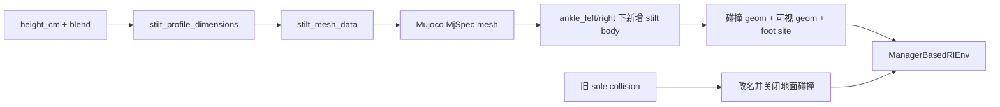
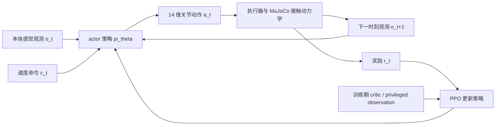

<!-- Generated by the offline translation workflow.
Source: 16-专题组队学习/05-MicroDuck运动策略与任务开发专题/01-任务资料/03-MicroDuck高跷行走强化学习复现/README.md
Source SHA-256: fbab93fa5d706645a401a3a0ca91c8d4a4c15804fdabe505066d61602b977cea
Model: tencent/Hy-MT2-1.8B-GGUF:Q4_K_M
Review machine-translated technical claims before relying on them.
-->
# MicroDuck Stilt Walking: From Step-by-Step Learning to 2 m Simulation Reproduction

## What is completed in this section

A recent MicroDuck video presents an interesting motion control experiment: a duck with two legs is equipped with increasingly tall stilts. It starts from ordinary low support levels and gradually learns to walk alternately on stilts at 10 cm, 50 cm, and up to about 2 m in height. What is truly worth learning from this experiment is not how the duck’s legs are elongated in the video, but how the stilts are explicitly incorporated into MuJoCo as new contact geometry, mass, and inertia, followed by reinforcement learning to gradually increase the complexity of the movement.

This section reproduces the publicly available **MicroDuck stilt walking** version, including the following steps:

1. Understand how the stilt structure, contact geometry, and robot morphology enter the simulator;
2. Comprehend the observation, action, reward, and curriculum learning design of `Mjlab-Stilt-Flat-MicroDuck`;
3. Download the public 25 cm and 2 m policies, and perform ONNX inference and video rendering in local MuJoCo;
4. Learn how to continue training from public checkpoints, and why 2 m simulation results cannot be directly used as real robot solutions;
5. Integrate this case with previous MicroDuck basketball balance and mjswan browser physical disturbance into the same motion control learning path.

> **Reproduction boundaries**: In this section, public checkpoints are used for policy playback and video rendering, without re-running the full 2 m PPO training. Public model cards explicitly mark these policies as simulation-only; the stilts in the video have also not been verified on a real robot. For real robot migration, it is necessary to re-examine structure support, center of gravity, servo torque, fall protection, and control frequency.

## 1. Returning from video phenomena to real issues

In the video, it seems like "a duck wearing stilts," but for the controller, four types of changes occur in the system at the same time:

- **Support point change**: The original contact surface on the sole is no longer responsible for bearing weight; what actually touches the ground is the end of the stilt;
- **Support polygon change**: The end of the stilt becomes narrower, making the rolling, lateral deviation, and landing error more sensitive;
- **Mass and inertia change**: The higher the stilt, the greater the additional mass, and the moment of inertia and impact force during leg movement also change;
- **Robot height change**: The same body posture corresponds to different foot end heights, requiring同步 adjustment of the reset position, camera distance, and contact sensors.

If only the ground is moved down or the legs of the rendered model are stretched while retaining the old foot bottom collisions, the policy still learns the original flat walking problem, and does not learn to “maintain balance on a high-leverage support”. The core approach of this project is to add explicit stilts body, mesh, mass, collision geom, and foot site to the MuJoCo robot description, while disabling the ground collision of the original foot bottom.

## 2. Official implementation and local replica assets

| Resource | Purpose |
| :--- | :--- |
| [MicroDuck stilt policy collection](https://huggingface.co/HannesVonEssen/microduck-stilts) | ONNX, manifest, checkpoint, and official rollout videos for 10 cm to 2 m |
| [MicroDuck Playground](https://github.com/Vottivott/microduck-playground) | Training environment, MuJoCo configuration, PPO entry point, evaluation, and export scripts |
| [Corresponding fixed version `c5fcc50`](https://github.com/Vottivott/microduck-playground/tree/c5fcc50219fef01ac9931d0079c583ccbb29b689) | The source code version used for reproduction in this section to avoid configuration drift caused by subsequent upstream commits |
| [Stilt hardware directory](https://github.com/Vottivott/microduck-playground/tree/c5fcc50219fef01ac9931d0079c583ccbb29b689/hardware/stilts) | Parameterized STL files, rendering images, prints, and structural safety notes |
| [MicroDuck original robot project](https://github.com/pollen-robotics/microduck) | Robot body, servos, and hardware background information |
| [MicroDuck reinforcement learning environment](https://github.com/pollen-robotics/microduck_rl) | Basic training infrastructure for mjlab / MuJoCo Warp / PPO |
| [Original video sharing](https://weixin.qq.com/sph/AOgguA2tn7) | Reference for topic selection and effects; the videos in the tutorial are re-rendered locally according to the public policy |

The local replica only includes small amounts of teaching evidence in the tutorial: official stilt renderings, 25 cm local rollout, 2 m local rollout, and video frame extracts. Model weights, Python virtual environment, MuJoCo cache, and the complete external repository remain outside the tutorial repository. Readers can obtain them using the following fixed version and download command.

## 3. First, look at the hardware structure: Why can the same installation interface have different heights?

The official design does not modify the MicroDuck body. Instead, the original detachable sole is turned into a replaceable carrier, and stilt cartridges of different heights are fixed onto the carrier with screws. This approach has two advantages:

1. The robot body, servos, and joint zero positions do not need to be redesigned for each height;
2. During training, the "height" and "support shape" can be split into two course axes to avoid changing too many physical factors at once.

<table>
  <tr>
    <td align="center"><br><sub> Front </sub></td>
    <td align="center"><br><sub> Fourth of third view </sub></td>
    <td align="center"><br><sub> Side </sub></td>
    <td align="center"><br><sub> Print prototype </sub></td>
  </tr>
</table>

**Figure 1:** The MicroDuck stilt structure under the same installation interface. The renderings and print prototypes come from the `hardware/stilts` directory in the official Playground; they illustrate the structural concept, but do not indicate that it has been tested on a real robot.

The pole shape is controlled by the `blend` parameter: `blend=0` corresponds to a rounded platform of approximately 22 mm × 32 mm, while `blend=1` represents a narrow circular support of about 12 mm. The public policy uses `blend=0.5`, which matches an end size of approximately 17 mm × 22 mm. The height is controlled separately by `MICRODUCK_STILT_HEIGHT_CM`.

Quality follows a simple audit model in the public implementation:

```text
每根高跷质量 = 0.012 kg + 0.001 kg/cm × 高跷高度
```

For example, the nominal mass for the 25 cm version is 37 g/root, while for the 2 m version it is 212 g/root. This formula represents the morphological parameters of the simulation training, not the actual weight of the printed parts; the printed material, fill factor, screws, rubber pads, and structural reinforcement all affect the real mass.

## 4. Method Breakdown: What exactly is trained by the stilt policy

### 4.1 Morphological Compilation: Add stilts to MuJoCo, not just modify the image

Core code is in:

```text
src/mjlab_microduck/robot/stilt_constants.py
src/mjlab_microduck/tasks/microduck_stilt_env_cfg.py
```

The main data flow of `stilt_constants.py` is as follows:



The key actions in the code can be summarized as:

1. Calculate the bottom support ring and top mounting ring to generate the convex mesh of the stilt;
2. Add the mesh as a MuJoCo asset to the robot `MjSpec`;
3. Rename the original left and right foot collision geometry to `*_original_sole_disabled`;
4. Add `stilt_left` and `stilt_right` bodies under the left and right ankle;
5. Add load-bearing collision geometry, purple visible geometry, and a new foot end site respectively;
6. Associate observations/rewards such as foot-contact, foot-height, and slip with the new end positions.

This step determines what problem the policy is actually facing. The collision geometry, contact friction, and height at the tip of the stilt are sent into physical simulation, so that the policy receives real feedback due to foot placement deviation, body tilt, and torque changes during leg movement.

### 4.2 Course Learning: Support First, Then Increase Height

Public training records are not "randomly adjusting the stilt height to 2 m and then training once", but a continuous checkpoint migration chain:

| Milestone | Height | Support blend | Function |
| :---: | ---: | ---: | :--- |
| 400 | 2 cm | 0.00 | Learn to stand and walk steadily on a wide platform |
| 500 | 2 cm | 0.25 | Begin narrowing the support shape |
| 600 | 2 cm | 0.50 | Select the end point of approximately 17 mm × 22 mm for the public policy |
| 700–800 | 3–4 cm | 0.50 | Early height transition |
| 2,000 | 5 cm | 0.50 | Consolidate alternating gait |
| 2,100–2,800 | 7.5–25 cm | 0.50 | Continue rising with a smaller height step length |
| 2,900–3,400 | 27.5–50 cm | 0.50 | Increase the height step length |
| 3,500–4,200 | 55 cm–1.2 m | 0.50 | Enter extreme simulation height |
| 4,300 | 1.4 m | 0.50 | Public high-height milestone |
| 4,600–6,000 | 1.5–1.9 m | 0.50 | Continuous bridging for 2 m |
| 6,500 | 2.0 m | 0.50 | Public simulation upper limit policy |

The key to this course is that at each stage, only one main variable is made more difficult: first, keep the height unchanged after the support shape narrows; then, gradually increase the height as the support shape becomes stable. In case of failure, it is possible to determine whether the issue is "too narrow base" or "excessive torque due to height," rather than dealing with mixed variations that cannot be attributed to a specific cause.

### 4.3 PPO, Observation and Action Interfaces

The policy still uses the interface of the MicroDuck speed control task:

| Item | Public Convention |
| :--- | :--- |
| actor observation | `float32 [1, 61]` |
| action | `float32 [1, 14]` |
| Control frequency | 50 Hz |
| Action scale | Scaled to 1.0 rad centered on the MicroDuck HOME joint pose |
| Command | `twist=[0.15, 0, 0]`, head/body command is 0 |
| Normalization | Already baked into each ONNX file |
| Algorithm | PPO, trained via `rsl_rl` and `mjlab` |

The actor sees the ontology sensations and commands, including angular velocity, projection gravity, joint position/speed, actions at the previous moment, and speed commands. During training, the critic can use a more complete privileged observation to help PPO estimate values; during deployment, only the 61-dimensional input of the actor is required.

Special attention should be paid here: policies at different heights are not a general ONNX where the "height parameter can be freely inferred". Each `policy.onnx` in a directory is associated with the corresponding stilt height, quality, and support shape. A 25 cm policy should be paired with a 25 cm shape; you cannot directly apply a 2 m STL or 2 m MuJoCo geometry to a 25 cm policy.

### 4.4 The exported checkpoint is not the complete original PPO state

`checkpoint.pt` in Hugging Face can be used to continue training, but the public documentation clearly states that the critic and optimizer snapshots of the original stilt training are not preserved. The released checkpoint is:

- Actor weights and observations normalized precisely corresponding to the published ONNX actor;
- A new critic with compatible shape;
- Empty optimizer moments;
- Conservative `1e-5` learning rate and `0.1` exploration standard deviation;
- Corresponding release iteration number and course count.

Therefore, continued training constitutes an **actor-exact warm start**, rather than a bit-by-bit continuation from the original PPO training checkpoint. The reproduction in the tutorial uses the publicly available actor behavior, and it cannot be described as "obtaining the author’s complete training state".

## 5. From a control perspective: What has the duck actually learned

The previous structure, checkpoints, and videos address "what is this project about." This section addresses the more important question: **How did the duck learn to walk on stilts through repeated trial and error?**

If it is simply described as "downloading a model, running a command, and obtaining a video," readers may easily assume that this is a pre-recorded action, or that the joint angles of the left and right legs are played out over time. In reality, however, this is not the case. The stilt policy is a **closed loop controller** that continuously receives proprioception data during deployment and continuously outputs joint movements; the video is merely the result of this controller interacting with the MuJoCo physical world.

### 5.1 First, write the problem as a control closed loop

At time $t$, the policy receives observations $o_t$ and speed commands $c_t$, and outputs an action $a_t$:

$$
a_t = \pi_\theta(o_t, c_t)
$$

After the motion is executed by the joint actuator and contact dynamics, the state at the next moment is obtained:

$$
s_{t+1} = F(s_t, a_t, \text{contact}, \text{friction}, \text{mass}, \text{inertia})
$$

The environment returns a reward $r_t$ based on whether this small segment of movement is closer to the target. The next control starts from a new observation. Thus, both training and deployment can be understood as the following chain:



There are three points that are easy to overlook:

1. **The policy does not plan out the entire gait in one go.** It re-evaluates the body state every 50 Hz and then decides how to adjust the joints for the next small step.
2. **The movement is not “moving the foot to a specific position on the screen.”** The public actor outputs 14 joint position offsets, which are then converted into actual joint torques and movements through the actuator model.
3. **The rewards are not manually written action labels.** No one tells it “how high the left foot is lifted in this frame or how far the right foot moves in the next frame”; the policy uses the rewards to determine which movements are more stable and closer to the forward command.

Therefore, the video generated in the tutorial is not an offline animation, but a trajectory produced by closed loop real-time control of the policy under current stilt geometry, mass, friction, and collision conditions.

### 5.2 What do 61-dimensional observation and 14-dimensional action represent?

The runtime interface for the public policy is `observation: [1, 61] -> action: [1, 14]`. The 61-dimensional observations can be divided into functions:

| Observation Block | Dimension | What it tells the policy |
| :--- | :---: | :--- |
| Body angular velocity | 3 | The direction and speed of rotation of the duck |
| Projection gravity | 3 | The projection of gravity direction in the body coordinate system, used to determine if the body is tilted |
| 14 joint positions | 14 | The posture of the current legs and body joints |
| 14 joint velocities | 14 | The direction and speed of movement of each joint |
| Previous moment action | 14 | Let the policy know what control was issued just now, avoiding abrupt changes in actions |
| Velocity commands | 3 | Expected forward, lateral, and turning speeds |
| Head and body related states | 4 + 6 | Local state variables consistent with the task interface |

This set of inputs contains no camera images, nor visual markers such as footballs, goalposts, or stilts. Therefore, the policy learned is **proprioceptive motor control**, not visual navigation or football-related strategies. It knows that its body is tilting, its feet are moving, and its joints are near their limits, but it does not know what objects are present in the scene.

The 14-dimensional actions output must also be understood correctly. They are the joint position offsets around the MicroDuck `HOME` posture, which are scaled by `action scale=1.0 rad` before being sent to the actuator. It is not 14 separate "foot labels," nor does it directly specify the robot's position in world coordinates. The length, mass, and contact surface of the stilt ultimately change the physical outcome of the same action.

### 5.3 How Ducks Learn Alternating Gait

From a control perspective, a seemingly simple "take one step" involves at least the following mutually coupled behaviors:

1. **First, focus the center of gravity on the current support side.** If both stilts bear weight, the policy requires letting the projection of the body’s center of gravity fall near the side still in contact with the ground.
2. **Lift the swinging side.** The swinging side should not just lift the foot; the leg posture and body angular velocity must also be controlled to avoid tipping the body over when lifting the foot.
3. **Put the stilts back in a load-bearing position.** Landing too early causes slipping, while landing too late results in loss of support; the longer the stilts are, the more obvious the posture change due to landing error is.
4. **Quickly correct after contact.** The contact impact changes the body’s angular velocity, and the projection gravity, angular velocity, and joint feedback in the next observation will transmit this change to the actor.
5. **Repeat the left-right support switching.** Only when one side becomes stable again does the policy have a chance to transfer the load to the other side.

This is not a hardcoded script "left foot, right foot, left foot, right foot" in the code. Alternating gait is caused by the combined effect of several factors:

- The left and right leg structures are approximately symmetrical;
- The speed tracking reward encourages the body to move in the commanded direction;
- A related reward is based on the time when the toes leave the ground and the height at which the feet are lifted, promoting genuine oscillation;
- Penalties for toe slip, action rate of change, self-collision, and joint limits prevent dragging of feet, jitteriness, and dangerous postures;
- The contact, friction, mass, and inertia of MuJoCo determine the true consequences of each movement.

In other words, the policy does not memorize a video, but gradually discovers through physical feedback: **first stabilize the support, then switch supports, and correct after landing**. This is easier to achieve long-term rewards than having both feet moving randomly at the same time. This is the core meaning of “learning to walk” in this project.

### 5.4 What each of the rewards, critic, and PPO is responsible for

The three characters during the training period can be understood separately:

| Component | Function | Required during deployment |
| :--- | :--- | :---: |
| actor $\pi_\theta$ | Outputs the next joint action based on observations | Required |
| reward | Evaluates whether the action is faster, more stable, or more compliant | Not required |
| critic $V_\phi$ | Estimates the long-term success probability of the current state to help PPO determine the quality of actions | Usually not required |

The focus of the reward in the stilt task is not "like a demonstration video frame", but a combined evaluation of control results. The public configuration can be summarized as:

- Speed and angular velocity tracking: Whether it moves forward or turns according to commands;
- Body posture and angular velocity: Whether it remains upright or experiences severe swaying;
- Time when feet leave the ground, lifting feet, and in the air: Whether a viable gait is actually formed;
- Foot slippage, self-collision, joint limits: Whether there is dragging, collision, or dangerous postures;
- Action rate of change and energy-related constraints: Whether short-term movement is achieved through high-frequency jitters.

During training, the critic can access more complete privileged information than the actor, such as simulation status and contact-related data, to more accurately estimate whether continuing from this state will be successful. This does not mean that the answers are leaked to the robot during deployment: the 61-dimensional proprioceptive interface still operates within the actor.

The intuitive process of PPO is: let the old policy sample many trajectories, calculate the advantage of each action relative to the expectation $A_t$, and then update the policy using the cropped probability ratio:

$$L^{\mathrm{CLIP}}(\theta)=\mathbb{E}_t\left[\min\left(r_t(\theta)A_t,\operatorname{clip}\left(r_t(\theta),1-\epsilon,1+\epsilon\right)A_t\right)\right]$$

The purpose of pruning is to limit the magnitude of a single update, preventing the policy from changing too much suddenly due to a batch of accidental successes or failures. For tasks like stilts, which are sensitive to contact, stable incremental updates are more important than aggressively changing the policy.

### 5.5 Why Learn Morphology Courses

Letting the random policy walk on 2-meter stilts directly solves the problem. The issue isn't just that it's a bit difficult, but that during the initial exploration phase, it almost loses support quickly every time. The reward signals are sparse, and it’s hard for the policy to determine which joint to modify first. The course learning breaks down this extremely difficult problem into several consecutive safe steps:

1. First, learn basic speed control in the form of short stilts or near-horizontal supports;
2. Then gradually reduce the support shape and increase sensitivity to oscillation and contact;
3. Finally, gradually increase the height of the stilts to allow the actor who can already walk to adapt to larger lever arms, mass, and posture changes;
4. Each stage can serve as an initialization for the next stage, rather than starting from a completely random policy.

So the courses here are not about "giving the model cheating answers," but rather changing the task difficulty to make rewards and physical feedback effective enough in the early stages of training. The publicly released policies for 10 cm, 25 cm, 50 cm, 1 m, 2 m, etc. should be understood as specialized policies for different course stages, rather than a general model that can arbitrarily input heights and automatically ensure stability.

### 5.6 What was learned from this policy, and what wasn't learned

**It has learned:**

- Under the given stilt shape and friction conditions, maintain body stability by following a low-speed command;
- Generate alternating gait through the exchange of left and right supports;
- Adjust the posture after landing based on angular velocity, gravity direction, and joint feedback;
- Adapt to contact disturbances, mass changes, and motion noise within a certain range seen during training.

**It hasn't learned:**

- Recognizing footballs, goalposts, or obstacles through the camera;
- Planning long-time-series tasks such as “walk to the ball, aim, kick, and recover”;
- Automatically deriving reliable stilts strategies after detecting any new height;
- Demonstrating that a 2 m structure can be directly printed, assembled, and safely supported by a real MicroDuck;
- Replacing motor limits, emergency stop, low-level control, and manual safety checks on the real robot.

This set of boundaries is very important. It explains why the stilt policy is suitable as a motion control and reinforcement learning tutorial, and also indicates that it cannot directly replace the football vision, goal planning, or RDK on-device deployment we have done before.

### 5.7 Return to the duck learning main line of Every Embodied

Combine this reproduction with the other duck experiments in the tutorial, and the learning issues will be clearer:

| Experiment | Main Inputs | Main Learning Objectives | Key Concepts |
| :--- | :--- | :--- | :--- |
| Walking on Flat Ground | Proprioception + Speed Command | Learn basic alternating gait | Simulation of closed loop motion control using PPO |
| Walking on Stilts | Proprioception + Modified Contact Shape | Learn to walk on more unstable supports | Shape compilation + step-by-step learning |
| Basketball Balance | Proprioception + Spherical Contact Feedback | Maintain balance through body adjustments | Contact, friction, and recovery strategies |
| Football Task | Visual Target + Proprioception | Locate the ball, approach, align, and kick continuously | Combination of perception, planning, and control |
| mjswan Interaction | Browser input or external disturbance | Observe and manipulate the physical system | Interactive simulation and visual verification |

From this perspective, MicroDuck is not just about "creating some fun web animations," but rather a learning tool that gradually increases the difficulty of the tasks: first, the duck learns to control its own body; then it faces changed contact forms; and finally, visual targets, multi-duck collaboration, and real hardware constraints are added. For each new task, three questions must be answered first: **what the policy can see, what the actions can change, and what the rewards actually encourage.**

## 6. Preparation of Local Environment

### 6.1 Recommended Configuration

- Python `>=3.12, <3.13`;
- `uv`;
- Linux + CUDA GPU is more suitable for complete PPO training;
- Windows or computers without CUDA can perform CPU inference and video rendering with public checkpoint, but MuJoCo Warp compilation and physical stepping will be much slower;
- At least sufficient disk space should be reserved for Python dependencies, model caching, and video output.

This section uses a fixed source code version. Do not directly follow the latest `main` in the repository, otherwise the training script, dependencies, or task registration may change, and the results may not be consistent with this section.

### 6.2 Clone the fixed version and install dependencies

Execute in the directory where external projects are to be placed:

```bash
git clone https://github.com/Vottivott/microduck-playground.git
cd microduck-playground
git checkout c5fcc50219fef01ac9931d0079c583ccbb29b689
uv sync
```

Check whether the task is registered successfully:

```bash
uv run list-envs | grep Stilt
```

Windows PowerShell can use the following when `grep` is not present:

```powershell
uv run list-envs | Select-String Stilt
```

`Mjlab-Stilt-Flat-MicroDuck` is expected to be visible. If you only want to verify the configuration and training interfaces, you can run the tests provided by the repository first:

```bash
uv run --with pytest pytest tests/test_stilt_cfg.py tests/test_train_cli.py tests/test_onnx_policy_contract.py -q
```

This test only indicates that task registration, parameter constraints, and ONNX contracts are available, but it does not mean that PPO has converged.

## 7. Download the public policy and perform ONNX smoke testing

### 7.1 Download 25 cm Policy

It is recommended to start with 25 cm. It is easier to see the alternating support of the legs compared to 2 m, and it is more suitable as the first reproduction:

```bash
mkdir -p policies/stilts
uv run hf download HannesVonEssen/microduck-stilts \
  25cm/policy.onnx 25cm/checkpoint.pt 25cm/manifest.json config.json \
  --local-dir policies/stilts
```

If only an ONNX deployment is performed and no further training is required, only `25cm/policy.onnx` and `25cm/manifest.json` can be downloaded. If the following `scripts/export.py` video recording is to be done, `checkpoint.pt` is also necessary.

Check input and output with ONNX Runtime:

```bash
uv run python -c "import onnxruntime as ort, numpy as np; p='policies/stilts/25cm/policy.onnx'; s=ort.InferenceSession(p, providers=['CPUExecutionProvider']); i=s.get_inputs()[0]; o=s.get_outputs()[0]; y=s.run(None, {i.name: np.zeros((1, 61), dtype=np.float32)})[0]; print(i.name, i.shape, o.name, o.shape, y.shape)"
```

Expected results are similar:

```text
obs [1, 61] actions [1, 14] (1, 14)
```

This step only verifies that the tensor interface and model file are intact. The action obtained from a zero observation cannot be regarded as a normal walking effect.

### 7.2 Download 2 m Policy

After confirming the 25 cm version, download the 2 m version that is the most exaggerated in the video:

```bash
uv run hf download HannesVonEssen/microduck-stilts \
  200cm/policy.onnx 200cm/checkpoint.pt 200cm/manifest.json \
  --local-dir policies/stilts
```

The 2 m version is the result of extreme simulation studies, and should not be regarded as a size recommendation for printed materials. The public page also specifically states that the 3 m segment is a zero-shot failure of the 2 m policy, and there is no independently trained 3 m policy.

## 8. Generate local video in MuJoCo using a public checkpoint

### 8.1 25 cm: First, understand the movements and contacts clearly

`scripts/export.py` will load `Mjlab-Stilt-Flat-MicroDuck`, compile the MuJoCo shape based on matching height, and then call the checkpoint actor to generate a rollout. The following command does not train; it only exports local videos at 4 seconds and 50 FPS, as well as ONNX:

```powershell
$env:MICRODUCK_STILT_HEIGHT_CM = "25"
$env:MICRODUCK_STILT_BLEND = "0.5"
uv run python scripts/export.py Mjlab-Stilt-Flat-MicroDuck `
  --checkpoint-file policies/stilts/25cm/checkpoint.pt `
  --device cpu --num-envs 1 `
  --video True --video-length 200 `
  --video-height 720 --video-width 1280 `
  --viewer auto --running-speed 0.15 `
  --onnx-file artifacts/stilts_25cm.onnx
```

The Linux/macOS shell syntax is as follows:

```bash
export MICRODUCK_STILT_HEIGHT_CM=25
export MICRODUCK_STILT_BLEND=0.5
uv run python scripts/export.py Mjlab-Stilt-Flat-MicroDuck \
  --checkpoint-file policies/stilts/25cm/checkpoint.pt \
  --device cpu --num-envs 1 \
  --video True --video-length 200 \
  --video-height 720 --video-width 1280 \
  --viewer auto --running-speed 0.15 \
  --onnx-file artifacts/stilts_25cm.onnx
```

The video is located in the directory where the checkpoint is placed by default:

```text
policies/stilts/25cm/videos/play/rl-video-step-0.mp4
```

If using the PyTorch environment with CUDA, you can replace `--device cpu` with `--device cuda:0`. Do not assume that PyTorch must be the CUDA version just because Warp can recognize the GPU; training and checkpoint actor inference are actually also affected by the PyTorch wheel and driver environment.

### 8.2 2 m: Reproduction of extreme heights in videos

```powershell
$env:MICRODUCK_STILT_HEIGHT_CM = "200"
$env:MICRODUCK_STILT_BLEND = "0.5"
uv run python scripts/export.py Mjlab-Stilt-Flat-MicroDuck `
  --checkpoint-file policies/stilts/200cm/checkpoint.pt `
  --device cpu --num-envs 1 `
  --video True --video-length 500 `
  --video-height 720 --video-width 1280 `
  --viewer auto --running-speed 0.15 `
  --onnx-file artifacts/stilts_200cm.onnx
```

500 environmental steps correspond to 10 seconds, as the environmental step length for this task is 20 ms. In a 2 m video, the ducks appear smaller relative to the frame, which is due to the increasing distance of the camera with height. You can first use 25 cm segments to examine the leg movements, and then use 2 m segments to assess overall stability.

### 8.3 Results Generated Locally in This Section

The two videos below are teaching materials re-exported in the local MuJoCo using the above public code and public checkpoint:

<table>
  <tr>
    <td>
      
      <p><strong>Figure 2: </strong>25 cm stilts, 4 seconds, 1280×720, 50 FPS. Local reproduction clip, suitable for observing alternating support and the purple stilts touching the ground. </p>
    </td>
    <td>
      
      <p><strong>Figure 3: </strong>2 m stilts, 10 seconds, 1280×720, 50 FPS. Local reproduction clip, showing simulation walking at extreme heights. </p>
    </td>
  </tr>
</table>

The local review records are as follows:

| Check Item | Result |
| :--- | :--- |
| Fixed source code version | `c5fcc50219fef01ac9931d0079c583ccbb29b689` |
| Configuration and interface testing | `23 passed` |
| 25 cm rollout | 200 steps, 4 s, H.264, 1280×720, 50 FPS |
| 2 m rollout | 500 steps, 10 s, H.264, 1280×720, 50 FPS |
| ONNX contract | `obs [1,61] -> actions [1,14]` |
| Video inspection | Both versions show the load-bearing at the end of the stilt and alternating support; no obvious fall and reset was observed |

This frame extraction diagram is more suitable for quickly comparing two heights; the video itself is the basis for judging the continuity of the gait:


**Figure 4:** 25 cm rollout frame extraction. The purple mesh of the stilt is the actual visible geometry in the simulation scene, and is not added later.


**Figure 5:** 2 m rollout frame extraction. As the height increases, the camera needs to move further away to include the entire stilt in the frame, so the duck will appear smaller.

## 9. Training from scratch: Why progress step by step according to the course

Public checkpoint replays are suitable for verifying code and interfaces first; if you want to study rewards, quality randomization, or changes in stilt shape, continue training at the course stage.

### 9.1 Run the training smoke test first

```bash
export MICRODUCK_STILT_HEIGHT_CM=2
export MICRODUCK_STILT_BLEND=0
uv run train Mjlab-Stilt-Flat-MicroDuck \
  --env.scene.num-envs 64 \
  --agent.max-iterations 5
```

This smoke test only verifies that: the task can be compiled, mesh can join MuJoCo, reset and contact can operate, and PPO can complete several steps of rollout and optimizer updates. It does not indicate that the policy has learned to walk.

### 9.2 Continue training from the public actor warm start

Taking 25 cm as an example, first put the public checkpoint into the normal run directory of rsl_rl:

```bash
mkdir -p logs/rsl_rl/stilt_locomotion/release-25cm
cp policies/stilts/25cm/checkpoint.pt \
  logs/rsl_rl/stilt_locomotion/release-25cm/model_2800.pt

export MICRODUCK_STILT_HEIGHT_CM=25
export MICRODUCK_STILT_BLEND=0.5
uv run train Mjlab-Stilt-Flat-MicroDuck \
  --agent.resume True \
  --agent.load-run release-25cm \
  --agent.load-checkpoint model_2800.pt \
  --agent.max-iterations 100
```

During the continuous training, first stabilize the form, then observe value loss, termination rate, foot contact identity, and video. Do not increase the height while reducing the support surface or increasing random disturbances. Only when the current form is stable should you proceed to the next height stage.

### 9.3 Training Cost and Device Selection

The parallel training in the complete 4096 environment requires a CUDA GPU and MuJoCo Warp. A regular Ubuntu workstation or cloud GPU is suitable for formal training; CPU is better for configuration testing, single-environment playback, and video export. `4096` in the training command refers to the number of parallel environments and is not a mandatory setting that must be used from the start: first complete the smoke test with 64 environments, and then gradually increase the number.

If `cuda device_count == 0`, Warp cannot select devices, or insufficient VRAM occurs before training starts, prioritize checking whether PyTorch is a CUDA wheel, whether the CUDA driver matches, and whether `--env.scene.num-envs` is too large. Do not mistake these issues for errors in the stilt reward function.

## 10. Common Questions

### 10.1 `policy.onnx` can be loaded, but the duck falls at the beginning

Prioritize checking three things:

1. Whether `MICRODUCK_STILT_HEIGHT_CM` is the same as the policy directory;
2. Whether `MICRODUCK_STILT_BLEND` is the release configuration `0.5`;
3. Whether ordinary `microduck` scenes, old foot contact, or different versions of HOME pose have been mixed in.

The input and output dimensions of the stilt policy are the same, but this does not mean that different forms can be exchanged. True compatibility conditions include mesh, quality, collision, foot site, reset height, and policy checkpoint.

### 10.2 Running `scripts/infer_policy.py` on Windows Reports `No module named termios`

This script is a demo with terminal key interaction. It directly imports `termios` and `tty` from Linux. On Windows, you can use the headless recording path `scripts/export.py` in this section, which does not rely on terminal keys. If you want to run the interactive viewer, it is recommended to execute it in Linux/WSL, or modify the local copy to support platform-specific keyboard input.

### 10.3 The video output is empty, or there is only the first frame

Confirm that all the following conditions are met simultaneously:

- Use the checkpoint mode with `--agent trained`, instead of a dummy agent;
- Pass in `--video True`;
- `--checkpoint-file` refers to the actual `.pt` file;
- Use matching environment variables;
- Wait for `scripts/export.py` to print `Written ...onnx`, then search for MP4 in `videos/play/` in the directory where the checkpoint is located.

### 10.4 Can we directly print a 2 m stilt and install it on MicroDuck?

This cannot be inferred in this way. The 2 m version is a result of extreme simulation control. The public hardware description clearly marks the STL ranging from 50 cm to 2 m as simulation/reference geometry, rather than providing overall printing recommendations. A real implementation would require rework at least:

- Continuous load-bearing paths of metal or composite materials;
- Foot tip bending and buckling analysis;
- Screw, load, impact, and torque verification;
- Overflow protection, limit and temperature rise tests;
- Slack safety rope, soft ground, sudden stop, and open fall areas.

The public quality audit of 10 cm is only a sensitivity check in 64 environments and 10 seconds of simulation, and cannot replace testing with a real robot. 3D files follow upstream hardware licensing; please read the `LICENSE-HARDWARE` in the repository before use.

## 11. Relationship with the existing MicroDuck content in Every Embodied

This text is a progression from the previous two texts:

- [MicroDuck Basketball Balance](../01-microduck-basketball-balance-reinforcement-learning/README.md): Studying how to maintain balance using proprioception and memory when the support surface beneath the feet freely rolls;
- [mjswan Browser Physical Disturbance](../02-mjswan-microduck-browser-physical-disturbance/README.md): Researching how trained policies enable interaction with the browser, using MuJoCo WASM and mouse forces for interactive observation;
- **This Article on Stilt Walking**: Studying how a robot acquires new walking policies through PPO learning after changes in its shape and contact geometry.

The three cases collectively illustrate a fact that is often overlooked: the motion policy is not a pure software file independent of the robot form. Whenever the support surface, mass, contact points, motion scaling, or joint definitions change, the simulation model, observation contract, and policy scope should be rechecked.

## 12. Licenses and References

- Software code: Used under [MicroDuck Playground LICENSE](https://github.com/Vottivott/microduck-playground/blob/c5fcc50219fef01ac9931d0079c583ccbb29b689/LICENSE), and the repository declares itself under Apache-2.0 license;
- Stilt hardware files: Used under [LICENSE-HARDWARE](https://github.com/Vottivott/microduck-playground/blob/c5fcc50219fef01ac9931d0079c583ccbb29b689/LICENSE-HARDWARE), and local copies in the Every Embodied tutorial cannot be regarded as proprietary hardware assets;
- Models and videos: Subject to [HannesVonEssen/microduck-stilts](https://huggingface.co/HannesVonEssen/microduck-stilts)'s model cards, manifest, and file licenses;
- Local videos in this section: Re-rendered in MuJoCo using public checkpoints and fixed source code for tutorial verification and teaching purposes, and do not represent official hardware demonstrations.

### References

1. [HannesVonEssen/microduck-stilts](https://huggingface.co/HannesVonEssen/microduck-stilts)
2. [Vottivott/microduck-playground](https://github.com/Vottivott/microduck-playground/tree/c5fcc50219fef01ac9931d0079c583ccbb29b689)
3. [Stilt training records `experiments/stilts/TRAINING.md`](https://github.com/Vottivott/microduck-playground/blob/c5fcc50219fef01ac9931d0079c583ccbb29b689/experiments/stilts/TRAINING.md)
4. [Stilt hardware instructions `hardware/stilts/README.md`](https://github.com/Vottivott/microduck-playground/blob/c5fcc50219fef01ac9931d0079c583ccbb29b689/hardware/stilts/README.md)
5. [Pollen Robotics MicroDuck](https://github.com/pollen-robotics/microduck)
