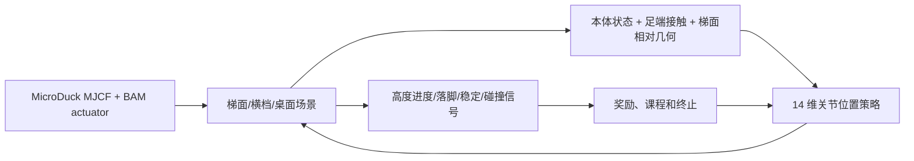

<!-- Generated by the offline translation workflow.
Source: 16-专题组队学习/05-MicroDuck运动策略与任务开发专题/01-任务资料/06-MicroDuck梯面攀爬强化学习导读/README.md
Source SHA-256: 7f8a8df6ad0ac70499911414e1edc4c9de2c8b280afc7fe930699f2a25fdbece
Model: tencent/Hy-MT2-1.8B-GGUF:Q4_K_M
Review machine-translated technical claims before relying on them.
-->
# MicroDuck Rope Climbing: From Video Phenomenon to Reproducible Reinforcement Learning Task

## Clarify the boundaries in this section first

> **Progress as of 2026-09-15:** The single-step simulation policy for MicroDuck has been found in public sources, but no training code and checkpoint matching the video exactly—“14 inclined ladder rungs + top flip”—have been identified yet. The independent evaluation for V3 is already... `active_rungs=3`After closing the double support bridge, a real physical crossbar was observed to be formed:`TARGET_STEPS=[28, 76, 77]`、`MAX_PHYSICAL_RUNG_TARGET=1`、`SUCCESS_COUNT=1`. This proves that the contact state machine and the initial foothold link work, but it does not mean that continuous climbing or reaching the summit has been achieved; training has moved on `active_rungs=5` During the single-foot alternation phase, continue to verify the second and third crossbeams and the top landing platform.

The video provided by the user shows a MicroDuck climbing up a sloped ladder with handrails from the ground, then turning its body onto the tabletop. We saved the video as a frame reference for this section:


**Figure 1:** 12-frame sample from the reference video.


**Video 1:** The original reference clip compiled in this section. It is used for analyzing task phases and interaction relationships, but it does not indicate that the corresponding training code has been made public.

### Demonstration of Skill Chain Stage

To integrate the currently working scenarios of obstacle avoidance, physical disturbance, spherical balance, and slope contact into a single narrative, there is another version of a stage combination video with a unified frame:


This is a "current progress summary" rather than a complete task completion video. At the end of the video, the verified skills and `GroundPick` still in training, continuous shifting, and top drop are marked separately; the independent evaluation results for the latest V3 checkpoint are still based on the values and logs in this section.

## What stage has been reached now

The complete "ladder MJCF + training configuration + checkpoint + evaluation script" corresponding to the original video has not been found in a verifiable public repository. However, we have added a **local V1 experimental task** on the publicly available MuJoCo/MicroDuck training stack:

- Registration task: `Mjlab-Ladder-Climb-MicroDuck`;
- Use real MuJoCo collision geometry: two diagonal beams, 7 crossbeams, top platform, and stop barrier;
- Add front ray scanning for observation. The actor is expanded from 61 dimensions to 196 dimensions, and the critic is 211 dimensions;
- Rewards include forward/upward potential energy difference, upright body position, foot contact, and smooth motion terms;
- Success conditions require reaching the top platform with a stable posture;
- Expand the first-layer input using the public MicroDuck walking checkpoint. First perform a warm start, then train the policy on the training surface.

This version has completed training on the GPU with a 256 environment and 150 iterations, and produced a 12-second H.264 playback. In the playback, the duck walks onto the ladder, physically contacts the railing, and climbs to the middle section. However, in this round `ladder_success=0`, it still cannot stabilize and climb up the top platform. Therefore, it is V1 where “the physical chain and task implementation are working, but the policy still needs further training,” not a complete replica of the original video.


**Figure 2:** Six moments of local V1 playback. Blue dots represent slope ray observations, and orange geometry represents real collision rails; it can be seen that the policy has entered the slope contact phase.


**Video 2:** Local MuJoCo V1 replay. This video is used to prove that the environment and policy are indeed running; the current result should still be labeled as “partial climb” and not “climbed to the top”.

## 2.1 V2 ladder geometry recreated based on the original video

The main issue with V1 is not "changing the color of the slope," but rather the structure of the ladder does not match that in the reference video. V2 has been recreated based on the spatial relationships in the original video: a single high desktop surface, two rectangular side beams arranged along the slope, 14 dense horizontal bars, wooden blocks for the ladder feet, four legs for the desktop, and the visual structure of the chair behind the desk. The bars maintain their horizontal axis in world coordinates; they are no longer rotated into vertical barriers. All ladder beams, bars, desktop surface, and ladder feet use real MuJoCo collision geometry. The slope of the ladder beams, the joint position at the top of the ladder, and the height of the desktop have also been adjusted according to the reference image to avoid the incorrect structure where "two desk panels are sandwiched between a row of vertical columns."


**Figure 3:** Preview of the V2 single-duck scenario. This shows the geometry and collision scenarios, but it does not indicate that the policy has reached its peak.


**Video 3:** Warm-start preview of the V2 without support plate scenario. It is used to check if the "duck approaching the real ladder from the ladder foot" scenario is correct; the current checkpoint still fails near the ladder foot, `ladder_success=0`, and this playback cannot be considered a complete replication.

To address the difficulty in exploration caused by jumping directly from a flat surface to a narrow beam, the code provides an additional support phase **exclusively for training sessions**: it adds a collidable continuous slope under the same ladder beam, beam, and tabletop, allowing the policy to learn how to lift its feet along the slope and maintain its body position, before transferring this skill to the final task without a support plate. The support plate is neither the final demonstration scenario nor a hidden shortcut to success.

New code added:

- [`microduck_video_ladder_env_cfg.py`](../../../../../16-Specialized Team Learning/05-MicroDuck Movement Policy and Task Development Topic/01-Task Materials/06-MicroDuck Ladder Climbing Reinforcement Learning Introduction/code/microduck_video_ladder_env_cfg.py): Video ratio V2 scenario, real collision geometry, final task without a support plate, and support plate-related course tasks;
- [`video_ladder_mdp_terms.py`](../../../../../16-Specialized Team Learning/05-MicroDuck Movement Policy and Task Development Topic/01-Task Materials/06-MicroDuck Ladder Climbing Reinforcement Learning Introduction/code/video_ladder_mdp_terms.py): Shaping based on the foot position, while contact and success are still determined by the MuJoCo physics and termination conditions.

Locally verified task name:

```text
Mjlab-Video-Ladder-Climb-MicroDuck          # 最终：无支撑板、横档接触
Mjlab-Video-Ladder-Support-Stage-MicroDuck  # 课程：增加连续支撑板
```

In the Windows CUDA environment, the verified `.venv` entry can be used directly, avoiding the need for `uv run` to re-parse the CPU version of PyTorch:

```powershell
# 先做物理 smoke
.\.venv\Scripts\train.exe Mjlab-Video-Ladder-Support-Stage-MicroDuck `
  --env.scene.num-envs 32 `
  --agent.max-iterations 5

# 训练课程阶段，再迁移到无支撑板最终场景
.\.venv\Scripts\train.exe Mjlab-Video-Ladder-Support-Stage-MicroDuck `
  --env.scene.num-envs 256 `
  --agent.max-iterations 4000

.\.venv\Scripts\train.exe Mjlab-Video-Ladder-Climb-MicroDuck `
  --env.scene.num-envs 256 `
  --agent.max-iterations 4000 `
  --agent.resume True `
  --agent.load-run <support-stage-run> `
  --agent.load-checkpoint model_*.pt
```

When exporting the single duck video, use `--num-envs 1` of `scripts/export.py`. Do not treat the multi-environment training puzzle as the final presentation:

```powershell
.\.venv\Scripts\python.exe scripts\export.py `
  Mjlab-Video-Ladder-Climb-MicroDuck `
  --checkpoint-file logs\rsl_rl\ladder_climb_video\<run>\model_*.pt `
  --num-envs 1 `
  --video True `
  --video-length 600 `
  --video-height 720 `
  --video-width 720 `
  --onnx-file artifacts\video_ladder.onnx
```

Current status is recorded accurately: V2 geometry, task registration, physical smoke simulation, and single-scene preview have been completed; the local short training comparison remains `ladder_success=0`, and the final stable peak checkpoint has not been generated yet. Future evaluation will be based on cross-seed success rate, maximum climbing height, contact stability time at handrails, and desktop landing video.

## 2.2 V3: Physically correct tasks planned according to landing points

The failure of V2 cannot be explained by simply training a few more rounds. After checking the model, two structural issues were identified: the ladder originally used `contype=1/conaffinity=1`, while the geometry of the robot’s body `self_collision_only` employed `contype=2/conaffinity=2`. As a result, the torso and legs could pass through the ladder beams; moreover, the reward only considers forward movement and height, so there is no reason for the policy to lift the foot to step on the next rung.

The new task corresponding to V3 is:

```text
Mjlab-Video-Ladder-Footstep-MicroDuck
```

This version retains the 14 discrete crossbars with their original ratio, but changes "progress" to the actual landing state machine:

- The ladder beams, crossbeams, footrests, tabletop, and landing blocks all use `contype=3/conaffinity=3`, which can contact both the bit 1 at the foot and bit 2 on the body; the chair remains a purely visual object.
- The contact sensor reads `found/force/dist/pos/normal` from MuJoCo contact data, with negative `dist` serving as a penetration penalty.
- The body contact sensor matches only the 3 bits 2 geometry named in the original model (trunk and left/right calves), and does not misidentify valid crossbeam contacts at the feet as body collisions with the ladder; the ladder uses `(3,3)`, the feet use `(1,1)`, and the body uses `(2,2)`; no additional trunk proxy geometry is added that would alter the original model’s self-collision topology.
- Actor/critic adds `dx/dy/dz/yaw` for the two upcoming crossbeams, gait phase, swinging feet, relative positions of both feet, actual contact, and stage observation.
- The target crossbeam only advances when the specified foot actually contacts for a period of time and the foot position falls within the tolerance; the trunk colliding with the ladder beam fails directly during the approaching and climbing stages.
- Stage A retains the full real collision of the ladder, but hard body collisions are not used as termination conditions; this failure gate is activated only after entering the first crossbeam stage, and contact force, penetration, and slip costs are recorded from the first step to avoid "learning to stand firmly" becoming a relaxed physics approach.
- The stage is `0 → 1 → 2 → 3 → 7 → 14` crossbeams, with 2 stages added for left/right foot gear changes in MicroDuck, followed by the opening of the top landing; V3’s final scene lacks continuous support plates.
- Stage G activates small-area randomization only after the nominal climbing stage is completed: `dr.pseudo_inertia` is used for random mass/inertia, as well as random foot sole friction, BAM joint friction, actuator gains, and initial posture; the earlier A–F stages maintain deterministic contact dynamics to facilitate learning movements before achieving sim-to-real robustness.
- The root advancement/height progress reward of V2 is removed, and errors in landing, support stability, swinging foot elevation, slipping, impact, and penetration costs are added; the potential energy difference of the current target crossbeam is used for body alignment, and standing still does not continue to receive “advancement rewards”.

### V3 Reference Humanoid Robot Method

This version does not invent a new "climbing ladder" reward based on experience, but instead transfers the existing two-footed landing planning method to MicroDuck:

- [HR-LearningHumanoidWalking](https://github.com/qiangsun89/HR-LearningHumanoidWalking) uses `jvrc_step` with two future landing targets, alternating phase of left and right feet, as well as foot force and speed constraints during single/single support and double support stages; the landing sequence is initiated only after the target foot is truly in place. V3’s `ladder_step_targets`, `ladder_phase`, and `ladder_phase_contact_velocity`, along with the physical contact state machine, follow this approach.
- [unitree_dsc_lab](https://github.com/thanhnguyencanh/unitree_dsc_lab) demonstrates a more recent approach for stairs/complex terrains: using terrain categories, step height, step depth, and orientation as explicit terrain tokens, and training the teacher policy, perception policy, and joint policies in stages. It is an implementation of Isaac Lab + G1; V3 currently only adopts the “explicit terrain information and staged training” interface without directly transferring G1 checkpoints.
- The robots in these projects have different sizes, number of joints, action spaces, and actuators, so a humanoid checkpoint cannot be directly applied to MicroDuck. What is transferred currently are the planning and training mechanisms; MicroDuck still uses its own MuJoCo梯子, 14-dimensional action space, BAM executor, and real contact data.

Therefore, the acceptance sequence for V3 remains as follows: first learn "lifting foot—contact—load-bearing—maintainance" on a single beam, then gradually expand to 3, 7, and 14 beams, and finally train the top flip. Using a continuous support plate as a hidden shortcut for the final task is not allowed.

### 2.3 Ladder, obstacle traversal, and picking: What steps have been achieved so far?

These three things can be integrated into a single MicroDuck teaching path, but due to different levels of maturity, they cannot be mixed together using the same "running" standard:

| Ability | Currently reproducible content | What is still missing to be considered complete |
|---|---|---|
| Ladder climbing | `Mjlab-Video-Ladder-Footstep-MicroDuck` Already has a real crossbar collision, landing target, phase, and contact state machine; the short ladder evaluation has already covered the first physical crossbar | Continuous shifting, 14 crossbars, and success rate across seeds for the top platform, as well as a complete replay video |
| Obstacle avoidance | `microduck-rl-lab` Already has a route from `walk_obstacle_entry → walk_obstacle_detour`, allowing the walking strategy to reach in front of obstacles, navigate around them, and continue | The current route uses real-value coordinates from the simulator, not camera/ToF visual navigation; to create a perception version, obstacle detection and local target estimation need to be added |
| picking up objects | The official task `Mjlab-GroundPick-Flat-MicroDuck` has been registered, 64 environments and 5 rounds of CPU smoke have been completed, and the rewards include squatting, mouth proximity, returning to station, and contact-related items | Still requires using a complete checkpoint for stage success rate, mouth contact, and return-to-station video validation; the smoke tasks cannot be considered as learned picking up behavior |

Therefore, the most reliable combination in the near future is: use the official walking policy to validate obstacle avoidance routes, continue training picking with the official GroundPick task, and train the梯面 step-by-step with the V3 independent task. These three elements can be connected by the `microduck-rl-lab` mission pipeline at the end, but the pipeline only serves as a scheduler; it cannot replace the physical verification of each skill itself.

#### Minimum reproduction commands for obstacle avoidance and picking

On an Ubuntu workstation with dependencies already installed, use 64 environments to run smoke:

```bash
cd /home/ubuntu/workspaces/microduck_rl
MUJOCO_GL=egl .venv/bin/train Mjlab-GroundPick-Flat-MicroDuck \
  --env.scene.num-envs 64 \
  --agent.max-iterations 5 \
  --agent.logger tensorboard \
  --agent.experiment-name ground_pick_smoke
```

The source code for the combined route is located in `microduck-rl-lab`, and the obstacle-crossing section is currently the simulation true-value route:

```bash
cd /home/ubuntu/workspaces/microduck-rl-lab
export PYTHONPATH=/home/ubuntu/workspaces/microduck-rl-lab/src:/home/ubuntu/workspaces/microduck_rl/src
export WANDB_MODE=offline
/home/ubuntu/workspaces/microduck_rl/.venv/bin/python \
  -m microduck_playground.cli train --skill all --smoke
```

On the Ubuntu workstation, these five skills—smoke:walking, sit/stand, ground-pick, roulade, and right-foot kick—were successfully launched and saved as `model_4.pt`. This indicates that task registration and the pipeline entry are available, but these 5 checkpoint rounds are only for environment smoke testing and cannot be considered as a final model that has truly mastered the corresponding skills.

Before complete training, save the checkpoints for walking, ground-pick, and ladder separately, and then connect them according to the mission configuration. Do not rename a walking checkpoint as "obstacle-walking/pick-up/ladder model".

The core implementation of V3 has been integrated into the experimental repository [[`mdp.py`](https://github.com/Vottivott/microduck-playground/blob/main/src/mjlab_microduck/tasks/mdp.py]). The tutorial configuration and initialization script are also placed there:

- [`microduck_video_ladder_footstep_env_cfg.py`](../../../../../16-Specialized Team Learning/05-MicroDuck Movement Policy and Task Development Topic/01-Task Materials/06-MicroDuck Ladder Climbing Reinforcement Learning Introduction/code/microduck_video_ladder_footstep_env_cfg.py): V3 scenario, contact sensor, observation, reward, termination, and curriculum configuration;
- [`registration_snippet.py`](../../../../../16-Specialized Team Learning/05-MicroDuck Movement Policy and Task Development Topic/01-Task Materials/06-MicroDuck Ladder Climbing Reinforcement Learning Introduction/code/registration_snippet.py): New task registration block added;
- [`prepare_ladder_footstep_bootstrap.py`](../../../../../16-Specialized Team Learning/05-MicroDuck Movement Policy and Task Development Topic/01-Task Materials/06-MicroDuck Ladder Climbing Reinforcement Learning Introduction/code/prepare_ladder_footstep_bootstrap.py): Expand the 61/76-dimensional walking checkpoint to 224/239 dimensions for V3, and initialize the new observation zero. Additionally, clear the `common_step_counter` stored in the checkpoint to avoid directly skipping the curriculum phase.
- [`test_video_ladder_footstep_cfg.py`](../../../../../16-Specialized Team Learning/05-MicroDuck Movement Policy and Task Development Topic/01-Task Materials/06-MicroDuck Ladder Climbing Reinforcement Learning Introduction/code/test_video_ladder_footstep_cfg.py): Directly compile the MuJoCo model, checking the collision mask, 14 supports, initial no penetration, and curriculum boundaries.

### V3: First generate physical smoke, then train

In the Windows CUDA environment, use `.venv` which has MuJoCo Warp and GPU PyTorch installed, and do not let `uv run` be re-parsed into a CPU environment:

```powershell
# 将已有行走策略扩展成 V3 输入宽度
.\.venv\Scripts\python.exe scripts\prepare_ladder_footstep_bootstrap.py `
  artifacts\running-baseline\checkpoint.pt `
  artifacts\ladder_footstep_bootstrap\checkpoint.pt

# 先从阶段 A 开始做 4 轮 smoke，确认课程没有跳级
.\.venv\Scripts\train.exe Mjlab-Video-Ladder-Footstep-MicroDuck `
  --env.scene.num-envs 32 `
  --agent.max-iterations 4 `
  --agent.resume True `
  --agent.load-run bootstrap_v3 `
  --agent.load-checkpoint model_0.pt
```

If the bootstrap file is placed in `logs/rsl_rl/ladder_climb_footstep/bootstrap_v3/model_0.pt`, the recovery parameters can be used directly; otherwise, replace `--agent.load-run` and `--agent.load-checkpoint` with the actual log directory.

In the root directory of the `microduck-playground-stilts` source code, physical regression can be run directly without relying on pytest:

```powershell
.\.venv\Scripts\python.exe -c "import importlib.util; p='tests/test_video_ladder_footstep_cfg.py'; s=importlib.util.spec_from_file_location('v3tests',p); m=importlib.util.module_from_spec(s); s.loader.exec_module(m); [getattr(m,n)() for n in dir(m) if n.startswith('test_')]; print('V3_DIRECT_TESTS_PASSED')"
```

This round of local acceptance results:

- The V3 task was built using CUDA/MuJoCo Warp. The actor/critic observation dimension is `224/239`, and the action dimension remains `14`;
- 32 environments and 4 rounds of smoke testing were completed. `Curriculum/ladder_stage` started from `0`, and without restoring the old walking checkpoint, it jumped to level 14;
- In 8 rounds of Phase A replay in 32 environments, `ladder_body_collision=0` was observed. This indicates that the training process does not completely discard samples due to body collisions during the initial exploration phase;
- For 512 environments, partial contact transitions between Phase A/B entry targets have been achieved. The latest results for independent evaluation in Phase C (`active_rungs=3`, including two entry targets and the first physical rail) are `MAX_ENTRY_TARGET=1/2`, `MAX_PHYSICAL_RUNG_TARGET=0`, and `SUCCESS_COUNT=0`. This shows that the state machine and real contact auditing are working, but the current policy still stops at the ladder entrance, so it cannot be considered as having crossed the physical rail;
- The MuJoCo model compilation was directly successful: 14 rails, no continuous support plate, and the initial posture does not penetrate the ladder. When the torso is intentionally placed on the rail, MuJoCo contact data generate actual contact between body bit 2 and the ladder bit 3;
- After changing the body contact sensor to geometric precision matching at bit 2, smoke testing in Phase B of 4 environments CUDA/MuJoCo Warp was successful. The observation remains `224/239`, and the action remains `14`. Foot stepping on the rail does not trigger termination due to body collision with the ladder, but the geometric body collision with the ladder is still recorded and terminated by phase;
- This is only a verification of the physical and training processes, not the complete climbing results. There are no claims of 90% success rate on a single rail, 80% on three rails, or success rate at the top of the climb, nor are short training outputs considered as final demonstration videos.

Subsequent training should progress step by step through stages A–G, and the success rates of single run, three runs, seven runs, fourteen runs, and top drop are recorded separately. The randomization in stage G starts from the global step count `4500 × 24` and cannot be enabled at the beginning of training, as it may mix contact issues with sim-to-real perturbations. The "tower collision replay" in V2 is still retained as a failure case and is not included in the tutorial精选 results.

When exporting a replay of a course stage, the course count must be explicitly set; otherwise, the new playback environment will start from Stage A:

```powershell
.\.venv\Scripts\python.exe scripts\export.py `
  Mjlab-Video-Ladder-Footstep-MicroDuck `
  --checkpoint-file logs\rsl_rl\ladder_climb_footstep\<run>\model_*.pt `
  --curriculum-step 4800 `
  --num-envs 1 `
  --video True `
  --video-length 300
```

For ease of continued experimentation, this section places the new environment configurations and warm-start scripts in [`code/`](../../../../../16-Special Team Learning/05-MicroDuck Movement Policy and Task Development Topic/01-Task Materials/06-MicroDuck Climbing Reinforcement Learning Introduction/code):

- [`microduck_ladder_env_cfg.py`](../../../../../16-Special Team Learning/05-MicroDuck Movement Policy and Task Development Topic/01-Task Materials/06-MicroDuck Ladder Climbing Reinforcement Learning Introduction/code/microduck_ladder_env_cfg.py): The main part of the environment configuration required for ladder scenarios, ray observations, rewards, termination, and task registration;
- [`ladder_mdp_terms.py`](../../../../../16-Special Team Learning/05-MicroDuck Movement Policy and Task Development Topic/01-Task Materials/06-MicroDuck Ladder Climbing Reinforcement Learning Introduction/code/ladder_mdp_terms.py): The forward/upward potential energy difference and success conditions for the top platform;
- [`registration_snippet.py`](../../../../../16-Special Team Learning/05-MicroDuck Movement Policy and Task Development Topic/01-Task Materials/06-MicroDuck Ladder Climbing Reinforcement Learning Introduction/code/registration_snippet.py): The minimal fragment to register a new task in the `list-envs` registry;
- [`prepare_ladder_bootstrap.py`](../../../../../16-Special Team Learning/05-MicroDuck Movement Policy and Task Development Topic/01-Task Materials/06-MicroDuck Ladder Climbing Reinforcement Learning Introduction/code/prepare_ladder_bootstrap.py): Expanding the 61/61-dimensional input of the public walking policy to 196/211 dimensions for the ladder task, and initializing the new observation columns with zero weights.

These files are experimental patches accompanying the tutorials, and they are not disguised as official MicroDuck releases. To truly reproduce the experiments, you also need to integrate the reward function and task registration code into the corresponding module of `microduck_rl`.

## 1. Why this is not ordinary rough-terrain walking

1. The standard rough terrain mainly requires the robot to maintain its path on unknown small steps, slopes, and height variations. The inclined ladder in the video has several additional constraints:

- The foot must provide a reliable support on the narrow strut, rather than merely rolling against the continuous surface;
- The body should rise along the slope, and the center of mass projection must not continuously fall outside the supporting polygon;
- There should be discrete gaps between the struts, with the height of lifting the foot, forward swing amplitude, and landing timing all being properly matched;
- When approaching the tabletop, the last step is not “continuing to move,” but a transitional motion involving crossing, landing on the platform, and regaining steady footing;
- If the athlete gets stuck on the strut, slips, or falls down, the trainer must define this failure as a measurable termination, rather than allowing the policy to obtain accidental height through impact.

Therefore, what needs to be replicated is a **contact-rich locomotion / climbing** task, rather than replacing a walking video with a sloping background.

## 2. Open-source projects that can be directly referenced

| Item | What can be directly reused | What cannot be directly proven |
|---|---|---|
| [pollen-robotics/microduck](https://github.com/pollen-robotics/microduck) | Robot body software, model background, and runtime interface | No training task for ladder climbing is provided |
| [pollen-robotics/microduck_rl](https://github.com/pollen-robotics/microduck_rl) | MuJoCo/MuJoCo Warp, BAM executor, 14 actions/body sense interface, flat/rough terrain training | No video-style ladder environment in the publicly available task list |
| [Motphys/MotrixLab](https://github.com/Motphys/MotrixLab) | MotrixSim scenarios, manager-based tasks, FastSAC and parallel training framework | `microduck-ball-balance` is basketball balance, not ladder climbing |
| [bihaokun/microduck-step-up-policy](https://github.com/bihaokun/microduck-step-up-policy) | 25 mm single step `step_up_walk`, head braking/standing recovery strategy, ONNX/checkpoint, simulation evaluation, and full source code snapshot | Only single-step verification is performed; the policy does not automatically recognize steps, nor is there continuous inclined ladder or real robot validation |
| [craigm26/duckbench](https://github.com/craigm26/duckbench) | MuJoCo physical benchmarks, MicroDuck policy service, as well as scoring and auditing framework for stairs/ball challenges | It is evaluation and benchmark tools, not a complete ladder-climbing policy that can be directly loaded |
| [microduck-stairs-challenge](https://huggingface.co/datasets/craigm26/microduck-stairs-challenge) | Quantifiable MicroDuck staircase challenge, stable landing and scoring approach | It is not the video-style inclined ladder checkpoint |
| [open-microduck](https://github.com/SaberOnGo/open-microduck) | Independent community整理得 versions of simulation, sim-to-real parameters, and rough terrain | Not the Pollen official repository; cannot replace upstream implementations |

The most suitable for forming the first baseline is the rough-terrain task in the official `microduck_rl`; the single-step project can be used to calibrate the "step-up—standing on the platform—restoration" action prior knowledge, and the staircase challenge can be used to calibrate the evaluation criteria for "actually standing on the tread surface." Neither of these can directly replace our continuous inclined staircase task. The public single-step project reports 25 mm steps and 13/14 deterministic test states that are successfully passed, clearly marked as only simulation validation; the staircase challenge is a simulation scoring package, not a trained continuous staircase policy.

## 3. How should the replication architecture be structured?



**Figure 4:** A replicable task closed loop. In the first version, do not aim to master the entire process at once. Instead, break down "standing on the railing without falling" and "crossing a step" into verifiable stages.

### 3.1 Scene Layer

It is recommended to divide geometry into four modules:

1. **Slanted ladder body**: Two side beams and several crossbeams, with a clear spacing between the crossbeams;
2. **Starting ground**: Allows the robot to enter the first crossbeam from a controllable standing position;
3. **Top platform**: Simulates the takeover area of the desktop in the video;
4. **Safety envelope**: Side soft baffles or virtual collision zones, used to count out-of-bounds situations instead of allowing the robot to fall into infinite depth.

In the first version, use simple collision geometries such as boxes/capsules instead of importing high-face meshes first. The realistic appearance of the ladder can be represented using a visual mesh. Try to keep the collision training with low complexity; otherwise, it will be difficult to determine whether the issue lies in the policy or in numerical problems caused by narrow intersections.

### 3.2 Observation Layer

At least the following are required:

- Base posture, angular velocity, and gravity projection;
- Position and velocity of 14 joints;
- Position, velocity, and contact state of the left and right feet;
- Relative direction/height of the current target beam or platform;
- Actions at the previous moment and action rate of change;
- Optional local depth/ray information for determining the height and gap of the forward beam.

If you want to maintain a deployment interface similar to the official MicroDuck motion policy, you can compress new information into command vectors or a few local geometric features, thereby maintaining the 61→14 control contract. If the goal is to study visual climbing, you should explicitly add a visual encoder instead of silently feeding the full ladder state to the actor.

### 3.3 Reward Layer

An interpretable first-version reward can be written as:

| Reward Groups | Objectives |
|---|---|
| Upward Progress | Encourage the base/center of mass to rise along the ladder, but limit single-step jumps |
| Foot Contact Quality | Encourage stable contact near the target rung with the feet |
| Body Stability | Penalize excessive roll/pitch, lateral speed, and joint impact |
| Task Stages | Separate latch/stage rewards for crossing the rung, standing steady, and reaching the platform |
| Energy Consumption and Smooth Motion | Penalize large movements, joint restrictions, and high-frequency jitter |
| Failure Gate Control | Direct termination if falling off the ladder, torso hitting something, feet getting stuck in a geometry, or numerical divergence |

Especially, prevent the "high progress reward" from being exploited by the policy to cause jumps or collisions. For staircase tasks, effective foot support, body orientation, and complete stability time must be included in the success conditions.

## 4. Recommended training courses

It is not recommended to include the entire inclined ladder, desktop, and complex friction in the 4096 environments from the start. You can increase the difficulty level step by step according to the following courses:

1. **Stage A: Stabilizing on a single beam**. The robot starts from the beam and first learns to maintain its posture for 3–5 seconds;
2. **Stage B: From ground to single beam**. The step height is fixed, with a reward for stabilizing after crossing;
3. **Stage C: Continuous low steps**. Random beam spacing and slight friction are present, limiting the impact of stepping on the ground;
4. **Stage D: Slanted ladder**. The slope, beam spacing, and target height are gradually increased;
5. **Stage E: Top platform**. The final crossing step is added, followed by returning to the platform;
6. **Stage F: Disturbances and domain randomization**. Mass, friction, actuator delay, and initial posture disturbances are introduced.

At each stage, save the success rate across seeds, maximum climbing height, stability time, number of collisions, and the first failure position. Only saving a video of "just getting up" does not indicate that the policy has learned to stabilize the climb.

## 5. How to run the open-source baseline at this stage

### 5.1 Official MicroDuck rough-terrain baseline

First, check the current task registry in the root directory of the `microduck_rl` repository, as the upstream task name may be updated:

```bash
uv sync
uv run list-envs
```

According to the currently available task list, the rough terrain baseline usually starts with the following tasks:

```bash
uv run train Mjlab-Velocity-Rough-MicroDuck
```

The goal of this step is to verify that the robot body, BAM actuator, rough terrain, policy input/output, and video export link are all functioning properly. It is not the result of ladder climbing.

#### 5.1.1 Materials for Reproduction of the Rough Terrain

This time, a public [[`RemiFabre/microduck-rough-walk-g`](https://huggingface.co/RemiFabre/microduck-rough-walk-g) policy is used. A segment that can be displayed and replayed was rendered off-screen using MuJoCo on an Ubuntu workstation. The policy interface uses the `61-D observation -> 14-D action` model, with a control frequency of 50 Hz and a speed command of `vx=0.30 m/s`.

Reproduction script:

```bash
python scripts/render_rough_walk_video.py \
  --policy /path/to/policy.onnx \
  --output outputs/rough_walk_g_reproduction.mp4 \
  --seconds 12 \
  --command 0.30
```

To make the terrain changes in the material truly move within a video, compact courses and close-ups can be used:

```bash
MUJOCO_GL=egl python scripts/render_rough_walk_video.py \
  --policy /path/to/policy.onnx \
  --output outputs/rough_walk_g_compact_close.mp4 \
  --seconds 18 --width 1280 --height 720 \
  --command 0.30 \
  --camera-distance 1.45 --camera-lookahead 0.52 \
  --compact-course --center-y-gain 1.0 --max-lateral-command 0.30
```

In the playback of the revised Ubuntu workstation policy, the public policy maintains a `61-D observation -> 14-D action` interface, with the root moving approximately `0.88 m`, `y` range being about `-0.225–0.012 m`, and the root height being approximately `0.114–0.135 m`. No falls occurred. The display scenario is changed to a continuous, horizontal low steps with ramps, and a closed loop of horizontal velocity keeps the video path near the center of the course; this is not a re-trained policy, but merely an addition of playback control to the public speed policy without target point input. The selected videos and trajectory audit files are located at `microduck-live-materials-20260912/08_latest_additions/04_rough_walk_g_reproduction/`, and `05_workstation_reproduction_centered_course_v2.mp4` is recommended for use. This video is used to illustrate the reasoning and rendering chain of the public rough-terrain policy, and is not equivalent to the original complete training scenario, nor does it represent the completion of the physical duck deployment; the model card clearly positions it as a simulation verification policy.

### 5.2 Staircase Challenge Baseline

`craigm26/microduck-stairs-challenge` is more suitable for learning evaluation design: it distinguishes between "actually standing on the step surface" and "the foot touching the step," and evaluates results using a stable landing platform and multiple test cells. This approach can be directly applied to our stair surface task: the success criteria must include support, posture, and duration.

### 5.3 MotrixLab Route

MotrixLab can currently run `microduck-ball-balance` directly, but there are no public ladder tasks. To implement video-style tasks in MotrixLab, additional additions are required:

```text
motrix_envs/src/motrix_envs/locomotion/ladder_climb/
configs/task/microduck-ladder-climb/motrix.fastsac.yaml
```

New tasks should reuse the `Microduck` robot registry, manager observations/actions/rewards/terminations, and then register the ramp surface scenario and contact queries. The trainer can first use FastSAC for smoke testing; when comparing algorithms, align with the official PPO scheme and control variables.

### 5.4 Running Process of Local MuJoCo V1

Here is the process used in practice. The task registration API for `microduck_rl` will change with the upstream version. Before running, use `list-envs` to confirm the task name:

```bash
git clone https://github.com/Vottivott/microduck-playground.git
cd microduck-playground
uv sync
uv run list-envs
```

Copy the environment configuration and warm-start script from this section [[`code/`](../../../../../16-Special Team Learning/05-MicroDuck Movement Policy and Task Development Topic/01-Task Materials/06-MicroDuck Climbing Reinforcement Learning Introduction/code) to the corresponding directory, and register `Mjlab-Ladder-Climb-MicroDuck` in the task table. Then, you can perform 5 iterations of physical smoke testing first:

```bash
uv run train Mjlab-Ladder-Climb-MicroDuck \
  --env.scene.num-envs 32 \
  --agent.max-iterations 5
```

Generate the initialization weights for the surface gradient input dimension using the public walking checkpoint, and start a small-scale training:

```bash
python scripts/prepare_ladder_bootstrap.py \
  --source artifacts/running-baseline/checkpoint.pt \
  --output artifacts/ladder_bootstrap/checkpoint.pt

uv run train Mjlab-Ladder-Climb-MicroDuck \
  --env.scene.num-envs 256 \
  --agent.max-iterations 4000 \
  --agent.resume True \
  --agent.load-run bootstrap \
  --agent.load-checkpoint model_0.pt
```

On Windows, if `uv run` re-parses dependencies, causing the installation of the CPU version of PyTorch, you should directly call the environment entry that has been verified for CUDA, for example:

```powershell
.\.venv\Scripts\train.exe Mjlab-Ladder-Climb-MicroDuck `
  --env.scene.num-envs 256 `
  --agent.max-iterations 4000
```

`model_*.pt` from the training output used during playback:

```powershell
.\.venv\Scripts\play.exe Mjlab-Ladder-Climb-MicroDuck `
  --checkpoint-file logs\rsl_rl\ladder_climb\<run>\model_*.pt `
  --num-envs 1 --video True --video-length 600
```

The 150 iterations of V1 in this section are merely "environment and physical contact verification" and are not sufficient as the final training budget. Next, follow the curriculum of single straights, low slopes, continuous straights, complete inclined stairs, and top platforms as described in Section 4, rather than assuming that 4000 full-stair training sessions will definitely succeed.

## 6. Can this video currently be called "open-source replica"?

It cannot be written this way at present. A more accurate description is:

- The video phenomenon has been verified as ladder/climbing on crossbeams;
- The MicroDuck本体, MuJoCo training stack, rough terrain baseline, and staircase challenge resources are publicly available;
- The ladder model similar to the video, continuous inclined ladder training scripts, checkpoints, and complete metrics have not been found in verifiable public repositories;
- `microduck-step-up-policy` is the closest and most suitable publicly available single-step reference for reproduction at this time, but it uses a “fixed 25 mm step + external switch recovery policy” and cannot be used as a continuous ladder climbing scenario like the video;
- `duckbench` and `microduck-stairs-challenge` are more suitable for learning contact, stable landing, penetration, and multi-state scoring methods;
- Every Embodied now provides the original video analysis, rough terrain public baseline, V3 real contact patch patch, and continued training routes. The entry stage of the current workstation training has not confirmed successful physical crossbeam contact, so we must first obtain the single crossbeam real contact checkpoint before releasing the video and complete metrics.

This boundary is actually very important: public tutorials should separate “successfully run baseline”, “inspired testing methods”, and “new tasks to be implemented” to avoid mistaking visual effects for algorithm reproduction.

## 7. Reference Materials

- [Pollen Robotics MicroDuck](https://github.com/pollen-robotics/microduck)
- [Pollen Robotics MicroDuck RL](https://github.com/pollen-robotics/microduck_rl)
- [MotrixLab](https://github.com/Motphys/MotrixLab)
- [MicroDuck Step-Up Policy (25 mm single step) ](https://github.com/bihaokun/microduck-step-up-policy)
- [duckbench: MicroDuck MuJoCo benchmark and challenge tool ](https://github.com/craigm26/duckbench)
- [Microduck Stairs Challenge dataset and scoring guidelines ](https://huggingface.co/datasets/craigm26/microduck-stairs-challenge)
- [open-microduck independent reproduction project ](https://github.com/SaberOnGo/open-microduck)
- [LadderMan: reference for perception-based stair climbing research ](https://arxiv.org/abs/2606.05873)
