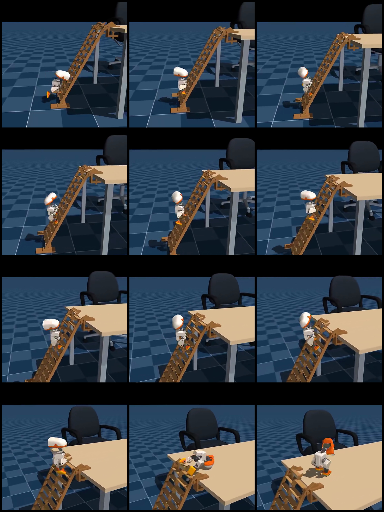
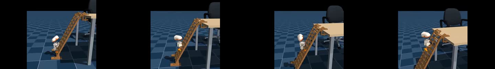
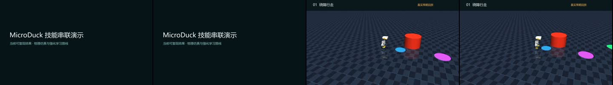
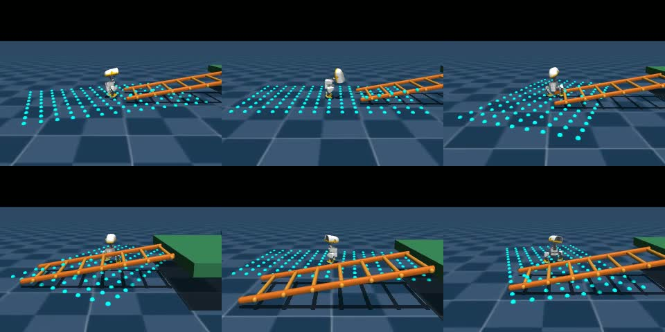
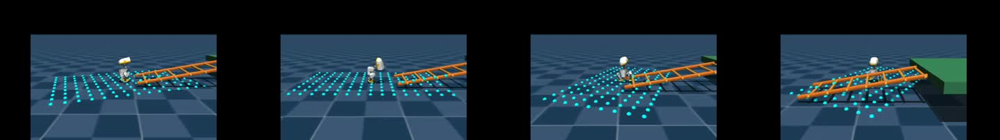
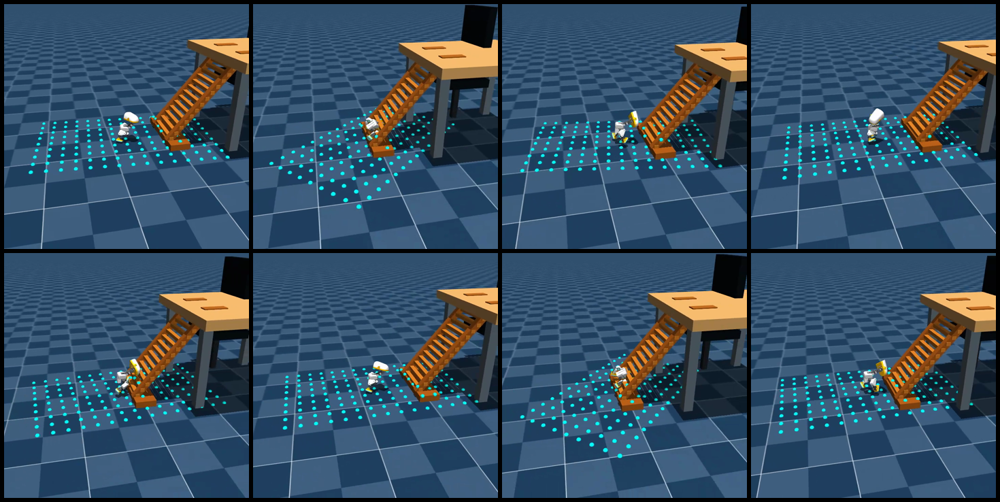
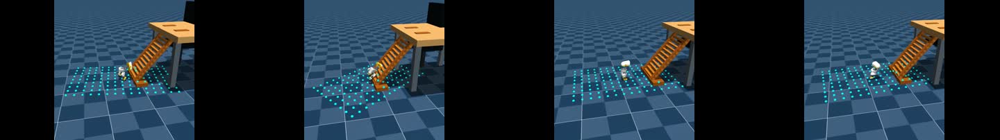
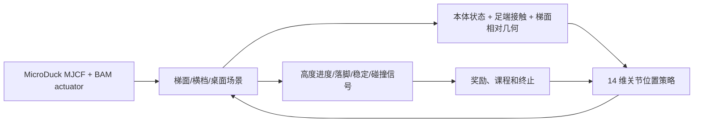

<!-- Generated by the offline translation workflow.
Source: 16-专题组队学习/05-MicroDuck运动策略与任务开发专题/01-任务资料/06-MicroDuck梯面攀爬强化学习导读/README.md
Source SHA-256: e88a0669ba3b9dfe2b5bfc6170e1fe873dd194ee7c34116162971378aae08406
Model: tencent/Hy-MT2-1.8B-GGUF:Q4_K_M
Review machine-translated technical claims before relying on them.
-->
# MicroDuck Rope Climbing: From Video Phenomenon to Replicable Reinforcement Learning Task

## Climbing the ladder and sitting at the table


MicroDuck stepped onto the steps step by step, climbed onto the tabletop, and stood steady. The above image is a 24-second GPU inference video saved in Notebook 06, using `climber/getup` two actors; MuJoCo handles the physical simulation and rendering.

| Check Item | This Record |
| --- | --- |
| Input / Output | 61-dimensional observation / 14-dimensional action, 13 command slots are zero |
| Policy Handover | Step 575, approximately 11.5 seconds |
| Standing at Desk | `stable_seconds=11.54` |
| Full Sequence | `handoff_success=true` |
| Record Range | Single GPU simulation, 1200 control steps |

## Environment and Training Path

First, run the above climbing and standing policies, and then use the V1/V2/V3 environments in this section to learn the ladder geometry, contact rewards, and course training. The task configurations, checkpoints, and evaluation results for both approaches are saved separately. The source of the dual policy model, running commands, and continued training steps are provided in Section 6 of [ and ](#6-爬梯与登桌复现步骤).

> **Local ramp experiment records:** One V3 training replay recorded at the step: `TARGET_STEPS=[28, 76, 77]`, `MAX_PHYSICAL_RUNG_TARGET=1`, `SUCCESS_COUNT=1`. Another stage C independent evaluation was obtained in `active_rungs=3` with `MAX_PHYSICAL_RUNG_TARGET=0`, `SUCCESS_COUNT=0`. These two records correspond to different training/ evaluation stages; the local course continues with single-foot alternation and continuous step targets.

The video provided by the user shows a MicroDuck climbing up a sloped ladder with handrails from the ground, then turning its body onto the tabletop. We saved the video as a frame reference for this section:



**Figure 1:** 12-frame sampling of the reference video.



**Video 1:** The original reference clips compiled in this section, used for analysis tasks and contact relationships.

### Demonstration of Skill Chain Stage

Stage combination videos for obstacle avoidance, physical disturbance, spherical balance, and ladder surface contact:



At the end of each section, mark `GroundPick` for completed demonstrations and training, continuous shifting, and top drop. The evaluation results of V3 checkpoint are shown in the numerical values and logs of this section.

## Local V1: Environment and Contact Links

The local V1 experimental task is based on the MuJoCo/MicroDuck training stack, and the following components have been added:

- Registration task: `Mjlab-Ladder-Climb-MicroDuck`;
- Use real MuJoCo collision geometry: two diagonal beams, 7 crossbeams, top platform, and stop barrier;
- Add front ray scanning for observation. The actor is expanded from 61 dimensions to 196 dimensions, and the critic is 211 dimensions;
- Rewards include forward/upward potential energy difference, upright body position, foot contact, and smooth motion;
- Success conditions require reaching the top platform while maintaining a stable posture;
- Expand the first layer input with the public MicroDuck walking checkpoint. First perform a warm start, then train the policy on the gradient surface.

In this version, the GPU 256 environment has been completed, 150 iterations of training have been performed, and a 12-second H.264 playback has been exported. The duck walks onto the ladder, physically contacts the railing, and climbs to the middle section; in this round `ladder_success=0`, the stable landing platform at the top remains a target for subsequent training.



**Figure 2:** Six moments of local V1 playback. Blue dots represent slope ray observations, and orange geometry represents real collision barriers; it can be seen that the policy has entered the slope contact phase.



**Video 2:** Replay of the partial climbing in local MuJoCo V1; the top stable platform serves as a target for subsequent inspection.

## 2.1 V2 ladder geometry recreated based on the original video

The main issue with V1 is not "changing the color of the slope," but rather the structure of the ladder does not match the reference video. V2 has been rebuilt according to the spatial relationships in the original video: a single high desktop, two rectangular side beams arranged along the slope, 14 dense horizontal crossbeams, wooden blocks for the ladder feet, four legs for the desktop, and the visual structure of the chair behind the desk. The crossbeams maintain their horizontal axis in world coordinates; they are no longer rotated into vertical barriers. All ladder beams, crossbeams, the desktop, and the ladder feet use real MuJoCo collision geometry. The slope of the ladder beams, the joint position at the top of the ladder, and the height of the desktop have also been adjusted according to the reference image to avoid the incorrect structure of "two desk panels sandwiched between a row of vertical columns."



**Figure 3:** Ladder geometry and collision preview for the V2 single-duck scenario.



**Video 3:** Warm-start preview of the V2 without support plate scenario. This checkpoint approaches from in front of the ladder feet and stops at the entrance stage, `ladder_success=0`.

To improve exploration from flat ground to narrow rails, the code provides a **training course support phase**: adding collidable continuous slopes under the same ladder beams, rails, and tables. First, practice lifting feet and maintaining body stability along the slopes, and then transfer this skill to the final task scenario without a support plate.

New code added:

- [`microduck_video_ladder_env_cfg.py`](../../../../../16-Specialized Team Learning/05-MicroDuck Movement Policy and Task Development Topic/01-Task Materials/06-MicroDuck Ladder Climbing Reinforcement Learning Introduction/code/microduck_video_ladder_env_cfg.py): Video ratio V2 scenario, real collision geometry, final task without a support plate, and support plate-related course tasks;
- [`video_ladder_mdp_terms.py`](../../../../../16-Specialized Team Learning/05-MicroDuck Movement Policy and Task Development Topic/01-Task Materials/06-MicroDuck Ladder Climbing Reinforcement Learning Introduction/code/video_ladder_mdp_terms.py): Shaping based on the foot position, while contact and success are still determined by the MuJoCo physics and termination conditions.

Locally verified task name:

```text
Mjlab-Video-Ladder-Climb-MicroDuck          # 最终：无支撑板、横档接触
Mjlab-Video-Ladder-Support-Stage-MicroDuck  # 课程：增加连续支撑板
```

In the Windows CUDA environment, the verified `.venv` entry can be used directly, avoiding the need for `uv run` to re-parse the CPU version of PyTorch:

```powershell
# 先做物理 smoke
.\.venv\Scripts\train.exe Mjlab-Video-Ladder-Support-Stage-MicroDuck `
  --env.scene.num-envs 32 `
  --agent.max-iterations 5

# 训练课程阶段，再迁移到无支撑板最终场景
.\.venv\Scripts\train.exe Mjlab-Video-Ladder-Support-Stage-MicroDuck `
  --env.scene.num-envs 256 `
  --agent.max-iterations 4000

.\.venv\Scripts\train.exe Mjlab-Video-Ladder-Climb-MicroDuck `
  --env.scene.num-envs 256 `
  --agent.max-iterations 4000 `
  --agent.resume True `
  --agent.load-run <support-stage-run> `
  --agent.load-checkpoint model_*.pt
```

When exporting the single duck video, use `--num-envs 1` of `scripts/export.py`. Do not treat the multi-environment training puzzle as the final presentation:

```powershell
.\.venv\Scripts\python.exe scripts\export.py `
  Mjlab-Video-Ladder-Climb-MicroDuck `
  --checkpoint-file logs\rsl_rl\ladder_climb_video\<run>\model_*.pt `
  --num-envs 1 `
  --video True `
  --video-length 600 `
  --video-height 720 `
  --video-width 720 `
  --onnx-file artifacts\video_ladder.onnx
```

Current status is recorded accurately: V2 geometry, task registration, physical smoke, and single-scene preview have been completed; the local short training reference remains `ladder_success=0`, and the final stable peak checkpoint has not been generated yet. Future completion criteria will be based on cross-seed success rate, maximum climbing height, contact stability time at handrails, and desktop drop video.

## 2.2 V3: Physically correct tasks planned according to landing points

The failure of V2 cannot be explained by simply training a few more rounds. After checking the model, two structural issues were identified: the ladder originally used `contype=1/conaffinity=1`, while the geometry of the robot’s body `self_collision_only` employed `contype=2/conaffinity=2`. As a result, the torso and legs could pass through the ladder beams; moreover, the reward only considers forward movement and height, so there is no reason for the policy to lift the foot to step on the next rung.

The new task corresponding to V3 is:

```text
Mjlab-Video-Ladder-Footstep-MicroDuck
```

This version retains the 14 discrete struts with their original proportions, but changes "progress" to the actual landing state machine:

- The ladder beams, crossbeams, footrests, tabletop, and drop platforms all use `contype=3/conaffinity=3`, which can simultaneously contact bit 1 on the foot sole and bit 2 on the body; the chair remains a purely visual object.
- The contact sensor reads `found/force/dist/pos/normal` from MuJoCo contact data, with negative `dist` serving as a penetration penalty.
- The body contact sensor matches only the 3 bits 2 geometry named in the original model (trunk and left/right calves), and does not misidentify valid crossbeam contact on the foot sole as a body collision with the ladder; the ladder uses `(3,3)`, the feet use `(1,1)`, and the body uses `(2,2)`; no additional trunk proxy geometry is added that would alter the original model’s self-collision topology.
- The actor/critic includes `dx/dy/dz/yaw` for the two upcoming crossbeams, gait phase, swinging feet, relative positions of both feet, actual contact, and stage observation.
- The target crossbeam only advances when the specified foot actually contacts for a period of time and the foot position falls within the tolerance; the trunk colliding with the ladder beam fails directly during the approaching and climbing stages.
- Stage A retains the full real collision of the ladder, but hard body collisions are not used as termination conditions; this failure gate is activated only after entering the first crossbeam stage, and contact force, penetration, and slip costs are recorded from the first step to avoid "learning to stand firmly" becoming a relaxed physics approach.
- The stage is `0 → 1 → 2 → 3 → 7 → 14` crossbeams, with 2 stages added for left/right foot gear shifting in MicroDuck, followed by the opening of the top drop platform; V3’s final scenario lacks continuous support plates.
- Stage G activates small-area randomization only after the nominal climbing stage is completed: `dr.pseudo_inertia` is used for random mass/inertia, along with random foot sole friction, BAM joint friction, actuator gains, and initial posture; the earlier A–F stages maintain deterministic contact dynamics to facilitate learning movements before achieving sim-to-real robustness.
- The root advancement/highness reward of V2 is removed, and rewards for foot placement error, support stability, swinging foot elevation, slip, impact, and penetration costs are added; the potential energy difference of the current target crossbeam is used for body alignment, and standing still does not continue to receive “advancement rewards”.

### V3 Reference Humanoid Robot Methods

This version does not reinvent the "climbing ladder" reward based on experience, but instead transfers the existing two-footed landing planning method to MicroDuck:

- [HR-LearningHumanoidWalking](https://github.com/qiangsun89/HR-LearningHumanoidWalking) uses `jvrc_step` with two future landing targets, alternating phase of left and right feet, as well as foot force and speed constraints during single/single support and double support stages; the landing sequence is initiated only after the target foot is truly in place. V3's `ladder_step_targets`, `ladder_phase`, and `ladder_phase_contact_velocity`, along with the physical contact state machine, follow this approach.
- [unitree_dsc_lab](https://github.com/thanhnguyencanh/unitree_dsc_lab) demonstrates a more recent approach for stairs/complex terrains: treating terrain categories, step height, step depth, and orientation as explicit terrain tokens, and training the teacher policy, perception policy, and joint policy in stages. It is an implementation of Isaac Lab + G1; V3 currently only adopts the “explicit terrain information and staged training” interface without directly transferring G1 checkpoints.
- The robots in these projects have different sizes, number of joints, action spaces, and actuators, so a humanoid checkpoint cannot be directly applied to MicroDuck. What is transferred currently are the planning and training mechanisms; MicroDuck still uses its own MuJoCo梯子, 14-dimensional action space, BAM executor, and real contact data.

Therefore, the acceptance sequence for V3 remains as follows: first learn "raising foot—contact—load-bearing—maintainance" on a single beam, then gradually expand to 3, 7, and 14 beams, and finally train top platform flipping; do not use the continuous support plate as a hidden shortcut for the final task.

### 2.3 Ladder, obstacle traversal, and picking: What steps have been achieved so far?

These three things can be integrated into a single MicroDuck teaching path, but due to different levels of maturity, they cannot be mixed together using the same "operating" standard:

| Ability | Currently reproducable content | What is missing to be considered complete |
|---|---|---|
| Ladder climbing | `climber/getup` Dual policy: climbing, reaching the table, and standing steady on GPU; V3 self-built environment already has real rail collision and foothold state machines | V3 continuous shifting evaluation, as well as dual policy BPU table handover |
| Obstacle avoidance | `microduck-rl-lab` With `walk_obstacle_entry → walk_obstacle_detour` route, the walking policy can be sent to the obstacle, avoid it from the side, and then continue | Current route uses real value coordinates from the simulator, not camera/ToF navigation; to create a perception version, obstacle detection and local target estimation need to be added |
| picking up objects | Official task `Mjlab-GroundPick-Flat-MicroDuck` is registered; 64 environments and 5 rounds of CPU smoke tasks are completed; rewards include crouching, mouth proximity, returning to the station, and contact-related items | Still requires using a complete checkpoint for stage success rate, mouth contact, and return-to-station video verification; smoke tasks cannot be considered as learned picking up behavior |

Therefore, the most reliable combination in the near future is: use the official walking policy to verify obstacle avoidance routes, continue training picking using the official GroundPick task, and train the梯面 step-by-step using the V3 independent task. These three elements can be connected by the `microduck-rl-lab` mission pipeline at the end, but the pipeline only serves as a scheduler; it cannot replace the physical verification of each skill itself.

#### Minimum reproduction commands for obstacle avoidance and picking

On an Ubuntu workstation with dependencies installed, first run smoke using 64 environments:

```bash
cd /home/ubuntu/workspaces/microduck_rl
MUJOCO_GL=egl .venv/bin/train Mjlab-GroundPick-Flat-MicroDuck \
  --env.scene.num-envs 64 \
  --agent.max-iterations 5 \
  --agent.logger tensorboard \
  --agent.experiment-name ground_pick_smoke
```

The source code for the combined route is located in `microduck-rl-lab`, and the obstacle-crossing section is currently the simulation true-value route:

```bash
cd /home/ubuntu/workspaces/microduck-rl-lab
export PYTHONPATH=/home/ubuntu/workspaces/microduck-rl-lab/src:/home/ubuntu/workspaces/microduck_rl/src
export WANDB_MODE=offline
/home/ubuntu/workspaces/microduck_rl/.venv/bin/python \
  -m microduck_playground.cli train --skill all --smoke
```

On the Ubuntu workstation, all five skills—smoke:walking, sit/stand, ground-pick, roulade, and right-foot kick—were successfully launched and saved as `model_4.pt`. This indicates that task registration and the pipeline entry are available, but these 5 checkpoint rounds are only for environment smoke testing and cannot be considered as a final model that has mastered the corresponding skills.

Before complete training, save checkpoints for walking, ground-pick, and ladder separately, and then link them through mission configuration. Do not rename a walking checkpoint to "obstacle-walking/pick-up/ladder-climbing model".

The core implementation of V3 has been merged into the experimental repository [[`mdp.py`](https://github.com/Vottivott/microduck-playground/blob/main/src/mjlab_microduck/tasks/mdp.py]). The tutorial configuration and initialization scripts are also placed there:

- [`microduck_video_ladder_footstep_env_cfg.py`](../../../../../16-Specialized Team Learning/05-MicroDuck Motion Policy and Task Development Topic/01-Task Materials/06-MicroDuck Ladder Climbing Reinforcement Learning Introduction/code/microduck_video_ladder_footstep_env_cfg.py): V3 scenario, contact sensor, observation, reward, termination, and curriculum configuration;
- [`registration_snippet.py`](../../../../../16-Specialized Team Learning/05-MicroDuck Motion Policy and Task Development Topic/01-Task Materials/06-MicroDuck Ladder Climbing Reinforcement Learning Introduction/code/registration_snippet.py): New task registration block added;
- [`prepare_ladder_footstep_bootstrap.py`](../../../../../16-Specialized Team Learning/05-MicroDuck Motion Policy and Task Development Topic/01-Task Materials/06-MicroDuck Ladder Climbing Reinforcement Learning Introduction/code/prepare_ladder_footstep_bootstrap.py): Expand the 61/76-dimensional walking checkpoint to 224/239 dimensions for V3, and initialize the new observation zero. Additionally, clear the `common_step_counter` stored in the checkpoint to avoid directly skipping the curriculum phase.
- [`test_video_ladder_footstep_cfg.py`](../../../../../16-Specialized Team Learning/05-MicroDuck Motion Policy and Task Development Topic/01-Task Materials/06-MicroDuck Ladder Climbing Reinforcement Learning Introduction/code/test_video_ladder_footstep_cfg.py): Directly compile the MuJoCo model, checking the collision mask, 14 crossbeams, initial no penetration, and curriculum boundaries.

### V3: First generate physical smoke, then train

In the Windows CUDA environment, use `.venv` that has already installed MuJoCo Warp and GPU PyTorch. Do not let `uv run` be re-parsed into a CPU environment:

```powershell
# 将已有行走策略扩展成 V3 输入宽度
.\.venv\Scripts\python.exe scripts\prepare_ladder_footstep_bootstrap.py `
  artifacts\running-baseline\checkpoint.pt `
  artifacts\ladder_footstep_bootstrap\checkpoint.pt

# 先从阶段 A 开始做 4 轮 smoke，确认课程没有跳级
.\.venv\Scripts\train.exe Mjlab-Video-Ladder-Footstep-MicroDuck `
  --env.scene.num-envs 32 `
  --agent.max-iterations 4 `
  --agent.resume True `
  --agent.load-run bootstrap_v3 `
  --agent.load-checkpoint model_0.pt
```

If the bootstrap file is placed in `logs/rsl_rl/ladder_climb_footstep/bootstrap_v3/model_0.pt`, the recovery parameters can be used directly; otherwise, replace `--agent.load-run` and `--agent.load-checkpoint` with the actual log directory.

In the root directory of the `microduck-playground-stilts` source code, physical regression can be run directly without relying on pytest:

```powershell
.\.venv\Scripts\python.exe -c "import importlib.util; p='tests/test_video_ladder_footstep_cfg.py'; s=importlib.util.spec_from_file_location('v3tests',p); m=importlib.util.module_from_spec(s); s.loader.exec_module(m); [getattr(m,n)() for n in dir(m) if n.startswith('test_')]; print('V3_DIRECT_TESTS_PASSED')"
```

This round of local acceptance results:

- The V3 task was built on CUDA/MuJoCo Warp. The actor/critic observation dimension is `224/239`, and the action dimension remains `14`;
- 32 environments and 4 rounds of smoke testing were completed. `Curriculum/ladder_stage` started from `0`, and without restoring the old walking checkpoint, it jumped to level 14;
- In 8 rounds of Phase A replay in 32 environments, `ladder_body_collision=0` was observed. This indicates that the training process does not completely clear all samples due to body collisions during the initial exploration phase;
- For 512 environments, partial contact transitions between Phase A/B entry targets have been achieved. The latest results for independent evaluation in Phase C (`active_rungs=3`, including two entry targets and the first physical rail) are `MAX_ENTRY_TARGET=1/2`, `MAX_PHYSICAL_RUNG_TARGET=0`, and `SUCCESS_COUNT=0`. This shows that the state machine and real contact auditing are working, but the current policy still stops at the ladder entrance and cannot be considered as having crossed the physical rail;
- The MuJoCo model compilation was directly passed: 14 rails, no continuous support plate, and no penetration of the ladder surface in the initial posture. When the torso is intentionally placed on the rail, MuJoCo contact data can generate actual contact between body bit 2 and the ladder bit 3;
- After changing the body contact sensor to geometric precision matching at bit 2, smoke testing in Phase B of 4 environments CUDA/MuJoCo Warp was passed. The observation remains `224/239`, and the action remains `14`. Stepping on the rail does not trigger termination due to body collision with the ladder, but the geometric body collision with the ladder is still recorded and terminated at each phase;
- This is only a verification of the physical and training processes, not the complete climbing results. There are no claims of 90% success rate for single rail, 80% for three rails, or success rate for reaching the top. The short training outputs are not used as the final demonstration videos.

Subsequent training should progress step by step through stages A–G, and the success rates of single beam, three beams, seven beams, fourteen beams, and the top landing should be recorded separately. The randomization in stage G starts from the global step count `4500 × 24` and cannot be enabled at the beginning of training, as it may mix contact issues with sim-to-real disturbances. The "beam collision replay" in V2 is still retained as a failure case and is not included in the tutorial精选 results.

When exporting a replay of a course stage, the course count must be explicitly set; otherwise, the new playback environment will start from Stage A:

```powershell
.\.venv\Scripts\python.exe scripts\export.py `
  Mjlab-Video-Ladder-Footstep-MicroDuck `
  --checkpoint-file logs\rsl_rl\ladder_climb_footstep\<run>\model_*.pt `
  --curriculum-step 4800 `
  --num-envs 1 `
  --video True `
  --video-length 300
```

For ease of continued experimentation, this section places the new environment configurations and warm-start scripts in [`code/`](../../../../../16-Team-Based Learning/05-MicroDuck Movement Policy and Task Development Special/01-Task Materials/06-MicroDuck Climbing Reinforcement Learning Introduction/code):

- [`microduck_ladder_env_cfg.py`](../../../../../16-Special Team Learning/05-MicroDuck Movement Policy and Task Development Topic/01-Task Materials/06-MicroDuck Ladder Climbing Reinforcement Learning Introduction/code/microduck_ladder_env_cfg.py): The core environment configuration for ladder scenarios, ray observations, rewards, termination, and task registration;
- [`ladder_mdp_terms.py`](../../../../../16-Special Team Learning/05-MicroDuck Movement Policy and Task Development Topic/01-Task Materials/06-MicroDuck Ladder Climbing Reinforcement Learning Introduction/code/ladder_mdp_terms.py): The forward/upward potential energy difference and success conditions for the top platform;
- [`registration_snippet.py`](../../../../../16-Special Team Learning/05-MicroDuck Movement Policy and Task Development Topic/01-Task Materials/06-MicroDuck Ladder Climbing Reinforcement Learning Introduction/code/registration_snippet.py): The minimal fragment to register a new task in the `list-envs` registry;
- [`prepare_ladder_bootstrap.py`](../../../../../16-Special Team Learning/05-MicroDuck Movement Policy and Task Development Topic/01-Task Materials/06-MicroDuck Ladder Climbing Reinforcement Learning Introduction/code/prepare_ladder_bootstrap.py): Expanding the 61/61-dimensional input of the public walking policy to 196/211 dimensions for ladder tasks, and initializing the new observation columns with zero weights.

These files are local experiment patches accompanying the tutorial. When reproducing the experiment, integrate the reward function and task registration code into the corresponding module of `microduck_rl`.

## 1. Why this is not ordinary rough-terrain walking

1. For ordinary rough terrain, the robot is mainly required to maintain its walking on unknown small steps, slopes, and height variations. The inclined ladder in the video has several additional constraints:

- The foot must provide a reliable support on the narrow struts, rather than merely touching the continuous ground surface;
- The body should rise along the slope, and the center of mass projection must not continuously fall outside the supporting polygon;
- There should be discrete gaps between the struts, and the height at which the foot is lifted, the forward swing amplitude, and the moment of landing must all be properly aligned;
- When approaching the tabletop, the last step is not “continuing to move,” but a transitional motion involving a leap, landing, and re-establishing stability;
- Once stuck on the strut, slipping, or falling, the trainer must define the failure as a measurable termination, rather than allowing the policy to obtain random height through impact.

Therefore, what needs to be replicated is a **contact-rich locomotion / climbing** task, rather than replacing a walking video with a sloping background.

## 2. Policy and Engineering References

| Item | Available Materials | Uses in this Topic |
|---|---|---|
| [HannesVonEssen/microduck-climb](https://huggingface.co/HannesVonEssen/microduck-climb) | Video of step-by-step climbing, climber/get-up policy, ONNX, PPO checkpoint, training code, and ladder model | Reference for ladder climbing actions and end-to-end implementation |
| [pollen-robotics/microduck](https://github.com/pollen-robotics/microduck) | Robot model, runtime interface | Understanding of MicroDuck ontology and deployment interfaces |
| [pollen-robotics/microduck_rl](https://github.com/pollen-robotics/microduck_rl) | MuJoCo/MuJoCo Warp, BAM executor, 14 actions/kinesthetic interface, flat/rough terrain training | Baseline for local task environment and motion policies |
| [Motphys/MotrixLab](https://github.com/Motphys/MotrixLab) | MotrixSim scenario, manager-based tasks, FastSAC and parallel training framework | Implementing ladder task version of ball balancing tasks |
| [bihaokun/microduck-step-up-policy](https://github.com/bihaokun/microduck-step-up-policy) | 25 mm single step `step_up_walk`, head braking/standing recovery policy, ONNX/checkpoint, and evaluation code | Learning of single-step foot lift, crossing, and recovery actions |
| [craigm26/duckbench](https://github.com/craigm26/duckbench) | MuJoCo physical benchmark, MicroDuck policy service, stairs/ball challenge scoring and auditing framework | Designing contact, stable drop platform, and task scoring |
| [microduck-stairs-challenge](https://huggingface.co/datasets/craigm26/microduck-stairs-challenge) | MicroDuck staircase challenge, multiple test cells and stable drop platform metrics | Designing the evaluation set for staircase tasks |
| [open-microduck](https://github.com/SaberOnGo/open-microduck) | Simulation, sim-to-real parameters, and rough terrain processing | Supplementing robot training and deployment context |

During the step-by-step reproduction process, prioritize running the policy and environment of `microduck-climb`. Local V1/V2/V3 is used to learn task implementation and further modify rewards, observations, and curriculum. The single-step policy and staircase challenge are used for learning the prior of foot movements and evaluating stability during a drop.

## 3. How should the replication architecture be structured?


```mermaid
flowchart LR
    A[MicroDuck MJCF + BAM actuator] --> B[梯面/横档/桌面场景]
    B --> C[本体状态 + 足端接触 + 梯面相对几何]
    C --> D[14 维关节位置策略]
    D --> B
    B --> E[高度进度/落脚/稳定/碰撞信号]
    E --> F[奖励、课程和终止]
    F --> D
```

**Figure 4:** A replicable task closed loop. In the first version, do not aim to master the entire process at once. Instead, break down "standing on the railing without falling" and "crossing a step" into verifiable stages.

### 3.1 Scene Layer

It is recommended to divide geometry into four modules:

1. **Sloping ladder body**: Two side beams and several crossbeams, with a clear spacing between the crossbeams;
2. **Starting ground**: Allows the robot to enter the first crossbeam from a controllable standing position;
3. **Top platform**: Simulates the takeover area of the desktop in the video;
4. **Safety envelope**: Side soft barriers or virtual collision zones, used to count out-of-bounds situations instead of allowing the robot to fall into an infinite depth.

In the first version, use simple collision geometries such as boxes/capsules instead of importing high-faceted meshes first. The realistic appearance of the ladder can be represented using a visual mesh. Try to keep the collision training with low complexity; otherwise, it will be difficult to determine whether the issue lies in the policy or in numerical problems caused by narrow intersections.

### 3.2 Observation Layer

At least the following are required:

- Base posture, angular velocity, and gravity projection;
- Position and velocity of 14 joints;
- Position, velocity, and contact state of the left and right feet;
- Relative direction/height of the current target rail or platform;
- Actions at the previous moment and action rate of change;
- Optional local depth/ray information for determining the height and gap of the forward rail.

If you want to maintain a deployment interface similar to the official MicroDuck motion policy, you can compress new information into command vectors or a few local geometric features, thereby maintaining the 61→14 control contract. If the goal is to study visual climbing, you should explicitly add a visual encoder instead of silently feeding the full ladder state to the actor.

### 3.3 Reward Layer

An interpretable first-version reward can be written as:

| Reward Group | Objective |
|---|---|
| Ascending Progress | Encourage the base/center of mass to rise along the ladder, but limit single-step jumps |
| Foot Contact Quality | Encourage stable contact near the target rung with the foot sole |
| Body Stability | Penalize excessive roll/pitch, lateral speed, and joint impact |
| Task Phases | Separate latch/phase rewards for crossing the rung, standing steady, and reaching the platform |
| Energy Consumption and Smooth Motion | Penalize large movements, joint limits, and high-frequency jitter |
| Failure Gate Control | Direct termination upon falling off the ladder, torso collision, foot getting stuck in a geometry object, or numerical divergence |

Especially, prevent the "high progress reward" from being exploited by the policy to cause jumps or collisions. For stair tasks, effective foot support, body orientation, and complete stability time must be included in the success conditions.

## 4. Recommended training courses

It is not recommended to include the entire inclined ladder, desktop, and complex friction in the 4096 environments from the start. You can increase the difficulty level step by step according to the following courses:

1. **Stage A: Stable standing on a single beam**. The robot starts from the beam and first learns to maintain its posture for 3–5 seconds;
2. **Stage B: From ground to single beam**. The step height is fixed, with a reward for standing stable after crossing;
3. **Stage C: Continuous low steps**. Random beam spacing and slight friction are applied, limiting the impact of stepping on the ground;
4. **Stage D: Slanted ladder**. The slope, beam spacing, and target height are gradually increased;
5. **Stage E: Top platform**. The final crossing step is added, followed by returning to the platform;
6. **Stage F: Disturbances and domain randomization**. Mass, friction, actuator delay, and initial posture disturbances are introduced.

At each stage, save the success rate across seeds, maximum climbing height, stabilization time, number of collisions, and the first failure position. Only saving a video of "just getting up" does not indicate that the policy has learned to stabilize the climb.

## 5. How to run the open-source baseline at this stage

### 5.1 Official MicroDuck rough-terrain baseline

Check the current task registry in the root directory of the `microduck_rl` repository first, as the upstream task name may be updated:

```bash
uv sync
uv run list-envs
```

According to the currently available task list, the rough terrain baseline usually starts with the following tasks:

```bash
uv run train Mjlab-Velocity-Rough-MicroDuck
```

The goal of this step is to verify that the robot body, BAM actuator, rough terrain, policy input/output, and video export link are all functioning properly. It is not the result of ladder climbing.

#### 5.1.1 Materials for Reproduction of the Rough Terrain

This time, a public [[`RemiFabre/microduck-rough-walk-g`](https://huggingface.co/RemiFabre/microduck-rough-walk-g) policy is used. A replayable output was rendered off-screen using MuJoCo on an Ubuntu workstation. The policy interface uses the `61-D observation -> 14-D action` model, with a control frequency of 50 Hz and a speed command of `vx=0.30 m/s`.

Reproduction script:

```bash
python scripts/render_rough_walk_video.py \
  --policy /path/to/policy.onnx \
  --output outputs/rough_walk_g_reproduction.mp4 \
  --seconds 12 \
  --command 0.30
```

To make the terrain changes in the material truly move within a video, compact courses and close-up shots can be used:

```bash
MUJOCO_GL=egl python scripts/render_rough_walk_video.py \
  --policy /path/to/policy.onnx \
  --output outputs/rough_walk_g_compact_close.mp4 \
  --seconds 18 --width 1280 --height 720 \
  --command 0.30 \
  --camera-distance 1.45 --camera-lookahead 0.52 \
  --compact-course --center-y-gain 1.0 --max-lateral-command 0.30
```

In the playback of the modified Ubuntu workstation policy, the public policy maintains a closed loop at `61-D observation -> 14-D action`, with the root moving approximately `0.88 m`, covering a range of `y` which is about `-0.225–0.012 m`, and the root height being approximately `0.114–0.135 m`. No fall occurred. The display scenario is changed to a continuous, horizontal low steps with ramps, and a closed loop in horizontal velocity keeps the video path near the center of the course; this is not a policy obtained through re-training, but merely an addition of playback control to the public speed policy without target point input. The selected videos and trajectory audit files are located at `microduck-live-materials-20260912/08_latest_additions/04_rough_walk_g_reproduction/`, and `05_workstation_reproduction_centered_course_v2.mp4` is recommended for use. This video is used to illustrate the reasoning and rendering process of the public rough-terrain policy, and is not equivalent to the original complete training scenario, nor does it represent the completion of the physical duck deployment; the model card clearly positions it as a simulation verification policy.

### 5.2 Staircase Challenge Baseline

`craigm26/microduck-stairs-challenge` is more suitable for learning evaluation design: it distinguishes between "actually standing on the step surface" and "the foot touching the step," and evaluates results using a stable landing surface and multiple test cells. This approach can be directly applied to our ladder surface task: the success criteria must include support, posture, and duration.

Reference for the step-by-step ladder climbing policy: [ HannesVonEssen/microduck-climb](https://huggingface.co/HannesVonEssen/microduck-climb). The video demonstrates how the ducklings step onto the rungs one by one; the page provides climbing/standing strategies, ONNX, PPO checkpoints, environment code, and ladder models. Its control interface involves 61-dimensional observations and 14-dimensional actions, and policy switching is determined based on foot contact in simulation and root position.

### 5.3 MotrixLab Route

The MotrixLab special topic has now been connected to `microduck-ball-balance`; the implementation reference for step-by-step climbing is located in `Vottivott/microduck-playground`. If you want to train similar tasks in MotrixLab, you need to add configuration for the ladder surface scenario and contact tasks:

```text
motrix_envs/src/motrix_envs/locomotion/ladder_climb/
configs/task/microduck-ladder-climb/motrix.fastsac.yaml
```

New tasks should reuse the `Microduck` robot registry, manager observations/actions/rewards/terminations, and then register the ladder surface scenario and contact queries. The trainer can use FastSAC for smoke testing first; when comparing algorithms, align with the official PPO scheme and control variables accordingly.

### 5.4 Running Process of Local MuJoCo V1

Here is the process used in practice. The task registration API for `microduck_rl` may change with the upstream version. Before running, use `list-envs` to confirm the task name:

```bash
git clone https://github.com/Vottivott/microduck-playground.git
cd microduck-playground
uv sync
uv run list-envs
```

Copy the environment configuration and warm-start script from this section [[`code/`](../../../../../16-Special Team Learning/05-MicroDuck Movement Policy and Task Development Topic/01-Task Materials/06-MicroDuck Climbing Reinforcement Learning Introduction/code)]) to the corresponding directory, and register `Mjlab-Ladder-Climb-MicroDuck` in the task table. Then, you can perform 5 iterations of physical smoke testing first:

```bash
uv run train Mjlab-Ladder-Climb-MicroDuck \
  --env.scene.num-envs 32 \
  --agent.max-iterations 5
```

Use the public walking checkpoint to generate the initialization weights for the ramp input dimension, and start a small-scale training:

```bash
python scripts/prepare_ladder_bootstrap.py \
  --source artifacts/running-baseline/checkpoint.pt \
  --output artifacts/ladder_bootstrap/checkpoint.pt

uv run train Mjlab-Ladder-Climb-MicroDuck \
  --env.scene.num-envs 256 \
  --agent.max-iterations 4000 \
  --agent.resume True \
  --agent.load-run bootstrap \
  --agent.load-checkpoint model_0.pt
```

On Windows, if `uv run` re-parses dependencies and causes the installation of the CPU version of PyTorch, you should directly call the environment that has been verified for CUDA, for example:

```powershell
.\.venv\Scripts\train.exe Mjlab-Ladder-Climb-MicroDuck `
  --env.scene.num-envs 256 `
  --agent.max-iterations 4000
```

`model_*.pt` from the training output used during playback:

```powershell
.\.venv\Scripts\play.exe Mjlab-Ladder-Climb-MicroDuck `
  --checkpoint-file logs\rsl_rl\ladder_climb\<run>\model_*.pt `
  --num-envs 1 --video True --video-length 600
```

The 150 iterations of V1 in this section are merely "environment and physical contact verification" and are not sufficient to serve as the final training budget. Next, a curriculum of single straights, low slopes, continuous straights, complete inclined stairs, and top platforms should be implemented as described in Section 4, rather than assuming that 4000 full-stair training sessions will inevitably yield success.

## 6. Steps for Reproduction of Climbing Ramp and Board Climbing

### 6.1 Getting the Environment and Model

This section uses the [Vottivott desk-climb task ](https://github.com/Vottivott/microduck-playground/tree/main/experiments/desk-climb), corresponding to the model [HannesVonEssen/microduck-climb](https://huggingface.co/HannesVonEssen/microduck-climb). Prepare the following files:

- [11.77 seconds video of stepping on steps sequentially ](https://huggingface.co/HannesVonEssen/microduck-climb/resolve/main/media/preview.mp4)
- [Policy, model, and demo pages ](https://huggingface.co/HannesVonEssen/microduck-climb): `climber.onnx` / `climber.pt` are responsible for climbing, while `getup.onnx` / `getup.pt` handle standing up; both sets provide training checkpoints and model hashes.
- [Training and reproduction instructions ](https://github.com/Vottivott/microduck-playground/blob/main/experiments/desk-climb/TRAINING.md): Includes environment code, dependency locking, retraining scripts, training/ evaluation configurations, and trajectory records.
- [Ladder structure and generation files ](https://github.com/Vottivott/microduck-playground/blob/main/hardware/ladder/README.md): Model and printing scheme for a desktop ladder. The software license is Apache-2.0, while the hardware files follow a separate CC-BY-NC-SA-4.0 license.

Get the environment on Ubuntu, lock down dependencies, and download models:

```bash
git clone https://github.com/Vottivott/microduck-playground.git
cd microduck-playground/experiments/desk-climb/source
uv sync --frozen
uv run ../training/download_models.py
```

### 6.2 Alignment Actions and Switching Rules

Both actors are `61 → 14`, 13 command slots remain at zero value, and the normalization parameters are included in ONNX. During the climbing phase, `climber` generates joint target offsets; when at least one foot truly touches the table surface and the robot's base enters the edge of the table by 4 cm, the supervisor switches to `getup` to stand up.

The running parameters must also be consistent with the training: `climber` has no filtering; for `getup`, the head filtering coefficient is `0.5`, and the legs have a value of `0.7`. The joint gain ratio is `0.8`. The previous action slot in the observation preserves the original policy output from the previous moment; actual joint control uses the post-processing actions for the corresponding phase. Switch detection is performed by the simulation supervisor to read the contact and root positions, while the actor only reads the body observations.

### 6.3 Running GPU Inference

Open [Notebook 06](../../../../../16-专题组队学习/05-MicroDuck运动策略与任务开发专题/03-Notebook/06_梯面攀爬_接触与部署模板.ipynb), set the climbing environment directory and two ONNX paths, and then run the GPU inference unit. The special script can also be executed in the above `source` environment:

```bash
uv run python /path/to/microduck-playground-stilts/scripts/bpu_official_ladder_pair_video.py \
  --backend gpu \
  --official-root /path/to/microduck-playground/experiments/desk-climb \
  --climber-onnx /path/to/climber.onnx \
  --getup-onnx /path/to/getup.onnx \
  --num-envs 64 --record-env 17 --seed 123 --seconds 24 \
  --output /path/to/03-Notebook/outputs/gpu_videos/ladder_gpu_latest.mp4
```

The script generates an MP4 file as well as a JSON file with the same name. Check `switch_events`, `handoff_success`, and `stable_seconds`, which correspond to the handover moment, complete sequence success, and continuous standing on the desktop, respectively. The saved result shows a handover at step 575 with a standing time of 11.54 seconds; the scene is not reset after falling during recording.

### 6.4 Continue Training and Evaluation

Still in `experiments/desk-climb/source`, first verify sampling, updating, and saving, then continue training the two actors separately:

```bash
uv run ../training/run.py climber --envs 64 --iterations 5 --out /tmp/desk-climber-smoke
uv run ../training/run.py getup --envs 64 --iterations 5 --out /tmp/desk-getup-smoke

uv run ../training/run.py climber --envs 1024 --iterations 250 --seed 233 --out logs/desk-climber
uv run ../training/run.py getup --envs 1024 --iterations 128 --out logs/desk-getup

uv run ../training/run.py evaluate --envs 64 --seconds 60 --seed 19923 --out logs/desk-eval
```

These commands continue training from the released PPO checkpoints, preserving the corresponding actor, critic, and Adam states. The new model is re-exported as normalized ONNX, and then the contact, transition, and standing time are verified; for the training process in the V1/V2/V3 self-built environments, see the previous text.

### 6.5 Switch to RDK X5 BPU

Compile both ONNX files into HBM respectively, and launch the climbing and standing inference services on RDK; Ubuntu retains the same physical scenario and handover supervisor. When running the script, select `--backend bpu`, set `--climber-hbm`, `--getup-hbm`, and `--bpu-host`, as well as the service ports, and then evaluate using the same set of JSON metrics.

The BPU ramp video records `switch_events=[]`, `handoff_success=false`, and `stable_seconds=0` in the current archive are marked as "Ramp Contact" in the overall demonstration overview. The complete table-approach video uses the GPU results from this section. Solid robots need to integrate equivalent contact detection and task switching.


## 7. Reference Materials

- [Pollen Robotics MicroDuck](https://github.com/pollen-robotics/microduck)
- [Pollen Robotics MicroDuck RL](https://github.com/pollen-robotics/microduck_rl)
- [MotrixLab](https://github.com/Motphys/MotrixLab)
- [MicroDuck Ladder Climbing Policy, Demonstration, and Model](https://huggingface.co/HannesVonEssen/microduck-climb)
- [MicroDuck Ladder Climbing Training Code](https://github.com/Vottivott/microduck-playground/tree/main/experiments/desk-climb)
- [MicroDuck Stilt Policy, Model, and Demonstration](https://huggingface.co/HannesVonEssen/microduck-stilts)
- [MicroDuck Step-Up Policy (25 mm Single Step)](https://github.com/bihaokun/microduck-step-up-policy)
- [duckbench: MicroDuck MuJoCo Benchmark and Challenge Tools](https://github.com/craigm26/duckbench)
- [Microduck Stairs Challenge Dataset and Scoring Instructions](https://huggingface.co/datasets/craigm26/microduck-stairs-challenge)
- [open-microduck Independent Reproduction Project](https://github.com/SaberOnGo/open-microduck)
- [LadderMan: Perception of Ladder Climbing Research Reference](https://arxiv.org/abs/2606.05873)
