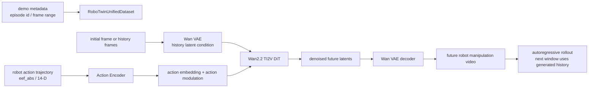

# BWM: Tongji Boundless Team's Action Condition World Model

This section corresponds to the **Boundless-World-Model** released by the Tongji University Boundless Large Model Lab open source project, abbreviated as **BWM**. The project repository is [boundless-large-model/boundless-world-model](https://github.com/boundless-large-model/boundless-world-model), and the model weights are published in [BLM-Lab/Boundless-World-Model](https://huggingface.co/BLM-Lab/Boundless-World-Model).

BWM follows RAW-Dream, WoG, WALL-WM, RoboDream, and Gamma-World in the world-model route. It defines a **physically consistent, action-conditioned video world model** intended to provide a low-cost, high-fidelity video-level simulator for robot manipulation.

After completing this section, everyone needs to grasp a key judgment:

> BWM is not the VLA policy itself, nor is it an ordinary video model that only generates videos from text. It is based on Wan2.2-TI2V-5B, where the robot trajectory is injected into the video diffusion model as a condition. Thus, the model generates subsequent robot manipulation videos autoregressively starting from the initial observations and action sequences.

Its uses can be summarized as follows:

```text
初始图像 / 历史视频帧
        +
机器人动作轨迹
        ↓
动作条件视频世界模型
        ↓
未来操作视频 rollout
        ↓
评估动作是否合理、生成数据、辅助策略训练或调试
```

The relationship between these models and VLA is complementary. VLA outputs actions, while BWM predicts the consequences of these actions in the visual world. It does not directly control the robot, but can serve as a data engine, a policy evaluator, or an imagined rollout module.

## 1. Open-source Status and Entry Points

| Item | Current Status |
| :--- | :--- |
| GitHub | [boundless-large-model/boundless-world-model](https://github.com/boundless-large-model/boundless-world-model), Apache-2.0 |
| Hugging Face | [BLM-Lab/Boundless-World-Model](https://huggingface.co/BLM-Lab/Boundless-World-Model) |
| Base Model | [Wan2.2-TI2V-5B](https://github.com/Wan-Video/Wan2.2) |
| Dependency Framework | [DiffSynth-Studio](https://github.com/modelscope/DiffSynth-Studio) |
| Evaluation List | [WorldArena Hugging Face Space](https://huggingface.co/spaces/WorldArena/WorldArena) |
| Published | Inference code, model definition, model weights |
| Unpublished | Training code and technical reports are still being written |

The most suitable approach at present is not to reproduce the training from scratch, but rather:

1. Read the model description to understand the difference between the action condition world model and ordinary video generation models.
2. Download the Wan2.2-TI2V-5B base model and BWM checkpoint.
3. Run `scripts/infer_example.sh` using the `demo/` data provided by the repository.
4. Compare the generated video to verify whether the robot actions, object states, and contact relationships remain consistent.

## 2. How to interpret WorldArena results

<p align="center">
  
</p>

**Figure 1: WorldArena Track 1 Open Source Ranking.** BLM ranks first in the open-source models, with metrics covering visual quality, motion quality, content consistency, physical adherence, 3D accuracy, and controllability.

Source: [ BWM official GitHub repository ](https://github.com/boundless-large-model/boundless-world-model).

<p align="center">
  
</p>

**Figure 2 WorldArena Track 2 Data Engine open-source ranking.** The README indicates that BLM ranks first in the Track 2 Data Engine open-source model.

Source: [ BWM official GitHub repository ](https://github.com/boundless-large-model/boundless-world-model).

<p align="center">
  
</p>

**Figure 3: WorldArena Track 1 overall ranking.** In the README, it is noted that BWM-fast ranks 2nd in Track 1 overall, which corresponds to the "open source first, closed source second" scenario mentioned by users.

Source: [ BWM official GitHub repository ](https://github.com/boundless-large-model/boundless-world-model).

These lists should be understood separately.

| Name | Intuitive Meaning | Location of BWM/BLM |
| :--- | :--- | :--- |
| Track 1 open-source | Ranking of action-conditioned world models of open-source models only | BLM ranks 1st |
| Track 2 Data Engine open-source | Ranking related to open-source data engines only | BLM ranks 1st |
| Track 1 overall | Comparison of open-source and closed-source models | BWM-fast ranks 2nd |

The metrics of WorldArena do not solely focus on "how similar the video is". As can be seen from the list of criteria, it evaluates Visual Quality, Motion Quality, Content Consistency, Physics Adherence, 3D Accuracy, and Controllability simultaneously. For a robot world model, the last three items are particularly crucial: the model must maintain consistency in object identity, spatial structure, action conditions, and physical constraints. Otherwise, no matter how beautiful the generated video is, it cannot be used to serve robots.

## 3. The Position of BWM in the world model lineage

Several types of world model introductions have been provided in this repository. BWM can be placed at the following coordinates for better understanding:

| Method | Input Conditions | Output | Primary Use |
| :--- | :--- | :--- | :--- |
| RAW-Dream | Current image, task, action, world model reward | Imagined rollout and RL update | Reinforce VLA in task-independent world models |
| WoG | Latent condition distilled from future observations | Action-related conditional features | Enhance VLA action prediction |
| WALL-WM | Current observation, event-level action conditions | Event-level future video and actions | Long-term domain simulation |
| RoboDream | Robot-only trajectory, scene prior, object prior | Synthetic robot teaching video | Data generation |
| Gamma-World | Multi-agent multi-view observation and actions | Shared world video stream | Multi-agent world modeling |
| **BWM** | Initial frame/historical frame + robot action trajectory | Action-condition future video rollout | Robot operation world simulation, data engine, evaluation |

BWM and WALL-WM are very similar, both being world models for action condition videos. However, BWM is currently more open-source and focuses on engineering inference interfaces: it provides inference code, checkpoints, demo data, and WorldArena results for Wan2.2-TI2V-5B. WALL-WM emphasizes the breakdown of the paper methods for event-level world action modeling. Both can be compared together.

## 4. Overall Architecture: How Wan2.2 Video Model Integrates Actions

The key information provided by the Hugging Face model card is:

| Attribute | Current public information of BWM |
| :--- | :--- |
| Base Model | Wan2.2-TI2V-5B |
| Resolution | 480 x 640 |
| Frames | 81 frames |
| Control Signals | Robot action trajectories |
| Architecture | Trainable DiT + Action Encoder |

In the warehouse inference configuration, `configs/infer/infer.yaml` is used. The public parameters include `height=672`, `width=896`, `num_frames=57`, `num_history_frames=9`, `fps=24`, `action_dim=14`, `action_type=eef_abs`, and `action_mode=adaln`. This indicates that the actual demo configuration is not completely equivalent to the model card summary: the model card describes the capability boundaries, while the warehouse configuration describes the current example inference profile.

The open-source architecture of BWM can be understood as the following chain:



There are several key points here.

First, BWM is not text-driven. In the inference configuration, `text_mode: none` is used, and in the code, the text path for Wan2.2 TI2V is disabled. The model primarily relies on historical video frames and trajectory data to control future generation.

Second, the action is not a post-processing label, but enters the DiT generation process. In open-source code, `WanVideoActionEncoder` encodes the action sequence into `action_emb` and `action_mod_emb`. Under `action_mode=adaln`, the action modulation is added to the time modulation embedding, and the action embedding enters the context sequence. This means that each denoising step knows "what the robot will do next".

Third, BWM uses historical frames to constrain autoregressive generation. `scripts/infer.py` first retains the historical frames of the input video, and then generates future frames based on windows; when generating the next segment, the already generated video frames serve as new historical conditions. This design enables it to perform long-time-domain rollout, rather than generating only a fixed short segment.

## 5. Autoregressive rollout: Why it resembles a low-cost simulator

The repository README states that BWM can serve as a low-cost, high-fidelity simulator for robotic manipulation. Here, the 'simulator' should not be interpreted as a explicit physics engine like MuJoCo/Isaac Sim. It is more similar to a neural video simulator:

| Traditional Physical Simulator | BWM type video world model |
| :--- | :--- |
| Inputs: URDF/MJCF, physical parameters, control variables | Inputs: initial visual observations, historical frames, action trajectory |
| Explicitly simulates rigid bodies, joints, collisions, contacts | Learns visual and physical outcomes from data |
| Outputs: state, image, mechanical quantities | Mainly outputs future video |
| Explanable and controllable, but high modeling cost | High realism and low modeling cost, but physical reliability requires evaluation constraints |

The autoregressive logic of BWM comes from `scripts/infer.py`:

1. Read an episode from the demo metadata.
2. Read the initial video frames and action trajectory.
3. Use `num_history_frames` as the historical condition.
4. Generate future frames for the current window based on the action sequence.
5. Reconstruct the history with the newly generated frames.
6. Repeat until the target episode length is covered.
7. Output `outputs/inference/episode*.mp4`.

This is where it “acts like a simulator”: given a sequence of actions, it outputs the visual consequences after those actions are executed. However, it has limits: the output is mainly video, not a complete physical state that can be queried; the model may accumulate errors over a long time horizon; whether it can support closed loop policy training depends on how the action space, observation interface, error evaluation, and reward design are integrated.

## 6. Qualitative Results: See What It Will Predict

The following groups of GIFs are all from the official README. They show the manipulation of BWM on the WorldArena test set, where it generates action videos via autoregressive generation from the initial frame and motion sequences.

<table>
  <tr>
    <td width="50%" align="center">
      
      <br><strong> Figure 4a: Sorting blocks by size</strong>
    </td>
    <td width="50%" align="center">
      
      <br><strong> Figure 4b: Turning on the microwave</strong>
    </td>
  </tr>
  <tr>
    <td width="50%" align="center">
      
      <br><strong> Figure 4c: Hanging a cup</strong>
    </td>
    <td width="50%" align="center">
      
      <br><strong> Figure 4d: Passing blocks with both hands</strong>
    </td>
  </tr>
</table>

Source: [ BWM official GitHub repository ](https://github.com/boundless-large-model/boundless-world-model).

These examples cover several different difficulties.

Arranging blocks by size examines the identity preservation of multiple objects, spatial order, and contact stability. If the world model only generates videos that “look like a robot moving,” it is easy for the identities of the blocks to drift, the size relationships to become disordered, or the blocks to jitter after placement.

The object being examined in the microwave is an articulated object. The door does not float freely; instead, it rotates around the hinges. Its state changes from closed to open, and it must remain in this state throughout subsequent frames.

The hanging cup experiment examines fine-grained affordances. The model must understand the relationship between the handle, hook, gripper contact position, and the final hanging state.

Bridging blocks with both arms examines multi-robot coordination and occlusion. When two robotic arms approach the same object, the world model must maintain the continuity of the object to prevent the object from disappearing or jumping abruptly after a brief occlusion.

<p align="center">
  
</p>

**Figure 5 Long-time domain constraint placement.** Placing objects into a cabinet requires transportation, shielding, and final spatial constraints, which tests long-time domain consistency more severely than single-step grasping.

Source: [ BWM official GitHub repository ](https://github.com/boundless-large-model/boundless-world-model).

What is most noteworthy in these examples is not the image quality of a single frame, but whether the physical and task states remain consistent. A high-quality world model must at least ensure that objects do not change randomly, the contact relationship between the gripper and objects is reasonable, the direction of change in actions can be controlled, and the state after completing the task can be preserved.

## 7. OOD Generalization: Can it still work after changing the initial scenario?

<table>
  <tr>
    <td width="50%" align="center">
      
      <br><strong> Figure 6a OOD initial scenario example 1</strong>
    </td>
    <td width="50%" align="center">
      
      <br><strong> Figure 6b OOD initial scenario example 2</strong>
    </td>
  </tr>
</table>

Source: [ BWM official GitHub repository ](https://github.com/boundless-large-model/boundless-world-model).

The official README also shows OOD generalization: generate new initial scenes using GPT-Image-2, then use the original robot action sequence to perform an autoregressive rollout of BWM. The question this test aims to answer is: does the model only remember the initial frames of the benchmark, or can it continue to predict dynamics based on action conditions after changes in object appearance, layout, or background.

Understand this carefully. The OOD GIF indicates that the model has a certain ability for visual transfer, but it does not mean that real closed loop generalization has been resolved. There are three reasons for this:

- The action sequences still come from the original benchmark, not planned by the model itself.
- The initial graph is generated by an image generation model, and there is still a gap compared to real sensor noise, camera calibration, and robot control errors.
- Successful video rollout does not equal successful policy execution, unless it is subsequently integrated into reward, policy update, or online closed loop evaluation.

## 8. How to run the official reasoning demo

This section only describes the reasoning reproduction, without covering training reproduction, as the official README still marks training as `Coming soon`.

It is recommended to prepare a Linux + CUDA machine. The README suggests using Python 3.10.20, PyTorch 2.8.0 cu128, and DiffSynth 2.0.11. The repository dependencies also include `numpy==1.26.4`, `omegaconf==2.3.0`, `imageio`, `imageio-ffmpeg`, `pyarrow`, `Pillow`, `einops`, `tqdm`, and `safetensors`.

Execute in the root directory of the project:

```bash
git clone https://github.com/boundless-large-model/boundless-world-model.git
cd boundless-world-model

conda create -n BWM python=3.10.20
conda activate BWM

pip install torch==2.8.0 torchvision==0.23.0 torchaudio==2.8.0 \
  --index-url https://download.pytorch.org/whl/cu128
pip install diffsynth==2.0.11
pip install -r requirements.txt
```

Download Wan2.2-TI2V-5B base model:

```bash
modelscope download --model Wan-AI/Wan2.2-TI2V-5B \
  --local_dir models/Wan2.2-TI2V-5B
```

Download BWM checkpoint:

```bash
hf download BLM-Lab/Boundless-World-Model step-12000.safetensors \
  --local-dir ckpt/BLM
```

Copy the local path configuration:

```bash
cp scripts/local.example.sh scripts/local.sh
```

Then edit `scripts/local.sh`, and change the path to your machine path. The key variable in the official example is:

```bash
export CUDA_VISIBLE_DEVICES="0"

CONFIG_PATH="configs/infer/infer.yaml"
PYTHON_BIN="python"
MODEL_PATHS="/path/to/Wan-AI/Wan2.2-TI2V-5B"
CKPT_PATH="ckpt/BLM/step-12000.safetensors"
DATASET_BASE_PATH="demo"
DATASET_METADATA_PATH="demo/demo.jsonl"
ACTION_STAT_PATH="demo/stat.json"
OUTPUT_PATH="outputs/inference"
MAX_SAMPLES="1"
```

Run inference:

```bash
bash scripts/infer_example.sh
```

When successful, the script will print the resolved config, sample information, window rollout progress, and generate `episode*.mp4` under `outputs/inference/`. This smoke test proves four things: the Wan2.2 base can be loaded, the BWM checkpoint can be loaded, the demo video and trajectory can be read, and the action condition autoregressive generation pipeline works properly.

It does not prove three things: it does not prove that the training code is usable, it does not prove that the WorldArena ranking scores can be reproduced, and it does not prove that your custom robot data can directly yield equivalent results.

## 9. How to understand the configuration parameters

There are several parameters in `configs/infer/infer.yaml` that deserve separate attention.

| Parameter | Example Value | Meaning |
| :--- | :--- | :--- |
| `num_frames` | `57` | The number of frames processed per generation window |
| `num_history_frames` | `9` | The number of historical frames used as conditions |
| `time_division_factor` | `4` | Aligning the Wan latent time grouping |
| `action_type` | `eef_abs` | Using an end effector absolute pose-based action |
| `action_dim` | `14` | Action dimension, usually corresponding to a dual-arm or multi-degree-of-freedom end state |
| `action_mode` | `adaln` | Action injection into DiT via AdaLN/time modulation |
| `cfg_scale` | `1.0` | The strength of classifier-free guidance during inference |
| `num_inference_steps` | `50` | Number of diffusion denoising steps |
| `fps` | `24` | Output video frame rate |

If you want to integrate your own data, the most important thing is not to modify the model first, but to align the data interface: video frames, action sequences, episode metadata, and action normalization statistics must be consistent. Otherwise, even if the model runs, it may generate incorrect dynamics due to errors in action scale or time alignment.

## 10. What is its relationship with VLA reproduction

BWM itself is not a policy, but it has three potential uses for VLA.

The first is the **offline evaluation of trajectory**. Given the action trajectory output by VLA, BWM can generate visual consequences to help determine whether the action will cause object movement, door opening, cup hanging, or task failure.

The second is **data generation**. If the world model is reliable enough, it can be used to extend video supervision under different initial states, object appearances, and action variants, serving for policy training downstream.

Third is **imagined rollout / RL**. Similar to the RAW-Dream approach, in the future, BWM can be connected to a reward model or VLM judge. The quality of actions in the video generated by the model can be evaluated, and then the policy can be improved accordingly.

But all these uses depend on one premise: the world model must be sensitive to actions, and the physical errors must be minimal. If the model generates visually reasonable videos without strictly adhering to the action conditions, it will mislead policy training.

## 11. Current boundary

BWM is now very worth following, but be careful with the boundaries when using it.

First, the technical report has not been published yet. Many training details, data formulations, WorldArena submission strategies, and ablation methods cannot be systematically confirmed from the paper.

Second, the training code has not been released yet. The current tutorial can only guide users on running inference and reading model structures, but it cannot promise to reproduce the training process.

Third, the WorldArena performance is based on the official README and screenshot of the ranking. It indicates that BWM is strong under the ranking protocol, but it does not mean that it is reliable across all robots, all cameras, and all motion spaces.

Fourth, the BWM output is primarily in video format. It does not provide interpretable physical states, contact forces, joint states, or collision constraints like MuJoCo or Isaac Sim. If used for closed loop control, additional design is required for state extraction, reward, uncertainty, and failure detection.

## 12. The most valuable point to learn from this

What BWM is most worth learning about is its engineering approach to transforming the general video generation foundation into a world model for robots:

| Design Point | Value |
| :--- | :--- |
| Choose Wan2.2-TI2V-5B | Inherit strong video generation priors, rather than training the video diffusion model from scratch |
| Introduce Action Encoder | Enable robot motion trajectory to participate in the generation process; the model does not just "continue the video" |
| Use AdaLN action modulation | Let actions influence the temporal dynamics during diffusion denoising |
| Historical frame conditions | Maintain the initial scene, object identities, and local visual consistency |
| Autoregressive window rollout | Support long-term video prediction |
| WorldArena multi-metric evaluation | Evaluate not only image quality, but also controllability, physical adherence, and 3D accuracy |

For students in this course, this article can serve as a great starting point for “engineering a world model with embodied cognition”. It includes ranking scores, code, and weights, while also retaining enough unpublished details to remind us not to equate the world model demonstration video with an actual simulator.

## 13. Reference Links

- [Boundless-World-Model GitHub](https://github.com/boundless-large-model/boundless-world-model)
- [BLM-Lab/Boundless-World-Model Hugging Face](https://huggingface.co/BLM-Lab/Boundless-World-Model)
- [WorldArena Hugging Face Space](https://huggingface.co/spaces/WorldArena/WorldArena)
- [Wan2.2 GitHub](https://github.com/Wan-Video/Wan2.2)
- [DiffSynth-Studio GitHub](https://github.com/modelscope/DiffSynth-Studio)
- [WorldArena GitHub](https://github.com/tsinghua-fib-lab/WorldArena/)
- [ABot-PhysWorld GitHub](https://github.com/amap-cvlab/ABot-PhysWorld)
