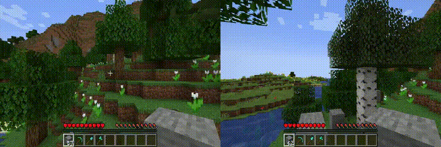
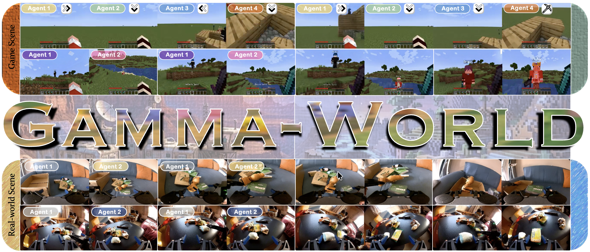
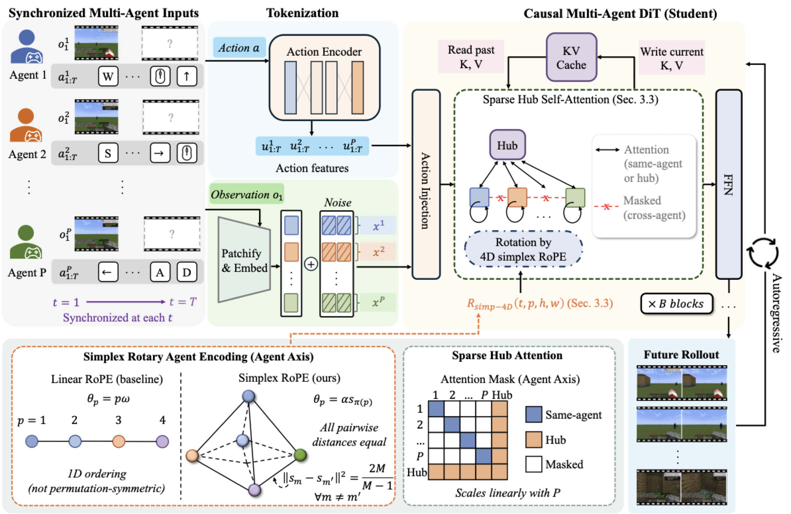
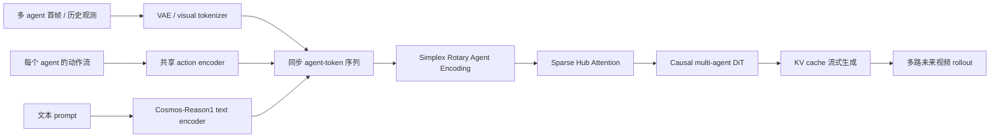
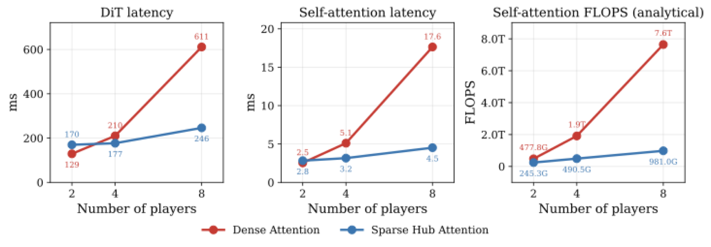
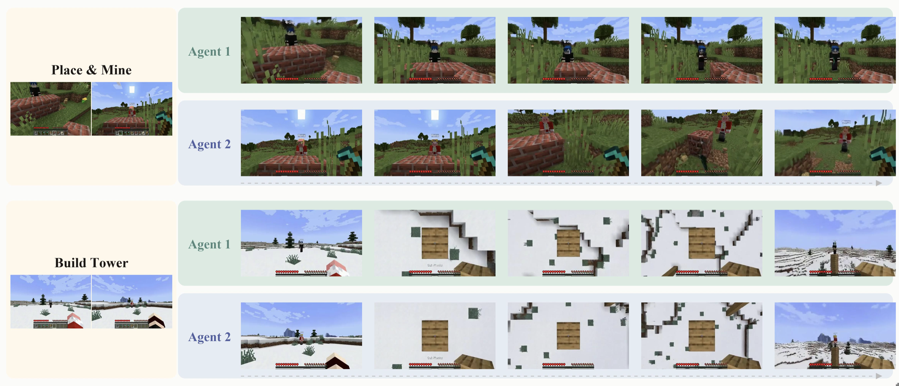
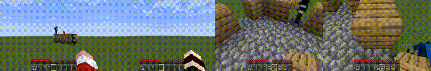
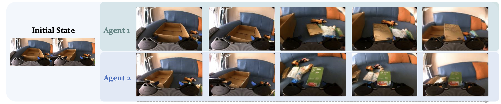

# Gamma-World: From a single agent world model to a multi-agent shared world

This introduction corresponds to the paper **Gamma-World: Generative Multi-Agent World Modeling Beyond Two Players**, also known as the project **γ-World**. It was jointly developed by NVIDIA, Tsinghua University, the University of Toronto, and Vector Institute. The arXiv version was published on 2026-05-27, the project page was released on 2026-05-28, and the code and training pipeline were made open source on 2026-06-16.

Gamma-World follows LeWM, RISE, RAW-Dream, WoG, WALL-WM, and RoboDream in the world-model route. It is a **multi-agent generative world model** for interactive simulation: synchronized observations and actions from several agents condition future videos from multiple viewpoints in one shared world.

After completing this chapter, focus on one key judgment:

> The core of γ-World is not about “running multiple single-player world models side by side,” but rather explicitly adding an agent axis into the model structure, enabling multiple independently controllable agents to maintain causal coupling, consistent perspectives, and real-time responses within the same generation world.

## 1. Project, paper, code, and model entry points

| Item | Information |
| :--- | :--- |
| Project Page | [NVIDIA Research: γ-World](https://research.nvidia.com/labs/sil/projects/gamma-world/) |
| Paper | [arXiv:2605.28816](https://arxiv.org/abs/2605.28816) |
| HuggingFace Paper | [Gamma-World: Generative Multi-Agent World Modeling Beyond Two Players](https://huggingface.co/papers/2605.28816), 2026-05-28 as `#1 Paper of the day` |
| Code Repository | [nv-tlabs/Gamma-World](https://github.com/nv-tlabs/Gamma-World), Apache-2.0 |
| Model Weights | [chijw/Gamma-World](https://huggingface.co/chijw/Gamma-World) |
| Base Model | [nvidia/Cosmos-Predict2.5-2B](https://huggingface.co/nvidia/Cosmos-Predict2.5-2B) / Cosmos-Predict2.5 series |
| Text Encoder | [nvidia/Cosmos-Reason1-7B](https://huggingface.co/nvidia/Cosmos-Reason1-7B), requires NVIDIA Open Model License |
| Official Documentation | [Setup](https://github.com/nv-tlabs/Gamma-World/blob/main/docs/setup.md), [Inference](https://github.com/nv-tlabs/Gamma-World/blob/main/docs/inference.md), [Training](https://github.com/nv-tlabs/Gamma-World/blob/main/docs/training.md) |

HuggingFace’s “Daily Top 1” ranking indicates high community popularity, but it is not a separate robot success rate ranking. When evaluating technical value, we still need to focus on the three core issues in the paper: how to represent multi-agent identities, how agents communicate with each other, and how to achieve real-time streaming rollout.

## 2. Official Effect Preview: Multiple agents exist in the same generation world

<p align="center">
  
</p>

**Figure 1: Official intro video converted to GIF.** γ-World generates multiple future videos within the same shared environment from the initial perspectives and action sequences of various agents. The different agents can control independently, but they all see the same world that changes together with everyone's actions.

Source: [γ-World NVIDIA project page ](https://research.nvidia.com/labs/sil/projects/gamma-world/).

In this dynamic graph, what matters most is not the image quality, but “world consistency across views”. If agent A moves forward and agent B turns its head, the environmental changes in both perspectives should be compatible with each other. If one agent changes the state in the scene, the perspective of the other agent should not be indifferent like in another parallel universe. Single-agent world models usually only predict the future corresponding to one control flow, while γ-World handles multiple action flows and multiple perspectives simultaneously.

## 3. Why the multi-agent world model is not a simple concatenation

Many past interactive world models can be understood as “a player manipulating a world”:

```text
first frame + prompt + one action stream -> future video
```

Multi-agent scenarios need to be transformed into:

```text
shared initial world
  + agent_1 observation/action
  + agent_2 observation/action
  + ...
  + agent_N observation/action
  -> synchronized future videos for all agents
```

Directly combining multiple perspectives in space, or assigning a fixed slot embedding to each player, will lead to three issues.

| Problem | Specific Manifestation | Consequence |
| :--- | :--- | :--- |
| Independent Controllability | Each agent has its own action sequence, and the model cannot combine all actions into a global control signal | Action A may incorrectly affect B's local movement, or B's action may be ignored |
| Permutation Symmetry | The agent IDs should not imply "Player 1 is always special, Player 2 is always secondary" | After training two players, it is difficult to naturally extend to four players |
| Communication Cost | If all agent tokens use dense all-to-all attention, the complexity increases quadratically with the number of agents | In four- or eight-player scenarios, latency and memory usage will deteriorate rapidly |

The design of γ-World is based on these three principles: using **Simplex Rotary Agent Encoding** to represent identities, **Sparse Hub Attention** to handle inter-agent communication, and **block-causal student + KV cache + few-step distillation** for real-time streaming generation.

## 4. Overview Chart: Shared World, Multiple Perspectives, Action Response

<p align="center">
  
</p>

**Figure 2 γ-World teaser.** The figure shows both two-agent and four-agent scenarios, as well as real robot dual-arm coordination. What it aims to generate is the synchronized future of multiple agents in the same environment, rather than several unrelated videos.

Source: [γ-World NVIDIA project page ](https://research.nvidia.com/labs/sil/projects/gamma-world/).

This diagram can be read in three layers.

The first layer is **game scene**. The Minecraft-style multiplayer environment offers discrete keyboard actions and continuous camera movements, making it suitable for verifying "multiplayer shared scene + action response + consistent perspective".

The second layer is **multi-agent scaling**. The paper highlights the generalization from two-agent training to four-agent reasoning, without the need to retrain a fixed slot model for a four-person scenario.

The third layer is **robotics coordination**. In real robotic scenarios, the paper treats the left and right robotic arms as two agents, each with its own continuous end-effector actions. This experiment shows that the multi-agent interface of γ-World is not only applicable to game control, but can also be applied to robotic multi-arm coordination scenarios.

## 5. Method Diagram: Explicit agent axis + causal multi-agent DiT

<p align="center">
  
</p>

**Figure 3 γ-World method diagram.** The model receives synchronized multi-agent observations and actions, tokenizes the visual/action streams of each agent, and generates future multi-view rollouts using Simplex Rotary Agent Encoding and Sparse Hub Attention.

Source: [γ-World NVIDIA project page ](https://research.nvidia.com/labs/sil/projects/gamma-world/).

After breaking down this image, we can see the main link of γ-World:



The key point is that `agent` is modeled as an explicit axis, rather than simply piecing together all images together. The implementation details provided in the paper appendix are: the game input has a 25-dimensional action per frame for each agent, including 23 discrete keyboard controls and 2 continuous camera controls; the robot input has a 10-dimensional continuous action per frame for each robotic arm, including 3D end-position, 6D pose, and gripper opening and closing.

## 6. Simplex Rotary Agent Encoding: Why Not Use Ordinary Player Numbers

The multi-agent model must know "which agent's token this is", but this identity cannot be fixed as a regular slot. For example, when there are only two players during training, if the model learns that "slot 0 always corresponds to the left player and slot 1 always corresponds to the right player", it will be awkward when a third or fourth player is added during reasoning.

γ-World uses **Simplex Rotary Agent Encoding**. For a clear understanding:

- It is not about teaching the agent a trainable embedding.
- It is not simply using integer numbers 0, 1, 2, 3.
- Instead, the agent is placed at a vertex of a simplex in the rotary angle space.

The advantage of the regular simplex is that the distances between each vertex are equal. In other words, each agent has a different phase, but there is no bias of "which one is more special" between any two agents. This corresponds to the permutation-equivalence mentioned in the paper: after swapping the order of agents, the model should not change its semantics due to the change in slot numbers.

It can be understood as:

```text
普通 slot embedding：
agent_0 有固定角色偏置
agent_1 有固定角色偏置
agent_2 训练时可能没见过

Simplex RoPE：
agent A/B/C/D 都拿到不同旋转相位
任意两个 agent 的几何关系等价
模型更容易从 2-agent 泛化到 4-agent
```

In the paper implementation, a very useful training trick is used: a 4-sized simplex pool is used, but only 2 runtime slots are activated during training; 2 vertices are randomly sampled per step and the order of agent slots is shuffled, forcing the model not to remember the slots rigidly, but to distinguish players through the simplex marker. This is one of the foundations for its ability to perform "two-player training -> four-player inference".

## 7. Sparse Hub Attention: Multi-agent communication cannot allow full mutual viewing between all pairs

<p align="center">
  
</p>

**Figure 4: Comparison of the Efficiency of Sparse Hub Attention.** The computation of dense cross-agent attention increases rapidly with the number of agents; Sparse Hub Attention uses a small number of hub tokens as shared communication channels, reducing the communication cost across agents from quadratic to linear.

Source: [γ-World NVIDIA project page ](https://research.nvidia.com/labs/sil/projects/gamma-world/).

If there are N agents, the simplest approach is to use dense all-to-all attention for all agent tokens. This provides strong expressiveness, but the complexity is `O(N^2)`, and the more agents there are, the more difficult it becomes to achieve real-time performance.

The idea of Sparse Hub Attention is similar to creating a "shared bulletin board" for multi-agent systems:

```text
agent_1 tokens -> hub tokens <- agent_2 tokens
agent_3 tokens -> hub tokens <- agent_4 tokens
```

Each agent mainly focuses on its own token and hub token. The hub token aggregates information across agents and then broadcasts it back to each agent. In this way, agents do not need to have dense attention with each other, and can exchange and share the world state through the hub.

The paper defaults to using `K = 8` hub tokens. Appendix ablation shows that the quality improves significantly when K increases from 1 to 8. Further increase to 32/128 will bring slight improvement, but the computational overhead will also increase. Therefore, K=8 is a somewhat engineering-oriented compromise: it is sufficient to support cross-agent interactions without making the communication channels too heavy.

## 8. Teacher, Causal Student, and Few-Step Distillation

γ-World needs real-time interaction, and it cannot focus solely on offline video quality. The paper divides the training into three stages:

```text
bidirectional teacher -> causal student -> DMD / few-step student
```

| Phase | Function | Characteristics |
| :--- | :--- | :--- |
| Bidirectional teacher | Learns high-quality autoregressive future distributions of multiple agents | Can see the full context, high quality, but not real-time streaming |
| Causal student | Learns block-level autoregressive generation | Only sees past blocks, supports KV cache, but quality degrades |
| DMD / few-step student | Compresses causal student into few-step sampling | 4-step denoising, designed for 24 FPS interaction response |

These three stages correspond to a typical engineering trade-off: high-quality diffusion teacher processes are often slow, while causal streaming student can interact but has lower quality. The goal of distillation is to retain as much of the teacher's quality as possible, while also preserving the student's online generation ability.

The official reasoning document lists three modes:

| `--mode` | Meaning | Sampling |
| :--- | :--- | :--- |
| `bidirectional` | full-context teacher |约 35 steps, single-shot |
| `causal` | block-causal student |约 35 steps, KV-cache |
| `causal_few_step` | distilled streaming student |4 steps `[1000, 750, 500, 250]`, KV-cache |

Therefore, when reproducing the course, `causal_few_step` should be used as a priority. It is not the strongest offline quality mode, but it best matches the core features of γ-World: responsive actions, streaming, and near-real-time performance.

## 9. Two-person interaction, four-person generalization, and robot collaboration

<p align="center">
  
</p>

**Figure 5: Interaction results of two agents.** The two agents can input actions independently, but the generated results remain consistent in time and space within the same world.

Source: [γ-World NVIDIA project page ](https://research.nvidia.com/labs/sil/projects/gamma-world/).

<p align="center">
  
</p>

**Figure 6: Four-agent generalization of video to GIF.** The official result shows a zero-sample extension from two-agent training to four-agent inference.

Source: [γ-World NVIDIA project page ](https://research.nvidia.com/labs/sil/projects/gamma-world/).

<p align="center">
  
</p>

**Figure 7: Real robotic arm dual-arm coordination.** The paper uses RealOmin-Open data, treating the left and right robotic arms as two interacting agents, with motion formats consisting of continuous end pose and gripper opening/closing.

Source: [γ-World NVIDIA project page ](https://research.nvidia.com/labs/sil/projects/gamma-world/).

This part about the robot should be read more calmly. It indicates that the same world model interface for multiple agents can integrate real robot dual-arm data, but it is not yet a closed loop controller for robots, nor can it replace the Isaac Sim / MuJoCo physical simulator. What it generates is an action condition video rollout to help understand future observations by multiple agents, rather than directly outputting the control trajectory of real robots.

## 10. How to read the experimental results

The paper compares the γ-World, Solaris, frame concat and other baselines. Here, only the most important FVD/FID results are quoted. The lower the values, the better.

| Method | Memory FVD / FID | Grounding FVD / FID | Movement FVD / FID | Building FVD / FID | Consistency FVD / FID |
| :--- | :--- | :--- | :--- | :--- | :--- |
| Frame concat | 450.6 / 69.8 | 528.3 / 63.2 | 556.9 / 65.0 | 551.8 / 87.3 | 576.0 / 123.2 |
| Solaris | 333.8 / 51.7 | 301.9 / 36.1 | 311.1 / 36.3 | 448.6 / 71.0 | 443.1 / 94.8 |
| γ-World | 184.1 / 24.8 | 199.3 / 24.0 | 191.5 / 21.2 | 264.5 / 32.1 | 280.0 / 46.9 |

This table indicates that it is not only good in a single aspect, but also significantly superior to the baseline in all multi-person interaction dimensions such as memory, language/goal grounding, movement, construction, and consistency. Especially Consistency, which corresponds to the most vulnerable point in a shared world for multiple agents.

Architecture ablation is also worth watching:

| Combination | Agent Encoding | Interaction | FVD | FID | LPIPS | PSNR | SSIM |
| :--- | :--- | :--- | :--- | :--- | :--- | :--- | :--- |
| Spatial concat | None | Full | 312.4 | 38.7 | 0.326 | 24.8 | 0.782 |
| Sequence concat | None | Full | 285.6 | 35.2 | 0.298 | 25.6 | 0.798 |
| Sequence concat | View embedding | Full | 256.3 | 32.4 | 0.281 | 26.4 | 0.815 |
| Sequence concat | Simplex | Full | 228.5 | 29.6 | 0.265 | 27.5 | 0.830 |
| γ-World full | Simplex | Sparse Hub | 223.4 | 30.2 | 0.269 | 27.7 | 0.836 |

The interpretation of this table is as follows: first, it changes from `spatial concat` to `sequence concat`, indicating that organizing the agent/time into a more appropriate token sequence is helpful; then it replaces `view embedding` with `Simplex`, showing that permutation symmetry identity encoding is beneficial; finally, it switches to `Sparse Hub`. `FVD` and `SSIM` remain better, while also achieving better scaling.

## 11. How to reproduce: The most practical learning path currently available

γ-World has opened the code and training pipeline, but the full training is very intensive. The official appendix states that both the teacher and causal student are trained on 32 NVIDIA GB200 GPUs. Ordinary learners should not attempt to replicate the entire training from scratch. It is recommended to follow the following order:

### 11.1 Environment Preparation

Official requirements:

- Linux x86-64.
- NVIDIA Ampere architecture or newer GPU.
- NVIDIA driver `>=570.124.06`, compatible with CUDA 12.8.1.
- glibc `>=2.35`, such as Ubuntu 22.04+.
- `git-lfs`, because the repository contains LFS-managed examples/assets.

It is recommended to use the official Docker or `uv` environment first. It is not advisable to hardcode it in an old conda environment.

```bash
git clone https://github.com/nv-tlabs/Gamma-World.git
cd Gamma-World
git lfs pull

sudo apt update && sudo apt -y install curl ffmpeg libx11-dev tree wget
curl -LsSf https://astral.sh/uv/install.sh | sh
source "$HOME/.local/bin/env"
uv python install
uv sync --extra=cu128
source .venv/bin/activate
```

If using CUDA 13.0, such as DGX Spark or Jetson AGX, the official documentation requires a change to:

```bash
uv sync --extra=cu130
```

### 11.2 Weight Download

Gamma-World uses three types of weights:

| Component | HuggingFace repo | Content |
| :--- | :--- | :--- |
| World-model networks | `chijw/Gamma-World` | `bidirectional/`, `causal/`, `causal-few-step/` of `model.safetensors` |
| VAE tokenizer | `chijw/Gamma-World` | `tokenizer.pth` |
| Text encoder | `nvidia/Cosmos-Reason1-7B` | Text prompt encoder |

You need to prepare a HuggingFace token and accept the NVIDIA Open Model License on the Cosmos-Reason1-7B page.

```bash
uv tool install -U "huggingface_hub[cli]"
hf auth login
hf download chijw/Gamma-World --local-dir ./checkpoints/Gamma-World
hf download nvidia/Cosmos-Reason1-7B --local-dir ./checkpoints/Cosmos-Reason1-7B
```

If the network connection is stable, you can directly use the official default `hf://` URI, and the script will automatically download it during the first run.

### 11.3 Minimum reasoning smoke test

The official repository comes with a `data/` example. Each sample directory includes:

- `first_frame.png`: Horizontally concatenated first frames from multiple agents.
- `prompt.txt`: Text prompt.
- `action_left.json` / `action_right.json`, or `action_0.json` to `action_N.json`: Action sequences of each agent.

Minimum reasoning command:

```bash
torchrun --nproc_per_node=1 scripts/inference.py \
    --mode causal_few_step \
    --eval-dir data \
    --n-players 2 \
    --max-eval-samples 1 \
    --output results/examples
```

After success, you should see:

```text
results/examples/<sample>/generated.mp4
```

This smoke test proves three things: the environment can load, the HuggingFace weights can be accessed, and the `causal_few_step` inference chain can generate video. It does not prove that you have reproduced the paper metrics, nor does it prove that it is applicable in real robot scenarios.

### 11.4 Four-Agent Testing

The four agents do not need to be retrained, but the input samples must match the four agents:

- `first_frame.png` requires horizontal concatenation of four views.
- The action file requires `action_0.json`, `action_1.json`, `action_2.json`, and `action_3.json`.
- Set `--n-players 4` during inference.

Example command format:

```bash
torchrun --nproc_per_node=1 scripts/inference.py \
    --mode causal_few_step \
    --eval-dir /path/to/four_player_samples \
    --n-players 4 \
    --output results/four_player
```

The real challenge here is to prepare compliant four-player input data, rather than changing a single parameter line. If there is no data in the tutorial assignment, you can first read the official four-agent visualization and avoid forced replication of the four-person demo.

### 11.5 Training Entry

The official training consists of three stages:

```text
Cosmos-Predict2.5-2B init
  -> bidirectional teacher
  -> causal student
  -> DMD / causal_few_step student
```

Before training, convert the Cosmos-Predict2.5-2B checkpoint to DCP:

```bash
PRETRAINED_CKPT=$(uvx "hf>=1.3.5" download nvidia/Cosmos-Predict2.5-2B \
    --repo-type model \
    --revision 15a82a2ec231bc318692aa0456a36537c806e7d4 \
    base/pre-trained/d20b7120-df3e-4911-919d-db6e08bad31c_ema_bf16.pt)

python scripts/convert_checkpoint_to_dcp.py \
    --input "$PRETRAINED_CKPT" \
    --output /path/to/converted_pretrained_dcp
```

The official training documentation indicates an entrance for 8 cards `torchrun`, but the training volume required for academic-level training is much higher than that of ordinary learning resources. For open-source tutorials, a more reasonable practice goal would be:

- First, run the inference through smoothly.
- Then, understand the multi-agent data format of `gamma_world/_src/gamma_world/datasets/`.
- Finally, only perform mock data or small data smoke training to verify the trainer and config connection.

## 12. Relations with Other World Models in This Repository

| Tutorial | Type | Differences from γ-World |
| :--- | :--- | :--- |
| LeWM | Introduction and reproduction of early embodied world model | More focused on introductory world modeling for single-agent robots |
| RISE | World model + self-improving policy | Emphasizes using imagined rollout to modify the policy |
| RAW-Dream | Reinforcement VLA in task-agnostic WM | Performs post-training training using a video world model and VLM rewards |
| WoG | Conditional spatial world model | Converts future observations into action-related latent conditions |
| WALL-WM | Event-level world action model | Previews actions and videos based on event boundaries |
| RoboDream | Composite world model data synthesis | Synthesizes demonstrations using robot-only trajectories and scene/object priors |
| γ-World | Multi-agent generative world model | Focuses on shared world, independent control of multiple agents, permutation symmetry, and real-time streaming rollout |

If classified by “what the world model predicts”, γ-World predicts **multi-agent synchronized future video**. If classified by “the problems it serves for robots”, it serves multi-robot systems, multi-arm collaboration, multi-person game/simulation data generation, and potential future multi-agent policy training.

## 13. Limitations and Subsequent Traceable Issues

First, the current main experiments are still focused on Minecraft-style game environments. The robot part involves qualitative demonstrations and future frame generation based on real two-armed data, which cannot be equated with a closed loop robot control success rate.

Second, the real-time 24 FPS is an engineering result under official specifications and hardware targets. Whether a standard single-card environment can achieve the same frame rate depends on the GPU, resolution, number of players, sampling mode, and I/O.

Thirdly, the generalization of third and fourth agents stems from the structural design of two-agent training + simplex pool + permutation training. However, having more agents, more complex physical interactions, and longer temporal memory remains an open problem.

Fourth, Sparse Hub Attention uses the hub token to compress cross-agent communication, which is highly efficient. However, if the hub capacity is too small, fine-grained interactions may be lost; if the capacity is too large, it will approach the cost of dense communication.

Fifth, it is not a traditional physics simulator. It can generate action-conditioned video rollouts, but it does not provide strict collision handling, dynamics, contact forces, or verifiable state transitions. For robot training, it is better understood as an interactive video world model and a data-generation or assessment tool rather than a direct replacement for MuJoCo or Isaac Sim.

## 14. Recommended Reading Order

It is recommended to read in the following order:

1. [ Introduction to the Mathematical Foundation of Diffusion and Problem Analysis](../01-diffusion-mathematics-and-problem-analysis/diffusion-mathematics-and-problem-analysis.md): First, understand the basic concepts of video diffusion and sampling.
2. [ Guide to the WoG Conditional World Model World Model](../wog-conditional-space-world-model-guide/README.md): Understanding a world model does not necessarily require explicit generation of the complete future video.
3. [ Introduction to RAW-Dream Task-Independent World Model Reinforcement VLA](../raw-dream-task-agnostic-world-model-reinforcement-for-vla/README.md): Understand how video world models serve VLA-based training.
4. [ Introduction to Data Synthesis of RoboDream Composable World Model](../robodream-compositional-world-model-data-synthesis-guide/README.md): Understand the relationship between world models and data synthesis.
5. This article: Understand why multi-agent world models require new agent identities, cross-agent communication, and streaming inference design.

## 15. Reference Links

- [γ-World NVIDIA Project Page](https://research.nvidia.com/labs/sil/projects/gamma-world/)
- [Gamma-World GitHub](https://github.com/nv-tlabs/Gamma-World)
- [Gamma-World HuggingFace Model](https://huggingface.co/chijw/Gamma-World)
- [Gamma-World HuggingFace Paper](https://huggingface.co/papers/2605.28816)
- [Gamma-World arXiv](https://arxiv.org/abs/2605.28816)
- [Cosmos-Predict2.5-2B](https://huggingface.co/nvidia/Cosmos-Predict2.5-2B)
- [Cosmos-Reason1-7B](https://huggingface.co/nvidia/Cosmos-Reason1-7B)
