<!-- Generated by the offline translation workflow.
Source: 17-具身世界模型/GE-Sim-V2闭环视频世界模拟器导读/README.md
Source SHA-256: 0b89f3ed5f94a2c678cceabf6cded71da817dc8262833f17256af42acfea8312
Model: tencent/Hy-MT2-1.8B-GGUF:Q4_K_M
Review machine-translated technical claims before relying on them.
-->
# GE-Sim 2.0: Introduction to the Closed Loop Video World Simulator

> Introduction to this article **GE-Sim 2.0: A Roadmap Towards Comprehensive Closed-loop Video World Simulators for Robotic Manipulation**. The arXiv paper ID is `2605.27491v1`, and it was submitted on May 26, 2026. The project involves teams from AgiBot, BUAA, LV-NUS Lab, TJU, etc. The official project page is [ge-sim-v2.github.io](https://ge-sim-v2.github.io/), and the code repository is [AgibotTech/GE-Sim-V2](https://github.com/AgibotTech/GE-Sim-V2).

## 1. First, let’s state the conclusion: Why it should be included in the world model section

The full name of GE-Sim 2.0 is **Genie Envisioner World Simulator 2.0**. It is neither the VLA policy itself, nor an explicit physics engine such as MuJoCo / Isaac Sim. A more accurate classification is:

```text
多视角历史视频帧
    +
机器人动作轨迹
    ↓
动作条件视频世界模型
    ↓
未来多视角 rollout 视频
    +
预测的机器人本体状态
    +
可外接/论文提出的任务评价奖励
```

So it should be placed in `17-具身世界模型`, rather than the VLA section. The reason is clear: the core issue with GE-Sim 2.0 is not “how a policy outputs actions”, but rather “given a policy action, can the world model generate consequences like a simulator does, and enable the policy to operate in this learned world through closed loop execution, evaluation, and learning”.

The value of this work lies in its advancement of **action-conditioned video generation** towards **closed-loop world simulator**. Methods like GE-Sim 1.0 / BWM / WALL-WM can already generate future videos based on actions, but for robot policy training, generating videos alone is not enough. A true closed loop still lacks three key elements:

1. The policy requires further proprioception in the next step; one cannot rely solely on videos.
2. The rollout results need to be automatically scored, otherwise each video must be reviewed manually.
3. The generation speed must be fast enough, otherwise large-scale evaluation of the policy is not possible.

GE-Sim 2.0 has three additional modules added:

- **Proprioceptive State Expert**: Decodes the two-arm joint angles and gripper state from the video latent representation.
- **World Judge**: Provides success/progress signals based on task instructions and generated videos.
- **Acceleration Framework**: Enables faster rollout through minimal steps and frame skipping.

One-sentence summary:

> The core of GE-Sim 2.0 is not to make videos more realistic, but to turn the world model into a closed loop environment interface that can be invoked by a policy.

## 2. Paper, project, code, and weight entry points

| Entry | Link | Current Status |
| :--- | :--- | :--- |
| Project Page | [GE-Sim 2.0 Project Page](https://ge-sim-v2.github.io/) | Official project page, including architecture, capabilities, and use cases |
| Paper | [arXiv:2605.27491](https://arxiv.org/abs/2605.27491) / [HTML](https://arxiv.org/html/2605.27491v1) / [PDF](https://arxiv.org/pdf/2605.27491) | Submitted on 2026-05-26 |
| GitHub | [AgibotTech/GE-Sim-V2](https://github.com/AgibotTech/GE-Sim-V2) | Open-sourced code; the repository includes server, examples, docs, tests, and openpi submodules |
| Hugging Face | [agibot-world/Genie-Envisioner-Sim-v2.0](https://huggingface.co/agibot-world/Genie-Envisioner-Sim-v2.0) | Weights for the 2B world simulator and pi05 demo policy have been released |
| Released world model | `gesim_community_v2.0.1_g01op_distill_2B` | Trained and distilled for Genie-01 / G01 + OmniPicker |
| Demo policy | `pi05_gesim_g01op_test` | Closed-loop rollout for the demo task |
| World Judge | Proposed in paper; HF model is stuck on writing `coming soon` | The GitHub README currently states that the reward model is not built-in by default and must be externally added via `RewardClient` |
| License | The GitHub page shows Apache-2.0; the README further explains that some data/code are CC BY-NC-SA 4.0 | When reusing, it is necessary to refer to the upstream Diffusers, Cosmos, openpi, Gemma terms, and repository documentation separately |

The open-source status needs to be analyzed carefully. GitHub News indicates that code and model weights were released on 2026-06-25; the Hugging Face model card lists released checkpoints including the 2B world simulator and pi05 policy. Meanwhile, HF also mentions the World Judge `coming soon`. In the GitHub README code examples, `reward` defaults to `None`, unless a custom `RewardClient` is used. Therefore, currently reproducible items include **replay, world-model server, closed-loop pi05 rollout, and dashboard**. However, the complete World Judge reward learning closed loop in the paper cannot be reproductioned by simply using the official code.

## 3. Overview Diagram: From Video Generation to Closed Loop World Simulator

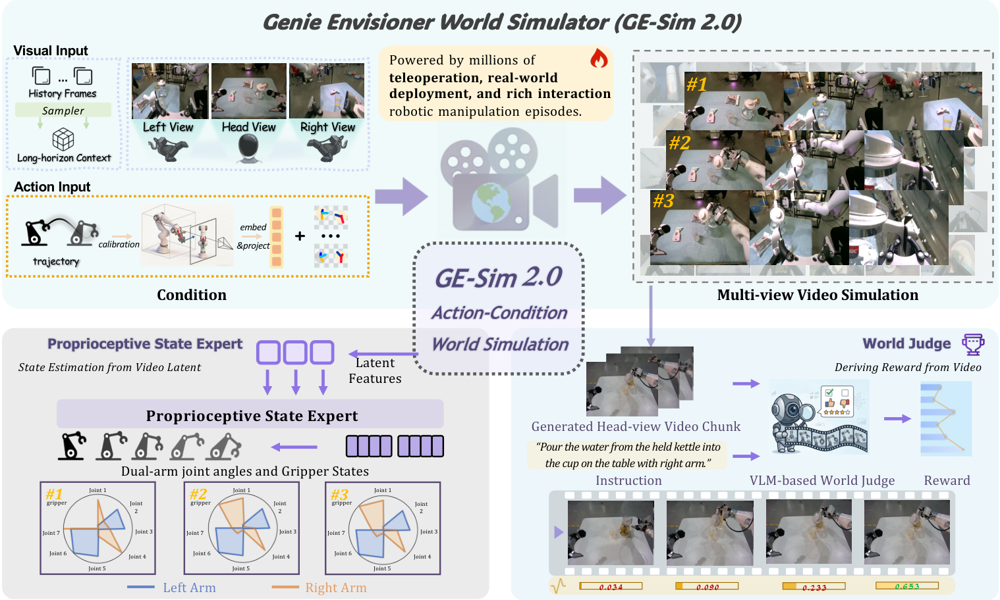

**Figure 1: Overview of GE-Sim 2.0.** The upper part shows the action-conditioned multi-view rollout: the model generates future videos based on multi-view historical frames and trajectory. The lower part shows the closed loop capabilities: State Expert provides proprioception for the policy, and World Judge scores the rollout. Together, they enable the world model to not only “look like” the expected state, but also be evaluated and reused by the policy.
Source: [AgibotTech/GE-Sim-V2 official GitHub repository ](https://github.com/AgibotTech/GE-Sim-V2).

This diagram can be understood in three layers.

The first layer is **visual world simulation**. Instead of a text prompt, it uses the robot’s actual observations and trajectory of actions. GE-Sim 2.0 receives multi-view historical frames such as head view, left wrist, and right wrist, and then projects the dual-arm action trajectory into spatial-aligned action conditions to generate future multi-view videos.

The second layer is the **world model state closed loop**. The ordinary video world model only outputs images, and the policy still lacks proprioception such as joint angles and gripper movement. GE-Sim 2.0 uses State Expert to predict the dual-arm joint angles and gripper states from the video latent, enabling the downstream VLA / policy to obtain the visual and state observations required for the next chunk.

The third layer is the **reward closed loop**. The World Judge reads the generated rollout and task instructions, and outputs ongoing / success signals. Its goal is to transform “manual video analysis for judgment” into a reward that can be verified by machines, enabling the world model to be used for policy evaluation, data filtering, and reward-driven learning.

Therefore, it adds one more step compared to "action condition video generation": it attempts to become a learned environment.

## 4. Paper Architecture Diagram: The Relationship between GE-Base, GE-Sim, and GE-Sim 2.0

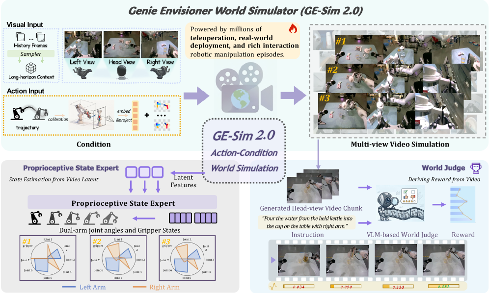

**Figure 2: Paper Figure 1.** GE-Sim 2.0 follows the action condition video generation skeleton of GE-Sim, but adds a state expert and a world discriminator on top of it, expanding the pure visual rollout into a simulated environment that can be used by the policy closed loop.
Source: [ arXiv HTML: GE-Sim 2.0](https://arxiv.org/html/2605.27491v1).

The paper first defines two preliminary concepts.

**GE-Base** is a foundational model for multi-perspective video world. It models the robot world as a multi-view text-and-image-to-video generation process: given initial multi-perspective observations, language instructions, and long-term memory frames, the model autoregressively predicts future multi-perspective video chunks. It uses Cosmos-Predict2-2B-Video2World DiT as its backbone, is trained via latent flow-matching, and employs cross-view attention to maintain perspective consistency.

**GE-Sim** changes GE-Base from text-driven to action-driven. That is, it no longer allows text instructions to directly drive future videos, but instead uses the low-level robot trajectory as conditional input, allowing video changes to follow the actions. The actions here are 14-dimensional end-effector actions for two arms:

```text
left arm:  position + orientation + gripper openness
right arm: position + orientation + gripper openness
```

To align low-dimensional actions with high-dimensional video latents, GE-Sim uses two types of spatial conditions:

- **Pose Image**: Render the position, orientation axis, and gripper opening/closing of the end effector onto the pixel plane.
- **Camera Raymap**: Encode the camera ray corresponding to each pixel, enabling the model to explicitly know the multi-view geometry.

After sampling to the latent resolution under these two conditions, it is concatenated along the channel dimension with the noisy video latent. This design is crucial: the actions are not attached to the text or used as post-processing control signals, but instead directly enter the video diffusion model like spatial layers.

**GE-Sim 2.0** addresses the closed loop gap based on GE-Sim:

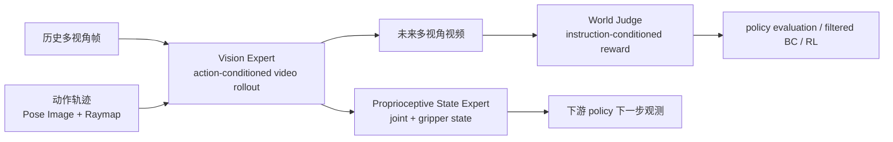

This is the meaning of “closed-loop video world simulator”: video generation is just the foundation; it are the state and reward that allow the policy to continue operating within it.

## 5. Action Condition: Why it is called pixel-aligned

The project page emphasizes the **Pixel-aligned Action Condition**. This name is not a decorative term; it refers to the spatial alignment method of the action condition.

If the robot motion is encoded into a single vector and then injected into the video model via MLP, the model must infer on its own which hand, pixel, or perspective corresponds to this sequence of numbers in the image. This is very difficult for multi-viewpoint robot videos, especially since the positions of the end effector observed by the wrist camera and the head camera are completely different.

The GE-Sim processing converts the actions into condition layers aligned with the same resolution as the image:

1. Use the robot FK and camera calibration to project the end effector position into each camera view.
2. Map the end pose direction axes as direction codes on the image plane.
3. Render the gripper opening as a visible gripper openness cue.
4. Overlay the camera ray map for each pixel.
5. Sample these conditions into the latent space and merge them with the video latent.

The intuition behind this design is:

```text
动作向量告诉模型“机器人要怎么动”
像素对齐动作条件告诉模型“机器人会在画面哪里动”
raymap 告诉模型“这个画面来自哪个相机几何”
```

Therefore, it is more suitable for the world model of multi-view video than a pure action token. Especially when generating from head view, left wrist, and right wrist simultaneously, the projection positions of the same end action in different views vary. Raymap and pose images can reduce cross-view misalignment.

## 6. State Expert: Reconstructing robot proprioception from video latent features

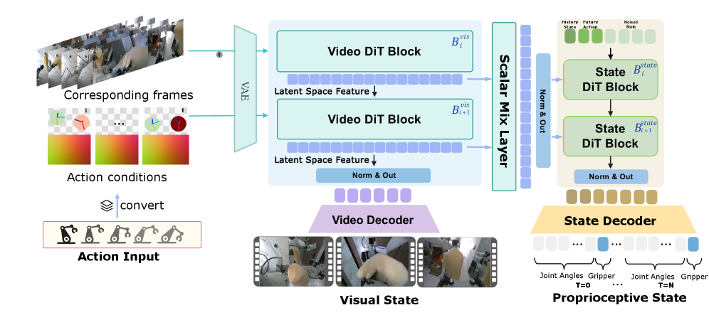

**Figure 3 Vision Expert and Proprioceptive State Expert.** The Vision Expert generates the future visual state first; the State Expert predicts the two-arm joint angles and gripper opening and closing from the video latent, enabling the world model output to expand from “future image” to “future vision + future proprioceptive state”.
Source: [arXiv HTML: GE-Sim 2.0](https://arxiv.org/html/2605.27491v1).

Why is State Expert needed? Because real VLA / policy usually doesn't just process images. Many policy inputs include:

- Multi-perspective RGB;
- Robot joint angles or end pose;
- Gripper opening and closing;
- Previous action or proprio history.

If the world model only generates future videos, the downstream policy can only approximate the next round state with “previous round commanded action” when executed in a closed loop within the world model. However, in real robots, the commanded action and actual state may not be identical. The reasons include:

- Gripper slippage;
- Contact causing end offset;
- Robotic arm compliance;
- Joint execution error;
- Object obstruction or collision;
- Long-term cumulative error.

The State Expert in GE-Sim 2.0 directly decodes the actual joint angles and gripper states from the world model video latent. The paper also uses history-state augmentation to make it more stable against time offsets and low-frequency disturbances, including delta-index shift and temporal resampling. Intuitively, this allows the state expert to not only remember the perfectly synchronized trajectory, but also adapt to a slight time offset between the policy and the world model.

For students in the course, this module is key to understanding a closed loop: generating videos alone is not a closed loop simulator. Only when it returns the state required for the next step of the policy does it approach the interface of `env.step(action) -> obs, reward, state, info`.

## 7. World Judge: The world model needs to score itself

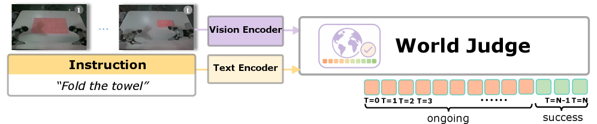

**Figure 4 World Judge.** The World Judge processes rollout frames using a visual encoder and task instructions using a text encoder. It then outputs ongoing / success signals for each frame or segment, enabling the generated video to be evaluated and rewarded automatically.
Source: [arXiv HTML: GE-Sim 2.0](https://arxiv.org/html/2605.27491v1).

The World Judge needs to address a very practical issue: if the video generated by the world model can only be viewed by humans, it is difficult to serve for large-scale policy training. Policy evaluation requires rewards, data filtering requires rewards, and offline-to-online or model-based RL also require rewards.

The concept of GE-Sim 2.0 is to have the VLM-based judge analyze the generated rollout and task instructions, and determine whether the task is progressing or successful. On the project page, it is referred to as the integrated world-judge reward model; in the paper, it is used for closed-loop policy evaluation and WM-filtered behavior cloning.

But the open-source boundaries should be clearly stated: the current Hugging Face model card reads **World Judge (coming soon)**; the `WorldModelEnv` example in the GitHub README also indicates that if `RewardClient` is not attached, `reward` defaults to `None`. In other words:

```text
论文方法：GE-Sim 2.0 包含 World Judge 作为闭环奖励模块
当前开源仓库：world model / server / demo policy 可跑，reward 需要自定义 RewardClient 或等待官方进一步发布
```

This is not a trivial detail. Many people might think that after downloading the repository, they can directly get automatic rewards when using the closed loop world simulator. In reality, the current open-source version is better suited for replay and closed-loop rollout first. If reward-driven learning is desired, one needs to use a reward model by themselves or wait for the official release of World Judge.

## 8. Acceleration: Why generating 25 frames in 2.3 seconds is important

Both the project page and the paper emphasize the acceleration framework of GE-Sim 2.0: 25-frame rollout is approximately `2.3s` on a single H100, and up to `4x` frame skipping is supported during inference.

Why is this metric important? Because if the world model only generates a few demo videos offline, a slower speed is acceptable. However, if policy evaluation is required, many runs are needed:

```text
任务数 x 初始状态数 x policy checkpoint 数 x rollout seeds x action chunks
```

Assuming each segment of 25 frames takes several seconds, it is completely impossible to use it for policy filtering or closed loop training. Although 2.3 seconds is not the speed of traditional physics simulators, it has already pushed the video world model into a range where “batch evaluation” is possible.

The paper appendix states that DMD2 acceleration uses a frozen teacher, student, and fake-score critic. The student's objective is 4 inference steps, while during training, it randomly uses 1 to 4 steps, supporting either one or fewer steps of inference. It can be understood as distilling the originally multi-step denoising video world model into a faster few-step simulator.

There are also boundaries here: the higher the acceleration, the more the video details and physical consistency are affected. Therefore, GE-Sim 2.0 evaluates both fidelity and closed-loop consistency, rather than just reporting throughput.

## 9. What Does WorldArena One Look Like?

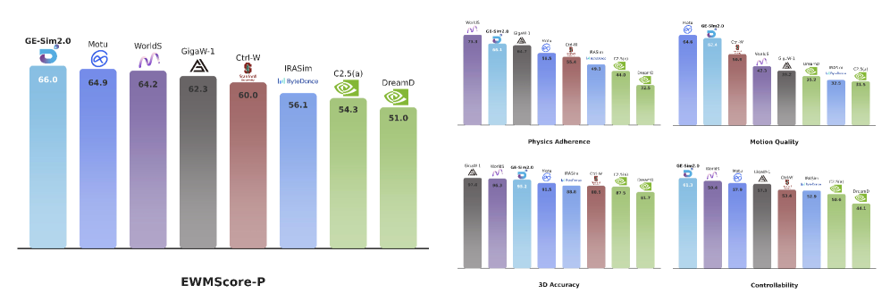

**Figure 5 WorldArena leaderboard.** The paper shows that GE-Sim 2.0 achieves the overall top score on the WorldArena public leaderboard, surpassing multiple robot world models and closed-source general video generators at a 2B parameter scale.
Source: [ arXiv HTML: GE-Sim 2.0](https://arxiv.org/html/2605.27491v1).

The "world's best" mentioned by the user is based on the results of the WorldArena ranking. The abstract of the paper clearly states that GE-Sim 2.0 tops the public WorldArena leaderboard with only 2B parameters, and surpasses dedicated robotic world models and closed-source general video generators. The Hugging Face model card also mentions it as a **WorldArena CVPR Challenge champion**.

This is a strong matter, but avoid misinterpretation.

Three Key Points:

1. **2B scale**. Instead of using a huge closed-source video model, high scores were achieved under the world model for robot motion conditions.
2. **Multiple metrics**. WorldArena considers not only image quality, but also motion controllability, physical adherence, multi-view consistency, and task relevance.
3. **Closed loop direction**. The paper reports video metrics, as well as closed-loop policy consistency, World Judge reward quality, and WM-filtered BC.

There are also three points at the boundary:

1. Being ranked first on the list does not mean it can replace physical simulators in any real robot.
2. WorldArena remains a benchmark protocol and cannot cover all types of contact, flexible objects, transparent objects, force control, and safety constraints.
3. The current open-source version is G01 + OmniPicker; support for G02 is still on the roadmap.

So a more accurate statement is:

> GE-Sim 2.0 ranked first on the WorldArena public list, proving it is a highly advanced robot video world simulator; however, it is not yet a general verifiable physics engine.

## 10. Qualitative Results: Why It Is More Important Than Just Image Quality

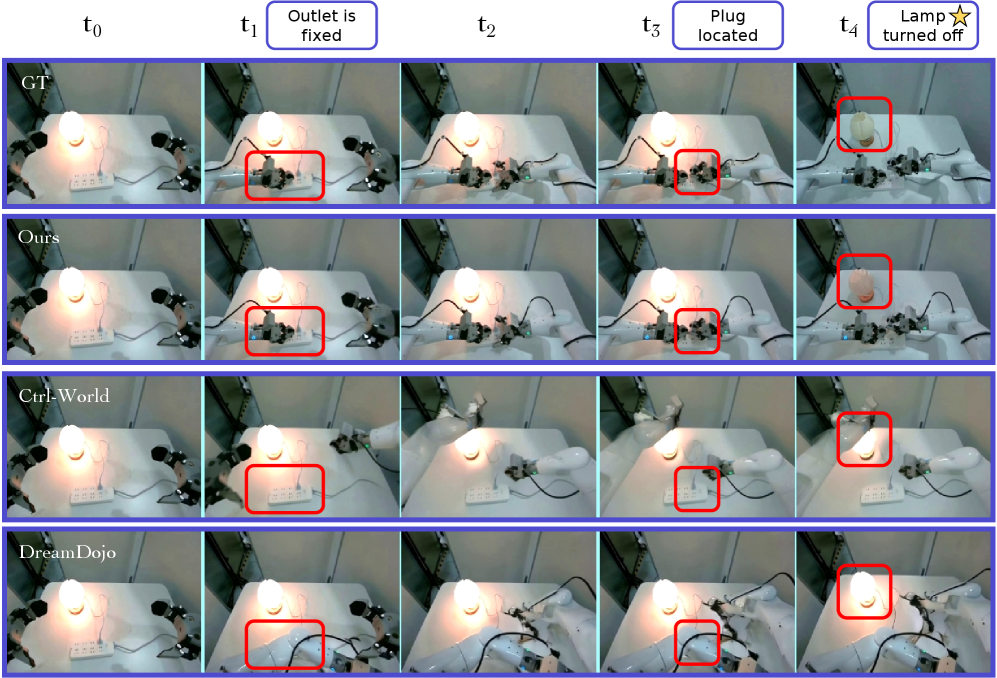

**Figure 6: Qualitative comparison of Pull out plug.** GE-Sim 2.0 not only simulates the movement of the robotic arm, but also generates task state changes such as “the plug is pulled out and the desk lamp turns off”. Ctrl-World and DreamDojo fail in action following and state change aspects.
Source: [ arXiv HTML: GE-Sim 2.0](https://arxiv.org/html/2605.27491v1).

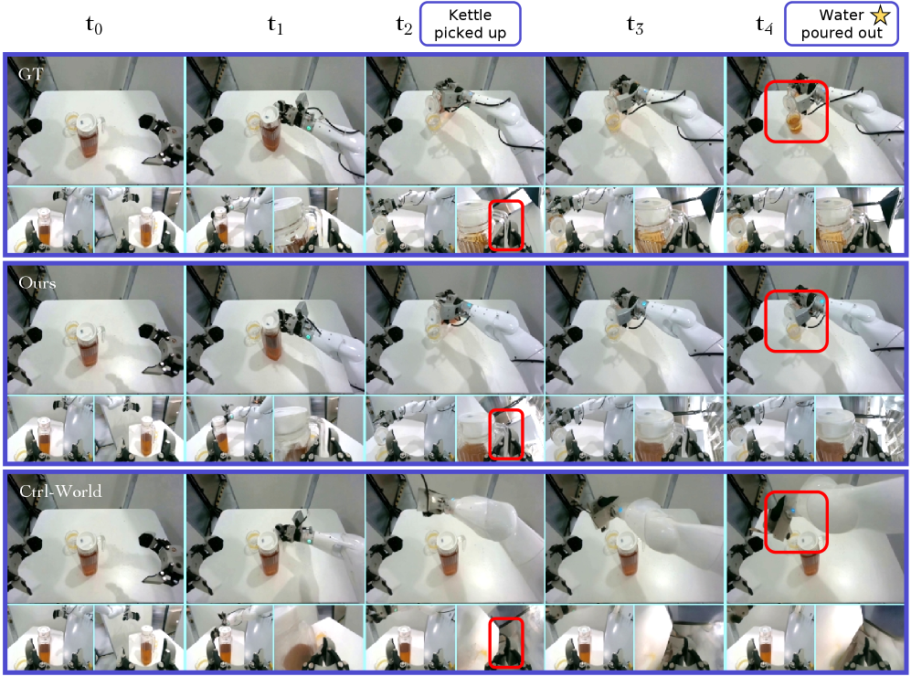

**Figure 7 Pour water qualitative comparison.** The water pouring task tests the relationship between grasping, lifting, pouring, water flow, and container. GE-Sim 2.0 is closer to a real trajectory in action following and water flow generation.
Source: [arXiv HTML: GE-Sim 2.0](https://arxiv.org/html/2605.27491v1).

These two sets of diagrams illustrate that the world model cannot be judged solely by “the clarity of the image”. What is more important in robot tasks is:

- Whether the action conditions are met;
- Whether the object's state truly changes;
- Whether the contact is reasonable;
- Whether the multiple perspectives are consistent;
- Whether the failure trajectory can be generated realistically, rather than being beautified by the model as a success.

The challenge of Pull out plug is the causal state change: the backlight should turn off when the plug is pulled out. The challenge of Pour water is the interaction between liquid and container. It is difficult for traditional rigid body simulators to handle liquids, and ordinary video generators may only produce visual illusions that resemble pouring water. GE-Sim 2.0 is trained with a large amount of real robot interaction data and action conditions, aiming to reduce such hallucinations.

The project page also provides a very clear example: if only expert data is used for training, there will be the illusion that the gripper doesn’t actually hold the towel, but the towel moves along with it. When teleoperation, deployment, interaction, and failure data are added, such illusions decrease. This indicates that failure data and non-expert interaction data are not dirty data, but rather important sources for the world model to learn about real contact boundaries.

## 11. Long-time domain and closed loop consistency

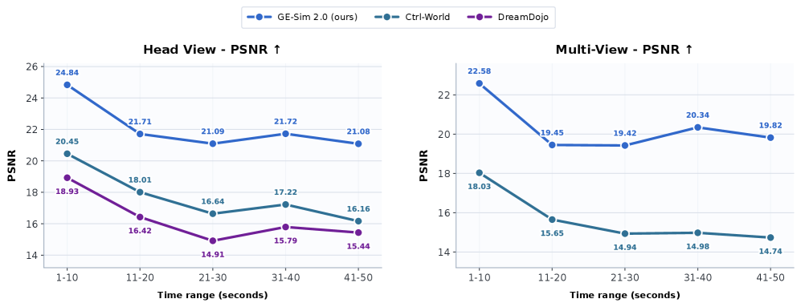

**Figure 8 Long-time-domain replay quality.** The paper evaluates PSNR by dividing the video into continuous 10-second segments. GE-Sim 2.0 degrades more slowly in long-time-domain rollout.
Source: [ arXiv HTML: GE-Sim 2.0](https://arxiv.org/html/2605.27491v1).

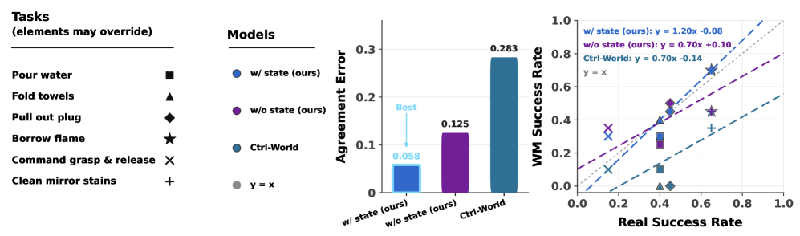

**Figure 9: World model success rate aligns with real robot results.** Each point represents a task. The closer a point is to the gray `y=x` line, the closer the success rate measured in the world model is to that of the real robot. Alignment improves with state conditioning.
Source: [arXiv HTML: GE-Sim 2.0](https://arxiv.org/html/2605.27491v1).

Figure 9 is particularly crucial for the robot world model. Many video models can produce beautiful results, but they are not reliable when evaluating policies within them. A successful policy in the world model does not mean it will also succeed in the real world; if there is a significant discrepancy between the two, the world model will mislead policy training.

GE-Sim 2.0 used a closed-loop policy deployment to compare with real robot results, and found that the full model with state conditioning achieved a closer success rate in the real world. This supports the design of State Expert: visual information alone is insufficient; the policy needs more realistic proprioceptive states next.

The paper also provided the confusion matrix:

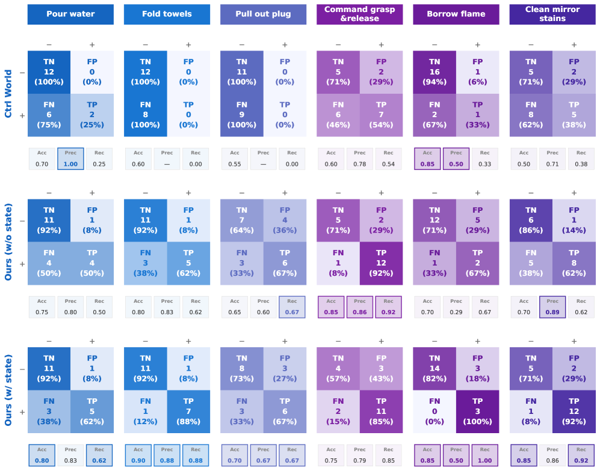

**Figure 10: Consistency of closed loop simulation and real task success/failure.** Compared to Ctrl-World, GE-Sim 2.0 has a higher true-positive rate, indicating that it better retains the successful patterns of real tasks.
Source: [arXiv HTML: GE-Sim 2.0](https://arxiv.org/html/2605.27491v1).

This type of evaluation is closer to robot requirements than just FVD. Ultimately, what matters is: can this learned simulator help us determine whether a specific policy can actually complete the task.

## 12. WM-filtered BC: How the world model reverses the policy improvement mechanism

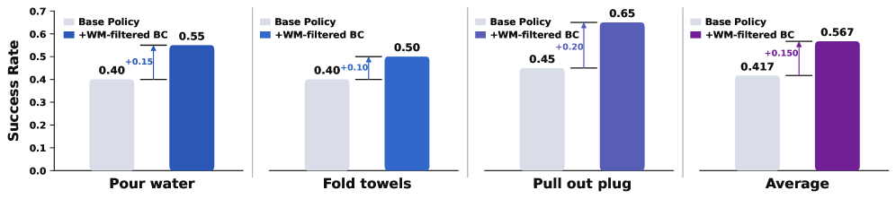

**Figure 11 WM-filtered behavior cloning.** The policy is first rolled out in GE-Sim 2.0, and the World Judge or reward model filters out high-reward synthetic trajectories, which are then mixed into the original behavior cloning data to train π0.5. This improves the success rate in multiple contact-intensive tasks.
Source: [arXiv HTML: GE-Sim 2.0](https://arxiv.org/html/2605.27491v1).

This diagram answers the question, "What else can the world model do besides generating videos?"

The process can be written as:

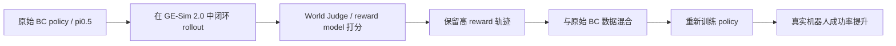

This is not a traditional pure synthetic data augmentation. The key lies in **filtered**: the trajectory generated or evaluated by the world model must go through reward/judge filtering to retain samples with higher success probabilities. Without filtering, incorrect trajectories, hallucinated successes, and inconsistent action samples in the world model may contaminate the policy.

This line can be viewed together with RAW-Dream, LWD, and Agentic-VLA:

- RAW-Dream uses a world model-based rollout and employs VLM rewards for RL.
- LWD uses real deployment data for offline-to-online RL.
- Agentic-VLA uses reward synthesis and an exploration critic for online adaptation.
- GE-Sim 2.0 uses a learned world simulator rollout and judge rewards for filtered BC / policy evaluation.

They are all answering the same question: VLA cannot rely solely on static expert instruction; cheaper and more automated feedback signals are needed before and after deployment.

## 13. How to Run the Official Open Source Repository

The current repository has provided a practical entry point. It is recommended that learners first run **replay**, and then **closed-loop rollout**, rather than immediately modifying the model or integrating their own robots.

### 13.1 Installation

The installation method provided in the official README is:

```bash
git clone --recursive https://github.com/AgibotTech/GE-Sim-V2.git gesim
cd gesim

# GPU world-model server
pip install -e ".[server]"

# 或只安装 client
pip install -e .

# 如果要跑 pi05 policy client
pip install -e third_party/openpi/packages/openpi-client
```

Here, `--recursive` is very important because the repository contains the `third_party/openpi` sub-module. Not including the sub-module will result in the missing code related to pi05 policy serving.

### 13.2 Download Weight

```bash
huggingface-cli download agibot-world/Genie-Envisioner-Sim-v2.0 \
  --include "checkpoints/**" \
  --local-dir .
```

This command will download two main checkpoints:

```text
checkpoints/gesim_community_v2.0.1_g01op_distill_2B
checkpoints/pi05_gesim_g01op_test
```

The former is the GE-Sim 2.0 world simulator, and the latter is the pi05 policy used for the demo task. After downloading, you need to point to `checkpoint` in `configs/gesim_v2.yaml` within the world model folder.

### 13.3 Replay a recorded episode

Two terminals run:

```bash
# terminal 1: world-model server
MODEL=gesim_v2 CONFIG=configs/gesim_v2.yaml bash scripts/serve_world_model.sh
```

```bash
# terminal 2: replay
python examples/replay.py \
  --server http://localhost:9000 \
  --episode assets/demo_000 \
  --output-dir outputs/replay
```

The purpose of this smoke test is to verify that the world model server, demo bundle, action conditioning, and video output pipeline are functional. It does not require a closed loop policy; it simply inputs the recorded episodes into the world model for generation.

### 13.4 Closed Loop Policy Rollout

Three terminals are running:

```bash
# terminal 1: world-model server
MODEL=gesim_v2 CONFIG=configs/gesim_v2.yaml bash scripts/serve_world_model.sh
```

```bash
# terminal 2: pi05 policy server
OPENPI_CKPT=checkpoints/pi05_gesim_g01op_test bash scripts/serve_policy_pi05.sh
```

```bash
# terminal 3: closed-loop rollout
python examples/closed_loop.py \
  --server http://localhost:9000 \
  --policy ws://localhost:8000 \
  --episode assets/demo_000 \
  --steps 8
```

This step is close to `env.step(actions)`. The Python example in GitHub Quickstart shows:

```python
from gesim import WorldModelEnv
from gesim.policies import OpenPIPolicy

env = WorldModelEnv("http://localhost:9000")
policy = OpenPIPolicy("ws://localhost:8000")
policy.reset()
obs = env.reset("assets/demo_000", conditioning="action")

for _ in range(8):
    actions = policy.infer(obs)
    obs, reward, state, info = env.step(actions)

env.save_video("rollout.mp4")
```

Here, `state` indicates the predicted robot state of `(T, 16)`. `reward` defaults to `None`, unless you receive a RewardClient via `WorldModelEnv(reward=...)`.

### 13.5 Dashboard

The world-model server will provide a live dashboard via `http://localhost:9000`. You can see:

- Current phase;
- Step count;
- Policy commanded action;
- World model predicted robot state;
- Preview of the latest generated frame.

If you just want to view the dashboard without loading the real model, you can run:

```bash
python -m gesim.server --demo
```

Then open a browser and visit the server URL. This is suitable for understanding the UI and interfaces, but it does not mean that the model inference is successful.

## 14. Official rollout example: Monitor both success and failure

The official repository provides an example of the closed loop rollout of the pi05 policy in GE-Sim 2.0. Each clip combines the three perspectives of head, left wrist, and right wrist horizontally. A strong policy can complete the task, while a weak policy will result in failures such as missed grasp and dropped object.

<table>
  <tr>
    <td width="33%" align="center">
      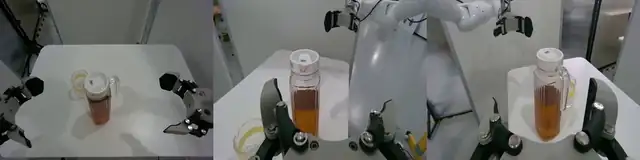
      <br><strong> Figure 12a Example of successful rollout 1</strong>
    </td>
    <td width="33%" align="center">
      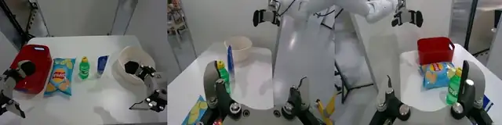
      <br><strong> Figure 12b Example of successful rollout 2</strong>
    </td>
    <td width="33%" align="center">
      
      <br><strong> Figure 12c Example of successful rollout 3</strong>
    </td>
  </tr>
</table>

Source: [AgibotTech/GE-Sim-V2 official GitHub repository ](https://github.com/AgibotTech/GE-Sim-V2).

<table>
  <tr>
    <td width="33%" align="center">
      
      <br><strong> Figure 13a Example of failed rollout 1</strong>
    </td>
    <td width="33%" align="center">
      
      <br><strong> Figure 13b Example of failed rollout 2</strong>
    </td>
    <td width="33%" align="center">
      
      <br><strong> Figure 13c Example of failed rollout 3</strong>
    </td>
  </tr>
</table>

Source: [AgibotTech/GE-Sim-V2 official GitHub repository ](https://github.com/AgibotTech/GE-Sim-V2).

Why is a failure example also important? Because an available world simulator must be able to generate failures. Simply beautifying all actions into successful video models cannot be used for policy evaluation; it will make weak policies appear strong in the simulator, ultimately misleading real deployment.

The training data for GE-Sim 2.0 includes teleoperation, on-robot policy deployment, rich object interaction, successful executions, and failure trajectories. Failure trajectories are important for learning boundary states, such as catching empty objects, falling, sliding, unstable contact, and incorrect task phase order.

## 15. Relations with BWM, τ0-WM, and RAW-Dream

| Method | Main Inputs | Main Outputs | Core Purpose | Differences between GE-Sim 2.0 |
| :--- | :--- | :--- | :--- | :--- |
| BWM | Initial image / historical frames + action trajectory | Action condition future video | Low-cost visual world simulation, WorldArena evaluation | BWM focuses more on video rollout; GE-Sim 2.0 adds state expert, judge, server/client closed loop interfaces |
| τ0-WM | Multi-view observation, language, state, candidate actions | action chunks, future video, progress score | Propose/evaluate/revise before execution | τ0-WM combines action generation and evaluation; GE-Sim 2.0 resembles an external world simulator environment |
| RAW-Dream | VLA action + task-agnostic world model + VLM reward | imagined RL update | Reinforce VLA within the world model | RAW-Dream follows a training paradigm; GE-Sim 2.0 focuses on serviceable learned simulator |
| WALL-WM | Current observation + event-level action conditions | Event-level future video/actions | Long-term event-level rehearsal | GE-Sim 2.0 emphasizes multi-view, proprioception, and policy closed-loop consistency |
| RoboDream | Robot-only trajectory + scene/object priors | Synthetic robot teaching video | Data generation | GE-Sim 2.0 focuses more on closed-loop evaluation of action conditions, rather than primarily performing data synthesis |

These articles can be read within the same world model context. They collectively address the question of “can robots perform a rehearsal before actual execution?” However, the feature of GE-Sim 2.0 is that the rehearsal results are packaged into an environment interface:

```text
env.reset(...)
obs, reward, state, info = env.step(actions)
```

This is closer to the format required by a robot training system than "generating an mp4 for someone to view".

## 16. Current reproduction boundary

GE-Sim 2.0 is more manipulable than many cutting-edge world models, but it still has limitations.

First, the currently released checkpoint is the **G01 + OmniPicker** version. Hugging Face indicates that it is post-trained on Genie-01(G01) + OmniPicker(OP) data, and G02 is supported in the roadmap. Other robots cannot be assumed to work seamlessly with a plug-and-play approach.

Second, the World Judge has not been fully open-sourced yet. The paper and project page show the integrated world judge, but the HF model card uses `coming soon`. The GitHub README indicates that the reward is empty by default and requires `RewardClient`. Therefore, the current tutorial cannot state that "reward-driven learning is available directly after downloading".

Third, it is not a strict physical simulation engine. It primarily outputs video and predicted states, without providing verifiable contact forces, collision constraints, rigid body solvers, joint dynamics, or safety boundaries. For real robot training, true experimentation and safe control mechanisms are still required.

Fourth, the video world model has a risk of hallucination. Even though GE-Sim 2.0 reduces motion following failures compared to the previous version, long-time domain, occlusion, flexible objects, transparent objects, liquids, and fine contacts may still cause errors.

Fifth, the computational power requirement is not low. The paper reports a single H100 with a 2.3-second 25-frame rollout; whether a regular consumer-grade GPU can run a full server stably depends on memory, kernel, Diffusers/Cosmos dependencies, and checkpoint configurations.

## 17. Recommended Questions for Team Learning

In the world model direction of Task04, it can be arranged as follows:

> Compare BWM, τ0-WM, and GE-Sim 2.0: All three are related to the action condition video world model. However, BWM focuses on the action condition video rollout; τ0-WM integrates action generation, video prediction, and action correction during testing; GE-Sim 2.0 packages the world model into a closed loop callable simulator. Please describe the inputs and outputs of the three models, whether they return proprioception, whether they have built-in rewards, the current open-source boundaries, and the minimum demo suitable for reproduction.

The delivery can occur without training the model, but it must be clearly explained:

- Why is GE-Sim 2.0 not just a video generation model?
- What problem does Pixel-aligned Action Condition solve?
- Why is State Expert necessary for closed loop policy rollout?
- Which parts of the open-source repository need to wait or be implemented further in the current paper by World Judge?
- What do `obs / reward / state / info` and `WorldModelEnv.step(actions)` represent respectively?
- What does WorldArena indicate, and what does it not indicate?

## 18. Recommended Reading Order

It is recommended to read in the following order:

1. First, refer to the Architecture Diagram on the project page to understand the three new capabilities: state, judge, and acceleration.
2. Check the Quickstart in the GitHub README to confirm that the method from the paper has been translated into a working server/client.
3. Examine arXiv Figure 1-3 to grasp action-conditioned rollout, State Expert, and World Judge.
4. Look at Figure 7-10 to understand WorldArena, real robot alignment, WM-filtered BC, and confusion matrix.
5. Finally, read the documentation for installation, replay, closed-loop, and adding rewards.

The most valuable point to take away from this article is:

> The next step for the robot world model is not just to generate more visually appealing future videos, but to output a state where the policy can continue to be used, and provide machine-verifiable evaluation signals for the rollout results.

## 19. Source of Information

The images in this article come from [ the official project page of GE-Sim 2.0 ](https://ge-sim-v2.github.io/), [ the official GitHub repository of AgibotTech/GE-Sim-V2 ](https://github.com/AgibotTech/GE-Sim-V2), and [ arXiv HTML ](https://arxiv.org/html/2605.27491v1). They have been saved locally `assets/` to ensure stable access for the tutorial. The text references [ arXiv:2605.27491 ](https://arxiv.org/abs/2605.27491), [ GitHub README ](https://github.com/AgibotTech/GE-Sim-V2), [ Hugging Face weight page ](https://huggingface.co/agibot-world/Genie-Envisioner-Sim-v2.0), and the official project page.
