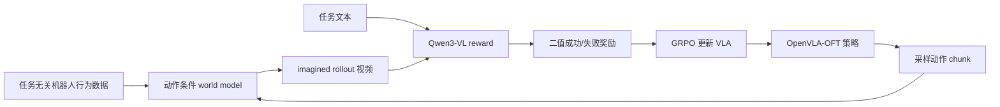

# RAW-Dream: Task-Independent World Model Enhancement VLA Introduction

This chapter introduces **RAW-Dream**, the method proposed in **Reinforcing VLAs in Task-Agnostic World Models**. RAW-Dream studies how a task-agnostic world model can support VLA post-training through imagined trajectories. As of 2026-06-27, the author homepage and arXiv page do not link an official code repository, so the current chapter focuses on the method, evidence, and a reproducibility plan.

After completing this section, you need to focus on three key points for judgment:

- It is not a policy that relies on pi0.5 as the base for ranking, as the policy base in the paper is OpenVLA-OFT.
- Its core advantage lies not in a new VLA base, but in using task-independent world model + zero-sample VLM reward for post-training RL training of VLA within imagined trajectories.
- Its simulation evaluations primarily use existing LIBERO held-out suites, while real robot evaluations involve the authors' own AgileX Piper task.

## 1. Paper and Code Status

| Item | Current Status |
| :--- | :--- |
| Paper | [arXiv:2605.12334](https://arxiv.org/abs/2605.12334), v1 submitted on 2026-05-12, v2 revised on 2026-05-20 |
| Author homepage link | [Kaixin Wang's homepage](https://kaixin96.github.io/) lists the arXiv link to this paper |
| Official project page | No independent project page yet |
| Official code | No RAW-Dream official repository yet |
| Recommended reading order | Start with the method figures, experimental tables, and implementation details in the appendix; prepare the interfaces before the official implementation becomes available |

If the code is released by the official team later, it is recommended to add another `02-RAW-Dream复现.md` under this directory. For now, this article serves as a paper introduction and a navigation guide for the repository.

## 2. Understand what it aims to solve with one picture

  

**Figure 1: Basic stance of RAW-Dream.** On the left are many previous world-model-based RL pipelines: after a downstream task arrives, an in-domain rollout is performed for this task, and then the world model and reward model are trained or fine-tuned. On the right is RAW-Dream: an reusable world model is trained using task-irrelevant behavior data, and a ready-made VLM assigns success/failure rewards to new tasks, allowing the VLA to perform RL within the world model.

Source: [RAW-Dream arXiv HTML](https://arxiv.org/html/2605.12334v2).

The “task-agnostic” here should not be interpreted as complete lack of robot data. A more accurate description is: the world model and reward model do not rely on the rollout of downstream tasks; however, the policy itself still goes through SFT first, and the world model also receives sufficient task-independent interaction data.

## 3. What bases were actually used

There are three models in this paper; do not mix them up when reading:

| Module | Selection in the paper | Function |
| :--- | :--- | :--- |
| VLA policy | OpenVLA-OFT | Generates actions, which are updated by GRPO later |
| World Model | Converted from Wan 2.1-T2V-1.3B DiT to an action-condition video model | Generates an imagined rollout given initial observations and action sequences |
| Reward Model | Freeze Qwen3-VL | Reads task text and the imagined video, then determines Success / Failure |

So it is not a pi0.5 base. The paper mentions VLA work such as pi0 and pi0.5 in the related work section, but the policy base for RAW-Dream is written as OpenVLA-OFT. The appendix also explains that they retain the probabilistic categorical action tokenization method for GRPO sampling; this is different from the L1 regression head of OpenVLA-OFT, which is more deterministic by nature.

## 4. Training and Post-training Processes

The RAW-Dream can be understood as the following link:

Specific to data:

- In the simulation, the author trains a basic policy using LIBERO-90, then adds noise to the actions to collect mixed success/failure rollouts, and uses these data to train the world model.
- For real robots, the author first uses Open X-Embodiment data, followed by approximately 4 hours of unlabeled, task-defined teleoperation play data.
- For downstream new tasks, only a small amount of SFT demo is required; the RL phase is mainly completed using the imagined rollouts in the world model.

## 5. The Most Important Tips to Remember

### Dual-Noise Verification

  

**Figure 2: An intuitive example of DNV.** The same action sequence, two sets of diffusion noise. If the first attempt is successful by Qwen3-VL, but fails after changing the noise again, it indicates that the first success might be just an illusion of the world model, rather than a stable physical result.

Source: [RAW-Dream arXiv HTML](https://arxiv.org/html/2605.12334v2).

DNV is the most engineering-oriented technique in this paper. It only generates a second world model for the imagined rollout that has been deemed successful by VLM, rather than performing double the computation for all trajectories. This helps filter out the problem of “world model assumes success -> reward hacking -> policy distortion”.

### Zero-sample VLM reward

The author did not train a complex reward model for each new task, but directly used Qwen3-VL to make binary classification judgments on success. The ablation studies in the paper are crucial: training the VideoMAE reward classifier with 10 1-shot demos resulted in poor performance. The author believes that it is prone to overfitting the expert trajectory appearance, leading to instability when generalizing to imagined rollouts.

### first-frame anchoring + progressive noise

When implementing a long rollout for the video world model, too strong first-frame conditions can cause ghosting: the object is already captured, but its original position appears as a remnant. The author’s approach is to anchor the first frame in each autoregressive step, while gradually increasing first-frame noise, allowing the model to reduce its rigid reliance on the first frame and rely more on recent context.

## 6. On which benchmarks is it evaluated?

  

**Figure 3: Task-independent play data and real robot downstream tasks.** On the left is the diverse desktop layout used for world model training, and on the right are four downstream tasks from the author's real robot experiments.

Source: [RAW-Dream arXiv HTML](https://arxiv.org/html/2605.12334v2).

The simulation part uses a ready-made LIBERO benchmark, but the protocol does not score directly on the training tasks. The authors trained the world model using LIBERO-90, and then evaluated it on four suites: LIBERO-Spatial, LIBERO-Object, LIBERO-Goal, and LIBERO-Long, which are held-out versions of the benchmark. There are 10 tasks in each suite.

The success rate of the core policy is as follows:

| Method | Target data | Spatial | Object | Goal | Long | Avg. |
| :--- | :--- | ---: | ---: | ---: | ---: | ---: |
| 1-shot SFT | 10 | 54.6 | 46.4 | 52.2 | 20.2 | 43.4 |
| Online RL Short | 522 | 58.4 | 60.2 | 55.2 | 17.6 | 47.9 |
| Online RL Long | 2570 | 68.8 | 78.8 | 65.2 | 22.4 | 58.8 |
| Zero-Shot WM + Qwen3-VL | 10 | 65.8 | 47.2 | 60.2 | 35.8 | 52.3 |
| Co-Train WM + Qwen3-VL | 10 | 73.2 | 60.2 | 58.4 | 36.6 | 57.1 |
| ID-FT WM + Qwen3-VL | 510 | 82.0 | 79.8 | 63.4 | 38.6 | 66.0 |

What is most noteworthy about this table is not the single-point SOTA, but the data budget: Zero-Shot WM can increase from 43.4 to 52.3 without any additional target rollout compared to 1-shot SFT; after some in-domain fine-tuning of the world model, ID-FT WM reaches 66.0.

Real robots are not public standard benchmarks, but rather the author’s own AgileX Piper experiments. Each task is performed 30 times; the average 3-shot SFT score is 50.0%, and after RL, it reaches 71.7%. This indicates that the method has been validated with real robots, but the scale still does not prove that the “large-scale general robot world model” has been resolved.

  

**Figure 4: Example of the real robot world model rollout.** The top row shows the real execution video, while the bottom row shows the predictions generated by the world model under the same initial observation and action sequence.

Source: [RAW-Dream arXiv HTML](https://arxiv.org/html/2605.12334v2).

## 7. Which repositories can be followed while reading this paper?

When RAW-Dream does not have an official code for now, everyone can first check the public projects it depends on:

| Direction | Recommended Entry | Why Watch |
| :--- | :--- | :--- |
| VLA Policy Base | [moojink/openvla-oft](https://github.com/moojink/openvla-oft) and [OpenVLA-OFT project page](https://openvla-oft.github.io/) | To understand action chunking, LIBERO evaluation, and the training interfaces of OpenVLA-OFT |
| OpenVLA Base Model | [openvla/openvla](https://github.com/openvla/openvla) and [OpenVLA project page](https://openvla.github.io/) | To understand the background of the OpenVLA series and Open X-Embodiment pre-training |
| Video World Model Base | [Wan-Video/Wan2.1](https://github.com/Wan-Video/Wan2.1) and [Wan2.1-T2V-1.3B](https://huggingface.co/Wan-AI/Wan2.1-T2V-1.3B) | The world model of RAW-Dream is based on the Wan 2.1-T2V-1.3B DiT modification |
| VLM Reward | [QwenLM/Qwen3-VL](https://github.com/QwenLM/Qwen3-VL) and [Qwen3-VL-8B-Instruct](https://huggingface.co/Qwen/Qwen3-VL-8B-Instruct) | To understand how it serves as a zero-shot success/failure reward |
| Simulation Benchmarks | [Lifelong-Robot-Learning/LIBERO](https://github.com/Lifelong-Robot-Learning/LIBERO) and [LIBERO project page](https://libero-project.github.io/main.html) | The main simulation evaluations of RAW-Dream come from LIBERO held-out suites |
| Robot Data | [google-deepmind/open_x_embodiment](https://github.com/google-deepmind/open_x_embodiment) and [Open X-Embodiment project page](https://robotics-transformer-x.github.io/) | One of the sources of pre-trained data for the real robot world model |

## 8. How to fit it into a learning roadmap

It is recommended to read it after LeWM:

1. First, examine LeWM to understand how the world model learns prediction and how it supports planning.
2. Then, examine RAW-Dream to understand how the world model serves as a virtual environment for post-training VLA.
3. Finally, return to OpenVLA-OFT / LIBERO to understand the policy, benchmarks, and action interfaces.

If you are working in areas such as long-time-domain VLA, contact event modeling, physical memory, or reward hacking, this paper is particularly worth considering due to the DNV and “task-independent physical prior” narrative. It may not be suitable for immediate reproduction, but it is ideal as a leading introduction that bridges the gap between previous and future work in the world model section.

## 9. Reference Materials

- RAW-Dream paper: [Reinforcing VLAs in Task-Agnostic World Models](https://arxiv.org/abs/2605.12334)
- arXiv HTML visual version: [2605.12334v2 HTML](https://arxiv.org/html/2605.12334v2)
- Author homepage link: [Kaixin Wang](https://kaixin96.github.io/)
- OpenVLA-OFT: [project page](https://openvla-oft.github.io/) / [code](https://github.com/moojink/openvla-oft)
- Wan 2.1: [code](https://github.com/Wan-Video/Wan2.1) / [Wan2.1-T2V-1.3B](https://huggingface.co/Wan-AI/Wan2.1-T2V-1.3B)
- Qwen3-VL: [code](https://github.com/QwenLM/Qwen3-VL)
- LIBERO: [project page](https://libero-project.github.io/main.html) / [code](https://github.com/Lifelong-Robot-Learning/LIBERO)
- Open X-Embodiment: [project page](https://robotics-transformer-x.github.io/) / [code](https://github.com/google-deepmind/open_x_embodiment)
