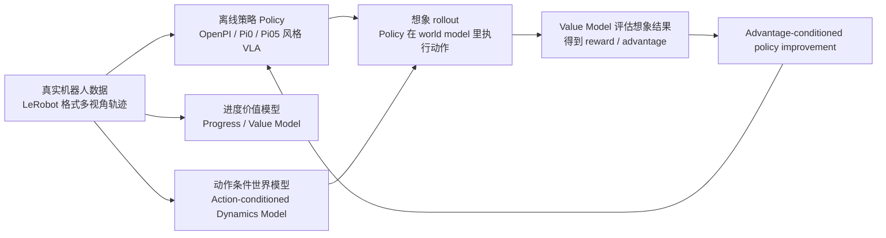

<!-- Generated by the offline translation workflow.
Source: 17-具身世界模型/RISE自我改进机器人策略复现/README.md
Source SHA-256: 4f0531f84e92578a48393acc84496fb6628a6dd82f5a7e7e6f65d830c41ff11d
Model: tencent/Hy-MT2-1.8B-GGUF:Q4_K_M
Review machine-translated technical claims before relying on them.
-->
# RISE Self-Improvement Robot Policy: Performing Reinforcement Learning in a Combined World Model "In Thought"

This chapter introduces you to **RISE: Self-Improving Robot Policy with Compositional World Model**. The corresponding paper is [arXiv:2602.11075](https://arxiv.org/abs/2602.11075)The official project page is [OpenDriveLab RISE](https://opendrivelab.com/RISE/), the official repository is [OpenDriveLab/RISE](https://github.com/OpenDriveLab/RISE)。

After completing this chapter, you can finish four tasks:

- Understand why RISE places robot policy improvements in the world model, rather than testing them directly on a real robot;
- Identify the three-stage pipeline in RISE repository: offline policy/value training, action-condition dynamics world model, and online imagination RL;
- Reproduction of RISE’s core Python environment on Blackwell GPU machines, along with downloading and verifying public dynamics model assets;
- Distinguish between official results, local smoke tests, and public weight boundaries, to avoid mistaking “a running environment” for “the complete reproduction of all paper results”.

## 1. What Problem Does RISE Solve Exactly

In robot manipulation tasks, imitation learning is very common: collect a set of human remote manipulation or expert demonstrations, then train a vision-language-action model so that the robot can output actions based on images, language commands, and its own state. The problem is that policies learned from offline data are usually fragile. When there are slight deviations in object positions, greater disturbances, or more complex contact processes, the policy may enter states it has never seen in the training data.

The most straightforward idea is to implement reinforcement learning, allowing robots to continue trial and error in the real world. However, there are several major challenges with real robots undergoing trial and error:

- The real robot rollout is slow, and each reset of the robotic arm takes time;
- Incorrect actions may damage the object, gripper, robotic arm, or environment;
- For tasks such as backpack organization, box closure, and dynamic conveyor belt sorting, there are many failure states, making it costly to collect on-policy experience;
- It is difficult to parallelize dozens or hundreds of environments in real scenarios.

The core idea of RISE is: **Instead of allowing the robot to make extensive trial-and-error in the real robot, a action-condition world model is trained. The policy then performs rollouts in an “imagined environment”, and a progress value model assigns scores to these imagined outcomes. Finally, the advantage is fed back to the policy.**

<p align="center">
  
</p>

**Figure 1: Overview of RISE official task performance.** This figure presents the three types of real robot manipulation tasks that the paper focuses on: dynamic sorting, backpack organization, and box closing. Note that the goal of RISE is not to control general chat-style robots, but to enable existing manipulation policies to continue improving in high-dynamic, fine-contact, and strong-disturbance tasks.

<p align="center"><sub> Source: RISE official project page. </sub></p>

## II. The One-Sentence Architecture of RISE

RISE can be summarized as:



The most important aspect of this link is the term "composite". RISE did not cram all functions into a huge black box model, but instead divided the world model into two complementary parts:

- **dynamics model** is responsible for predicting "what the multi-view image will look like in the future after the action is executed";
- **progress value model** is responsible for determining "how close this future is to success or further away".

This is very suitable for robot learning: the visual future prediction can leverage the capabilities of video diffusion models, task progress judgment can rely on policy/value models to understand the trajectory of success and failure, and policy updates are handled by distributed RL frameworks like RLinf.

## III. Official Video: Build an Intuitive Impression First

The following videos are from the RISE official project page or official repository materials. Download them locally `assets/videos/` to make the tutorial accessible over time. The official videos are used to understand the paper objectives, but it does not mean that the current chapter has re-trained the same policy.

<video controls muted preload="metadata" width="100%">
  <source src="../../../17-具身世界模型/RISE自我改进机器人策略复现/assets/videos/website_teaser.mp4" type="video/mp4">
</video>

**Video 1: RISE Official Overview Video.** First, let's look at the challenges of the task: the robot needs to handle dynamic objects in real physical contact, as well as unstable states such as flexible backpack space and box lid closure.

<p align="center"><sub> Source: RISE official project page `website_teaser.mp4`. </sub></p>

<table>
  <tr>
    <td width="33%">
      <video controls muted preload="metadata" width="100%">
        <source src="../../../17-具身世界模型/RISE自我改进机器人策略复现/assets/videos/conveyor_continuous_11_RISE_v3.mp4" type="video/mp4">
      </video>
      <p><strong> Video 2: Dynamic conveyor sorting. </strong> The challenge here is that the target moves continuously; the policy must adjust while observing. </p>
      <p align="center"><sub> Source: RISE official project page. </sub></p>
    </td>
    <td width="33%">
      <video controls muted preload="metadata" width="100%">
        <source src="../../../17-具身世界模型/RISE自我改进机器人策略复现/assets/videos/backpack_continuous_21_RISE_v3.mp4" type="video/mp4">
      </video>
      <p><strong> Video 3: Backpack organization. </strong> The task involves spatial constraints, flexible openings, and multi-step placement; failure recovery is crucial. </p>
      <p align="center"><sub> Source: RISE official project page. </sub></p>
    </td>
    <td width="33%">
      <video controls muted preload="metadata" width="100%">
        <source src="../../../17-具身世界模型/RISE自我改进机器人策略复现/assets/videos/box_continuous_10_RISE_v3.mp4" type="video/mp4">
      </video>
      <p><strong> Video 4: Box closing. </strong> This task tests contact accuracy; the policy needs to push the object into a closable area. </p>
      <p align="center"><sub> Source: RISE official project page. </sub></p>
    </td>
  </tr>
</table>

<video controls muted preload="metadata" width="100%">
  <source src="../../../17-具身世界模型/RISE自我改进机器人策略复现/assets/videos/dynamics_world_visualization_compressed.mp4" type="video/mp4">
</video>

**Video 5: RISE official dynamics world model visualization.** This video demonstrates how the world model predicts future visual results based on historical observations and actions. It is not a simple image frame interpolation, but a multi-perspective future prediction with action conditions.

<p align="center"><sub> Source: RISE official project page. </sub></p>

## IV. Method Details: What Each of the Three Types of Models Learns

First, translate the core mathematical objects in the paper into engineering language. RISE is not just training a "imagining video model," but breaks down the RL interactions in real environments into three learnable modules:

```text
policy π:      根据当前观测和任务，提出未来 H 步动作 chunk
dynamics D:    根据历史观测和动作 chunk，预测未来 H 步多视角观测
value V:       根据观测和任务，估计当前状态离成功还有多近
```

The paper writes multi-perspective observation as `o_t = [m_t^1, ..., m_t^n]`, where `n` is the number of cameras. The historical window is `O_t = {o_{t-N}, ..., o_t}`, and the action is not a single step action, but a segment of action chunk:

```text
a_t = [a_t, a_{t+1}, ..., a_{t+H-1}]
```

What is learned in the dynamics model:

```text
o_hat_{t+1}, ..., o_hat_{t+H} = D(O_t, a_t)
```

The value model assigns a progress score to each imagined future state `V(o_hat, l)`, where `l` is the task language instruction. The most crucial advantage of RISE is defined as:

```text
A(o_t, a_t, l) = (1 / H) * sum_{k=1..H} [ V(o_hat_{t+k}, l) - V(o_t, l) ]
```

This formula is worth remembering: **The quality of a motion chunk depends not on how beautiful its motion is, but on how much the world model believes the task progress has improved on average after execution, as determined by the value model.** This also explains why RISE must have both dynamics and value: without value, there are only future videos, no learning signals; without dynamics, it is impossible to evaluate what state the newly proposed actions of the current policy will bring the robot into.

When applying this formula to the repository, you can read it like this:

| Paper Object | Engineering Meaning | Code/Configuration Entry |
| --- | --- | --- |
| `π` | VLA policy, output action chunk | `policy_and_value/policy_offline_and_value` |
| `D` | action-conditioned dynamics video model | `dynamics/dynamics_model/infer.py` |
| `V` | progress value / reward model | `Policy_offline_release`, `value_release` |
| `A` | advantage label calculated by imagination rollout | `action_advantage`, `with_advantage_condition` |
| Imagination rollout | policy interacts with the world model | `policy_and_value/policy_online/examples/embodiment/config/rl_release.yaml` |

From a paper perspective, the theoretical design of RISE has three key points.

First, the combined world model is more suitable for robot RL than a single large model. Robot control requires both “action-可控 future predictions” and “progress evaluations sensitive to failures”. These two requirements have different demands on the model structure and training objectives. Therefore, RISE separates it into a dynamics model and a progress value model, and then combines them to provide advantage for the policy.

Second, the **value model cannot merely learn the time progression**. In the paper, the `value` is first learned using `progress regression` with a dense progress signal such as `t/T`, and then TD learning is introduced, enabling the model to learn the value decline in error states from successful/failed trajectories. This is important for tasks with rich interactions: for example, when a zipper gets stuck or a box lid barely closes, these failures may be subtle visually, and simply learning from time progression would lead to over-optimism.

Thirdly, **imagine the rollout not as an infinite future scenario**. Generative video models will accumulate errors. The self-improving loop described in the paper starts from the initial state of offline data sampling, and can only continuously simulate a limited number of steps before incorporating the simulated states and action advantages into the training buffer. This boundary is important for practice: the world model is designed to provide high-throughput, low-cost short-term interaction signals, rather than replacing a complete long-term simulator of the real world.

### 1. Offline policy: Learn a functional VLA policy first

The policy/value code of RISE is in:

```text
policy_and_value/policy_offline_and_value
```

It is based on a vision-language-action model in the OpenPI / Pi0 / Pi05 style. Inputs generally include:

- Multi-view images, such as `top_head`, `hand_left`, `hand_right`;
- Robot proprioception, such as joint states;
- Language prompts or task texts;
- Action chunks, which refer to a sequence of future actions in one output;
- In the improved configurations of RISE, `action_advantage` is also added.

The two names worth noting in the official release configuration are:

```text
Policy_offline_release
value_release
```

`Policy_offline_release` is a policy training configuration with advantage conditioning. Its repack transform will pack the `action_advantage` field from the dataset into the model input. In other words, the advantage calculated by RISE in the future is not only used for the PPO loss, but also becomes part of the policy condition, enabling the policy to know “which actions are more worth reinforcing”.

### 2. progress value model: Determine whether the future is closer to success

The value model and policy share a similar OpenPI structure, but they open up the value head. What it learns is not a simple binary classification, but task progress or value signals: current state, future state, and whether an action advances the task toward success.

This step is very crucial in robot tasks. A world model that generates future videos does not mean we know whether the generated videos are good or not. For example, when a robotic arm pushes an object to the right side of the screen, it may not be successful; in a backpack task, if an object is put into the backpack but the zipper gets stuck, it may also be a failure. The value model is responsible for converting these visual futures into optimized rewards / advantages.

After training the value model during the offline phase, the repository provides a annotation script:

```bash
cd $RISE_ROOT/policy_and_value/policy_offline_and_value
bash label_value.sh vis_value_release_joint_T /path/to/value/checkpoint/steps
```

This script will add the `value / advantage` tags to the LeRobot dataset. When you perform your own tasks, this step essentially writes back the “trajectory quality assessment” into the dataset, preparing for policy improvement.

In the paper, there are two complementary losses for the value model training. Practically, it can be understood as follows:

| Loss | Intuition | Why it is needed |
| --- | --- | --- |
| Progress regression | Ensure the value increases roughly as the task progresses | Provide dense, stable, and well-optimizable learning signals |
| TD learning | Adjust the value using success/failure feedback | Make the model more sensitive to states such as failure, stagnation, and deviation from goals |

The ablation results in the paper report also support this conclusion: removing 'progress' significantly reduces the success rate, and removing 'TD learning' has an even greater impact. For your own robot tasks, if the 'value' only learns with time progress, there is a high chance of achieving the illusion that "the performance gets better as the action is continuously executed"; if it relies solely on sparse successes/failures, stable training will be very difficult.

### 3. dynamics model: Video world model of action conditions

RISE's dynamics model is in:

```text
dynamics/dynamics_model
```

It uses the LTX-Video tokenizer, T5 text encoder, and VAE as the backbone, and then integrates the action-conditioned diffusion transformer trained by RISE. These components can be seen in the official configuration:

```yaml
pretrained_model_name_or_path: path/checkpoints
tokenizer_class: T5Tokenizer
textenc_class: T5EncoderModel
vae_class: AutoencoderKLLTXVideo
diffusion_model_class: LTXVideoTransformer3DModel
diffusion_scheduler_class: FlowMatchEulerDiscreteScheduler
```

<p align="center">
  
</p>

**Figure 2: Structural schematic of the RISE world model.** It can be understood as a “action condition future video generator”: historical multi-view images enter the VAE latent space, action tokens control the diffusion transformer to generate future latents, and then the VAE decodes them into future multi-view videos.

<p align="center"><sub> Source: RISE official project page. </sub></p>

It must be clearly distinguished from the common text-to-video approach. The RISE dynamics model does not allow users to input a prompt and then let the model freely generate robot videos; instead, it models the conditional transition in robot control.

```text
P(未来多视角图像 | 当前/历史多视角图像, 未来动作序列, 任务条件)
```

In the official `infer.py` entry, the input-output relationship is more detailed:

| Item | Meaning in RISE dynamics inference |
| --- | --- |
| Image input | Historical observation frames from three cameras `top_head`, `hand_left`, and `hand_right`. In the source code, each camera reads `0.png` and repeats it into 4 frames for memory. |
| Action input | `act_tokens.pt`, with a shape of `[batch, 25, action_dim]`; `[1, 25, 14]` is used in this chapter's smoke test. |
| Text condition | The code loads the T5 tokenizer/text encoder, but `infer.py` covers `prompt` with an empty string internally; this entry does not expose the usage of "user input prompt to generate video". |
| Model output | A three-view video prediction for approximately 25 future steps, saved as a horizontally concatenated `video.mp4`. |

So, a more accurate statement is: **RISE dynamics model is a multi-perspective future prediction model for action conditions, not a general text-to-video model.** Text/task conditions are important throughout the RISE data and policy pipeline, but the official dynamics checkpoint inference that runs in this chapter mainly verifies the "observation + action -> future vision" chain.

<p align="center">
  
</p>

**Figure 3: Visual representation of RISE dynamics world model.** This figure corresponds to the world-model prediction in the official video. When studying, it is recommended to distinguish it from the predictions in the regular video: the future here is not generated unconditionally, but is driven by the robot action sequence.

<p align="center"><sub> Source: RISE official project page. </sub></p>

The paper also emphasizes two practical constraints of the dynamics model: **speed** and **action consistency**. RL training requires a large number of rollouts; if generating 25 steps of multi-view future is too time-consuming, the entire self-improvement process will be blocked by the world model’s processing capacity. Additionally, for the video to appear realistic, the prediction must align with the given action; otherwise, the advantage learned by the policy becomes noise. Therefore, RISE adds action conditions to the video diffusion backbone and uses task-centric batching to enhance contrast learning between different actions within the same task scenario.

## 5. Online Imagination RL: The Real "Self-Evolution Through Imagination"

The format used in the RISE online phase is:

```text
policy_and_value/policy_online
```

The configuration entry is:

```text
policy_and_value/policy_online/examples/embodiment/config/rl_release.yaml
```

There are several switches in this configuration that are particularly important:

| Configuration Item | Meaning |
| :-- | :-- |
| `algorithm.policy_config_name: Policy_offline_release` | Policy configuration consistent with online phase loading and offline training |
| `rollout.model_dir` | Path to offline IL policy checkpoint |
| `actor.checkpoint_load_path` | Actor initialized from rollout policy checkpoint |
| `add_dynamics_model: True` | Open dynamics world model |
| `dynamics_model_config` | Pointing to `dynamics/dynamics_model/configs/ltx_model/infer.yaml` |
| `add_reward_model: True` | Open progress value / reward model |
| `reward_model_config: value_release` | Configured using value model |
| `reward_model_ckpt` | Path to value model checkpoint |
| `with_advantage_condition: True` | Advantage condition used in policy input |
| `advantage_scale: 5` | Strength of advantage's impact on policy update |

<p align="center">
  
</p>

**Figure 4: RISE self-improvement pipeline.** The offline policy generates candidate actions first, the world model predicts the consequences of these actions in imagination, the value model scores the imagined results, and finally the advantage is fed back to the policy. It can be viewed as a closed loop for policy improvement that does not rely on a real robot for intensive trial and error.

<p align="center"><sub> Source: RISE official project page. </sub></p>

There are several conclusions in the paper's experimental section that are very suitable for guiding reproduction:

| Paper Phenomenon | Insights for Practical Implementation |
| --- | --- |
| RISE improves success rate by approximately 35%-45% compared to the baseline for three tasks: dynamic sorting, backpack organization, and box closing | The most valuable scenarios for world model are long-duration tasks that involve dynamic interactions, rich contact, and difficult recovery |
| Using only online actions has limited benefits; adding the online states generated by the world model significantly enhances performance | Do not view it merely as “sampled multiple sets of actions”; the key is expanding the distribution of training states |
| Too low an offline data ratio leads to failure, while too high one restricts exploration | Self-improvement still requires a mix of offline data to prevent the policy from being skewed by imagined data or forgetting basic skills |
| Removing dynamics pre-training, task-centric batching, progress loss, and TD learning all result in performance decline | These four components are not decorative; they correspond to visual priors, action controllability, dense progress signals, and failure sensitivity respectively |
| Dynamics/value are used only during the training phase | In real robot deployment, the improved policy is executed; there is no need to run the video world model for every step |

Therefore, when reading papers, it is not recommended to just remember that "robots can dream". A more engineering-oriented understanding is: RISE uses a short-field-view, controllable-action, and scoreable world model to replace the expensive real robot on-policy data stream with a high-throughput imagination data stream, and then uses an advantage-conditioned policy to absorb these imagined experiences back into the control strategy.

In the execution structure of RLinf, the online phase can be divided into three groups of roles:


The `EnvGroup` here does not necessarily refer to a real robot parallel environment. The key to RISE is that the high-cost rollouts involved in policy improvements can be transferred to the world model. For real robot research, this is equivalent to shifting the "experimentation budget" from hardware to GPUs.

## VI. Warehouse Replication: Blackwell Environment Route

In this chapter, the Blackwell GPU is used for replication, so the old cu124 installation method from the official `install.sh` cannot be directly copied. On the Blackwell machine, it is important to ensure that the PyTorch wheel is supported first `sm_120`.

It is recommended to use a separate environment to avoid contaminating the existing OpenPI or Isaac environments:

```bash
export RISE_ROOT=/path/to/RISE
export RISE_ENV=/path/to/envs/rise-py311

micromamba create -y -p $RISE_ENV python=3.11
micromamba run -p $RISE_ENV python -m pip install \
  torch==2.8.0+cu128 torchvision==0.23.0+cu128 \
  --index-url https://download.pytorch.org/whl/cu128
```

The key results that were actually verified during the local replication are as follows:

```text
torch: OK 2.8.0+cu128
torchvision: OK 0.23.0+cu128
torch cuda: 12.8
device: NVIDIA RTX PRO 6000 Blackwell Workstation Edition
capability: (12, 0)
arch list: ['sm_70', 'sm_75', 'sm_80', 'sm_86', 'sm_90', 'sm_100', 'sm_120']
cuda matmul: OK
```

**Checkpoint 1: Blackwell environment check.** This check confirms that PyTorch can recognize the Blackwell GPU, the wheel contains `sm_120`, and a CUDA matrix multiplication can be executed properly. It does not prove that RISE has converged during training; it only confirms that the underlying GPU stack is available.

The local replica also includes a check script, which you can write in a similar format in your own repository:

```bash
cd $RISE_ROOT
bash scripts_local/check_rise_env.sh $RISE_ENV
```

If `sm_120` is not listed in the arch list here, it means the PyTorch version is still not suitable for Blackwell. You need to remove the old torch/torchvision/nvidia CUDA wheel, and then install a cu128 or newer Blackwell-capable wheel.

## VII. Model asset download and verification

The model assets publicly released by RISE are mainly dynamics models. The `policy/value checkpoint` is still a placeholder path in the official release configuration; users need to train or prepare it themselves.

Public assets that have been downloaded and verified in this chapter include:

```text
checkpoints/
├── text_encoder/
│   ├── config.json
│   ├── model-00001-of-00004.safetensors
│   ├── model-00002-of-00004.safetensors
│   ├── model-00003-of-00004.safetensors
│   ├── model-00004-of-00004.safetensors
│   └── model.safetensors.index.json
├── tokenizer/
│   ├── added_tokens.json
│   ├── special_tokens_map.json
│   ├── spiece.model
│   └── tokenizer_config.json
├── vae/
│   ├── config.json
│   └── diffusion_pytorch_model.safetensors
└── dynamics_model/pretrained/
    └── diffusion_pytorch_model.safetensors
```

Download source:

- LTX-Video backbone：[Lightricks/LTX-Video](https://huggingface.co/Lightricks/LTX-Video)
- RISE dynamics checkpoint：[OpenDriveLab-org/RISE_Assets](https://huggingface.co/OpenDriveLab-org/RISE_Assets)

Local verification result:

```text
required files OK: 13
vae/diffusion_pytorch_model.safetensors keys 190
dynamics_model/pretrained/diffusion_pytorch_model.safetensors keys 797
```

**Checkpoint 2: Model asset verification.** This check confirms that the public dynamics assets have been fully downloaded, and two safetensors files can be read. It does not indicate that the policy/value training is complete, nor does it mean that online self-improvement can be started directly.

If downloading large HF files is slow in the domestic network environment, you can first try downloading the LTX-Video assets via ModelScope mirror, and then download the RISE dynamics weights from Hugging Face. For large files, it is recommended to use `aria2c -c` for breakpoint resumption.

## VIII. Official dynamics checkpoint inference smoke test

To confirm that the officially published dynamics checkpoint is not just "readable by files", this chapter ran an enhanced smoke test once. Input the official `backpack_packing_sample_data` for episode 0 from RISE_Assets:

- Extract `0.png` to `3.png` from the three official video files `observation.images.top_head`, `observation.images.hand_left`, and `observation.images.hand_right`, to serve as the three-view historical observations required for `infer.py`;
- Extract 25 steps after the 4th frame from the `action` field in the official parquet file, and save it as `act_tokens.pt` in `[1, 25, 14]`;
- Use the downloaded `checkpoints/` from this chapter as the LTX-Video backbone and RISE dynamics checkpoint;
- Replace the placeholder path `path/checkpoints` in the official `infer.yaml` with `checkpoints` in the local configuration of the tutorial.

This reasoning can be written as the following input-output contract:

```text
输入:
  observation.images.top_head/0.png ... 3.png
  observation.images.hand_left/0.png ... 3.png
  observation.images.hand_right/0.png ... 3.png
  act_tokens.pt                     # [1, 25, 14]
  checkpoints/                      # LTX-Video + RISE dynamics checkpoint

输出:
  backpack_history_outputs/video.mp4 # 三视角未来视频预测
```

No natural language prompt was provided here. Although the model component includes a T5 text encoder, the official `infer.py` will set `prompt` to an empty string. What truly determines future changes are the historical multi-perspective images and actions tokens. This can be understood as providing the world model with a short history of the current scene, and then telling it, “The robot will perform these 25 actions next,” so that it can predict what the three-way camera will see in the future.

Key logs during reasoning are as follows:

```text
>>> mismatched_keys: []
>>> missing: []
>>> unexpected: []
>>> Loaded weights from pretrained checkpoint: checkpoints/model/diffusion_pytorch_model.safetensors
Total parameters for transfomer model:(1990672572, 1990672572)
100%|██████████| 50/50 [00:01<00:00, 33.09it/s]
```

<video controls muted preload="metadata" width="100%">
  <source src="../../../17-具身世界模型/RISE自我改进机器人策略复现/assets/videos/local_official_checkpoint_backpack_history.mp4" type="video/mp4">
</video>

**Video 6: Local official dynamics checkpoint inference.** The video is a horizontal concatenation of three cameras, with a resolution of `768x192`, 10 FPS, and a total of 29 frames. In this version, the real continuous 4 frames from the official sample are used as historical observations, and the action tokens are aligned to the next 25 steps after frame 4. Compared to the minimum smoke test that only repeats frame 0, the image stability is significantly better.

<p align="center">
  
</p>

**Figure 5: Local four-frame historical input frame extraction.** This figure shows a three-frame mosaic of the locally generated video in this chapter. As can be seen, the scene structure from three perspectives remains largely stable, but the motion progression is still weak, and the detail quality cannot compare with that of the official demonstration video. Therefore, this result indicates that the inference process using the public checkpoint can run successfully on the local machine and produce a relatively stable short-term future prediction; however, it does not yet represent the visual quality achieved in the paper or the official demonstration video.

We want to achieve a near-identical local effect to the official version. The most important thing is to align the input conditions first. We made a minor adjustment this time: in the `load_images()` of the official `infer.py`, although `n_mem = 4` is set, `i` is fixed as `0` within the loop. As a result, the same starting image is read repeatedly. Here, this fixed assignment line has been removed, so the script reads four frames of real history: `0.png`, `1.png`, `2.png`, and `3.png`. Then, the 25-step action after the 4th frame serves as `act_tokens.pt`.

Even so, there is still a gap between the official display and the actual content. The main reasons include:

- This chapter only performed the minimum smoke test; no task-specific fine-tuning was carried out, and online imagination RL was not run fully;
- The public assets are pre-trained dynamics models. Some task-specific configurations in the official repository still refer to internal author paths, such as `release_ckpt_dynamics/box/diffusion_pytorch_model.safetensors`;
- The actions in this chapter are derived from the next 25 steps of a sample episode to verify the integration of action tokens. They are not actions replanned by the improved RISE policy for the current state;
- Official demonstration videos are usually the results after task configuration, data alignment, and visualization processing. Local smoke tests should not be compared with them in an equivalent manner.

This smoke test also has clear boundaries:

- It is not a complete benchmark rollout as described in the paper;
- It does not load policy checkpoints or value checkpoints;
- It does not perform online RL policy improvement;
- The input actions come from the official sample episode, not re-generated by the RISE policy;
- The output video is used to verify the dynamics checkpoint inference process, and is not used to determine the final task success rate.

When replicating by yourself, you can prepare the input according to the following approach:

```bash
cd $RISE_ROOT/dynamics/dynamics_model

# 1. 准备三路相机 0.png 到 3.png 四帧历史
mkdir -p official_infer/backpack_history_input/observation.images.top_head
mkdir -p official_infer/backpack_history_input/observation.images.hand_left
mkdir -p official_infer/backpack_history_input/observation.images.hand_right

# 2. 从 LeRobot parquet 读取第 4 帧之后的未来 action，保存为 [1, 25, 14] 的 act_tokens.pt
# 3. 使用本地 infer 配置运行官方 dynamics checkpoint
python infer.py \
  --config_file official_infer/infer_local.yaml \
  --image_root official_infer/backpack_history_input \
  --output_path official_infer/backpack_history_outputs \
  --act_tokens_path official_infer/backpack_history_input/act_tokens.pt \
  --norm_constant FINETUNE_TASK
```

**Checkpoint 3: Official dynamics checkpoint inference.** This step proves that the public dynamics model can perform a minimum forward inference and generate future multi-view videos. However, it still does not prove that policy/value/online RL has been fully reproduced.

## 9. Data Format: Why LeRobot is the Middle Layer Here

The offline policy/value and dynamics model of RISE are organized in a LeRobot-style format. A task dataset usually looks like this:

```text
task_A/
├── data/
│   └── chunk-000/
│       ├── episode_000000.parquet
│       └── ...
├── meta/
│   ├── info.json
│   ├── episodes.jsonl
│   ├── episodes_stats.jsonl
│   └── tasks.jsonl
└── videos/
    └── chunk-000/
        └── observation.images.<camera_name>/
            ├── episode_000000.mp4
            └── ...
```

The dynamics model documentation recommends preprocessing the video to `256x192` and saving it to `videos_small/`. This step is not just about saving a little memory; it also makes VAE encoding, multi-view stitching, and training batches more stable.

```bash
cd $RISE_ROOT/dynamics/dynamics_model
./preprocess.sh <dataset_name>
```

**Checkpoint 4: Video preprocessing check.** After success, you should see a `videos_small/` under each dataset, and the directory structure matches that of the original `videos/`. This check confirms that the video preprocessing process works properly, but it does not prove that the training data quality is sufficient.

## Ten. From zero to full training, what do we need to fill in?

If you want to run RISE with complete robot data, it is recommended to follow the following order:

1. **Prepare LeRobot data.** At least include multi-view videos, states, actions, task texts, and meta information. The action dimensions, camera names, and prompts should match the configuration.
2. **Calculate norm statistics.** Run `Compute_norm` first to let the policy/value know how states and actions are normalized.
3. **Train the offline policy.** Use `Policy_offline_release` or adjust the configuration according to your camera/action dimensions.
4. **Train the value model.** Use `value_release` to learn the progress/value signal.
5. **Label data using the value model.** Generate fields such as `action_advantage` so that the policy can perform advantage conditioning.
6. **Prepare the dynamics model.** You can load the official dynamics checkpoint first, or fine-tune with your own data.
7. **Configure online RL.** Fill in `rollout.model_dir`, `reward_model_ckpt`, `dynamics_model_config`, and GPU placement in `rl_release.yaml`.
8. **Run the imagination rollout.** First, validate the world model, reward model, and actor communication with a small batch and a small number of environments, then scale up.

The issue that most often causes a bottleneck in this link is not a single command, but **field alignment**: the camera name, action dimension, action chunk, norm key, checkpoint path, and policy config must be consistent.

## 11. Public Reproduction Boundary

The boundaries must be clearly explained here to avoid misunderstandings:

- The official repository has made the training code, documentation, sample data, and pre-trained dynamics model available;
- There is no complete policy/value checkpoint in the public assets;
- `Policy_offline_release`, `value_release`, and `rl_release.yaml` still contain placeholder paths such as `path/to/ckpt` and `path/to/reward/model/ckpt/steps`;
- What has been completed in this chapter includes environment reproduction, Blackwell stack adaptation, download of public dynamics assets, safetensors validation, local archiving for official media, and pipeline parsing;
- To fully reproduce the paper’s numerical results, real robot data on a paper-scale, policy/value training, dynamics fine-tuning, online imagination RL training, and evaluation on a real robot are still required.

Therefore, the purpose of this chapter is: **to help everyone understand the RISE methods and engineering processes, and set up a basic environment for continued training**. It is not about running all the experimental results from the paper again with one click.

## XII. Everyone can continue to explore the source code locations in depth

| Learning Objectives | Recommended Reading Path |
| :-- | :-- |
| View policy/value configuration | `policy_and_value/policy_offline_and_value/src/openpi_value/training/config.py` |
| View offline training entry | `policy_and_value/policy_offline_and_value/train.sh` |
| View value annotation | `policy_and_value/policy_offline_and_value/label_value.sh` |
| View dynamics inference | `dynamics/dynamics_model/infer.py` |
| View dynamics configuration | `dynamics/dynamics_model/configs/ltx_model/infer.yaml` |
| View online RL configuration | `policy_and_value/policy_online/examples/embodiment/config/rl_release.yaml` |
| View checkpoint conversion | `policy_and_value/policy_online/toolkits/ckpt_convertor/` |

If you only want to understand the ideas first, it is recommended to read `config.py`, `infer.yaml`, and `rl_release.yaml` first. These three files correspond to policy/value, world model, and online imagination RL respectively.

## XIII. Reference Materials and Source of Materials

- RISE paper:[RISE: Self-Improving Robot Policy with Compositional World Model](https://arxiv.org/abs/2602.11075)
- RISE official project page:[https://opendrivelab.com/RISE/[[EE_KEEP_0003]]
- RISE official repository:[OpenDriveLab/RISE](https://github.com/OpenDriveLab/RISE)
- RISE public model assets:[OpenDriveLab-org/RISE_Assets](https://huggingface.co/OpenDriveLab-org/RISE_Assets)
- LTX-Video backbone：[Lightricks/LTX-Video](https://huggingface.co/Lightricks/LTX-Video)
- OpenPI project:[openpi/openpi](https://github.com/openpi/openpi)
- RLinf documentation:[https://rlinf.readthedocs.io[[EE_KEEP_0013]]

In this chapter, the official images and videos of `assets/official_images/` and `assets/videos/` come from the RISE official project page or official repository. The locally converted `teaser.mp4`, `conveyor.mp4`, `backpack.mp4`, and `box.mp4` are from the RISE repository `rise_assets/*.gif`, and are only used for tutorial demonstration and learning reference.
