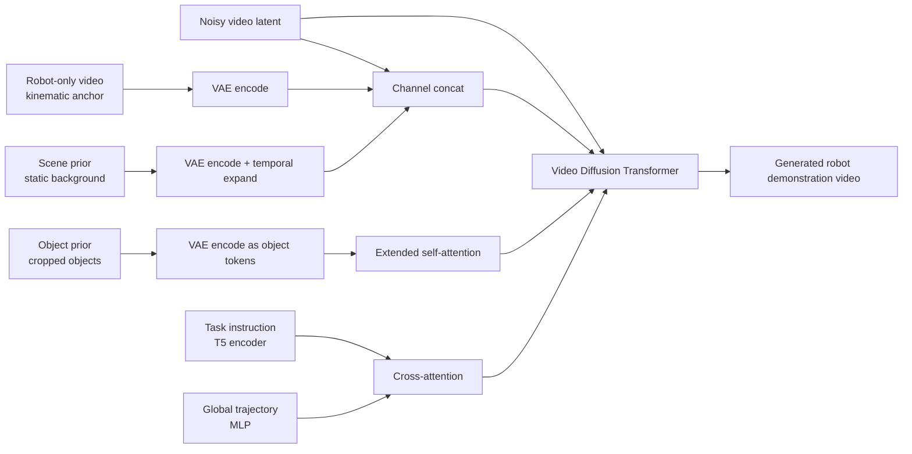

# RoboDream: Introduction to Data Synthesis of Composite World Model

This introduction covers **RoboDream: Compositional World Models for Scalable Robot Data Synthesis**, submitted to arXiv on 2026-06-01 by authors from the USC Physical Superintelligence Lab and Toyota Research Institute. It follows WoG and WALL-WM by focusing on scalable robot-data synthesis with composable world models.

RoboDream follows the foundation chapters on diffusion mathematics, VAE, and DDPM and belongs to the frontier world-model sequence. LeWM introduces latent world models, RISE studies policy self-improvement with compositional world models, RAW-Dream enhances VLA through a world model, WoG models condition spaces, WALL-WM represents event-level world actions, and RoboDream focuses on **synthesizing robot demonstrations with a composable video world model**.

After completing this section, everyone needs to focus on one sentence:

> RoboDream is not a neural simulator that can perform real-time `step(action) -> next_state` like MuJoCo / Isaac, but rather a world model that synthesizes data using robot-only trajectories as a framework, along with scene prior and object prior to re-render teaching videos.

This sentence is very important. It explains why RoboDream is worth watching, and also prevents people from being misled by the term "world model".

## 1. Paper, project page, and code status

| Item | Current Status |
| :--- | :--- |
| Paper | [arXiv:2606.02577](https://arxiv.org/abs/2606.02577), submitted on 2026-06-01 |
| Project Page | [RoboDream project page](https://junjieye.com/RoboDream/) |
| Official Repository | [Jay-Ye/RoboDream](https://github.com/Jay-Ye/RoboDream) |
| Code Status | As of 2026-07-02, the repository is public, but the README states **Code coming soon**, and the training, data generation, and policy learning pipelines have not been fully released yet |
| License | The official repository shows Apache-2.0 |
| Base Video Model | The paper indicates fine-tuning from **Cosmos-Predict2 2B**; note that the current page of NVIDIA's `cosmos-predict2` repository suggests it has been archived and recommends migrating to Cosmos-Predict2.5. Please fix the corresponding version first for reproduction experiments |
| Training Data | Approximately 40,000 DROID episodes with camera calibration |
| Training Resources | The paper reports 2 nodes, 8 NVIDIA A100 GPUs per node, requiring about 1 week of training |
| Downstream Policy | Diffusion Policy, used to isolate and observe the impact of RoboDream-generated data on policy learning |

Currently, this does not fit as a reproduction tutorial that explains how to reproduce the paper results from scratch. A more reasonable approach is to first understand its architecture diagram, data flow, experimental conclusions, and boundary conditions thoroughly; after the official code is available, then reproduce it using the official training/generation/policy pipeline.

## 2. What problem is it actually solving

<p align="center">
  
</p>

**Figure 1: RoboDream overview animation.** Its goal is not to generate robot videos out of thin air, but to re-draw old trajectories onto new objects, new scenes, and new perspectives, given a predetermined robot motion skeleton.

Source: [RoboDream official GitHub repository ](https://github.com/Jay-Ye/RoboDream).

Imitation learning for robots lacks data, and this is a well-known issue. A task requires dozens to hundreds of real remote manipulation examples, which is already time-consuming; if you also need to change objects, backgrounds, camera perspectives, or desktop layouts, the cost will explode rapidly. Using large-scale public robot data like DROID is tempting, but the raw DROID data often differs significantly from your target experimental setup:

| Difference | Impact on policy training |
| :--- | :--- |
| Different camera perspectives | The policy learns incorrect pixel positions compared to the real deployment |
| Different desktop layouts | Background, occlusions, and object relationships cause covariate shift |
| Different object instances | The model may fail to recognize targets or mislearn grasping affordances |
| Useful robot trajectory but incorrect visual domain | The action skeleton can be reused, but the observation side cannot be directly reused |

RoboDream’s problem awareness is: **The action trajectories in old data may still be valuable, but what is truly difficult to reuse is the visual domain.** Therefore, it is not simply about image enhancement, nor does it generate entirely new actions. Instead, it focuses on a more specific task:

```text
已有或新采集的机器人轨迹
        ↓
在 Isaac Lab 里渲染成 robot-only motion video
        ↓
给目标场景背景 scene prior
        ↓
给目标物体外观 object prior
        ↓
视频世界模型合成目标域示教视频
        ↓
沿用原轨迹动作标签训练策略
```

This is what **Compositional World Models** means in the paper title: Robot movements, object appearances, scene backgrounds, and perspectives are not fixed to a single original demonstration, but can be broken down and recombined.

## 3. Is it a “manipulable world model”?

This issue needs to be explained in two layers.

In a weak sense, RoboDream is controllable. You can control:

- robot-only trajectory: How the robot body moves and how the gripper opens and closes;
- scene prior: What the background and desktop environment look like;
- object prior: What the target object looks like;
- camera/view: The same trajectory can render robot-only video from a new camera position;
- task instruction: Adding semantic constraints to the generation process using language.

In a strict sense, it is not a manipulable simulator. It does not provide:

```text
当前状态 s_t + 动作 a_t -> 下一状态 s_{t+1}
```

It cannot function like Isaac / MuJoCo / Genesis, where a policy or human input determines each step, and then the next frame, collision results, reward, and completion status are returned in real time. Instead, it acts more like a **offline teaching video synthesizer**: first provide a valid trajectory, and then have it "draw" the target object and scene around that trajectory.

A truly powerful world model with meaningful manipulation should possess at least these capabilities:

| Capability | Strongly Manipulable World Model | Current Position of RoboDream |
| :--- | :--- | :--- |
| Closed Loop Step | Each input action yields a next state/observation | No real-time step API provided |
| State Persistence | Object positions, contacts, and occlusions evolve continuously | Generates the entire video at once |
| Physical Feedback | Can simulate collisions, sliding, and grasping failures | Depends on visual consistency learned by the video model |
| Policy Evaluation | The policy can be rolled out for trial and error | Primarily used for offline synthetic data training |
| Action Source | The policy determines actions online | Action trajectory is predefined or retrieved from dataset |

So a more accurate term is: **controllable video world model for robot data synthesis**, rather than learned physics simulator.

## 4. Overall Architecture Diagram: Three Types of Visual Priors + Two Types of Semantic/Motion Conditions

<p align="center">
  
</p>

**Figure 2: RoboDream model architecture.** When reading this figure, it is recommended to understand it as “under what conditions the channel is processed, and under what conditions attention is applied”: robot-only video and scene prior are concatenated in the channel dimension; object prior becomes tokens and then enters self-attention; task language and global trajectory enter cross-attention.

Source: [RoboDream arXiv HTML](https://arxiv.org/html/2606.02577).

This figure is the most important figure in the entire paper. It answers a core question: If we want the video model to generate robot teachings reliably, what information should we explicitly provide?

The conditional input of RoboDream can be divided into five categories:

| Condition | Form | Function |
| :--- | :--- | :--- |
| Noisy video latent | Latent video to be denoised during diffusion | The target video the model will generate in the end |
| Robot-only video | Video that only renders robots, without objects or real backgrounds | Stabilizes the shape, pixel position, and motion trajectory of the robot |
| Scene prior | Background image after removing task objects | Specifies the desktop, background, and environment layout |
| Object prior | Object image formed by cropping task-related objects | Specifies the appearance of the target object |
| Instruction + trajectory | Language instructions + global trajectory state | Restricts task semantics and motion structure |

There are three key designs in the architecture.

First, **robot-only video serves as a pixel-level motion anchor**. Many people assume that providing the joint angles or pose of the robot is sufficient, but the paper does not only present low-dimensional states. Instead, it renders the trajectory as video in Isaac Lab first. In this way, the model can directly see where the robotic arm is at each frame, how it moves, and when the gripper opens and closes in pixel space. This design is similar to video-based ControlNet: instead of relying on prompts to let the model infer the robot’s shape, the motion structure of the robot is clearly shown to the model.

Second, the **scene prior enters the model through channel extension**. The background is usually static in a short video, so the paper expands a single scene prior into a static video along the time dimension, and then concatenates it with the latents of noisy video and robot-only video at the channel dimension. In this way, the same environmental layout can be seen at each time step, reducing background drift.

Third, the **object prior** is injected via self-attention. The objects are not directly placed at fixed coordinates, but are encoded as latent object tokens, after which the video tokens access these object tokens through self-attention. This detail is crucial: the model learns "what the target object looks like," rather than "the target object must be at a certain position in the prior map."

In simplified terms, it is:



The value of this design lies not in having a "larger model," but in breaking down the generation task into several manageable tasks: the movement of the robot is managed by robot-only video, the background is managed by scene prior, the appearance of objects is managed by object prior, and the task semantics are managed by instruction.

## 5. Why robot-only video is so crucial

If a text-based generation robot is used to produce manipulation videos directly, the model must address four challenges simultaneously:

1. The robotic arm cannot deform;
2. The movement of the robotic arm must comply with joint constraints;
3. The gripper and object contact must be appropriate;
4. The background and target object should resemble the target scene.

RoboDream does not solve these problems from scratch with video models, but instead locks in the robot movement. Its robot-only videos have three functions.

First, it ensures embodiment consistency. Video generation models often bend the robot arm, miss the gripper, and misrepresent the joint shapes. Robot-only videos explicitly provide the shape and position of the robot in each frame, and the model is mainly responsible for adding the objects and scene elements.

Second, it implicitly contains camera information. The paper emphasizes that robotic-only videos include camera information in the pixel domain. If the same trajectory is rendered from a new perspective, the projection of the robotic arm in the image will change; combined with the corresponding perspective scene prior, the model can generate a novel view demonstration.

Third, it retains the availability of action labels. Many text-to-video robot data methods require generating videos first, and then using inverse dynamics to reverse-engineer movements, which easily amplifies errors. RoboDream already has a trajectory for actions, and the video merely repaints the target domain from the observation side. It avoids the problem of “generating videos first and then guessing the actions.”

However, this advantage also has its limitations: **If the input trajectory is not suitable for the target object or its layout, RoboDream will not automatically refine it into a well-planned one.** It can redraw a grasping trajectory to resemble the target domain, but it cannot guarantee that this trajectory is truly suitable for a new object with completely different size, mass, and position.

## 6. Prior extraction: How to automatically extract objects and scenes

<p align="center">
  
</p>

**Figure 3 prior extraction process.** RoboDream uses VLM to identify task-related objects from the instruction and first frame, divides the objects using Grounded-SAM, and removes the original objects with OmniPaint to obtain a clean scene prior.

Source: [ RoboDream official project page ](https://junjieye.com/RoboDream/).

Training RoboDream requires dividing the existing robot data into three parts: robot motion, target objects, and background scenes. The paper does not require manual frame-by-frame annotation, but uses an automatic pipeline to generate training pairs.

The first step is object identification. Given the first frame and task instructions, use VLM to identify objects that are truly relevant to the task. For example, if the task is “put marker into bowl,” the relevant objects should be the marker and the bowl, rather than the table, wall, or robotic arm base.

Step 2 is the object prior construction. Use Grounded-SAM to segment these task objects, then randomly rotate and scale the cropped objects and place them on a clean canvas. This step is easily overlooked, but it is important: random placement forces the model to learn the appearance of the objects, rather than memorizing the coordinates of the objects in the original image.

The third step is scene prior construction. Remove the task objects from the first frame, then use OmniPaint for inpainting to create a clean background. In this way, scene prior only represents the background and desktop environment, while object prior only represents the task objects. After separating them, the model can truly learn "changing objects" and "changing scenes".

If this step is not taken, the model will encounter a contradiction: there is already a cup in the scene prior, and the object prior provides another cup. Which one is the target to be manipulated? RoboDream resolves this ambiguity by first removing the objects from the background.

## 7. Two deployment modes: retrieval and rebirth, and prop-free teleoperation

RoboDream's approach does not involve a single model structure; instead, it proposes two practical data production models.

### 7.1 Retrieval and Rebirth: Old Trajectory "Reborn" in New Scenarios

<p align="center">
  
</p>

**Figure 4 zero-shot demonstration rebirth.** The right side shows the original trajectory retrieved from DROID, while the middle part displays the target domain teaching video recreated by RoboDream based on the target object prior and scene prior.

Source: [RoboDream arXiv HTML](https://arxiv.org/html/2606.02577).

Retrieval and Rebirth can be understood as "finding similar action skeletons, and then replacing them with the target domain appearance". The process is:

1. Enter a new task instruction;
2. Encode the task instruction and each trajectory instruction in the dataset using the T5 encoder;
3. Retrieve DROID trajectories with similar semantics based on cosine similarity;
4. Replay the trajectories in Isaac Lab to render robot-only videos;
5. Prepare the scene prior for the target scene and the object prior for the target object;
6. RoboDream generates a demonstration video in the target domain;
7. Train the downstream policy using the generated video and original action labels.

This pattern is most suitable for scenarios where the public data already contains similar actions, such as approaching, picking up, lifting, placing, and wiping. Your target environment and objects may differ, but the action framework can be reused.

The scenario where it is not suitable is: new tasks require completely different dynamics or contact strategies. For example, when transitioning from picking up blocks to turning bottle caps, zipping up zippers, or plugging in USB devices, the action structures of the old trajectory may not be compatible at all. RoboDream can change its skin, but it cannot create a correct contact strategy out of thin air.

### 7.2 Prop-free teleoperation: Manipulation through air, then placing objects inside

Prop-free teleoperation is a very insightful concept in the paper. It borrows the “prop-free” idea from film and television: actors perform on air, and props are added later. In robots, this means that the operator does not need to position real objects each time; they can perform robot movements as if they were “pretended operations” on a blank surface or in a simulator, while only recording valid trajectories. Then, RoboDream combines the target object with the scene.

There are two advantages to this:

- No need to repeatedly reset the object position, making remote manipulation collection faster;
- A common pick-and-place trajectory can be transformed into data for multiple tasks using different object priors.

But it also has a clear risk: the subtle adjustments in real grasping, collision feedback, and object sliding do not exist in prop-free trajectories. RoboDream needs to "fill in" these visual phenomena. If done incorrectly, the generated video may look similar, but the action labels and visual contacts could be misaligned.

Therefore, the appropriate positioning of Prop-free is: **a near-term solution to reduce data collection costs**, not a complete replacement for real teleoperation.

## 8. Compositional generation: The truly exquisite part of this

<p align="center">
  
</p>

**Figure 5: RoboDream's composable generation capability.** The same base trajectory can generate novel instances, novel scenes, novel tasks, and novel viewpoints by changing the object prior, scene prior, task context, and camera view.

Source: [RoboDream arXiv HTML](https://arxiv.org/html/2606.02577).

This figure illustrates the core "combinability" of the paper.

| Variable Factors | How RoboDream Controls It | Core Meaning |
| :--- | :--- | :--- |
| Novel Instances | Switching object prior | Changes in the appearance of similar objects, such as different markers |
| Novel Scenes | Switching scene prior | The same action is applied to different desktops/backgrounds |
| Novel Tasks | Switching object prior and task context | When affordances are compatible, the same action framework is interpreted as a new task |
| Novel Viewpoints | Rendering robot-only video from a new camera position and providing the corresponding scene prior | Multiple view-point training data is generated using the same trajectory |

Note the boundaries of “zero-shot” here. RoboDream’s zero-shot is mainly **visual combination zero-shot**, not **action planning zero-shot**. It does not generate new actions on its own after encountering a completely new task; instead, based on existing or newly collected compatible trajectories, it replaces the visual context with unseen objects, scenes, and perspectives.

This is also where it surpasses ordinary image enhancement. Ordinary enhancement usually only changes colors, textures, and background disturbances, while the underlying interaction layout remains unchanged. RoboDream can regenerate a motion trajectory into a new target domain, making the old trajectory visually closer to the target environment.

## 9. How to read the experimental results

<p align="center">
  
</p>

**Figure 6: Real robot evaluation tasks.** The paper uses the Franka Panda platform in DROID style to evaluate on four real manipulation tasks: Put Marker into Bowl, Remove Marker from Bowl, Put Cube into Cup, and Wipe Table with Towel.

Source: [RoboDream arXiv HTML](https://arxiv.org/html/2606.02577).

The focus of the paper evaluation is not whether “the video looks similar,” but whether “the generated data can assist downstream policies.” It trains the policy using a Diffusion Policy and evaluates it on real robots.

### 9.1 Results of Retrieval and Rebirth

| Task | Real-50 | Orig-100 | Orig-Mix | Gen-100 | Gen-Mix |
| :--- | ---: | ---: | ---: | ---: | ---: |
| Put Cube into Cup | 35 | 0 | 55 | 20 | 65 |
| Put Marker into Bowl | 30 | 0 | 35 | 15 | 55 |
| Remove Marker from Bowl | 20 | 0 | 20 | 5 | 35 |
| Wipe Table with Towel | 60 | 0 | 70 | 20 | 95 |
| Average | 36.3 | 0 | 45.0 | 15.0 | 62.5 |

This table should not be interpreted only based on the highest Gen-Mix. A more accurate reading is:

First, Orig-100 is 0%. Trying to train the target domain policy using the retrieved DROID raw data fails completely, indicating a severe domain shift. The old data has action value, but the visual domain does not match.

Second, the Gen-100 average is only 15.0%. The pure generated data is not strong enough, clearly lower than the 36.3% of Real-50. This indicates that RoboDream cannot replace real data.

Thirdly, the Gen-Mix has an average of 62.5%, which is higher than Real-50 and Orig-Mix. The most credible conclusion is: **A small amount of real data as a foundation, combined with the target domain data generated by RoboDream, can significantly enhance policy training.**

Therefore, this paper truly proves that "generated data is useful as real data augmentation", not that "synthetic data alone can solve robot learning".

### 9.2 Prop-free Results

| Task | Real-50 | Real w/ Gen Obs | Prop-Free |
| :--- | ---: | ---: | ---: |
| Put Cube into Cup | 35 | 25 | 30 |
| Put Marker into Bowl | 30 | 20 | 20 |
| Remove Marker from Bowl | 20 | 15 | 20 |
| Wipe Table with Towel | 60 | 60 | 60 |
| Average | 36.3 | 30.0 | 32.5 |

Prop-free has an average of 32.5%, slightly lower than Real-50's 36.3%. However, collecting 50 real teleoperation trajectories takes about 2 hours, while collecting 50 prop-free trajectories takes about 55 minutes—about 2.2 times faster.

The significance of this result should also be clearly explained: Prop-free does not achieve a better performance than real data, but offers a lower-cost approach that yields results close to real data. It is very useful in scenarios where quick testing tasks and rapid expansion of action skeletons are needed. However, if the task is extremely sensitive to physical contact, real data remains indispensable.

### 9.3 scaling with generated data

| Task | Real-50 | Mix-100 | Mix-200 | Mix-300 | Mix-400 |
| :--- | ---: | ---: | ---: | ---: | ---: |
| Put Cube into Cup | 35 | 65 | 75 | 80 | 75 |
| Put Marker into Bowl | 30 | 55 | 70 | 70 | 70 |
| Remove Marker from Bowl | 20 | 35 | 45 | 50 | 50 |
| Wipe Table with Towel | 60 | 95 | 100 | 95 | 100 |
| Average | 36.3 | 62.5 | 72.5 | 73.75 | 73.75 |

This table indicates that generating data along the trajectory does have a scaling benefit, but the benefit begins to saturate around Mix-200. Possible reasons include: limited diversity in retrieval trajectories, limited generation quality, and a remaining gap between generated data and real deployment.

## 10. Differences from ordinary video generation, traditional simulation, and other world models

| Method Type | Input | Output | Closed Loop? | Primary Use | RoboDream Relative Position |
| :--- | :--- | :--- | :--- | :--- | :--- |
| Standard text-to-video | Text prompt | Complete video | No | Visual content generation | RoboDream adds strong conditions for robot motion / scene / object |
| Image enhancement | Original image + mask / prompt | Enhanced image or video | No | Domain randomization, background replacement | RoboDream not only changes textures, but also redraws the target domain teaching |
| Traditional physical simulation | State + action + physics engine | Next state/observation | Yes | Training, planning, evaluation | RoboDream has no explicit physical step |
| Action condition video world model | Current observation + action sequence | Future video | Can be offline rollout | Policy imagination / evaluation | RoboDream redraws using data that deviates from the line |
| WoG | Current observation + language | Latent condition related to actions | No | Enhance VLA action generation | WoG does not generate video, RoboDream generates teaching video |
| RAW-Dream | Initial observation + action rollout | Imagined rollout + VLM reward | Offline RL | Train after VLA | RAW-Dream trains policy using world model, RoboDream synthesizes data using world model |
| WALL-WM | Current multi-view observation + next event | Event video latent + action | Execute per event | World action modeling | WALL-WM is closer to action generation, RoboDream is closer to data engine |

From this table, it can be seen that RoboDream's role is clear: it is neither a VLA base nor a complete interactive world simulator, but a **trajectory-conditioned visual rebirth engine** tailored for data bottlenecks in imitation learning.

## 11. Details Worth Learning from This Article

First, the trajectory dimensionality reduction is impressive. It does not invent robot movements from scratch for the video model, but instead fixes the motion trajectory, allowing the model to learn the visual context. This is much more stable than a text-to-video robot demo.

Second, it avoids inverse dynamics. The action labels come from the original trajectory, and the generation model is mainly responsible for the observation side. This approach is more suitable for policy learning than generating videos first and then applying reverse actions.

Third, the splitting of object prior and scene prior is very detailed. Object prior avoids position leakage through random placement, while scene prior avoids conflicts with object prior by removing objects. All these measures are designed to enable the model to learn true combinations.

Fourth, multi-perspective processing is not a simple puzzle. The paper treats each view as a separate video entry, tokenizes them separately, and stacks the tokens together, thereby reducing spatial ambiguity caused by simple horizontal concatenation.

Fifth, it explains the value of external big data such as DROID in a more practical way. Using public data directly would result in domain shift, but the action skeletons from previous trajectories may still be useful. RoboDream translates these action skeletons into the target visual domain.

## 12. Major Limitations and Risks

RoboDream is most likely misread as “generating videos can already replace physical simulation.” This is not accurate. It has at least five boundaries.

First, the photorealism of the generated video does not equate to action consistency. A video that looks real does not mean that the gripper, objects, and action labels are aligned at the centimeter and frame levels. In robotic tasks, a deviation of 2 centimeters in an object can cause the policy to learn incorrect associations.

Second, the robot-only trajectory must be reasonable by nature. The paper constraints also emphasize that it assumes that the rendered robot-only video accurately describes the trajectory that the robots should follow in the target scene. RoboDream is not responsible for planning better actions.

Third, physical contact remains a weakness. The contact forces, friction, sliding, and failure modes in grasping, releasing, wiping, and pushing can only be approximately learned from data by the video diffusion model, rather than being explicitly solved like in a physics engine.

Fourth, pure generative data is not sufficient. The average for Gen-100 is 15.0%, which is significantly lower than that of Real-50. The most reliable approach currently is mixed training, rather than fully synthetic training.

Fifth, the code has not been fully released yet. The official repository has exposed the README, license, and assets, but the training, generation, and policy-learning pipelines are still marked as coming soon. Reproduction experiments will require the completion of subsequent code, weights, configurations, and data processing scripts.

## 13. What should be done if reproduction is needed later

Currently, it is not recommended to immediately engage in computational reproduction experiments. However, you can follow the following checklist to monitor the subsequent open-source status.

| Module | What is Required | Reproduction Challenges |
| :--- | :--- | :--- |
| Data | DROID episode, camera calibration, task instructions, action trajectory | Large data volume; ensuring alignment between trajectory and camera calibration |
| Robot-only rendering | Isaac Lab, robot URDF/USD, trajectory replay | Need to stabilize the real trajectory and render it as multi-view robot-only video |
| Prior extraction | VLM object identification, Grounded-SAM, OmniPaint | The quality of automatic segmentation and inpainting affects training results |
| World model training | Cosmos-Predict2 2B, video latent, channel extension, attention modification | High computational requirements; training on 16 A100 GPUs takes about a week; the upstream Cosmos version must be aligned with the paper specifications |
| Data generation | Target scene prior, object prior, retrieval trajectory, sampling script | Ensuring alignment between generation quality and action labels requires manual or automatic filtering |
| Policy training | Diffusion Policy, mixed sampling of real and generated data | Need to align the mixed ratio, task success criteria, and rollout statistics |

A more realistic short-term learning path is:

1. First, read the project page and arXiv to understand Fig. 2, Fig. 3, Fig. 5, and Fig. 6 clearly;
2. Check whether [Jay-Ye/RoboDream](https://github.com/Jay-Ye/RoboDream) releases the training/generation scripts;
3. If the official release comes first with inference, you can use a small amount of DROID or self-prepared trajectories to run the generation demo;
4. If the official release is the policy-learning pipeline, then reproduce the core comparison set of Real-50 / Gen-Mix;
5. When reproducing, prioritize verifying action-consistency rather than just checking if the video looks good.

## 14. Reading order of other world model articles in this tutorial

It is recommended that you read in the following order:

| Article | What to Learn First | Questions That Fit the Answer |
| :--- | :--- | :--- |
| LeWM | Why does the world model need to learn future latent values, and why does representation collapse? | Basics of the world model |
| RISE | How to combine dynamics model and progress value model to improve policy | How the world model serves policy optimization |
| RAW-Dream | How VLA implements imagined RL in a task-agnostic world model | How a world model becomes a post-training environment |
| WoG | Not generating complete videos, but predicting action-related future conditions only | Can a world model model only information useful for actions |
| WALL-WM | Predicting both future videos and actions simultaneously based on event boundaries | What units should be used for long-term domain tasks |
| RoboDream | Synthesizing teaching data using robot-only trajectory + scene/object prior | How a world model alleviates the robot data bottleneck |

If we had to summarize the location of RoboDream in just one sentence:

It is not about placing robots in an interactive neural universe, but rather transforming existing robot trajectories into data assets that can be reused across objects, scenarios, and perspectives.

## 15. Reference Links

- RoboDream project page: [https://junjieye.com/RoboDream/](https://junjieye.com/RoboDream/)
- RoboDream paper:[arXiv:2606.02577](https://arxiv.org/abs/2606.02577)
- RoboDream official repository:[Jay-Ye/RoboDream](https://github.com/Jay-Ye/RoboDream)
- DROID dataset:[DROID: A Large-Scale In-The-Wild Robot Manipulation Dataset](https://droid-dataset.github.io/)
- Cosmos-Predict2：[NVIDIA Cosmos Predict2](https://github.com/nvidia-cosmos/cosmos-predict2)
