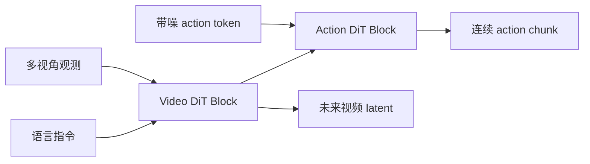
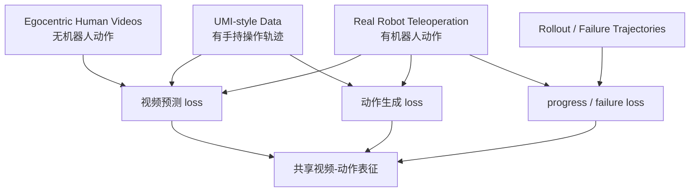
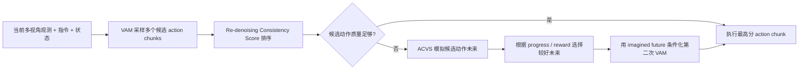

<!-- Generated by the offline translation workflow.
Source: 17-具身世界模型/tau0-WM统一视频动作世界模型导读/README.md
Source SHA-256: 474415c00b6953a806615d55c16dbb72d07142327924212e3d645f127d2f7370
Model: tencent/Hy-MT2-1.8B-GGUF:Q4_K_M
Review machine-translated technical claims before relying on them.
-->
# τ0-WM: Introduction to the Unified Video-Action World Model

> The introductory paper for this article is **τ0-WM: A Unified Video-Action World Model for Robotic Manipulation**. It comes from Shanghai Innovation Institute and AGIBOT Finch, and the project page was published on 2026-05-31. The official description positions it as an open-source video-action world model for robotic manipulation: it can predict actions, predict future videos resulting from those actions, and evaluate and refine actions using imagined future during testing.

## 1. State the conclusion first

τ0-WM is not just a simple VLA, nor is it a world model that only generates videos. It attempts to integrate three things into one framework:

1. **Action Generation**: Similar to the policy model, generate executable action chunks based on multi-view observations, language instructions, and robot states.
2. **Video Prediction**: Similar to the video world model, predict future multi-view visual latent / video data.
3. **Action Evaluation**: Similar to the learned simulator / reward model, evaluate the rollout of candidate actions in the future and estimate task progress scores.

One-sentence summary:

> The core of τ0-WM is not about robots generating videos, but about robots proposing actions, imagining the consequences of actions, evaluating those consequences, and correcting actions when necessary.

This section should be placed in `17-具身世界模型`, rather than the VLA chapter. This is because although it includes a policy interface, the core innovation lies in integrating policy, video prediction, action-conditioned simulator, and test-time computation into a world model-style decision mechanism.

## 2. Papers, Projects, and Open Source Status

| Entry | Link | Current Status |
| :--- | :--- | :--- |
| Project Page | [AGIBOT Finch τ0-WM](https://finch.agibot.com/research/tau0-wm) | Official project page, including images, videos, papers, code, and HF entry |
| Paper | [arXiv:2606.01027](https://arxiv.org/abs/2606.01027) / [HTML](https://arxiv.org/html/2606.01027v1) | Submitted on 2026-05-31 |
| PDF | [Official PDF](https://finch-static.agibot.com/VAM/blog/tau_0_wm.pdf) | Direct link to the project page |
| GitHub | [sii-research/tau-0-wm](https://github.com/sii-research/tau-0-wm) | Official implementation, Apache-2.0; post-training and inference code are published |
| Hugging Face | [sii-research/tau-0-wm](https://huggingface.co/sii-research/tau-0-wm) | VAM pre-trained weights entry, model card indicates Apache-2.0 |

The open-source status needs to be read more carefully. The GitHub README states:

- On 2026-06-26, the post-training training and inference code were released.
- The VAM pretrained weights have been uploaded to Hugging Face.
- The Simulator pretrained weights still state that they will be released soon.
- The Test-Time Computation code will be released alongside the Simulator weights.

Therefore, the focus for current learning and secondary development is **VAM weights, post-training pipeline, and policy server / client inference links**; to fully reproduce the ACVS simulator-based rectification in the paper, we need to wait for the official team to release the Simulator weights and corresponding TTC code.

## 3. Why it deserves to be included in the world model line

There are already several world model introductions in this repository. τ0-WM can be understood within the following lineage:

| Method | What the world model predicts | How to serve robots |
| :--- | :--- | :--- |
| LeWM | latent future / dynamics | Establish basic concepts of the world model |
| RISE | action-conditioned future + value | Perform policy improvement in imagination |
| RAW-Dream | task-agnostic video rollout + VLM reward | Train using the world model for VLA |
| WoG | action-relevant future condition | Generate no complete video; compress the future into action conditions |
| WALL-WM | event-level world-action video modeling | Align actions with video events |
| RoboDream | robot-only trajectory + scene/object priors | Synthesize robot teaching video data |
| Gamma-World | multi-agent synchronized future video | Share the world rollout among multiple agents |
| BWM | action-conditioned robot video rollout | Low-cost visual world simulation |
| **τ0-WM** | **future video + executable action chunk + progress score** | **Propose, evaluate, and revise actions during execution** |

τ0-WM is closest to BWM and WALL-WM, both on the "world-action model" line. However, τ0-WM goes further: it not only generates future videos with action conditions, but also integrates the **Action Generator VAM** and **Action Condition Video Simulator ACVS** into a testing decision closed loop.

## 4. Overview Diagram: From Multi-source Data to Real Deployment


**Figure 1: Overview of τ0-WM.** On the left are multi-source heterogeneous data; in the middle are the Video Action Model and Action-Conditioned Video Simulator; on the right is the deployment of real robot tasks. The most important aspect of this figure is not that "5B is very large," but that it integrates data from different sources into a unified model based on the supervision signals they provide.
Source: [τ0-WM official project page ](https://finch.agibot.com/research/tau0-wm).

This image can be read in four sections.

The first block is **Diverse Data Source**. The official project page states that τ0-WM uses approximately 27,300 hours of heterogeneous data:

| Data Source | Duration | Percentage | Type of Supervision Provided |
| :--- | :--- | :--- | :--- |
| Real-robot teleoperation | 17,800 hours | 65% | Multi-view real robot observations, robot status, executable actions |
| UMI-style data | 6,500 hours | 24% | richer manipulation behaviors and scenarios, with motion-related signals |
| Egocentric human interaction data | 3,000 hours | 11% | First-person human interaction videos, providing object motion, contact, and task timing |

The key here is **not to force all data to be treated as the same type of data**. Human-first-person videos have rich visual dynamics, but they lack action labels in a robot-controlled environment; real robot data do have action labels, but it is costly and has limited coverage. τ0-WM uses modality-specific supervision masks, ensuring that each sample is only supervised by its actual signals.

The second block is **Video Action Model, VAM**. It is a policy-facing interface: it inputs multi-view images, language commands, and robot status, and outputs future visual latent and continuous action chunks.

The third block is **Action-Conditioned Video Simulator, ACVS**. It does not generate video from a text prompt, but given the current observations, instructions, and candidate action chunks, it predicts what will happen in the future as these actions are executed, and outputs a dense task-progress / reward score.

The fourth section is **Test-Time Computation**. During deployment, not just one action is sampled and executed, but multiple candidate actions are sampled and sorted using re-denoising consistency and simulator-based scoring. If the candidate quality is low, the simulated future state is used to correct the action.

## 5. Method Diagram: VAM and ACVS are two complementary interfaces


**Figure 2 τ0-WM method architecture.** On the left is VAM, and on the right is ACVS. VAM is responsible for action generation, while ACVS is responsible for action consequence simulation and reward evaluation. Both share the video generation backbone.
Source: [τ0-WM official project page ](https://finch.agibot.com/research/tau0-wm).

### 5.1 Left half: Video Action Model

VAM inputs include:

- multi-view observations: Multi-perspective current observations.
- language instruction: Natural language task instructions.
- robot state: Robot proprioception / end-effector state.
- noised action: Noisy action token in the diffusion-style action branch.

VAM output includes:

- predicted video: Future visual latent / Video prediction.
- predicted action: Continuous action chunk.

The structure in the diagram is crucial:



The Video DiT branch is not a bypass decoration. Action DiT reads the intermediate video representations through layer-wise cross-attention, so the action branch is forced to use representations indicating "what will change in the future" to predict actions. This is different from a regular action-only policy.

Common VLA often includes:

```text
image + language + state -> action
```

The VAM of τ0-WM is more like:

```text
image + language + state -> future visual latent + action
```

This turns future prediction into control-related training objectives, rather than additional visualization results.

### 5.2 Right Half: Action-Conditioned Video Simulator

ACVS input is:

```text
current observation + instruction + candidate action chunk
```

Output is:

```text
predicted multi-view future + dense task-progress score
```

This complements the direction of VAM perfectly:

| Module | Question Asked | Input | Output |
| :--- | :--- | :--- | :--- |
| VAM | What should I do now | Observation, instruction, status | action chunk + future latent |
| ACVS | What would happen if I perform these actions? | Observation, instruction, candidate actions | future video + progress / reward |

ACVS is not a traditional physical simulator. It lacks explicit contact forces, rigid body states, and collision solvers, and cannot be made strictly verifiable like MuJoCo / Isaac Sim. It is more like a **learned visual consequence evaluator**: it uses a world model to predict the consequences of actions, and then ranks candidate actions based on task-progress scores.

## 6. How to understand 5B and 5.5B sizes

External communications often state that τ0-WM is a 5B-scale embodied world model. The detailed paper architecture specifies it further: VAM is based on Wan2.2-TI2V-5B, and includes the Action DiT branch with approximately 0.5B parameters. Therefore, the total parameter count of VAM is around 5.5B.

The two statements are not contradictory:

| Dimension | Meaning |
| :--- | :--- |
| 5B | The scale of the video diffusion backbone / world model emphasized in project dissemination |
| 5.5B VAM | In the paper architecture, it refers to the combination of a 5B video DiT backbone and a 0.5B Action DiT branch |

The tutorial recommends referring to it uniformly as the **5B-level open-source embodied world model**, and adds the 5.5B scale of VAM in the architectural details.

## 7. Heterogeneous data training: Supervise only the signals that exist in each type of data

The data design of τ0-WM is worth learning. It does not rely solely on expensive real robot data, nor does it assume that human video can directly provide robot action labels. Instead, it uses data in a hierarchical manner.



The judgment behind this design is very practical:

- Real robot data is the most valuable, as it links vision and robot control space together.
- UMI-style data can expand manipulation scenarios and behavioral diversity, but there are still differences from the target robot embodiment.
- Human first-person video is the cheapest and covers the widest range, but it lacks executable robot actions.
- Failure/rollout data is important for reward/progress learning, as successful teaching rarely tells the model “where it will fail”.

The role of modality-specific supervision masks is to: do not compute the action loss for data without an action label; do not generate incorrect supervision for missing camera perspectives; and use the failure/progress signals to train the evaluation ability of ACVS.

This is similar to many multi-modal pre-training approaches: The real challenge is not just accumulating data, but ensuring that different types of data perform their respective roles within the same model.

## 8. Test-Time Computation: Propose, evaluate, and revise first

The most interesting aspect of τ0-WM is the computational logic during deployment. It is not a traditional feed-forward policy:

```text
observation -> action -> execute
```

Instead:



There are two key techniques here.

**Re-denoising Consistency Score** is used to determine whether the candidate action is consistent with the conditional action distribution learned by the model. Intuitively, if a action chunk is re-noised and still returns to a similar action after denoising, it indicates that it lies in a region considered reliable by the model; if the consistency is poor, it suggests that the candidate may be unstable.

**Simulator-based Rectification** is more similar to world model planning: when the quality of candidate actions is low, ACVS predicts the future videos and task progress of different candidate actions, selects the more promising imagined future, and uses this future as a condition to generate the corrected action chunk.

This is also the fundamental difference between τ0-WM and many VLAs: VLAs typically use model computing power for forward inference, while τ0-WM uses additional computing power for pre-execution action evaluation and correction.

## 9. How to read the experimental results


**Figure 3: Comparison of the success rate and task completion progress for real robot tasks.** The paper compares Fast-WAM, π0.5, and τ0-WM, analyzing the success rate and task accomplishment progress for four fine manipulation tasks that are not present in the pre-trained data.
Source: [τ0-WM official project page ](https://finch.agibot.com/research/tau0-wm).

The experiment covers three robot embodiments:

- AGIBOT-G01.
- ARX manipulators.
- Two-armed Franka.

The tasks include Toolbox, School Bag, Badminton, and Faucet, all of which are long-term or detailed geometric alignment tasks. The paper emphasizes that these tasks are not present in pre-trained data, and they are used to test generalization and post-training performance.

From Figure 3, several key points can be identified:

| Comparison Items | Observations |
| :--- | :--- |
| Fast-WAM | Overall weak in these tasks, especially disadvantaged in long processes and fine alignment scenarios |
| π0.5 | A strong VLA baseline; competitive in tasks like Toolbox |
| τ0-WM | Highest average success rate and average task progress; significant advantages in School Bag, Badminton, and Faucet |

Note that here, π0.5 is the baseline, not the base of τ0-WM. The core base of τ0-WM is the Wan2.2-TI2V-5B video diffusion backbone, along with an action branch and a simulator/evaluation mechanism.

The paper also performed data ablation. By comparing Robot-only and Robot+UMI+Ego, it can be seen that:

| Setting | Task | Clean | Cluttered | Avg |
| :--- | :--- | :--- | :--- | :--- |
| Robot-only | Zero-shot Pen-to-holder | 0.22 | 0.06 | 0.14 |
| Robot+UMI+Ego | Zero-shot Pen-to-holder | 0.56 | 0.53 | 0.55 |
| Robot-only | SFT Object-wipe-place | 0.85 | 0.55 | 0.70 |
| Robot+UMI+Ego | SFT Object-wipe-place | 0.90 | 0.75 | 0.83 |

This table indicates that heterogeneous data is not a selling point, but it indeed affects the performance of zero-shot and SFT. Especially in cluttered scenarios, the diverse visual interactions provided by Ego / UMI make the model more stable.

## 10. To what extent can the code repository be reproduced

The available manipulation entry points provided by the official GitHub currently include:

```bash
git clone https://github.com/sii-research/tau-0-wm.git
cd tau-0-wm
pip install -r requirements.txt
```

The main content of the repository README can be divided into three parts.

### 10.1 Pre-trained VAM Inference

Preparations required:

- τ0-WM VAM pretrained weights.
- Wan2.2-TI2V-5B weights.
- VAE weights.
- text encoder / tokenizer weights.

Then modify:

```text
configs/deployment/tau_pretrain_rela_eef6d.yaml
```

Mainly replace these fields:

```text
diffusion_model.model_path
vae_path
text_encoder.checkpoint_path
text_encoder.tokenizer_path
```

The repository supports running via the policy server method:

```bash
bash run_infer_server.sh $HOST $PORT
python web_infer_utils/simple_client.py
```

The `simple client` here is just a random observation example to verify the service chain, and it does not indicate that the real robot task has been successfully executed. When integrating with the robot, it is necessary to align the multi-view images, the pose of the two-arm ends, the gripper status, and the action layout.

### 10.2 Post-training

The repository provides a post-training entry point for downstream tasks:

```bash
bash scripts/train.sh main.py \
    configs/tau_model/posttrain_taco_play_abs.yaml \
    runner/posttrain.py
```

The downstream task requires three types of files:

| File | Function |
| :--- | :--- |
| LeRobot-format dataset | Training data; officially recommended that LeRobot >= 0.4.0 |
| `configs/data/<task>/*.yaml` | Defines the dataset class, path, statistical files, and action/state layout |
| `configs/tau_model/*.yaml` | Defines the model, training parameters, weight paths, and output directory |

If you plan to reproduce it in the future, it is recommended to use the official example `taco_play` first, and do not start with your own robot data. This is because the action/state layout can be easily incorrect: the end pose, quaternion order, gripper opening and closing range, and absolute/relative motion representation must all match the model configuration.

### 10.3 Action Space

The repository README is written in more detail:

- The state input by the server is the absolute pose of the dual end effector, with a total of 14 dimensions: each arm `xyz + quaternion`, and the quaternion order is `xyzw`.
- The gripper state is 2-dimensional, ranging from 0 to 120, where 0 indicates open and 120 indicates closed.
- The server outputs the action shape as `{T, 16}`.
- The output sequence is: left arm end pose, left gripper openness, right arm end pose, right gripper openness.
- During the pre-training phase, the internal prediction is for relative end poses, consisting of 20 dimensions: each hand `xyz + 6d-rotation`, and the code automatically performs a quaternion to 6D rotation conversion.

This part is crucial for reproduction. Many failures in VLA / WAM reproduction are not due to the model failing to run, but rather an uneven action space: inconsistent coordinate systems, quaternion order, gripper opening/closing direction, and mixing of absolute/relative actions. As a result, the policy seems “capable of reasoning,” but the actions are completely unexecutable.

## 11. How to reproduce is currently not recommended

This article temporarily does not recommend re-running the full paper experiments. There are three reasons for this.

First, the model and dependencies are very heavy. Wan2.2-TI2V-5B + VAM weights are not ordinary notebook tasks. Real deployment also involves multi-view cameras, robot state interfaces, and server-client latency.

Second, the complete test-time computation in the paper relies on the simulator weights and a more comprehensive TTC code. The GitHub README explicitly states that the pretrained simulator weights and TTC code will be released later.

Third, real robot manipulation tasks are not public standard benchmarks. The paper presents real manipulation tasks on AGIBOT-G01, ARX, and the two-armed Franka; without the corresponding hardware and data, it is difficult to replicate the same success rate.

Therefore, this tutorial currently recommends dividing the reproduction targets into three levels:

| Mode | Objective | Suitable for |
| :--- | :--- | :--- |
| Understanding Method | Read papers, project pages, and code structure to understand VAM / ACVS / TTC | Students learning in groups |
| Code Link Execution | Download VAM weights and Wan2.2, start the policy server, and run a simple client smoke test | Students with high-memory GPUs |
| Downstream Fine-tuning | Prepare LeRobot-format data, modify data YAML and training YAML | Students with robot or simulation data |
| Complete Reproduction of TTC | Wait for Simulator weights and TTC code to be released | Students researching the world model for robots |

## 12. Differences from π0.5, Fast-WAM, and BWM

| Method | Type | Core Issue | Relationship with τ0-WM |
| :--- | :--- | :--- | :--- |
| π0.5 | VLA / policy baseline | Predicting actions from visual language input | τ0-WM uses it as a strong baseline to compare world-model-style prediction and TTC |
| Fast-WAM | video-action model baseline | Emphasizing faster WAM inference | τ0-WM compares its performance on long-term fine-grained tasks |
| BWM | action-conditioned video world model | Generating future videos based on initial images and actions | τ0-WM focuses more on action generation, action evaluation, and correction during testing |
| RAW-Dream | world model + VLM reward + RL | Reinforcing VLA in an imagined world model | τ0-WM is more oriented toward proposal-evaluation-revision during deployment, not primarily for post-RL training |
| WALL-WM | event-level world-action modeling | Aligning video events with action blocks | τ0-WM emphasizes a unified VAM + ACVS interface and heterogeneous data pre-training |

If considered solely in terms of "whether it can output actions," τ0-WM is similar to VLA; if considered solely in terms of "whether it can predict future videos," it is similar to a video world model. However, its true role is a **world-action model**: actions and the future are not two separate tasks, but two interfaces for the same set of predictive representations.

## 13. The real innovation of this paper

The innovation points can be divided into four levels.

### 13.1 Unified Interface

In the past, many methods separated policy learning from world modeling:

```text
policy: observation -> action
world model: observation + action -> future
reward model: future -> score
```

τ0-WM integrates them into a shared video diffusion backbone, ensuring that the action branch and simulator branch use the same type of future prediction representations. Thus, the world model is not an auxiliary loss during training, but a decision module that can be invoked during deployment.

### 13.2 Heterogeneous Supervision

It is difficult to directly mix train real robot data, human videos, UMI-style data, and failure rollouts. The τ0-WM processing method involves a unified model with separate supervision: train the action when there is an action, train only the video when there is no action, train the evaluation when there is progress/failure, and mask out the missing perspective.

This is realistic for robots, as for a long time to come, robot data will not be as clean and unified as text and images on the internet.

### 13.3 Calculation during Testing

τ0-WM implements a deployment mechanism for "multiple sampling, scoring, and simulation correction when necessary". This is similar to the test-time compute approach in large language models: instead of relying on a single forward pass, more computation is performed at key states to achieve more stable behavior.

This is particularly important in robots, as a wrong execution could cause the object to be thrown away, get stuck, or fall, making it very difficult to recover later.

### 13.4 Real Robot Multi-embedding Verification

The paper did not only test on a fixed robot, but also conducted experiments on AGIBOT-G01, ARX, and the two-armed Franka. This indicates that its interface design takes into account at least the diversity of embodiments. However, this does not mean "any robot can be plugged in and used immediately", as the action space, state definitions, and controllers still require engineering adaptation.

## 14. Limitations and Areas Needing Careful Consideration

This is very strong, but don’t be distracted by the words “largest scale”, “open source”, and “world model”.

First, it is not a traditional simulator. ACVS can predict video and progress scores, but it cannot provide strict physical states, contact forces, collision constraints, or verifiable dynamics.

Second, the complete TTC is not yet fully open source. The VAM weights and some code are available, but the Simulator weights and the full test-time computation are still in official planning.

Third, the scale of real robot evaluation is limited. The four tasks are very challenging, but they do not represent all manipulation tasks and all robot embodiments.

Fourth, the model is very heavy. The paper appendix states that real robot reasoning can be deployed on a single RTX 5090, with a standard configuration of approximately 220 ms per query, and about 180 ms after caching the text representation. With further optimization, it can reach approximately 140 ms. This speed is acceptable for executing closed loop action chunks, but it is not suitable for low-cost edge deployment models.

 fifthly, future video prediction does not equal reliable control. Just because the video looks correct does not mean that the movement is stable during actual contact. Especially for insertions, flexible objects, small parts, and contact states after occlusion, tactile or force feedback may be required.

## 15. How to use this in team learning sessions

It is recommended to place τ0-WM in the world model direction Task04, and compare it with RAW-Dream, WALL-WM, and BWM.

Recommended homework questions:

> Comparing RAW-Dream, BWM, and τ0-WM: All three use a video world model, but are they improving the policy during training, generating action-condition video, or evaluating and correcting actions during deployment?

Delivery suggestions:

1. Draw the input and output of VAM and ACVS.
2. Explain why τ0-WM is not a π0.5 base.
3. Describe what supervision is provided by each 27.3K-hour heterogeneous dataset.
4. Explain the intuition behind re-denoising consistency and simulator-based rectification.
5. Clearly state what can be reproduced currently on GitHub / HF, and what cannot be reproduced.

## 16. Recommended Reading Order

If time is limited, it is recommended to read as follows:

1. First, look at the overview diagram on the project page to understand the four sections: diverse data, VAM, ACVS, and TTC.
2. Then, examine Figure 2 in the paper to clarify the shared backbone of VAM and ACVS.
3. Read Section III of the paper to grasp heterogeneous data and supervision masks.
4. Read Sections IV and V to focus on VAM and ACVS respectively.
5. Read Section VI to understand test-time computation.
6. Finally, check the GitHub README to confirm the current code, weights, and reproduction boundaries.

The most valuable point to take away from this article is:

> The robot world model should not merely remain at "generating future videos for people to watch," but should become an actionable action evaluator and modifier.

## 17. Citations and Image Sources

The images in this article are from the [τ0-WM official project page ](https://finch.agibot.com/research/tau0-wm). They have been compressed and saved locally `assets/` to ensure stable access during the tutorial. The content of the paper is referenced from [arXiv:2606.01027](https://arxiv.org/abs/2606.01027), [ official PDF ](https://finch-static.agibot.com/VAM/blog/tau_0_wm.pdf), [ GitHub repository ](https://github.com/sii-research/tau-0-wm), and [ Hugging Face weight page ](https://huggingface.co/sii-research/tau-0-wm).
