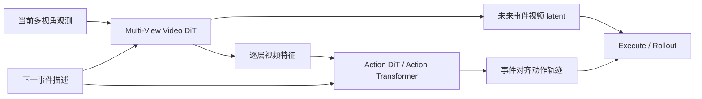

<!-- Generated by the offline translation workflow.
Source: 17-具身世界模型/WALL-WM事件级世界动作模型导读/README.md
Source SHA-256: 4153bf84b9f8a1bec679e3d9b03582c3f7def5a883fa8774b494a5b28ae5cd29
Model: tencent/Hy-MT2-1.8B-GGUF:Q4_K_M
Review machine-translated technical claims before relying on them.
-->
# WALL-WM: A world action model for rehearsing and executing at event boundaries

WALL-WM corresponds to the paper **WALL-WM: Carving World Action Modeling at the Event Joints**. It belongs to the realm of embodied world models/World Action Models, but it is not a latent transition model like Dreamer. Its core idea is: **to combine future video prediction and action prediction, and train and execute them based on semantic action events rather than fixed action chunks.**

After completing this section, everyone needs to focus on one sentence:

> WALL-WM is not a VLA that "executes actions directly from the current image," but rather "current multi-view observation + next event description -> simulating how the world changes during this event, while generating corresponding action segments."

## 1. Paper and Open Source Status

| Item | Current Status |
| :--- | :--- |
| Paper | [arXiv:2606.01955](https://arxiv.org/abs/2606.01955) |
| Paper PDF link | Linked to `WALL-WM.pdf` in WALL-X README |
| Related code ecosystem | [X-Square-Robot/wall-x](https://github.com/X-Square-Robot/wall-x) |
| Related model organization page | [Hugging Face: x-square-robot](https://huggingface.co/x-square-robot) |
| Open source boundaries | WALL-X/WALL-OSS code and models are available; no separate WALL-WM checkpoint, event-level data ecosystem, or complete training recipe have been clearly provided yet |
| Recommended handling | As a world model method introduction, it is not recommended to be written as a step-by-step reproduction tutorial at present |

It must be explained clearly: The papers, PDFs, and the WALL series project portal of WALL-WM are publicly available. However, from a reproduction perspective, it cannot be simply stated as “WALL-WM is fully open-sourced, and everyone can directly reproduce the paper results”. It would be better to position it in the tutorial as an introduction to the method and a portal for follow-up.

## 2. Why it is called World Action Model

<p align="center">
  
</p>

**Figure 1: WALL-WM's positioning in world action modeling.** The paper places language, vision, and actions at different levels of abstraction and spatiotemporal precision: language has semantics but a coarse granularity, vision has a spatial structure, and actions require contact-level precision. The goal of WALL-WM is to integrate video world modeling with action generation.

Source: [WALL-WM arXiv HTML](https://arxiv.org/html/2606.01955v1).

Common forms of traditional VLA are:

```text
当前观测 + 指令 -> 未来固定长度 action chunk
```

WALL-WM is more like:

```text
当前多视角观测 + 下一事件描述
-> 未来事件视频 latent + 事件对应动作轨迹
-> 执行这一段
-> 重新观察
-> 进入下一个事件
```

It is called the World Action Model because it not only outputs actions, but also explicitly models "how the visual world will change if this semantic event is executed next." Action generation and future observation modeling are not two separate modules, but are coupled within the same denoising framework.

## 3. Core Innovation: Changing from fixed chunk to semantic event

<p align="center">
  
</p>

**Figure 2: Comparison between next-event training and equal-length chunks.** This figure is key to understanding WALL-WM: event caption, event video, and event action all describe the same semantic range; however, fixed-length chunks often break down an action event or mix multiple events together.

Source: [WALL-WM arXiv HTML](https://arxiv.org/html/2606.01955v1).

Fixing the chunk issue is very common in long robot tasks. An "grab a cup" event may require 18 steps, or 70 steps; a 32-step chunk might only cover the latter half of "approach" and the first half of "close the gripper". This leads to a mismatch in granularity:

| Modal | Natural Granularity | Issues with fixed chunks |
| :--- | :--- | :--- |
| Language | Semantic goals and events | A global instruction cannot accurately describe the current chunk |
| Vision | Continuous world changes | Video changes often involve events of varying lengths |
| Action | High-frequency control trajectories | A fixed time window may disrupt contact or phase transitions |

WALL-WM's answer is: Use **action-grounded semantic event** as the learning unit. This event must meet all of the following conditions simultaneously:

- Language can describe actions, such as “lift the cup”.
- Changes can be seen in videos, such as the cup moving off the table.
- Actions can be performed, such as the final trajectory going from grasping to lifting.

This is also the most valuable aspect of this paper: instead of simply saying "the world model should predict the future," it goes a step further to ask "what unit should be used to predict the future?"

## 4. Overall Architecture: Hierarchical Coupling of Video Tower and Action Tower

<p align="center">
  
</p>

**Figure 3 WALL-WM overall framework.** On the left is the instruction entry, in the middle is the event-centric world model, and on the right is the unified mode. When reading this figure, note that Multi-View Video DiT is responsible for the future video latent, and Action Transformer/Action DiT is responsible for the action trajectory. The two systems exchange information through hierarchical coupling.

Source: [WALL-WM arXiv HTML](https://arxiv.org/html/2606.01955v1).

The architecture in the paper can be divided into three layers:

| Level | Module | Function |
| :--- | :--- | :--- |
| Event/Language Entry | next-event description, T5 text conditioner, Staircase decoder | Provide the condition for "what is the next event" for the current rollout |
| Visual World Model | Multi-View Video DiT, inherits from Wan series video model prior | Predict the latent future video in multiple views during the event |
| Action Model | Action Transformer / Action DiT | Predict the trajectory of the corresponding end-effector |

The core is not single video generation, nor single action regression, but layer-coupled video-action denoising:



The action tower reads the video tower features from multiple layers, so actions are not directly derived from the current image and language, but are constrained by "changes in the world during prediction". This design is more like a "pre-practice, then execution" approach compared to ordinary VLA.

## 5. Event mode and Unified mode

WALL-WM supports two inference modes.

### 5.1 Event mode

Event mode is the mode closest to "preview first, then execute":

```text
当前观测 + 下一事件描述
-> 生成可变长度 event video/action
-> 执行
-> 重新观察
-> 再生成下一事件
```

The next event description can come from a human, an upper-level agent, or a VLM fine-tuned in a paper. This means that WALL-WM does not entirely rely on the underlying action model to plan the entire long task; it requires an upper-level module to tell it which semantic event should be performed.

The advantage of event mode is that it supports variable-length action segments, avoiding the rigid cut-off by a fixed action horizon. However, the cost is that it requires a next-event instruction. If the upper-level event decomposition is incorrect, the underlying world action model will also be distorted.

### 5.2 Unified mode

Unified mode is more similar to the traditional VLA fixed chunk execution. It still outputs fixed-length chunks, but instead of only following the global task instructions, it generates continuous latent reasoning through VLM's Staircase Decoding to guide the actions.

<p align="center">
  
</p>

**Figure 4 Staircase latent reasoning.** Compared to token-by-token CoT, Staircase uses continuous latent representations at different levels to transmit reasoning information. The goal is to reduce the serial generation overhead while preserving the reasoning signals.

Source: [WALL-WM arXiv HTML](https://arxiv.org/html/2606.01955v1).

The meaning of Unified mode is to be compatible with existing fixed chunk control interfaces. Many robot systems are designed around action chunks with a fixed frequency and horizon. Switching entirely to the event mode would incur high costs. Unified mode provides a compromise: the control interface remains a chunk, but the internal guidance signals are closer to an event structure.

## 6. Multi-perspective fusion: Camera RoPE and geometric mask

<p align="center">
  
</p>

**Figure 5: Cross-view masking of WALL-WM. The sight-cone mask ensures that only tokens that are physically visible from multiple perspectives interact across views; the tube mask uses a masking window to force the model to fill in information from other perspectives.**

Source: [WALL-WM arXiv HTML](https://arxiv.org/html/2606.01955v1).

Robot manipulation often involves multiple perspectives: head cameras, side-view cameras, wrist cameras, etc. Simply concatenating tokens for different perspectives will cause two issues:

- Tokens from different perspectives do not know which camera they come from.
- It is physically impossible for tokens in the same area to pay attention to each other, resulting in noise.

WALL-WM has added two types of designs:

| Design | Function |
| :--- | :--- |
| Camera RoPE | Injects rotation position encoding related to the camera perspective into the token |
| Sight-cone mask | Allows tokens from different perspectives to interact only when their visual cones intersect physically |
| Tube patch masking | Blocks the spatial-temporal tube in one perspective, and trains the model to fill in the gaps using other perspectives |

This indicates that WALL-WM does not simply apply video generation models to robot tasks, but makes structural adjustments for multi-viewpoint robot vision.

## 7. Data System: Event-level captions and long-tail sampling

<p align="center">
  
</p>

**Figure 6: WALL-WM data source map.** The data comes from internet videos, first-person view videos, non-body-capturing data, heterogeneous remote operations, and public robot data. Human-intervention and failure-recovery data are also highlighted in the middle.

Source: [WALL-WM arXiv HTML](https://arxiv.org/html/2606.01955v1).

This paper not only focuses on the model structure, but the data system is also crucial. WALL-WM aims to learn not only the “successful trajectory”, but also:

- recovery。
- re-grasp。
- retry。
- contact correction。
- failure intervention。

These short events are easily overwhelmed in ordinary global captions, but they can be explicitly marked in event-level captions.

<p align="center">
  
</p>

**Figure 7: Four-layer caption tracks.** The four levels of Task, Subtask, Action, and Segment are aligned on the same video timeline, allowing the same episode to be trained and sampled at different semantic granularities.

Source: [WALL-WM arXiv HTML](https://arxiv.org/html/2606.01955v1).

It can be understood as four layers of annotations:

| Level | Example | Function |
| :--- | :--- | :--- |
| Task | Clean the desktop | Global task objective |
| Subtask | Put the cup into the basket | Intermediate sub-task |
| Action | Grab the cup | Action event |
| Segment | Gripper closes and touches the cup | More detailed fragment |

This annotation system allows training to no longer rely solely on fixed-length time windows, but can sample according to semantic boundaries.

## 8. Where is its strength?

The strengths of WALL-WM lie mainly in three areas:

1. **Correct event granularity**: It changes the alignment unit of language, video, and actions from fixed chunks to semantic events, which is indeed suitable for long-time-domain manipulation.
2. **Video and action coupling**: The action tower reads the features of the video tower layer by layer, preventing a complete disconnect between "video prediction" and "action prediction".
3. **Complete data and training system**: Event captions, long-tail sampling, multi-view structure, Staircase reasoning, and Muon optimizer infrastructure together form the scale-up recipe.

But it also has boundaries:

- It does not purely rely on the underlying model to independently plan long tasks; the event mode still requires a next-event description.
- Its effectiveness likely depends on large-scale event-level data and annotation systems, which is difficult for ordinary laboratories to reproduce from scratch.
- Fine contact, insertion, and narrow tolerance manipulation cannot necessarily be solved solely through event decomposition.
- The current open-source status is more suitable for method tracking, rather than being used to write complete reproduction tutorials.

## 9. Differences from RAW-Dream, WoG, and EventVLA

| Method | Core Problem | Predicts Future? | Key Representation |
| :--- | :--- | :--- | :--- |
| RAW-Dream | Reinforce VLA in a task-independent trajectory | Predicts the imagined rollout video | Action condition video trajectory + VLM reward |
| WoG | How to distill future observations into a useful action condition | Does not explicitly generate future videos | condition-space future guidance |
| WALL-WM | What granularity should world action learning be organized with? | Predicts the event video latent and action trajectory | semantic event-aligned WAM |
| EventVLA | How to prevent visual evidence from being forgotten during the process | Does not predict the future | raw keyframe memory |

This table can help narrow down the term “world model”. WALL-WM is more like a true world action model; WoG is condition-space world modeling; EventVLA is not a world model, but visual evidence memory.

## 10. Where should we look to track the reproduction?

Currently, it is recommended to track as follows:

1. Read [arXiv:2606.01955](https://arxiv.org/abs/2606.01955), with a focus on Figure 2, Figure 3, Figure 6, Figure 8, and Figure 12.
2. Pay attention to the README, release, and issues of [X-Square-Robot/wall-x](https://github.com/X-Square-Robot/wall-x).
3. Check whether [HF x-square-robot](https://huggingface.co/x-square-robot) has a new WALL-WM checkpoint.
4. If you only want to run the WALL series code, start with [WALL-X engineering framework](../../06-manipulation-and-vla/large-model-control-vla-vlm/08-wall-x-open-source-engineering-framework-navigation/README.md) and [WALL-OSS open-source VLA](../../06-manipulation-and-vla/large-model-control-vla-vlm/07-wall-oss-open-source-vla-model-introduction/README.md).
5. If official event-level data and training recipes are released in the future, write a separate `WALL-WM复现.md` instead of turning this introduction into a list of commands.

## 11. Reference Materials

- WALL-WM paper:[WALL-WM: Carving World Action Modeling at the Event Joints](https://arxiv.org/abs/2606.01955)
- WALL-WM arXiv HTML graphic version:[2606.01955v1 HTML](https://arxiv.org/html/2606.01955v1)
- WALL-X code:[X-Square-Robot/wall-x](https://github.com/X-Square-Robot/wall-x)
- X Square Robot research page: [https://x2robot.com/en/research](https://x2robot.com/en/research)
- Hugging Face organization page:[x-square-robot](https://huggingface.co/x-square-robot)
