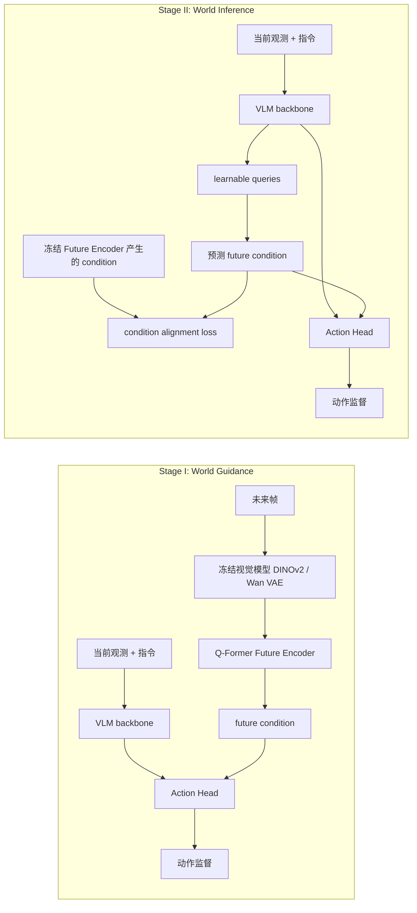
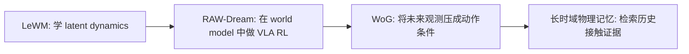

# WoG: Introduction to the World Model of Conditional Space

This chapter introduces **WoG / World Guidance** from **World Guidance: World Modeling in Condition Space for Action Generation**, developed by ByteDance Seed and the University of Hong Kong and submitted to arXiv on 2026-02-25. LeWM predicts future latent states, RAW-Dream uses a world model as a VLA training environment, and WoG takes a different route: **it predicts a future condition vector useful for action generation instead of reconstructing the complete future image**.

After completing this section, everyone should focus on a key judgment: WoG is intelligent and has engineering value, but it is not a "world simulator for interactive rollout in a robot's brain". More precisely, it is a **future observation distillation for action generation** method: during training, future frames are considered, and these frames are compressed into latent conditions relevant to actions; during testing, no future frames are considered, allowing the VLA to predict these conditions from current observations, which then assist in action generation.

## 1. Paper, project page, and code status

| Item | Current Status |
| :--- | :--- |
| Paper | [arXiv:2602.22010](https://arxiv.org/abs/2602.22010), submitted on 2026-02-25 |
| Project Page | [WoG project page](https://selen-suyue.github.io/WoGNet/) |
| Code Entry | [Selen-Suyue/WoG](https://github.com/Selen-Suyue/WoG) |
| Weights | GitHub README points to [Hugging Face: selensu/WoG](https://huggingface.co/selensu/WoG) |
| Code Notes | The project page includes a Code button; the repository README currently states “unofficial implementation”, and the tutorial refers to “open-source implementation” instead of strictly reproducing the experiment |

The practical starting point is to understand the architecture and two-stage training process, then estimate the compute and hardware required for SIMPLER evaluation or real-robot deployment before launching a full reproduction.

## 2. Explain in one sentence what WoG is doing

<p align="center">
  
</p>

**Figure 1: The intuitive concept of WoG.** Future observation frames are not used directly to reconstruct video, but are compressed into a condition space; this condition guides action generation. During training, we can "peek at the future," while during testing, we can only predict this future condition from the current observations.

Source: [ WoG official project page ](https://selen-suyue.github.io/WoGNet/).

The core of WoG can be translated into a very straightforward sentence:

During training, compress the next few frames into a quick guide useful for actions; during testing, don't provide the future frames, and let VLA guess this guide from the current image and language.

Traditional world model common objectives are to predict future images, future states, future videos, or latent state transitions. WoG does not take this path. It believes that the complete future image contains a lot of information that is irrelevant for control, such as background textures, lighting changes, and tablecloth details. What robots actually need is “where the next action will go, what contact will occur between objects and the gripper, and how the target object and container interact.” Therefore, WoG does not predict the complete future, but learns a **action condition space**.

This is also where it is most easily misunderstood. It is called world modeling, but this "world" is not the complete visual world, rather it is compressed future information generated by service actions.

## 3. Why does it still call itself a world model?

According to the strictest definition, the world model should learn:

```text
p(s_{t+1} | s_t, a_t)
```

Or at least learn:

```text
p(o_{t+k} | o_{\le t}, a_{\le t+k})
```

That is, given the current state and action, it can generate the next state or future observations. WoG does not satisfy this strong definition. It neither plans within the latent dynamics like Dreamer, nor generates verifiable future videos like the video world model.

WoG satisfies a weaker, more engineering-defined definition:

```text
当前观测 + 语言 -> 预测未来观测压缩出的动作条件 -> 辅助动作生成
```

So, a more accurate name could be:

| Name | Appropriate? |
| :--- | :--- |
| Traditional Dynamics World Model | Not very appropriate |
| Video Prediction World Model | Not appropriate |
| condition-space world model | Appropriate |
| future-conditioned action representation | Appropriate |
| Future Observation Distillation-Assisted Action Generation | Very appropriate |

This does not diminish the value of WoG. Its cleverness lies in this: **robot control does not necessarily require predicting the entire world, only the future information that is sufficient to support the actions**.

## 4. Overview of the Architecture Diagram: Two-Stage Training

<p align="center">
  
</p>

**Figure 2: WoG two-stage training process.** The red dashed line indicates the future observation guidance used only in Stage I; the blue dashed line represents query & align in Stage II. When reading this figure, do not just scan it from left to right and stop there. The key is to observe the role changes of the Right Side Future Encoder in both stages.

Source: [ WoG official project page ](https://selen-suyue.github.io/WoGNet/).

This image can be divided into four parts:

| Module | Input | Output | Function |
| :--- | :--- | :--- | :--- |
| VLM backbone | Current RGB image + instruction | Last hidden states | Provides semantic representations of the current observation and language |
| Frozen vision models | Several future frames | Future visual features such as DINOv2 / Wan VAE | Supplies future information visible during training |
| Q-Former Future Encoder | Future visual features | Low-dimensional future condition | Retrieves action-related information from future frames |
| Action head | Current representation + future condition | Future action sequence | Learns to predict actions using the future condition |

### Stage I：World Guidance

Stage I is the "teacher stage". During model training, future frames can be seen. WoG first freezes the visual model to encode future frames, then uses the trainable Q-Former Future Encoder to compress future visual features into a low-dimensional condition. Finally, this condition is injected into the action head, allowing the action head to learn how to generate actions when there is a secret plan for the future.

The focus of this step is not to let the model predict the future, but to enable the Future Encoder to compress future frames into a **space that helps with action prediction**. If this latent representation does not improve action prediction, it is not a good condition.

### Stage II：World Inference

Stage II is the "student stage". The Future Encoder freezes; the condition space learned in Stage I becomes a supervised target. At this point, the model can no longer rely on future frames, but must predict the same condition from current observations and language, while continuing to predict actions.

During testing, what actually occurs is the Stage II path: the current RGB image and language enter VLM. The model internally predicts the future condition, and then the action head outputs the action. Future frames do not exist during inference.



## 5. What exactly does the Future Encoder compress?

<p align="center">
  
</p>

**Figure 3: Future Encoder and Stage II alignment mechanism.** On the left is the Future Encoder: learnable queries, which extract action-related future information from the pre-trained visual model features via cross-attention; on the right is Stage II: the VLM hidden states also predict the same condition through a set of queries, and align with the target of the frozen Future Encoder.

Source: [WoG arXiv HTML](https://arxiv.org/html/2602.22010v1).

The paper appendix provides several key designs:

- The action horizon is defaulted to 16 steps.
- Future observations are sampled at a frequency of 1/4 of the action sequence, so only 4 future frames are taken by default.
- The Future Encoder uses `N=16` learnable query tokens.
- The default dimension of the condition space is `D=32`.
- Future visual encoding comes from a frozen visual model; the paper mainly discusses the DINOv2, SigLIP, and Wan VAE combination.

This design clearly reflects the approach of WoG: it does not focus on high-fidelity video prediction, but instead compresses several frames of future information into a very small latent guidance. This latent representation may encode the object’s movement trends, contact timing, the relative relationship between the gripper and the target, and the rough direction of the next action, but it does not explicitly reveal “what the cup’s coordinates are, what the contact force is, or what the future image will look like”.

Therefore, this latent has three characteristics:

| Feature | Meaning |
| :--- | :--- |
| Action-related | It was learned to improve action prediction |
| Not directly interpretable | It is not RGB, depth, flow, or explicit state variables |
| Not directly planable | It cannot be used for multi-step search like a dynamics model |

This is also the most important boundary for judging WoG: it is a good action assistance representation, but it is not an explicit, planable world simulator.

## 6. Core Innovation: Change from "Predicting the World" to "Predicting Future Conditions Required for Actions"

The innovation of WoG can be divided into three layers.

The first layer is the change in target space. In the past, many methods were used to predict RGB videos, depth maps, flow, DINO/SAM features, or latent actions. The problem is that these spaces are either too complex or contain a lot of information unrelated to the action. The target space of WoG is not a manually specified visual modality, but a condition space filtered out based on whether it can improve action prediction.

The second layer is the design of the training curriculum. In Stage I, the model can see future frames and pre-load future information into the conditions available to the action head. In Stage II, the future frames are removed, allowing the current observation branch to predict these conditions. Essentially, this process distills the parts of future observations that are useful for actions back into the VLA.

The third layer can be extended to human videos. Since condition prediction in Stage II does not necessarily require action labels, human videos without action annotations can also participate in training for condition supervision. This makes it easier to acquire large-scale human manipulation videos compared to pure action supervision.

## 7. Its differences from the traditional world model

| Method Type | Prediction Object | Can be explicitly rolled out? | Degree of proximity to actions | Position of WoG |
| :--- | :--- | :--- | :--- | :--- |
| Dreamer-class latent world model | Latent state transition | Yes | Medium to strong | Not applicable |
| Video world model | Future RGB / video | Yes, at least visually visible | Not necessarily strong | Not applicable |
| World Action Model | Actions assisted by future modalities or semantic features | Some can | Strong | Adjacent direction |
| WoG | Action condition compressed from future frames | Basically not | Very strong | Condition-space world modeling |

So, if someone says that WoG “solves the world model,” that is an overstatement; if they say it “distills future observations into action-related conditions, thereby improving VLA action prediction,” that is more accurate.

For course learning, you can place WoG in this way:



WoG is concerned with **future observation -> action condition**; long-time-domain physical memory-related work focuses on **history/contact evidence -> action compensation**. Both oppose "predicting for the sake of prediction," and both emphasize that representation must serve actions.

## 8. Is the experiment really powerful?

### SIMPLER Simulation

The paper evaluates two tasks, Google Robot and WidowX, on SIMPLER. The most representative numbers are as follows:

| Scenario | WoG | Strong Baseline | Notes |
| :--- | ---: | ---: | :--- |
| Google Robot overall | 69.4% | pi0-FAST 60.5% | WoG is stronger for most sub-items in Pick Coke, Move Near, and Drawer |
| WidowX success overall | 63.5% | ViPRA 62.5% | Overall success rate is slightly higher, but grasp average of 85.4% is significantly higher |
| Google Robot encoder ablation | 70.9% | dino-siglip 69.4% | dino-vae configuration has the highest score |

These results indicate that it is not only effective in toy tasks. Compared with methods such as pi0, pi0-FAST, OpenVLA, GR00T-N1, UniVLA, ViPRA, and DeFI, it is highly competitive at least on the SIMPLER real-to-sim proxy.

### Real robots

<p align="center">
  
</p>

**Figure 4: Real robot experiment setup.** The author used an UR5, Robotiq gripper, and RealSense D435, covering microwave, pick-and-place, and fold towel tasks, and set up OOD scenarios such as background, lighting, and new objects.

Source: [WoG arXiv HTML](https://arxiv.org/html/2602.22010v1).

The real robot section is more suitable for observing trends, and not suitable as a "large-scale universality proof". The paper conducts 20 trials for each method and each task, and the key results are as follows:

| Method | Microwave ID | P&P ID | Fold ID |
| :--- | ---: | ---: | ---: |
| UniVLA | 80% | 25% | 20% |
| VPP | 90% | 55% | 45% |
| WoG | 100% | 60% | 60% |

WoG under OOD is also more stable. For example, the background change of P&P ranges from 60% to 55%, and that of new objects ranges from 60% to 40%; Fold changes from 60% to 35% under lighting variations, and new objects change from 60% to 50%. These results support the argument that "the condition space is closer to the action than full video prediction," but the experimental scale remains small to medium.

### Human videos and UMI data

<p align="center">
  
</p>

**Figure 5: Human manipulation video data.** The project page displays the human manipulation process captured using the PICO device. The paper appendix indicates that the data spans approximately 1,920 hours, of which 220 hours are annotated with actions, and the rest is primarily used for condition prediction supervision.

Source: [ WoG official project page ](https://selen-suyue.github.io/WoGNet/).

Human video experiments are worth watching, but we need to approach them with a cooler perspective:

- When only human videos with no actions are added, P&P improves, but for deformable tasks like Fold, it decreases.
- After adding the 220-hour action annotation subset, both P&P and Fold become more stable.
- After using UMI data for two-stage fine-tuning, P&P increases from 60% to 85%, and Fold increases from 60% to 80%.

This indicates that WoG's condition prediction does open up a path for "actionless video utilization," but the gap between different embodiments, flexible objects, human hands, and robots still exists.

## 9. Is this really great?

My judgment is: **WoG is a strong engineering paper worth reading carefully, but it is not the ultimate world model.**

It's great at three points:

1. The target space is smart: it does not predict the entire future, but predicts the future conditions required for actions.
2. The two-stage training is clear: first, let the future frame teach the action head, and then let the current observation predict this future condition.
3. The experimental coverage is comprehensive: results are available for SIMPLER, real robots, human videos, and UMI data.

It is also clear where the cooling is required:

1. It is not a dynamics model suitable for interactive rollout.
2. The latent condition is inexplicable and cannot be directly used for explicit planning.
3. The real robot scale is small, with 20 trials per task.
4. It still has limitations for tasks with strong spatial constraints, and the paper concludes that future work should address strong spatial/action constraints.
5. Human videos are not always successful; flexible objects and cross embodiment still present significant challenges.

Therefore, the most accurate evaluation is:

> WoG is not about "the robot truly learning world simulation," but rather "distilling future observations into action-related latent conditions, and then letting VLA learn to predict and use these conditions." This approach is very practical, especially suitable for inspiring the design of future representations, memory representations, and action-related prediction targets in VLA.

## 10. Relationship with Other World Model Articles in This Tutorial

| Article | Main Issues | Insights for Everyone |
| :--- | :--- | :--- |
| LeWM | How to stabilize the learning and prediction of latent world model | World model ontology, representation collapse, latent dynamics |
| RAW-Dream | How to perform post-training VLA RL using task-independent world model | World model as virtual environment, VLM reward, DNV |
| WoG | How to predict action-related future conditions | Do not reconstruct the entire future, only distill information useful for actions |

If you are working on long-time-domain VLA, contact memory, or invisible recovery of physical states, you can draw inspiration from WoG's narrative approach, but avoid directly saying "we also use the condition space". A clearer distinction is:

- WoG: Future observation -> Low-dimensional future condition -> Current action prediction.
- Long-time domain physical memory: Historical contact events -> Physical evidence retrieval -> Current action compensation.

This distinction ensures a more stable positioning of the paper: WoG addresses short to medium-time-domain action trends that can be inferred from current observations in the future; physical memory deals with historical dependencies and consequences due to contact that cannot be restored from the current image.

## 11. Reproduction and Reading Entries

If you only want to understand the method, it is recommended to follow this order:

1. First, look at the overview on the project page and `pipe.png`.
2. Then, examine Stage I / Stage II in Section 3 of the paper.
3. Next, review the detailed architecture in Appendix, especially `N=16` query and `D=32` condition.
4. Finally, consider the three groups of experiments: SIMPLER, real robot, and human video.

If you want to try the code, it is recommended to start with the SIMPLER evaluation instead of a full training. The repository README provides links for training, SIMPLER, RealWorld, and CALVIN. However, full training requires OXE data, OpenVLA weights, visual model weights, and multi-GPU resources, which poses a high barrier.

## 12. Reference Materials

- WoG paper: [World Guidance: World Modeling in Condition Space for Action Generation](https://arxiv.org/abs/2602.22010)
- arXiv HTML version: [2602.22010v1 HTML](https://arxiv.org/html/2602.22010v1)
- Project page: [WoG project page](https://selen-suyue.github.io/WoGNet/)
- Open-source implementation: [Selen-Suyue/WoG](https://github.com/Selen-Suyue/WoG)
- Model weights: [selensu/WoG on Hugging Face](https://huggingface.co/selensu/WoG)
- SIMPLER: [project page](https://simpler-env.github.io/) / [code](https://github.com/simpler-env/SimplerEnv)
- Open X-Embodiment: [project page](https://robotics-transformer-x.github.io/)
- OpenVLA: [project page](https://openvla.github.io/) / [code](https://github.com/openvla/openvla)
