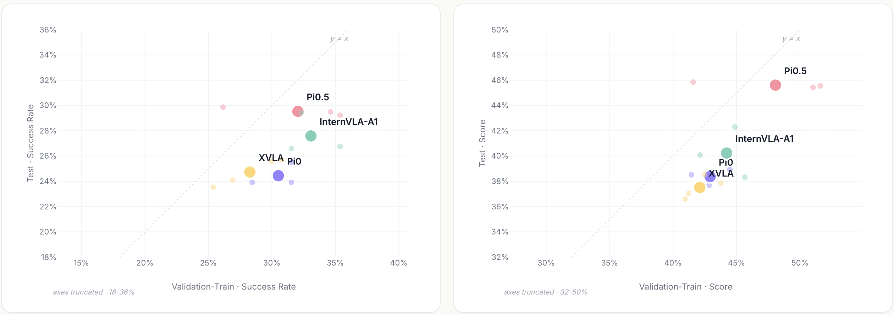
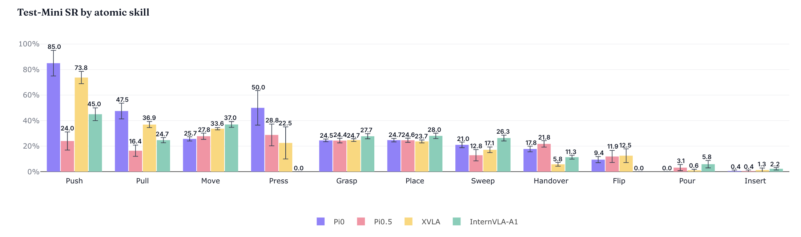
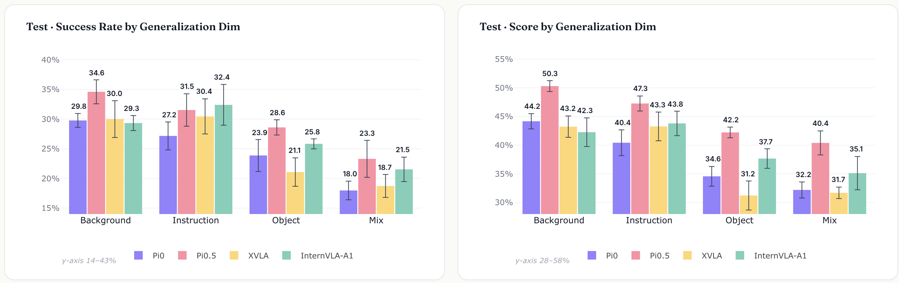
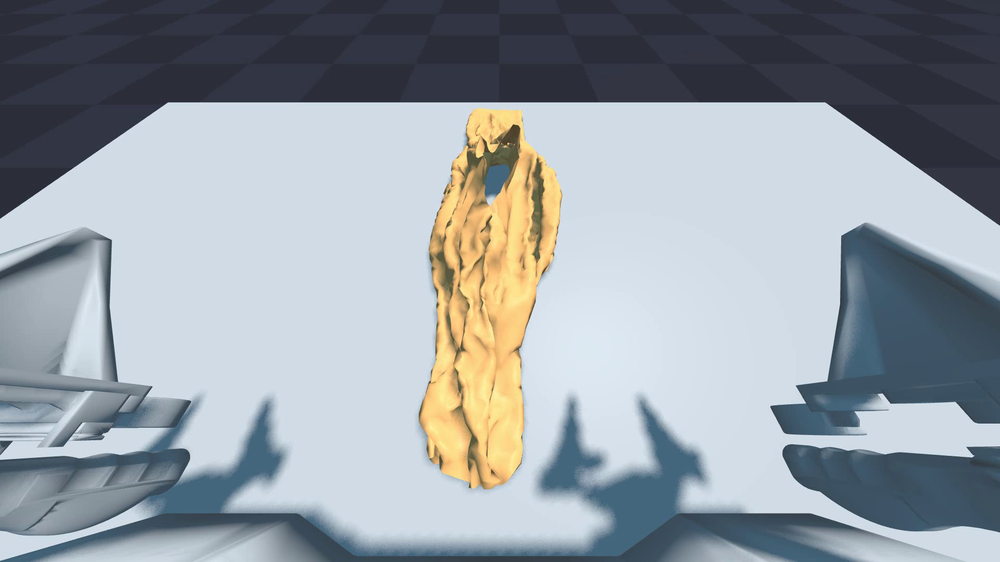

# From “Working Correctly” to “Diagnosable”: EBench for Embodied Manipulation Evaluation

After large models continuously push the boundaries of cognitive intelligence, embodied AI is further focusing its research on the real physical world. The core issue now is not just whether the model can "understand," but whether robots can truly perform complex manipulations and maintain stable performance under new environments, objects, and tasks.

To answer this question, the evaluation system is becoming a critical infrastructure that cannot be bypassed.

Today, the embodied domain is not lacking in models, nor in a multitude of continuously updated benchmark scores. What is truly scarce is a testing method that can help researchers answer questions such as "where are the strengths and weaknesses of the model, and can this capability be transferred to other contexts?"

In other words, what the industry currently lacks is not just a ranking list, but a evaluation framework that can break down the total score, clarify capabilities, and accurately measure generalization.

It is under such circumstances that the Physical Intelligence Center of Shanghai AI Lab has introduced EBench. It is not merely a new ranking system focused on overall scores, but rather a simulation evaluation framework for manipulation built around capability analysis, real-world generalization, and efficient iteration.

Currently, EBench includes 26 tasks, which are labeled across five dimensions: Scene, Atomic Skill, Horizon, Precision, and Operating Mode. It also covers four types of generalization aspects: Object, Background, Instruction, and Mixed Perturbation. A total of 794 test tasks have been constructed, aiming to shift the evaluation of embodied manipulation from "giving scores" to "explaining capabilities".


Related links:

Project open-source address: https://github.com/InternRobotics/EBench

Evaluation set Hugging Face download link: https://huggingface.co/datasets/InternRobotics/EBench-Dataset

Evaluation set ModelScope download link: https://modelscope.cn/datasets/InternRobotics/EBench-Dataset

Online simulation evaluation platform: https://internrobotics.shlab.org.cn/eval

## From "grabbing and releasing" to complex manipulation: Bringing tasks closer to real-world scenarios

To ensure that the evaluation has real diagnostic value, it is necessary to make the task itself close enough to a real manipulation scenario. In real environments, robotic manipulation rarely involves simply “grasping—placing” on a single desktop; instead, it often involves spatial understanding, fine control, long-term planning, and coordination among the robotic arm, hands, and moving chassis.

Therefore, EBench breaks through the traditional "grasping—placing" cycle in task design, covering various task forms such as single-step grasping and placing, fine assembly, manipulation, and long-distance collaboration.

In terms of space, tasks expand from a two-dimensional desktop to a three-dimensional environment with height, depth, and hierarchical relationships; in terms of precision, they move from simply “being able to place” to “being able to align and adjust accurately”; in terms of timing, they extend from single-step actions to multi-step planning and mid-course correction; and in terms of execution entities, they also evolve from a single robotic arm to dual-hand coordination and mobile chassis collaboration.

These tasks integrate manipulation primitives such as grasping, placing, inserting, pouring, flipping, sweeping, and handover into real-world operation semantics, enabling EBench to not only record whether actions were completed, but also further analyze where the model is strong and where it is weak.


## From total score to capability profile: Making model performance verifiable

The first thing EBench wants to do is to further translate "whether the task was successful" into "why the capability succeeded".

In the past, many benchmarks provided a overall success rate. This number is intuitive, but not very interpretable. Even though the model score improves, it is still difficult for researchers to determine whether the improvement stems from enhanced mobility, improved control, more stable long-term tasks, or simply changes in the proportion of low-difficulty tasks.

For this purpose, EBench establishes a five-dimensional tag system for each task, reMapping the task results into specific capability dimensions.

Among these, the scenario dimension is used to observe the performance differences of the model in various visual environments; the atomic skill dimension is used to break down the ability distribution of the model across different basic operational skills; the duration dimension is used to characterize the length of the task chain, helping to distinguish the stability differences between short-term and long-term tasks; the accuracy dimension is used to analyze the performance of the model under different accuracy requirements; and the manipulation mode dimension is used to differentiate between dexterous manipulation and movement operations, observing whether there are significant differences in the model under different operational forms.

In this way, the output from EBench is not just a "success rate," but a profile of capabilities that can be further analyzed. Researchers can not only know whether the model has improved, but also ask further questions: in which dimension has the improvement occurred? Which types of tasks have the weaknesses? And where should the next optimization focus on.

For embodied manipulation models, this means that simulation evaluation is no longer just about "passing the tasks," but begins to play a role in "disassembling the structural components."

## From task completion to real generalization: distinguishing "ability to solve problems" and "ability to transfer"

To prevent the model from adapting to the benchmark itself during continuous iteration, EBench uses a standard validation set-test set isolation mechanism.

The validation set includes seen tasks (Validation-Train) and unseen tasks (Validation-Unseen), which are used for daily tuning and rapid iteration; the isolation test set (Test) is used to evaluate the real adaptability of the model in new tasks, new objects, and new combinations under non-distribution conditions, rather than simply memorizing the training data.

On this basis, EBench further sets up four types of generalization tests: Object generalization, Background generalization, Instruction generalization, and Mixed perturbation.

The key here is not just "testing multiple scenarios," but also ensuring that different generalization factors can be observed separately. In this way, when the model shows performance degradation in the test set, researchers can further determine whether the issue stems mainly from new objects or a new background, or from changes in instruction expressions or a combination of multiple factors.

In other words, EBench does not simply tell researchers that "the model's score dropped after the test set was changed," but instead helps to identify "why the model's score dropped."

Additionally, considering that the coverage ranges of different embodied models are not entirely consistent, EBench also provides dual evaluation interfaces for Specialist and Generalist.

Among these, Specialist is designed for evaluating specialized abilities such as dexterous / mobile manipulation; Generalist, on the other hand, is used for models that possess multiple types of manipulation skills, enabling more unified comprehensive testing. This design takes into account different stages of current model development while providing a baseline for more general embodied manipulation models in the future.

## From R&D closed loop to capability diagnosis: Ensuring evaluations stay beyond the result page

For embodied manipulation models, the evaluation process itself is also a high-cost step. Long chains, heavy resources, and slow feedback all make it difficult for benchmarks to be incorporated into the R&D process. Therefore, EBenchmark provides two types of support in terms of infrastructure: first, open-source distributed evaluation tools that can complete the evaluation of the validation set in about 30 minutes with an 8-cpu 4090 configuration, facilitating rapid local testing; second, 7×24-hour online evaluation services, allowing users to initiate standardized tests under a unified protocol.

On this basis, the analysis of EBench results does not merely focus on "who has a higher score". Currently, EBench has completed the first round of validation on representative models such as π0, π0.5, XVLA, and InternVLA-A1. The results show that the overall success rates are similar, but this does not mean that the ability structures are identical.



After transitioning from the validation set to the isolated test set, the score fluctuations of different models are inconsistent. The fluctuations of InternVLA-A1 and π0 are relatively small, while those of π0.5 are more pronounced. This indicates that in evaluations without an isolation mechanism, the lead on the validation set may involve adaptation to the training distribution, and does not necessarily reflect true generalization ability.



Taking manipulation and dexterous manipulation as examples, InternVLA-A1 performs well in manipulation tasks but shows a significant decline in dexterous manipulation; π0 is more balanced between the two types of manipulation patterns.

In terms of accuracy, there is a limited gap among the models for low-precision tasks; however, after entering high-precision manipulation, π0 remains relatively ahead, while XVLA and π0.5 show a significant decline in performance. This indicates that the stable performance of models in low-precision tasks does not directly imply their ability to perform high-precision manipulation.

Atomic skills also exhibit complementarity: π0 performs better in Pull; XVLA has an advantage in Push, but is relatively weak in handover tasks.


*Comparison of success rates of different models in the atomic skill dimension*

The generalization test further shows that changes in background and instructions are relatively easy to adapt to; however, once new objects are introduced, the performance of the model drops significantly. When multiple factors change simultaneously, i.e., in a Mixed perturbation scenario, the performance further declines. Overall, object generalization and Mixed perturbation are the two aspects where the current model is more prone to failure. In terms of generalization, π0.5 also holds a leading position, outperforming other models in all three generalization dimensions: background, objects, and mixed scenarios. The advantages in background and foreground object generalization are particularly evident. This also explains to some extent the community's general perception that π0.5 pre-trained models are "useful" — the model still maintains good generalization after post-training fine-tuning.

These results indicate that for embodied manipulation models, high scores do not automatically mean high generalization. A more important value of EBench is to help researchers understand which abilities contribute to the scores, whether they can be applied to tasks outside the training distribution, and where the real weaknesses of the model lie.



## Quick Start Guide: Run a Minimum Closed Loop First

If you just want to quickly experience EBench, it is not recommended to download the full dataset, deploy large-scale models policies, or run the entire validation set right away. A safer approach is to run a smoke test first: ensure that the links for Isaac Sim, GenManip, cuRobo planning, trajectory saving, and video rendering are all working properly.

This time, we are reproducing the `Minimal_Banana` task in GenManip: having Franka place bananas on a pan. It does not represent the complete EBench score, but it can serve as a minimum check to determine whether the environment is available.

### 1. Recommended Hardware and Versions

The minimum smoke test does not require high VRAM; an RTX 4090 or L40 with 24GB of VRAM can run it successfully. Larger validation sets, parallel data generation, or model policy deployment require multiple GPUs and more disk space.

The key versions used for this verification are as follows:

| Item | This verification version |
| --- | --- |
| System | Ubuntu 22.04 |
| Python | 3.10 |
| Isaac Sim | 4.1.0.0 |
| PyTorch | 2.4.0+cu121 |
| NumPy | 1.26.4 |
| cuRobo | v0.7.8 |

It should be noted that the PyPI package for Isaac Sim 4.x usually requires Python 3.10. If you install Isaac Sim 4.1 using Python 3.11, you will encounter version errors such as `Requires-Python ==3.10.*`.

### 2. Prepare the environment

It is recommended to place the Python virtual environment on the data disk rather than the shared disk, which reduces the IO overhead during installation and decompression. Before starting Isaac Sim, you need to agree to the Omniverse EULA:

```bash
export OMNI_KIT_ACCEPT_EULA=YES
export EBENCH_CACHE_ROOT="${EBENCH_CACHE_ROOT:-$HOME/.cache/ebench}"
export HF_HOME="$EBENCH_CACHE_ROOT/huggingface"
export TMPDIR="$EBENCH_CACHE_ROOT/tmp"
mkdir -p "$HF_HOME" "$TMPDIR"
```

cuRobo is recommended to be fixed to `v0.7.8`. The current code of GenManip uses an old import path:

```python
from curobo.geom.sdf.world import CollisionCheckerType
```

If the latest main branch of cuRobo is used directly, `No module named 'curobo.geom'` may appear. It can be fixed like this:

```bash
cd saved/envs/curobo
git checkout v0.7.8
pip install -e . --no-build-isolation
```

### 3. Generate the minimal task trajectory

After entering the GenManip root directory, run:

```bash
python demogen.py \
  --config configs/tasks/minimal.yml \
  --record minimal_planning
```

If only `--without_planning` is added, the program will save the scene and a small amount of trajectory information, but subsequent `render.py` cannot generate a complete action video. Therefore, to obtain visual results, you should first run the planned `demogen.py`.

After success, you will see trajectory data in a similar directory:

```text
saved/demonstrations/Minimal_Banana/trajectory/
```

### 4. Render and export the video

The default camera configuration enables depth, semantic segmentation, 2D/3D bbox, and motion vector. We encountered CUDA interop errors with Isaac/Hydra in a dual 4090 environment, for example:

```text
CUDA error 700: an illegal memory access was encountered
HydraEngine::render failed
Rendering failed
```

For a quick smoke test, you can turn off multiple GPUs and configure the camera as RGB-only. This allows you to verify that the main workflow of “task planning -> trajectory playback -> RGB rendering -> video export” is functional.

The core modification is as follows:

```python
simulation_app = SimulationApp(
    {
        "headless": True,
        "active_gpu": 0,
        "physics_gpu": 0,
        "multi_gpu": False,
        "max_gpu_count": 1,
    }
)
```

Disable non-RGB annotator in camera configuration:

```yaml
with_distance: false
with_semantic: false
with_bbox2d: false
with_bbox3d: false
with_motion_vector: false
```

Then run the RGB-only rendering:

```bash
python render_single_gpu.py \
  --config configs/tasks/minimal_rgb_only.yml \
  --without_depth \
  --record rgb_only_single_gpu_full
```

In this smoke test, 316 frames were successfully rendered and decoded from LMDB into three-channel camera video.

### 5. Local Visualization Results

The video below shows the RGB rendering results of this minimal task. They are smoke test outputs used to verify that the process works, and are not equivalent to official EBench evaluation videos.

<video controls muted preload="metadata" width="100%">
  <source src="../../20-公众号短文宣发/assets/ebench/ebench_minimal_banana_obs_camera.mp4" type="video/mp4">
</video>

[ Open video: assets/ebench/ebench_minimal_banana_obs_camera.mp4](../../20-公众号短文宣发/assets/ebench/ebench_minimal_banana_obs_camera.mp4)

<video controls muted preload="metadata" width="100%">
  <source src="../../20-公众号短文宣发/assets/ebench/ebench_minimal_banana_obs_camera_2.mp4" type="video/mp4">
</video>

[ Open video: assets/ebench/ebench_minimal_banana_obs_camera_2.mp4](../../20-公众号短文宣发/assets/ebench/ebench_minimal_banana_obs_camera_2.mp4)

<video controls muted preload="metadata" width="100%">
  <source src="../../20-公众号短文宣发/assets/ebench/ebench_minimal_banana_realsense.mp4" type="video/mp4">
</video>

[ Open video: assets/ebench/ebench_minimal_banana_realsense.mp4](../../20-公众号短文宣发/assets/ebench/ebench_minimal_banana_realsense.mp4)

The top view is as follows:


### 6. Incorrect Error Ordering

If reproduction fails, check the following in order:

1. First, confirm `OMNI_KIT_ACCEPT_EULA=YES` to avoid Isaac Sim getting stuck in EULA input.
2. Ensure Python is version 3.10; Isaac Sim 4.1 is not compatible with Python 3.11.
3. Confirm that cuRobo is `v0.7.8`; otherwise, `curobo.geom` may not be found.
4. Run `demogen.py` first; do not run only `--without_planning`.
5. If the default rendering triggers CUDA/Hydra errors, switch to RGB-only + single GPU mode first.
6. As long as the smoke test runs successfully, consider restoring full annotation outputs such as depth, semantic, and bbox.

## More Than EBench: Three Simulation and Data Generation Paths

EBench addresses the issue of “how to evaluate embodied manipulation policies”. Around it, two other important directions in the InternRobotics ecosystem can also be seen: SIM1 focuses on generating data for soft-body manipulation, while InternVerse and InternDataEngine serve as more general synthetic data engines. They do not replace each other, but rather cover different aspects within the closed loop of embodied research and development.

### SIM1: Data Generator for Soft Body World

SIM1 stands for **Physics-Aligned Simulator as Zero-Shot Data Scaler in Deformable Worlds**. Its focus is not on rigid body pick-and-place, but on soft body manipulation such as dual-arm fabric handling. It provides a data generation pipeline that covers teleoperation, trajectory generation using diffusion policy, physical replay, mass filtering, high-fidelity rendering, and LeRobot data conversion.

In the minimum reproduction, SIM1 can first verify the link using a very short replay sample. The video below is from an 8-frame smoke replay, which is mainly used to confirm that the replay, USD recording, and video storage link are working properly.



<video controls muted preload="metadata" width="100%">
  <source src="../../20-公众号短文宣发/assets/sim1/sim1-replay-smoke.mp4" type="video/mp4">
</video>

[ Open video: assets/sim1/sim1-replay-smoke.mp4](../../20-公众号短文宣发/assets/sim1/sim1-replay-smoke.mp4)

The high-fidelity rendering pipeline will further convert the replay results into multi-camera RGB, LMDB, and LeRobot data. Below is the head camera rendering result of the same smoke sample.


<video controls muted preload="metadata" width="100%">
  <source src="../../20-公众号短文宣发/assets/sim1/sim1-render-head.mp4" type="video/mp4">
</video>

[ Open video: assets/sim1/sim1-render-head.mp4](../../20-公众号短文宣发/assets/sim1/sim1-render-head.mp4)

The key value of SIM1 is that the soft body trajectory is not immediately usable after generation, but must go through physical replay and quality filtering. A low rate of occurrence does not necessarily indicate an installation failure, but rather the result of the combined effects of soft body contact, gripper closure, fabric posture, and solver stability.

### InternVerse / InternDataEngine: Small-space experience synthetic data engine

InternDataEngine is the data synthesis engine in InternVerse's embodied data platform. The full asset package is extensive, but if you only want to experience the features, there is no need to download approximately 200GB of full assets from the beginning. For a smaller space, you can use the assets provided by the repository, necessary cuRobo / Drake dependencies, and a small amount of supplementary assets to cover the workflow, robots, controllers, skills, objects, cameras, randomization, and data output links.

The video below comes from a small-space experience task, showing the workflow, controller, and three-channel camera output using Split ALOHA.


<video controls muted preload="metadata" width="100%">
  <source src="../../20-公众号短文宣发/assets/internverse/track_three_views.mp4" type="video/mp4">
</video>

[ Open video: assets/internverse/track_three_views.mp4](../../20-公众号短文宣发/assets/internverse/track_three_views.mp4)

Objects and Domain Randomization tasks can demonstrate object categories, poses, lighting, and camera perturbations.


<video controls muted preload="metadata" width="100%">
  <source src="../../20-公众号短文宣发/assets/internverse/object_dr_three_views.mp4" type="video/mp4">
</video>

[ Open video: assets/internverse/object_dr_three_views.mp4](../../20-公众号短文宣发/assets/internverse/object_dr_three_views.mp4)

The hinge object demo is used to verify the `ArticulatedObject` loading and multi-view rendering.


<video controls muted preload="metadata" width="100%">
  <source src="../../20-公众号短文宣发/assets/internverse/articulation_three_views.mp4" type="video/mp4">
</video>

[ Open video: assets/internverse/articulation_three_views.mp4](../../20-公众号短文宣发/assets/internverse/articulation_three_views.mp4)

The significance of this route is that even without downloading the complete assets, you can experience the main modules of the synthetic data platform first, including the `simbox_plan_and_render` workflow, Split ALOHA, cuRobo control link, three-way camera, LMDB, and MP4 output. For course demonstrations, short articles on official accounts, and feature previews, this "miniature functional experience" is more lightweight than a complete task library.

### How to understand the three together

These three can be understood within a closed loop of research and development:

| Tool | Main Function | Recommended First Manipulation |
| --- | --- | --- |
| EBench | Evaluates policy capabilities and breaks down the capability structure behind success rates | `Minimal_Banana` smoke test |
| SIM1 | Generates and filters soft body manipulation data | 8-frame replay and high-fidelity rendering smoke |
| InternDataEngine | General synthetic data engine, covering skills, objects, cameras, and randomization | Small-space three-view demo |

EBench is more like a "examination room", while SIM1 and InternDataEngine are more like "training data factories" and "synthetic data engines". When evaluation indicates that the model has weaknesses in object generalization, high-precision manipulation, or long-term tasks, the latter two can continue to provide data and visual samples to enhance specific capabilities.

## Want to continue working? The Every-Embodied open-source tutorial is ready.

If you read this, the most important question you might be concerned about is not just "What does EBench evaluate?", but: Can I run it myself, modify it, and continue to integrate it into research projects?

The Chinese open-source tutorial on **every-embodied** embodied AI by Datawhale is precisely tailored to this need. The project breaks down the learning of embodied AI into practical chapters, covering basic concepts, embodied navigation and VLN, simulation environments, policy learning, VLA / VLM, dataset and evaluation benchmarks, competition practices, and group learning, aiming to narrow the gap between “understanding papers” and “actually running the code”.

Full open-source project directly:

https://github.com/datawhalechina/every-embodied

Online reading address:

https://datawhalechina.github.io/every-embodied/zh-cn/

The reproduction records of EBench, SIM1, and InternVerse / InternDataEngine have also been synchronized to the every-embodied project. These are not just "conceptual introductions," but are organized in a "minimum viable workflow" manner: first, the environment requirements and key configurations are explained; then, a smoke test video is provided; finally, common errors and troubleshooting steps are clearly written out.

If you are just starting out, you can begin with the chapters on navigation, simulation, and basic manipulation; if you are already working on embodied manipulation models, consider EBench as the entry point for evaluation, and SIM1 / InternDataEngine as the entry point for data generation. Use the same open-source tutorial project to follow a complete path of “learning, reproduction, evaluation, and iteration”.


## Conclusion

Today’s embodied AI doesn’t lack new models or new rankings. What is truly lacking is a evaluation system that can help researchers continuously develop “model capability awareness”.

What EBench aims to express is precisely this: it is not just a new simulation benchmark, nor just a new leaderboard. Instead, it hopes to shift embodied manipulation evaluation from "passive scoring" to "active diagnosis," and shift simulation evaluation from "completing tasks" to "analytical ability."

When researchers can no longer see only a total score, but can truly understand the ability structure, generalization boundaries, and real weaknesses of the model, evaluation becomes not just a number on the result page, but starts to serve as an infrastructure that drives model iteration and method innovation.


(Welcome to scan the code to join the user communication group)

Welcome to the online simulation evaluation platform

https://internrobotics.shlab.org.cn/eval
