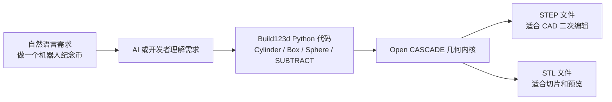
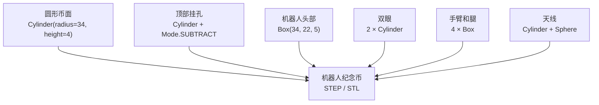
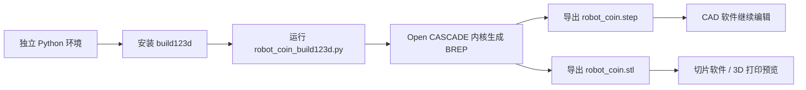
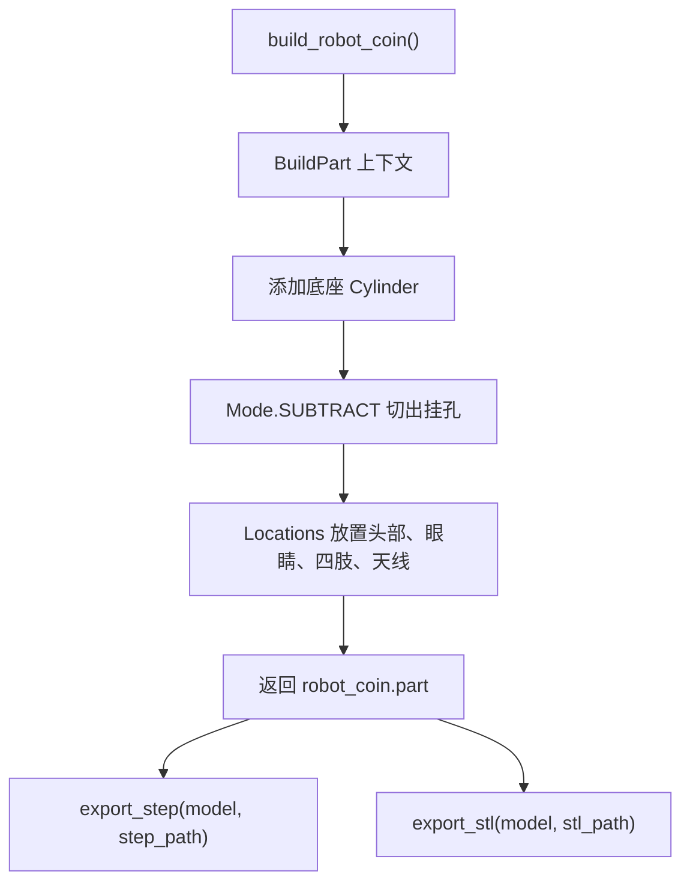

# Build123d Code Modeling Introduction: Recreating a Robot Meme Coin

Build123d is a Python-parsed CAD modeling library that is ideal for generating reusable mechanical parts, robot components, and 3D printing models using code. In this chapter, we will not focus on complex robotic arm assembly. Instead, we will use a small “robot commemorative coin” to complete the entire workflow: understand the design intent, set up an isolated environment, model using Python, export to STEP/STL, and explain why the geometric structure in the code produces the current shape.

Here, it is necessary to clarify a point that is easily misunderstood: Build123d itself is not a tool for directly generating STL from natural language. What it actually does is execute Python geometric code. Natural language can serve as a requirement description; for example, "generate a robot commemorative coin with a hanging hole." Then, the AI or developer translates this into `Cylinder`, `Box`, `Sphere`, and `Mode.SUBTRACT` etc. Build123d code. Only after running the script will Build123d invoke the underlying Open CASCADE geometric kernel to generate entities and export STEP/STL files.

Therefore, the "robot commemorative coin" in this chapter is not a model directly generated by a prompt. Natural language can be regarded as a modeling task description. For example, "create a circular base with a protruding robot pattern, leave a small hole at the top for a key ring, and export the STL and STEP files" will not be executed by Build123d itself. It needs to be converted into Python code within `robot_coin_build123d.py`. The script is the actual reproducible asset, and STEP/STL are the results after the script runs.

The core of this chapter is not to have people remember certain lines of commands, but to understand the path from design intent to manufacturing documents:

```text
自然语言设计需求
→ Python / Build123d 几何代码
→ Open CASCADE 实体建模
→ STEP / STL 文件
→ CAD 编辑或 3D 打印切片
```

After completing this chapter, everyone can obtain three reproducible results:

```text
outputs/robot_coin.step
outputs/robot_coin.stl
assets/robot_coin_preview.png
```

This repository has preserved a copy of the local replication results: [robot_coin.step](../../../21-机械臂和机器人设计/01Build123d代码建模入门/outputs/robot_coin.step), [robot_coin.stl](../../../21-机械臂和机器人设计/01Build123d代码建模入门/outputs/robot_coin.stl). If you only want to view the results, you can directly download these two files; if you want to understand the CAD-as-code modeling process, it is recommended to start the full replication from environment installation and script execution.

<p align="center">
  
</p>

Figure 1: Preview of the robot commemorative coin rendered on a separate screen by this machine. This image was automatically generated by `outputs/robot_coin.stl`, and there is no need to manually open a CAD software screenshot.

## Why robot commemorative coins are chosen as the first example

The first Build123d example is not suitable for completing a full robotic arm right away. A robotic arm involves linkages, joints, assembly constraints, motor mounting positions, bearing holes, tolerances, and movement ranges—a high-concept area where beginners easily mix up "code modeling syntax" and "mechanical design issues." This chapter chooses the robot commemorative coin because it is simple enough yet covers the core types of manipulation involved in code modeling.

The circular coin corresponds to the most basic entity generation. The robot's head and limbs correspond to the box positioning, while the eyes and antennas correspond to cylinders and spheres. The hanging hole at the top corresponds to Boolean subtraction. In other words, although this small model does not have a complex mechanism, it already contains the basic ideas of parametric CAD: first, break down the target shape into several describable geometric features, and then use code to generate, position, add, or subtract them one by one.

It is designed in the shape of a “round base + raised robotic pattern + hanging hole at the top” to allow users to see three different results within a single model. The first type is the addition of physical elements, such as the base, head, eyes, limbs, and antenna; the second type is the removal of physical elements, like the hanging hole; the third type is the difference in export formats—STEP for subsequent CAD editing, and STL for slicing and previewing. Once you understand this small model, when creating gripper brackets, sensor mounts, development board mounting plates, or robotic arm end adapters, you just need to replace the geometric features with more engineering‑friendly dimensions.

## What will be completed in this chapter

This article uses Windows PowerShell + Python 3.12 for verification. First, create a separate Python environment to avoid the CAD dependencies of Build123d from affecting the existing robot simulation environment; then run `robot_coin_build123d.py` to generate a solid model, and export `.step` and `.stl`; finally, use `render_robot_coin_preview.py` to automatically render a PNG preview image. At the end of the tutorial, we will return to the code level to explain how each geometric manipulation corresponds to the visible structures in the model.

## Official Images and Figures in the Article

Following the tutorial writing guidelines, for technical method tutorials, prioritize searching for architecture diagrams on official project pages, official documents, or papers. In this chapter, we examined the official documentation of Build123d and its official GitHub repository. The official materials include example model libraries and API documents, but there is no "system architecture diagram" suitable for inclusion in this chapter. Therefore, this article does not use screenshots from social platforms or non-official recreated images; instead, Mermaid is used to create maintainable teaching diagrams.

Figure 2 shows the relationship between natural language, code, and CAD files. Note that Build123d executes the intermediate Python code, not the natural language on the far left.



Figure 2: Natural language does not directly generate STL. It is first converted into a Build123d Python script, and only after the script runs is an openable CAD file generated.

Figure 3 shows the structural breakdown of the object replicated in this chapter. The final model was not created by manual dragging, but rather composed of a set of basic geometric shapes and a boolean subtraction operation.



Figure 3: Geometric composition of the robot commemorative coin. This example deliberately uses a small number of basic entities to help everyone understand the modeling context, positioning, and boolean operations of Build123d.

Figure 4 shows the replication process from a Python script to a CAD file. When troubleshooting, you can use this chain to determine whether the issue occurs during environment installation, script modeling, geometry export, or CAD viewing.



Figure 4: Build123d code modeling process. Build123d is responsible for converting Python descriptions into geometric entities. STEP is more suitable for CAD secondary editing, and STL is more suitable for 3D printing slicing.

## Verified Environment

The verification results of this machine are as follows:

| Item | Local Verification Configuration |
|---|---|
| System | Windows PowerShell |
| Python | 3.12.3 |
| Build123d | 0.10.0 |
| Verification Method | Independent virtual environment |
| Output Format | STEP, STL, PNG |
| Output Size | Approximately `68 mm × 68 mm × 9.4 mm` |

The Python environment commonly used in the current repository may already have ManiSkill, robotics, and deep learning dependencies installed. Installing Build123d directly in such an environment will affect the versions of `numpy`, `scipy`, and `vtk` packages, and may cause conflicts with existing simulation tools. Therefore, this chapter recommends using a separate virtual environment at all times.

## Directory Structure

This chapter file is located at:

```text
21-机械臂和机器人设计/
└── 01Build123d代码建模入门/
    ├── README.md
    ├── requirements.txt
    ├── robot_coin_build123d.py
    ├── render_robot_coin_preview.py
    ├── assets/
    │   └── robot_coin_preview.png
    └── outputs/
        ├── robot_coin.step
        └── robot_coin.stl
```

Table 1: Description of this chapter files. `robot_coin_build123d.py` is the reproduction modeling script, `render_robot_coin_preview.py` is responsible for automatically rendering STL into tutorial images, and `outputs/` is the CAD result generated by the script.

## Step 1: Create an isolated environment

The following command assumes that you have entered the root directory of the Every-Embodied repository. Do not use absolute paths for local users in the command; instead, use relative paths consistently.

```powershell
py -3.12 -m venv .venv-build123d
.\.venv-build123d\Scripts\python.exe -m pip install --upgrade pip
.\.venv-build123d\Scripts\python.exe -m pip install -r .\21-机械臂和机器人设计\01Build123d代码建模入门\requirements.txt
```

If Python 3.12 is not installed, you can also try Python 3.11 first:

```powershell
python -m venv .venv-build123d
.\.venv-build123d\Scripts\python.exe -m pip install --upgrade pip
.\.venv-build123d\Scripts\python.exe -m pip install build123d==0.10.0
```

Do not submit `.venv-build123d/` to the repository. It is only a local running environment.

Checkpoint 1: Verify that Build123d can be imported.

```powershell
.\.venv-build123d\Scripts\python.exe -c "import build123d; print(build123d.__version__)"
```

Output of this machine:

```text
0.10.0
```

This check only proves that Python can import Build123d, but it does not confirm that the geometric kernel and file export process are functioning properly. The actual modeling verification will be completed in the next step.

## Step 2: Run the clone script

Continue running in the root directory of the repository:

```powershell
.\.venv-build123d\Scripts\python.exe .\21-机械臂和机器人设计\01Build123d代码建模入门\robot_coin_build123d.py
```

After successful execution, the terminal will display a result similar to this:

```text
Build123d robot coin generated.
Bounding box: bbox: -34.0 <= x <= 34.0, -34.0 <= y <= 34.0, -2.0 <= z <= 7.4
STEP: ...\outputs\robot_coin.step
STL:  ...\outputs\robot_coin.stl
```

The bounding box here is the first measure for understanding the model shape. `x` and `y` both range from `-34` to `34`, indicating that the radius of the bottom coin is 34 mm; `z` goes from `-2.0` to `7.4`, showing that a 4 mm thick coin surface also has a robot protrusion and antenna structure. In other words, the terminal output is not just random printed logs; it tells us that the script actually generated a three-dimensional entity with thickness, protrusions, and mounting holes.

Checkpoint 2: If the above bounding box is visible, it indicates that the entity model has been successfully created by Build123d. This smoke test proves three things: the Python environment is available, the Open CASCADE geometry kernel is functional, and the STEP/STL export process is working. However, this does not mean that the model is ready for direct mass production or printing. It is still recommended to check the wall thickness, overhang, and slicing results before printing.

Checkpoint 3: Verify that the output file exists.

```powershell
Get-ChildItem .\21-机械臂和机器人设计\01Build123d代码建模入门\outputs
```

At least the following should be visible:

```text
robot_coin.step
robot_coin.stl
```

## Step 3: Auto-render preview image

If the tutorial requires showing the model's effect, there is no need to manually open the CAD software and take screenshots. This chapter provides a off-screen rendering script that reads `outputs/robot_coin.stl`, calls VTK to set up the camera and lighting, and exports a PNG image:

```powershell
.\.venv-build123d\Scripts\python.exe .\21-机械臂和机器人设计\01Build123d代码建模入门\render_robot_coin_preview.py
```

After success, the following will be generated:

```text
21-机械臂和机器人设计/01Build123d代码建模入门/assets/robot_coin_preview.png
```

Checkpoint 4: If `assets/robot_coin_preview.png` can be opened normally, it means the model preview has been automatically generated. This preview is suitable for inclusion in the tutorial text; if you need to check the engineering dimensions, it is still recommended to open the STEP file or import it into CAD software for further confirmation.

## Step 4: View the output model

`robot_coin.step` is suitable for further editing in CAD tools such as FreeCAD, SolidWorks, Fusion, and Onshape; `robot_coin.stl` is suitable for importing slicing software such as Bambu Studio, PrusaSlicer, and Cura to perform 3D printing previews.

It is recommended to first open the STEP file to check its structure, as the STEP format retains a more complete boundary representation. After ensuring the model is correct, use STL for printing slices. If you only want to verify whether the script can generate the model, simply open `outputs/robot_coin.step` in the repository.

## Explanation of the code mechanism: Why the shape is like this

Core code is located at:

```text
21-机械臂和机器人设计/01Build123d代码建模入门/robot_coin_build123d.py
```

This script does not load model files from external sources, nor calls any natural language generation interface. All shapes of the model originate from the geometric statements in the `build_robot_coin()` function. When understanding this code, it can be seen as a "building blocks" process: first, a circular base is placed, then holes are dug out on the base, and finally, robot patterns are stacked on the surface.

Step 1 is the coin surface. `Cylinder(radius=34, height=4)` generates a cylinder with a radius of 34 mm and a height of 4 mm. Since Build123d defaults to placing the cylinder near the origin, its height range is `-2` to `2`. This is why the minimum value of `z` within the bounding box is `-2.0`. This cylinder is not the robot's body, but rather the bearing surface for all protruding features, similar to the base plate of a badge or keychain.

The second step is the hanging hole. The script places a cylinder with a radius of 3.2 mm and a height of 8 mm at the `(0, 25, 0)` position, using `mode=Mode.SUBTRACT`. The key here is not "adding another cylinder," but "using this cylinder to subtract material from the existing entity." Therefore, a through-hole appears at the top of the preview image. This design corresponds to the threading holes or key ring holes in actual manufacturing, which is why the robot commemorative coin has practical uses.

The third step is the robot pattern. `Box(34, 22, 5)` creates a cuboid above the coin surface to represent the robot's head or body. Two small cylinders are placed above the head to form the eyes; four cuboids represent the arms and legs; finally, a horizontal cylinder with a small ball represents the antenna. None of these are independent floating objects. Instead, they are merged into the same `BuildPart()` context after being positioned by `Locations(...)`, so the final result is a single integrated component.

Figure 5 summarizes this process using a function-level data flow. You can compare it with the preview image: each visible protrusion has a corresponding geometric statement in the code.



Figure 5: The function-level data flow of `robot_coin_build123d.py`. The input of the script is the dimension parameters in the code, and the output is two CAD files. Natural language requirements only participate in "design description" and do not directly contribute to geometric solving.

The value of this code modeling approach lies in its interpretability and modifiability. If you want the coin surface to be larger, simply adjust the radius of the base cylinder; if you want the head to be wider, modify the first parameter of `Box(34, 22, 5)`; if you want the hanging hole to be closer to the edge, adjust the second coordinate of `Locations((0, 25, 0))`. The model is not a one-time image, but a design program that can be repeatedly modified and regenerated.

## Adjustable Parameters

The table below lists only the parameters that are most frequently modified. It is recommended to modify one parameter at a time when starting out. After running the script again, observe the changes in STEP/STL and PNG. This makes it easier to establish the correspondence between "code parameters" and "geometric results".

| Goal | Location of Modification | Recommendation |
|---|---|---|
| Adjust coin surface size | `Cylinder(radius=34, height=4)` | Radius controls the outer diameter, height controls the thickness |
| Adjust hook hole position | `Locations((0, 25, 0))` | The larger the second value, the closer the hook hole is to the upper edge |
| Adjust robot head | `Box(34, 22, 5)` | The three parameters control length, width, and height respectively |
| Adjust eye size | `Cylinder(radius=2.2, height=1.4)` | The larger the radius, the more prominent the eyes are |
| Adjust antenna height | `Cylinder(radius=1.2, height=8, rotation=(90, 0, 0))` | `height` controls the antenna length |

Table 2: Locations of common parameter modifications. After modification, run the script again to overwrite and generate new STEP/STL/PNG files.

## Common Questions

### 1. It is not recommended to install directly into an existing robot environment

Build123d will install dependencies such as Open CASCADE, VTK, NumPy, and SciPy. During local testing, installing it directly into an existing robot environment will trigger dependency conflict warnings. It is recommended to always use a separate virtual environment.

### 2. What to do if a font warning appears

This machine encountered the following warning when importing Build123d:

```text
cannot open font 'C:\WINDOWS\Fonts\mstmc.ttf': Not a TrueType or OpenType font
```

In this chapter, no text modeling is used, and this warning does not affect STEP/STL export. If text relief is to be created later, it is recommended to explicitly specify the available font file.

### 3. Which to choose: STEP or STL?

STEP is more suitable for secondary CAD editing, while STL is better for 3D printing slicing. When archiving the tutorial, it is recommended to keep both the script and STEP; if you are concerned about the size of the repository, you can omit the STL and let the reader generate it locally.

### 4. Is it necessary to manually open the CAD software screenshot?

Not necessary. The `render_robot_coin_preview.py` in this chapter has already automated the steps of "opening STL, setting up the camera, lighting, and exporting PNG", making it suitable for generating preview images in tutorials. Only when checking engineering dimensions, assembly constraints, or printing supports is it necessary to open CAD or slicing software manually for inspection.

### 5. When is it necessary to generate concept images?

If the goal of the tutorial is to clarify the "process" and "parameter relationships," use Mermaid or SVG instead, as they are maintainable, searchable, and do not become blurry with varying screenshot resolutions. If a cover image, promotional image, or conceptual illustration is required, you can use image generation tools for drawing, but it should not replace the reproducible CAD scripts and the STEP/STL results of this chapter.

## References

- Build123d official installation documentation: https://build123d.readthedocs.io/en/latest/installation.html
- Build123d official example page: https://build123d.readthedocs.io/en/latest/examples_1.html
- Build123d GitHub repository: https://github.com/gumyr/build123d
