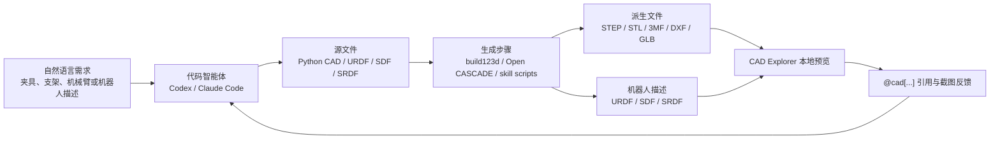
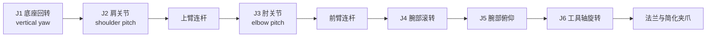
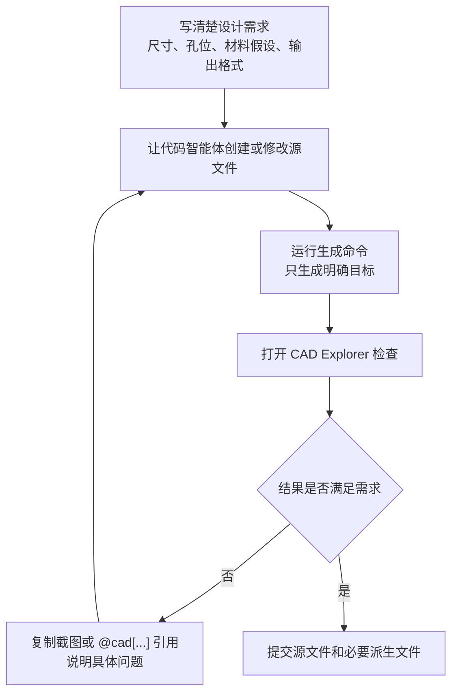

# Introduction to Text-to-CAD Engineering Modeling: Generating Reproducible CAD with Code Agent

Text-to-CAD is not a magical tool that instantly turns a sentence into a perfect 3D model. More precisely, it is an engineered workflow that integrates natural language requests, code agents, parametric CAD scripts, geometric export, and local preview. Users can first describe the desired parts, fixtures, robot mechanisms, or URDF structures in natural language, then let code agents such as Codex and Claude Code modify the Python source files in the repository, and finally let the CAD toolchain export results in formats such as STEP, STL, 3MF, DXF, GLB, URDF, SDF, or SRDF.

This chapter is based on the open-source project [earthtojake/text-to-cad](https://github.com/earthtojake/text-to-cad). The current status of the official repository is “Open Source CAD Skills And Harnesses”. Its core value is not to replace all CAD software, but to transform CAD design into a process closer to software engineering: source code is readable, versions are controllable, output results can be reproduced, and each modification has clear inputs and outputs.

After completing this chapter, everyone should be able to understand three things. First, the “text” in Text-to-CAD mainly consists of requirement descriptions and iteration instructions, not the prompts directly fed into the geometric kernel. Second, the truly reproducible assets are the CAD/URDF/SDF/SRDF source files and generation scripts, not chat records. Third, the engineering closed loop must include preview, reference, inspection, and submission; otherwise, it is easy to remain at a “look-alike” demonstration stage.

<p align="center">
  
</p>

Figure 1: A preview image of the original 6DOF teaching robotic arm generated locally in this chapter. This image was rendered off-screen using `outputs/every_embodied_6dof_arm.stl`, and does not utilize image materials from the official account post.

## Why place Text-to-CAD in the robot design section

Robot design naturally requires handling three types of files: mechanical structure files, robot description files, and simulation/motion planning files. Traditional CAD software is good at detailed modeling, but when it comes to frequent modifications such as adjusting mounting holes, changing link lengths, synchronizing URDF mesh paths, or exporting multiple parts into a simulation environment, manual manipulation becomes very difficult to maintain.

The concept of Text-to-CAD is to manage these objects as engineering projects. A part can be generated using a Python parametric script, a robot can be described using URDF/SDF/SRDF files, and CAD Explorer allows local viewing of STEP, STL, URDF, and other files. The advantage is that every modification can leave a code diff; if the model breaks, you can return to the previous working version instead of guessing where the error lies in the complex CAD history tree.

This also relates to it and the previous chapter, Build123d tutorial. Build123d is more like the underlying code modeling capability—people directly write Python to generate geometry. Text-to-CAD, on the other hand, adds agent skills, CAD Explorer, geometric references, and project-level constraints on this basis, enabling the code agent to participate in iteration more steadily.

## Workflow Overview

Figure 2 shows the basic workflow of Text-to-CAD. It should be noted that the natural language on the far left is just the design brief, while the source file in the middle is what is actually stored in the repository. The derived file on the right is what can be opened and manufactured.



Figure 2: The engineered closed loop for Text-to-CAD. Natural language expresses the intent, code agents modify the source files, CAD toolchains generate geometric results, and local previews verify whether the results meet expectations.

The key to this process is not to have the AI generate the final answer at once, but to establish a closed loop that can be repeatedly checked. The first model generated may have errors in hole positions, unreasonable proportions, or assembly interference. Everyone needs to review it in CAD Explorer, and then report specific issues to the code intelligence agent. Official projects emphasize using stable geometric references such as `@cad[...]` so that the next round of modifications can target specific faces, edges, or objects, rather than simply describing “that place on the left” with vague language.

## What will be accomplished in this chapter

This chapter does not directly replicate the robotic arm images from online posts to avoid issues with unclear material copyright and design ownership. The tutorial provides an original simplified 6DOF desktop robotic arm teaching model, which is used to verify the Text-to-CAD engineering process: the base rotation, shoulder joint, elbow joint, and wrist three axes are all represented by visible geometric structures, but it remains a teaching model and is not a real robotic arm that can be manufactured and used directly.

The team will perform the following checks: clone the official repository; create a separate Python environment; install CAD runtime dependencies; generate STEP, STL, 3MF, and GLB files for the original 6DOF teaching robotic arm; install CAD Explorer frontend dependencies; start the local Explorer; and verify that the project is in a working state of “source file modification, generation results, and preview opening”. This smoke test confirms that the toolchain is available, but it does not prove that a complex robot model has reached a manufacturable or simulation-ready level.

## Verified and Recommended Environment Policy

The official repository indicates Python 3.11+. In local development instructions, use `python3.11 -m venv .venv` to create a virtual environment. Learners on Windows usually have two options: a regular venv and micromamba. It is recommended to use venv first, as it is closer to the official documentation and no additional conda/mamba installation is required. If you are accustomed to using micromamba to manage robot environments, you can also use micromamba.

| Solution | Suitable for | Advantages | Precautions |
|---|---|---|---|
| venv | Most beginners on Windows / macOS / Linux | Closest to the official documentation, low dependency, easy to delete and rebuild | Requires Python 3.11+ installed on the system |
| micromamba | Users who already use conda/mamba to manage robot environments | clearer separation of Python versions and dependencies | Need to install micromamba first |

Table 1 Text-to-CAD environment scheme selection. In this document, venv is used as the main method, and micromamba is used as a alternative option.

## Step 1: Clone the official repository

It is recommended not to directly clone `text-to-cad` into the Every-Embodied repository. It is a separate tool project that includes its own skills, CAD Explorer, and asset generation tools. Placing it in a parallel directory or a separate test directory makes it clearer, and it also helps avoid accidentally submitting a large number of derived files to the tutorial repository.

```powershell
git clone https://github.com/earthtojake/text-to-cad.git #其他案例也可以参考这个仓库
cd text-to-cad
```

Checkpoint 1: Verify that the repository structure exists.

```powershell
Get-ChildItem
```

A directory-like structure should be visible:

```text
skills/
harness/
scripts/
README.md
INSTALLATION.md
```

If you only want to view the tutorials, there is no need to install Git LFS. Some GIFs and benchmark assets in the official repository are managed using LFS. During a lightweight clone, only pointer files may be present; this does not affect anyone's ability to read the source code or install basic toolchains.

## Step 2: Configure the CAD running environment using venv

The following command assumes that you have entered the root directory of the `text-to-cad` repository. Windows PowerShell can create the environment like this:

```powershell
py -3.11 -m venv .venv
.\.venv\Scripts\python.exe -m pip install --upgrade pip
.\.venv\Scripts\python.exe -m pip install -r .\skills\cad\requirements.txt
```

If the local `py -3.11` is not available, you can first check if a valid Python version exists:

```powershell
python --version
```

As long as it is Python 3.11 or later, it can usually be replaced with:

```powershell
python -m venv .venv
.\.venv\Scripts\python.exe -m pip install --upgrade pip
.\.venv\Scripts\python.exe -m pip install -r .\skills\cad\requirements.txt
```

Checkpoint 2: Verify that the CAD runtime can be imported.

```powershell
.\.venv\Scripts\python.exe -c "import build123d, vtk, trimesh, ezdxf; print('CAD runtime OK')"
```

If this works, it indicates that the Python side has at least the dependencies for build123d, VTK, trimesh, and DXF. This check only verifies the import of dependencies; it does not guarantee that any CAD model can be generated correctly.

## Alternative: Configure the environment using micromamba

If you have already installed micromamba, you can also create a separate environment using the following method:

```powershell
micromamba create -n text2cad python=3.11 -y
micromamba activate text2cad
python -m pip install --upgrade pip
python -m pip install -r .\skills\cad\requirements.txt
```

Checkpoint is the same as venv:

```powershell
python -c "import build123d, vtk, trimesh, ezdxf; print('CAD runtime OK')"
```

If `pip install` fails in the micromamba environment, it is recommended to return to the venv solution first. Text-to-CAD is not a deep learning training project, and it has no strong dependence on the conda ecosystem. Using venv is usually more straightforward.

## Step 3: Generate an Original 6DOF Teaching robotic arm

This tutorial provides an original example source file in the current directory:

```text
21-机械臂和机器人设计/02Text-to-CAD工程化建模入门/examples/every_embodied_6dof_arm.py
```

Its function is to provide a testing object that is closer to the robot theme than simple cubes. This model consists of a base, shoulder bracket, upper arm, elbow joint, forearm, three-axis wrist, tool flange, and a simplified gripper. It deliberately uses basic cylinders, boxes, spheres, and Boolean holes to verify the Text-to-CAD generation process, rather than showcasing complex surface modeling.

Here, it is necessary to clarify the phrase "Codex calls up CAD skills". Ideally, after installing and restarting Codex, users can directly submit the following tasks:

```text
使用 cad skill，在 text-to-cad/examples/ 下创建一个原创 6DOF 桌面教学机械臂。
要求：
1. 使用 build123d Python 源文件，定义 gen_step()。
2. 机械臂包含 J1 底座回转、J2 肩关节、J3 肘关节、J4-J6 三轴腕部、工具法兰和简化夹爪。
3. STEP 是主输出，同时生成 STL、3MF 和 GLB。
4. 运行 inspect refs --facts --planes --positioning 验证尺寸和几何解析。
5. 不要复刻网络图片，只做原创教学模型，并说明它不是可制造成品。
```

After receiving such tasks, Codex should not directly write or modify STEP/STL. The correct workflow for CAD skills is to first convert the requirements into source files in the format `examples/every_embodied_6dof_arm.py`, then call the official generation entry `skills/cad/scripts/step`, and finally use `skills/cad/scripts/inspect` for geometric verification. This workflow is used for local reproduction in this chapter; the only difference is that this tutorial retains the generated source files, allowing users to verify them without having to generate them again via the agent.

```text
自然语言任务书
→ Codex / CAD skill 生成 build123d 源文件
→ gen_step() 返回闭合实体
→ scripts/step 生成 STEP + sidecars
→ scripts/inspect 验证几何事实
→ CAD Explorer 或截图预览
```

This is very important: If it is just manually copying a piece of Python and running it, that is a Build123d tutorial; if Codex creates source files based on the task brief, runs the generation and inspection tools for CAD skill, and adjusts the source files according to the results, then it is a Text-to-CAD engineering workflow.

Figure 3 shows the structural intent of this teaching robotic arm. J1 is the rotation of the base around the Z axis, while J2 and J3 represent shoulder and elbow pitch movements respectively. J4, J5, and J6 use three orthogonal cylinders to represent wrist posture adjustment. A real 6DOF robotic arm also requires motors, reducers, bearings, cables, limiters, inertia, and control interfaces. In this example, only the most easily observable geometric framework is retained.



Figure 3: Simplified diagram of the degrees of freedom of the original 6DOF teaching robotic arm. This figure explains why the model has the shape of a “base + connecting rod + three-axis wrist,” rather than simply replicating a network image mechanically.

Create a new `examples/` in the root directory of the cloned `text-to-cad` repository, and copy `every_embodied_6dof_arm.py` from the tutorial there:

```powershell
New-Item -ItemType Directory -Force .\examples
Copy-Item ..\every-embodied\21-机械臂和机器人设计\02Text-to-CAD工程化建模入门\examples\every_embodied_6dof_arm.py .\examples\
```

The above `..\every-embodied\...` is just an example relative path. When you actually operate, you only need to place `examples/every_embodied_6dof_arm.py` in the tutorial directory under `text-to-cad/examples/`.

Then run the official CAD skill STEP generation tool. Note that for the output paths of `--stl`, `--3mf`, and `--glb`, use `/`, not the Windows backslash `\`. During local testing, if `outputs\xxx.stl` is used, the tool will report `stl must use POSIX '/' separators`.

```powershell
.\.venv\Scripts\python.exe skills\cad\scripts\step examples/every_embodied_6dof_arm.py --stl outputs/every_embodied_6dof_arm.stl --3mf outputs/every_embodied_6dof_arm.3mf --glb outputs/every_embodied_6dof_arm.glb
```

This machine successfully outputs:

```text
[scripts/step] generated part STEP: examples/every_embodied_6dof_arm.step
```

There is another path rule that is easy to overlook: `outputs/every_embodied_6dof_arm.stl` is interpreted relative to the STEP output directory. Since the STEP file is written to `examples/every_embodied_6dof_arm.step`, STL, 3MF, and GLB files will actually be located under `examples/outputs/`.

Checkpoint 3: Verify that the output file exists.

```powershell
Get-ChildItem .\examples, .\examples\outputs
```

This machine has generated the following files during testing:

```text
examples/every_embodied_6dof_arm.py
examples/every_embodied_6dof_arm.step
examples/.every_embodied_6dof_arm.step.glb
examples/outputs/every_embodied_6dof_arm.stl
examples/outputs/every_embodied_6dof_arm.3mf
examples/outputs/every_embodied_6dof_arm.glb
```

Among them, `every_embodied_6dof_arm.step` is the main CAD file, `stl/3mf/glb` is the explicitly requested byproduct, and the hidden `.every_embodied_6dof_arm.step.glb` is the topology/preview sidecar used by CAD Explorer.

To enable everyone to view the results without re-running, this tutorial also retains a copy of the local output:

```text
outputs/every_embodied_6dof_arm.step
outputs/every_embodied_6dof_arm.stl
outputs/every_embodied_6dof_arm.3mf
outputs/every_embodied_6dof_arm.glb
outputs/.every_embodied_6dof_arm.step.glb
assets/every_embodied_6dof_arm_preview.png
```

Among them, `assets/every_embodied_6dof_arm_preview.png` is a screenshot obtained from STL off-screen rendering, which is used to display the appearance of the robotic arm directly on the tutorial page. This screenshot is merely for visual inspection; the geometric facts remain based on the STEP and `inspect refs` outputs.

Checkpoint 4: Run geometry check.

```powershell
.\.venv\Scripts\python.exe skills\cad\scripts\inspect refs examples/every_embodied_6dof_arm.step --facts --planes --positioning
```

The inspection result of this machine is `ok: true`. The key geometric information is as follows:

```text
kind: part
shapeCount: 4
faceCount: 96
edgeCount: 249
bounds min: [-42.0, -41.986946, -4.0]
bounds max: [253.0, 41.986946, 100.0]
size: [295.0, 83.973892, 104.0]
extentAxis: x
center: [105.5, 0.0, 48.0]
```

These numbers indicate that the model is indeed a desktop robotic arm skeleton that extends along the X direction. The overall length is approximately 295 mm, the height is about 104 mm, and the base width is around 84 mm. This check proves that the geometric files can be parsed by tools, and the dimensions match the script intentions; however, it does not prove that the robotic arm has real kinematics, strength, or manufacturability for assembly.

## Step 4: Install and start CAD Explorer

A key component of Text-to-CAD is CAD Explorer. It is not the CAD geometry core, but a local web viewer used to view generated files such as STEP, STL, 3MF, DXF, URDF, SDF, and SRDF. It helps people transform "code has been turned into a file" into "I can see and inspect this model".

Install the front-end dependencies first:

```powershell
npm --prefix .\skills\cad-explorer\scripts\explorer install
```

When this machine was tested in Windows PowerShell, `npm --prefix ... install` was not parsed as expected. npm tried to find `package.json` in the root directory of the repository and encountered an error. A more reliable approach is to first enter the Explorer front-end directory, and then run `npm install`:

```powershell
Set-Location .\skills\cad-explorer\scripts\explorer
npm install
Set-Location ..\..\..\..
```

Then start or reuse CAD Explorer from the root directory of the `text-to-cad` repository. The command given in the official README is as follows:

```powershell
npm --prefix .\skills\cad-explorer\scripts\explorer run dev:ensure -- --workspace-root . --root-dir .
```

If there are issues with npm parameter forwarding under Windows, you can directly enter the frontend directory to start Vite:

```powershell
Set-Location .\skills\cad-explorer\scripts\explorer
npm run dev -- --host 127.0.0.1 --port 4178
```

The local machine successfully returned HTTP 200 for `http://127.0.0.1:4178/?file=examples/every_embodied_6dof_arm.step`, indicating that the CAD Explorer page is accessible. The focus here is not on the port number, but on confirming that the local viewer can start up and uses the current repository as a workspace.

Checkpoint 5: The CAD Explorer page can be opened. This check confirms that the Node.js dependencies and front-end viewer are available. To ensure the model is displayed correctly, it is necessary to actually view the STEP file in a browser.

If you want to open a specific file, you can append the `--file` parameter after the command. For example, if a STEP file is generated later, you can open it like this:

```powershell
npm --prefix .\skills\cad-explorer\scripts\explorer run dev:ensure -- --workspace-root . --root-dir . --file path\to\model.step
```

If using the 6DOF teaching robotic arm generated in this chapter, the browser address can be written as:

```text
http://127.0.0.1:4178/?file=examples/every_embodied_6dof_arm.step
```

This machine also tested the `skills/cad/scripts/render` rendering preview image. The script attempts to use a Unix domain socket daemon by default on Windows. Running it directly may result in `render daemon requires Unix domain socket support`; adding `--no-daemon` requires an additional `skills/cad/explorer/node_modules/three` dependency. Since CAD Explorer can open STEP files, this tutorial does not include the render script as a mandatory step, to avoid beginners getting stuck with non-core dependencies.

## Step 5: Install or use the skills within the project

The official repository provides multiple sets of skills: CAD, CAD Explorer, URDF, SDF, SRDF/MoveIt2, and SendCutSend. Their role is not the "model file itself," but to provide stable manipulation guidelines for the code agent. For example, the CAD Skill is responsible for generating STEP/STL/3MF/DXF/GLB and geometric references; the URDF Skill handles robot link, joint, limit, and mesh references; and the SRDF Skill focuses on semantic configuration for MoveIt2 and motion planning-related checks.

Readers who only want to follow the tutorial can skip installing these skills. To use the Text-to-CAD workflow in Codex or Claude Code, install the skills in a location accessible to the corresponding agent. The official Codex installation command is:

If people only read tutorials, they can skip installing these skills for now; if they want to use the Text-to-CAD workflow in Codex or Claude Code, they need to install the skills in a location that the agent can access. The official installation method for Codex is:

```bash
./scripts/codex-install.sh
```

If no available Bash is available on Windows, you can also directly call the Python entry point behind the installation script. The local Bash path triggers Windows/WSL service errors, but the Python entry point can be installed normally:

```powershell
python .\scripts\install-skills.py --agent codex --dry-run
python .\scripts\install-skills.py --agent codex
```

`--dry-run` will first print where it will be copied. After confirming there are no errors, `--dry-run` is removed and the installation is carried out. The actual installation results on this machine include `cad`, `cad-explorer`, `urdf`, `sdf`, `srdf`, and `sendcutsend`. After the installation, the Codex needs to be restarted, because the Codex's skill list is loaded when the session starts, and the current session cannot hot-load the newly copied skills.

The directory rules for different agents vary. It is recommended to follow the official [INSTALLATION.md](https://github.com/earthtojake/text-to-cad/blob/main/INSTALLATION.md).

Checkpoint 6: Restart the corresponding agent after installation, and verify that it can recognize skills such as CAD or URDF. This check depends on the agent environment you use; this tutorial does not require it to be completed.

## How to perform a minimum Text-to-CAD iteration

Figure 4 shows the minimum iteration. It looks like a chat, but essentially it is a software engineering cycle of "modifying the source file, generating derived files, checking the derived files, and then modifying the source file again".



Figure 4: Minimum Text-to-CAD iteration. Do not directly edit derived files such as STEP/STL by hand. Instead, modify the source files first, and then regenerate them.

The most common mistake here is using Text-to-CAD as if it were a image generator. For example, a request like “generate a robotic arm for me” is too broad. The model may easily appear like a robotic arm, but it cannot be assembled, simulated, or manufactured. Better requests should include structure, dimensions, coordinates, output format, and validation standards. For instance:

```text
创建一个 100 mm × 60 mm × 20 mm 的安装块。
中心保留一个 20 mm 直径通孔。
四角各放一个 6 mm 垂直通孔，孔心距离外边缘 12 mm。
上表面外轮廓加 2 mm 倒角。
导出 STEP 和 STL，并生成一张预览图。
```

This description is closer to an engineering task document. The code agent can convert it into a `build123d` script, and after generating the result, everyone can also determine the correctness based on the dimensions.

## Why These Methods Are Valuable for Robots

The common problem in robot projects is not the lack of a model, but the inability to maintain stable synchronization between the model, description files, and simulation configurations. If the mounting hole position of an end effector bracket changes, the CAD model needs to be updated, the URDF mesh paths may require modification, and the inertia and collision geometry also need to be rechecked. In traditional processes, these changes are scattered across multiple tools and files, making manual memory maintenance difficult.

The value of Text-to-CAD lies in transforming these changes into traceable engineering assets. CAD source files, URDF/SDF/SRDF, generated STEP/STL files, preview screenshots, and inspection records can all be managed within the same version control process. For teaching purposes, this helps build a more profound understanding: robot design is not just a single beautiful model, but a system composed of “geometry, kinematics, simulation, and manufacturing constraints”.

However, it also has its boundaries. Complex surfaces, real material strength, assembly tolerances, finite element analysis, long-term fatigue, processing techniques, and safety certifications still require professional CAD/CAE tools and engineering expertise. Text-to-CAD is more suitable as a starting point for conceptual design, rough mold creation, educational replication, parametric templates, and robot description file generation, rather than directly replacing engineers' visual inspection.

## Common Questions

### 1. What is the relationship between Text-to-CAD and Build123d?

Build123d is a Python parameterized CAD modeling library that describes and generates geometry using code. Text-to-CAD is a higher-level engineering harness and skills set that can use tools like build123d to generate CAD, while also providing workflows for robot projects such as CAD Explorer, URDF/SDF/SRDF.

### 2. Is it generated directly from natural language into STL?

No. Natural language is usually first converted into source files by the code agent, and then the source files are generated into results such as STEP/STL through the CAD runtime. What should be version-controlled and reproduced are the source files and the generation commands, not the single chat output.

### 3. Why it is recommended to run small parts first, rather than building a robotic arm directly

Small parts can quickly reveal whether the environment, geometry generation, export, and preview processes are functioning properly. A robotic arm involves multiple links, joints, limits, meshes, coordinate systems, and motion planning, making debugging more challenging. When starting out, practicing with mounting blocks, brackets, flanges, or fixtures helps establish a reliable workflow.

### 4. What to do if CAD Explorer cannot be opened

First, confirm that Node.js and npm are available:

```powershell
node --version
npm --version
```

Reinstall the front-end dependencies:

```powershell
npm --prefix .\skills\cad-explorer\scripts\explorer install
```

If the port is occupied, the terminal usually provides a new local address or an error message. Prioritize troubleshooting based on the terminal output, and do not start multiple Explorer instances to repeatedly occupy the port.

### 5. Which files should be submitted

For teaching projects, it is recommended to submit source files, README, necessary small STEP/STL examples, and preview images. Large benchmark assets, caches, virtual environments, node_modules, temporary screenshots, and repeatedly generated heavy assets should not be submitted directly. The official repository also indicates that CAD outputs and benchmark assets may be managed via Git LFS. Therefore, it is necessary to plan the file size in advance for your own projects.

## References

- Text-to-CAD official repository: https://github.com/earthtojake/text-to-cad
- Text-to-CAD installation instructions: https://github.com/earthtojake/text-to-cad/blob/main/INSTALLATION.md
- Build123d official documentation: https://build123d.readthedocs.io/
- Open CASCADE Technology: https://dev.opencascade.org/
