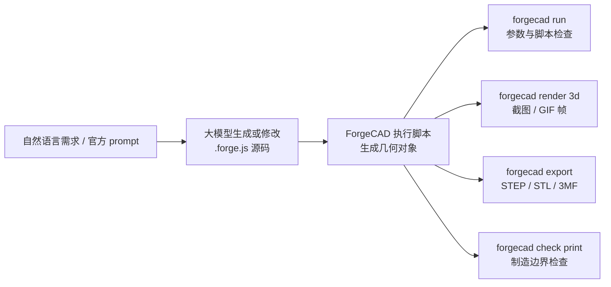

# Reproduction of ForgeCAD official 3D printer, keyboard, and dexterous hand cases: From benchmark GIF to parametric assembly

This chapter reproduction`3dprinter-gpt52codex` the official benchmark entries in the ForgeCAD public kit, and adds cases of the easily identifiable keyboard and the official movable dexterous hand from the video. The official 3D printer discloses the README table, prompt, and GIF results, while no corresponding source code is released from the public kit and assets repositories; the dexterous hand provides executable examples`examples/mechanical/5-finger-robot-hand.forge.js`. This chapter integrates the officially published animated GIFs, local rendering, and executable scripts into a single reproduction chain.


Figure 1: Official benchmark asset `3dprinter-gpt52codex-2026-02-13-14-36-06-v2.gif`. The source is the LLM Benchmarks table in [KoStard/forgecad-public-kit](https://github.com/KoStard/forgecad-public-kit)README, and the GIF file is hosted at [KoStard/ForgeCAD-assets](https://github.com/KoStard/ForgeCAD-assets).

## Why this chapter replaces the simple CAD bracket

The previous small bracket can illustrate the basic commands of ForgeCAD, but there is a significant difference in visual effect compared to the “complex assembly” described in the official documentation. The 3D printer example is more suitable for inclusion in the main README: it includes a gantry frame, a heating bed, X/Y/Z motion components, a print head, belts, wires, a material tray, and a control box. Readers can immediately understand that this is a complete mechatronic assembly, not just individual small parts. The keyboard in the video also serves as a second example: although it is not a robotic mechanism, it demonstrates ForgeCAD’s ability to represent dense repetitive structures, key arrays, housing angles, and local accent colors.

This is also closer to the abilities that robot tutorials should emphasize: instead of just creating a beautiful shell, the structural relationships are written as editable parameters. The print head X position, hot bed Y position, gantry Z height, and build volume dimensions are all written in the script parameters, allowing repeated modification and verification using the same source code later.

## Official Entry Verification

| Field | Content |
| --- | --- |
| Official Repository | `KoStard/forgecad-public-kit` |
| Benchmark Name | `3dprinter-gpt52codex` |
| Time and Version | `2026-02-13 14-36-06 · v2` |
| Official Prompt | `Make a detailed home 3D printer, showing the internal details of how it should work. Add some params for controlling positions, etc.` |
| Official GIF | `https://raw.githubusercontent.com/KoStard/ForgeCAD-assets/main/benchmarks/3dprinter-gpt52codex-2026-02-13-14-36-06-v2.gif` |
| Source Code Status | The public kit does not have a corresponding `.forge.js` available publicly. This chapter uses a local clone script to demonstrate the operational process. |

The review command is as follows:

```powershell
git clone https://github.com/KoStard/forgecad-public-kit.git ..\forgecad-public-kit
git clone https://github.com/KoStard/ForgeCAD-assets.git ..\ForgeCAD-assets

rg -n "3dprinter-gpt52codex|Make a detailed home 3D printer|ForgeCADBenchmark" ..\forgecad-public-kit\README.md
rg --files ..\forgecad-public-kit | rg -i "3dprinter|gpt52|version_2|forge\.js$"
rg --files ..\ForgeCAD-assets | rg -i "3dprinter|gpt52"
```

The machine's conclusion is: The README of the public kit contains an official table row, and ForgeCAD-assets has a GIF. No public 3D printer `.forge.js` source files were found.

## Local Clone Files

The reproduction-ready assets retained in this chapter are as follows:

| File | Purpose |
| --- | --- |
| [forgecad_3d_printer_demo.forge.js](../../../21-机械臂和机器人设计/03ForgeCAD视觉逆向工程入门/forgecad_3d_printer_demo.forge.js) | Local-executable ForgeCAD 3D printer replication script |
| [forgecad_keyboard_demo.forge.js](../../../21-机械臂和机器人设计/03ForgeCAD视觉逆向工程入门/forgecad_keyboard_demo.forge.js) | Local-executable ForgeCAD keyboard replication script |
| [forgecad_robot_hand_publickit.forge.js](../../../21-机械臂和机器人设计/03ForgeCAD视觉逆向工程入门/forgecad_robot_hand_publickit.forge.js) | Official 5-finger dexterous hand example from public kit |
| [assets/official_3dprinter_gpt52codex.gif](../../../21-机械臂和机器人设计/03ForgeCAD视觉逆向工程入门/assets/official_3dprinter_gpt52codex.gif) | Benchmark GIF saved from the official assets repository |
| [assets/official_robot_hand_v2.gif](../../../21-机械臂和机器人设计/03ForgeCAD视觉逆向工程入门/assets/official_robot_hand_v2.gif) | Official movable dexterous hand GIF at the top of the ForgeCAD public kit README |
| [assets/official_robot_hand_gpt52codex.gif](../../../21-机械臂和机器人设计/03ForgeCAD视觉逆向工程入门/assets/official_robot_hand_gpt52codex.gif) | `robot-hand-gpt52codex` Benchmark GIF |
| [assets/official_3dprinter_gpt52codex_frame.png](../../../21-机械臂和机器人设计/03ForgeCAD视觉逆向工程入门/assets/official_3dprinter_gpt52codex_frame.png) | Static preview frame extracted from the official GIF for README |
| [assets/forgecad_3d_printer_iso.png](../../../21-机械臂和机器人设计/03ForgeCAD视觉逆向工程入门/assets/forgecad_3d_printer_iso.png) | Isometric rendering of local replicated model |
| [assets/forgecad_3d_printer_front.png](../../../21-机械臂和机器人设计/03ForgeCAD视觉逆向工程入门/assets/forgecad_3d_printer_front.png) | Frontal rendering of local replicated model |
| [assets/forgecad_3d_printer_top.png](../../../21-机械臂和机器人设计/03ForgeCAD视觉逆向工程入门/assets/forgecad_3d_printer_top.png) | Top-down rendering of local replicated model |
| [assets/forgecad_keyboard_iso.png](../../../21-机械臂和机器人设计/03ForgeCAD视觉逆向工程入门/assets/forgecad_keyboard_iso.png) | Isometric rendering of local replicated keyboard |
| [assets/forgecad_keyboard_low_angle.png](../../../21-机械臂和机器人设计/03ForgeCAD视觉逆向工程入门/assets/forgecad_keyboard_low_angle.png) | Low-angle rendering of local replicated keyboard |
| [assets/forgecad_robot_hand_param_sweep.gif](../../../21-机械臂和机器人设计/03ForgeCAD视觉逆向工程入门/assets/forgecad_robot_hand_param_sweep.gif) | GIF showing the action of a dexterous hand rendered and synthesized with 4 sets of parameters |
| [outputs/forgecad_3d_printer_demo.step](../../../21-机械臂和机器人设计/03ForgeCAD视觉逆向工程入门/outputs/forgecad_3d_printer_demo.step) | Precise CAD exchange file |
| [outputs/forgecad_3d_printer_demo.stl](../../../21-机械臂和机器人设计/03ForgeCAD视觉逆向工程入门/outputs/forgecad_3d_printer_demo.stl) | Mesh export, suitable for preview or slicing inspection |
| [outputs/forgecad_3d_printer_demo.3mf](../../../21-机械臂和机器人设计/03ForgeCAD视觉逆向工程入门/outputs/forgecad_3d_printer_demo.3mf) | Common container format for 3D printing workflows |
| [outputs/forgecad_keyboard_demo.step](../../../21-机械臂和机器人设计/03ForgeCAD视觉逆向工程入门/outputs/forgecad_keyboard_demo.step) | Precise CAD exchange file for keyboard |
| [outputs/forgecad_keyboard_demo.stl](../../../21-机械臂和机器人设计/03ForgeCAD视觉逆向工程入门/outputs/forgecad_keyboard_demo.stl) | STL export for keyboard |
| [outputs/forgecad_keyboard_demo.3mf](../../../21-机械臂和机器人设计/03ForgeCAD视觉逆向工程入门/outputs/forgecad_keyboard_demo.3mf) | 3MF export for keyboard |
| [outputs/forgecad_robot_hand_publickit.step](../../../21-机械臂和机器人设计/03ForgeCAD视觉逆向工程入门/outputs/forgecad_robot_hand_publickit.step) | STEP export of the official dexterous hand |
| [outputs/forgecad_robot_hand_publickit.stl](../../../21-机械臂和机器人设计/03ForgeCAD视觉逆向工程入门/outputs/forgecad_robot_hand_publickit.stl) | Official dexterous hand STL export |
| [outputs/forgecad_robot_hand_publickit.3mf](../../../21-机械臂和机器人设计/03ForgeCAD视觉逆向工程入门/outputs/forgecad_robot_hand_publickit.3mf) | Official dexterous hand 3MF export |


Figure 2: The 3D printer assembly generated by this chapter's replication script. The current version has aligned the main visual features with the official GIF: dark background, black frame, silver guide rails, blue heating bed, orange heating plate, cyan build volume box, red material tray in the upper right, and front control panel. It is not a line-by-line reproduction of the official source code, but an executable teaching version based on the same prompt. For pixel-level consistency, the official `.forge.js`, camera, and scene configuration must be available.

## Environment Selection

This case does not require creating a new micromamba environment. ForgeCAD uses the Node.js/npm CLI, and local Chrome is used for rendering PNGs. It does not involve PyTorch, CUDA, or robot simulation dependencies, and does not consume GPU memory.

This machine’s reproduction environment:

| Item | Local Settings |
| --- | --- |
| System | Windows PowerShell |
| Node.js | `22.16.0` |
| npm | `10.9.2` |
| ForgeCAD | `npx --yes forgecad@0.9.14` |
| Chrome | `C:\Program Files\Google\Chrome\Application\chrome.exe` |
| GPU | Not required; CLI modeling and export are primarily performed using the CPU, while rendering is done by Chrome/WebGL |

Installation check:

```powershell
node --version
npm --version
npx --yes forgecad@0.9.14 --version
```

## Modeling Breakdown

The essence of these cases is AI-assisted CAD, rather than "images directly becoming CAD files". The large model is responsible for converting natural language requirements, reference image observations, and engineering structures into `.forge.js` source code. Then, the ForgeCAD CLI executes this JavaScript/TypeScript script, leveraging its geometric modeling, Boolean, assembly, rendering, and export capabilities to generate viewable and exportable CAD geometry. In other words, `.forge.js` is the CAD source code, not the final CAD file; the ultimately exchangeable geometric results are still in files such as STEP, STL, and 3MF.

A more accurate process is:



The local replication script breaks down the real functional modules of the 3D printer into multiple objects. All parts are not combined into a single `union`, as the readability of the official GIF depends heavily on local colors: the black frame, silver guide rails, blue heating bed, orange heating plate, cyan building volume frame, and red material trays all require separate retention of their materials.

| Module | Script Object | Description |
| --- | --- | --- |
| Gantry Frame | `frame` | Columns, upper and lower beams, and foot pads; represents the CoreXY/box frame profile |
| Heat Bed | `orange heater plate` / `blue print bed` / `bed carriage and rails` | Blue build plate, orange heating plate, Y-axis guide, and bed carriage |
| Z-Axis | `z motion system` | Z-axis light shaft and screw rod |
| Build Volume | `cyan build volume cage` | Transparent printing space simulated with cyan fine borders as in the official diagram |
| X-Axis and Print Head | `x gantry` / `print head` / `belts` | X-beam, guide, pulley, fan, hot end, nozzle, and heat sink |
| Material Tray and Consumables | `red spool` / `filament` | Red material tray in the upper right corner, bracket, and simplified consumable path |
| Control and Details | `front electronics` / `small details` | Front control box, screen, knob, and local guide elements |

Key parameters are concentrated at the beginning of the file:

```javascript
const headX = Param.number("Print Head X", 22, { min: -70, max: 70, unit: "mm" });
const bedY = Param.number("Print Bed Y", 12, { min: -45, max: 45, unit: "mm" });
const gantryZ = Param.number("Gantry Z", 128, { min: 70, max: 175, unit: "mm" });
const buildVolumeW = Param.number("Build Volume Width", 118, { min: 80, max: 150, unit: "mm" });
const buildVolumeD = Param.number("Build Volume Depth", 105, { min: 80, max: 135, unit: "mm" });
```

These parameters correspond to "params for controlling positions" in the official prompt. Readers of the tutorial can first modify only these values and observe how the print head, hot bed, and build volume change.

## Run script

Enter the chapter directory:

```powershell
cd 21-机械臂和机器人设计/03ForgeCAD视觉逆向工程入门
```

Run ForgeCAD script:

```powershell
npx --yes forgecad@0.9.14 run forgecad_3d_printer_demo.forge.js
```

Local machine results:

```text
Objects: 13
Verifications: 5 pass, 0 fail
Params: Frame Width=180, Frame Depth=150, Frame Height=210,
        Print Head X=22, Print Bed Y=12, Gantry Z=128,
        Build Volume Width=118, Build Volume Depth=105
Time: 563ms
```

The 5 verifications here include the overall width, depth, height, gantry height, and whether the print head is still inside the frame. These are not mechanical strength checks, but rather to prevent the model from being significantly distorted after parameter changes.

## Multi-perspective Rendering

Rendering requires a Chrome path. The local command is as follows:

```powershell
$chrome = "C:\Program Files\Google\Chrome\Application\chrome.exe"

npx --yes forgecad@0.9.14 render 3d forgecad_3d_printer_demo.forge.js `
  --output assets/forgecad_3d_printer_iso.png `
  --camera 55:20 `
  --background "#242424" `
  --edges thin `
  --render-style classic `
  --chrome-path $chrome `
  --fresh-server `
  --port 5180

npx --yes forgecad@0.9.14 render 3d forgecad_3d_printer_demo.forge.js `
  --output assets/forgecad_3d_printer_front.png `
  --camera 70:18 `
  --background "#242424" `
  --edges thin `
  --render-style classic `
  --chrome-path $chrome `
  --fresh-server `
  --port 5181

npx --yes forgecad@0.9.14 render 3d forgecad_3d_printer_demo.forge.js `
  --output assets/forgecad_3d_printer_top.png `
  --camera 35:58 `
  --background "#242424" `
  --edges thin `
  --render-style classic `
  --chrome-path $chrome `
  --fresh-server `
  --port 5182
```

If you want to closely mimic the appearance of the official GIF, the key lies in these three points: using a dark background `--background "#242424"`, using `--render-style classic` to maintain a more rigid CAD view texture, and using `--camera 55:20` to include the red tray in the upper right corner and the front control box in the frame. The official sources do not disclose the original `.forge.js`, viewport scene, camera JSON, or material states, so it is impossible to ensure pixel-perfect consistency; for perfect alignment, you will need to obtain the source scripts from the official benchmark and the original viewport configuration.


Figure 3 shows the front view, which clearly displays the print head, hot bed, Z-axis optical axis, and control box.


Figure 4 shows a high top view that allows for the inspection of the positions of the rack, tray, belt, and hot bed.

The rendering output of the three images on this machine reports the same geometric boundary:

```text
Size:   224.0 x 224.0 x 229.0 mm
Volume: 449408.0 mm3
Bounds: [-102.0,-108.0,-3.0] -> [122.0,116.0,226.0]
```

## Second case: Keyboard in the video

The keyboard in the video is well-suited to be added in the latter part of this chapter. Its focus is different from that of 3D printers: 3D printers emphasize complex assemblies and moving parts, while the keyboard focuses on regular arrays, shell tilt angles, specific accent colors, and the organization of numerous repeated parts. You can consider it as an "product appearance + parametric array" exercise for ForgeCAD.

The keyboard example uses a reproductionable modeling script as the main component: [forgecad_keyboard_demo.forge.js](../../../21-机械臂和机器人设计/03ForgeCAD视觉逆向工程入门/forgecad_keyboard_demo.forge.js). The video footage is used to help everyone observe the appearance features, while the results in the tutorial are generated by a local script. The script retains these adjustable parameters:

```javascript
const cols = Param.number("Columns", 12, { min: 8, max: 14, unit: "keys" });
const keyPitch = Param.number("Key Pitch", 15, { min: 12, max: 18, unit: "mm" });
const caseAngle = Param.number("Case Angle", 6, { min: 0, max: 12, unit: "deg" });
const knobOffset = Param.number("Knob Offset", 0, { min: -18, max: 18, unit: "mm" });
const accentKeyX = Param.number("Accent Key X", 2, { min: -4, max: 4, unit: "keys" });
```

Run keyboard model:

```powershell
npx --yes forgecad@0.9.14 run forgecad_keyboard_demo.forge.js
```

Machine result:

```text
Objects: 5
Verifications: 4 pass, 0 fail
Params: Columns=12, Key Pitch=15, Case Angle=6, Knob Offset=0, Accent Key X=2
Time: 3127ms
```

Rendering command:

```powershell
$chrome = "C:\Program Files\Google\Chrome\Application\chrome.exe"

npx --yes forgecad@0.9.14 render 3d forgecad_keyboard_demo.forge.js `
  --output assets/forgecad_keyboard_iso.png `
  --camera 48:31 `
  --edges thin `
  --render-style studio `
  --chrome-path $chrome `
  --fresh-server `
  --port 5184

npx --yes forgecad@0.9.14 render 3d forgecad_keyboard_demo.forge.js `
  --output assets/forgecad_keyboard_low_angle.png `
  --camera 35:16 `
  --edges thin `
  --render-style studio `
  --chrome-path $chrome `
  --fresh-server `
  --port 5185
```


Figure 5: Isometric diagram of the keyboard. Focus on the key array, right-side knob, dark function key area, and red dot keys.


Figure 6: From a low angle, the thickness of the shell and the slightly raised keyboard angle are more easily visible.

Geometric boundaries of keyboard rendering output:

```text
Size:   214.0 x 119.9 x 33.9 mm
Volume: 327930.0 mm3
Bounds: [-107.0,-58.2,-6.1] -> [107.0,61.7,27.8]
```

## Third case: Official dexterous hand

There is also a attractive movable dexterous hand GIF at the top of the ForgeCAD public kit. This case is more suitable for robotics than a keyboard, as it combines parameters, links, hinges, tendons and cables, and assembly objects all in the same `.forge.js`. We simply reuse the official example:

```powershell
Copy-Item ..\forgecad-public-kit\examples\mechanical\5-finger-robot-hand.forge.js `
  .\forgecad_robot_hand_publickit.forge.js
npx --yes forgecad@0.9.14 run forgecad_robot_hand_publickit.forge.js
```

Machine result:

```text
Objects: 76
Params: Scale=1, Finger Curl=40, Thumb Curl=35, Finger Spread=8
Time: 530ms
```

The core of "Active" is not the video player, but the parameter-driven posture. The following 4 frames modify `Finger Curl`, `Thumb Curl`, and `Finger Spread` respectively, and then a local GIF is synthesized:

```powershell
npx --yes forgecad@0.9.14 render 3d forgecad_robot_hand_publickit.forge.js `
  --param "Finger Curl=45" `
  --param "Thumb Curl=38" `
  --param "Finger Spread=12" `
  --output assets/forgecad_robot_hand_02.png `
  --camera 42:28 `
  --background "#101318" `
  --edges thin `
  --render-style classic `
  --chrome-path $chrome
```


Figure 7: Parameter actions rendered using the official dexterous hand in local mode. You can think of it as “low-cost animation”: each frame is a real rendering of the same CAD script under different parameters, rather than manually cutting video.

The official animated images are also saved in this chapter for easy comparison:


## Export CAD and print files

Export STEP:

```powershell
npx --yes forgecad@0.9.14 export step forgecad_3d_printer_demo.forge.js `
  --output outputs/forgecad_3d_printer_demo.step
```

Export to STL:

```powershell
npx --yes forgecad@0.9.14 export stl forgecad_3d_printer_demo.forge.js `
  --output outputs/forgecad_3d_printer_demo.stl
```

Export 3MF:

```powershell
npx --yes forgecad@0.9.14 export 3mf forgecad_3d_printer_demo.forge.js `
  --output outputs/forgecad_3d_printer_demo.3mf
```

For the keyboard case, use the same command. Just replace the script name and output name with `forgecad_keyboard_demo`:

```powershell
npx --yes forgecad@0.9.14 export step forgecad_keyboard_demo.forge.js `
  --output outputs/forgecad_keyboard_demo.step

npx --yes forgecad@0.9.14 export stl forgecad_keyboard_demo.forge.js `
  --output outputs/forgecad_keyboard_demo.stl

npx --yes forgecad@0.9.14 export 3mf forgecad_keyboard_demo.forge.js `
  --output outputs/forgecad_keyboard_demo.3mf
```

The dexterous hand can also export:

```powershell
npx --yes forgecad@0.9.14 export step forgecad_robot_hand_publickit.forge.js `
  --output outputs/forgecad_robot_hand_publickit.step
npx --yes forgecad@0.9.14 export stl forgecad_robot_hand_publickit.forge.js `
  --output outputs/forgecad_robot_hand_publickit.stl
npx --yes forgecad@0.9.14 export 3mf forgecad_robot_hand_publickit.forge.js `
  --output outputs/forgecad_robot_hand_publickit.3mf
```

Output file size of this machine:

| File | Size |
| --- | ---: |
| `forgecad_3d_printer_demo.step` | 1.1 MB |
| `forgecad_3d_printer_demo.stl` | 256 KB |
| `forgecad_3d_printer_demo.3mf` | 54 KB |
| `forgecad_keyboard_demo.step` | 3.2 MB |
| `forgecad_keyboard_demo.stl` | 153 KB |
| `forgecad_keyboard_demo.3mf` | 39 KB |
| `forgecad_robot_hand_publickit.step` | 3.7 MB |
| `forgecad_robot_hand_publickit.stl` | 717 KB |
| `forgecad_robot_hand_publickit.3mf` | 261 KB |

STEP is more suitable for importing into CAD software for further editing; STL/3MF is better suited for slicing software for previewing. This model is a teaching assembly, not an integrated part that can be printed directly.

## How to understand the printing inspection results

Command:

```powershell
npx --yes forgecad@0.9.14 check print forgecad_3d_printer_demo.forge.js
```

The machine result is `FAIL`. This is not a failure of the script execution, but rather the checker has indicated that the assembly display model is not suitable for direct FDM printing as a single unit:

```text
Scene: 13 shape(s), 5128 triangle(s), bbox 224.0 x 224.0 x 229.0mm
PASS print.script.verifications: 5 script verification(s) passed.
FAIL print.geometry.collisions: 14 positive-volume collision(s) found.
FAIL print.fdm.wall-thickness: 1 object(s) have sampled wall area below 1.2mm.
WARN print.fdm.overhangs: 8 object(s) exceed 45deg unsupported overhang budget.
PASS print.mesh.validity: Meshes are closed and manifold at the sampled tolerance.
```

This is actually a teaching point: The official GIF shows the complex assembly capabilities, and it cannot be equated with “the entire printer can be printed at once”. If the goal is manufacturing, the frame, hot bed, guide rail supports, and print head housing need to be broken down into individual parts, and then wall thicknesses, chamfers, screw holes, tolerances, and support strategies must be added to each part.

The keyboard case will also receive a similar assembly inspection result:

```text
Scene: 5 shape(s), 3056 triangle(s), bbox 214.0 x 119.9 x 33.9mm
PASS print.script.verifications: 4 script verification(s) passed.
FAIL print.geometry.collisions: 4 positive-volume collision(s) found.
PASS print.mesh.validity: Meshes are closed and manifold at the sampled tolerance.
FAIL print.fdm.wall-thickness: 1 object(s) have sampled wall area below 1.2mm.
```

The collisions here mainly occur when the keycap, casing, and function area are treated as a single assembly for inspection. If the real keyboard casing needs to be printed, the keycap, bottom shell, top cover, knob, and interface guard must be separated into individual parts.

## Resource Usage and Time Consumption

This machine uses PowerShell to sample the Working Set of the `cmd -> npm/npx -> node/chrome` child process, and obtains an approximate peak value:

| Step | Time | Peak Memory | Description |
| --- | ---: | ---: | --- |
| `forgecad run` | 4.67 s | 262 MB | Total CLI cold start time; ForgeCAD reports a modeling time of approximately 0.5 s |
| Single `render 3d` | 7.77 s | 826 MB | Includes Chrome rendering service cold start |
| `export stl` | 5.07 s | Not sampled individually | Outputs 256 KB STL |
| `export 3mf` | 5.10 s | Not sampled individually | Outputs 54 KB 3MF |
| `export step` | 19.41 s | Not sampled individually | Precise STEP export is slower, outputting 1.1 MB |
| `check print` | 5.53 s | Not sampled individually | Mesh inspection involves approximately 5128 triangles |
| Keyboard `run` | Approximately 9.8 s | Not sampled individually | ForgeCAD reports a modeling time of approximately 3.1 s |
| Single keyboard `render 3d` | Approximately 15 s | Not sampled individually | More key presses, with slightly slower cold start rendering |
| Keyboard `export stl` | 10.14 s | Not sampled individually | Outputs 153 KB STL |
| Keyboard `export 3mf` | 8.13 s | Not sampled individually | Outputs 39 KB 3MF |
| Keyboard `export step` | 30.81 s | Not sampled individually | Precise STEP export: 3.2 MB |
| Dexterous hand `export stl` | 3.94 s | Not sampled individually | Outputs 717 KB STL |
| Dexterous hand `export 3mf` | 4.23 s | Not sampled individually | Outputs 261 KB 3MF |
| Dexterous hand `export step` | 32.36 s | Not sampled individually | Precise STEP export: 3.7 MB |

This level of manipulation is very light for ordinary laptops, and a 6GB GPU is not required. What truly consumes resources are more complex surfaces, Boolean operations, ultra-high-resolution meshes, or browser-side animation rendering.

## Reproduction Boundary

### 1. The relationship between official assets and local replicas

This chapter uses two types of assets. The first type are official public assets, such as `3dprinter-gpt52codex` GIFs, `Robot Hand V2` GIFs, and the dexterous hand source code in the public kit; these are used to help everyone align with the official presentation. The second type are local teaching replication scripts, such as `forgecad_3d_printer_demo.forge.js` and `forgecad_keyboard_demo.forge.js`; these are used to enable people to actually complete the entire workflow from "requirement to source code, source code to CAD geometry, geometry to rendering, and export".

Among them, the 3D printer benchmark currently provides GIFs and prompts, but no corresponding `.forge.js` is available. Therefore, this chapter presents a teaching version that aligns with the official visual features; the dexterous hand examples are directly taken from the official source code of the public kit.

### 2. How to let a large model generate a CAD-like model

It is more recommended to describe the requirements as "structured engineering tasks", rather than just saying "generate a beautiful 3D printer". For example:

```text
请用 ForgeCAD 编写一个参数化 CoreXY 风格 3D 打印机 .forge.js。
要求包含：黑色方框机架、蓝色热床、橙色加热板、银色 Z 轴导轨、
X 轴横梁、打印头、皮带、右上角红色料盘、前方控制盒和青色构建体积框。
暴露参数：Print Head X、Print Bed Y、Gantry Z、Build Volume Width、Build Volume Depth。
返回对象要按模块命名，便于 render 时保留材质颜色。
最后添加 bounding box 和参数范围验证。
```

After the large model generates a preliminary draft, do not treat the result as the final CAD file. The correct iteration method is: run `forgecad run` to check if the script is executable; render a PNG to verify the scale and perspective; export STEP/STL/3MF to check the exchange files; if necessary, report the error messages or screenshots to the large model so it can continue modifying `.forge.js`.

### 3. Does this process require micromamba?

No main line is required for this chapter. The ForgeCAD case only relies on Node.js/npm and Chrome rendering, and does not involve PyTorch, CUDA, or robot simulation environments. Only when combining ForgeCAD with Python CAD, simulation training, and robot learning algorithms into a single experimental project will the use of micromamba or conda environment isolation be considered.

### 4. Can these models be directly used in real manufacturing?

They cannot be directly used for the production of real machines. They are teaching-level parametric assembly tools used to demonstrate AI-assisted CAD, code-first CAD, complex structure breakdown, CLI verification, and file export. For real mechanical design, efforts must continue in terms of strength, stiffness, transmission, tolerance, procurement parts, assembly, material, and safety checks.

## References

- ForgeCAD public kit: https://github.com/KoStard/forgecad-public-kit
- ForgeCAD assets: https://github.com/KoStard/ForgeCAD-assets
- ForgeCAD documents: https://forgecad.io/docs
- ForgeCAD npm package: https://www.npmjs.com/package/forgecad
