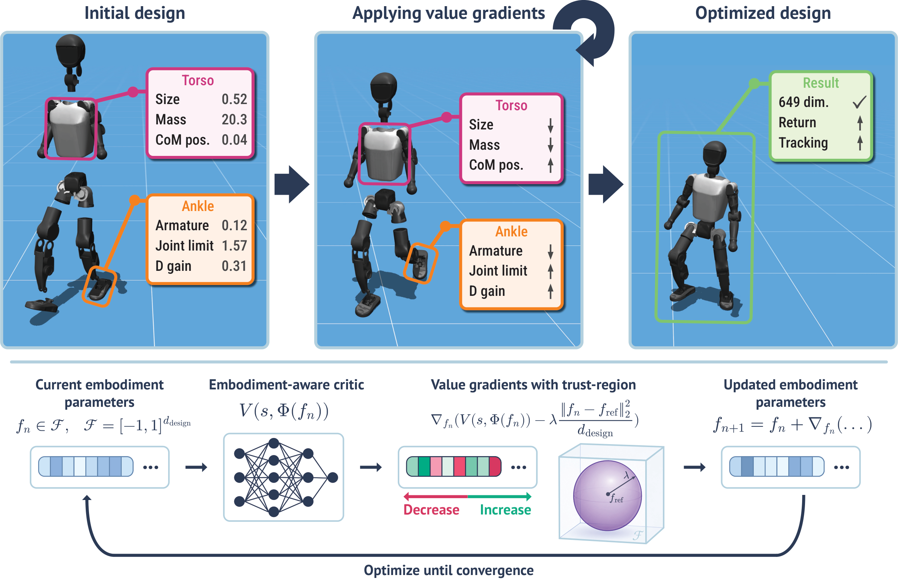
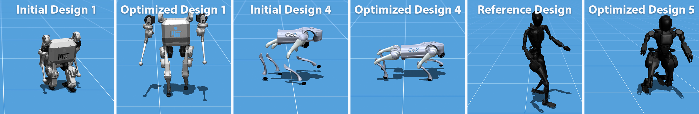
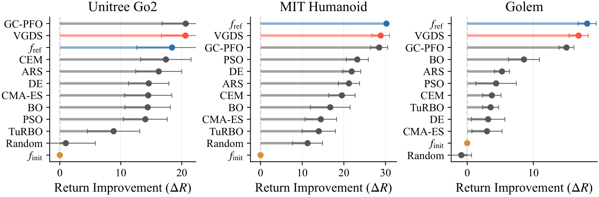
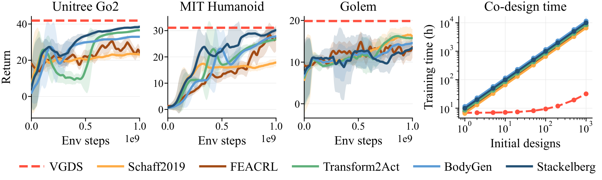
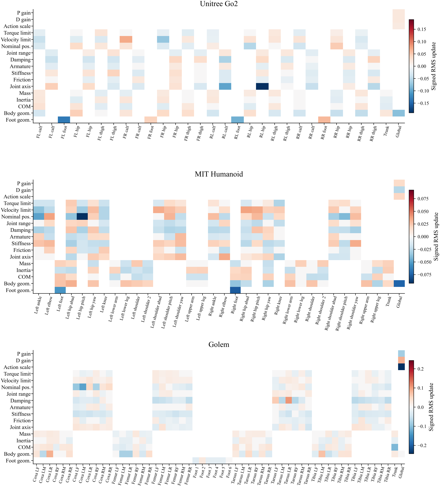

<!-- Generated by the offline translation workflow.
Source: 21-机械臂和机器人设计/04-Shape-Your-Body价值梯度机器人设计导读/README.md
Source SHA-256: 6a859f8f01a4d840b57716f039f426f373fe6a89bedabcce9b8b0c9463b92c03
Model: tencent/Hy-MT2-1.8B-GGUF:Q4_K_M
Review machine-translated technical claims before relying on them.
-->
# Shape Your Body: Optimizing Robot Body Design with Value Gradients

> Introduction to this article **Shape Your Body: Value Gradients for Multi-Embodiment Robot Design**. This paper is from the Technical University of Darmstadt, Robotics Institute Germany, DFKI, and hessian.AI. The authors are Nico Bohlinger and Jan Peters. The arXiv ID of the paper is `2606.00702v1`, and it was submitted on May 30, 2026. The project page address is [nico-bohlinger.github.io/shape-your-body](https://nico-bohlinger.github.io/shape-your-body/).

## 1. Let's start with the conclusion: Why it deserves to be included in the robot design section

"Shape Your Body" explores a very imaginative and engineering-related issue:

```text
能不能像优化神经网络参数一样，用梯度优化机器人身体参数？
```

Traditional robot design typically involves manually designing the mechanical structure and then training a policy for that structure. Learning-based co-design optimizes both the body and the controller, but the common approach is costly: the outer layer searches for a robot body, while the inner layer re-trains or adapts the controller for each candidate body. As long as the design space is slightly larger—such as in terms of mass, inertia, geometric dimensions, joint limits, actuator torque, maximum speed, and PD gain—this cycle becomes very slow.

The idea of Shape Your Body is to spread out the design costs:

```text
先训练一个多具身 policy + value function
    ↓
冻结 policy 和 critic
    ↓
把 critic 当成可微分的设计代理模型
    ↓
对机器人身体参数求 value gradient
    ↓
用梯度更新新的机器人设计
```

The paper refers to this design search method as **Value-Gradient Design Search (VGDS)**. In a nutshell:

First, use multiple robots to perform reinforcement learning to learn “which body is easier to control by the current policy”, and then optimize the new robot design based on the gradient of body parameters using a value function.

It should be placed in `21-机械臂和机器人设计`, rather than the VLA or world model section. The reason is that this paper focuses on **robot embodiment / morphology / continuous design parameters**, not perception, action generation, or video prediction. Its relationship with Build123d, Text-to-CAD, and ForgeCAD is as follows: the first three are more oriented toward “how to generate or edit geometry”, while Shape Your Body is more oriented toward “using learned control values to guide body parameters in reverse”.

## 2. Paper, Project Page, and Open Source Status

| Entry | Link | Current Status |
| :--- | :--- | :--- |
| Paper | [arXiv:2606.00702](https://arxiv.org/abs/2606.00702) / [HTML](https://arxiv.org/html/2606.00702v1) | Submitted on 2026-05-30 |
| Project Page | [Shape Your Body](https://nico-bohlinger.github.io/shape-your-body/) | Official project page, including interactive demo, method diagrams, robot collection, and result charts |
| PDF | [TU Darmstadt PDF](https://www.ias.informatik.tu-darmstadt.de/uploads/Team/NicoBohlinger/shape_your_body.pdf) | The official PDF referenced by the paper on the project page |
| Video | [YouTube](https://www.youtube.com/watch?v=_SHSWUSQZvg) | Video linked from the project page |
| Code | The current display on the project page is `Code (soon)` | No public code repository entry has been seen yet |

As of July 18, 2026, the status verified by this tutorial is as follows: the project page and paper are published, and the interactive web demo allows users to experience different robots and design search trajectories. However, the official code entry remains marked as `Code (soon)`. Therefore, this chapter is not written as a step-by-step reproduction guide for the training tutorial, but rather as a method introduction, illustrations, and preparation instructions for reproduction. If the code is made available later, environment configuration and minimal reproduction experiments can be added accordingly.

## 3. Overview: Train the value function first, then shape it with value gradients



**Figure 1 Overview of the Shape Your Body method.** First, train the embodiment-aware policy and value function on a large number of robot body configurations. After training, freeze the network, compute the value gradient for the continuous design vectors, and update the robot body parameters under the trust region constraints.
Source: [ Shape Your Body official project page ](https://nico-bohlinger.github.io/shape-your-body/).

This image can be divided into two sections.

The first paragraph is **multi-embodiment RL training**. Each environment samples a robot design at episode reset, and this design remains unchanged throughout the episode. The policy must learn to perform speed tracking tasks under different body parameters, and the critic must learn to evaluate how much reward can be obtained in a “certain state + certain body design” scenario.

The second paragraph is **design search**. After training, the policy is not retrained for each new design. The system freezes the policy and critic, representing the robot design as a normalized design vector `f`, and converts it into real body parameters through a differentiable mapping `Φ(f)`. Then, the frozen critic computes the gradient with respect to the design vector:

```text
design vector f
    -> physical embodiment Φ(f)
    -> critic value V(s, Φ(f))
    -> ∇f V
    -> update f
```

This is the core of “designing robots using gradients”. The gradients come not from real hardware or geometric losses in CAD software, but from the trained value function. They tell the optimizer: under the current state distribution and the current frozen policy, which body parameter changes are expected to improve task performance.

## 4. Training set: 50 robots, up to 1177 continuous design parameters



**Figure 2: Multi-embodiment training dataset.** The official project page shows that the largest training dataset contains 50 robots: 15 quadrupeds, 31 bipeds/humanoids, and 4 six-legged robots. Each robot has 190 to 1177 continuous design parameters.
Source: [Shape Your Body official project page ](https://nico-bohlinger.github.io/shape-your-body/).

The training setup for the paper does not involve adjusting leg length only in a small toy robot, but covers a wide range of morphologies. The largest training set includes:

- `15` quadrupeds;
- `31` bipeds / humanoids;
- `4` hexapods;
- Each robot has `190` to `1177` continuous design parameters.

These parameters include not only geometric dimensions, but also physical and control parameters that are closer to controlling performance:

| Parameter Category | Example | Why It Affects Control |
| :--- | :--- | :--- |
| Geometric Parameters | link geometry, foot size, joint origins | Modify center of mass, support surface, leg swing range, and collision relationships |
| Mass and Inertia | body mass, inertia, center-of-mass offset | Affect dynamic stability, acceleration response, and energy consumption |
| Joint Attributes | joint axis, joint range, damping, friction | Determine motion degrees of freedom, damping, and achievable poses |
| Actuator Attributes | actuator torque limits, velocity limits | Determine maximum output torque and speed |
| Control Parameters | PD gains, action scale | Affect low-level tracking, stability, and action amplification |

This is also why it is suitable to be placed alongside robot design tutorials. CAD only tells us “what the shape is”, URDF/MJCF only tells the simulation engine “what the body parameters are”, while Shape Your Body attempts to answer: how do these body parameters affect the long-term returns of a trained policy.

## 5. URMA policy and direct-design critic

Shape Your Body is based on a multi-embodiment policy architecture like URMA. The goal of URMA is to handle different robot topologies: some robots have 12 joints, others have over 20 joints, some are quadrupeds, some are human-shaped, and some are hexapods. It cannot simply combine all joint states into a fixed-length vector.

The URMA approach is to split the `observation` into two parts:

```text
general observations
    + per-joint observations
    + per-joint description vectors
```

Each joint has its own observation and description. The description encodes static body information, such as joint axes, relative positions, joint limits, PD gains, mass of adjacent bodies, inertia, and geometric parameters. The network encodes each joint separately, and then uses attention/aggregation to combine the variable number of joint latents into a fixed-dimensional representation.

The key changes in Shape Your Body are in critic. The paper replaces the standard URMA critic with **direct-design URMA critic**, so that design parameters directly affect value prediction more effectively. Intuitively, it means:

```text
普通 embodiment-aware critic:
    身体描述主要参与 attention key，设计信息影响不够直接。

direct-design critic:
    observation 和 description 一起进入 value-side encoder，
    让 critic 对设计参数更敏感，
    从而给出更有用的 ∇design V。
```

This step is very important. VGDS relies on critic to compute the gradients of design parameters. If critic only roughly distinguishes robot types and cannot respond meaningfully to minor changes in foot size, joint range, actuator limits, and PD gains, then the value gradient will be noisy, and the design search will fail.

The paper also uses ensemble value heads, optimizing through the mean value of multiple critic heads, thereby reducing the risk of catastrophic design updates caused by individual value approximation errors.

## 6. VGDS: Value Gradient Search with Soft Trust Domain

The VGDS target provided on the project page can be written as:

```text
J_hat_lambda(f)
  = mean_m V_bar(s_m, Phi(f))
    - lambda * ||f - f_ref||^2 / d_design
```

Among them:

- `f` is the normalized design vector;
- `Φ(f)` is the design map that maps the normalized design vector to real physical parameters;
- `s_m` comes from a fixed state bank;
- `V_bar` is the average value prediction of the frozen critic ensemble;
- `f_ref` is the reference design, which can be a nominal URDF or an initial design;
- `lambda` controls how far the model is from the reference design;
- `d_design` is used to normalize the penalty strength in different design spaces.

Why is a trust region needed? Because the critic is not a physical truth; it is only relatively reliable near the training distribution. If the value is maximized without constraints, the optimizer may push the design to the boundaries—such as extreme mass, extreme geometric dimensions, or extreme actuator limits—making the critic believe that the reward is high, but actually causing failure during real-world deployment. The paper also mentions that maximizing the critic without constraints easily leads to the boundary of the design space, resulting in a decline in actual performance.

Therefore, VGDS does three things at each step:

1. Calculate the critic mean value on the state bank minibatch.
2. Compute the gradient for `f`, while adding a soft trust domain penalty for the reference design.
3. Take one step with Adam, and truncate the single-step update and the final design range.

Represented in pseudo-code:

```text
initialize f from a reference or perturbed design
for iter in 1..N:
    sample states from state bank
    objective = critic_value(states, Phi(f)) - trust_region_penalty(f, f_ref)
    grad = d objective / d f
    f = f + clipped_adam_step(grad)
    f = clip(f, valid_design_bounds)
return f
```

This is the fundamental difference between it and black-box optimization methods such as CMA-ES, PSO, and Bayesian Optimization. Black-box methods only focus on "what the design score is", while VGDS also uses gradient information about "where to move the design for better performance", thus having an advantage in high-dimensional continuous design spaces.

## 7. Single robot design: Comparison with the strong black box optimizer



**Figure 3: Single robot design results.** On target robots such as Unitree Go2, MIT Humanoid, and Golem, VGDS starts from a perturbed design, and the optimized return improvement is compared with strong black-box optimizers such as BO, CMA-ES, PSO, CEM, DE, ARS, TuRBO, and GC-PFO.
Source: [Shape Your Body official project page ](https://nico-bohlinger.github.io/shape-your-body/).

The first set of experiments is a single-robot design. The approach is as follows: first, train a policy and critic for a specific target robot, and then start from the perturbed design of this robot to restore or improve the design using different optimizers. Here, the nominal URDF is just a reference anchor for the trust region, not the design that must be restored ultimately.

It compares not a weak baseline, but a set of common high-dimensional optimization methods:

- Bayesian Optimization；
- CMA-ES；
- Particle Swarm Optimization；
- Cross-Entropy Method；
- Differential Evolution；
- Augmented Random Search；
- TuRBO；
- Gradient-Covariance Particle Filter Optimization。

The summary on the project page is: VGDS matches or outperforms strong surrogate-search baselines. This conclusion does not mean that "gradient design is always better than evolutionary algorithms"; rather, in such tasks, the analytical gradients of the trained critic can indeed provide a useful direction for the parameter search of high-dimensional robots.

## 8. Cost differences with RL-based co-design



**Figure 4: Comparison between VGDS and RL-based co-design.** For the RL co-design baseline, the policy must be retrained or adapted for each initial design; with VGDS, after just 7–9 hours of training, each new design requires only about 1–2 minutes of search.
Source: [Shape Your Body official project page](https://nico-bohlinger.github.io/shape-your-body/).

This figure represents the most important engineering aspect of Shape Your Body. Many co-design methods can also yield good designs, but the cost is that “each initial design requires a new round of policy training.” If the goal is to perform design searches for dozens or hundreds of robot variants, this cost is difficult to accept.

The calculation mode of VGDS is different:

```text
一次多具身 RL 训练：7-9 小时
    ↓
冻结 policy + critic
    ↓
每个新增设计：1-2 分钟 value-gradient search
```

This is the amortized robot design. The initial training is costly, but the learned value function can be reused repeatedly. This approach is more suitable for expanding capabilities, such as exploring many candidate robots, batch perturbation designs, and design sensitivity analysis, compared to "re-training the policy for each body."

Of course, this does not mean that the training cost disappears. It simply changes the training cost from "one payment per design" to "a large upfront cost followed by a spread out cost for many designs." If the distribution of target robots and the distribution of training data differ too much, the gradient of the frozen critic may be unreliable, and re-training or expanding the multi-embodiment training set is still necessary.

## 9. Cross-robot generalization: held-out robot and 50-robot training

Shape Your Body also tested more challenging settings: instead of performing perturbation recovery on the same robot, it held out target robots from the training set to see if multi-body critics could guide its design optimization.

The summary on the project page is: Models trained with the full 50-robot set can enable target robots such as Unitree Go2, MIT Humanoid, and Golem to exceed the nominal URDF. However, for six-legged robots like Golem, a hexapod-only model performs best. This may be because the full 50-robot set mainly consists of quadrupeds and bipeds/humanoids, and there are few six-legged samples.

This indicates that the generalization of the multi-body value function is not unconditional. It requires the training distribution to cover the target morphology. If the training set consists mostly of quadrupeds and human shapes, using it to optimize six-legged, snake-like, wheel-legged, or robotic arm structures may lead to overly extended extrapolation by the critic. In practical applications, one should ask:

- Is the topology of the target robot close to the training distribution?
- Is the range of design parameters within the coverage of the training curriculum?
- Can the high-value designs of the critic truly pass the rollout validation?
- Is the trust domain sufficient to restrict unreliable extrapolation?

## 10. Value Gradient Can Also Be Used for Design Diagnosis



**Figure 5: Analysis of Value Gradient Design.** The paper groups the differences between optimized design and reference design by body part and parameter type, forming a heat map to help engineers identify which body parameters have the greatest impact on returns.
Source: [Shape Your Body official project page ](https://nico-bohlinger.github.io/shape-your-body/).

Shape Your Body also has a very useful byproduct: value gradient. It not only produces an optimized design, but also explains "which parameters should engineers pay attention to".

The project page provides a few examples:

- The strong changes in MIT Humanoid focus on nominal joint positions, PD gains, and reduced foot size.
- The changes in Golem focus on reduced action scale, lower P gain, and higher D gain.
- Unitree Go2 has more physical characteristics: rear-leg joint axes, foot geometry, and front hip/calf actuator velocity limits.

This kind of analysis is very valuable for robot design. Because the final design produced by a high-dimensional optimizer may involve thousands of parameter variations, which is difficult for engineers to understand directly. By grouping `f* - f_ref` by body part and parameter type, we can return from "optimization results" to "design insights":

```text
不是只问：最终设计是什么？
还要问：优化器认为哪个身体部位、哪类参数限制了性能？
```

This makes VGDS not only an automatic search tool, but also a diagnostic tool for mechanical design and control parameter tuning.

## 11. Reproduction boundaries: What can be done now, and what cannot be done temporarily

The current project page does not have a public code repository, so the tutorial is not recommended to be titled “Download Code for Reproduction of Paper Results”. There are three realistic levels of learning paths.

The first level is **method reading and interaction demo**. The project page offers a browser demo. You can select robots such as Unitree Go2, MIT Humanoid, Golem, ANYmal C, Booster T1, Mini PI, and Fourier GR1-T2. Switch between Reference / Co-Design, observe how VGDS iterations affect the body, and control the policy using speed commands. This demo helps understand that "optimized design is not a static image, but still needs to move in conjunction with a frozen policy".

The second tier is **reproduction design**. Before the code is made public, you can first build a scaled-down version using tasks from MJX / MuJoCo / Isaac Lab that you are familiar with:

```text
选择一个机器人
定义少量连续设计参数：腿长、脚尺寸、质量、PD gain、actuator limit
在参数随机化下训练 embodiment-aware policy + critic
冻结 critic
对设计参数求 ∇design V
用 rollout 验证 critic 推荐设计是否真的更好
```

This version cannot prove the generalization ability of 50-robot, but it can help understand the basic closed loop of value-gradient design.

The third level is **complete reproduction**. After the official code is released, these modules need to be focused on:

- Definition of the collection of multi-body robot models and design parameters;
- The differentiable design map from normalized design vector to MJCF/URDF/MJX parameters;
- Implementation of URMA policy / direct-design critic;
- PPO multi-body training curriculum;
- The collection method of state bank;
- Trust-region penalty, Adam step, and clip policies of VGDS optimizer;
- Rollout validation and black-box baseline alignment method.

The most critical issues occur in the differentiable design map. Parameters such as geometry, mass, inertia, joint limits, actuator constraints, and PD gains must be able to be stably mapped from the normalized vector to body parameters acceptable to the simulator. At the same time, issues like negative mass, non-manufacturable dimensions, overlapping bodies, and unreasonable joint limits should be avoided.

## 12. Relationship with existing robot design tutorials

| Tutorial | Focus Areas | Additional Information from Shape Your Body |
| :--- | :--- | :--- |
| Build123d | Generating CAD geometry using Python parameterization | Addressing "How to write parametric source code for shapes" |
| Text-to-CAD | Generating and modifying CAD using code agents | Addressing "How natural language/reference diagrams enter the CAD engineering process" |
| ForgeCAD | Recreating complex assemblies and dexterous hand using code-first CAD | Addressing "How to visualize, export, and inspect complex assemblies" |
| Shape Your Body | Optimizing body parameters using value gradient | Addressing "Which body parameters make the policy easier to control" |

If we connect the robot design links together, it can be understood as:

```text
CAD / robot description 给出候选身体
    -> 仿真器和控制器评估身体能否运动
    -> 多具身 critic 学会估计身体价值
    -> value gradient 反向指出身体应该怎么改
    -> 工程师再把可行设计落回 CAD / URDF / MJCF
```

Shape Your Body will not replace mechanical engineers, nor will it automatically generate manufacturable robots. It functions more like a learning-based design advisor: it tells you which continuous body parameters are worth adjusting in which direction under the current task, current control strategy, and current simulation conditions.

## 13. Recommended Team Learning Topics

In team-based learning, it can be placed in Task04 under the **mapping / robot design** category. The question can be written as:

> Comparison of Text-to-CAD, ForgeCAD, and Shape Your Body: The first two address how to generate editable geometry, while Shape Your Body focuses on using control values to guide body parameters. Please explain the relationship between CAD parameters, URDF/MJCF parameters, simulation control parameters, and value-gradient design parameters.

The delivery can be done without running experiments, but you must answer:

- Why is traditional robot co-design usually expensive?
- What roles do multi-embodiment policy and value function play respectively?
- Why is the direct-design critic more suitable for obtaining design gradients than an ordinary critic?
- Why does VGDS require a soft trust region?
- How is the design change indicated by the value gradient converted into a body-part / parameter-type diagnosis that engineers can understand?
- Which modules should be added first when there is no code available for open sourcing?

## 14. Source of Information

The images in this article are from the [ Shape Your Body official project page ](https://nico-bohlinger.github.io/shape-your-body/). To ensure stable access for the tutorial, they have been saved locally as `assets/`. The text content is referenced from [, arXiv:2606.00702 ](https://arxiv.org/abs/2606.00702), [ arXiv HTML ](https://arxiv.org/html/2606.00702v1), [ official PDF ](https://www.ias.informatik.tu-darmstadt.de/uploads/Team/NicoBohlinger/shape_your_body.pdf) and the project page.
