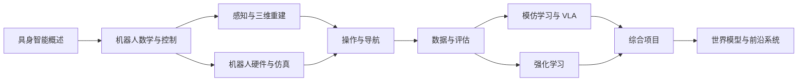

# Every Embodied 教材学习地图

这份学习地图负责回答三个问题：应该从哪里开始、哪些章节互相依赖、完成一条路线后能够做什么。目录编号保留仓库原有结构，卷册只用于组织学习顺序，不改变文件位置。

## 1. 全书能力结构

## 2. 第一卷：具身智能基础

| 顺序 | 专题 | 核心问题 | 学习产出 |
| --- | --- | --- | --- |
| 1 | [具身智能概述](./01-具身智能概述/README.md) | 具身系统由哪些模块组成 | 能画出感知、决策、控制和环境交互闭环 |
| 2 | [机器人基础与控制](./02-机器人基础和控制、手眼协调/README.md) | 如何描述和控制机器人运动 | 能计算坐标变换、正逆运动学和基础控制量 |
| 3 | [视觉与三维重建](./04-具身场景的计算机视觉、3D重建/README.md) | 机器人如何从图像获得目标和空间信息 | 能运行分割、定位、深度估计或建图示例 |

完成第一卷后，建议运行[最小 MuJoCo 示例](./examples/README.md)，把坐标、轨迹和物理步进联系起来。

## 3. 第二卷：学习与决策

| 顺序 | 专题 | 核心问题 | 学习产出 |
| --- | --- | --- | --- |
| 4 | [深度学习与强化学习](./05-具身场景的深度和强化学习/README.md) | 策略如何从奖励或数据中学习 | 能解释策略、价值、回放数据与训练曲线 |
| 5 | [机器人操作与运动控制](./07-机器人操作、运动控制/README.md) | 如何把目标转成可执行动作 | 能区分规划、控制、模仿学习和强化学习 |
| 6 | [VLA 策略](./06-策略抓取或抓取VLA/README.md) | 图像、语言和机器人状态如何生成动作 | 能完成数据准备、训练、推理和闭环评估 |
| 7 | [导航与 VLN](./08-具身导航及VLN/README.md) | 机器人如何定位、规划并理解语言目标 | 能运行导航基线并解释主要评估指标 |
| 8 | [数据与评估基准](./09-具身智能数据及评估基准benchmark/README.md) | 怎样构建可信的训练与评估协议 | 能检查数据结构、任务分母和结果统计 |

第二卷不是固定顺序。操作方向可以按 `05 → 07 → 06 → 09` 学习；导航方向可以按 `04 → 08 → 09` 学习。

## 4. 第三卷：系统与仿真

| 专题 | 适合的读者 | 主要内容 |
| --- | --- | --- |
| [硬件、LeRobot 与 RDK-X5](./03-机器人硬件、lerobot及地瓜RDK-X5开发板控制教程/README.md) | 需要连接相机、机械臂或边缘设备 | 系统烧录、设备通信、遥操作、传感器和数据采集 |
| [仿真工具与数据生成](./10-具身智能其他仿真工具及仿真前沿/README.md) | 需要选择或迁移仿真平台 | MuJoCo、Isaac、Genesis、柔体仿真和合成数据 |
| [工程辅助工具](./11-其他辅助工具/README.md) | 需要维护开发环境和调试链路 | 容器、远程开发、网络、日志和常用工具 |
| [机器人设计](./21-机械臂和机器人设计/README.md) | 需要构建机器人模型或结构件 | 参数化建模、格式导出、机器人描述与结构检查 |

第三卷各专题相对独立。先确定目标硬件或仿真平台，再进入对应实验，不需要一次安装所有工具。

## 5. 第四卷：前沿与项目

| 专题 | 内容类型 | 阅读方式 |
| --- | --- | --- |
| [前沿项目复现](./13-其他前沿项目复现/README.md) | 多模态机器人、无人机和综合应用 | 从项目目标开始，按环境、模型和评估顺序复现 |
| [竞赛案例](./15-Challenge竞赛/README.md) | 任务协议、基线和赛后复盘 | 先读规则与评估，再读实现和调试 |
| [专题组队学习](./16-专题组队学习/README.md) | 多周课程和完整实验链路 | 按专题内部任务顺序学习 |
| [具身世界模型](./17-具身世界模型/README.md) | 动作条件视频、状态预测和策略评估 | 先学习扩散模型基础，再进入具体系统 |
| [无人机专题](./18-无人机专题/README.md) | 动力学、控制、规划与轨迹优化 | 按控制基础到轨迹规划顺序学习 |

## 6. 附录与社区资料

- [面试问题汇总](./12-具身智能面试问题汇总/README.md)：用于知识回顾，不替代正文学习。
- [参考资料](./14-相关参考/README.md)：收录官方文档、论文、项目页和进一步阅读。
- [每月组队学习](./19-Datawhale每月组队学习/README.md)：保留历次课程安排和时间表。
- [内容发布档案](./20-公众号短文宣发/README.md)：保留面向社区的内容发布材料。

## 7. 学习检查点

完成一条路线后，可以用下面的问题检查是否真正掌握：

1. 能否说明观测、状态、动作、奖励和任务成功条件分别来自哪里？
2. 能否在不改任务定义的情况下运行一个最小示例并找到输出文件？
3. 能否区分环境链路检查、短训练检查和正式评估？
4. 能否解释训练数据与评估初始状态之间的差异？
5. 能否根据日志、视频和指标定位失败发生在哪个阶段？

如果其中两项无法回答，先回到对应基础专题，再继续大型模型或综合项目。
